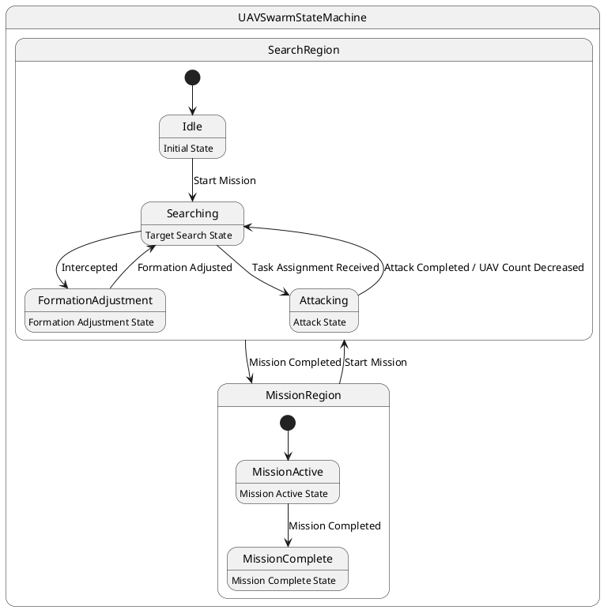

# Pair `0046`：NL + PlantUML STM0 + FCSTM STM0

[上一组 `0045`](../0045/README.md) | [返回 60 组索引](../../PAIR_INDEX.md) | [下一组 `0047`](../0047/README.md)

- LLM：`DeepSeek`
- 模型/场景：UAV swarm state machine diagram
- 作者输出阶段：`Result with Semantic Checking`
- 作者输出单元格：`AE48`；Excel row：`48`
- Phase-I fallback：`false`
- 相对 Phase-I 是否变化：`true`
- Phase-I PlantUML SHA-256：`709704f395b88943b357c62d4b4c1f93cb2b1e09ef0f72f8f26648de311b99fc`
- NL SHA-256：`a01c022f5380700b6c13800497291640b4d64abbadce1d8984be0c14880ebeb3`
- PlantUML SHA-256：`de64704c2571b8915067365e1dfe1b336b93228e5776eeca7fcf92a9a29d9ddc`
- FCSTM SHA-256：`1b1d4744daa8291b98cbdd0ee8bbaeb0337bcf92915c852bfde05a11e96948c9`
- review subject SHA-256：`52a1c335f04fcb604bf7f3ad9a62632e124ccb92e7dae802f33680bc38f8b6b0`
- working contract SHA-256：`aa668d55df04d4f9ed38c24fdc3fbf8a60be05fd1be00408aa6cd4908448653e`
- 结构裁决：`structure_preserved`
- source states / transitions：`9` / `10`
- mapped / blocked / silent drop：`10` / `0` / `0`
- final / lifecycle / body coverage：`0/0` / `0/0` / `6/6`
- concurrent region / separator coverage：`0/0` / `0/0`
- source normalization coverage：`0/0`
- official raw / validation：`state_diagram` / `state_diagram`
- official identity states / transitions：`9` / `10`
- official identity remaps：state `0` / transition endpoint `0`
- AST audit：`passed`
- legacy whole-model FCSTM execution / Discover：`false` / `false`
- working bundle usage gate：`discover_input_with_capability_mask`
- ownership source / compiler / agent：`25` / `28` / `0`
- source macro / positive identity trace / conversion boundary trace：`16` / `25` / `0`
- capability source-static / simulation / transition-trace：`eligible_with_exclusions` / `ineligible` / `ineligible`
- compiler-only diagnostic policy：`rejected_conversion_artifact`；main-result conversion artifact limit：`0`
- 主 session 对读：`pass`；ownership/macro/capability 均为 `pass`；Case 0046 passes the current attribution-safe forward review; this does not assert global behavior equivalence, and unsupported runtime semantics remain fail-closed.
- source anchors：`source-ref:llms_emp_feedback_final_0046.puml:line:2\|state UAVSwarmStateMachine {, source-ref:llms_emp_feedback_final_0046.puml:line:9\|Searching --> FormationAdjustment : Intercepted`；FCSTM anchors：`element-ref:source:state:UAVSwarmStateMachine@line:10\|state UAVSwarmStateMachine named "UAVSwarmStateMachine" {, element-ref:compiler:transition_segment:tr_0003:segment:1@line:18\|Searching -> FormationAdjustment : /Intercepted;`
- 三个原始文件：[NL](./nl.txt) | [PlantUML](./plantuml.puml) | [FCSTM](./fcstm.fcstm)
- 审计入口：[canonical](../../canonical/llms_emp_feedback_final_0046.json) | [冻结 FCSTM](../../fcstm/llms_emp_feedback_final_0046.fcstm) | [case report](../../case_reports/llms_emp_feedback_final_0046.json) | [working contract](../../working_contracts/llms_emp_feedback_final_0046.json) | [source trace](../../source_traces/llms_emp_feedback_final_0046.json) | [人工总账](../../MANUAL_REVIEW.md)

## 主 session 三方语义对应

| projection | assessment | NL anchor | PlantUML anchor | FCSTM anchor | source roots | compiler members | rationale |
|---|---|---|---|---|---|---|---|
| `direct` | `preserved` | 1 This state machine model describes the state transitions of a UAV swarm. | source-ref:llms_emp_feedback_final_0046.puml:line:2\|state UAVSwarmStateMachine { | element-ref:source:state:UAVSwarmStateMachine@line:10\|state UAVSwarmStateMachine named "UAVSwarmStateMachine" { | source:state:UAVSwarmStateMachine | - | Case 0046 binds source:state:UAVSwarmStateMachine to authored PlantUML occurrence 'state UAVSwarmStateMachine {' and current FCSTM occurrence 'state UAVSwarmStateMachine named "UAVSwarmStateMachine" {'; the source semantic root remains attributable while any compiler-owned projection stays protected and cannot become an independent Repair target. |
| `macro` | `preserved_with_exclusions` | intercepted | source-ref:llms_emp_feedback_final_0046.puml:line:9\|Searching --> FormationAdjustment : Intercepted | element-ref:compiler:transition_segment:tr_0003:segment:1@line:18\|Searching -> FormationAdjustment : /Intercepted; | source:transition:tr_0003 | compiler:transition_segment:tr_0003:segment:1 | Case 0046 binds source:transition:tr_0003 to authored PlantUML occurrence 'Searching --> FormationAdjustment : Intercepted' and current FCSTM occurrence 'Searching -> FormationAdjustment : /Intercepted;'; the source semantic root remains attributable while any compiler-owned projection stays protected and cannot become an independent Repair target. |

## Risk occurrence 第二遍复核

| obligation | risk tag | assessment | PlantUML evidence | FCSTM evidence | ownership evidence | rationale |
|---|---|---|---|---|---|---|
| `review:multi_segment_macro:0001:tr_0009` | `multi_segment_macro` | `compiler_artifact_excluded` | source-ref:llms_emp_feedback_final_0046.puml:line:27\|SearchRegion --> MissionRegion : Mission Completed, source-ref:llms_emp_feedback_final_0046.puml:line:28\|MissionRegion --> SearchRegion : Start Mission | element-ref:compiler:route_control:R45RouteToken@line:1\|def int R45RouteToken = 0;, element-ref:compiler:transition_segment:tr_0009:segment:1@line:22\|Idle -> [*] : /Mission_Completed effect { R45RouteToken = 9; };, element-ref:compiler:transition_segment:tr_0009:segment:2@line:23\|Searching -> [*] : /Mission_Completed effect { R45RouteToken = 9; };, element-ref:compiler:transition_segment:tr_0009:segment:3@line:24\|FormationAdjustment -> [*] : /Mission_Completed effect { R45RouteToken = 9; };, element-ref:compiler:transition_segment:tr_0009:segment:4@line:25\|Attacking -> [*] : /Mission_Completed effect { R45RouteToken = 9; };, element-ref:compiler:transition_segment:tr_0009:segment:5@line:36\|SearchRegion -> MissionRegion : if [R45RouteToken == 9] effect { R45RouteToken = 0; }; | compiler:route_control:R45RouteToken, compiler:transition_segment:tr_0009:segment:1, compiler:transition_segment:tr_0009:segment:2, compiler:transition_segment:tr_0009:segment:3, compiler:transition_segment:tr_0009:segment:4, compiler:transition_segment:tr_0009:segment:5, source:transition:tr_0009 | Case 0046 multi_segment_macro occurrence review:multi_segment_macro:0001:tr_0009 binds exact source refs to working-contract elements compiler:route_control:R45RouteToken, compiler:transition_segment:tr_0009:segment:1, compiler:transition_segment:tr_0009:segment:2, compiler:transition_segment:tr_0009:segment:3, compiler:transition_segment:tr_0009:segment:4, compiler:transition_segment:tr_0009:segment:5, source:transition:tr_0009. All emitted segments collapse to one source transition root; no segment is promoted as a separate authored transition or editable issue target. |
| `review:route_controller:0002:tr_0009` | `route_controller` | `compiler_artifact_excluded` | source-ref:llms_emp_feedback_final_0046.puml:line:27\|SearchRegion --> MissionRegion : Mission Completed, source-ref:llms_emp_feedback_final_0046.puml:line:28\|MissionRegion --> SearchRegion : Start Mission | element-ref:compiler:route_control:R45RouteToken@line:1\|def int R45RouteToken = 0;, element-ref:compiler:transition_segment:tr_0009:segment:1@line:22\|Idle -> [*] : /Mission_Completed effect { R45RouteToken = 9; };, element-ref:compiler:transition_segment:tr_0009:segment:2@line:23\|Searching -> [*] : /Mission_Completed effect { R45RouteToken = 9; };, element-ref:compiler:transition_segment:tr_0009:segment:3@line:24\|FormationAdjustment -> [*] : /Mission_Completed effect { R45RouteToken = 9; };, element-ref:compiler:transition_segment:tr_0009:segment:4@line:25\|Attacking -> [*] : /Mission_Completed effect { R45RouteToken = 9; };, element-ref:compiler:transition_segment:tr_0009:segment:5@line:36\|SearchRegion -> MissionRegion : if [R45RouteToken == 9] effect { R45RouteToken = 0; }; | compiler:route_control:R45RouteToken, compiler:transition_segment:tr_0009:segment:1, compiler:transition_segment:tr_0009:segment:2, compiler:transition_segment:tr_0009:segment:3, compiler:transition_segment:tr_0009:segment:4, compiler:transition_segment:tr_0009:segment:5, source:transition:tr_0009 | Case 0046 route_controller occurrence review:route_controller:0002:tr_0009 binds exact source refs to working-contract elements compiler:route_control:R45RouteToken, compiler:transition_segment:tr_0009:segment:1, compiler:transition_segment:tr_0009:segment:2, compiler:transition_segment:tr_0009:segment:3, compiler:transition_segment:tr_0009:segment:4, compiler:transition_segment:tr_0009:segment:5, source:transition:tr_0009. R45RouteToken and routed segments remain compiler_owned, protected, and excluded from confirmed issues, Repair, Confirm acceptance, and main results. |
| `review:multi_segment_macro:0003:tr_0010` | `multi_segment_macro` | `compiler_artifact_excluded` | source-ref:llms_emp_feedback_final_0046.puml:line:27\|SearchRegion --> MissionRegion : Mission Completed, source-ref:llms_emp_feedback_final_0046.puml:line:28\|MissionRegion --> SearchRegion : Start Mission | element-ref:compiler:route_control:R45RouteToken@line:1\|def int R45RouteToken = 0;, element-ref:compiler:transition_segment:tr_0010:segment:1@line:32\|MissionActive -> [*] : /Start_Mission effect { R45RouteToken = 10; };, element-ref:compiler:transition_segment:tr_0010:segment:2@line:33\|MissionComplete -> [*] : /Start_Mission effect { R45RouteToken = 10; };, element-ref:compiler:transition_segment:tr_0010:segment:3@line:37\|MissionRegion -> SearchRegion : if [R45RouteToken == 10] effect { R45RouteToken = 0; }; | compiler:route_control:R45RouteToken, compiler:transition_segment:tr_0010:segment:1, compiler:transition_segment:tr_0010:segment:2, compiler:transition_segment:tr_0010:segment:3, source:transition:tr_0010 | Case 0046 multi_segment_macro occurrence review:multi_segment_macro:0003:tr_0010 binds exact source refs to working-contract elements compiler:route_control:R45RouteToken, compiler:transition_segment:tr_0010:segment:1, compiler:transition_segment:tr_0010:segment:2, compiler:transition_segment:tr_0010:segment:3, source:transition:tr_0010. All emitted segments collapse to one source transition root; no segment is promoted as a separate authored transition or editable issue target. |
| `review:route_controller:0004:tr_0010` | `route_controller` | `compiler_artifact_excluded` | source-ref:llms_emp_feedback_final_0046.puml:line:27\|SearchRegion --> MissionRegion : Mission Completed, source-ref:llms_emp_feedback_final_0046.puml:line:28\|MissionRegion --> SearchRegion : Start Mission | element-ref:compiler:route_control:R45RouteToken@line:1\|def int R45RouteToken = 0;, element-ref:compiler:transition_segment:tr_0010:segment:1@line:32\|MissionActive -> [*] : /Start_Mission effect { R45RouteToken = 10; };, element-ref:compiler:transition_segment:tr_0010:segment:2@line:33\|MissionComplete -> [*] : /Start_Mission effect { R45RouteToken = 10; };, element-ref:compiler:transition_segment:tr_0010:segment:3@line:37\|MissionRegion -> SearchRegion : if [R45RouteToken == 10] effect { R45RouteToken = 0; }; | compiler:route_control:R45RouteToken, compiler:transition_segment:tr_0010:segment:1, compiler:transition_segment:tr_0010:segment:2, compiler:transition_segment:tr_0010:segment:3, source:transition:tr_0010 | Case 0046 route_controller occurrence review:route_controller:0004:tr_0010 binds exact source refs to working-contract elements compiler:route_control:R45RouteToken, compiler:transition_segment:tr_0010:segment:1, compiler:transition_segment:tr_0010:segment:2, compiler:transition_segment:tr_0010:segment:3, source:transition:tr_0010. R45RouteToken and routed segments remain compiler_owned, protected, and excluded from confirmed issues, Repair, Confirm acceptance, and main results. |
| `review:synthetic_state:0005:001-UnspecifiedInitial` | `synthetic_state` | `compiler_artifact_excluded` | source-ref:llms_emp_feedback_final_0046.puml:line:2\|state UAVSwarmStateMachine { | element-ref:compiler:state:llms_emp_feedback_final_0046.UnspecifiedInitial@line:9\|state UnspecifiedInitial named "Unspecified initial";, element-ref:source:state:UAVSwarmStateMachine@line:10\|state UAVSwarmStateMachine named "UAVSwarmStateMachine" { | compiler:state:llms_emp_feedback_final_0046.UnspecifiedInitial, source:state:UAVSwarmStateMachine | Case 0046 synthetic_state occurrence review:synthetic_state:0005:001-UnspecifiedInitial binds exact source refs to working-contract elements compiler:state:llms_emp_feedback_final_0046.UnspecifiedInitial, source:state:UAVSwarmStateMachine. The placeholder makes the authored missing, invalid, or final boundary visible while the synthetic state itself remains a non-repairable compiler artifact. |
| `review:synthetic_state:0006:002-UnspecifiedInitial` | `synthetic_state` | `compiler_artifact_excluded` | source-ref:llms_emp_feedback_final_0046.puml:line:2\|state UAVSwarmStateMachine { | element-ref:compiler:state:llms_emp_feedback_final_0046.UAVSwarmStateMachine.UnspecifiedInitial@line:35\|state UnspecifiedInitial named "Unspecified initial";, element-ref:source:state:UAVSwarmStateMachine@line:10\|state UAVSwarmStateMachine named "UAVSwarmStateMachine" { | compiler:state:llms_emp_feedback_final_0046.UAVSwarmStateMachine.UnspecifiedInitial, source:state:UAVSwarmStateMachine | Case 0046 synthetic_state occurrence review:synthetic_state:0006:002-UnspecifiedInitial binds exact source refs to working-contract elements compiler:state:llms_emp_feedback_final_0046.UAVSwarmStateMachine.UnspecifiedInitial, source:state:UAVSwarmStateMachine. The placeholder makes the authored missing, invalid, or final boundary visible while the synthetic state itself remains a non-repairable compiler artifact. |

## 作者阶段 lineage

| stage | output cell | present | output SHA-256 | feedback | resolved |
|---|---|---|---|---|---|
| `phase_i_generation` | `I48` | `true` | `709704f395b88943b357c62d4b4c1f93cb2b1e09ef0f72f8f26648de311b99fc` | - | - |
| `phase_ii_format` | `U48` | `true` | `b3023ff8047c0dfd30780c30a8e285c085a73de7857077baa08c47655bfa297c` | syntax error: stm UAVSwarmStateMachine [UAV Swarm State Machine] | YES |
| `phase_ii_grammar` | `Z48` | `false` | `-` | - | - |
| `phase_ii_semantic` | `AE48` | `true` | `de64704c2571b8915067365e1dfe1b336b93228e5776eeca7fcf92a9a29d9ddc` | 1. missing regions | - |

## Official identity ledger

- status：`aligned`
- canonical / official states：`9` / `9`
- aligned transition endpoints：`10`

本组 state identity 无需重映射。

本组 transition endpoint 无需重映射。

## Source normalization ledger

本组没有 source-input normalization。

## Concurrent region ledger

本组没有 PlantUML orthogonal/concurrent region separator。

## Operational debt

| reason code | count |
|---|---:|
| `R45.DEBT.composite_source_activation_dispatch` | 2 |
| `R45.DEBT.missing_explicit_initial` | 2 |
| `R45.DEBT.opaque_state_body_semantics` | 6 |
| `R45.DEBT.opaque_transition_label_semantics` | 8 |

## NL

```text
1 This state machine model describes the state transitions of a UAV swarm.
2 Before the mission is completed, the UAV swarm continuously performs target search tasks, during which it operates within three different state areas.
3 When the UAV swarm is intercepted, it transitions to the formation adjustment state.
4 During flight, if task assignment information is received, it enters the attack state. After completing the attack, the number of UAVs in the swarm decreases accordingly.
```

## 作者 Phase-II 最终 PlantUML STM0



## 转换后 FCSTM STM0

```fcstm
def int R45RouteToken = 0;
state llms_emp_feedback_final_0046 named "llms_emp_feedback_final_0046" {
    event Start_Mission named "Start Mission";
    event Intercepted named "Intercepted";
    event Task_Assignment_Received named "Task Assignment Received";
    event Formation_Adjusted named "Formation Adjusted";
    event Attack_Completed_UAV_Count_Decreased named "Attack Completed / UAV Count Decreased";
    event Mission_Completed named "Mission Completed";
    state UnspecifiedInitial named "Unspecified initial";
    state UAVSwarmStateMachine named "UAVSwarmStateMachine" {
        state SearchRegion named "SearchRegion" {
            state Idle named "Idle\n[PlantUML body] Initial State";
            state Searching named "Searching\n[PlantUML body] Target Search State";
            state FormationAdjustment named "FormationAdjustment\n[PlantUML body] Formation Adjustment State";
            state Attacking named "Attacking\n[PlantUML body] Attack State";
            [*] -> Idle;
            Idle -> Searching : /Start_Mission;
            Searching -> FormationAdjustment : /Intercepted;
            Searching -> Attacking : /Task_Assignment_Received;
            FormationAdjustment -> Searching : /Formation_Adjusted;
            Attacking -> Searching : /Attack_Completed_UAV_Count_Decreased;
            Idle -> [*] : /Mission_Completed effect { R45RouteToken = 9; };
            Searching -> [*] : /Mission_Completed effect { R45RouteToken = 9; };
            FormationAdjustment -> [*] : /Mission_Completed effect { R45RouteToken = 9; };
            Attacking -> [*] : /Mission_Completed effect { R45RouteToken = 9; };
        }
        state MissionRegion named "MissionRegion" {
            state MissionActive named "MissionActive\n[PlantUML body] Mission Active State";
            state MissionComplete named "MissionComplete\n[PlantUML body] Mission Complete State";
            [*] -> MissionActive;
            MissionActive -> MissionComplete : /Mission_Completed;
            MissionActive -> [*] : /Start_Mission effect { R45RouteToken = 10; };
            MissionComplete -> [*] : /Start_Mission effect { R45RouteToken = 10; };
        }
        state UnspecifiedInitial named "Unspecified initial";
        SearchRegion -> MissionRegion : if [R45RouteToken == 9] effect { R45RouteToken = 0; };
        MissionRegion -> SearchRegion : if [R45RouteToken == 10] effect { R45RouteToken = 0; };
        [*] -> UnspecifiedInitial;
    }
    [*] -> UnspecifiedInitial;
}
```

[上一组 `0045`](../0045/README.md) | [返回 60 组索引](../../PAIR_INDEX.md) | [下一组 `0047`](../0047/README.md)
