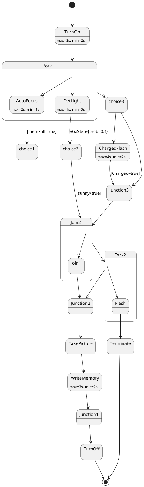

# Pair `0048`：NL + PlantUML STM0 + FCSTM STM0

[上一组 `0047`](../0047/README.md) | [返回 60 组索引](../../PAIR_INDEX.md) | [下一组 `0049`](../0049/README.md)

- LLM：`DeepSeek`
- 模型/场景： Digital camera state machine diagrams
- 作者输出阶段：`Result with Semantic Checking`
- 作者输出单元格：`AE50`；Excel row：`50`
- Phase-I fallback：`false`
- 相对 Phase-I 是否变化：`true`
- Phase-I PlantUML SHA-256：`91951da63cfb9eef882f8f3b45d69fbba6c22dcc4c1f1247dd4a7f91a2f079ab`
- NL SHA-256：`6af3966c8b0e12004a22622cded88b07df6fef9d558534442e3309694543c76d`
- PlantUML SHA-256：`a1de42bed4d559454458b8b096b06dfbebcb660775f1e864fdc87f6980ffcdfb`
- FCSTM SHA-256：`26050eac80c22e521c3c84c73a4598162edb21554f955edf26dbb31031ca1627`
- review subject SHA-256：`eb5eb3a25dd16a402d51fcacaf95a59e023408444497114279827e8ed76099d5`
- working contract SHA-256：`3da39694391f11f5bcdd2870125f64cc32819b3a036fff42e5cfca8a3817b626`
- 结构裁决：`structure_preserved`
- source states / transitions：`19` / `24`
- mapped / blocked / silent drop：`24` / `0` / `0`
- final / lifecycle / body coverage：`2/2` / `0/0` / `5/5`
- concurrent region / separator coverage：`0/0` / `0/0`
- source normalization coverage：`0/0`
- official raw / validation：`state_diagram` / `state_diagram`
- official identity states / transitions：`19` / `24`
- official identity remaps：state `2` / transition endpoint `0`
- AST audit：`passed`
- legacy whole-model FCSTM execution / Discover：`false` / `false`
- working bundle usage gate：`discover_input_with_capability_mask`
- ownership source / compiler / agent：`48` / `61` / `0`
- source macro / positive identity trace / conversion boundary trace：`29` / `48` / `0`
- capability source-static / simulation / transition-trace：`eligible_with_exclusions` / `ineligible` / `ineligible`
- compiler-only diagnostic policy：`rejected_conversion_artifact`；main-result conversion artifact limit：`0`
- 主 session 对读：`pass`；ownership/macro/capability 均为 `pass`；Case 0048 passes the current attribution-safe forward review; this does not assert global behavior equivalence, and unsupported runtime semantics remain fail-closed.
- source anchors：`source-ref:llms_emp_feedback_final_0048.puml:line:6\|state fork1 <<fork>> {, source-ref:llms_emp_feedback_final_0048.puml:line:12\|AutoFocus --> choice1 : [memFull=true]`；FCSTM anchors：`element-ref:source:state:fork1@line:7\|state fork1 named "fork1" {, element-ref:compiler:route_control:R45RouteToken@line:1\|def int R45RouteToken = 0;`
- 三个原始文件：[NL](./nl.txt) | [PlantUML](./plantuml.puml) | [FCSTM](./fcstm.fcstm)
- 审计入口：[canonical](../../canonical/llms_emp_feedback_final_0048.json) | [冻结 FCSTM](../../fcstm/llms_emp_feedback_final_0048.fcstm) | [case report](../../case_reports/llms_emp_feedback_final_0048.json) | [working contract](../../working_contracts/llms_emp_feedback_final_0048.json) | [source trace](../../source_traces/llms_emp_feedback_final_0048.json) | [人工总账](../../MANUAL_REVIEW.md)

## 主 session 三方语义对应

| projection | assessment | NL anchor | PlantUML anchor | FCSTM anchor | source roots | compiler members | rationale |
|---|---|---|---|---|---|---|---|
| `direct` | `preserved` | fork1 | source-ref:llms_emp_feedback_final_0048.puml:line:6\|state fork1 <<fork>> { | element-ref:source:state:fork1@line:7\|state fork1 named "fork1" { | source:state:fork1 | - | Case 0048 binds source:state:fork1 to authored PlantUML occurrence 'state fork1 <<fork>> {' and current FCSTM occurrence 'state fork1 named "fork1" {'; the source semantic root remains attributable while any compiler-owned projection stays protected and cannot become an independent Repair target. |
| `macro` | `preserved_with_exclusions` | AutoFocus | source-ref:llms_emp_feedback_final_0048.puml:line:12\|AutoFocus --> choice1 : [memFull=true] | element-ref:compiler:route_control:R45RouteToken@line:1\|def int R45RouteToken = 0; | source:transition:tr_0005 | compiler:route_control:R45RouteToken | Case 0048 binds source:transition:tr_0005 to authored PlantUML occurrence 'AutoFocus --> choice1 : [memFull=true]' and current FCSTM occurrence 'def int R45RouteToken = 0;'; the source semantic root remains attributable while any compiler-owned projection stays protected and cannot become an independent Repair target. |

## Risk occurrence 第二遍复核

| obligation | risk tag | assessment | PlantUML evidence | FCSTM evidence | ownership evidence | rationale |
|---|---|---|---|---|---|---|
| `review:official_identity_remap:0001:state-001` | `official_identity_remap` | `source_fact_preserved` | source-ref:llms_emp_feedback_final_0048.puml:line:11\|AutoFocus : max=2s, min=1s | element-ref:source:state:fork1.AutoFocus@line:8\|state AutoFocus named "AutoFocus\n[PlantUML body] max=2s, min=1s"; | source:state:fork1.AutoFocus | Case 0048 official_identity_remap occurrence review:official_identity_remap:0001:state-001 binds exact source refs to working-contract elements source:state:fork1.AutoFocus. The pinned PlantUML identity decision is preserved as a source fact and is not replaced by a lexical-scope guess from the converter. |
| `review:official_identity_remap:0002:state-002` | `official_identity_remap` | `source_fact_preserved` | source-ref:llms_emp_feedback_final_0048.puml:line:14\|DetLight : max=1s, min=0s | element-ref:source:state:fork1.DetLight@line:9\|state DetLight named "DetLight\n[PlantUML body] max=1s, min=0s"; | source:state:fork1.DetLight | Case 0048 official_identity_remap occurrence review:official_identity_remap:0002:state-002 binds exact source refs to working-contract elements source:state:fork1.DetLight. The pinned PlantUML identity decision is preserved as a source fact and is not replaced by a lexical-scope guess from the converter. |
| `review:multi_segment_macro:0003:tr_0003` | `multi_segment_macro` | `compiler_artifact_excluded` | source-ref:llms_emp_feedback_final_0048.puml:line:12\|AutoFocus --> choice1 : [memFull=true], source-ref:llms_emp_feedback_final_0048.puml:line:15\|DetLight --> choice2 : <<GaStep>>{prob=0.4}, source-ref:llms_emp_feedback_final_0048.puml:line:17\|fork1 --> choice3, source-ref:llms_emp_feedback_final_0048.puml:line:26\|Join2 --> Join1, source-ref:llms_emp_feedback_final_0048.puml:line:28\|Join1 --> Junction2, source-ref:llms_emp_feedback_final_0048.puml:line:37\|Join2 --> Fork2, source-ref:llms_emp_feedback_final_0048.puml:line:39\|Fork2 --> Junction2, source-ref:llms_emp_feedback_final_0048.puml:line:40\|Fork2 --> Flash, source-ref:llms_emp_feedback_final_0048.puml:line:42\|Flash --> Terminate, source-ref:llms_emp_feedback_final_0048.puml:line:7\|fork1 --> AutoFocus, source-ref:llms_emp_feedback_final_0048.puml:line:8\|fork1 --> DetLight | element-ref:compiler:route_control:R45RouteToken@line:1\|def int R45RouteToken = 0;, element-ref:compiler:transition_segment:tr_0003:segment:1@line:14\|AutoFocus -> [*] effect { R45RouteToken = 3; };, element-ref:compiler:transition_segment:tr_0003:segment:2@line:15\|DetLight -> [*] effect { R45RouteToken = 3; };, element-ref:compiler:transition_segment:tr_0003:segment:3@line:60\|fork1 -> fork1 : if [R45RouteToken == 3];, element-ref:compiler:transition_segment:tr_0003:segment:4@line:11\|[*] -> AutoFocus : if [R45RouteToken == 3] effect { R45RouteToken = 0; };, element-ref:compiler:transition_segment:tr_0003:segment:5@line:22\|UnspecifiedInitial -> [*] effect { R45RouteToken = 3; }; | compiler:route_control:R45RouteToken, compiler:transition_segment:tr_0003:segment:1, compiler:transition_segment:tr_0003:segment:2, compiler:transition_segment:tr_0003:segment:3, compiler:transition_segment:tr_0003:segment:4, compiler:transition_segment:tr_0003:segment:5, source:transition:tr_0003 | Case 0048 multi_segment_macro occurrence review:multi_segment_macro:0003:tr_0003 binds exact source refs to working-contract elements compiler:route_control:R45RouteToken, compiler:transition_segment:tr_0003:segment:1, compiler:transition_segment:tr_0003:segment:2, compiler:transition_segment:tr_0003:segment:3, compiler:transition_segment:tr_0003:segment:4, compiler:transition_segment:tr_0003:segment:5, source:transition:tr_0003. All emitted segments collapse to one source transition root; no segment is promoted as a separate authored transition or editable issue target. |
| `review:route_controller:0004:tr_0003` | `route_controller` | `compiler_artifact_excluded` | source-ref:llms_emp_feedback_final_0048.puml:line:12\|AutoFocus --> choice1 : [memFull=true], source-ref:llms_emp_feedback_final_0048.puml:line:15\|DetLight --> choice2 : <<GaStep>>{prob=0.4}, source-ref:llms_emp_feedback_final_0048.puml:line:17\|fork1 --> choice3, source-ref:llms_emp_feedback_final_0048.puml:line:26\|Join2 --> Join1, source-ref:llms_emp_feedback_final_0048.puml:line:28\|Join1 --> Junction2, source-ref:llms_emp_feedback_final_0048.puml:line:37\|Join2 --> Fork2, source-ref:llms_emp_feedback_final_0048.puml:line:39\|Fork2 --> Junction2, source-ref:llms_emp_feedback_final_0048.puml:line:40\|Fork2 --> Flash, source-ref:llms_emp_feedback_final_0048.puml:line:42\|Flash --> Terminate, source-ref:llms_emp_feedback_final_0048.puml:line:7\|fork1 --> AutoFocus, source-ref:llms_emp_feedback_final_0048.puml:line:8\|fork1 --> DetLight | element-ref:compiler:route_control:R45RouteToken@line:1\|def int R45RouteToken = 0;, element-ref:compiler:transition_segment:tr_0003:segment:1@line:14\|AutoFocus -> [*] effect { R45RouteToken = 3; };, element-ref:compiler:transition_segment:tr_0003:segment:2@line:15\|DetLight -> [*] effect { R45RouteToken = 3; };, element-ref:compiler:transition_segment:tr_0003:segment:3@line:60\|fork1 -> fork1 : if [R45RouteToken == 3];, element-ref:compiler:transition_segment:tr_0003:segment:4@line:11\|[*] -> AutoFocus : if [R45RouteToken == 3] effect { R45RouteToken = 0; };, element-ref:compiler:transition_segment:tr_0003:segment:5@line:22\|UnspecifiedInitial -> [*] effect { R45RouteToken = 3; }; | compiler:route_control:R45RouteToken, compiler:transition_segment:tr_0003:segment:1, compiler:transition_segment:tr_0003:segment:2, compiler:transition_segment:tr_0003:segment:3, compiler:transition_segment:tr_0003:segment:4, compiler:transition_segment:tr_0003:segment:5, source:transition:tr_0003 | Case 0048 route_controller occurrence review:route_controller:0004:tr_0003 binds exact source refs to working-contract elements compiler:route_control:R45RouteToken, compiler:transition_segment:tr_0003:segment:1, compiler:transition_segment:tr_0003:segment:2, compiler:transition_segment:tr_0003:segment:3, compiler:transition_segment:tr_0003:segment:4, compiler:transition_segment:tr_0003:segment:5, source:transition:tr_0003. R45RouteToken and routed segments remain compiler_owned, protected, and excluded from confirmed issues, Repair, Confirm acceptance, and main results. |
| `review:multi_segment_macro:0005:tr_0004` | `multi_segment_macro` | `compiler_artifact_excluded` | source-ref:llms_emp_feedback_final_0048.puml:line:12\|AutoFocus --> choice1 : [memFull=true], source-ref:llms_emp_feedback_final_0048.puml:line:15\|DetLight --> choice2 : <<GaStep>>{prob=0.4}, source-ref:llms_emp_feedback_final_0048.puml:line:17\|fork1 --> choice3, source-ref:llms_emp_feedback_final_0048.puml:line:26\|Join2 --> Join1, source-ref:llms_emp_feedback_final_0048.puml:line:28\|Join1 --> Junction2, source-ref:llms_emp_feedback_final_0048.puml:line:37\|Join2 --> Fork2, source-ref:llms_emp_feedback_final_0048.puml:line:39\|Fork2 --> Junction2, source-ref:llms_emp_feedback_final_0048.puml:line:40\|Fork2 --> Flash, source-ref:llms_emp_feedback_final_0048.puml:line:42\|Flash --> Terminate, source-ref:llms_emp_feedback_final_0048.puml:line:7\|fork1 --> AutoFocus, source-ref:llms_emp_feedback_final_0048.puml:line:8\|fork1 --> DetLight | element-ref:compiler:route_control:R45RouteToken@line:1\|def int R45RouteToken = 0;, element-ref:compiler:transition_segment:tr_0004:segment:1@line:16\|AutoFocus -> [*] effect { R45RouteToken = 4; };, element-ref:compiler:transition_segment:tr_0004:segment:2@line:17\|DetLight -> [*] effect { R45RouteToken = 4; };, element-ref:compiler:transition_segment:tr_0004:segment:3@line:61\|fork1 -> fork1 : if [R45RouteToken == 4];, element-ref:compiler:transition_segment:tr_0004:segment:4@line:12\|[*] -> DetLight : if [R45RouteToken == 4] effect { R45RouteToken = 0; };, element-ref:compiler:transition_segment:tr_0004:segment:5@line:23\|UnspecifiedInitial -> [*] effect { R45RouteToken = 4; }; | compiler:route_control:R45RouteToken, compiler:transition_segment:tr_0004:segment:1, compiler:transition_segment:tr_0004:segment:2, compiler:transition_segment:tr_0004:segment:3, compiler:transition_segment:tr_0004:segment:4, compiler:transition_segment:tr_0004:segment:5, source:transition:tr_0004 | Case 0048 multi_segment_macro occurrence review:multi_segment_macro:0005:tr_0004 binds exact source refs to working-contract elements compiler:route_control:R45RouteToken, compiler:transition_segment:tr_0004:segment:1, compiler:transition_segment:tr_0004:segment:2, compiler:transition_segment:tr_0004:segment:3, compiler:transition_segment:tr_0004:segment:4, compiler:transition_segment:tr_0004:segment:5, source:transition:tr_0004. All emitted segments collapse to one source transition root; no segment is promoted as a separate authored transition or editable issue target. |
| `review:route_controller:0006:tr_0004` | `route_controller` | `compiler_artifact_excluded` | source-ref:llms_emp_feedback_final_0048.puml:line:12\|AutoFocus --> choice1 : [memFull=true], source-ref:llms_emp_feedback_final_0048.puml:line:15\|DetLight --> choice2 : <<GaStep>>{prob=0.4}, source-ref:llms_emp_feedback_final_0048.puml:line:17\|fork1 --> choice3, source-ref:llms_emp_feedback_final_0048.puml:line:26\|Join2 --> Join1, source-ref:llms_emp_feedback_final_0048.puml:line:28\|Join1 --> Junction2, source-ref:llms_emp_feedback_final_0048.puml:line:37\|Join2 --> Fork2, source-ref:llms_emp_feedback_final_0048.puml:line:39\|Fork2 --> Junction2, source-ref:llms_emp_feedback_final_0048.puml:line:40\|Fork2 --> Flash, source-ref:llms_emp_feedback_final_0048.puml:line:42\|Flash --> Terminate, source-ref:llms_emp_feedback_final_0048.puml:line:7\|fork1 --> AutoFocus, source-ref:llms_emp_feedback_final_0048.puml:line:8\|fork1 --> DetLight | element-ref:compiler:route_control:R45RouteToken@line:1\|def int R45RouteToken = 0;, element-ref:compiler:transition_segment:tr_0004:segment:1@line:16\|AutoFocus -> [*] effect { R45RouteToken = 4; };, element-ref:compiler:transition_segment:tr_0004:segment:2@line:17\|DetLight -> [*] effect { R45RouteToken = 4; };, element-ref:compiler:transition_segment:tr_0004:segment:3@line:61\|fork1 -> fork1 : if [R45RouteToken == 4];, element-ref:compiler:transition_segment:tr_0004:segment:4@line:12\|[*] -> DetLight : if [R45RouteToken == 4] effect { R45RouteToken = 0; };, element-ref:compiler:transition_segment:tr_0004:segment:5@line:23\|UnspecifiedInitial -> [*] effect { R45RouteToken = 4; }; | compiler:route_control:R45RouteToken, compiler:transition_segment:tr_0004:segment:1, compiler:transition_segment:tr_0004:segment:2, compiler:transition_segment:tr_0004:segment:3, compiler:transition_segment:tr_0004:segment:4, compiler:transition_segment:tr_0004:segment:5, source:transition:tr_0004 | Case 0048 route_controller occurrence review:route_controller:0006:tr_0004 binds exact source refs to working-contract elements compiler:route_control:R45RouteToken, compiler:transition_segment:tr_0004:segment:1, compiler:transition_segment:tr_0004:segment:2, compiler:transition_segment:tr_0004:segment:3, compiler:transition_segment:tr_0004:segment:4, compiler:transition_segment:tr_0004:segment:5, source:transition:tr_0004. R45RouteToken and routed segments remain compiler_owned, protected, and excluded from confirmed issues, Repair, Confirm acceptance, and main results. |
| `review:multi_segment_macro:0007:tr_0005` | `multi_segment_macro` | `compiler_artifact_excluded` | source-ref:llms_emp_feedback_final_0048.puml:line:12\|AutoFocus --> choice1 : [memFull=true], source-ref:llms_emp_feedback_final_0048.puml:line:15\|DetLight --> choice2 : <<GaStep>>{prob=0.4}, source-ref:llms_emp_feedback_final_0048.puml:line:17\|fork1 --> choice3, source-ref:llms_emp_feedback_final_0048.puml:line:26\|Join2 --> Join1, source-ref:llms_emp_feedback_final_0048.puml:line:28\|Join1 --> Junction2, source-ref:llms_emp_feedback_final_0048.puml:line:37\|Join2 --> Fork2, source-ref:llms_emp_feedback_final_0048.puml:line:39\|Fork2 --> Junction2, source-ref:llms_emp_feedback_final_0048.puml:line:40\|Fork2 --> Flash, source-ref:llms_emp_feedback_final_0048.puml:line:42\|Flash --> Terminate, source-ref:llms_emp_feedback_final_0048.puml:line:7\|fork1 --> AutoFocus, source-ref:llms_emp_feedback_final_0048.puml:line:8\|fork1 --> DetLight | element-ref:compiler:route_control:R45RouteToken@line:1\|def int R45RouteToken = 0;, element-ref:compiler:transition_segment:tr_0005:segment:1@line:18\|AutoFocus -> [*] : /_memFull_true effect { R45RouteToken = 5; };, element-ref:compiler:transition_segment:tr_0005:segment:2@line:62\|fork1 -> choice1 : if [R45RouteToken == 5] effect { R45RouteToken = 0; }; | compiler:route_control:R45RouteToken, compiler:transition_segment:tr_0005:segment:1, compiler:transition_segment:tr_0005:segment:2, source:transition:tr_0005 | Case 0048 multi_segment_macro occurrence review:multi_segment_macro:0007:tr_0005 binds exact source refs to working-contract elements compiler:route_control:R45RouteToken, compiler:transition_segment:tr_0005:segment:1, compiler:transition_segment:tr_0005:segment:2, source:transition:tr_0005. All emitted segments collapse to one source transition root; no segment is promoted as a separate authored transition or editable issue target. |
| `review:route_controller:0008:tr_0005` | `route_controller` | `compiler_artifact_excluded` | source-ref:llms_emp_feedback_final_0048.puml:line:12\|AutoFocus --> choice1 : [memFull=true], source-ref:llms_emp_feedback_final_0048.puml:line:15\|DetLight --> choice2 : <<GaStep>>{prob=0.4}, source-ref:llms_emp_feedback_final_0048.puml:line:17\|fork1 --> choice3, source-ref:llms_emp_feedback_final_0048.puml:line:26\|Join2 --> Join1, source-ref:llms_emp_feedback_final_0048.puml:line:28\|Join1 --> Junction2, source-ref:llms_emp_feedback_final_0048.puml:line:37\|Join2 --> Fork2, source-ref:llms_emp_feedback_final_0048.puml:line:39\|Fork2 --> Junction2, source-ref:llms_emp_feedback_final_0048.puml:line:40\|Fork2 --> Flash, source-ref:llms_emp_feedback_final_0048.puml:line:42\|Flash --> Terminate, source-ref:llms_emp_feedback_final_0048.puml:line:7\|fork1 --> AutoFocus, source-ref:llms_emp_feedback_final_0048.puml:line:8\|fork1 --> DetLight | element-ref:compiler:route_control:R45RouteToken@line:1\|def int R45RouteToken = 0;, element-ref:compiler:transition_segment:tr_0005:segment:1@line:18\|AutoFocus -> [*] : /_memFull_true effect { R45RouteToken = 5; };, element-ref:compiler:transition_segment:tr_0005:segment:2@line:62\|fork1 -> choice1 : if [R45RouteToken == 5] effect { R45RouteToken = 0; }; | compiler:route_control:R45RouteToken, compiler:transition_segment:tr_0005:segment:1, compiler:transition_segment:tr_0005:segment:2, source:transition:tr_0005 | Case 0048 route_controller occurrence review:route_controller:0008:tr_0005 binds exact source refs to working-contract elements compiler:route_control:R45RouteToken, compiler:transition_segment:tr_0005:segment:1, compiler:transition_segment:tr_0005:segment:2, source:transition:tr_0005. R45RouteToken and routed segments remain compiler_owned, protected, and excluded from confirmed issues, Repair, Confirm acceptance, and main results. |
| `review:multi_segment_macro:0009:tr_0006` | `multi_segment_macro` | `compiler_artifact_excluded` | source-ref:llms_emp_feedback_final_0048.puml:line:12\|AutoFocus --> choice1 : [memFull=true], source-ref:llms_emp_feedback_final_0048.puml:line:15\|DetLight --> choice2 : <<GaStep>>{prob=0.4}, source-ref:llms_emp_feedback_final_0048.puml:line:17\|fork1 --> choice3, source-ref:llms_emp_feedback_final_0048.puml:line:26\|Join2 --> Join1, source-ref:llms_emp_feedback_final_0048.puml:line:28\|Join1 --> Junction2, source-ref:llms_emp_feedback_final_0048.puml:line:37\|Join2 --> Fork2, source-ref:llms_emp_feedback_final_0048.puml:line:39\|Fork2 --> Junction2, source-ref:llms_emp_feedback_final_0048.puml:line:40\|Fork2 --> Flash, source-ref:llms_emp_feedback_final_0048.puml:line:42\|Flash --> Terminate, source-ref:llms_emp_feedback_final_0048.puml:line:7\|fork1 --> AutoFocus, source-ref:llms_emp_feedback_final_0048.puml:line:8\|fork1 --> DetLight | element-ref:compiler:route_control:R45RouteToken@line:1\|def int R45RouteToken = 0;, element-ref:compiler:transition_segment:tr_0006:segment:1@line:19\|DetLight -> [*] : /_GaStep_prob_0_4 effect { R45RouteToken = 6; };, element-ref:compiler:transition_segment:tr_0006:segment:2@line:63\|fork1 -> choice2 : if [R45RouteToken == 6] effect { R45RouteToken = 0; }; | compiler:route_control:R45RouteToken, compiler:transition_segment:tr_0006:segment:1, compiler:transition_segment:tr_0006:segment:2, source:transition:tr_0006 | Case 0048 multi_segment_macro occurrence review:multi_segment_macro:0009:tr_0006 binds exact source refs to working-contract elements compiler:route_control:R45RouteToken, compiler:transition_segment:tr_0006:segment:1, compiler:transition_segment:tr_0006:segment:2, source:transition:tr_0006. All emitted segments collapse to one source transition root; no segment is promoted as a separate authored transition or editable issue target. |
| `review:route_controller:0010:tr_0006` | `route_controller` | `compiler_artifact_excluded` | source-ref:llms_emp_feedback_final_0048.puml:line:12\|AutoFocus --> choice1 : [memFull=true], source-ref:llms_emp_feedback_final_0048.puml:line:15\|DetLight --> choice2 : <<GaStep>>{prob=0.4}, source-ref:llms_emp_feedback_final_0048.puml:line:17\|fork1 --> choice3, source-ref:llms_emp_feedback_final_0048.puml:line:26\|Join2 --> Join1, source-ref:llms_emp_feedback_final_0048.puml:line:28\|Join1 --> Junction2, source-ref:llms_emp_feedback_final_0048.puml:line:37\|Join2 --> Fork2, source-ref:llms_emp_feedback_final_0048.puml:line:39\|Fork2 --> Junction2, source-ref:llms_emp_feedback_final_0048.puml:line:40\|Fork2 --> Flash, source-ref:llms_emp_feedback_final_0048.puml:line:42\|Flash --> Terminate, source-ref:llms_emp_feedback_final_0048.puml:line:7\|fork1 --> AutoFocus, source-ref:llms_emp_feedback_final_0048.puml:line:8\|fork1 --> DetLight | element-ref:compiler:route_control:R45RouteToken@line:1\|def int R45RouteToken = 0;, element-ref:compiler:transition_segment:tr_0006:segment:1@line:19\|DetLight -> [*] : /_GaStep_prob_0_4 effect { R45RouteToken = 6; };, element-ref:compiler:transition_segment:tr_0006:segment:2@line:63\|fork1 -> choice2 : if [R45RouteToken == 6] effect { R45RouteToken = 0; }; | compiler:route_control:R45RouteToken, compiler:transition_segment:tr_0006:segment:1, compiler:transition_segment:tr_0006:segment:2, source:transition:tr_0006 | Case 0048 route_controller occurrence review:route_controller:0010:tr_0006 binds exact source refs to working-contract elements compiler:route_control:R45RouteToken, compiler:transition_segment:tr_0006:segment:1, compiler:transition_segment:tr_0006:segment:2, source:transition:tr_0006. R45RouteToken and routed segments remain compiler_owned, protected, and excluded from confirmed issues, Repair, Confirm acceptance, and main results. |
| `review:multi_segment_macro:0011:tr_0007` | `multi_segment_macro` | `compiler_artifact_excluded` | source-ref:llms_emp_feedback_final_0048.puml:line:12\|AutoFocus --> choice1 : [memFull=true], source-ref:llms_emp_feedback_final_0048.puml:line:15\|DetLight --> choice2 : <<GaStep>>{prob=0.4}, source-ref:llms_emp_feedback_final_0048.puml:line:17\|fork1 --> choice3, source-ref:llms_emp_feedback_final_0048.puml:line:26\|Join2 --> Join1, source-ref:llms_emp_feedback_final_0048.puml:line:28\|Join1 --> Junction2, source-ref:llms_emp_feedback_final_0048.puml:line:37\|Join2 --> Fork2, source-ref:llms_emp_feedback_final_0048.puml:line:39\|Fork2 --> Junction2, source-ref:llms_emp_feedback_final_0048.puml:line:40\|Fork2 --> Flash, source-ref:llms_emp_feedback_final_0048.puml:line:42\|Flash --> Terminate, source-ref:llms_emp_feedback_final_0048.puml:line:7\|fork1 --> AutoFocus, source-ref:llms_emp_feedback_final_0048.puml:line:8\|fork1 --> DetLight | element-ref:compiler:route_control:R45RouteToken@line:1\|def int R45RouteToken = 0;, element-ref:compiler:transition_segment:tr_0007:segment:1@line:20\|AutoFocus -> [*] effect { R45RouteToken = 7; };, element-ref:compiler:transition_segment:tr_0007:segment:2@line:21\|DetLight -> [*] effect { R45RouteToken = 7; };, element-ref:compiler:transition_segment:tr_0007:segment:3@line:64\|fork1 -> choice3 : if [R45RouteToken == 7] effect { R45RouteToken = 0; };, element-ref:compiler:transition_segment:tr_0007:segment:4@line:24\|UnspecifiedInitial -> [*] effect { R45RouteToken = 7; }; | compiler:route_control:R45RouteToken, compiler:transition_segment:tr_0007:segment:1, compiler:transition_segment:tr_0007:segment:2, compiler:transition_segment:tr_0007:segment:3, compiler:transition_segment:tr_0007:segment:4, source:transition:tr_0007 | Case 0048 multi_segment_macro occurrence review:multi_segment_macro:0011:tr_0007 binds exact source refs to working-contract elements compiler:route_control:R45RouteToken, compiler:transition_segment:tr_0007:segment:1, compiler:transition_segment:tr_0007:segment:2, compiler:transition_segment:tr_0007:segment:3, compiler:transition_segment:tr_0007:segment:4, source:transition:tr_0007. All emitted segments collapse to one source transition root; no segment is promoted as a separate authored transition or editable issue target. |
| `review:route_controller:0012:tr_0007` | `route_controller` | `compiler_artifact_excluded` | source-ref:llms_emp_feedback_final_0048.puml:line:12\|AutoFocus --> choice1 : [memFull=true], source-ref:llms_emp_feedback_final_0048.puml:line:15\|DetLight --> choice2 : <<GaStep>>{prob=0.4}, source-ref:llms_emp_feedback_final_0048.puml:line:17\|fork1 --> choice3, source-ref:llms_emp_feedback_final_0048.puml:line:26\|Join2 --> Join1, source-ref:llms_emp_feedback_final_0048.puml:line:28\|Join1 --> Junction2, source-ref:llms_emp_feedback_final_0048.puml:line:37\|Join2 --> Fork2, source-ref:llms_emp_feedback_final_0048.puml:line:39\|Fork2 --> Junction2, source-ref:llms_emp_feedback_final_0048.puml:line:40\|Fork2 --> Flash, source-ref:llms_emp_feedback_final_0048.puml:line:42\|Flash --> Terminate, source-ref:llms_emp_feedback_final_0048.puml:line:7\|fork1 --> AutoFocus, source-ref:llms_emp_feedback_final_0048.puml:line:8\|fork1 --> DetLight | element-ref:compiler:route_control:R45RouteToken@line:1\|def int R45RouteToken = 0;, element-ref:compiler:transition_segment:tr_0007:segment:1@line:20\|AutoFocus -> [*] effect { R45RouteToken = 7; };, element-ref:compiler:transition_segment:tr_0007:segment:2@line:21\|DetLight -> [*] effect { R45RouteToken = 7; };, element-ref:compiler:transition_segment:tr_0007:segment:3@line:64\|fork1 -> choice3 : if [R45RouteToken == 7] effect { R45RouteToken = 0; };, element-ref:compiler:transition_segment:tr_0007:segment:4@line:24\|UnspecifiedInitial -> [*] effect { R45RouteToken = 7; }; | compiler:route_control:R45RouteToken, compiler:transition_segment:tr_0007:segment:1, compiler:transition_segment:tr_0007:segment:2, compiler:transition_segment:tr_0007:segment:3, compiler:transition_segment:tr_0007:segment:4, source:transition:tr_0007 | Case 0048 route_controller occurrence review:route_controller:0012:tr_0007 binds exact source refs to working-contract elements compiler:route_control:R45RouteToken, compiler:transition_segment:tr_0007:segment:1, compiler:transition_segment:tr_0007:segment:2, compiler:transition_segment:tr_0007:segment:3, compiler:transition_segment:tr_0007:segment:4, source:transition:tr_0007. R45RouteToken and routed segments remain compiler_owned, protected, and excluded from confirmed issues, Repair, Confirm acceptance, and main results. |
| `review:multi_segment_macro:0013:tr_0013` | `multi_segment_macro` | `compiler_artifact_excluded` | source-ref:llms_emp_feedback_final_0048.puml:line:12\|AutoFocus --> choice1 : [memFull=true], source-ref:llms_emp_feedback_final_0048.puml:line:15\|DetLight --> choice2 : <<GaStep>>{prob=0.4}, source-ref:llms_emp_feedback_final_0048.puml:line:17\|fork1 --> choice3, source-ref:llms_emp_feedback_final_0048.puml:line:26\|Join2 --> Join1, source-ref:llms_emp_feedback_final_0048.puml:line:28\|Join1 --> Junction2, source-ref:llms_emp_feedback_final_0048.puml:line:37\|Join2 --> Fork2, source-ref:llms_emp_feedback_final_0048.puml:line:39\|Fork2 --> Junction2, source-ref:llms_emp_feedback_final_0048.puml:line:40\|Fork2 --> Flash, source-ref:llms_emp_feedback_final_0048.puml:line:42\|Flash --> Terminate, source-ref:llms_emp_feedback_final_0048.puml:line:7\|fork1 --> AutoFocus, source-ref:llms_emp_feedback_final_0048.puml:line:8\|fork1 --> DetLight | element-ref:compiler:route_control:R45RouteToken@line:1\|def int R45RouteToken = 0;, element-ref:compiler:transition_segment:tr_0013:segment:1@line:31\|Join1 -> [*] effect { R45RouteToken = 13; };, element-ref:compiler:transition_segment:tr_0013:segment:2@line:65\|Join2 -> Join2 : if [R45RouteToken == 13];, element-ref:compiler:transition_segment:tr_0013:segment:3@line:29\|[*] -> Join1 : if [R45RouteToken == 13] effect { R45RouteToken = 0; };, element-ref:compiler:transition_segment:tr_0013:segment:4@line:34\|UnspecifiedInitial -> [*] effect { R45RouteToken = 13; }; | compiler:route_control:R45RouteToken, compiler:transition_segment:tr_0013:segment:1, compiler:transition_segment:tr_0013:segment:2, compiler:transition_segment:tr_0013:segment:3, compiler:transition_segment:tr_0013:segment:4, source:transition:tr_0013 | Case 0048 multi_segment_macro occurrence review:multi_segment_macro:0013:tr_0013 binds exact source refs to working-contract elements compiler:route_control:R45RouteToken, compiler:transition_segment:tr_0013:segment:1, compiler:transition_segment:tr_0013:segment:2, compiler:transition_segment:tr_0013:segment:3, compiler:transition_segment:tr_0013:segment:4, source:transition:tr_0013. All emitted segments collapse to one source transition root; no segment is promoted as a separate authored transition or editable issue target. |
| `review:route_controller:0014:tr_0013` | `route_controller` | `compiler_artifact_excluded` | source-ref:llms_emp_feedback_final_0048.puml:line:12\|AutoFocus --> choice1 : [memFull=true], source-ref:llms_emp_feedback_final_0048.puml:line:15\|DetLight --> choice2 : <<GaStep>>{prob=0.4}, source-ref:llms_emp_feedback_final_0048.puml:line:17\|fork1 --> choice3, source-ref:llms_emp_feedback_final_0048.puml:line:26\|Join2 --> Join1, source-ref:llms_emp_feedback_final_0048.puml:line:28\|Join1 --> Junction2, source-ref:llms_emp_feedback_final_0048.puml:line:37\|Join2 --> Fork2, source-ref:llms_emp_feedback_final_0048.puml:line:39\|Fork2 --> Junction2, source-ref:llms_emp_feedback_final_0048.puml:line:40\|Fork2 --> Flash, source-ref:llms_emp_feedback_final_0048.puml:line:42\|Flash --> Terminate, source-ref:llms_emp_feedback_final_0048.puml:line:7\|fork1 --> AutoFocus, source-ref:llms_emp_feedback_final_0048.puml:line:8\|fork1 --> DetLight | element-ref:compiler:route_control:R45RouteToken@line:1\|def int R45RouteToken = 0;, element-ref:compiler:transition_segment:tr_0013:segment:1@line:31\|Join1 -> [*] effect { R45RouteToken = 13; };, element-ref:compiler:transition_segment:tr_0013:segment:2@line:65\|Join2 -> Join2 : if [R45RouteToken == 13];, element-ref:compiler:transition_segment:tr_0013:segment:3@line:29\|[*] -> Join1 : if [R45RouteToken == 13] effect { R45RouteToken = 0; };, element-ref:compiler:transition_segment:tr_0013:segment:4@line:34\|UnspecifiedInitial -> [*] effect { R45RouteToken = 13; }; | compiler:route_control:R45RouteToken, compiler:transition_segment:tr_0013:segment:1, compiler:transition_segment:tr_0013:segment:2, compiler:transition_segment:tr_0013:segment:3, compiler:transition_segment:tr_0013:segment:4, source:transition:tr_0013 | Case 0048 route_controller occurrence review:route_controller:0014:tr_0013 binds exact source refs to working-contract elements compiler:route_control:R45RouteToken, compiler:transition_segment:tr_0013:segment:1, compiler:transition_segment:tr_0013:segment:2, compiler:transition_segment:tr_0013:segment:3, compiler:transition_segment:tr_0013:segment:4, source:transition:tr_0013. R45RouteToken and routed segments remain compiler_owned, protected, and excluded from confirmed issues, Repair, Confirm acceptance, and main results. |
| `review:multi_segment_macro:0015:tr_0014` | `multi_segment_macro` | `compiler_artifact_excluded` | source-ref:llms_emp_feedback_final_0048.puml:line:12\|AutoFocus --> choice1 : [memFull=true], source-ref:llms_emp_feedback_final_0048.puml:line:15\|DetLight --> choice2 : <<GaStep>>{prob=0.4}, source-ref:llms_emp_feedback_final_0048.puml:line:17\|fork1 --> choice3, source-ref:llms_emp_feedback_final_0048.puml:line:26\|Join2 --> Join1, source-ref:llms_emp_feedback_final_0048.puml:line:28\|Join1 --> Junction2, source-ref:llms_emp_feedback_final_0048.puml:line:37\|Join2 --> Fork2, source-ref:llms_emp_feedback_final_0048.puml:line:39\|Fork2 --> Junction2, source-ref:llms_emp_feedback_final_0048.puml:line:40\|Fork2 --> Flash, source-ref:llms_emp_feedback_final_0048.puml:line:42\|Flash --> Terminate, source-ref:llms_emp_feedback_final_0048.puml:line:7\|fork1 --> AutoFocus, source-ref:llms_emp_feedback_final_0048.puml:line:8\|fork1 --> DetLight | element-ref:compiler:route_control:R45RouteToken@line:1\|def int R45RouteToken = 0;, element-ref:compiler:transition_segment:tr_0014:segment:1@line:32\|Join1 -> [*] effect { R45RouteToken = 14; };, element-ref:compiler:transition_segment:tr_0014:segment:2@line:66\|Join2 -> Junction2 : if [R45RouteToken == 14] effect { R45RouteToken = 0; }; | compiler:route_control:R45RouteToken, compiler:transition_segment:tr_0014:segment:1, compiler:transition_segment:tr_0014:segment:2, source:transition:tr_0014 | Case 0048 multi_segment_macro occurrence review:multi_segment_macro:0015:tr_0014 binds exact source refs to working-contract elements compiler:route_control:R45RouteToken, compiler:transition_segment:tr_0014:segment:1, compiler:transition_segment:tr_0014:segment:2, source:transition:tr_0014. All emitted segments collapse to one source transition root; no segment is promoted as a separate authored transition or editable issue target. |
| `review:route_controller:0016:tr_0014` | `route_controller` | `compiler_artifact_excluded` | source-ref:llms_emp_feedback_final_0048.puml:line:12\|AutoFocus --> choice1 : [memFull=true], source-ref:llms_emp_feedback_final_0048.puml:line:15\|DetLight --> choice2 : <<GaStep>>{prob=0.4}, source-ref:llms_emp_feedback_final_0048.puml:line:17\|fork1 --> choice3, source-ref:llms_emp_feedback_final_0048.puml:line:26\|Join2 --> Join1, source-ref:llms_emp_feedback_final_0048.puml:line:28\|Join1 --> Junction2, source-ref:llms_emp_feedback_final_0048.puml:line:37\|Join2 --> Fork2, source-ref:llms_emp_feedback_final_0048.puml:line:39\|Fork2 --> Junction2, source-ref:llms_emp_feedback_final_0048.puml:line:40\|Fork2 --> Flash, source-ref:llms_emp_feedback_final_0048.puml:line:42\|Flash --> Terminate, source-ref:llms_emp_feedback_final_0048.puml:line:7\|fork1 --> AutoFocus, source-ref:llms_emp_feedback_final_0048.puml:line:8\|fork1 --> DetLight | element-ref:compiler:route_control:R45RouteToken@line:1\|def int R45RouteToken = 0;, element-ref:compiler:transition_segment:tr_0014:segment:1@line:32\|Join1 -> [*] effect { R45RouteToken = 14; };, element-ref:compiler:transition_segment:tr_0014:segment:2@line:66\|Join2 -> Junction2 : if [R45RouteToken == 14] effect { R45RouteToken = 0; }; | compiler:route_control:R45RouteToken, compiler:transition_segment:tr_0014:segment:1, compiler:transition_segment:tr_0014:segment:2, source:transition:tr_0014 | Case 0048 route_controller occurrence review:route_controller:0016:tr_0014 binds exact source refs to working-contract elements compiler:route_control:R45RouteToken, compiler:transition_segment:tr_0014:segment:1, compiler:transition_segment:tr_0014:segment:2, source:transition:tr_0014. R45RouteToken and routed segments remain compiler_owned, protected, and excluded from confirmed issues, Repair, Confirm acceptance, and main results. |
| `review:final_boundary:0017:tr_0019` | `final_boundary` | `source_fact_preserved` | source-ref:llms_emp_feedback_final_0048.puml:line:35\|TurnOff --> [*] | element-ref:compiler:transition_segment:tr_0019:segment:1@line:82\|TurnOff -> [*]; | compiler:transition_segment:tr_0019:segment:1, source:transition:tr_0019 | Case 0048 final_boundary occurrence review:final_boundary:0017:tr_0019 binds exact source refs to working-contract elements compiler:transition_segment:tr_0019:segment:1, source:transition:tr_0019. The authored final occurrence remains visible through its source root; any completion holder or routing segment is excluded from source-level claims. |
| `review:multi_segment_macro:0018:tr_0020` | `multi_segment_macro` | `compiler_artifact_excluded` | source-ref:llms_emp_feedback_final_0048.puml:line:12\|AutoFocus --> choice1 : [memFull=true], source-ref:llms_emp_feedback_final_0048.puml:line:15\|DetLight --> choice2 : <<GaStep>>{prob=0.4}, source-ref:llms_emp_feedback_final_0048.puml:line:17\|fork1 --> choice3, source-ref:llms_emp_feedback_final_0048.puml:line:26\|Join2 --> Join1, source-ref:llms_emp_feedback_final_0048.puml:line:28\|Join1 --> Junction2, source-ref:llms_emp_feedback_final_0048.puml:line:37\|Join2 --> Fork2, source-ref:llms_emp_feedback_final_0048.puml:line:39\|Fork2 --> Junction2, source-ref:llms_emp_feedback_final_0048.puml:line:40\|Fork2 --> Flash, source-ref:llms_emp_feedback_final_0048.puml:line:42\|Flash --> Terminate, source-ref:llms_emp_feedback_final_0048.puml:line:7\|fork1 --> AutoFocus, source-ref:llms_emp_feedback_final_0048.puml:line:8\|fork1 --> DetLight | element-ref:compiler:route_control:R45RouteToken@line:1\|def int R45RouteToken = 0;, element-ref:compiler:transition_segment:tr_0020:segment:1@line:33\|Join1 -> [*] effect { R45RouteToken = 20; };, element-ref:compiler:transition_segment:tr_0020:segment:2@line:67\|Join2 -> Fork2 : if [R45RouteToken == 20] effect { R45RouteToken = 0; };, element-ref:compiler:transition_segment:tr_0020:segment:3@line:35\|UnspecifiedInitial -> [*] effect { R45RouteToken = 20; }; | compiler:route_control:R45RouteToken, compiler:transition_segment:tr_0020:segment:1, compiler:transition_segment:tr_0020:segment:2, compiler:transition_segment:tr_0020:segment:3, source:transition:tr_0020 | Case 0048 multi_segment_macro occurrence review:multi_segment_macro:0018:tr_0020 binds exact source refs to working-contract elements compiler:route_control:R45RouteToken, compiler:transition_segment:tr_0020:segment:1, compiler:transition_segment:tr_0020:segment:2, compiler:transition_segment:tr_0020:segment:3, source:transition:tr_0020. All emitted segments collapse to one source transition root; no segment is promoted as a separate authored transition or editable issue target. |
| `review:route_controller:0019:tr_0020` | `route_controller` | `compiler_artifact_excluded` | source-ref:llms_emp_feedback_final_0048.puml:line:12\|AutoFocus --> choice1 : [memFull=true], source-ref:llms_emp_feedback_final_0048.puml:line:15\|DetLight --> choice2 : <<GaStep>>{prob=0.4}, source-ref:llms_emp_feedback_final_0048.puml:line:17\|fork1 --> choice3, source-ref:llms_emp_feedback_final_0048.puml:line:26\|Join2 --> Join1, source-ref:llms_emp_feedback_final_0048.puml:line:28\|Join1 --> Junction2, source-ref:llms_emp_feedback_final_0048.puml:line:37\|Join2 --> Fork2, source-ref:llms_emp_feedback_final_0048.puml:line:39\|Fork2 --> Junction2, source-ref:llms_emp_feedback_final_0048.puml:line:40\|Fork2 --> Flash, source-ref:llms_emp_feedback_final_0048.puml:line:42\|Flash --> Terminate, source-ref:llms_emp_feedback_final_0048.puml:line:7\|fork1 --> AutoFocus, source-ref:llms_emp_feedback_final_0048.puml:line:8\|fork1 --> DetLight | element-ref:compiler:route_control:R45RouteToken@line:1\|def int R45RouteToken = 0;, element-ref:compiler:transition_segment:tr_0020:segment:1@line:33\|Join1 -> [*] effect { R45RouteToken = 20; };, element-ref:compiler:transition_segment:tr_0020:segment:2@line:67\|Join2 -> Fork2 : if [R45RouteToken == 20] effect { R45RouteToken = 0; };, element-ref:compiler:transition_segment:tr_0020:segment:3@line:35\|UnspecifiedInitial -> [*] effect { R45RouteToken = 20; }; | compiler:route_control:R45RouteToken, compiler:transition_segment:tr_0020:segment:1, compiler:transition_segment:tr_0020:segment:2, compiler:transition_segment:tr_0020:segment:3, source:transition:tr_0020 | Case 0048 route_controller occurrence review:route_controller:0019:tr_0020 binds exact source refs to working-contract elements compiler:route_control:R45RouteToken, compiler:transition_segment:tr_0020:segment:1, compiler:transition_segment:tr_0020:segment:2, compiler:transition_segment:tr_0020:segment:3, source:transition:tr_0020. R45RouteToken and routed segments remain compiler_owned, protected, and excluded from confirmed issues, Repair, Confirm acceptance, and main results. |
| `review:multi_segment_macro:0020:tr_0021` | `multi_segment_macro` | `compiler_artifact_excluded` | source-ref:llms_emp_feedback_final_0048.puml:line:12\|AutoFocus --> choice1 : [memFull=true], source-ref:llms_emp_feedback_final_0048.puml:line:15\|DetLight --> choice2 : <<GaStep>>{prob=0.4}, source-ref:llms_emp_feedback_final_0048.puml:line:17\|fork1 --> choice3, source-ref:llms_emp_feedback_final_0048.puml:line:26\|Join2 --> Join1, source-ref:llms_emp_feedback_final_0048.puml:line:28\|Join1 --> Junction2, source-ref:llms_emp_feedback_final_0048.puml:line:37\|Join2 --> Fork2, source-ref:llms_emp_feedback_final_0048.puml:line:39\|Fork2 --> Junction2, source-ref:llms_emp_feedback_final_0048.puml:line:40\|Fork2 --> Flash, source-ref:llms_emp_feedback_final_0048.puml:line:42\|Flash --> Terminate, source-ref:llms_emp_feedback_final_0048.puml:line:7\|fork1 --> AutoFocus, source-ref:llms_emp_feedback_final_0048.puml:line:8\|fork1 --> DetLight | element-ref:compiler:route_control:R45RouteToken@line:1\|def int R45RouteToken = 0;, element-ref:compiler:transition_segment:tr_0021:segment:1@line:42\|Flash -> [*] effect { R45RouteToken = 21; };, element-ref:compiler:transition_segment:tr_0021:segment:2@line:68\|Fork2 -> Junction2 : if [R45RouteToken == 21] effect { R45RouteToken = 0; };, element-ref:compiler:transition_segment:tr_0021:segment:3@line:45\|UnspecifiedInitial -> [*] effect { R45RouteToken = 21; }; | compiler:route_control:R45RouteToken, compiler:transition_segment:tr_0021:segment:1, compiler:transition_segment:tr_0021:segment:2, compiler:transition_segment:tr_0021:segment:3, source:transition:tr_0021 | Case 0048 multi_segment_macro occurrence review:multi_segment_macro:0020:tr_0021 binds exact source refs to working-contract elements compiler:route_control:R45RouteToken, compiler:transition_segment:tr_0021:segment:1, compiler:transition_segment:tr_0021:segment:2, compiler:transition_segment:tr_0021:segment:3, source:transition:tr_0021. All emitted segments collapse to one source transition root; no segment is promoted as a separate authored transition or editable issue target. |
| `review:route_controller:0021:tr_0021` | `route_controller` | `compiler_artifact_excluded` | source-ref:llms_emp_feedback_final_0048.puml:line:12\|AutoFocus --> choice1 : [memFull=true], source-ref:llms_emp_feedback_final_0048.puml:line:15\|DetLight --> choice2 : <<GaStep>>{prob=0.4}, source-ref:llms_emp_feedback_final_0048.puml:line:17\|fork1 --> choice3, source-ref:llms_emp_feedback_final_0048.puml:line:26\|Join2 --> Join1, source-ref:llms_emp_feedback_final_0048.puml:line:28\|Join1 --> Junction2, source-ref:llms_emp_feedback_final_0048.puml:line:37\|Join2 --> Fork2, source-ref:llms_emp_feedback_final_0048.puml:line:39\|Fork2 --> Junction2, source-ref:llms_emp_feedback_final_0048.puml:line:40\|Fork2 --> Flash, source-ref:llms_emp_feedback_final_0048.puml:line:42\|Flash --> Terminate, source-ref:llms_emp_feedback_final_0048.puml:line:7\|fork1 --> AutoFocus, source-ref:llms_emp_feedback_final_0048.puml:line:8\|fork1 --> DetLight | element-ref:compiler:route_control:R45RouteToken@line:1\|def int R45RouteToken = 0;, element-ref:compiler:transition_segment:tr_0021:segment:1@line:42\|Flash -> [*] effect { R45RouteToken = 21; };, element-ref:compiler:transition_segment:tr_0021:segment:2@line:68\|Fork2 -> Junction2 : if [R45RouteToken == 21] effect { R45RouteToken = 0; };, element-ref:compiler:transition_segment:tr_0021:segment:3@line:45\|UnspecifiedInitial -> [*] effect { R45RouteToken = 21; }; | compiler:route_control:R45RouteToken, compiler:transition_segment:tr_0021:segment:1, compiler:transition_segment:tr_0021:segment:2, compiler:transition_segment:tr_0021:segment:3, source:transition:tr_0021 | Case 0048 route_controller occurrence review:route_controller:0021:tr_0021 binds exact source refs to working-contract elements compiler:route_control:R45RouteToken, compiler:transition_segment:tr_0021:segment:1, compiler:transition_segment:tr_0021:segment:2, compiler:transition_segment:tr_0021:segment:3, source:transition:tr_0021. R45RouteToken and routed segments remain compiler_owned, protected, and excluded from confirmed issues, Repair, Confirm acceptance, and main results. |
| `review:multi_segment_macro:0022:tr_0022` | `multi_segment_macro` | `compiler_artifact_excluded` | source-ref:llms_emp_feedback_final_0048.puml:line:12\|AutoFocus --> choice1 : [memFull=true], source-ref:llms_emp_feedback_final_0048.puml:line:15\|DetLight --> choice2 : <<GaStep>>{prob=0.4}, source-ref:llms_emp_feedback_final_0048.puml:line:17\|fork1 --> choice3, source-ref:llms_emp_feedback_final_0048.puml:line:26\|Join2 --> Join1, source-ref:llms_emp_feedback_final_0048.puml:line:28\|Join1 --> Junction2, source-ref:llms_emp_feedback_final_0048.puml:line:37\|Join2 --> Fork2, source-ref:llms_emp_feedback_final_0048.puml:line:39\|Fork2 --> Junction2, source-ref:llms_emp_feedback_final_0048.puml:line:40\|Fork2 --> Flash, source-ref:llms_emp_feedback_final_0048.puml:line:42\|Flash --> Terminate, source-ref:llms_emp_feedback_final_0048.puml:line:7\|fork1 --> AutoFocus, source-ref:llms_emp_feedback_final_0048.puml:line:8\|fork1 --> DetLight | element-ref:compiler:route_control:R45RouteToken@line:1\|def int R45RouteToken = 0;, element-ref:compiler:transition_segment:tr_0022:segment:1@line:43\|Flash -> [*] effect { R45RouteToken = 22; };, element-ref:compiler:transition_segment:tr_0022:segment:2@line:69\|Fork2 -> Fork2 : if [R45RouteToken == 22];, element-ref:compiler:transition_segment:tr_0022:segment:3@line:40\|[*] -> Flash : if [R45RouteToken == 22] effect { R45RouteToken = 0; };, element-ref:compiler:transition_segment:tr_0022:segment:4@line:46\|UnspecifiedInitial -> [*] effect { R45RouteToken = 22; }; | compiler:route_control:R45RouteToken, compiler:transition_segment:tr_0022:segment:1, compiler:transition_segment:tr_0022:segment:2, compiler:transition_segment:tr_0022:segment:3, compiler:transition_segment:tr_0022:segment:4, source:transition:tr_0022 | Case 0048 multi_segment_macro occurrence review:multi_segment_macro:0022:tr_0022 binds exact source refs to working-contract elements compiler:route_control:R45RouteToken, compiler:transition_segment:tr_0022:segment:1, compiler:transition_segment:tr_0022:segment:2, compiler:transition_segment:tr_0022:segment:3, compiler:transition_segment:tr_0022:segment:4, source:transition:tr_0022. All emitted segments collapse to one source transition root; no segment is promoted as a separate authored transition or editable issue target. |
| `review:route_controller:0023:tr_0022` | `route_controller` | `compiler_artifact_excluded` | source-ref:llms_emp_feedback_final_0048.puml:line:12\|AutoFocus --> choice1 : [memFull=true], source-ref:llms_emp_feedback_final_0048.puml:line:15\|DetLight --> choice2 : <<GaStep>>{prob=0.4}, source-ref:llms_emp_feedback_final_0048.puml:line:17\|fork1 --> choice3, source-ref:llms_emp_feedback_final_0048.puml:line:26\|Join2 --> Join1, source-ref:llms_emp_feedback_final_0048.puml:line:28\|Join1 --> Junction2, source-ref:llms_emp_feedback_final_0048.puml:line:37\|Join2 --> Fork2, source-ref:llms_emp_feedback_final_0048.puml:line:39\|Fork2 --> Junction2, source-ref:llms_emp_feedback_final_0048.puml:line:40\|Fork2 --> Flash, source-ref:llms_emp_feedback_final_0048.puml:line:42\|Flash --> Terminate, source-ref:llms_emp_feedback_final_0048.puml:line:7\|fork1 --> AutoFocus, source-ref:llms_emp_feedback_final_0048.puml:line:8\|fork1 --> DetLight | element-ref:compiler:route_control:R45RouteToken@line:1\|def int R45RouteToken = 0;, element-ref:compiler:transition_segment:tr_0022:segment:1@line:43\|Flash -> [*] effect { R45RouteToken = 22; };, element-ref:compiler:transition_segment:tr_0022:segment:2@line:69\|Fork2 -> Fork2 : if [R45RouteToken == 22];, element-ref:compiler:transition_segment:tr_0022:segment:3@line:40\|[*] -> Flash : if [R45RouteToken == 22] effect { R45RouteToken = 0; };, element-ref:compiler:transition_segment:tr_0022:segment:4@line:46\|UnspecifiedInitial -> [*] effect { R45RouteToken = 22; }; | compiler:route_control:R45RouteToken, compiler:transition_segment:tr_0022:segment:1, compiler:transition_segment:tr_0022:segment:2, compiler:transition_segment:tr_0022:segment:3, compiler:transition_segment:tr_0022:segment:4, source:transition:tr_0022 | Case 0048 route_controller occurrence review:route_controller:0023:tr_0022 binds exact source refs to working-contract elements compiler:route_control:R45RouteToken, compiler:transition_segment:tr_0022:segment:1, compiler:transition_segment:tr_0022:segment:2, compiler:transition_segment:tr_0022:segment:3, compiler:transition_segment:tr_0022:segment:4, source:transition:tr_0022. R45RouteToken and routed segments remain compiler_owned, protected, and excluded from confirmed issues, Repair, Confirm acceptance, and main results. |
| `review:multi_segment_macro:0024:tr_0023` | `multi_segment_macro` | `compiler_artifact_excluded` | source-ref:llms_emp_feedback_final_0048.puml:line:12\|AutoFocus --> choice1 : [memFull=true], source-ref:llms_emp_feedback_final_0048.puml:line:15\|DetLight --> choice2 : <<GaStep>>{prob=0.4}, source-ref:llms_emp_feedback_final_0048.puml:line:17\|fork1 --> choice3, source-ref:llms_emp_feedback_final_0048.puml:line:26\|Join2 --> Join1, source-ref:llms_emp_feedback_final_0048.puml:line:28\|Join1 --> Junction2, source-ref:llms_emp_feedback_final_0048.puml:line:37\|Join2 --> Fork2, source-ref:llms_emp_feedback_final_0048.puml:line:39\|Fork2 --> Junction2, source-ref:llms_emp_feedback_final_0048.puml:line:40\|Fork2 --> Flash, source-ref:llms_emp_feedback_final_0048.puml:line:42\|Flash --> Terminate, source-ref:llms_emp_feedback_final_0048.puml:line:7\|fork1 --> AutoFocus, source-ref:llms_emp_feedback_final_0048.puml:line:8\|fork1 --> DetLight | element-ref:compiler:route_control:R45RouteToken@line:1\|def int R45RouteToken = 0;, element-ref:compiler:transition_segment:tr_0023:segment:1@line:44\|Flash -> [*] effect { R45RouteToken = 23; };, element-ref:compiler:transition_segment:tr_0023:segment:2@line:70\|Fork2 -> Terminate : if [R45RouteToken == 23] effect { R45RouteToken = 0; }; | compiler:route_control:R45RouteToken, compiler:transition_segment:tr_0023:segment:1, compiler:transition_segment:tr_0023:segment:2, source:transition:tr_0023 | Case 0048 multi_segment_macro occurrence review:multi_segment_macro:0024:tr_0023 binds exact source refs to working-contract elements compiler:route_control:R45RouteToken, compiler:transition_segment:tr_0023:segment:1, compiler:transition_segment:tr_0023:segment:2, source:transition:tr_0023. All emitted segments collapse to one source transition root; no segment is promoted as a separate authored transition or editable issue target. |
| `review:route_controller:0025:tr_0023` | `route_controller` | `compiler_artifact_excluded` | source-ref:llms_emp_feedback_final_0048.puml:line:12\|AutoFocus --> choice1 : [memFull=true], source-ref:llms_emp_feedback_final_0048.puml:line:15\|DetLight --> choice2 : <<GaStep>>{prob=0.4}, source-ref:llms_emp_feedback_final_0048.puml:line:17\|fork1 --> choice3, source-ref:llms_emp_feedback_final_0048.puml:line:26\|Join2 --> Join1, source-ref:llms_emp_feedback_final_0048.puml:line:28\|Join1 --> Junction2, source-ref:llms_emp_feedback_final_0048.puml:line:37\|Join2 --> Fork2, source-ref:llms_emp_feedback_final_0048.puml:line:39\|Fork2 --> Junction2, source-ref:llms_emp_feedback_final_0048.puml:line:40\|Fork2 --> Flash, source-ref:llms_emp_feedback_final_0048.puml:line:42\|Flash --> Terminate, source-ref:llms_emp_feedback_final_0048.puml:line:7\|fork1 --> AutoFocus, source-ref:llms_emp_feedback_final_0048.puml:line:8\|fork1 --> DetLight | element-ref:compiler:route_control:R45RouteToken@line:1\|def int R45RouteToken = 0;, element-ref:compiler:transition_segment:tr_0023:segment:1@line:44\|Flash -> [*] effect { R45RouteToken = 23; };, element-ref:compiler:transition_segment:tr_0023:segment:2@line:70\|Fork2 -> Terminate : if [R45RouteToken == 23] effect { R45RouteToken = 0; }; | compiler:route_control:R45RouteToken, compiler:transition_segment:tr_0023:segment:1, compiler:transition_segment:tr_0023:segment:2, source:transition:tr_0023 | Case 0048 route_controller occurrence review:route_controller:0025:tr_0023 binds exact source refs to working-contract elements compiler:route_control:R45RouteToken, compiler:transition_segment:tr_0023:segment:1, compiler:transition_segment:tr_0023:segment:2, source:transition:tr_0023. R45RouteToken and routed segments remain compiler_owned, protected, and excluded from confirmed issues, Repair, Confirm acceptance, and main results. |
| `review:final_boundary:0026:tr_0024` | `final_boundary` | `source_fact_preserved` | source-ref:llms_emp_feedback_final_0048.puml:line:43\|Terminate --> [*] | element-ref:compiler:transition_segment:tr_0024:segment:1@line:83\|Terminate -> [*]; | compiler:transition_segment:tr_0024:segment:1, source:transition:tr_0024 | Case 0048 final_boundary occurrence review:final_boundary:0026:tr_0024 binds exact source refs to working-contract elements compiler:transition_segment:tr_0024:segment:1, source:transition:tr_0024. The authored final occurrence remains visible through its source root; any completion holder or routing segment is excluded from source-level claims. |
| `review:synthetic_state:0027:001-UnspecifiedInitial` | `synthetic_state` | `compiler_artifact_excluded` | source-ref:llms_emp_feedback_final_0048.puml:line:6\|state fork1 <<fork>> { | element-ref:compiler:state:llms_emp_feedback_final_0048.fork1.UnspecifiedInitial@line:10\|state UnspecifiedInitial named "Unspecified initial";, element-ref:source:state:fork1@line:7\|state fork1 named "fork1" { | compiler:state:llms_emp_feedback_final_0048.fork1.UnspecifiedInitial, source:state:fork1 | Case 0048 synthetic_state occurrence review:synthetic_state:0027:001-UnspecifiedInitial binds exact source refs to working-contract elements compiler:state:llms_emp_feedback_final_0048.fork1.UnspecifiedInitial, source:state:fork1. The placeholder makes the authored missing, invalid, or final boundary visible while the synthetic state itself remains a non-repairable compiler artifact. |
| `review:synthetic_state:0028:002-UnspecifiedInitial` | `synthetic_state` | `compiler_artifact_excluded` | source-ref:llms_emp_feedback_final_0048.puml:line:25\|state Join2 <<join>> { | element-ref:compiler:state:llms_emp_feedback_final_0048.Join2.UnspecifiedInitial@line:28\|state UnspecifiedInitial named "Unspecified initial";, element-ref:source:state:Join2@line:26\|state Join2 named "Join2" { | compiler:state:llms_emp_feedback_final_0048.Join2.UnspecifiedInitial, source:state:Join2 | Case 0048 synthetic_state occurrence review:synthetic_state:0028:002-UnspecifiedInitial binds exact source refs to working-contract elements compiler:state:llms_emp_feedback_final_0048.Join2.UnspecifiedInitial, source:state:Join2. The placeholder makes the authored missing, invalid, or final boundary visible while the synthetic state itself remains a non-repairable compiler artifact. |
| `review:synthetic_state:0029:003-UnspecifiedInitial` | `synthetic_state` | `compiler_artifact_excluded` | source-ref:llms_emp_feedback_final_0048.puml:line:38\|state Fork2 <<fork>> { | element-ref:compiler:state:llms_emp_feedback_final_0048.Fork2.UnspecifiedInitial@line:39\|state UnspecifiedInitial named "Unspecified initial";, element-ref:source:state:Fork2@line:37\|state Fork2 named "Fork2" { | compiler:state:llms_emp_feedback_final_0048.Fork2.UnspecifiedInitial, source:state:Fork2 | Case 0048 synthetic_state occurrence review:synthetic_state:0029:003-UnspecifiedInitial binds exact source refs to working-contract elements compiler:state:llms_emp_feedback_final_0048.Fork2.UnspecifiedInitial, source:state:Fork2. The placeholder makes the authored missing, invalid, or final boundary visible while the synthetic state itself remains a non-repairable compiler artifact. |
| `review:explicit_concurrency:0030:001-ambiguous_unlabeled_fanout` | `explicit_concurrency` | `capability_excluded` | source-ref:llms_emp_feedback_final_0048.puml:line:17\|fork1 --> choice3, source-ref:llms_emp_feedback_final_0048.puml:line:6\|state fork1 <<fork>> {, source-ref:llms_emp_feedback_final_0048.puml:line:7\|fork1 --> AutoFocus, source-ref:llms_emp_feedback_final_0048.puml:line:8\|fork1 --> DetLight | element-ref:compiler:route_control:R45RouteToken@line:1\|def int R45RouteToken = 0;, element-ref:source:state:fork1@line:7\|state fork1 named "fork1" { | source:state:fork1, source:transition:tr_0003, source:transition:tr_0004, source:transition:tr_0007 | Case 0048 explicit_concurrency occurrence review:explicit_concurrency:0030:001-ambiguous_unlabeled_fanout binds exact source refs to working-contract elements source:state:fork1, source:transition:tr_0003, source:transition:tr_0004, source:transition:tr_0007. The authored fork, join, or fan-out occurrence remains source-visible, while unsupported concurrent execution is capability_excluded rather than guessed. |
| `review:explicit_concurrency:0031:002-ambiguous_unlabeled_fanout` | `explicit_concurrency` | `capability_excluded` | source-ref:llms_emp_feedback_final_0048.puml:line:17\|fork1 --> choice3, source-ref:llms_emp_feedback_final_0048.puml:line:18\|choice3 --> ChargedFlash, source-ref:llms_emp_feedback_final_0048.puml:line:21\|choice3 --> Junction3 | element-ref:compiler:transition_segment:tr_0008:segment:1@line:73\|choice3 -> ChargedFlash;, element-ref:compiler:transition_segment:tr_0010:segment:1@line:75\|choice3 -> Junction3;, element-ref:source:state:choice3@line:51\|state choice3 named "choice3"; | source:state:choice3, source:transition:tr_0008, source:transition:tr_0010 | Case 0048 explicit_concurrency occurrence review:explicit_concurrency:0031:002-ambiguous_unlabeled_fanout binds exact source refs to working-contract elements source:state:choice3, source:transition:tr_0008, source:transition:tr_0010. The authored fork, join, or fan-out occurrence remains source-visible, while unsupported concurrent execution is capability_excluded rather than guessed. |
| `review:explicit_concurrency:0032:003-ambiguous_unlabeled_fanout` | `explicit_concurrency` | `capability_excluded` | source-ref:llms_emp_feedback_final_0048.puml:line:25\|state Join2 <<join>> {, source-ref:llms_emp_feedback_final_0048.puml:line:26\|Join2 --> Join1, source-ref:llms_emp_feedback_final_0048.puml:line:37\|Join2 --> Fork2 | element-ref:compiler:route_control:R45RouteToken@line:1\|def int R45RouteToken = 0;, element-ref:source:state:Join2@line:26\|state Join2 named "Join2" { | source:state:Join2, source:transition:tr_0013, source:transition:tr_0020 | Case 0048 explicit_concurrency occurrence review:explicit_concurrency:0032:003-ambiguous_unlabeled_fanout binds exact source refs to working-contract elements source:state:Join2, source:transition:tr_0013, source:transition:tr_0020. The authored fork, join, or fan-out occurrence remains source-visible, while unsupported concurrent execution is capability_excluded rather than guessed. |
| `review:explicit_concurrency:0033:004-ambiguous_unlabeled_fanout` | `explicit_concurrency` | `capability_excluded` | source-ref:llms_emp_feedback_final_0048.puml:line:38\|state Fork2 <<fork>> {, source-ref:llms_emp_feedback_final_0048.puml:line:39\|Fork2 --> Junction2, source-ref:llms_emp_feedback_final_0048.puml:line:40\|Fork2 --> Flash | element-ref:compiler:route_control:R45RouteToken@line:1\|def int R45RouteToken = 0;, element-ref:source:state:Fork2@line:37\|state Fork2 named "Fork2" { | source:state:Fork2, source:transition:tr_0021, source:transition:tr_0022 | Case 0048 explicit_concurrency occurrence review:explicit_concurrency:0033:004-ambiguous_unlabeled_fanout binds exact source refs to working-contract elements source:state:Fork2, source:transition:tr_0021, source:transition:tr_0022. The authored fork, join, or fan-out occurrence remains source-visible, while unsupported concurrent execution is capability_excluded rather than guessed. |

## 作者阶段 lineage

| stage | output cell | present | output SHA-256 | feedback | resolved |
|---|---|---|---|---|---|
| `phase_i_generation` | `I50` | `true` | `91951da63cfb9eef882f8f3b45d69fbba6c22dcc4c1f1247dd4a7f91a2f079ab` | - | - |
| `phase_ii_format` | `U50` | `true` | `4bc691dc6f9fc63dcf230550d577c9cea5fabef5cc5cd66089605e0585352d67` | syntax error: stm [stateMachine] SystemStateMachine [SystemStateMachineDiagram]<br> | YES |
| `phase_ii_grammar` | `Z50` | `false` | `-` | - | - |
| `phase_ii_semantic` | `AE50` | `true` | `a1de42bed4d559454458b8b096b06dfbebcb660775f1e864fdc87f6980ffcdfb` | 1. Missing Junction Pseudostate, Fork Pseudostate, Join <br>use state join1 <<join>> to represent join pseudostate | - |

## Official identity ledger

- status：`aligned`
- canonical / official states：`19` / `19`
- aligned transition endpoints：`24`

| source-parser identity | pinned PlantUML identity | raw ref | reason |
|---|---|---|---|
| `AutoFocus` | `fork1.AutoFocus` | `llms_emp_feedback_final_0048.puml:line:11` | `unique_official_entity_identity` |
| `DetLight` | `fork1.DetLight` | `llms_emp_feedback_final_0048.puml:line:14` | `unique_official_entity_identity` |

本组 transition endpoint 无需重映射。

## Source normalization ledger

本组没有 source-input normalization。

## Concurrent region ledger

本组没有 PlantUML orthogonal/concurrent region separator。

## Operational debt

| reason code | count |
|---|---:|
| `R45.DEBT.ambiguous_unlabeled_fanout` | 4 |
| `R45.DEBT.composite_source_activation_dispatch` | 7 |
| `R45.DEBT.composite_source_external_reentry` | 4 |
| `R45.DEBT.missing_explicit_initial` | 3 |
| `R45.DEBT.opaque_state_body_semantics` | 5 |
| `R45.DEBT.opaque_transition_label_semantics` | 4 |

## NL

```text
1. The system begins in the TurnOn state, which has two possible execution times, with a maximum of 2 seconds and a minimum of 2 seconds, before transitioning to the fork1 state.
2. The TurnOn state transitions into a fork1 state, which contains parallel paths leading to AutoFocus and DetLight.
3. The AutoFocus state has execution times of 2 seconds maximum and 1 second minimum before proceeding to the choice1 state, which is triggered when the condition memFull=true is true.
4. The DetLight state has execution times of 1 second maximum and 0 seconds minimum, transitioning to the choice2 state when the condition <>{prob=0.4} is met.
5. If the fork1 state transitions to choice3, it proceeds to the ChargedFlash state, which has execution times of 4 seconds maximum and 2 seconds minimum.
6. The ChargedFlash state can lead to Junction3, where the system starts and proceeds to the Join2 state. The transition occurs when Charged=true.
7. The choice3 state also transitions to Junction3, and once the system reaches Junction3, it joins the Join2 state.
8. The choice2 state transitions to Join2, and if the condition sunny=true is met, it further joins the Join1 state, which leads to Junction2.
9. In the Junction2 state, the system proceeds to TakePicture, followed by WriteMemory, with execution times of 3 seconds maximum and 2 seconds minimum.
10. After WriteMemory completes, the system enters Junction1 before proceeding to TurnOff, which ends the process and transitions back to the initial state, represented by [*].
11. In the Fork2 state, which is part of the Join2 substate, the system can either proceed to Junction2 or Flash. If the Flash state is activated, it transitions to Terminate, ending the sequence.
```

## 作者 Phase-II 最终 PlantUML STM0



## 转换后 FCSTM STM0

```fcstm
def int R45RouteToken = 0;
state llms_emp_feedback_final_0048 named "llms_emp_feedback_final_0048" {
    event _memFull_true named "[memFull=true]";
    event _GaStep_prob_0_4 named "<<GaStep>>{prob=0.4}";
    event _Charged_true named "[Charged=true]";
    event _sunny_true named "[sunny=true]";
    state fork1 named "fork1" {
        state AutoFocus named "AutoFocus\n[PlantUML body] max=2s, min=1s";
        state DetLight named "DetLight\n[PlantUML body] max=1s, min=0s";
        state UnspecifiedInitial named "Unspecified initial";
        [*] -> AutoFocus : if [R45RouteToken == 3] effect { R45RouteToken = 0; };
        [*] -> DetLight : if [R45RouteToken == 4] effect { R45RouteToken = 0; };
        [*] -> UnspecifiedInitial;
        AutoFocus -> [*] effect { R45RouteToken = 3; };
        DetLight -> [*] effect { R45RouteToken = 3; };
        AutoFocus -> [*] effect { R45RouteToken = 4; };
        DetLight -> [*] effect { R45RouteToken = 4; };
        AutoFocus -> [*] : /_memFull_true effect { R45RouteToken = 5; };
        DetLight -> [*] : /_GaStep_prob_0_4 effect { R45RouteToken = 6; };
        AutoFocus -> [*] effect { R45RouteToken = 7; };
        DetLight -> [*] effect { R45RouteToken = 7; };
        UnspecifiedInitial -> [*] effect { R45RouteToken = 3; };
        UnspecifiedInitial -> [*] effect { R45RouteToken = 4; };
        UnspecifiedInitial -> [*] effect { R45RouteToken = 7; };
    }
    state Join2 named "Join2" {
        state Join1 named "Join1";
        state UnspecifiedInitial named "Unspecified initial";
        [*] -> Join1 : if [R45RouteToken == 13] effect { R45RouteToken = 0; };
        [*] -> UnspecifiedInitial;
        Join1 -> [*] effect { R45RouteToken = 13; };
        Join1 -> [*] effect { R45RouteToken = 14; };
        Join1 -> [*] effect { R45RouteToken = 20; };
        UnspecifiedInitial -> [*] effect { R45RouteToken = 13; };
        UnspecifiedInitial -> [*] effect { R45RouteToken = 20; };
    }
    state Fork2 named "Fork2" {
        state Flash named "Flash";
        state UnspecifiedInitial named "Unspecified initial";
        [*] -> Flash : if [R45RouteToken == 22] effect { R45RouteToken = 0; };
        [*] -> UnspecifiedInitial;
        Flash -> [*] effect { R45RouteToken = 21; };
        Flash -> [*] effect { R45RouteToken = 22; };
        Flash -> [*] effect { R45RouteToken = 23; };
        UnspecifiedInitial -> [*] effect { R45RouteToken = 21; };
        UnspecifiedInitial -> [*] effect { R45RouteToken = 22; };
    }
    state TurnOn named "TurnOn\n[PlantUML body] max=2s, min=2s";
    state choice1 named "choice1";
    state choice2 named "choice2";
    state choice3 named "choice3";
    state ChargedFlash named "ChargedFlash\n[PlantUML body] max=4s, min=2s";
    state Junction3 named "Junction3";
    state Junction2 named "Junction2";
    state TakePicture named "TakePicture";
    state WriteMemory named "WriteMemory\n[PlantUML body] max=3s, min=2s";
    state Junction1 named "Junction1";
    state TurnOff named "TurnOff";
    state Terminate named "Terminate";
    fork1 -> fork1 : if [R45RouteToken == 3];
    fork1 -> fork1 : if [R45RouteToken == 4];
    fork1 -> choice1 : if [R45RouteToken == 5] effect { R45RouteToken = 0; };
    fork1 -> choice2 : if [R45RouteToken == 6] effect { R45RouteToken = 0; };
    fork1 -> choice3 : if [R45RouteToken == 7] effect { R45RouteToken = 0; };
    Join2 -> Join2 : if [R45RouteToken == 13];
    Join2 -> Junction2 : if [R45RouteToken == 14] effect { R45RouteToken = 0; };
    Join2 -> Fork2 : if [R45RouteToken == 20] effect { R45RouteToken = 0; };
    Fork2 -> Junction2 : if [R45RouteToken == 21] effect { R45RouteToken = 0; };
    Fork2 -> Fork2 : if [R45RouteToken == 22];
    Fork2 -> Terminate : if [R45RouteToken == 23] effect { R45RouteToken = 0; };
    [*] -> TurnOn;
    TurnOn -> fork1;
    choice3 -> ChargedFlash;
    ChargedFlash -> Junction3 : /_Charged_true;
    choice3 -> Junction3;
    Junction3 -> Join2;
    choice2 -> Join2 : /_sunny_true;
    Junction2 -> TakePicture;
    TakePicture -> WriteMemory;
    WriteMemory -> Junction1;
    Junction1 -> TurnOff;
    TurnOff -> [*];
    Terminate -> [*];
}
```

[上一组 `0047`](../0047/README.md) | [返回 60 组索引](../../PAIR_INDEX.md) | [下一组 `0049`](../0049/README.md)
