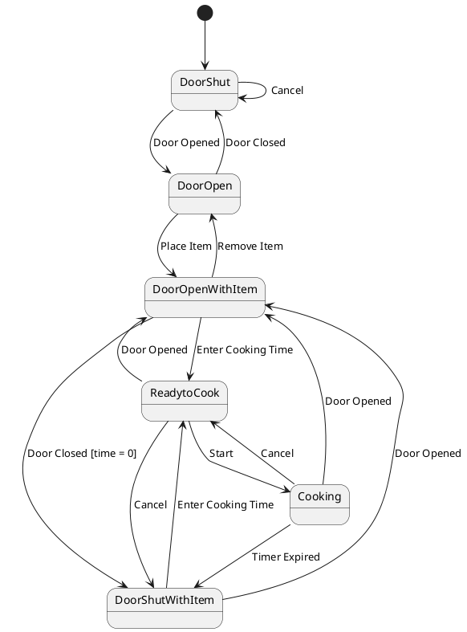

# Pair `0055`：NL + PlantUML STM0 + FCSTM STM0

[上一组 `0054`](../0054/README.md) | [返回 60 组索引](../../PAIR_INDEX.md) | [下一组 `0056`](../0056/README.md)

- LLM：`Claude`
- 模型/场景：Microwave Oven Control with entry and <br> exit actions
- 作者输出阶段：`Generation PlantUML`
- 作者输出单元格：`I57`；Excel row：`57`
- Phase-I fallback：`true`
- 相对 Phase-I 是否变化：`false`
- Phase-I PlantUML SHA-256：`322a51f31a2fe5f946fa71caf2f1e44a4d2c7ffe089b2ca987de2ae7d009abe6`
- NL SHA-256：`934e19bd4ae2a793c334fdcf486092d3aa20858f09ae892753ef87698feb061f`
- PlantUML SHA-256：`322a51f31a2fe5f946fa71caf2f1e44a4d2c7ffe089b2ca987de2ae7d009abe6`
- FCSTM SHA-256：`facdd1f183fae45eb7f1f6877adf922651be5404f24e50f7be6673ba3e14a9ea`
- review subject SHA-256：`6073f0d81c9a9b5959dff6964f6879d1ef8a8d29e36d4b75b8d5557aa635f1a3`
- working contract SHA-256：`ad3ea812bb5c42cc80aa831c9a1e97199284cc5fd3d0db073028aa3ac1c8c416`
- 结构裁决：`structure_preserved`
- source states / transitions：`6` / `16`
- mapped / blocked / silent drop：`16` / `0` / `0`
- final / lifecycle / body coverage：`0/0` / `0/0` / `0/0`
- concurrent region / separator coverage：`0/0` / `0/0`
- source normalization coverage：`0/0`
- official raw / validation：`state_diagram` / `state_diagram`
- official identity states / transitions：`6` / `16`
- official identity remaps：state `0` / transition endpoint `0`
- AST audit：`passed`
- legacy whole-model FCSTM execution / Discover：`false` / `false`
- working bundle usage gate：`discover_input_with_capability_mask`
- ownership source / compiler / agent：`22` / `26` / `0`
- source macro / positive identity trace / conversion boundary trace：`16` / `22` / `0`
- capability source-static / simulation / transition-trace：`eligible_with_exclusions` / `eligible_with_exclusions` / `eligible_with_exclusions`
- compiler-only diagnostic policy：`rejected_conversion_artifact`；main-result conversion artifact limit：`0`
- 主 session 对读：`pass`；ownership/macro/capability 均为 `pass`；Case 0055 passes the current attribution-safe forward review; this does not assert global behavior equivalence, and unsupported runtime semantics remain fail-closed. Amendment record: the substantive subject review remains the one recorded in review_context (first reviewed 2026-07-20T05:44:08Z by gpt-5.5 (session omx-1784393668980-pxpj3q), and it still binds because review_subject_sha256 is unchanged. A scoped re-check was performed 2026-08-17 by claude-opus-5 (main-session LLM, PR #185) because commit bbb04cb1 (2026-07-27) regenerated the 60 working contracts and commit 35eba126 (2026-08-11) renamed the paper workspace, and neither refreshed this registry. The re-review is scoped: a key-by-key diff shows the only contract changes are capability_eligibility.simulation, capability_eligibility.transition_trace and summary.simulation_status (bbb04cb1) plus the four artifact_bindings path strings (35eba126); the remaining 168 keys and the whole of canonical/fcstm/parse_inspect/source_traces are byte-identical, so review_subject_sha256 is unchanged and the original ownership, macro and correspondence findings still stand. The capability block was re-checked against seven invariants: eligible ids are source: only, excluded ids cover the compiler-owned set, the two sets are disjoint, claim_boundary and reason_codes are non-empty, main_result_conversion_artifact_limit is still 0, and usage_gate is unchanged.
- source anchors：`source-ref:llms_emp_feedback_final_0055.puml:line:3\|[*] --> DoorShut, source-ref:llms_emp_feedback_final_0055.puml:line:5\|DoorShut --> DoorShut : Cancel`；FCSTM anchors：`element-ref:source:state:DoorShut@line:11\|state DoorShut named "DoorShut";, element-ref:compiler:transition_segment:tr_0002:segment:1@line:18\|DoorShut -> DoorShut : /Cancel;`
- 三个原始文件：[NL](./nl.txt) | [PlantUML](./plantuml.puml) | [FCSTM](./fcstm.fcstm)
- 审计入口：[canonical](../../canonical/llms_emp_feedback_final_0055.json) | [冻结 FCSTM](../../fcstm/llms_emp_feedback_final_0055.fcstm) | [case report](../../case_reports/llms_emp_feedback_final_0055.json) | [working contract](../../working_contracts/llms_emp_feedback_final_0055.json) | [source trace](../../source_traces/llms_emp_feedback_final_0055.json) | [人工总账](../../MANUAL_REVIEW.md)

## 主 session 三方语义对应

| projection | assessment | NL anchor | PlantUML anchor | FCSTM anchor | source roots | compiler members | rationale |
|---|---|---|---|---|---|---|---|
| `direct` | `preserved` | DoorShut | source-ref:llms_emp_feedback_final_0055.puml:line:3\|[*] --> DoorShut | element-ref:source:state:DoorShut@line:11\|state DoorShut named "DoorShut"; | source:state:DoorShut | - | Case 0055 binds source:state:DoorShut to authored PlantUML occurrence '[*] --> DoorShut' and current FCSTM occurrence 'state DoorShut named "DoorShut";'; the source semantic root remains attributable while any compiler-owned projection stays protected and cannot become an independent Repair target. |
| `macro` | `preserved_with_exclusions` | DoorShut | source-ref:llms_emp_feedback_final_0055.puml:line:5\|DoorShut --> DoorShut : Cancel | element-ref:compiler:transition_segment:tr_0002:segment:1@line:18\|DoorShut -> DoorShut : /Cancel; | source:transition:tr_0002 | compiler:transition_segment:tr_0002:segment:1 | Case 0055 binds source:transition:tr_0002 to authored PlantUML occurrence 'DoorShut --> DoorShut : Cancel' and current FCSTM occurrence 'DoorShut -> DoorShut : /Cancel;'; the source semantic root remains attributable while any compiler-owned projection stays protected and cannot become an independent Repair target. |

## Risk occurrence 第二遍复核

本组不要求 risk-tag 第二遍复核。

## 作者阶段 lineage

| stage | output cell | present | output SHA-256 | feedback | resolved |
|---|---|---|---|---|---|
| `phase_i_generation` | `I57` | `true` | `322a51f31a2fe5f946fa71caf2f1e44a4d2c7ffe089b2ca987de2ae7d009abe6` | - | - |
| `phase_ii_format` | `U57` | `false` | `-` | - | - |
| `phase_ii_grammar` | `Z57` | `false` | `-` | - | - |
| `phase_ii_semantic` | `AE57` | `false` | `-` | None | - |

## Official identity ledger

- status：`aligned`
- canonical / official states：`6` / `6`
- aligned transition endpoints：`16`

本组 state identity 无需重映射。

本组 transition endpoint 无需重映射。

## Source normalization ledger

本组没有 source-input normalization。

## Concurrent region ledger

本组没有 PlantUML orthogonal/concurrent region separator。

## Operational debt

| reason code | count |
|---|---:|
| `R45.DEBT.opaque_transition_label_semantics` | 15 |

## NL

```text
1. The microwave starts in the DoorShut state. From this state, the system can either remain in DoorShut if a Cancel action is performed or transition to the DoorOpen state when the door is opened.
2. When the Door Opened action occurs in the DoorShut state, the system transitions to the DoorOpen state. The door can be closed to return to the DoorShut state.
3. In the DoorOpen state, placing an item inside the microwave transitions the system to DoorOpenWithItem. If the item is removed, the system returns to DoorOpen.
4. From DoorOpenWithItem, the system can transition to DoorShutWithItem if the door is closed with zero time set or to ReadytoCook if cooking time is entered.
5. In the DoorShutWithItem state, opening the door transitions the system back to DoorOpenWithItem, while entering cooking time takes the system to ReadytoCook, where the cooking time is displayed and updated.
6. In the ReadytoCook state, if the Cancel action is performed, the system returns to DoorShutWithItem, canceling or updating the cooking time. If the door is opened, the system transitions to DoorOpenWithItem.
7. When the Start action is performed in ReadytoCook, the system transitions to the Cooking state, where the timer starts.
8. In the Cooking state, opening the door stops the timer and the system transitions to DoorOpenWithItem, while if the timer expires, the system moves to DoorShutWithItem. A Cancel action transitions the system back to ReadytoCook.
```

## 作者 Phase-II 最终 PlantUML STM0



## 转换后 FCSTM STM0

```fcstm
state llms_emp_feedback_final_0055 named "llms_emp_feedback_final_0055" {
    event Cancel named "Cancel";
    event Door_Opened named "Door Opened";
    event Door_Closed named "Door Closed";
    event Place_Item named "Place Item";
    event Remove_Item named "Remove Item";
    event Door_Closed_time_0 named "Door Closed [time = 0]";
    event Enter_Cooking_Time named "Enter Cooking Time";
    event Start named "Start";
    event Timer_Expired named "Timer Expired";
    state DoorShut named "DoorShut";
    state DoorOpen named "DoorOpen";
    state DoorOpenWithItem named "DoorOpenWithItem";
    state DoorShutWithItem named "DoorShutWithItem";
    state ReadytoCook named "ReadytoCook";
    state Cooking named "Cooking";
    [*] -> DoorShut;
    DoorShut -> DoorShut : /Cancel;
    DoorShut -> DoorOpen : /Door_Opened;
    DoorOpen -> DoorShut : /Door_Closed;
    DoorOpen -> DoorOpenWithItem : /Place_Item;
    DoorOpenWithItem -> DoorOpen : /Remove_Item;
    DoorOpenWithItem -> DoorShutWithItem : /Door_Closed_time_0;
    DoorOpenWithItem -> ReadytoCook : /Enter_Cooking_Time;
    DoorShutWithItem -> DoorOpenWithItem : /Door_Opened;
    DoorShutWithItem -> ReadytoCook : /Enter_Cooking_Time;
    ReadytoCook -> DoorShutWithItem : /Cancel;
    ReadytoCook -> DoorOpenWithItem : /Door_Opened;
    ReadytoCook -> Cooking : /Start;
    Cooking -> DoorOpenWithItem : /Door_Opened;
    Cooking -> DoorShutWithItem : /Timer_Expired;
    Cooking -> ReadytoCook : /Cancel;
}
```

[上一组 `0054`](../0054/README.md) | [返回 60 组索引](../../PAIR_INDEX.md) | [下一组 `0056`](../0056/README.md)
