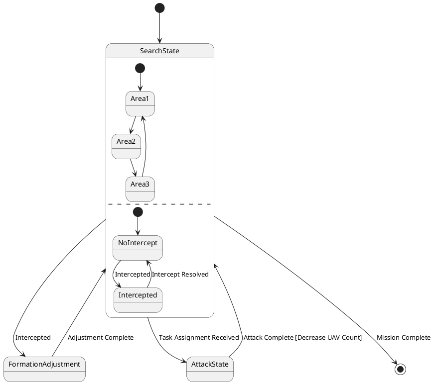

# Pair `0056`：NL + PlantUML STM0 + FCSTM STM0

[上一组 `0055`](../0055/README.md) | [返回 60 组索引](../../PAIR_INDEX.md) | [下一组 `0057`](../0057/README.md)

- LLM：`Claude`
- 模型/场景：UAV swarm state machine diagram
- 作者输出阶段：`Result with Semantic Checking`
- 作者输出单元格：`AE58`；Excel row：`58`
- Phase-I fallback：`false`
- 相对 Phase-I 是否变化：`true`
- Phase-I PlantUML SHA-256：`bf93ab42299d56f2aca29149e61760019633d58293e0b2b464360e4d5c20c97f`
- NL SHA-256：`a01c022f5380700b6c13800497291640b4d64abbadce1d8984be0c14880ebeb3`
- PlantUML SHA-256：`5021744139f603fe986abdb886eb4dae03c71911218a4d7880a494f3455bd816`
- FCSTM SHA-256：`efb936daa0bfa3c15b604899d7251395fd491d674c036334558571061bcc664e`
- review subject SHA-256：`cc0489d8f179b7b6d16430d37c5c93a1193fe486bf72b9f685ffa9acdc67eb53`
- working contract SHA-256：`4d66cc1a7fc67d91aa8bc5ddce1fbf911e154c3c5bc892cc24bfe7dbf41c378a`
- 结构裁决：`structure_preserved`
- source states / transitions：`8` / `13`
- mapped / blocked / silent drop：`13` / `0` / `0`
- final / lifecycle / body coverage：`1/1` / `0/0` / `0/0`
- concurrent region / separator coverage：`2/2` / `1/1`
- source normalization coverage：`0/0`
- official raw / validation：`state_diagram` / `state_diagram`
- official identity states / transitions：`8` / `13`
- official identity remaps：state `0` / transition endpoint `0`
- AST audit：`passed`
- legacy whole-model FCSTM execution / Discover：`false` / `false`
- working bundle usage gate：`discover_input_with_capability_mask`
- ownership source / compiler / agent：`23` / `36` / `0`
- source macro / positive identity trace / conversion boundary trace：`15` / `23` / `0`
- capability source-static / simulation / transition-trace：`eligible_with_exclusions` / `eligible_with_exclusions` / `eligible_with_exclusions`
- compiler-only diagnostic policy：`rejected_conversion_artifact`；main-result conversion artifact limit：`0`
- 主 session 对读：`pass`；ownership/macro/capability 均为 `pass`；Case 0056 passes the current attribution-safe forward review; this does not assert global behavior equivalence, and unsupported runtime semantics remain fail-closed. Amendment record: the substantive subject review remains the one recorded in review_context (first reviewed 2026-07-20T05:44:08Z by gpt-5.5 (session omx-1784393668980-pxpj3q), and it still binds because review_subject_sha256 is unchanged. A scoped re-check was performed 2026-08-17 by claude-opus-5 (main-session LLM, PR #185) because commit bbb04cb1 (2026-07-27) regenerated the 60 working contracts and commit 35eba126 (2026-08-11) renamed the paper workspace, and neither refreshed this registry. The re-review is scoped: a key-by-key diff shows the only contract changes are capability_eligibility.simulation, capability_eligibility.transition_trace and summary.simulation_status (bbb04cb1) plus the four artifact_bindings path strings (35eba126); the remaining 168 keys and the whole of canonical/fcstm/parse_inspect/source_traces are byte-identical, so review_subject_sha256 is unchanged and the original ownership, macro and correspondence findings still stand. The capability block was re-checked against seven invariants: eligible ids are source: only, excluded ids cover the compiler-owned set, the two sets are disjoint, claim_boundary and reason_codes are non-empty, main_result_conversion_artifact_limit is still 0, and usage_gate is unchanged.
- source anchors：`source-ref:llms_emp_feedback_final_0056.puml:line:5\|state SearchState {, source-ref:llms_emp_feedback_final_0056.puml:line:12\|NoIntercept --> Intercepted : Intercepted`；FCSTM anchors：`element-ref:source:state:SearchState@line:9\|state SearchState named "SearchState\n[PlantUML concurrent region 0] states=SearchState.Area1, SearchState.Area2, SearchState.Area3; transitions=tr_0002, tr_0003, tr_0004, tr_0005\n[PlantUML concurrent region 1] states=SearchState.NoIntercept, SearchState.Intercepted; transitions=tr_0006, tr_0007, tr_0008\n[PlantUML concurrent separator] region 0 -> 1 at llms_emp_feedback_final_0056.puml:line:10" {, element-ref:compiler:transition_segment:tr_0007:segment:1@line:20\|NoIntercept -> Intercepted : /Intercepted;`
- 三个原始文件：[NL](./nl.txt) | [PlantUML](./plantuml.puml) | [FCSTM](./fcstm.fcstm)
- 审计入口：[canonical](../../canonical/llms_emp_feedback_final_0056.json) | [冻结 FCSTM](../../fcstm/llms_emp_feedback_final_0056.fcstm) | [case report](../../case_reports/llms_emp_feedback_final_0056.json) | [working contract](../../working_contracts/llms_emp_feedback_final_0056.json) | [source trace](../../source_traces/llms_emp_feedback_final_0056.json) | [人工总账](../../MANUAL_REVIEW.md)

## 主 session 三方语义对应

| projection | assessment | NL anchor | PlantUML anchor | FCSTM anchor | source roots | compiler members | rationale |
|---|---|---|---|---|---|---|---|
| `direct` | `preserved` | 1 This state machine model describes the state transitions of a UAV swarm. | source-ref:llms_emp_feedback_final_0056.puml:line:5\|state SearchState { | element-ref:source:state:SearchState@line:9\|state SearchState named "SearchState\n[PlantUML concurrent region 0] states=SearchState.Area1, SearchState.Area2, SearchState.Area3; transitions=tr_0002, tr_0003, tr_0004, tr_0005\n[PlantUML concurrent region 1] states=SearchState.NoIntercept, SearchState.Intercepted; transitions=tr_0006, tr_0007, tr_0008\n[PlantUML concurrent separator] region 0 -> 1 at llms_emp_feedback_final_0056.puml:line:10" { | source:state:SearchState | - | Case 0056 binds source:state:SearchState to authored PlantUML occurrence 'state SearchState {' and current FCSTM occurrence 'state SearchState named "SearchState\n[PlantUML concurrent region 0] states=SearchState.Area1, SearchState.Area2, SearchState.Area3; transitions=tr_0002, tr_0003, tr_0004, tr_0005\n[PlantUML concurrent region 1] states=SearchState.NoIntercept, SearchState.Intercepted; transitions=tr_0006, tr_0007, tr_0008\n[PlantUML concurrent separator] region 0 -> 1 at llms_emp_feedback_final_0056.puml:line:10" {'; the source semantic root remains attributable while any compiler-owned projection stays protected and cannot become an independent Repair target. |
| `macro` | `preserved_with_exclusions` | intercepted | source-ref:llms_emp_feedback_final_0056.puml:line:12\|NoIntercept --> Intercepted : Intercepted | element-ref:compiler:transition_segment:tr_0007:segment:1@line:20\|NoIntercept -> Intercepted : /Intercepted; | source:transition:tr_0007 | compiler:transition_segment:tr_0007:segment:1 | Case 0056 binds source:transition:tr_0007 to authored PlantUML occurrence 'NoIntercept --> Intercepted : Intercepted' and current FCSTM occurrence 'NoIntercept -> Intercepted : /Intercepted;'; the source semantic root remains attributable while any compiler-owned projection stays protected and cannot become an independent Repair target. |

## Risk occurrence 第二遍复核

| obligation | risk tag | assessment | PlantUML evidence | FCSTM evidence | ownership evidence | rationale |
|---|---|---|---|---|---|---|
| `review:multi_segment_macro:0001:tr_0009` | `multi_segment_macro` | `compiler_artifact_excluded` | source-ref:llms_emp_feedback_final_0056.puml:line:16\|SearchState --> FormationAdjustment : Intercepted, source-ref:llms_emp_feedback_final_0056.puml:line:19\|SearchState --> AttackState : Task Assignment Received, source-ref:llms_emp_feedback_final_0056.puml:line:22\|SearchState --> [*] : Mission Complete | element-ref:compiler:route_control:R45RouteToken@line:1\|def int R45RouteToken = 0;, element-ref:compiler:transition_segment:tr_0009:segment:1@line:22\|Area1 -> [*] : /Intercepted effect { R45RouteToken = 9; };, element-ref:compiler:transition_segment:tr_0009:segment:2@line:23\|Area2 -> [*] : /Intercepted effect { R45RouteToken = 9; };, element-ref:compiler:transition_segment:tr_0009:segment:3@line:24\|Area3 -> [*] : /Intercepted effect { R45RouteToken = 9; };, element-ref:compiler:transition_segment:tr_0009:segment:4@line:25\|NoIntercept -> [*] : /Intercepted effect { R45RouteToken = 9; };, element-ref:compiler:transition_segment:tr_0009:segment:5@line:26\|Intercepted -> [*] : /Intercepted effect { R45RouteToken = 9; };, element-ref:compiler:transition_segment:tr_0009:segment:6@line:40\|SearchState -> FormationAdjustment : if [R45RouteToken == 9] effect { R45RouteToken = 0; }; | compiler:route_control:R45RouteToken, compiler:transition_segment:tr_0009:segment:1, compiler:transition_segment:tr_0009:segment:2, compiler:transition_segment:tr_0009:segment:3, compiler:transition_segment:tr_0009:segment:4, compiler:transition_segment:tr_0009:segment:5, compiler:transition_segment:tr_0009:segment:6, source:transition:tr_0009 | Case 0056 multi_segment_macro occurrence review:multi_segment_macro:0001:tr_0009 binds exact source refs to working-contract elements compiler:route_control:R45RouteToken, compiler:transition_segment:tr_0009:segment:1, compiler:transition_segment:tr_0009:segment:2, compiler:transition_segment:tr_0009:segment:3, compiler:transition_segment:tr_0009:segment:4, compiler:transition_segment:tr_0009:segment:5, compiler:transition_segment:tr_0009:segment:6, source:transition:tr_0009. All emitted segments collapse to one source transition root; no segment is promoted as a separate authored transition or editable issue target. |
| `review:route_controller:0002:tr_0009` | `route_controller` | `compiler_artifact_excluded` | source-ref:llms_emp_feedback_final_0056.puml:line:16\|SearchState --> FormationAdjustment : Intercepted, source-ref:llms_emp_feedback_final_0056.puml:line:19\|SearchState --> AttackState : Task Assignment Received, source-ref:llms_emp_feedback_final_0056.puml:line:22\|SearchState --> [*] : Mission Complete | element-ref:compiler:route_control:R45RouteToken@line:1\|def int R45RouteToken = 0;, element-ref:compiler:transition_segment:tr_0009:segment:1@line:22\|Area1 -> [*] : /Intercepted effect { R45RouteToken = 9; };, element-ref:compiler:transition_segment:tr_0009:segment:2@line:23\|Area2 -> [*] : /Intercepted effect { R45RouteToken = 9; };, element-ref:compiler:transition_segment:tr_0009:segment:3@line:24\|Area3 -> [*] : /Intercepted effect { R45RouteToken = 9; };, element-ref:compiler:transition_segment:tr_0009:segment:4@line:25\|NoIntercept -> [*] : /Intercepted effect { R45RouteToken = 9; };, element-ref:compiler:transition_segment:tr_0009:segment:5@line:26\|Intercepted -> [*] : /Intercepted effect { R45RouteToken = 9; };, element-ref:compiler:transition_segment:tr_0009:segment:6@line:40\|SearchState -> FormationAdjustment : if [R45RouteToken == 9] effect { R45RouteToken = 0; }; | compiler:route_control:R45RouteToken, compiler:transition_segment:tr_0009:segment:1, compiler:transition_segment:tr_0009:segment:2, compiler:transition_segment:tr_0009:segment:3, compiler:transition_segment:tr_0009:segment:4, compiler:transition_segment:tr_0009:segment:5, compiler:transition_segment:tr_0009:segment:6, source:transition:tr_0009 | Case 0056 route_controller occurrence review:route_controller:0002:tr_0009 binds exact source refs to working-contract elements compiler:route_control:R45RouteToken, compiler:transition_segment:tr_0009:segment:1, compiler:transition_segment:tr_0009:segment:2, compiler:transition_segment:tr_0009:segment:3, compiler:transition_segment:tr_0009:segment:4, compiler:transition_segment:tr_0009:segment:5, compiler:transition_segment:tr_0009:segment:6, source:transition:tr_0009. R45RouteToken and routed segments remain compiler_owned, protected, and excluded from confirmed issues, Repair, Confirm acceptance, and main results. |
| `review:multi_segment_macro:0003:tr_0011` | `multi_segment_macro` | `compiler_artifact_excluded` | source-ref:llms_emp_feedback_final_0056.puml:line:16\|SearchState --> FormationAdjustment : Intercepted, source-ref:llms_emp_feedback_final_0056.puml:line:19\|SearchState --> AttackState : Task Assignment Received, source-ref:llms_emp_feedback_final_0056.puml:line:22\|SearchState --> [*] : Mission Complete | element-ref:compiler:route_control:R45RouteToken@line:1\|def int R45RouteToken = 0;, element-ref:compiler:transition_segment:tr_0011:segment:1@line:27\|Area1 -> [*] : /Task_Assignment_Received effect { R45RouteToken = 11; };, element-ref:compiler:transition_segment:tr_0011:segment:2@line:28\|Area2 -> [*] : /Task_Assignment_Received effect { R45RouteToken = 11; };, element-ref:compiler:transition_segment:tr_0011:segment:3@line:29\|Area3 -> [*] : /Task_Assignment_Received effect { R45RouteToken = 11; };, element-ref:compiler:transition_segment:tr_0011:segment:4@line:30\|NoIntercept -> [*] : /Task_Assignment_Received effect { R45RouteToken = 11; };, element-ref:compiler:transition_segment:tr_0011:segment:5@line:31\|Intercepted -> [*] : /Task_Assignment_Received effect { R45RouteToken = 11; };, element-ref:compiler:transition_segment:tr_0011:segment:6@line:41\|SearchState -> AttackState : if [R45RouteToken == 11] effect { R45RouteToken = 0; }; | compiler:route_control:R45RouteToken, compiler:transition_segment:tr_0011:segment:1, compiler:transition_segment:tr_0011:segment:2, compiler:transition_segment:tr_0011:segment:3, compiler:transition_segment:tr_0011:segment:4, compiler:transition_segment:tr_0011:segment:5, compiler:transition_segment:tr_0011:segment:6, source:transition:tr_0011 | Case 0056 multi_segment_macro occurrence review:multi_segment_macro:0003:tr_0011 binds exact source refs to working-contract elements compiler:route_control:R45RouteToken, compiler:transition_segment:tr_0011:segment:1, compiler:transition_segment:tr_0011:segment:2, compiler:transition_segment:tr_0011:segment:3, compiler:transition_segment:tr_0011:segment:4, compiler:transition_segment:tr_0011:segment:5, compiler:transition_segment:tr_0011:segment:6, source:transition:tr_0011. All emitted segments collapse to one source transition root; no segment is promoted as a separate authored transition or editable issue target. |
| `review:route_controller:0004:tr_0011` | `route_controller` | `compiler_artifact_excluded` | source-ref:llms_emp_feedback_final_0056.puml:line:16\|SearchState --> FormationAdjustment : Intercepted, source-ref:llms_emp_feedback_final_0056.puml:line:19\|SearchState --> AttackState : Task Assignment Received, source-ref:llms_emp_feedback_final_0056.puml:line:22\|SearchState --> [*] : Mission Complete | element-ref:compiler:route_control:R45RouteToken@line:1\|def int R45RouteToken = 0;, element-ref:compiler:transition_segment:tr_0011:segment:1@line:27\|Area1 -> [*] : /Task_Assignment_Received effect { R45RouteToken = 11; };, element-ref:compiler:transition_segment:tr_0011:segment:2@line:28\|Area2 -> [*] : /Task_Assignment_Received effect { R45RouteToken = 11; };, element-ref:compiler:transition_segment:tr_0011:segment:3@line:29\|Area3 -> [*] : /Task_Assignment_Received effect { R45RouteToken = 11; };, element-ref:compiler:transition_segment:tr_0011:segment:4@line:30\|NoIntercept -> [*] : /Task_Assignment_Received effect { R45RouteToken = 11; };, element-ref:compiler:transition_segment:tr_0011:segment:5@line:31\|Intercepted -> [*] : /Task_Assignment_Received effect { R45RouteToken = 11; };, element-ref:compiler:transition_segment:tr_0011:segment:6@line:41\|SearchState -> AttackState : if [R45RouteToken == 11] effect { R45RouteToken = 0; }; | compiler:route_control:R45RouteToken, compiler:transition_segment:tr_0011:segment:1, compiler:transition_segment:tr_0011:segment:2, compiler:transition_segment:tr_0011:segment:3, compiler:transition_segment:tr_0011:segment:4, compiler:transition_segment:tr_0011:segment:5, compiler:transition_segment:tr_0011:segment:6, source:transition:tr_0011 | Case 0056 route_controller occurrence review:route_controller:0004:tr_0011 binds exact source refs to working-contract elements compiler:route_control:R45RouteToken, compiler:transition_segment:tr_0011:segment:1, compiler:transition_segment:tr_0011:segment:2, compiler:transition_segment:tr_0011:segment:3, compiler:transition_segment:tr_0011:segment:4, compiler:transition_segment:tr_0011:segment:5, compiler:transition_segment:tr_0011:segment:6, source:transition:tr_0011. R45RouteToken and routed segments remain compiler_owned, protected, and excluded from confirmed issues, Repair, Confirm acceptance, and main results. |
| `review:multi_segment_macro:0005:tr_0013` | `multi_segment_macro` | `compiler_artifact_excluded` | source-ref:llms_emp_feedback_final_0056.puml:line:16\|SearchState --> FormationAdjustment : Intercepted, source-ref:llms_emp_feedback_final_0056.puml:line:19\|SearchState --> AttackState : Task Assignment Received, source-ref:llms_emp_feedback_final_0056.puml:line:22\|SearchState --> [*] : Mission Complete | element-ref:compiler:route_control:R45RouteToken@line:1\|def int R45RouteToken = 0;, element-ref:compiler:transition_segment:tr_0013:segment:1@line:32\|Area1 -> [*] : /Mission_Complete effect { R45RouteToken = 13; };, element-ref:compiler:transition_segment:tr_0013:segment:2@line:33\|Area2 -> [*] : /Mission_Complete effect { R45RouteToken = 13; };, element-ref:compiler:transition_segment:tr_0013:segment:3@line:34\|Area3 -> [*] : /Mission_Complete effect { R45RouteToken = 13; };, element-ref:compiler:transition_segment:tr_0013:segment:4@line:35\|NoIntercept -> [*] : /Mission_Complete effect { R45RouteToken = 13; };, element-ref:compiler:transition_segment:tr_0013:segment:5@line:36\|Intercepted -> [*] : /Mission_Complete effect { R45RouteToken = 13; };, element-ref:compiler:transition_segment:tr_0013:segment:6@line:42\|SearchState -> [*] : if [R45RouteToken == 13] effect { R45RouteToken = 0; }; | compiler:route_control:R45RouteToken, compiler:transition_segment:tr_0013:segment:1, compiler:transition_segment:tr_0013:segment:2, compiler:transition_segment:tr_0013:segment:3, compiler:transition_segment:tr_0013:segment:4, compiler:transition_segment:tr_0013:segment:5, compiler:transition_segment:tr_0013:segment:6, source:transition:tr_0013 | Case 0056 multi_segment_macro occurrence review:multi_segment_macro:0005:tr_0013 binds exact source refs to working-contract elements compiler:route_control:R45RouteToken, compiler:transition_segment:tr_0013:segment:1, compiler:transition_segment:tr_0013:segment:2, compiler:transition_segment:tr_0013:segment:3, compiler:transition_segment:tr_0013:segment:4, compiler:transition_segment:tr_0013:segment:5, compiler:transition_segment:tr_0013:segment:6, source:transition:tr_0013. All emitted segments collapse to one source transition root; no segment is promoted as a separate authored transition or editable issue target. |
| `review:route_controller:0006:tr_0013` | `route_controller` | `compiler_artifact_excluded` | source-ref:llms_emp_feedback_final_0056.puml:line:16\|SearchState --> FormationAdjustment : Intercepted, source-ref:llms_emp_feedback_final_0056.puml:line:19\|SearchState --> AttackState : Task Assignment Received, source-ref:llms_emp_feedback_final_0056.puml:line:22\|SearchState --> [*] : Mission Complete | element-ref:compiler:route_control:R45RouteToken@line:1\|def int R45RouteToken = 0;, element-ref:compiler:transition_segment:tr_0013:segment:1@line:32\|Area1 -> [*] : /Mission_Complete effect { R45RouteToken = 13; };, element-ref:compiler:transition_segment:tr_0013:segment:2@line:33\|Area2 -> [*] : /Mission_Complete effect { R45RouteToken = 13; };, element-ref:compiler:transition_segment:tr_0013:segment:3@line:34\|Area3 -> [*] : /Mission_Complete effect { R45RouteToken = 13; };, element-ref:compiler:transition_segment:tr_0013:segment:4@line:35\|NoIntercept -> [*] : /Mission_Complete effect { R45RouteToken = 13; };, element-ref:compiler:transition_segment:tr_0013:segment:5@line:36\|Intercepted -> [*] : /Mission_Complete effect { R45RouteToken = 13; };, element-ref:compiler:transition_segment:tr_0013:segment:6@line:42\|SearchState -> [*] : if [R45RouteToken == 13] effect { R45RouteToken = 0; }; | compiler:route_control:R45RouteToken, compiler:transition_segment:tr_0013:segment:1, compiler:transition_segment:tr_0013:segment:2, compiler:transition_segment:tr_0013:segment:3, compiler:transition_segment:tr_0013:segment:4, compiler:transition_segment:tr_0013:segment:5, compiler:transition_segment:tr_0013:segment:6, source:transition:tr_0013 | Case 0056 route_controller occurrence review:route_controller:0006:tr_0013 binds exact source refs to working-contract elements compiler:route_control:R45RouteToken, compiler:transition_segment:tr_0013:segment:1, compiler:transition_segment:tr_0013:segment:2, compiler:transition_segment:tr_0013:segment:3, compiler:transition_segment:tr_0013:segment:4, compiler:transition_segment:tr_0013:segment:5, compiler:transition_segment:tr_0013:segment:6, source:transition:tr_0013. R45RouteToken and routed segments remain compiler_owned, protected, and excluded from confirmed issues, Repair, Confirm acceptance, and main results. |
| `review:final_boundary:0007:tr_0013` | `final_boundary` | `source_fact_preserved` | source-ref:llms_emp_feedback_final_0056.puml:line:16\|SearchState --> FormationAdjustment : Intercepted, source-ref:llms_emp_feedback_final_0056.puml:line:19\|SearchState --> AttackState : Task Assignment Received, source-ref:llms_emp_feedback_final_0056.puml:line:22\|SearchState --> [*] : Mission Complete | element-ref:compiler:route_control:R45RouteToken@line:1\|def int R45RouteToken = 0;, element-ref:compiler:transition_segment:tr_0013:segment:1@line:32\|Area1 -> [*] : /Mission_Complete effect { R45RouteToken = 13; };, element-ref:compiler:transition_segment:tr_0013:segment:2@line:33\|Area2 -> [*] : /Mission_Complete effect { R45RouteToken = 13; };, element-ref:compiler:transition_segment:tr_0013:segment:3@line:34\|Area3 -> [*] : /Mission_Complete effect { R45RouteToken = 13; };, element-ref:compiler:transition_segment:tr_0013:segment:4@line:35\|NoIntercept -> [*] : /Mission_Complete effect { R45RouteToken = 13; };, element-ref:compiler:transition_segment:tr_0013:segment:5@line:36\|Intercepted -> [*] : /Mission_Complete effect { R45RouteToken = 13; };, element-ref:compiler:transition_segment:tr_0013:segment:6@line:42\|SearchState -> [*] : if [R45RouteToken == 13] effect { R45RouteToken = 0; }; | compiler:route_control:R45RouteToken, compiler:transition_segment:tr_0013:segment:1, compiler:transition_segment:tr_0013:segment:2, compiler:transition_segment:tr_0013:segment:3, compiler:transition_segment:tr_0013:segment:4, compiler:transition_segment:tr_0013:segment:5, compiler:transition_segment:tr_0013:segment:6, source:transition:tr_0013 | Case 0056 final_boundary occurrence review:final_boundary:0007:tr_0013 binds exact source refs to working-contract elements compiler:route_control:R45RouteToken, compiler:transition_segment:tr_0013:segment:1, compiler:transition_segment:tr_0013:segment:2, compiler:transition_segment:tr_0013:segment:3, compiler:transition_segment:tr_0013:segment:4, compiler:transition_segment:tr_0013:segment:5, compiler:transition_segment:tr_0013:segment:6, source:transition:tr_0013. The authored final occurrence remains visible through its source root; any completion holder or routing segment is excluded from source-level claims. |
| `review:concurrent_region:0008:SearchState:region:0` | `concurrent_region` | `capability_excluded` | source-ref:llms_emp_feedback_final_0056.puml:line:10\|-- | element-ref:source:region:SearchState:region:0@line:9\|state SearchState named "SearchState\n[PlantUML concurrent region 0] states=SearchState.Area1, SearchState.Area2, SearchState.Area3; transitions=tr_0002, tr_0003, tr_0004, tr_0005\n[PlantUML concurrent region 1] states=SearchState.NoIntercept, SearchState.Intercepted; transitions=tr_0006, tr_0007, tr_0008\n[PlantUML concurrent separator] region 0 -> 1 at llms_emp_feedback_final_0056.puml:line:10" { | source:region:SearchState:region:0 | Case 0056 concurrent_region occurrence review:concurrent_region:0008:SearchState:region:0 binds exact source refs to working-contract elements source:region:SearchState:region:0. The authored region occurrence is preserved as source metadata, while single-active FCSTM runtime behavior remains capability_excluded. |
| `review:concurrent_region:0009:SearchState:region:1` | `concurrent_region` | `capability_excluded` | source-ref:llms_emp_feedback_final_0056.puml:line:10\|-- | element-ref:source:region:SearchState:region:1@line:9\|state SearchState named "SearchState\n[PlantUML concurrent region 0] states=SearchState.Area1, SearchState.Area2, SearchState.Area3; transitions=tr_0002, tr_0003, tr_0004, tr_0005\n[PlantUML concurrent region 1] states=SearchState.NoIntercept, SearchState.Intercepted; transitions=tr_0006, tr_0007, tr_0008\n[PlantUML concurrent separator] region 0 -> 1 at llms_emp_feedback_final_0056.puml:line:10" { | source:region:SearchState:region:1 | Case 0056 concurrent_region occurrence review:concurrent_region:0009:SearchState:region:1 binds exact source refs to working-contract elements source:region:SearchState:region:1. The authored region occurrence is preserved as source metadata, while single-active FCSTM runtime behavior remains capability_excluded. |
| `review:explicit_concurrency:0010:001-multiple_initial_fanout` | `explicit_concurrency` | `capability_excluded` | source-ref:llms_emp_feedback_final_0056.puml:line:11\|[*] --> NoIntercept, source-ref:llms_emp_feedback_final_0056.puml:line:6\|[*] --> Area1 | element-ref:compiler:transition_segment:tr_0002:segment:1@line:15\|[*] -> Area1;, element-ref:compiler:transition_segment:tr_0006:segment:1@line:19\|[*] -> NoIntercept; | source:transition:tr_0002, source:transition:tr_0006 | Case 0056 explicit_concurrency occurrence review:explicit_concurrency:0010:001-multiple_initial_fanout binds exact source refs to working-contract elements source:transition:tr_0002, source:transition:tr_0006. The authored fork, join, or fan-out occurrence remains source-visible, while unsupported concurrent execution is capability_excluded rather than guessed. |

## 作者阶段 lineage

| stage | output cell | present | output SHA-256 | feedback | resolved |
|---|---|---|---|---|---|
| `phase_i_generation` | `I58` | `true` | `bf93ab42299d56f2aca29149e61760019633d58293e0b2b464360e4d5c20c97f` | - | - |
| `phase_ii_format` | `U58` | `false` | `-` | - | - |
| `phase_ii_grammar` | `Z58` | `false` | `-` | - | - |
| `phase_ii_semantic` | `AE58` | `true` | `5021744139f603fe986abdb886eb4dae03c71911218a4d7880a494f3455bd816` | 1. missing regions | 1.0 |

## Official identity ledger

- status：`aligned`
- canonical / official states：`8` / `8`
- aligned transition endpoints：`13`

本组 state identity 无需重映射。

本组 transition endpoint 无需重映射。

## Source normalization ledger

本组没有 source-input normalization。

## Concurrent region ledger

| owner | region | direct states | direct transitions | separator before | separator after |
|---|---:|---|---|---|---|
| `SearchState` | 0 | SearchState.Area1, SearchState.Area2, SearchState.Area3 | tr_0002, tr_0003, tr_0004, tr_0005 | - | llms_emp_feedback_final_0056.puml:line:10 |
| `SearchState` | 1 | SearchState.NoIntercept, SearchState.Intercepted | tr_0006, tr_0007, tr_0008 | llms_emp_feedback_final_0056.puml:line:10 | - |

## Operational debt

| reason code | count |
|---|---:|
| `R45.DEBT.composite_source_activation_dispatch` | 3 |
| `R45.DEBT.concurrent_region_semantics` | 1 |
| `R45.DEBT.multiple_initial_fanout` | 1 |
| `R45.DEBT.opaque_transition_label_semantics` | 7 |

## NL

```text
1 This state machine model describes the state transitions of a UAV swarm.
2 Before the mission is completed, the UAV swarm continuously performs target search tasks, during which it operates within three different state areas.
3 When the UAV swarm is intercepted, it transitions to the formation adjustment state.
4 During flight, if task assignment information is received, it enters the attack state. After completing the attack, the number of UAVs in the swarm decreases accordingly.
```

## 作者 Phase-II 最终 PlantUML STM0



## 转换后 FCSTM STM0

```fcstm
def int R45RouteToken = 0;
state llms_emp_feedback_final_0056 named "llms_emp_feedback_final_0056" {
    event Intercepted named "Intercepted";
    event Intercept_Resolved named "Intercept Resolved";
    event Adjustment_Complete named "Adjustment Complete";
    event Task_Assignment_Received named "Task Assignment Received";
    event Attack_Complete_Decrease_UAV_Count named "Attack Complete [Decrease UAV Count]";
    event Mission_Complete named "Mission Complete";
    state SearchState named "SearchState\n[PlantUML concurrent region 0] states=SearchState.Area1, SearchState.Area2, SearchState.Area3; transitions=tr_0002, tr_0003, tr_0004, tr_0005\n[PlantUML concurrent region 1] states=SearchState.NoIntercept, SearchState.Intercepted; transitions=tr_0006, tr_0007, tr_0008\n[PlantUML concurrent separator] region 0 -> 1 at llms_emp_feedback_final_0056.puml:line:10" {
        state Area1 named "Area1";
        state Area2 named "Area2";
        state Area3 named "Area3";
        state NoIntercept named "NoIntercept";
        state Intercepted named "Intercepted";
        [*] -> Area1;
        Area1 -> Area2;
        Area2 -> Area3;
        Area3 -> Area1;
        [*] -> NoIntercept;
        NoIntercept -> Intercepted : /Intercepted;
        Intercepted -> NoIntercept : /Intercept_Resolved;
        Area1 -> [*] : /Intercepted effect { R45RouteToken = 9; };
        Area2 -> [*] : /Intercepted effect { R45RouteToken = 9; };
        Area3 -> [*] : /Intercepted effect { R45RouteToken = 9; };
        NoIntercept -> [*] : /Intercepted effect { R45RouteToken = 9; };
        Intercepted -> [*] : /Intercepted effect { R45RouteToken = 9; };
        Area1 -> [*] : /Task_Assignment_Received effect { R45RouteToken = 11; };
        Area2 -> [*] : /Task_Assignment_Received effect { R45RouteToken = 11; };
        Area3 -> [*] : /Task_Assignment_Received effect { R45RouteToken = 11; };
        NoIntercept -> [*] : /Task_Assignment_Received effect { R45RouteToken = 11; };
        Intercepted -> [*] : /Task_Assignment_Received effect { R45RouteToken = 11; };
        Area1 -> [*] : /Mission_Complete effect { R45RouteToken = 13; };
        Area2 -> [*] : /Mission_Complete effect { R45RouteToken = 13; };
        Area3 -> [*] : /Mission_Complete effect { R45RouteToken = 13; };
        NoIntercept -> [*] : /Mission_Complete effect { R45RouteToken = 13; };
        Intercepted -> [*] : /Mission_Complete effect { R45RouteToken = 13; };
    }
    state FormationAdjustment named "FormationAdjustment";
    state AttackState named "AttackState";
    SearchState -> FormationAdjustment : if [R45RouteToken == 9] effect { R45RouteToken = 0; };
    SearchState -> AttackState : if [R45RouteToken == 11] effect { R45RouteToken = 0; };
    SearchState -> [*] : if [R45RouteToken == 13] effect { R45RouteToken = 0; };
    [*] -> SearchState;
    FormationAdjustment -> SearchState : /Adjustment_Complete;
    AttackState -> SearchState : /Attack_Complete_Decrease_UAV_Count;
}
```

[上一组 `0055`](../0055/README.md) | [返回 60 组索引](../../PAIR_INDEX.md) | [下一组 `0057`](../0057/README.md)
