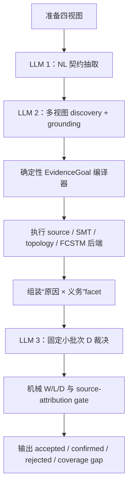

# Paper1 方法设计：源归因的可执行 issue discovery

状态：已收敛为当前唯一候选设计，但尚未完成事前冻结。本文不是事前登记，其中的 pilot 数字不得作为论文结果。

## 1. 研究目标

本方法处理一个 NL-satisfaction oracle problem：给定自然语言需求和作者源状态机，发现实质性缺陷，并为每条报告 issue 构造预算内能够获得的最强可执行证据。

首要成功条件是在完整 145 条台账上显著超过 X1v2，而不是只改善 `D2 × L2`。预期优势确实主要来自行为层，因为 X1v2 在 L2，尤其是可达性、可达死端和终止性上最弱；但 precision 和 source attribution 是同等重要的安全条件，高 W2 比例不能抵消 false positive。

因此，方法主张不能写成“LLM + inspect + pyfcstm”，而应写成：

> 一种 NL 引导的 issue discovery 方法，其中每条接受的 issue 同时携带真实执行的 consequence certificate、独立的作者源 causality certificate，以及独立生成的规范性 D 判定。

## 2. 固定架构

正式计分路径没有 truth-feedback 搜索回路。一个冻结的候选批次只编译和执行一次；D 的冗余 subclass 由 `D × grounding` 机械派生，只允许一次面向其余 schema/合同错误的定向修复，而且修复不得产生新 finding。这样可以防止 W2 变成“不断换断言，直到碰到一条为假”为止的可爬坡指标，也避免为了补一个可机械推导字段而重写整批 D 输出。

## 3. 阶段契约与跳转

| 阶段 | 输入 | 输出 | 跳转与降级 |
|---|---|---|---|
| `prepare` | NL、PlantUML、带 mapping 注释的 FCSTM、working contract | 输入 hash、canonical source IR、验证后的 inspect 摘要、确定性线索 | replay 非法要留审计；inspect 内部错误向下游降级 |
| `contract_extraction` | 仅 numbered NL | initial、containment、按 source 分组的 direct-transition raw contract，以及跨句复用的 concept ID | provider/schema 重试耗尽可以让整格失败；此节点不读取作者源，不得让错误制品改写规范 |
| 两个互补 `discovery_grounding` 分支 | 同一份 raw contract、NL、PlantUML、带 mapping 注释的 FCSTM、inspect 摘要、source IR 精确清单 | `contract_structure_contrast` 偏重契约/结构/对照，`behavior_consequence` 偏重可达性/响应/终止；各自产出全局 concept-ID binding、稀疏 veto patch 和 `EvidenceGoal` | 两分支独立作出语义判断，开放候选取结构化并集；确定性层只识别 exact-ID 冲突，不做文本相似度合并；formal scout 与执行只运行一次 |
| `compile` | grounded `EvidenceGoal.relation` 与正式 ID | canonical template、backend route、AssertionIR、可 replay code；由已选 transition ID 机械取得 source/target/event | 不支持、未落地或不一致的绑定降为 W1/W0 coverage gap |
| `execute` | compiled assertion + 当前精确 FCSTM/source IR | terminal receipt、observation/trace/cut/SCC、hash、limitations | 内部失败记 coverage gap，不允许让整格消失 |
| `facet_assembly` | execution outcome + source certificate + NL obligation | 每个 `(cause, obligation)` 一条独立 record | 已满足检查丢弃；W1/W0 假设保留 |
| `d_adjudication` | NL + 压缩后的 source/execution dossier，不含 W label | 固定 8 条 finding 一批，每个 facet 恰好一个 `DDecision` | batch 只解决 structured-output 长度问题，不允许新 finding；允许一次定向修复，之后记 `D_UNRESOLVED` |
| `publish` | 全部 facet 与 decision | accepted D1/D2、confirmed D2-W2、D0 audit、coverage gap、四类 token usage 与美元成本 | 同模型美元倍率不合格的 run 可审计但不得进入结果 |

`cause` 只用于技术根因去重，`obligation` 才是 D 的判定单元。由同一个 missing entry 导致的两条规范义务不能继承同一个共享 D 值；D 完成后还必须按 cause family 形成报告级 issue cluster，否则同一根因下多个同类事件后果会被重复报告。

## 4. 语义 IR 与证明策略

两个互补 LLM-B 分支分别输出后端无关 `EvidenceGoal` 和精确 source state/transition binding；LLM 不输出 Python、pyfcstm predicate、proof template、backend、W 或最终 L。`EvidenceGoal` schema 已删除 template 字段，编译器只按 `relation` 路由，避免 LLM 通过选择弱模板改变证明义务。

13 个逻辑模板共享 4 个固定物理后端：

| 模板 | 主要义务 | 后端与证书 |
|---|---|---|
| T01-T05、T07 | initial state、inventory/effect、transition、containment、label、entry | source/artifact AST 与 inspect receipt |
| T06 | 守卫是否可区分 | 确定性 guard normalization + SMT witness |
| T08-T10 | escapability、reachability、stable termination | topology path/cut/dead-end/SCC proof；必要时再做 bounded execution |
| T11-T12 | event target、response、consumption、termination | 唯一 consumer 可达性与事件响应的合取断言；可达时执行 pyfcstm trace，不可达时由 topology cut 短路形成反例 |
| T13 | 两个经 LLM 语义判定为同目标角色的迁移是否一致 | LLM 选择被测 transition ID、参照 transition ID 与规范目标；确定性层只读取 exact AST 端点和 FCSTM mapping，执行双边 target assertion 并把两条边同时写入 source/D certificate |

这既不是让 LLM 自由生成 Python，也不是让 LLM 从闭合谓词工具箱中选择。自由 Python 的即时表达能力高，但可复现性、source attribution 和预算都差；现有 19 个谓词仍可作为 backend primitive，但不再定义方法的表达边界。

## 5. 语义与确定性计算的硬边界

任何涉及 NL 的同义、指代、条件作用域、规范义务、描述与 source element 的对应关系都属于非确定性语义问题，必须由显式 LLM 节点回答并保存结构化输出。运行时禁止使用正则、关键词、`and/or` 等连接词、词干、编辑距离、substring、embedding 相似度阈值或 identifier 形状来替代这些判断；这类启发式即使在 development case 上提高 hit，也不能进入方法或正式实验。

该禁令同时覆盖 schema validator 和数据预处理。validator 只能拒绝可被完美判定的结构错误，例如非法枚举、缺少必填项、精确 ID 不存在、引用越界、正式语法不合法或预算越界；不得依据自由文本的长度、词汇、标点、相似度或解释内容决定某个 contract、binding、finding 或 D 是否成立。`reason` 只承担审计说明，不参与 deterministic control flow；LLM 给出的 `grounded/rejected/unresolved` 枚举才是 assembler 唯一可消费的语义决策。若 reason 较长或措辞改变而其他结构化字段不变，方法的编译、执行、W/L 与 source certificate 必须保持不变。

确定性计算只承担能被完美判定的合同：schema 与枚举、精确 ID 存在性、transition ID 的 source/target 一致性、source AST/working-contract mapping、pyfcstm inspect/trace/topology、SMT、hash、预算、引用原文是否逐字存在。后一项只证明引用完整性，不证明引用支持 claim。若语义 grounding 未决，系统必须显式降级为 W1/W0 或 coverage gap，不能通过确定性猜测提升为 W2。

允许的字符串处理只有形式语言 lexer/parser 与确定格式校验，而且必须有公开语法和失败出口：例如把 guard expression 解析为 AST 后交给 SMT、把正式引用解析为精确 ID、校验 `NL3` 是否是合法 anchor。它们不能在原始 NL 上搜索词语后产生语义结论，也不能用 path suffix、alias 剥离、编辑距离或唯一候选补全来猜 source element。每个 reviewer-facing deterministic stage 都必须说明其 soundness fragment；超出 fragment 时降级，不用近似规则填洞。

这条边界必须作为方法准入门执行，而不是作为“尽量避免”的工程偏好。任何 deterministic stage 只要从 NL、claim、obligation、自由 label 或 identifier 名称的词面内容推出同义关系、因果关系、规范义务、缺陷类别或 finding-to-ledger 等价关系，就应从正式方法中删除并改为 LLM 裁决。唯一例外是对已经声明为形式语言的字段按公开 grammar 做词法/句法解析；parser 只能输出 token/AST 与语法失败，不能把载荷中的业务单词升级为语义结论。

原型中的 `paper1.uml251_transition_label.guard_only.v1` 是该例外的最小实例。它只读取 canonical source AST 的 `transition.attributes.raw_label`，只接受 `guard_only_label ::= "[" guard_body "]"` 这一失败闭合片段，且将 `guard_body` 保持为不透明载荷；它不读取 NL，不判断载荷是否与某个 event 同义，也不声称 PlantUML 自身强制该 grammar。方法明确声明“PlantUML 容器语法 + UML 2.5.1-derived transition-label profile”，从而可以确定性得到“无显式 trigger、有 guard、无 effect、隐式 completion trigger”，再由 source AST 判定 composite 是否存在到自身 final pseudostate 的边。是否本应建模为某个外部事件仍属于 NL/意图问题，只能由 LLM grounding 与 D 裁决处理。

该 profile 同时展示 W 与执行介质的边界：source assertion 即使真实运行并得到反例，只要 FCSTM converter 已把 opaque label 投影为实际声明且消费的 event，就只能输出 `W1 + representation_debt`，不能把转换后的行为当作 source 缺陷的 W2。certificate 必须同时保存 source AST hash、profile ID、compiled assertion hash、final-edge observation、FCSTM hash、exact event projection 和 inspect usage；这证明断言确实运行过，也诚实说明为什么它没有资格升级为 W2。

因此，W2 是一个带前提的可执行见证：它证明“给定已记录的 LLM 语义绑定，断言在确切 FCSTM 上得到 terminal verdict”。certificate 必须写入 grounding authority、formal ID、artifact/assertion hash、observations 和限制；论文不能声称确定性代码证明了 NL 与形式元素同义。错误绑定风险由独立 D 节点、source attribution gate、环外 blind precision judge 和 semantic-grounding ablation 共同测量。

原型已经把这条边界做成可核查证据合同，而不是留在 prompt 或一个自我声明布尔值中。每个执行组及其 W2 certificate 必须携带 v2 `semantic_binding_receipt`：新运行的 LLM authority 必须回指实际 `paper1_discovery_grounding` observation 的 `llm_call_id`，并以 SHA-256 链绑定 profile/provider/model、system/user prompt、raw/parsed output、semantic plan、grounded contract/evidence plan、候选和 formal binding transforms；确定性来源只能是 `formal_source_ast` 或 `formal_pyfcstm_diagnostic`，其 receipt 必须声明 `scope=formal_fact_only`、`semantic_decision_claimed=false` 且不得携带伪造的 LLM provenance。run-level audit 会把 receipt 与同一 immutable record 的 observation 和当前 plans 对拍，任何缺失、篡改、错链或 replay 标志不一致都会使 W2 或实验资格失效。该链只能证明“哪次 LLM 调用作出了什么绑定并被哪个编译输入执行”，不能证明绑定语义正确；后者仍由 D 裁决与环外 blind judge 评估。

progressive inspect scout 也遵守同一边界。它只把 exact diagnostic code 和 typed refs 记录为 `FormalFact`，并引用事前登记、带 rule ID、适用前提和来源的 `OracleRule`；它不解析 diagnostic message，也不声称规则已经被 NL 授权。真实执行可以证明 formal diagnostic 存在并形成 W2 consequence，但该规则对当前需求是否构成缺陷必须由 LLM-C 处理最强 defeater，正式效果评测还必须由环外 reference judge 终裁。

确定性执行还满足一条可测试的语义非干涉合同：当 formal `EvidenceGoal`、exact binding 和模型制品不变时，任意改写 `claim`、`obligation`、`observed_fact` 等散文都不得改变 compiled assertion、terminal verdict、W 或 source certificate。为此，散文不进入 assertion code 和 assertion hash，只进入报告与 D dossier；回归测试使用两套完全不同的散文对同一 formal goal 做机械对拍。反过来，若要改变 goal 或 formal binding，必须产生新的 LLM 语义决策及 receipt，不能由确定性层从散文中推断。

面向论文审查时应直接使用下面的边界表，不能把“确定性”泛化为“所有东西都由代码判断”：

| 问题 | 唯一允许的裁决者 | 允许的确定性动作 | 禁止替代物 |
|---|---|---|---|
| NL 同义、指代、条件作用域、义务是否成立、NL 概念对应哪个 formal element | LLM semantic grounding / D adjudication | 保存其结构化输出、检查引用的 exact ID 是否存在 | 关键词、substring、`and/or`、词干、编辑距离、embedding、identifier 形状、唯一候选补全 |
| PlantUML/FCSTM 正式语法、AST、精确 mapping、图可达性、trace、SMT、hash、预算 | parser、形式化后端、确定性代码 | 按公开语法和声明的 soundness fragment 求值 | 用诊断 message 文本或 NL 词面反解语义 |
| exact diagnostic 是否出现、typed ref 指向何处 | 版本化 formal scout | 输出 `FormalFact + OracleRule ID` 并真实重放 diagnostic | 把 diagnostic message 改写成已成立的 NL 义务，或跳过 LLM-C 的规范适用性判断 |
| 找到的 finding 是否与台账同一处同一性质 | 环外 blind semantic judge | exact ID 对齐只能作为输入事实 | runtime 读取 ledger、字符串相似度或规则化自动匹配 |

这张表同时是实现准入门：任何不能由形式语法、模型 AST、精确引用关系或预先声明的 proof fragment 完美判定的步骤，都必须成为具名 LLM 节点，并在 run record 中保存模型、prompt、raw/structured output 与 usage。字符串代理不得以“预处理”“召回增强”“候选缩减”或 schema validator 的名义进入方法；逐字 quote span 校验只验证出处，不验证语义蕴含。对 reviewer 的可防守表述是“LLM 承担开放世界语义裁决，proof compiler 承担闭合世界形式求值”，而不是“确定性代码理解了自然语言”。

## 6. 可执行证据与三条轴

### W

- `W2`：至少一条 compiled assertion 在确切 FCSTM 上真实运行，并得到 terminal counterexample；receipt 必须含 artifact hash、assertion hash、backend config、observation 和 terminal verdict。
- `W1`：具体元素/路径或 assertion target 已定位，但编译或执行缺失/不确定。
- `W0`：只剩散文假设。

W 完全机械派生，LLM 不输出 W。W1/W0 若携带有效 terminal counterexample 是合同错误；W2 没有此类证书同样无效。

### Source attribution

FCSTM execution 与作者源 causality 是两个不同命题。只有具备 behavior runtime path、direct source certificate 或 dual certificate，能够同时证明局部 source cause 和 FCSTM consequence 的 W2，才能提升为作者源 issue。静态 inventory/structure 检查没有 source certificate 时一律 unattributed；representation debt 和 concurrency projection 必须作为独立结果保留。

### D 与 L

D call 读取实际 source facts 与 certificate summary，但看不到 W label。它必须先处理 grounding 和最强 undercutting/rebutting defeater，最后再输出 `D2/D1/D0`。D1 必须同时具有非 `none` 的第一读法 grounding 和一个存活或未决的 undercutting defeater；仅仅执行未完成、结构主张未证实或没有可陈述义务时应判 D0，不能把 epistemic uncertainty 冒充两读并立。D1 与 D2 均保留，D0 留在 audit set；`confirmed_issues` 更窄，只包含 D2 + W2 + safe source attribution。

L 根据语义关系机械派生：直接 inventory/edge fact 为 L0，静态 structure/guard relation 为 L1，path/reachability/response/termination obligation 为 L2。模型提出的 L 不得覆盖这份映射。

## 7. 当前原型证据

最新 receipt-v2 机制验证是 `0048-v6-receipt-v2-oracle-rule-fresh-opus47`。该 run 不 replay 旧 plan，恰好完成 `contract_extraction`、`discovery_grounding` 和 `D adjudication` 三次调用，0 次 schema repair，observed token 分别为 10,810、34,682、7,175，总计 52,667，即 24.36× X1v2；usage 完整、token gate 与 run-level semantic provenance audit 均通过。5 条 finding 中，`Fork2 ⊂ Join2` 为 D2/W2/L1，`Join2 -> Join1` 丢失 `sunny=true` condition 为 D2/W2/L1，`choice1` reachable deadlock 为 D2/W2/L2，另外两条 root-final 假设为 D0/W1。所有 LLM-grounded execution certificate 都回指同一真实 LLM-B call，且 `parsed_output_sha256 == semantic_plan_sha256`；formal authority 不冒充 NL semantic decision。LLM-A 本次没有生成旧 run 的 `Junction3` initial 错契约，因此本 run 证明的是错误前提没有进入执行层，而不是 LLM-B 显式执行了 veto。0048 无台账条目，不能提供 recall 结论。

最新三调用 fresh pilot 是 `0029-v21-typed-audit-opus47`。它依次调用 `contract_extraction`、`discovery_grounding`、`D adjudication`，无 schema repair，observed token 分别为 8,274、31,870、13,020，总计 53,164，即 X1v2 单格均值的 24.59×，低于 25×硬门且 `eligible=true`。运行形成 13 条 finding，全部 W2；11 条 accepted facet 聚为 10 个 accepted report，6 条 confirmed facet 聚为 5 个 confirmed report，无 D unresolved。按开发者事后语义初判，它覆盖 0029 的 8 条台账中的约 7 条，唯一明显漏项是 HighwayMode 的 guard conflict；该 7/8 尚未经过冻结的 blind matching 与 released-FP 终裁，只能作为表达能力和端到端可行性证据，不能写成正式 recall 或 precision。

v21 新验证了三个此前后端缺口：`tr_0025` 的多余完成边由 `transition_absent` 得到 W2/D1/L0，Urban completion 错入 HighwayMode scope 由 `event_avoids_scope` 得到 W2/D1/L2，`HighwayMode.FinishState` 非稳定终止由 `termination_target` 得到 W2/D1/L2；三者都带 execution certificate、source causality certificate 和 semantic-binding receipt。该结果支持“三调用 + 开放语义目标 + 闭合 proof compiler”的架构，但 24.59× 已接近硬门，下一步优化应优先压缩 discovery dossier 和 D dossier，不能删掉影响 overall hit 的 discovery lane。

`0030-v5-final-event-contracts-langgraph-opus47` 用于验证 required-state 与 required-event-scope 两个 NL 合同是否能稳定进入执行层。该 fresh 三调用消耗 40,986 observed token，即 18.96×，低于 25×硬门。LLM-A 主动抽出 `auto final` 和 `power off × each operating mode`，LLM-B 将 `auto final` 指定为 `Autonomous` 的 final pseudostate 缺失，并把 Power Off 的 required scope 精确列为 `HumanDriving` 与 `Autonomous`。前者在 source AST 上确实缺失，但 FCSTM converter 已为 `Navigating`、`Parking` 各生成一条 scope-local final edge，因此真实 FCSTM assertion 返回 satisfied，方法诚实输出 D2/W1/L0 与 representation debt；后者在 `Autonomous` 上得到 terminal counterexample 与 source 双证书，输出 D2/W2/L0。该结果证明开放的 NL contract 可以机械 fan-out 为逐 scope 的可执行断言，也证明 W2 门能压住 root-final 误绑定：LLM-B 另把已存在的 root final marker 误标为 missing，但双侧 assertion 均 satisfied，最终没有发布 finding。

v5 同时显示当前未冻结：一个候选明说“no surface violation”却仍占用 candidate slot并降为 D0/W1；两个 Power Off L2 假设重复了 event-scope contract，其中一个错误使用别处 transition 仅绑定事件身份而降为 W1；root scope event contract 因当前 exact-state scope合同不接收根机器而留下 formal diagnostic。对应修订只能发生在 LLM prompt/IR 边界，不能用 NL 关键词或 identifier 规则补答案：`final_pseudostates` 清单现在被明确规定为 realized/missing 的正式依据，`event_reaches_target` 只允许选择作为该 normative source 响应实现的 transition，缺 scope consumer 必须走 indexed event-scope binding。

v21 的 7/8 来自开发者 LLM 在运行结束后逐条阅读 finding 与台账所做的“同位置 + 同性质”语义初判，不是 runtime 规则、关键词或相似度匹配。初判映射如下；正式实验必须由看不到方法预测与 baseline 的环外 blind semantic judge 重做。

| 台账条目 | v21 初判 | 对应 report / 说明 |
|---|---|---|
| `DIFF-0029-06` | HIT | `source:extraneous_transition:tr_0025`，同一条多余完成边 |
| `EIS-0029-01` | HIT | `source:containment:AutonomousMode`，同一 `InitialState` 层次丢失性质；`source:initial_contract:AutonomousMode` 是额外后果，不重复计 hit |
| `EIS-0029-02` | MISS | 方法提出的是 UrbanMode guard overlap，没有提出台账中的 HighwayMode guard conflict |
| `EIS-0029-03` | HIT | `source:transition:HighwayMode.cruise:dist_to_exit<2:HighwayMode.exit_hwy`，expected/observed target 分离后捕获同一错目标 |
| `EIS-0029-04` | HIT | HighwayMode 与 UrbanMode 两个 initial report 是同一合取缺陷的两个 facet，只计一个 unique hit |
| `EIS-0029-05` | HIT | `source:wrong_scope_route:tr_0026`，同一 Urban completion 激活 HighwayMode 的路径后果 |
| `INS-0029-01` | HIT | `source:unreachable_component:CollisionAvoidance`，两个义务 facet 已聚为一个 cause |
| `INS-0029-05` | HIT | `source:stable_termination:HighwayMode.FinishState`，同一非稳定终止与 continuation 性质 |

10 个 accepted report 中，HighwayMode/UrbanMode 两个 initial report 对应同一 ledger item，属于待收紧的 report-level duplicate；`source:initial_contract:AutonomousMode` 与 UrbanMode guard overlap 暂为 unmatched accepted report，不能在 blind judge 前称为 true positive，也不能先验称为 false positive。故当前可写的结论是“严格表达能力初判 7/8，存在 duplicate 与至少两个需要外部裁决的 unmatched report”，不能写“precision 已证实”或“released FP 为 0”。

以下四个 pair 是明确的 development data，已影响 prompt、compiler 与聚类规则，因此只能用于设计收敛和失败分析，不得进入 confirmatory headline。表中的命中是运行结束后按冻结台账做的严格人工 post-hoc 对照；runtime 没有加载 ledger、X1v2 或 expected issue。

| Pair/run | 严格 post-hoc 命中 | 未命中 | accepted report | observed token | 当前结论 |
|---|---|---|---:|---:|---|
| `0004-v11-fresh-exact-mapping-opus47` | `EIS-0004-01`、`INS-0004-01`、`INS-0004-02`，3/3 | 无 | 3 | 48,236，22.31× | 旧四调用架构的 fresh run，不复用 plan；初始自目标为 D2/W2/L0；两个 reachable non-final deadlock 均为 D2/W2/L2；两个额外候选被 D0/source gate 拒绝；一次 D 定向修复 |
| `0016-v13-cause-cluster-replay-opus47` | `DIFF-0016-05`、`EIS-0016-01`、`EIS-0016-02`，3/4 | `EIS-0016-03` | 3 | 37,928，17.54× | root initial trigger、三层 containment 与两个跨 region initial target 被发现；两个 initial-target facet 聚为一个 report issue；mission-completion boundary 仍漏 |
| `0046-v11-binding-receipt-opus47` | `EIS-0046-01`、`INS-0046-03`，2/4 | `EIS-0046-02`、`VU-0046-01` | 2 | 36,811，17.03× | 缺顶层初始入口的 L0 结构 facet 与三个 L2 行为后果聚为一个根因；另有 child-count D1/W2 报告，但它与台账的 region-count 性质不同，严格记 unmatched；6 个 W2 均带 semantic-binding receipt |
| `0059-v7-budget-replay-opus47` | `EIS-0059-01`、`INS-0059-03`、`VU-0059-02`、`VU-0059-03`，4/4 | 无 | 4 | 48,255，22.32× | missing edge、missing guard、guard overlap、unreachable subsystem 全部形成 W2；D 为 `D2/D1/D1/D2`；两个额外候选分别被 D0 或 source gate 拒绝 |

合计严格命中 12/15，即 80.0%；命中的 L0/L1/L2 各 4 条，D2/D1 为 9/3，12 条全部为 source-attributable W2。X1v2 在同一小集合的六格 cell-wise `hit@1` 为 37/90，即 41.1%，方向差为 +38.9 个百分点；同一集合的 4 条 D2×L2 中，本方法当前命中 4/4，X1v2 为 1/24 cells。这个差距是强可行性信号，但由于 pair 被有意选择且已参与方法开发、当前方法每 pair 只有一次运行、accepted report 尚未经过环外 blind judge，不能把它写成总体显著领先、正式 recall 或 precision。

四个 run 合计 171,230 observed token，均值 42,807.5，即 X1v2 单格均值的 19.80×；最大为 22.32×，全部低于 25×硬上限，但均值尚未达到 15×目标。当前不应为了压 token 删除 discovery lane；优先压缩重复的 evidence/grounding context 和 D dossier，同时保持候选上限与证据完整性。

`0048-v2-grounded-union-fresh-opus47` 是一次事前未读 NL、PlantUML、ledger 与 X1v2 的 hash-selected fresh pilot。v1 暴露 bounded LLM schema 被误用于合并后内部合同的问题；无损 `GroundedContractPlan` 与 `16+3=19` 回归修复后，v2 完整产生 29 个 outcome、6 条 report，全部 W2，D2/D1 各 3，L0/L1/L2 为 2/3/1。事后打开第二版台账发现 0048 没有条目，因此该 run 的 hit 分母为 0；它只能测试未登记发现与 false positive。LLM-B 已把 `Junction3` composite-initial 和 `Fork2 -> Terminate` 两个 raw contract 明确记为 plan artifact/错误源端，但旧 binding schema 仍执行并分别发布为 D2/W2 与 D1/W2，说明真实 execution certificate 不能挽救错误的规范前提。当前 schema 因此要求每个 raw contract 显式给出 `grounded/rejected/unresolved`，后两者由 assembler 机械停止编译且绝不解析 reason 文本。v2 三个成功 attempt 的 recorded usage 为 53,139 token，但两次 schema-repair 首次 attempt usage 缺失，故 `eligible=false`，不能进入效果或成本主结果。

v4/v5/v6 均补充 `selection.json`。v4/v5 因源码当时未入库而诚实标记 exact Python bundle 无法事后重构，只保留 record hash 与嵌入式 prompt/parsed-output/compiled-assertion bundle hash；v6 同时保存 exact Python bundle hash。该处理避免用当前源码 hash 冒充旧 run 的方法版本。

双 B 与逐候选隔离的三轮关键证据如下。v34 重放 v33 fresh plans 后得到 42 条 finding、16 条 accepted、10 条 confirmed，开发样例 strict accepted 为 8/8 且全部 W2，成本为同模型 X1v2 的 `18.27×`；v35 完全 fresh 得到 46 条 finding、14 条 accepted、5 条 confirmed，成本 `17.27×`，但 cruise 错目标与稳定终止分别因参照证书缺失和错误 claim 被 D0；v36 加入 T13 与稳定终止 D 纪律后完全 fresh 得到 39 条 finding、15 条 accepted facet、14 条 accepted report、6 条 confirmed report，成本 `$1.27404`、即 `17.68×`，开发样例 strict accepted 为 8/8 且全部 W2，cruise 错目标为 D2/W2、稳定终止为 D1/W2。T13 已在确切 FCSTM fixture 上执行得到双边 W2，但 v36 的两个 B 分支都没有完整给出三元 binding，因此其自动触发仍是待冻结风险；这些 development 结果不能替代全台账 blind evaluation。

最新确定性回归为 `125 passed` 且 Ruff 检查通过，覆盖互补双 B LangGraph、逐候选异常隔离、双迁移 target-consistency AssertionIR、binding-patch 写保护、无损 grounded contract 合并、LLM semantic veto、内部 grounding 错误降级、initial-entry violation、跨区域 initial target、containment、reachable deadlock、missing-initial reachability、expected/observed transition 分离、`transition_absent`、`event_avoids_scope`、`termination_target`、LLM transition-ID grounding、identifier suffix 不得猜测、文本散文与 diagnostic message 对 formal execution 的非干涉、guard-only formal profile 的失败闭合、FCSTM mapping 注释只使用正式 AST full path、attribution exclusion 只使用封闭 formal-ref projection、未绑定语义强制降为 W1、事件 consumer 不可达短路、concurrency projection rejection、guard overlap、静态归因收紧、W2 certificate validation、semantic-binding receipt v2、call/plan/candidate hash-chain 对拍与篡改拒绝、prompt leakage、W1/W0 retention、D/source-attribution 隔离、正式 final marker 进入 D dossier、source/FCSTM final-pseudostate 双侧执行、event-scope 逐 scope 展开与空 scope 失败闭合、D subclass 机械派生和 per-obligation D assembly。这些只能证明机制按合同工作，不能估计 confirmatory recall。

`0046-v11` 是语义边界的直接反例。LLM 把 “three different state areas” 绑定为 `SearchRegion` 的 direct-child cardinality，编译器随后正确地在 FCSTM 上判 `cardinality(..., 3)=false`，source AST 也正确地给出四个直接子状态，因此 W2 与 dual source certificate 都是真的；但台账 `EIS-0046-02` 检查的是 UML region 数与搜索期间的区域角色，台账 detail 还明确指出“数 `SearchRegion` 叶态得到 4”不能表达 region count。按同一处、同一性质协议，该报告不命中台账。这个例子证明 W2、source attribution、D1 仍不能保证 semantic binding 正确，也证明不能用字符串规则、同一个数字或表面位置把它自动匹配成 hit。

当前骨架已经足以支持“可执行见证 + source certificate + 独立 D + report-level cause clustering”作为 paper1 的唯一主候选。尚未解决的主要 recall 缺口是 `EIS-0016-03` 一类跨句边界/完成条件义务、`EIS-0046-02` 一类并行或区域角色语义，以及 `VU-0046-01` 一类事件适用范围；这些必须由 LLM 从 NL 形成 obligation，再由 T08-T10/T12 编译执行，不能用关键词扫描补齐。正式结论仍取决于冻结 confirmatory remainder 后的整体 hit、重复运行稳定性、pair-clustered CI 与环外 blind precision。

## 8. 评测与事前登记建议

下一轮正式运行前必须冻结 prompt/compiler hash、pyfcstm commit、development pair、confirmatory remainder、matching protocol 和 budget policy，之后才能查看 confirmatory 结果。

主验收门：

1. overall `hit@1` 至少比 X1v2 高 5 个百分点，且 pair-clustered bootstrap 95% CI 下界大于 0。
2. overall `hit@all` 同时提升；只有偶然命中增加不算成功。
3. D2 × L2 不再是少数成功区：目标为完整运行覆盖至少 28/34 个 unique item、`hit@3 >= 70%`、`hit@all > 50%`。
4. 必须分别报告 L0/L1/L2 和每个 D × L 分层，不能只报 D2 × L2。
5. precision 必须由方法环外的 blinded packet 判定。method D 是预测，不是实验真值；unmatched finding 必须获得独立 `reference_d`。
6. 每条 accepted item 必须报告 W、D、L、source-attribution status 和 attempt count；W2 fraction 必须与 substantive/mutation-surviving fraction 一起报告。
7. mean cost 目标为不高于 X1v2 的 15 倍，每个具备实验资格的 pair 必须不超过 25 倍；不能为了压到 10 倍而删除候选通道。

必要对照：

- X1v2 与 budget-matched repeated-X1，用于区分 scaffolding 收益和纯 inference budget 收益。
- 分别移除 NL contract extraction、semantic grounding、inspect/mapping input、deterministic execution、source causality gate、D adjudication 的 ablation；semantic-grounding ablation 必须使用无语义猜测的 W1 降级版本，不能换回字符串启发式。
- 按 surface-visible fault 与 behavior-constructed fault 分层的 mutation benchmark，作为不依赖自然缺陷台账的第二分母。
- 同时报告 precision、method-D/reference-D confusion、W distribution、unique-hit yield、每个外部有效 issue 的 token、mean/p95/max cost，以及 failed/degraded grid。

## 9. 泄漏与证据边界

- Runtime code 不导入 `ledger.json` 或 X1v2 results。
- Prompt 只含 `q0`、`q1`、`evt_a` 等合成名称；测试会拒绝四位 pair ID 和已知 development identifier。
- 真实 pilot pair 必须登记为 development data。它们可以解释设计决策，但不能贡献 confirmatory headline significance。
- Prompt rule 需要维护 introduction-motive ledger。由 development failure 推出的工程规则可以保留，但受影响 item 必须离开 confirmatory denominator。
- 环外 blind judge 的 token 属于 evaluation cost，不计入 method inference cost。
- 25 倍 budget gate 使用 provider observed usage；usage 缺失或越过上限会让 run 失去实验资格，而不是静默截断证据。

## 10. Paper 定位

此前 sub-PR [#186](https://github.com/HansBug/research_ideas/pull/186) 对 LLM4MDE/LLM4Modeling 方法素材的结论应作为当前设计的来源说明，但不能未经重审直接充当论文证据。其 [SUMMARY](../../related_work/neighborhood/SUMMARY.md) 复算一份 N=86 mapping study：model generation 为 62/86，model validation 为 11/86，其中 behavior-model validation 只有 2 项；因此本方向是小众而非空白。其 [确定性工具角色分类学](../../related_work/neighborhood/TOOL_ROLE_TAXONOMY.md) 还说明，工具价值取决于“输出 + prompt 框定”的联合角色：定域到具体元素和输出反例证据可能帮助发现，把工具输出改写成祈使句规则则可能重新分配召回并造成隧道视野。当前方法据此把 inspect 用作有 source ref 的 discovery evidence，把 AST/topology/SMT/trace 用作求值与证书，不把诊断码或文本 warning 当 NL 义务。

同一材料还给出两条对架构的直接约束。第一，有 sound oracle 但只回灌“哪些性质没满足”仍可能长期不收敛，必须提供 path/cut/SCC/trace 这类元件级定域；当前正式计分路径因此不设 truth-feedback 搜索回路，只执行冻结候选并保留反例证书。第二，闭合中间表示的效应方向会随模型变化，不能照搬旧 19 谓词闭合词表；当前采用“开放语义目标 + 闭合 proof compiler”的混合设计：LLM 可以提出新 `EvidenceGoal` 语义关系，但进入 W2 之前必须落入方法拥有、可审计、可扩充的 AssertionIR 与四类后端。

本论文可防守的贡献是同时闭合三段关系：

1. 发现超越逐句对齐的 NL-satisfaction obligation。
2. 将这些 obligation 编译为真实执行、可 replay 的 consequence。
3. 在作出独立且可推翻的 D 判定前，证明这些 consequence 是否能归因作者源。

当前最大风险仍是 confirmatory remainder 上的实际 recall 与 precision。proof-template feasibility 说明大多数台账 issue 形态在表达上可覆盖，但“可表达”不等于“能够被发现”；只有冻结后的正式全量运行才能支持 headline claim。
