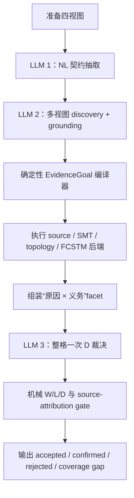

# Paper1 方法设计：源归因的可执行 issue discovery

状态：当前唯一候选设计。方法语义只由领域来源建立；工程调试数字只用于验证实现合同，不作为方法来源或论文效果结果。

## 1. 研究目标

本方法处理一个 NL-satisfaction oracle problem：给定自然语言需求和作者源状态机，发现实质性缺陷，并为每条报告 issue 构造预算内能够获得的最强可执行证据。

首要成功条件是在完整 145 条台账上显著超过 X1v2，而不是只改善 `D2 × L2`。预期优势确实主要来自行为层，因为 X1v2 在 L2，尤其是可达性、可达死端和终止性上最弱；但 precision 和 source attribution 是同等重要的安全条件，高 W2 比例不能抵消 false positive。

因此，方法主张不能写成“LLM + inspect + pyfcstm”，而应写成：

> 一种 NL 引导的 issue discovery 方法，其中每条接受的 issue 同时携带真实执行的 consequence certificate、独立的作者源 causality certificate，以及独立生成的规范性 D 判定。

## 2. 固定架构



正式计分路径没有 truth-feedback 搜索回路。一个冻结的候选批次只编译和执行一次；D 的冗余 subclass 由 `D × grounding` 机械派生，首轮一次处理整格 finding，随后至多一次只修非法 decision 子集，已经合法的 decision 立即冻结且不得进入 repair 输入，修复也不得产生新 finding。这样可以防止 W2 变成“不断换断言，直到碰到一条为假”为止的可爬坡指标，也避免为了修一条 D 判定而重写整批输出。

## 3. 阶段契约与跳转

| 阶段 | 输入 | 输出 | 跳转与降级 |
|---|---|---|---|
| `prepare` | NL、PlantUML、带 mapping 注释的 FCSTM、working contract | 输入 hash、canonical source IR、验证后的 inspect 摘要、确定性线索 | replay 非法要留审计；inspect 内部错误向下游降级 |
| `contract_extraction` | 仅 numbered NL | initial、containment、按 source 分组的 direct-transition raw contract，以及跨句复用的 concept ID | provider/schema 重试耗尽可以让整格失败；此节点不读取作者源，不得让错误制品改写规范 |
| 两个互补 `discovery_grounding` 分支 | 同一份 raw contract、NL、PlantUML、带 mapping 注释的 FCSTM、inspect 摘要、source IR 精确清单 | `contract_structure_contrast` 偏重契约/结构/对照，`behavior_consequence` 偏重可达性/响应/终止；各自产出全局 concept-ID binding、initial/containment 稀疏 veto、每个 raw transition target 的穷尽 exact observed-ID binding 和 `EvidenceGoal` | 两分支独立作出语义判断，开放候选取结构化并集；fresh 输出必须逐 raw group、逐 target 完整覆盖，缺失、重复或越界索引会让整个分支隔离且不得执行；确定性层只识别 exact-ID 冲突，不做文本相似度合并；formal scout 与执行只运行一次 |
| `compile` | grounded `EvidenceGoal.relation` 与正式 ID | canonical template、backend route、AssertionIR、可 replay code；由已选 transition ID 机械取得 source/target/event | 不支持、未落地或不一致的绑定降为 W1/W0 coverage gap |
| `execute` | compiled assertion + 当前精确 FCSTM/source IR | terminal receipt、observation/trace/cut/SCC、hash、limitations | 内部失败记 coverage gap，不允许让整格消失 |
| `facet_assembly` | execution outcome + source certificate + NL obligation | 每个 `(cause, obligation)` 一条独立 record | 已满足检查丢弃；W1/W0 假设保留 |
| `d_adjudication` | 首轮为 NL + 整格压缩后的 source/execution dossier；source state/transition inventory 只共享传入一次，各 finding 仅携带 certificate 与规范性字段，不含 W label | 首轮一次调用为整格每个 facet 恰好输出一个 `DDecision`，并用 exact `duplicate_of` 边标记报告级语义重复；必要时第二次只返回非法 key 的 replacement decision | 不允许新 finding；确定性 validator 冻结合同合法的 decision，只把缺失、重复或语义非法的 key、对应 dossier、精确错误和冻结 decision 摘要送入一次 targeted repair，仍失败则仅这些 facet `D_UNRESOLVED`；`duplicate_of` 只能指向稳定顺序中更早的已知 finding；完整 structured output 不可解析时可做一次结构修复；禁止把首轮改回 batch |
| `publish` | 全部 facet 与 decision | accepted D1/D2、confirmed D2-W2、D0 audit、coverage gap、四类 token usage 与美元成本 | 同模型美元倍率不合格的 run 可审计但不得进入结果 |

`cause` 只用于技术根因去重，`obligation` 才是 D 的判定单元。由同一个 missing entry 导致的两条规范义务不能继承同一个共享 D 值。报告层先按 exact cause key 聚合 facets，再消费 D 输出的 `duplicate_of` 边合并跨 cause key 的同一技术问题：LLM-C 必须判断相同 exact source elements/transition set、相同 violated property 与相同最小修复；确定性层只检查 earlier-key 方向、exact source-certificate cause 约束和 canonical `GoalRelation + bindings` property signature，不能从 claim 文本推断“最小修复”。claim 文本、token overlap、identifier 相似度和 embedding 均不参与合并，cluster 保留 `cause_keys`、`facet_keys` 与 `deduplicated_by_d` receipt。

## 4. 语义 IR 与证明策略

论文一等语义 IR 是五类 discriminated typed obligation；两个互补 LLM-B 分支分别输出 typed obligation、compiler-level `EvidenceGoal` lowering record 和精确 source state/transition binding。LLM 不输出 Python、pyfcstm predicate、proof template、backend、W、最终 L 或 support ceiling。编译器先机械检查 exact operator 与 relation 的事前兼容表，再按 relation 路由固定模板；没有 sound lowering 时由 `SupportDisposition` 降为 located-only W1 或 prose-only W0，避免 LLM 通过选择弱模板或错误后端改变证明义务。五类定义见 [DOMAIN_DERIVED_METHOD.md](./DOMAIN_DERIVED_METHOD.md) §3-§4，逐 operator 来源见 [TYPED_OBLIGATION_PROVENANCE.md](./TYPED_OBLIGATION_PROVENANCE.md)。

### 4.1 DomainObligation 与 EvidenceGoal 的正式含义

`DomainObligation` 是待反驳的论文级规范义务，分为 element、attachment、guard-set、graph 与 temporal 五族；`EvidenceGoal` 是其 compiler-level lowering record，不是论文缺陷类型学，`SupportDisposition` 则是编译器对当前 soundness fragment 的处置结果。当前 lowering 可写成 $G=\langle r,b,e\rangle$：$r$ 是 25 个内部 `GoalRelation` 之一，$b$ 是按语义角色命名的 binding record，$e\in\{true,false\}$ 是预期值。binding 字段包括 `observed_transition_id`、`reference_transition_id`、`subject`、`source`、`trigger`、`target`、`forbidden_scope`、`response`、`variable`、`sign`、`phase`、`count`、`condition` 和 `within_cycles`；它们在 Pydantic record 中大多 optional，relation-specific 必需字段由 compiler 检查。

这是一种宽松实现的 discriminated union，而不是 25 个严格子类型。宽松 record 的目的，是让一个缺字段或暂不支持的候选降成 W1/W0 coverage gap，而不是因 schema validator 把整个 pair 杀掉；代价是 schema 本身不会阻止无关字段出现，且缺失的 relation-specific binding 要到 compiler 才能发现。冻结前可将它改成严格 tagged union，但必须保留“单候选降级、不杀整格”的外部行为。

`expected` 的含义由 relation 的方法自有语义固定。例如 `state_exists(subject=q, expected=true)` 要求 q 存在，`transition_absent(observed_transition_id=t, expected=true)` 经 formal binding 后会被编译为该 exact edge 不应存在，`event_reaches_target(source=q0, trigger=e, target=q1, expected=true)` 要求在可到达 q0 的前提下施加 e 后进入 q1。只有 `actual != expected` 且所有前提成立时才形成 counterexample；LLM 不能通过选择 template、backend 或弱谓词改变这个判断。

一个完整候选还携带 `obligation`、`claim`、`basis_kind`、`basis`、`nl_quote`、`priority`、`locations` 和 `observed_fact`。`basis` 要求模型用自然语言说明它如何把 NL 义务、形式事实和可反驳点联系起来；`observed_fact` 只陈述输入中的可观察事实，不把执行结果冒充规范依据。D dossier 还保留 `rationale`、`grounding`、`violated_obligation`、`strongest_defeater`、`defeater_kind` 与 `defeater_disposition`，使每个 D2/D1/D0 都能审计“为什么这样判”和“什么反例仍存活”。这些散文与报告字段只用于语义审计、debug 和环外复核，不进入 assertion code/hash；真正控制编译的只有 Goal、精确 binding 和形式制品。`proposed_l` 也不直接计分，最终 L 按 compiler relation 机械派生。

### 4.2 LLM 如何生成 Goal

LLM-A 仅读取 numbered NL，先抽取 initial、containment、direct transition、required state、required event scope 和跨句 concept ID。它不能看到 PlantUML、FCSTM 或 inspect，因此错误制品不能反向污染规范合同，但 A 仍可能误读 NL。

两个 LLM-B 分支随后读取同一份冻结输入：A 的 raw contract、numbered NL、作者源 PlantUML、带 mapping 注释的 FCSTM、inspect 摘要和 exact source inventory。`contract_structure_contrast` 偏重显式契约、结构、跨边对照和 L0/L1，`behavior_consequence` 偏重可达性、响应、终止和 L2；二者分别输出 exact concept binding、对 initial/containment 的稀疏 `rejected/unresolved` veto、对每个 raw transition target 的穷尽 observed-transition binding，以及 surface/behavior `EvidenceGoal`。穷尽 transition binding 是必要的，因为“哪条作者边实现了 NL 条件或动作”属于开放语义，不能交给 deterministic 字符串匹配；fresh 输出通过纯索引合同检查逐 group、逐 target 的存在性、唯一性和边界，任何不完整分支整体隔离且不得执行，旧 replay 才保留显式兼容路径。已存在且满足的 contract 会在执行后被机械过滤，缺失、错误目标或未决 binding 才进入 finding。候选取结构化并集，两个分支不会看到对方输出或执行 truth。

Prompt 明确要求每个候选只有一个 obligation、一个可证伪 claim、一个 observed fact，并给出 exact source state/transition ID；LLM 只选 `relation` 与语义 binding，不写 Python、谓词调用、template、backend、W、L 或 D。无法从输入语义上证明的绑定必须进入 `unresolved`，不能凭名字、label、字符串相似度、唯一候选或执行结果猜测。worked examples 只使用 `q0/q1/evt_a` 等合成符号，不含真实 pair、ledger item、baseline miss 或预期答案。

B 同时承担 A 的语义复审：`rejected` 表示 raw relation 并不由 NL 支持，`unresolved` 表示仍有多种称职读法；两者都应成为执行 veto。这里的判断只针对规范 relation 是否成立，不能因为制品违反它就把它否决，也不能因为制品刚好满足它就接受它。

### 4.3 Goal 到 AssertionIR 的编译算法

编译不是把 LLM 文本拼成 Python，而是以下固定链条：

1. Assembler 先消费 B 的 `grounded/rejected/unresolved` 决策；被 veto 的 raw contract 或 candidate 不进入执行。
2. `_validate_direct_grounded_candidate()` 只检查 exact source state/transition ID、正式 path grammar 和允许的引用闭包。非法 binding 被清空并记录 diagnostic，不从散文或相似名称补全。
3. `_apply_formal_transition_binding()` 对 LLM 已选择的 exact transition ID 读取 canonical source AST 的 source、target、event、guard，并保存每个派生字段的 basis。这里允许机械读取 observed fact，但禁止用 observed target 填补尚未解决的 normative target。
4. `compile_evidence_goal()` 依据 `relation → template → backend → operation` registry 检查 relation-specific 必需字段。部分 relation 直接生成一个或两个 `ProbeCheck`；拓扑、SMT、source-static、双边迁移和稳定终止 relation 进入专用 Evidence Program。
5. 谓词路径把每个 `ProbeCheck` 规范化为 AssertionIR 四元组 `role/predicate/bindings/expected`，按 method-owned `PREDICATE_SIGNATURES` 检查缺失与多余参数，再确定性渲染为表达式。多个 check 组成 `assert all([...])`；precondition 为假表示该主断言没有被执行，不是 finding，只有前提为真且 primary 为假才是 counterexample。
6. 生成的 assertion code 再由现有 assertion parser 解析，得到 terminal expression 和 code hash，然后在 sealed pyfcstm predicate environment 中真实运行。专用路径同样生成可 replay program、program hash、后端观察和 terminal verdict，而不是只返回一个 LLM 判断。
7. 执行器同时生成 `execution_certificate`、`source_causality_certificate` 与 `semantic_binding_receipt`。W2 需要确切 FCSTM hash、assertion hash、terminal result、counterexample 和合格 source attribution；缺字段、unsupported fragment、非 terminal 或异常分别降为 W1/W0，并保留原 Goal 与 diagnostic。

下面是一个完全合成的示例。LLM-B 可以输出：

```json
{
  "relation": "event_reaches_target",
  "observed_transition_id": "tr_a",
  "source": "M.q0",
  "trigger": "evt_a",
  "target": "M.q1",
  "within_cycles": 3,
  "expected": true
}
```

Compiler 先核验 `tr_a`，再从 exact AST 读取 observed source/event，但保留 LLM 给出的规范 target。它随后产生：

```json
[
  {"role": "precondition", "predicate": "reaches", "bindings": {"source": "[*]", "target": "M.q0", "within_cycles": 6}, "expected": true},
  {"role": "primary", "predicate": "occupancy_after", "bindings": {"source": "M.q0", "trigger": "evt_a", "target": "M.q1", "within_cycles": 3}, "expected": true}
]
```

可 replay code 的形状是：

```python
_paper1_check_1 = reaches(source="[*]", target="M.q0", within_cycles=6) is True
_paper1_check_2 = occupancy_after(source="M.q0", trigger="evt_a", target="M.q1", within_cycles=3) is True
assert all([_paper1_check_1, _paper1_check_2]), "paper1 formal evidence assertion failed"
```

若 `q0` 不可达，第一条为假，结果记 `precondition_failed`，不能宣称 event-target defect；若 q0 可达而第二条为假，则得到 W2 counterexample；若两条都为真，则该候选被制品满足，不发布 issue，也不把 truth 回灌给 B 改写 Goal。

### 4.4 错误校正、异常与降级

当前原型不是“完全不校正”，但校正按错误类别隔离，而且没有执行 truth 驱动的断言改写回路：

| 错误类别 | 当前处理 | 是否再次调用 LLM | 设计理由 |
|---|---|---|---|
| structured output/Pydantic schema 非法 | `_invoke_with_schema_repair()` 将具体 validation error 回给同一 role 一次，要求保持同一语义答案、不增加 finding、不修改合法内容 | 是，最多一次 | 修结构，不重新搜索问题 |
| LLM-A raw contract 语义错误 | 两个 B 分支可输出 `rejected/unresolved` sparse veto | 是，但属于原定 B 语义复审，不是执行后返工 | A 只读 NL，B 用多视图复审规范 relation |
| fresh B transition binding 缺失、重复或索引越界 | 对 raw group 与 target index 做纯结构完整性检查，不完整分支整体隔离并保留 diagnostic，不执行该分支的 contract 或 candidate | 否 | 条目覆盖是可完美判定的合同；条件/动作语义仍完全来自 LLM 输出，不用字符串补全 |
| 两个 B 对同一 concept 或 raw transition target 给出冲突 exact ID | 确定性移除冲突 binding 并记 unresolved diagnostic，raw contract 进入 coverage-gap fallback | 否 | 冲突本身可完美判定，不能猜一个赢家 |
| exact ID 非法或 required binding 缺失 | 清空非法字段或由 compiler 返回 relation-specific error，候选降 W1/W0 | 否 | 当前没有 execution-before repair；避免隐藏的语义补全 |
| unsupported guard、并发、hierarchy 或其他 formal fragment | 保留 Goal、限制与 coverage gap，最高 W1 | 否 | LLM 不能修复后端 soundness 边界 |
| candidate executor exception | 逐候选隔离为 W1/W0，记录异常，其他候选继续 | 否 | 一个后端异常不能让整 pair 消失，也不能让 LLM看到 truth 后换断言 |
| assertion terminal verdict 为 satisfied | 不发布该 issue，保留 attempt ledger | 否 | 正式路径禁止不断改 Goal 直到得到 false |
| D structured output 非法 | 整格 D 调用做一次带精确错误位置的 schema repair | 是，最多一次 | 只修输出形状，不重新分批搜索 |
| D finding key 缺失、重复或 D 等级/grounding 合同非法 | `validate_d` 冻结全部合法 decision，只把非法 key、对应 finding dossier 和逐条错误送入一次 `paper1_d_targeted_repair`；仍失败仅非法子集 `D_UNRESOLVED` | 是，最多一次 | 初始 D 不 batch；局部返工不重写合法 decision，也不重启 discovery |
| provider 错误或两次后仍 schema-invalid | 允许整格失败并保存审计 | 否 | 这是仓库失败政策允许的两个 escape hatch |

计费不把上述错误一视同仁。只有确实触发下一次调用、且由 typed 异常或 HTTP 状态确认的 provider/transport failure retry 前序 attempt 可以标为 `provider_error_retry_exempt`；没有发生 retry 的 provider 失败也计费。schema 失败、D targeted repair、内容返工和 `stop_reason=max_tokens` 截断的每个 attempt 都计费。输出截断不得在 responder 内用同一输入盲重试，而是作为 `structured_output_limit` 进入至多一次、携带具体错误的结构修复。每个逻辑调用聚合全部应计 attempt 的 uncached input、output、cache read 与 cache write；若任一应计 attempt 没有完整 usage，整格成本不具备实验资格。

最重要的边界是：backend exception 不交给 LLM“改到能跑”。异常可能来自后端 bug、unsupported semantics 或环境问题；正确处理是封存原 Goal、记录 stack/error class、修复后端后 replay 同一个 Goal。若把 exception 连同 truth/counterexample 交回 B，模型可以通过改变义务规避错误或追逐 W2，实验将失去可解释性。

当前缺少一次 execution 前的 binding-only repair。冻结版可以增加且建议增加一次，但反馈只能包含 unknown exact ID、缺少 relation-required field、非法 formal path、重复/冲突 binding 等合同错误；不得包含 assertion true/false、counterexample、trace、ledger match、W/D 或“换一个更容易失败的 relation”，也不得新增 candidate。修复后必须生成新的 LLM receipt并与原 candidate ID 绑定；若仍非法则按现有路径降级。该环节尚未实现，本文不把它计入当前 pilot 能力。

13 个逻辑模板共享 4 个固定物理后端：

| 模板 | 主要义务 | 后端与证书 |
|---|---|---|
| T01-T05、T07 | initial state、inventory/effect、transition、containment、label、entry | source/artifact AST 与 inspect receipt |
| T06 | 守卫是否可区分 | 确定性 guard normalization + SMT witness |
| T08-T10 | escapability、reachability、stable termination | topology path/cut/dead-end/SCC proof；必要时再做 bounded execution |
| T11-T12 | event target、response、consumption、termination | 唯一 consumer 可达性与事件响应的合取断言；可达时执行 pyfcstm trace，不可达时由 topology cut 短路形成反例 |
| T13 | 两个经 LLM 语义判定为同目标角色的迁移是否一致 | LLM 选择被测 transition ID、参照 transition ID 与规范目标；确定性层只读取 exact AST 端点和 FCSTM mapping，执行双边 target assertion 并把两条边同时写入 source/D certificate |

这既不是让 LLM 自由生成 Python，也不是让 LLM 从闭合谓词工具箱中选择。自由 Python 的即时表达能力高，但可复现性、source attribution 和预算都差；现有 19 个谓词仍可作为 backend primitive，但不再定义方法的表达边界。

## 5. 语义与确定性计算的硬边界

任何涉及 NL 的同义、指代、条件作用域、规范义务、描述与 source element 的对应关系都属于非确定性语义问题，必须由显式 LLM 节点回答并保存结构化输出。运行时禁止使用正则、关键词、`and/or` 等连接词、词干、编辑距离、substring、embedding 相似度阈值或 identifier 形状来替代这些判断；这类启发式即使在工程调试中提高 hit，也不能进入方法或正式实验。

该禁令同时覆盖 schema validator 和数据预处理。validator 只能拒绝可被完美判定的结构错误，例如非法枚举、缺少必填项、精确 ID 不存在、引用越界、正式语法不合法或预算越界；不得依据自由文本的长度、词汇、标点、相似度或解释内容决定某个 contract、binding、finding 或 D 是否成立。`basis`、`reason`、`observed_fact` 和 `rationale` 只承担可读审计说明，不参与 deterministic control flow；LLM 给出的 `grounded/rejected/unresolved`、D 枚举和 exact binding 字段才是 assembler 可消费的语义决策。若这些散文改写而结构化字段不变，方法的编译、执行、W/L、D 合同和 source certificate 必须保持不变。

确定性计算只承担能被完美判定的合同：schema 与枚举、精确 ID 存在性、transition ID 的 source/target 一致性、source AST/working-contract mapping、pyfcstm inspect/trace/topology、SMT、hash、预算、引用原文是否逐字存在。后一项只证明引用完整性，不证明引用支持 claim。若语义 grounding 未决，系统必须显式降级为 W1/W0 或 coverage gap，不能通过确定性猜测提升为 W2。

允许的字符串处理只有形式语言 lexer/parser 与确定格式校验，而且必须有公开语法和失败出口：例如把 guard expression 解析为 AST 后交给 SMT、把正式引用解析为精确 ID、校验 `NL3` 是否是合法 anchor。它们不能在原始 NL 上搜索词语后产生语义结论，也不能用 path suffix、alias 剥离、编辑距离或唯一候选补全来猜 source element。每个 reviewer-facing deterministic stage 都必须说明其 soundness fragment；超出 fragment 时降级，不用近似规则填洞。

这条边界必须作为方法准入门执行，而不是作为“尽量避免”的工程偏好。任何 deterministic stage 只要从 NL、claim、obligation、自由 label 或 identifier 名称的词面内容推出同义关系、因果关系、规范义务、缺陷类别或 finding-to-ledger 等价关系，就应从正式方法中删除并改为 LLM 裁决。唯一例外是对已经声明为形式语言的字段按公开 grammar 做词法/句法解析；parser 只能输出 token/AST 与语法失败，不能把载荷中的业务单词升级为语义结论。

原型中的 `paper1.uml251_transition_label.guard_only.v1` 是该例外的最小实例。它只读取 canonical source AST 的 `transition.attributes.raw_label`，只接受 `guard_only_label ::= "[" guard_body "]"` 这一失败闭合片段，且将 `guard_body` 保持为不透明载荷；它不读取 NL，不判断载荷是否与某个 event 同义，也不声称 PlantUML 自身强制该 grammar。方法明确声明“PlantUML 容器语法 + UML 2.5.1-derived transition-label profile”，从而可以确定性得到“无显式 trigger、有 guard、无 effect、隐式 completion trigger”，再由 source AST 判定 composite 是否存在到自身 final pseudostate 的边。是否本应建模为某个外部事件仍属于 NL/意图问题，只能由 LLM grounding 与 D 裁决处理。

该 profile 同时展示 W 与执行介质的边界：source assertion 即使真实运行并得到反例，只要 FCSTM converter 已把 opaque label 投影为实际声明且消费的 event，就只能输出 `W1 + representation_debt`，不能把转换后的行为当作 source 缺陷的 W2。certificate 必须同时保存 source AST hash、profile ID、compiled assertion hash、final-edge observation、FCSTM hash、exact event projection 和 inspect usage；这证明断言确实运行过，也诚实说明为什么它没有资格升级为 W2。

因此，W2 是一个带前提的可执行见证：它证明“给定已记录的 LLM 语义绑定，断言在确切 FCSTM 上得到 terminal verdict”。certificate 必须写入 grounding authority、formal ID、artifact/assertion hash、observations 和限制；论文不能声称确定性代码证明了 NL 与形式元素同义。错误绑定风险由独立 D 节点、source attribution gate、环外 blind precision judge 和 semantic-grounding ablation 共同测量。

原型已经把这条边界做成可核查证据合同，而不是留在 prompt 或一个自我声明布尔值中。每个执行组及其 W2 certificate 必须携带 v2 `semantic_binding_receipt`：新运行的 LLM authority 必须回指实际 `paper1_discovery_grounding` observation 的 `llm_call_id`，并以 SHA-256 链绑定 profile/provider/model、system/user prompt、raw/parsed output、semantic plan、grounded contract/evidence plan、候选和 formal binding transforms；确定性来源只能是 `formal_source_ast` 或 `formal_pyfcstm_diagnostic`，其 receipt 必须声明 `scope=formal_fact_only`、`semantic_decision_claimed=false` 且不得携带伪造的 LLM provenance。run-level audit 会把 receipt 与同一 immutable record 的 observation 和当前 plans 对拍，任何缺失、篡改、错链或 replay 标志不一致都会使 W2 或实验资格失效。该链只能证明“哪次 LLM 调用作出了什么绑定并被哪个编译输入执行”，不能证明绑定语义正确；后者仍由 D 裁决与环外 blind judge 评估。

progressive inspect scout 也遵守同一边界。它只把 exact diagnostic code 和 typed refs 记录为 `FormalFact`，并引用事前登记、带 rule ID、适用前提和来源的 `OracleRule`；它不解析 diagnostic message，也不声称规则已经被 NL 授权。真实执行可以证明 formal diagnostic 存在并形成 W2 consequence，但该规则对当前需求是否构成缺陷必须由 LLM-C 处理最强 defeater，正式效果评测还必须由环外 reference judge 终裁。

确定性执行还满足一条可测试的语义非干涉合同：当 formal `EvidenceGoal`、exact binding 和模型制品不变时，任意改写 `claim`、`obligation`、`observed_fact` 等散文都不得改变 compiled assertion、terminal verdict、W 或 source certificate。为此，散文不进入 assertion code 和 assertion hash，只进入报告与 D dossier；回归测试使用两套完全不同的散文对同一 formal goal 做机械对拍。反过来，若要改变 goal 或 formal binding，必须产生新的 LLM 语义决策及 receipt，不能由确定性层从散文中推断。

面向论文审查时应直接使用下面的边界表，不能把“确定性”泛化为“所有东西都由代码判断”：

| 问题 | 唯一允许的裁决者 | 允许的确定性动作 | 禁止替代物 |
|---|---|---|---|
| NL 同义、指代、条件作用域、义务是否成立、NL 概念对应哪个 formal element | LLM semantic grounding / D adjudication | 保存其结构化输出、检查引用的 exact ID 是否存在 | 关键词、substring、`and/or`、词干、编辑距离、embedding、identifier 形状、唯一候选补全 |
| PlantUML/FCSTM 正式语法、AST、精确 mapping、图可达性、trace、SMT、hash、预算 | parser、形式化后端、确定性代码 | 按公开语法和声明的 soundness fragment 求值 | 用诊断 message 文本或 NL 词面反解语义 |
| exact diagnostic 是否出现、typed ref 指向何处 | 版本化 formal scout | 输出 `FormalFact + OracleRule ID` 并真实重放 diagnostic | 把 diagnostic message 改写成已成立的 NL 义务，或跳过 LLM-C 的规范适用性判断 |
| 找到的 finding 是否与台账同一处同一性质 | 环外 blind semantic judge | exact ID 对齐只能作为输入事实 | runtime 读取 ledger、字符串相似度或规则化自动匹配 |

这张表同时是实现准入门：任何不能由形式语法、模型 AST、精确引用关系或预先声明的 proof fragment 完美判定的步骤，都必须成为具名 LLM 节点，并在 run record 中保存模型、prompt、raw/structured output 与 usage。字符串代理不得以“预处理”“召回增强”“候选缩减”或 schema validator 的名义进入方法；逐字 quote span 校验只验证出处，不验证语义蕴含。对 reviewer 的可防守表述是“LLM 承担开放世界语义裁决，proof compiler 承担闭合世界形式求值”，而不是“确定性代码理解了自然语言”。

## 6. 可执行证据与三条轴

### W

- `W2`：至少一条 compiled assertion 在确切 FCSTM 上真实运行，并得到 terminal counterexample；receipt 必须含 artifact hash、assertion hash、backend config、observation 和 terminal verdict。
- `W1`：具体元素/路径或 assertion target 已定位，但编译或执行缺失/不确定。
- `W0`：只剩散文假设。

W 完全机械派生，LLM 不输出 W。W1/W0 若携带有效 terminal counterexample 是合同错误；W2 没有此类证书同样无效。

### Source attribution

FCSTM execution 与作者源 causality 是两个不同命题。只有具备 behavior runtime path、direct source certificate 或 dual certificate，能够同时证明局部 source cause 和 FCSTM consequence 的 W2，才能提升为作者源 issue。静态 inventory/structure 检查没有 source certificate 时一律 unattributed；representation debt 和 concurrency projection 必须作为独立结果保留。

### D 与 L

D call 读取实际 source facts 与 certificate summary，但看不到 W label。它必须先处理 grounding 和最强 undercutting/rebutting defeater，最后再输出 `D2/D1/D0`。D1 必须同时具有非 `none` 的第一读法 grounding 和一个存活或未决的 undercutting defeater；仅仅执行未完成、结构主张未证实或没有可陈述义务时应判 D0，不能把 epistemic uncertainty 冒充两读并立。D1 与 D2 均保留，D0 留在 audit set；`confirmed_issues` 更窄，只包含 D2 + W2 + safe source attribution。

D dossier 采用“共享事实表 + finding 引用”的关系型表示：numbered NL、source state inventory 与 source transition inventory 在整格只出现一次，每个 finding 只携带 `finding_key`、claim、obligation、逐字 NL anchor、evidence status、source attribution、typed language/oracle receipt 与压缩 source certificate。LLM-C 仍在一次调用中同时看到全部 finding 和同一份全局 source graph，能够跨 finding 识别共同根因与相互冲突；消除的只是同一 source neighborhood 在几十个 finding 中的字节级重复，不是把 D 重新分 batch。

L 根据语义关系机械派生：直接 inventory/edge fact 为 L0，静态 structure/guard relation 为 L1，path/reachability/response/termination obligation 为 L2。模型提出的 L 不得覆盖这份映射。

## 7. 当前原型证据

最新 receipt-v2 机制验证是 `0048-v6-receipt-v2-oracle-rule-fresh-opus47`。该 run 不 replay 旧 plan，恰好完成 `contract_extraction`、`discovery_grounding` 和 `D adjudication` 三次调用，0 次 schema repair，observed token 分别为 10,810、34,682、7,175，总计 52,667，即 24.36× X1v2；usage 完整、token gate 与 run-level semantic provenance audit 均通过。5 条 finding 中，`Fork2 ⊂ Join2` 为 D2/W2/L1，`Join2 -> Join1` 丢失 `sunny=true` condition 为 D2/W2/L1，`choice1` reachable deadlock 为 D2/W2/L2，另外两条 root-final 假设为 D0/W1。所有 LLM-grounded execution certificate 都回指同一真实 LLM-B call，且 `parsed_output_sha256 == semantic_plan_sha256`；formal authority 不冒充 NL semantic decision。LLM-A 本次没有生成旧 run 的 `Junction3` initial 错契约，因此本 run 证明的是错误前提没有进入执行层，而不是 LLM-B 显式执行了 veto。0048 无台账条目，不能提供 recall 结论。

`0030-v5-final-event-contracts-langgraph-opus47` 用于验证 required-state 与 required-event-scope 两个 NL 合同是否能稳定进入执行层。该 fresh 三调用消耗 40,986 observed token，即 18.96×，低于 25×硬门。LLM-A 主动抽出 `auto final` 和 `power off × each operating mode`，LLM-B 将 `auto final` 指定为 `Autonomous` 的 final pseudostate 缺失，并把 Power Off 的 required scope 精确列为 `HumanDriving` 与 `Autonomous`。前者在 source AST 上确实缺失，但 FCSTM converter 已为 `Navigating`、`Parking` 各生成一条 scope-local final edge，因此真实 FCSTM assertion 返回 satisfied，方法诚实输出 D2/W1/L0 与 representation debt；后者在 `Autonomous` 上得到 terminal counterexample 与 source 双证书，输出 D2/W2/L0。该结果证明开放的 NL contract 可以机械 fan-out 为逐 scope 的可执行断言，也证明 W2 门能压住 root-final 误绑定：LLM-B 另把已存在的 root final marker 误标为 missing，但双侧 assertion 均 satisfied，最终没有发布 finding。

v5 同时显示当前未冻结：一个候选明说“no surface violation”却仍占用 candidate slot并降为 D0/W1；两个 Power Off L2 假设重复了 event-scope contract，其中一个错误使用别处 transition 仅绑定事件身份而降为 W1；root scope event contract 因当前 exact-state scope合同不接收根机器而留下 formal diagnostic。对应修订只能发生在 LLM prompt/IR 边界，不能用 NL 关键词或 identifier 规则补答案：`final_pseudostates` 清单现在被明确规定为 realized/missing 的正式依据，`event_reaches_target` 只允许选择作为该 normative source 响应实现的 transition，缺 scope consumer 必须走 indexed event-scope binding。

既有真实输入运行只作为工程调试记录保存在 `runs/paper1/witness-search/`，不用于论证 relation、compiler 或 prompt 语义的由来。五格 pilot 的逐 record 对齐、strict confirmed 集、成本和限制集中记录在 [PILOT_REPORT.md](./PILOT_REPORT.md)；它不是统一冻结版本的完整 benchmark，不能替代 54 pair 效果结论。方法语义由领域来源账给出，效果统一由完整 54 pair benchmark 给出。

`0048-v2-grounded-union-fresh-opus47` 是一次事前未读 NL、PlantUML、ledger 与 X1v2 的 hash-selected fresh pilot。v1 暴露 bounded LLM schema 被误用于合并后内部合同的问题；无损 `GroundedContractPlan` 与 `16+3=19` 回归修复后，v2 完整产生 29 个 outcome、6 条 report，全部 W2，D2/D1 各 3，L0/L1/L2 为 2/3/1。事后打开第二版台账发现 0048 没有条目，因此该 run 的 hit 分母为 0；它只能测试未登记发现与 false positive。LLM-B 已把 `Junction3` composite-initial 和 `Fork2 -> Terminate` 两个 raw contract 明确记为 plan artifact/错误源端，但旧 binding schema 仍执行并分别发布为 D2/W2 与 D1/W2，说明真实 execution certificate 不能挽救错误的规范前提。当前 schema 因此要求每个 raw contract 显式给出 `grounded/rejected/unresolved`，后两者由 assembler 机械停止编译且绝不解析 reason 文本。v2 三个成功 attempt 的 recorded usage 为 53,139 token，但两次 schema-repair 首次 attempt usage 缺失，故 `eligible=false`，不能进入效果或成本主结果。

v4/v5/v6 均补充 `selection.json`。v4/v5 因源码当时未入库而诚实标记 exact Python bundle 无法事后重构，只保留 record hash 与嵌入式 prompt/parsed-output/compiled-assertion bundle hash；v6 同时保存 exact Python bundle hash。该处理避免用当前源码 hash 冒充旧 run 的方法版本。

最新确定性回归覆盖互补双 B LangGraph、逐候选异常隔离、双迁移 target-consistency AssertionIR、binding-patch 写保护、无损 grounded contract 合并、LLM semantic veto、内部 grounding 错误降级、initial-entry violation、跨区域 initial target、containment、reachable deadlock、missing-initial reachability、expected/observed transition 分离、`transition_absent`、`event_avoids_scope`、`termination_target`、LLM transition-ID grounding、identifier suffix 不得猜测、文本散文与 diagnostic message 对 formal execution 的非干涉、guard-only formal profile 的失败闭合、FCSTM mapping 注释只使用正式 AST full path、attribution exclusion 只使用封闭 formal-ref projection、未绑定语义强制降为 W1、事件 consumer 不可达短路、concurrency projection rejection、guard overlap、静态归因收紧、W2 certificate validation、semantic-binding receipt v2、call/plan/candidate hash-chain 对拍与篡改拒绝、prompt leakage、W1/W0 retention、D/source-attribution 隔离、正式 final marker 进入 D dossier、source/FCSTM final-pseudostate 双侧执行、event-scope 逐 scope 展开与空 scope 失败闭合、D subclass 机械派生和 per-obligation D assembly。这些只能证明机制按合同工作，不能估计完整 benchmark recall。

`0046-v11` 是语义边界的直接反例。LLM 把 “three different state areas” 绑定为 `SearchRegion` 的 direct-child cardinality，编译器随后正确地在 FCSTM 上判 `cardinality(..., 3)=false`，source AST 也正确地给出四个直接子状态，因此 W2 与 dual source certificate 都是真的；但台账 `EIS-0046-02` 检查的是 UML region 数与搜索期间的区域角色，台账 detail 还明确指出“数 `SearchRegion` 叶态得到 4”不能表达 region count。按同一处、同一性质协议，该报告不命中台账。这个例子证明 W2、source attribution、D1 仍不能保证 semantic binding 正确，也证明不能用字符串规则、同一个数字或表面位置把它自动匹配成 hit。

当前骨架已经足以支持“可执行见证 + source certificate + 独立 D + report-level cause clustering”作为 paper1 的唯一主候选。尚未解决的表达面包括跨句边界/完成条件义务、并行或区域角色语义，以及事件适用范围；这些能力只能从领域来源建立，再由 LLM 从 NL 形成 obligation 并交给固定 compiler 执行，不能从 benchmark item 或关键词扫描补齐。正式结论取决于完整 54 pair 上的整体 hit、重复运行稳定性、pair-clustered CI 与环外 blind precision。

## 8. 评测与事前登记建议

完整 benchmark 运行前必须冻结领域来源库版本、obligation taxonomy、prompt/compiler hash、pyfcstm commit、matching protocol 和 budget policy；随后以同一方法版本统一运行全部 54 pair。

主验收门：

1. overall `hit@1` 至少比 X1v2 高 5 个百分点，且 pair-clustered bootstrap 95% CI 下界大于 0。
2. overall `hit@all` 同时提升；只有偶然命中增加不算成功。
3. D2 × L2 不再是少数成功区：目标为完整运行覆盖至少 28/34 个 unique item、`hit@3 >= 70%`、`hit@all > 50%`。
4. 必须分别报告 L0/L1/L2 和每个 D × L 分层，不能只报 D2 × L2。
5. precision 必须由方法环外的 blinded packet 判定。method D 是预测，不是实验真值；unmatched finding 必须获得独立 `reference_d`。
6. 每条 accepted item 必须报告 W、D、L、source-attribution status 和 attempt count；W2 fraction 必须与 substantive/mutation-surviving fraction 一起报告。
7. mean cost 目标为不高于 X1v2 的 15 倍，每个具备实验资格的 pair 必须不超过 25 倍；不能为了压到 10 倍而删除候选通道。

必要对照：

- X1v2 与 budget-matched repeated-X1，用于区分 scaffolding 收益和纯 inference budget 收益。
- 分别移除 NL contract extraction、semantic grounding、inspect/mapping input、deterministic execution、source causality gate、D adjudication 的 ablation；semantic-grounding ablation 必须使用无语义猜测的 W1 降级版本，不能换回字符串启发式。
- 按 surface-visible fault 与 behavior-constructed fault 分层的 mutation benchmark，作为不依赖自然缺陷台账的第二分母。
- 同时报告 precision、method-D/reference-D confusion、W distribution、unique-hit yield、每个外部有效 issue 的 token、mean/p95/max cost，以及 failed/degraded grid。

## 9. 泄漏与证据边界

- Runtime code 不导入 `ledger.json` 或 X1v2 results。
- Prompt 只含 `q0`、`q1`、`evt_a` 等合成名称；测试会拒绝四位 pair ID、台账 ID 和真实制品 identifier。
- 工程调试输入只用于核对实现合同，不参与方法语义归纳，也不提供 benchmark 效果结论。
- 每条 obligation、relation 与 prompt 语义纪律必须回指独立领域来源；调试只能修复实现偏离。若缺少领域依据，则该能力保持 unsupported 或 W1/W0，不得按真实 item 定制。
- 环外 judge 是对冻结输出的全人工 hit/FP 对账，不调用 LLM、不产生 token 或美元成本，也不属于 method inference cost；25× 只比较 prototype issue generation 与同模型 X1v2 issue generation。
- 25 倍 budget gate 使用 provider observed usage；usage 缺失或越过上限会让 run 失去实验资格，而不是静默截断证据。

## 10. Paper 定位

此前 sub-PR [#186](https://github.com/HansBug/research_ideas/pull/186) 对 LLM4MDE/LLM4Modeling 方法素材的结论应作为当前设计的来源说明，但不能未经重审直接充当论文证据。其 [SUMMARY](../../related_work/neighborhood/SUMMARY.md) 复算一份 N=86 mapping study：model generation 为 62/86，model validation 为 11/86，其中 behavior-model validation 只有 2 项；因此本方向是小众而非空白。其 [确定性工具角色分类学](../../related_work/neighborhood/TOOL_ROLE_TAXONOMY.md) 还说明，工具价值取决于“输出 + prompt 框定”的联合角色：定域到具体元素和输出反例证据可能帮助发现，把工具输出改写成祈使句规则则可能重新分配召回并造成隧道视野。当前方法据此把 inspect 用作有 source ref 的 discovery evidence，把 AST/topology/SMT/trace 用作求值与证书，不把诊断码或文本 warning 当 NL 义务。

同一材料还给出两条对架构的直接约束。第一，有 sound oracle 但只回灌“哪些性质没满足”仍可能长期不收敛，必须提供 path/cut/SCC/trace 这类元件级定域；当前正式计分路径因此不设 truth-feedback 搜索回路，只执行冻结候选并保留反例证书。第二，闭合中间表示的效应方向会随模型变化，不能照搬旧 19 谓词闭合词表；当前采用“开放语义目标 + 闭合 proof compiler”的混合设计：LLM 可以提出新 `EvidenceGoal` 语义关系，但进入 W2 之前必须落入方法拥有、可审计、可扩充的 AssertionIR 与四类后端。

本论文可防守的贡献是同时闭合三段关系：

1. 发现超越逐句对齐的 NL-satisfaction obligation。
2. 将这些 obligation 编译为真实执行、可 replay 的 consequence。
3. 在作出独立且可推翻的 D 判定前，证明这些 consequence 是否能归因作者源。

当前最大风险同时包括表达面缺口，以及完整 54 pair benchmark 上的实际 recall 与 precision。当前仅完成 145 条 `id/D/L/axes/summary` 的粗粒度通览，尚未建立逐条 `ledger item → normative property → EvidenceGoal → binding → backend → W ceiling` feasibility 矩阵；已经确认 region/正交并发、具名 action/effect、精确 condition、state kind、层次优先级/history 和独立 trigger 集等缺口。因此不能声称全部或大多数台账问题已经证明可表达。表达面现状、逐条审计合同和领域先行构建协议见 [EXPRESSION_SURFACE_AUDIT.md](./EXPRESSION_SURFACE_AUDIT.md)。
