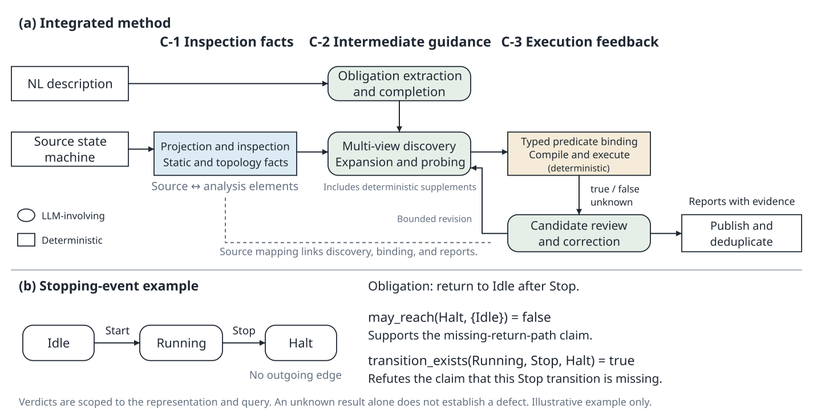
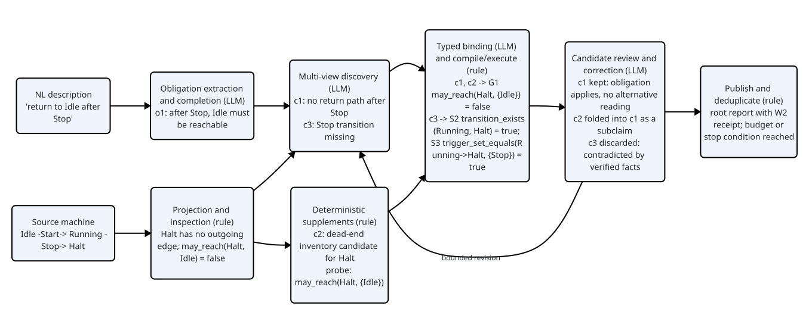
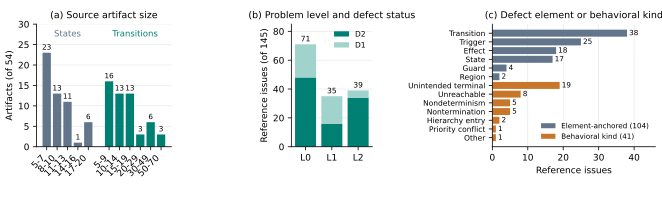
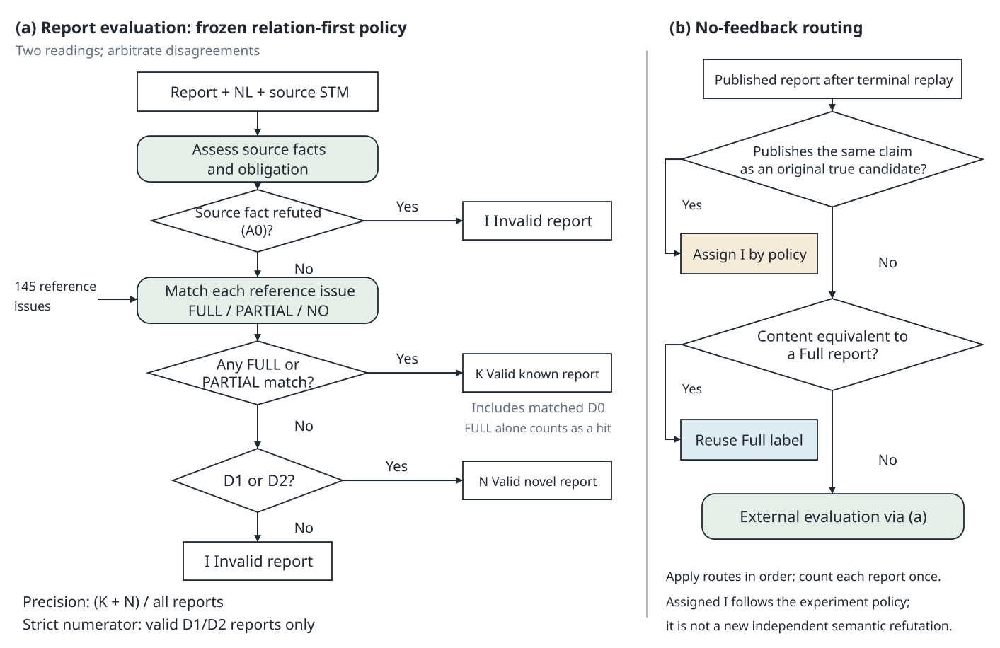
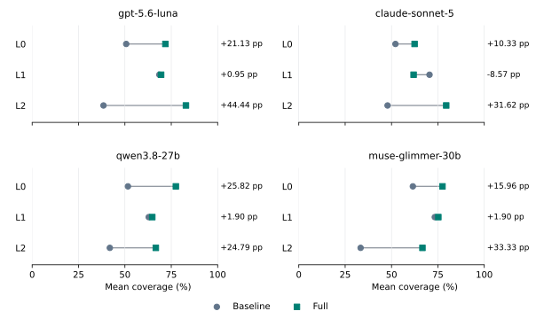
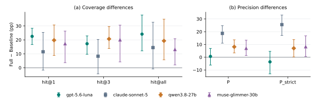
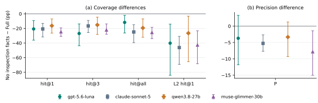
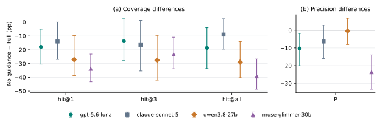
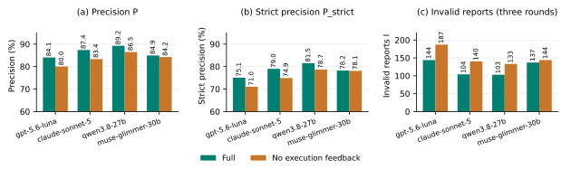

# 事实、引导与执行：LLM 发现状态机行为问题需要什么

**Facts, Guidance, Execution: What an LLM Needs to Find Behavioral Issues in State Machines**

## 摘要

本文研究如何依据自然语言描述发现既有状态机中的问题，并给出可定位、可复核的报告。状态机中的行为偏差常涉及多条迁移和事件响应，仅核对元素是否存在难以发现这类问题。我们提出一种面向通用状态机的方法，以大语言模型（LLM）为发现主体，结合模型检视事实（model inspection facts）、结构化中间引导（structured intermediate guidance）和执行反馈（execution feedback）：检视事实为跨迁移的行为问题提供可引用的模型关系；中间引导以 LLM 分阶段发现和基于规则的确定性候选加工把描述中的义务（obligation）与候选问题联系起来；类型化谓词（typed predicate）把候选中的可检查命题升级为可执行证据（executable evidence），其执行结果用于排除不成立的报告。方法以 PlantUML 制品为案例研究完成实现与评测。我们构建了由博士生人工标注的、面向九个描述簇下 54 个描述与模型制品对的 145 条参考问题数据集，并随论文提供。在四种固定模型配置上，相对同模型单次直接发现基线（direct-discovery baseline），完整方法（Full）三轮平均覆盖率的点估计提高 11.49 至 22.53 个百分点，行为层问题提高 24.79 至 44.44 个百分点；主模型的严格精确率下降 3.63 个百分点。三项消融实验表明：在 gpt-5.6-luna 上关闭检视事实使行为层覆盖下降 40.17 个百分点；中间引导在四种配置上提高覆盖，普通报告精确率的点估计在四种配置上提高、其中两种配置的簇区间不跨零，严格口径下在三种配置上提高；在固定 Full 上游候选的条件下屏蔽执行反馈，四种配置的精确率下降 0.72 至 4.03 个百分点。

## 1. 引言

状态机（state machine）通过状态（state）、迁移（transition）和事件（event）描述控制软件的模式切换与运行过程。无论模型由开发者编写还是由 LLM 生成，复核者都需要判断它是否实现了自然语言描述（natural-language description）要求的行为，并将发现定位到具体的模型元素。已有行为模型生成研究表明，获得语法正确的模型只是建模过程的一部分；理解模型中遗漏的响应、无法完成的流程以及不符合描述的交互，仍然需要分析描述与行为之间的关系。[^wang2025][^uml_survey]

这种分析超出了元素对应检查的范围。例如，描述要求设备接收停止事件后返回空闲状态。模型即使包含停止事件和空闲状态，也可能在停止后进入一个没有出口的状态；另一种情形是返回迁移已经存在，但其触发事件或守卫（guard）与描述要求不一致。前者需要检查跨迁移可达性（reachability），后者需要把迁移的触发与守卫同描述逐项对照。复核报告既要指出模型事实，也要解释该事实为何违反描述中的义务。

LLM 能够解释自由文本并提出问题，但直接询问模型“哪里有问题”并不能保证它系统地检查上述行为关系。Li 与 Zheng 已研究自然语言需求与既有模型之间的一致性检查（consistency checking），行为模型正确性评价方法（Behavioral Model Correctness Evaluation，MCeT）则用 LLM 评价顺序图相对需求的正确性。与此同时，模型检查（model checking）能在给定模型和形式性质后提供精确结果。两类能力之间仍有一个发现过程需要组织：哪些描述应转化为检查义务，哪些模型事实值得追踪，以及一项可执行检查的结果能否支撑完整的问题主张。[^li_zheng][^mcet][^baier_katoen]

本文将模型事实、候选组织和执行证据结合起来。适配器（adapter）先把源制品（source artifact）投影为带来源映射（source mapping）的分析表示，并提取结构和行为事实。方法随后围绕描述义务生成并扩充候选问题（candidate issue，下称候选），其中既有 LLM 的分阶段发现，也有基于规则的确定性候选加工（rule-based candidate processing）。对适用候选完成谓词绑定与执行后，再结合返回结果复核候选并形成报告。源制品在整个分析过程中保持固定。图 1 以停止后无法返回的示例说明这三个环节如何衔接。

本文有以下四项贡献：

1. **C-1：模型检视事实引导的行为问题发现。** 将可追溯的结构、拓扑（topology）和运行事实接入候选发现，使发现过程能够直接引用并检查跨迁移行为信息，从而更强地发现跨迁移的行为问题。
2. **C-2：结构化中间引导与基于规则的确定性候选加工。** 通过义务组织、多视角发现、候选扩充、确定性候选补充和语义复核（internal semantic assessment），连接描述要求与模型行为；这组机制提高问题覆盖，并在多数配置上提高报告精确率。
3. **C-3：类型化谓词带来的证据升级与执行反馈。** 将候选中的可检查命题绑定到明确对象和执行范围，使报告获得单次直接发现无法提供的可重放执行证据；后端返回结果拦截与已验证事实相反的报告，提高报告精确率。
4. **C-4：人工标注的状态机问题数据集。** 构建并提供面向 54 个描述与状态机制品对、由博士生人工标注的 145 条参考问题（reference issue），以及逐条来源定位、问题分类和判定依据，为后续问题发现研究提供固定评价材料。

实验首先在 gpt-5.6-luna 上分析完整方法的效果和问题层级（problem level）差异，再考察另外三种模型配置；三项消融分别检验检视事实、中间引导和执行反馈，第四项分析统计各族谓词在四种配置上的执行与证据贡献。结果显示，在 gpt-5.6-luna 上检视事实主要扩大行为层覆盖，中间引导在四种配置上同时扩大覆盖并提高普通精确率，执行反馈主要改善固定候选下的报告选择；检视事实与中间引导相互依赖，缺少任一者时完整方法相对基线的增益大部分消失。

## 2. 背景与相关工作

### 2.1 问题层级与证据强度

本文将问题分为点状或表面对齐问题（surface-alignment issue，L0）、结构或局部状态问题（structural or local-state issue，L1）和行为或全局问题（behavioral or global issue，L2）。L0 例如描述中点名的元素缺失；L1 例如层次归属或触发槽位错误；L2 则涉及跨迁移路径、可达性、终止（termination）、响应或全局交互。问题层级描述陈述一个问题所需的模型信息范围；分类依据是问题本身，图遍历和 LLM 都可能发现 L2 问题，使用某种后端也不自动提高问题层级。

这一分类综合了既有模型分析中的不同信息范围。统一建模语言（Unified Modeling Language，UML）一致性研究区分句法约束与需要考虑动态行为的约束；模型检查理论进一步区分单状态命题与必须考察路径片段的性质。[^torre][^knapp][^baier_katoen] L0/L1/L2 是本文据此定义、并在标注参考集合前确定的操作化分类，不是这些文献原有的三级枚举。它也不同于按缺陷现象分类的软件异常分类标准，以及概念模型质量框架中的语法、语义与语用质量划分：本文只关心模型相对描述的语义偏差需要多大范围的模型信息才能陈述。[^ieee1044][^krogstie]

证据强度（witness strength）描述报告提供的依据。无精确定位的主张记为 W0；具有源制品定位但没有合格执行结果的报告记为 W1；在 W1 的基础上，具有满足对象绑定、来源和执行资格要求的可执行证据时记为 W2。需求异味（requirements smell）研究强调具体定位和检测机制，模型检查中的反例（counterexample）则进一步提供可检查的行为证据；抽象上的反例仍可能无法在源模型中成立。[^femmer][^baier_katoen][^clarke_cegar] 本文用 W0/W1/W2 将这些证据区别操作化，并不将 W2 等同于完整自然语言主张已经得到证明。L 与 W 因而相互独立：行为问题可以只有 W1 证据，局部结构问题也可以具有 W2 证据。

### 2.2 需求解释、模型分析与问题发现

对应关系本身不足以判断路径可行性、终止或事件响应是否满足描述，这是既有需求与模型一致性工作留给本文的空位。围绕这一空位，相关工作可以按缺少的能力分为三组。

第一组以制品之间的对应关系为检查对象。Li 与 Zheng 将需求结构化为用例规格，用三条一致性规则核对业务对象在既有状态机中的存在与顺序，并输出可定位的不一致；LiSSA 研究追踪关系恢复（traceability link recovery），帮助连接语义相关的制品；Sultan 等用依赖图与 LLM 检查 SysML 状态机、用例与块图之间的一致性并给出修正；UML 一致性规则的系统梳理与动态图一致性测试界定了规则式检查所覆盖的关系范围。[^li_zheng][^lissa][^sultan2024][^sultan][^torre2018][^engels] 这些工作核对的是元素的存在、顺序或视图间的一致关系，不以自由文本描述中的行为义务为检查对象，也不在源状态机上构造执行路径。

第二组能够执行或求解，但需要先给出待验证的对象与性质。在 LLM 之前，需求一致性检查依赖形式化中间表示：Gervasi 与 Zowghi 用逻辑推理定位自然语言需求间的不一致，ARSENAL 从需求文本抽取形式规约，SPIDER 与 VARED 分别辅助构造性质模式和验证早期设计。[^carl][^arsenal][^spider][^vared] 状态机的形式化与自动验证已有系统研究，层次状态需求的完整性（completeness）和一致性也有成熟检查方法；Hilken 等整理的 UML/OCL 结构与行为验证任务目录（含可达性）由模型查找器在给定模型与 OCL 约束上完成。[^uml_survey][^heimdahl][^heitmeyer][^hilken] 性质模式（property pattern）、语法约束的性质生成和形式化需求获取工具（Formal Requirements Elicitation Tool，FRET）帮助把需求转化为形式性质；FRET 依赖受限自然语言 fretish 的明确语义并以交互仿真核对意图。[^dwyer][^estivill][^fret] Liu 等以可观测量与 SMT 求解检查需求与异构模型的一致性；LLM 也已用于把自然语言意图转为形式后置条件、在闭环中验证生成的代码，以及在工业环境下对照自然语言需求静态检查代码。[^liu][^nl2postcond][^clover][^zhou2026] 这些方法以受限语言、形式化中间表示或给定的模型与性质为输入；nl2postcond 虽从非形式化注释生成后置条件，但其检查对象是生成的断言本身，由测试与形式化检查判定。对于自由文本与既有状态机，发现哪些问题值得检查、把模型对象正确绑定到检查，以及解释结果对描述的意义，仍然需要另一个过程。测试预言问题（oracle problem）说明，执行一个查询与判断软件是否满足用户意图具有不同的证据要求。[^barr]

第三组直接用 LLM 评价行为模型，但不处理状态机。MCeT 让 LLM 以整体、图原子和需求原子三路检查顺序图相对自由文本需求的正确性并报告问题；其检查依赖顺序图的消息结构，没有状态、层次、迁移与守卫语义，也没有执行环节。[^mcet] 据我们所知，尚无工作针对既有状态机对自由文本描述做 LLM 问题发现。

行为模型生成与补全则为本文提供上游应用场景。Wang 等研究 LLM 生成模型及反馈，de Biase 等研究从“给定—当—则”（Given–When–Then）需求补全状态机，Abdulkarim 等比较从非结构化文本生成 UML 状态机的结构驱动与事件驱动提示策略，King 与 Vyatkin 用 LLM 按安全约束迭代修订既有有限状态机，Walter 等从结构化需求导出可执行状态机；协议领域也有从 RFC 文本提取协议状态机的方法与基准。[^wang2025][^gwt][^structure_event][^king_vyatkin][^walter2019][^rfcnlp][^psmbench] 这些工作生成或修改模型，本文接收这些流程可能产生的既有模型，输出问题而不修改输入。

表 1 按输入、待检查对象的产生方式、行为分析与结果反馈四个维度比较最接近的工作与本文。本文的差异在于把三件事放进同一个发现过程：模型检视事实为候选提供具体依据，中间引导把事实与描述义务联系起来，类型化谓词把其中可检查的部分交给确定性后端并把返回结果用于报告决定。

**表 1：最接近工作与本文在输入、候选产生、行为分析与反馈四个维度上的比较。**

| 工作 | 输入 | 待检查对象如何产生 | 行为分析 | 检查结果如何反馈 | 输出 |
| --- | --- | --- | --- | --- | --- |
| Li 与 Zheng [^li_zheng] | 结构化用例规格 + 既有业务对象 UML 状态机 | 三条一致性规则（语义、过程、状态） | 无；核对业务对象的存在与顺序 | 规则直接给出不一致 | 定位的异常步骤对 |
| MCeT [^mcet] | 自由文本需求 + 顺序图 | LLM 三路检查生成 | 顺序图消息层面的整体与原子检查；不执行 | 投票与交叉核对 | 自然语言问题列表 |
| Sultan 等 [^sultan2024][^sultan] | SysML 多视图模型 | 依赖图规则 + LLM | 视图间一致性，不执行 | LLM 提出修正 | 不一致与修正建议 |
| FRET 与性质合成 [^fret][^estivill] | 受限自然语言或既有状态机 | 人工给出需求，工具生成性质 | 交给模型检查器 | 需另行运行检查器 | 形式性质 |
| Liu 等 [^liu] | 需求 + 异构模型 | 可观测量抽取 | SMT 一致性求解 | 一致性判定 | 一致性结论 |
| 本文 | 自由文本描述 + 既有状态机 | 义务组织、LLM 多视角发现、规则化确定性补充 | 图分析、仿真与有界检查的类型化谓词 | 返回值进入语义复核与发布 | 定位、分层、带证据等级的问题报告 |

## 3. 问题定义与分析范围

### 3.1 输入、输出与义务

给定自然语言描述 $d$ 和既有源状态机制品 $m$，问题发现任务输出报告集合 $\mathcal{R}$。记 $\mathrm{Loc}(m)$ 为 $m$ 中可引用的源位置集合，例如状态、迁移或标签片段所在的行与区间；记 $\mathrm{Span}(d)$ 为 $d$ 中可引用的片段集合。每份报告是一个五元组：

$r=(\varphi,\ \sigma,\ \Lambda,\ \beta,\ \omega)$，其中 $\sigma\subseteq\mathrm{Span}(d)$，$\Lambda\subseteq\mathrm{Loc}(m)$。

这里 $\varphi$ 为问题主张，$\sigma$ 为支撑该主张的描述引文，$\Lambda$ 为被指出的源位置，$\beta$ 为推理依据，$\omega$ 为可选的执行证据，无执行证据时 $\omega=\bot$。一份报告正确，当且仅当它同时建立两个联系：主张 $\varphi$ 中的关键事实确实属于 $m$，该事实与 $d$ 所要求的行为存在冲突。

任务层面的正确性条件用两个理想映射表达。义务提取 $\mathcal{O}$ 将描述映射为义务集合 $\mathcal{O}(d)=\{o_1,\ldots,o_k\}$，每条义务 $o=(\sigma_o,\ \psi_o)$ 由描述引文 $\sigma_o$ 与其要求的行为性质 $\psi_o$ 组成；事实提取 $\mathcal{F}$ 将源制品映射为带来源的模型事实集合 $\mathcal{F}(m)=\{(f,\ \Lambda_f)\}$，其中 $\Lambda_f\subseteq\mathrm{Loc}(m)$ 记录事实 $f$ 的来源位置。报告 $r$ 正确，当且仅当存在义务 $o\in\mathcal{O}(d)$ 与事实 $(f,\Lambda_f)\in\mathcal{F}(m)$，使得主张 $\varphi$ 断言 $f$、$\sigma\supseteq\sigma_o$、$\Lambda\supseteq\Lambda_f$，且 $m\not\models\psi_o$ 而 $f$ 是这一违反的见证。这里的 $\mathcal{O}(d)$ 与 $\mathcal{F}(m)$ 是描述所蕴含的全部义务和源制品的全部事实，是评价时的参照；第 4 节的提取器只是对它们的近似，提取遗漏不改变一份正确报告的地位。第 3.3 节的来源映射 $\pi$ 负责把分析对象回溯到 $\mathrm{Loc}(m)$，事实 $f$ 的来源位置 $\Lambda_f$ 取其涉及对象的 $\pi$ 像之并。

人工评阅按缺陷状态（defect status）对这一条件做操作化判断：D2 表示关键事实与被违反义务均成立，且没有与证据相容的合法替代解释；D1 表示事实成立，但仍存在这样的替代解释；D0 表示违反义务未建立或设计解释正当。义务可以来自描述中的明确语句、实现所述行为必需的隐含条件，或有依据的领域要求；后两类义务的 $\sigma_o$ 记录其推导所依据的描述片段，领域要求还须写出所依赖的领域假设。以微波炉状态机为例，设模型事实为“Heating 及其祖先状态都没有响应 DoorOpen 的迁移”，它会因描述不同而落入不同的缺陷状态：若描述写“加热期间开门须立即退出加热状态并停止加热”，义务显式且没有替代读法，报告为 D2；若描述写“开门时必须停止加热”，而模型把加热动作绑定在以 door_closed 为守卫的 Heating 驻留动作上，开门后加热停止但控制状态仍为 Heating，这一设计与事实相容且满足描述的一种合理读法，报告为 D1；若描述对开门没有任何要求，评阅者的安全偏好不能升级为义务，报告为 D0。领域知识参与需求满足关系的解释，符合 Zave 与 Jackson 对需求、规约和环境知识的区分。[^zave_jackson] 第 5.4 节说明评阅协议如何使用这三个状态。

### 3.2 有限控制状态机及其执行

方法面向的对象是通用状态机，而非某一种建模语言：任何能够在声明的语言子集内投影为可追溯分析表示的状态机制品，都可以经由相应的适配器进入方法。方法使用有限控制状态机（finite-control state machine，FCSTM，其中 STM 取 state machine）作为与源语言无关的分析表示。FCSTM 是我们为控制系统状态机构建的形式化语义表示：它把状态层次、事件、变量、守卫和动作写成一个可加载、可执行的对象，支持图分析、仿真与有界形式化检查等确定性分析。在本文中它承担两个角色：一是表达介质，外部状态机经适配器转成 FCSTM 后，检视事实的提取才有明确的对象与语义；二是可执行后端（backend），类型化谓词在它上面编译、执行并回放，为 C-3 提供确定性反馈。FCSTM 不是本文的研究贡献，只是实验方法的一环。对当前支持的单区层次片段（single-region hierarchical fragment），本文采用如下抽象记法：

$M=(S,H,\iota,F,E,V,\nu_0,T,A)$。

其中，$S$ 为有限状态集合；$H$ 为无环的父子关系，形成单根状态层次；$\iota$ 指定根和复合状态（composite state）的初始入口；$F$ 记录终止位置；$E$ 为事件集合；$V$ 为带类型的持久变量（variable）集合，$\nu_0$ 为初始赋值；$A$ 包含状态进入、退出、驻留及迁移动作（action）；$T$ 为迁移集合。每条迁移写为 $t=(s,e,g,a,s')$，其中 $s,s'$ 为源和目标位置，$e\in E\cup\{\varepsilon\}$ 表示显式事件或无触发事件，$g$ 为布尔守卫，$a\in A^*$ 为有序动作序列。入口和终止标记参与层次进入与完成处理，不作为普通业务事件。记 $\mathrm{Elem}(M)=S\cup T\cup E\cup V$ 为 $M$ 中可被引用的分析对象。

运行配置（configuration）写为 $c=(q,\nu)$，其中 $q$ 为当前活动状态及其祖先形成的控制配置，$\nu$ 为变量赋值。一个可观察的宏步（macro-step）记为 $c\xrightarrow{u}_M c'$，$u$ 为本步事件输入。宏步按固定顺序执行：每步消费至多一个事件；在活动层次上按迁移的声明顺序与事件、守卫匹配选出第一条使能迁移，并在提交前完整校验其路径可达一个可停留的叶状态；随后依次执行源状态的退出动作、迁移动作和目标路径上的进入动作，进入复合状态时由其初始入口选择子状态并执行相应初始迁移的动作；若没有迁移使能，则执行活动叶状态的驻留动作；伪状态只做自动路由，不构成可停留的配置。这些规则中，事件逐个处理、退出先于迁移动作先于进入、复合状态经初始入口进入遵循 UML 的运行到完成语义；声明顺序决定使能迁移的优先级、无触发迁移与显式事件同等参与选择则是当前分析片段的约定。[^uml251] 由此得到的有限轨迹（finite trace）是 $c_0,u_0,c_1,\ldots,u_{k-1},c_k$。有限控制只要求 $S$ 有限，不要求变量取值域有限；有界检查针对明确的宏步上界编码和求解。

PlantUML 是本文的案例研究（case study）：当前实现提供 PlantUML 适配器，它按 PlantUML 状态图语法保留声明范围内的层次、事件、变量、守卫和动作。[^plantuml] 适配器将不支持的时钟（clock）、时间事件（time event）、正交区域（orthogonal region）、历史伪状态（history pseudostate）和分叉/汇合（fork/join）记录为能力限制；涉及这些特征或语义不确定片段的查询不产生 true 或 false，而是返回 unknown 并记录原因。方法的其余环节只依赖 FCSTM 与来源映射，不依赖 PlantUML 语法；接入另一种源语言需要相应适配器给出支持片段、来源归属和失败处置，并完成独立评测。本文的实证范围因此限定为 PlantUML 片段，其他适配器尚未评测。

### 3.3 投影与来源归属

适配器将源制品投影为 FCSTM，并维护来源映射 $\pi:\ \mathrm{Elem}(M)\to 2^{\mathrm{Loc}(m)}$，把每个分析对象映回其源位置集合。转换中补出的辅助元素与源元素分别标记；报告引用源位置，执行记录同时保存用于求值的工作表示及其范围。这样，复核者可以区分源模型中的行为与表示转换引入的现象；模型转换测试研究同样要求把转换缺陷与源模型缺陷分开定位。[^troya] 来源映射只用于定位；本文按第 3.2 节的约定解释支持片段，分析结论限定在这一执行语义下，片段外的特征被显式标记为不支持而不是被近似。

投影失败、对象绑定缺失或执行未完成产生分析诊断（analysis diagnostic），方法仍保存已有候选和证据。这些诊断用于说明检查未闭合的原因；只有回溯后建立了源事实与描述义务的冲突，才能形成针对源制品的问题报告。

## 4. 方法

### 4.1 总体流程

图 1 展示从源制品到最终报告的流程。确定性程序负责投影、事实提取和谓词求值，LLM 负责描述解释、候选发现及语义复核。三个环节通过来源位置、义务引用和候选身份（candidate identity）关联：检视事实回答模型中有什么关系，中间引导决定追踪哪些关系，执行反馈帮助判断最终应报告哪些主张。

**图 1：证据引导的问题发现方法。模型检视事实支持候选生成；结构化中间引导把候选与义务联系起来；谓词执行结果进入报告决定。下半部分为说明性示例，不在评价语料中。**

### 4.2 模型检视事实

适配器解析源制品后，提取声明与槽位、状态层次、迁移关系、可达集合、出边集合、事件消费者和有界运行前沿（bounded execution frontier）。这些事实连同源映射进入发现流程，候选可以引用已计算的对象关系，而不必仅从文本重复推断。例如，“停止后的状态没有出口”可以直接关联相应状态和出边集合，再由描述判断该状态是否仍有返回义务。

源记法与投影结果也可能存在差异：解析器可能将自由文本标签中的动作识别为触发事件，将复合标签识别为一个事件。方法因此同时保留源索引并检查两种表示的分歧。候选需说明分歧怎样影响描述义务，避免把一次规范化本身当成缺陷。

事实提取和后续执行使用既有图分析、仿真（simulation）及可满足性模理论（satisfiability modulo theories，SMT）求值能力：拓扑谓词使用图分析，轨迹谓词使用仿真，配置进展检查通过 FCSTM 的有界模型检查查询在 SMT 求解器上执行（第 4.4 节）。Stateflow、Sismic 和状态图可扩展标记语言（State Chart XML，SCXML）等工具或标准同样提供状态机分析与执行基础，CoCoSim 则展示了对 Stateflow 模型的自动形式分析。[^baier_katoen][^stateflow][^sismic][^scxml][^cocosim] 本方法的作用在于把这些能力生成的事实与描述解释、候选和报告连通，检视事实消融用于检验这种接入对发现覆盖的影响。

### 4.3 结构化中间引导

方法先从描述中提取带引文的义务，并补全尚未覆盖的描述片段。发现过程采用互补视角：一类核对结构、契约和对应关系，另一类追踪跨迁移行为后果。每个候选记录主张、来源位置和依据，从而把宽泛的审查任务转化为可追踪的检查对象。

随后，方法针对未覆盖义务、行为前沿和领域不变量（domain invariant）扩充候选。这一步同时包含 LLM 处理和基于规则的确定性候选加工：确定性规则从检视事实生成清单候选（inventory candidate），例如为每个没有出边的非终止状态生成一条待检查的死端候选，它是否构成缺陷由后续执行（含祖先层次的迁移）与描述义务决定；为未闭合的行为问题追加执行探测（execution probe），即直接对相关对象运行谓词以获得事实；把未解缺口转为待检查候选；并按源迁移闭合和领域不变量补齐候选的对象绑定。领域不变量是一组生成待检查候选的结构启发式，例如复合状态应有初始入口、非终止状态应在本地或祖先层次上有出边；它们由 UML 状态机的良构性约束与层次状态需求的完整性规则归纳而来，不来自某个描述，也不自动构成缺陷：候选是否成立由描述中的返回、终止或响应义务决定。[^uml251][^heimdahl] 表 2 列出各阶段的执行者、输入与输出；图 2 沿用图 1 的停止示例，展示一条候选从义务到报告的完整生命周期。

**表 2：中间引导各阶段的执行者、输入与输出。轮数上限指该阶段允许的 LLM 调用轮数；轮数耗尽时保留已有产物并记录未满足的检查义务。**

| 阶段 | 执行者 | 输入 | 输出 | 停止条件 |
| --- | --- | --- | --- | --- |
| 义务提取与补全 | LLM | 描述、源制品 | 带引文的义务集合，未覆盖片段的补充义务 | 每个描述片段至少被一条义务覆盖，或轮数耗尽 |
| 多视角发现 | LLM | 义务、检视事实、来源映射 | 带主张、来源位置与依据的候选 | 每条义务处理一次 |
| 前沿扩充 | LLM | 未覆盖义务、行为前沿 | 追加候选，未解缺口 | 前沿为空或轮数耗尽 |
| 确定性补充 | 规则 | 检视事实、领域不变量、源迁移 | 清单候选、执行探测、源迁移闭合 | 遍历完成 |
| 类型化绑定与执行 | LLM 绑定，规则执行 | 候选、谓词定义 | 执行回执与返回值 | 每个候选至多一次绑定 |
| 语义复核与受限修订 | LLM | 候选、依据、执行回执 | 保留、反驳或修订后的候选 | 无新修订或修订轮数耗尽 |

**图 2：停止示例在中间引导中的生命周期。左侧为描述与源制品，中间为义务、LLM 候选与确定性补充候选如何汇入类型化绑定与执行，右侧为语义复核如何保留、折叠或丢弃候选并发布带 W2 回执的根报告。**

语义复核综合源文本、候选依据和已有执行结果，核对事实是否成立、义务是否适用，以及是否存在证据相容的合法替代解释。复核结果决定保留、反驳或受限修订（bounded revision）。轮数耗尽时，方法保留已有产物并记录未满足的检查义务，使困难样本仍进入最终评价。中间引导是这组 LLM 引导与确定性加工共同组织发现的机制，第 6.4 节把它们作为一个整体消融，并统计各阶段的产出。

以图 1 为例，检视事实只能说明 Halt 没有出口；义务组织将其与“停止后返回 Idle”联系起来，行为分析据此提出响应问题。另一候选可能误称模型缺少 Stop 迁移。两者都可以进入具体检查，但最终是否形成报告取决于各自主张与证据的关系。

### 4.4 类型化谓词与执行反馈

类型化谓词规定可检查命题的参数、对象类型和求值范围，把候选中原本只有来源定位的主张升级为可执行、可重放的证据。LLM 选择谓词并绑定状态、迁移、事件或行为窗口；程序核对来源引用与实例身份，再编译和执行查询。当前接口包括结构检查（structural check）、拓扑检查（topological check）、轨迹检查（trace check）和配置进展检查（progress check）四族，共 12 种谓词，定义依据包括 UML 元模型（metamodel）与性质模式。[^uml251][^dwyer] 表 3 列出 12 种谓词的名称、族、语义、输入参数与领域来源；每条谓词的检查义务由标准、性质模式或形式化文献界定，实例的具体对象、范围与期望值由当前描述和源制品绑定给出。

**表 3：12 种类型化谓词及其领域来源。族对应四类检查接口；输入参数为 LLM 绑定时需提供的类型化参数；领域来源给出定义该检查义务的标准或文献。**

| 编号 | 谓词 | 族 | 语义 | 输入参数 | 领域来源 |
| --- | --- | --- | --- | --- | --- |
| S1 | `element_exists` | 结构 | 指定种类的具名元素属于封闭的声明清单 | kind, element, scope | UML 2.5.1 顶点与迁移端点元模型 [^uml251] |
| S2 | `transition_exists` | 结构 | 指定源与目标之间存在迁移 | source, target, scope | UML 2.5.1 §14.5.11 迁移端点 [^uml251] |
| S3 | `trigger_set_equals` | 结构 | 迁移的解析触发集等于要求的触发集 | transition, triggers | UML 2.5.1 §13.3.3 触发；层次状态需求一致性 [^uml251][^heimdahl] |
| S4 | `state_action_attached` | 结构 | 指定动作挂接在指定状态的指定生命周期阶段 | state, phase, action | UML 2.5.1 §14.2.3.4 进入、驻留与退出行为 [^uml251] |
| S5 | `transition_guard_equals` | 结构 | 迁移守卫的解析语法树与要求守卫的语法树相同 | transition, guard | UML 2.5.1 §14.5.11.6 守卫约束 [^uml251] |
| G1 | `may_reach` | 拓扑 | 从源集合到目标集合存在有限图路径 | source, target | 性质模式 Existence [^dwyer] |
| G2 | `must_reach` | 拓扑 | 在以声明状态数为界的图展开内，从源出发的每条路径都到达目标 | source, target | 全路径最终可达 `A<>` 与有界完备性 [^uppaal][^biere2006] |
| G3 | `coaccessible_to` | 拓扑 | 每个根可达节点沿有限路径可达标记节点 | roots, marked | 共可达性与非阻塞 [^fabian1998][^mohajerani2016] |
| R1 | `event_consumed` | 轨迹 | 精确事件在声明宏步内发生并被消费 | scenario, event, step | UML 2.5.1 §14.2.3.9 事件处理；需求一致性 [^uml251][^heimdahl] |
| R2 | `state_reached_after` | 轨迹 | 目标状态在声明轨迹窗口的尾段处于活动 | scenario, stimulus, state, window | UML 2.5.1 活动配置；性质模式 Response [^uml251][^dwyer] |
| R3 | `state_retained` | 轨迹 | 目标状态在闭区间的每个记录点保持活动 | scenario, state, interval | 性质模式 Universality 与 Absence [^dwyer] |
| V1 | `deadlock_free` | 进展 | 拓扑可达的每个稳定、非终止叶配置在初始赋值下都存在一步内使能的进展迁移（SMT 有界查询） | initial_scope | 死锁定义与 UML 状态机形式化综述 [^uppaal][^uml_survey] |

结构检查用于元素存在性、迁移、触发、动作挂接和守卫关系，其中 S5 比较的是经 FCSTM 逻辑表达式语法解析后的语法树同一性，不做变量域上的逻辑等价判定；语法树不同只说明结构不一致，是否违反描述交由语义复核判断，守卫无法解析时返回 unknown。拓扑检查分析图上的路径与进展：G1 检查有限路径是否存在；G2 在以声明状态数为界的图展开内检查所有路径是否到达目标，界内未找到反例时返回的是界内成立，不宣称无界结论；G3 检查共可达性。轨迹检查在一条完整实例化的执行轨迹上观察声明刺激下的事件消费、状态到达和保持。V1 是配置层面的全称检查：以每个拓扑可达的稳定非终止叶配置为初始控制状态、变量取模型初始赋值，通过 FCSTM 的有界模型检查查询（bounded model checking query）在 SMT 求解器上判断是否存在一步内离开该叶或终止的后继配置；守卫在 SMT 编码下求值，因此使能考虑守卫，但不枚举运行到达该叶时的全部变量赋值，其 true 限定在这一赋值假设下。对于图 1，`may_reach(Halt, {Idle})` 返回 false，表明所检查拓扑中不存在返回路径；`transition_exists(Running, Halt)` 与 `trigger_set_equals(Running→Halt, {Stop})` 均返回 true，共同反驳“缺少 Stop 迁移”的主张。拓扑上的路径存在只说明连接关系，不能单独保证守卫可行。

执行返回值（verdict）为 true、false 或 unknown，与一致性测试中通过、失败、不确定的三值裁决划分一致；反例作为证据的解释边界见模型检查反例综述。[^iso9646][^debbi] true 表示绑定命题在其声明范围与抽象层次上成立，方法据此排除与它相反的同一缺陷主张，这是执行反馈提高报告精确率的直接途径；false 表示该命题不满足，语义复核继续判断它是否违反描述义务；unknown、超时或不支持表示尚未取得确定结果。具有充分来源依据的报告可以保留为 W1，而无需把执行未完成解释为问题。

满足 W2 要求的执行回执（execution receipt）保存模型和计划身份、参数、来源引用、分析范围、返回值及可用轨迹。复核者据此能够在同一工作表示上重复查询。抽象和有界窗口限制了证据含义：执行成立的是绑定命题，完整报告仍包含义务解释与来源归属。[^clarke_cegar] 第 6.5 节通过固定上游候选、屏蔽执行反馈的比较，分析这些结果对最终报告的作用。

### 4.5 发布与评价隔离

发布阶段按精确检查身份去重，将规则可识别的关联主张组织为根报告（root report）和子主张（subclaim），并汇总同类守卫模式。子主张保留各自证据，根报告的 W 等级由根自身决定。评阅以根报告为单位判定缺陷状态与参考关系并计入精确率分母；子主张随根报告一起评阅，其与参考问题的充分匹配可以为覆盖提供命中，但不单独进入分母。缺陷状态按根报告的承重主张判定，子主张作为辅助陈述接受审计而不单独定类；参考关系按整份报告能否识别参考问题判定，根报告或其子主张的充分匹配都可提供命中。因此，含有一条不成立子主张的根报告，只要承重主张成立仍按其缺陷状态计为有效；若承重事实不成立，整份报告计为无效，其子主张的匹配不计入覆盖。同一套规则适用于全部条件，基线报告没有子主张，按单一根报告处理。报告数、子主张数和回执数分别统计。

方法输入仅包含描述、源制品及其派生分析材料，不含参考问题或外部标签。外部评价（external evaluation）在最终报告形成后执行，与方法内部语义复核分开。直接发现基线和 Full 使用同一描述与源制品，区别在于 Full 增加事实、义务、谓词与阶段结构。

## 5. 研究设计

### 5.1 研究问题

实验通过六个研究问题（research question，RQ）评价整体效果、模型适用性、三个技术机制以及谓词族的证据贡献。

- **RQ1：整体有效性。** 在 gpt-5.6-luna 上，Full 相对直接发现基线提高了多少问题覆盖，尤其是 L2 行为问题覆盖？
- **RQ2：跨模型适用性。** 在四种固定模型配置上，Full 相对各自基线的覆盖和报告精确率如何变化？
- **RQ3：检视事实的作用。** 关闭检视事实及其派生链后，问题覆盖如何变化，哪些行为问题不再进入候选？
- **RQ4：中间引导的作用。** 保留检视事实和谓词执行、移除中间引导后，有效报告产出、覆盖和精确率如何变化？
- **RQ5：执行反馈的作用。** 固定 Full 上游候选并屏蔽执行结果后，最终报告精确率和覆盖如何变化？
- **RQ6：谓词族的证据贡献。** 在四种配置上，各族谓词被绑定、执行和形成 W2 证据的情况如何？

RQ1 和 RQ2 评价完整方法；RQ3、RQ4、RQ5 分别对应 C-1、C-2、C-3，每个 RQ 对应一个独立实验；RQ6 从 RQ2 的四模型 Full 运行中统计谓词层面的贡献，结果节按 RQ 分别给出表格和图。C-4 为所有比较提供公开的输入对（input pair）和参考问题。

### 5.2 数据集与模型配置

输入来自 Wang 等公开的行为模型生成研究。[^wang2025] 该研究让六个 LLM 各为十条控制系统需求描述生成 PlantUML 状态机文本，并经过格式、语法和语义三轮反馈修订；我们直接使用作者公开工作簿中的 PlantUML 文本，取每个制品最后一轮反馈的输出，两个没有反馈输出的制品取初始生成结果，不做任何转换。一个描述要求当前适配器不支持的并发与时间行为，因此排除它对应的六个制品。最终语料包含九个描述簇（description cluster），每簇六个来自不同生成模型的制品，共 54 个输入对；上游参考模型不进入发现方法。现有公开模型语料如 ModelSet 与 SLNET 提供大量模型制品，但不附带成对的自然语言描述和逐条问题标注，因此本文自行构建参考问题集合。[^modelset][^slnet]

语料涉及汽车、轨道交通、泵控制、设备操作模式、微波炉和无人机集群。参考问题由两名博士生标注者依据描述与源制品独立标注，分歧经讨论达成一致，共 145 条，逐条保存来源定位、问题层级、缺陷状态和判定依据；标注在全部实验运行之前完成，此后不再修改。缺陷状态沿用第 3.1 节的 D2/D1 定义。问题分布在 46 对制品上，其余八对仍参与全部实验。参考集合用于衡量已知问题覆盖，集合外报告则单独判断有效性。表 4 汇总语料规模和模型结构，图 3 给出制品规模与参考问题的分布。

**表 4：评价语料与人工标注参考集合。结构统计基于全部 54 个制品；层级深度按归档的结构统计口径计算。**

| 项目 | 数量或范围 | 中位数 |
| --- | ---: | ---: |
| 描述簇 / 每簇制品 / 输入对 | 9 / 6 / 54 | — |
| 含参考问题的输入对 / 无参考问题的输入对 | 46 / 8 | — |
| 参考问题总数 | 145 | — |
| L0 / L1 / L2 参考问题 | 71 / 35 / 39 | — |
| D2 / D1 参考问题 | 98 / 47 | — |
| 状态数 | 5–20 | 8 |
| 复合状态数 | 1–7 | 2 |
| 层级深度 | 1–5 | 2 |
| 迁移数 | 5–70 | 13.5 |
| 事件数 | 0–14 | 6 |
| 变量数 | 0–1 | 1 |
| 守卫数 | 0–14 | 1 |
| 迁移动作数 | 0–44 | 3.5 |

**图 3：评价语料的分布。(a) 54 个制品按状态数与迁移数分箱；(b) 145 条参考问题按问题层级与缺陷状态；(c) 参考问题按锚定元素类型，无单一锚定元素者按行为类别。**

实验模型为 gpt-5.6-luna、claude-sonnet-5、qwen3.8-27b 和 muse-glimmer-30b。前两者通过托管服务调用，后两者使用公开权重与固定部署配置：qwen3.8-27b 为阿里巴巴发布的 Qwen3.8 系列 27B 开放权重模型，muse-glimmer-30b 为 Meta 发布的 Muse 系列 30B 开放权重模型。[^qwen38][^muse] 每模型每条件分析相同的 54 对并重复三轮，共 162 次运行。模型调用日期、权重版本和服务参数保存在可复核配置中，本文按同模型条件配对比较，不将四模型绝对指标作能力排名。

### 5.3 基线与消融条件

直接发现基线通过单次提示（prompt）生成定位报告，不使用工具或独立复核循环。它回答“整套流程是否优于直接询问”，Full 相对它的优势因此限定为相对单次直接发现的优势。基线为单次调用，Full 为多阶段多轮调用，两臂未匹配调用次数。实验只使用同模型直接发现基线：MCeT 评价的是顺序图，其原子抽取与三路检查依赖消息结构，没有状态、层次与迁移语义，不能直接应用于状态机；受控自然语言检查器需要改变输入形式；模型内部检查工具则不直接回答自由文本与既有 PlantUML 制品之间的问题。Full 使用完整流程。三项消融实验（ablation study）分别关闭检视事实、中间引导和末端执行反馈，保留范围见表 5。

**表 5：比较条件与干预范围。各条件共享描述和源制品。无检视事实仅在 gpt-5.6-luna 上运行，其余条件覆盖四种模型配置。**

| 条件 | 发现输入与组织 | 谓词执行 | 最终语义复核 | 回答问题 |
| --- | --- | --- | --- | --- |
| 直接发现基线 | 描述与源文本；单次生成定位报告 | 无 | 无独立复核阶段 | RQ1、RQ2 |
| Full | 检视事实、义务与分阶段候选组织 | 保留 | 保留 | 共同对照 |
| 无检视事实 | 关闭检视事实及派生生产、消费链；保留投影、来源及普通语义发现 | 保留 | 保留 | RQ3 |
| 无中间引导 | 保留检视事实与谓词定义；一次直接生成候选 | 保留 | 关闭；保留确定性发布 | RQ4 |
| 无执行反馈 | 固定 Full 的义务、候选、绑定和计划 | 复用原执行；向末端隐藏结果及关联证据 | 重放受影响判断；保留其他规则 | RQ5 |

无检视事实条件同时关闭相关事实的生产、消费及派生候选，保留投影、来源追踪和候选专属谓词执行。无中间引导条件保留检视事实、谓词定义和执行，但以一次候选生成代替义务组织、多视角发现、扩充、确定性补充与探测、内部语义复核及纠错。该条件测量整组机制的联合效果。无执行反馈条件固定 Full 的义务、候选、绑定和计划，将 true、false、unknown 统一遮蔽为中性的 unknown，移除关联轨迹、反例、理由及依赖结果的自动拦截，再进行末端重放（terminal replay），重新完成受影响的判断并发布。其余校验和发布规则保留，上游模型与后端不重新运行。因此，该条件分析既定候选下执行反馈对报告选择的影响；上游候选在生成阶段已经吸收的反馈仍然存在。

### 5.4 报告判定

报告评价同时考察源事实、违反义务的依据及参考关系。报告的缺陷状态沿用第 3.1 节的 D2/D1/D0 定义；D1 所要求的“证据相容的合法替代解释”对应可废止推理与消除式论证中的反驳者。[^pollock][^sei_defeaters] A0 标记关键源事实不成立。参考关系分为充分匹配（full match，FULL）、部分匹配（partial match，PARTIAL）和无匹配（no match，NO）。FULL 要求能够识别同一问题，PARTIAL 表示有关联但不足以建立完整命中，NO 表示未建立关系。

这一评价采用 MCeT 的同根因问题匹配与新增真实问题思路，并参考静态分析工具评测（Static Analysis Tool Exposition，SATE）对相关发现、真实缺陷和不完备参考真值（ground truth）的区分。[^mcet][^sate] 据此，本文使用已知有效报告（valid known report，K）、集合外有效报告（valid novel report，N）和无效报告（invalid report，I）作为操作化类别。N 不因未进入参考集合而成为误报，也不等同于去重后的新缺陷数；W 等级不参与关系匹配门槛，基线定位报告可以获得 FULL。

图 4 给出本文使用的关系优先规则（relation-first policy）：A0 报告计 I；其余报告具有 FULL/PARTIAL 关系时计 K；无关系时，D1/D2 计 N，其余计 I。P 因此包含与参考问题相关但被评为 D0 的报告，因为它们指向了真实存在的问题位置；P_strict 与严格覆盖排除它们，只计具有 D1/D2 语义支持的报告（第 5.5 节）。

**图 4：关系优先判定规则。评阅者分别记录参考匹配与缺陷状态，所有条件的报告按同一规则归类。**

报告评阅（manual review）由博士生按事先确定的协议人工完成：每份报告由两位评阅者（reviewer）独立判读缺陷状态与参考关系，判读不一致时由第三位评阅者仲裁。语义判断与参考匹配分步进行：判断有效性时评阅材料只包含报告、描述、源制品和允许的制品事实，不含方法内部标签与执行返回值；参考匹配在隔离步骤中读取待匹配的参考问题。参考数据集的标注与逐报告评阅由同一组博士生承担，但分属两个过程：标注先于评阅完成且不再修改，评阅在全部条件的报告生成后进行。统计复算保持评阅标签不变。

无执行反馈条件重新发布的报告与其余条件一样按同一协议评阅。RQ5 的结果以固定的上游候选为条件，不将其扩大为完整谓词系统的端到端因果效果。

### 5.5 指标与统计分析

令 $\mathcal{E}$ 为 145 条参考问题，$H_j$ 为第 $j$ 轮至少获得一份 K 类报告 FULL 匹配的问题集合。同一问题在同轮最多计一次，PARTIAL 不进入主命中。平均覆盖率（mean coverage）、三轮并集覆盖率（union coverage）和三轮稳定覆盖率（stable coverage）分别定义为：

$\mathrm{hit@1}=\frac{\sum_{j=1}^{3}|H_j|}{3|\mathcal{E}|},\qquad \mathrm{hit@3}=\frac{|H_1\cup H_2\cup H_3|}{|\mathcal{E}|},\qquad \mathrm{hit@all}=\frac{|H_1\cap H_2\cap H_3|}{|\mathcal{E}|}$。

这里的 hit@k 借用“k 次尝试”的记法：hit@1 是单轮命中的三轮平均，hit@3 是三轮并集，hit@all 是三轮交集，因此 hit@3 ≥ hit@1 ≥ hit@all，它们分别衡量一次运行的期望产出、能力范围与稳定性。它们的分母分别为 435、145、145。以参考问题命中而非报告数衡量发现能力，与需求检查方法比较实验按检出缺陷计数的做法一致。[^porter] 分层平均覆盖的 L0/L1/L2 分母为 213/105/117。严格覆盖（strict coverage）沿用 hit@1 的命中定义，但只计由 D1/D2 报告提供的 FULL 匹配，它限制的是报告；D2-only 覆盖同样沿用 hit@1 的命中定义，但只统计 98 条 D2 参考问题，其三轮分母为 294，它限制的是参考问题而不限制报告的缺陷状态。令 $\mathcal{R}^{\ast}$ 为全部发布报告的集合，即各输入对与轮次的 $\mathcal{R}$ 之并；$k,n,i$ 为其中的 K/N/I 计数，$\ell(x)$ 和 $D(x)$ 分别为报告 $x$ 的外部类别和缺陷状态。普通报告精确率（precision）与严格报告精确率（strict precision）定义为：

$P=\frac{k+n}{k+n+i},\qquad P_{\mathrm{strict}}=\frac{\sum_{x\in\mathcal{R}^{\ast}}\mathbf{1}[\ell(x)\in\{K,N\}\land D(x)\in\{D1,D2\}]}{|\mathcal{R}^{\ast}|}$。

两种精确率均以全部发布报告为分母。结果先合并三轮计数再计算比例，同时报告有效数量、无效数量和覆盖，避免将少报造成的较高比例理解为发现能力提高。零报告运行仍保留，其单次精确率未定义。W2 的报告比例与参考问题命中比例分别计算，根报告与子主张的证据也分别统计。

比较按同模型、同制品、同轮次配对。同一描述下的制品和重复运行存在相关性，因此整体比较和两项消融采用九个描述簇的配对簇重采样（paired cluster bootstrap），每次重采样以簇为单位有放回抽取九个簇并保留簇内全部制品与轮次，重复 10000 次取差值的 2.5% 与 97.5% 分位。只有九个簇时区间较宽且对个别簇敏感，本文把它作为簇间不确定性的参考而不是显著性检验；重复运行与区间报告参照对随机化评测方法的方法学建议。[^klees] 本文不将报告数当作独立样本量。末端重放没有额外重复随机化，本文据合并结果描述其效应方向和幅度。

## 6. 结果

### 6.1 RQ1：完整方法的有效性

表 6 给出 gpt-5.6-luna 上直接发现基线与 Full 的完整比较。Full 的平均覆盖从基线的 225/435（51.72%）提高到 323/435（74.25%），增加 22.53 个百分点；三轮并集覆盖从 105/145 提高到 130/145，三轮稳定覆盖从 47/145 提高到 82/145。配对差值的 95% 区间为 16.67 至 28.33 个百分点（图 6）。

**表 6：gpt-5.6-luna 上直接发现基线与完整方法的完整结果。覆盖类指标给出分子/分母；Δ 为 Full 减基线的百分点。L0/L1/L2 的 hit@1 分母为 213/105/117，hit@3 与 hit@all 分母为 71/35/39；严格覆盖只计 D1/D2 报告的命中，D2-only 覆盖分母为 294。**

| 指标 | 基线 | Full | Δ（pp） |
| --- | ---: | ---: | ---: |
| hit@1 | 225/435（51.72%） | 323/435（74.25%） | +22.53 |
| hit@3 | 105/145（72.41%） | 130/145（89.66%） | +17.24 |
| hit@all | 47/145（32.41%） | 82/145（56.55%） | +24.14 |
| 严格 hit@1（D1/D2 报告） | 212/435（48.74%） | 294/435（67.59%） | +18.85 |
| D2-only hit@1 | 141/294（47.96%） | 228/294（77.55%） | +29.59 |
| L0 hit@1 / hit@3 / hit@all | 108/213 / 49/71 / 22/71 | 153/213 / 64/71 / 36/71 | +21.13 / +21.13 / +19.72 |
| L1 hit@1 / hit@3 / hit@all | 72/105 / 31/35 / 18/35 | 73/105 / 30/35 / 18/35 | +0.95 / −2.86 / 0.00 |
| L2 hit@1 / hit@3 / hit@all | 45/117 / 25/39 / 7/39 | 97/117 / 36/39 / 28/39 | +44.44 / +28.21 / +53.85 |
| 报告数 R；K/N/I | 512；293/134/85 | 903；561/198/144 | — |
| P | 427/512（83.40%） | 759/903（84.05%） | +0.65 |
| P_strict | 403/512（78.71%） | 678/903（75.08%） | −3.63 |

主要收益来自行为问题。L2 平均覆盖从 45/117（38.46%）提高到 97/117（82.91%），增加 44.44 个百分点，差值区间为 23.08 至 68.63 个百分点。L0 从 108/213 提高到 153/213，L1 从 72/105 小幅提高到 73/105。图 5 将这些变化与其他模型并列。

**图 5：四种模型按问题层级的平均覆盖。每个面板比较同一输入上的直接发现基线与 Full；L0、L1、L2 的分母分别为 213、105、117 个问题与轮次单位；线段连接配对条件。**

gpt-5.6-luna 的普通精确率从 83.40% 变为 84.05%，严格精确率从 78.71% 降至 75.08%（表 6）。完整方法在这组配置上的主要优势因而是覆盖，尤其是 L2 覆盖。它产生的 323 个命中单位中，127 个由根报告提供 W2，计入子主张后为 137 个；报告级 W2 为 267/903。执行证据支持一部分发现，其余报告依靠来源定位与语义依据。

### 6.2 RQ2：跨模型适用性

表 7 给出四种模型配置上直接发现基线与完整方法的配对结果，图 6 展示配对差值及其簇重采样区间。

**表 7：四种模型的基线与完整方法结果。R 为报告数；P 和 P_strict 为普通与严格精确率。hit@1 与严格 hit@1 分母为 435，hit@3 和 hit@all 分母为 145，D2-only hit@1 分母为 294。每个模型内部的两行构成配对比较。**

| 模型 | 条件 | R | K/N/I | hit@1 | 严格 hit@1 | D2-only hit@1 | hit@3 | hit@all | P | P_strict |
| --- | --- | ---: | --- | ---: | ---: | ---: | ---: | ---: | ---: | ---: |
| gpt-5.6-luna | 基线 | 512 | 293/134/85 | 225/435（51.72%） | 212/435 | 141/294 | 105/145 | 47/145 | 83.40% | 78.71% |
| gpt-5.6-luna | Full | 903 | 561/198/144 | 323/435（74.25%） | 294/435 | 228/294 | 130/145 | 82/145 | 84.05% | 75.08% |
| claude-sonnet-5 | 基线 | 715 | 340/151/224 | 241/435（55.40%） | 184/435 | 148/294 | 110/145 | 48/145 | 68.67% | 53.43% |
| claude-sonnet-5 | Full | 823 | 536/183/104 | 291/435（66.90%） | 270/435 | 207/294 | 122/145 | 69/145 | 87.36% | 78.98% |
| qwen3.8-27b | 基线 | 455 | 247/122/86 | 225/435（51.72%） | 204/435 | 158/294 | 95/145 | 53/145 | 81.10% | 74.51% |
| qwen3.8-27b | Full | 958 | 599/256/103 | 311/435（71.49%） | 295/435 | 228/294 | 125/145 | 81/145 | 89.25% | 81.52% |
| muse-glimmer-30b | 基线 | 681 | 347/184/150 | 247/435（56.78%） | 213/435 | 165/294 | 95/145 | 69/145 | 77.97% | 70.04% |
| muse-glimmer-30b | Full | 910 | 544/229/137 | 322/435（74.02%） | 301/435 | 233/294 | 124/145 | 88/145 | 84.95% | 78.24% |

**图 6：四种模型上 Full 减基线的配对差值与九簇重采样 95% 区间。(a) 三种覆盖口径；(b) 普通与严格精确率。**

四种配置的平均、并集和稳定覆盖点估计均提高。平均覆盖增幅为 11.49 至 22.53 个百分点，L2 增幅为 24.79 至 44.44 个百分点；L0 也全部提高。严格覆盖与 D2-only 覆盖同向提高，说明增益不依赖把 D0 报告计为有效：D2-only 覆盖的增幅为 20.07 至 29.59 个百分点。L1 的变化则较小且方向不一，claude-sonnet-5 下降 8.57 个百分点。不同模型的收益幅度仍有差异，claude-sonnet-5 总体覆盖差值的簇重采样区间为 −1.67 至 25.37 个百分点，其余三种配置的覆盖区间均不跨零。

图 6(b) 显示，claude-sonnet-5、qwen3.8-27b 和 muse-glimmer-30b 的普通与严格精确率均高于各自基线，三者普通精确率差值的簇重采样区间分别为 11.00 至 24.79、3.40 至 13.65 和 1.35 至 13.36 个百分点；gpt-5.6-luna 的普通精确率差值为 +0.65 个百分点，区间 −6.15 至 +6.91 跨零，严格精确率下降。四种配置共同支持完整方法对问题覆盖、尤其是行为层覆盖的帮助；报告精确率的改善幅度及严格口径下的方向与模型有关。这里的适用性证据覆盖所测四种配置，尚不外推为所有 LLM 均有相同收益。

### 6.3 RQ3：模型检视事实的作用

表 8 与图 7 给出关闭模型检视事实后 gpt-5.6-luna 的结果。

**表 8：关闭模型检视事实后 gpt-5.6-luna 的结果。Δ 为无检视事实减 Full 的百分点；条件的保留范围见第 5.3 节。**

| 指标 | Full | 无检视事实 | Δ（pp） |
| --- | ---: | ---: | ---: |
| hit@1 | 323/435（74.25%） | 233/435（53.56%） | −20.69 |
| hit@3 | 130/145（89.66%） | 91/145（62.76%） | −26.90 |
| hit@all | 82/145（56.55%） | 65/145（44.83%） | −11.72 |
| 严格 hit@1 | 294/435（67.59%） | 212/435（48.74%） | −18.85 |
| L0 hit@1 | 153/213（71.83%） | 107/213（50.23%） | −21.60 |
| L1 hit@1 | 73/105（69.52%） | 76/105（72.38%） | +2.86 |
| L2 hit@1 | 97/117（82.91%） | 50/117（42.74%） | −40.17 |
| L2 hit@all | 28/39（71.79%） | 10/39（25.64%） | −46.15 |
| 报告数 R；K/N/I | 903；561/198/144 | 814；392/262/160 | — |
| P | 759/903（84.05%） | 654/814（80.34%） | −3.71 |
| P_strict | 678/903（75.08%） | 630/814（77.40%） | +2.31 |

**图 7：在 gpt-5.6-luna 上关闭模型检视事实的配对差值与九簇重采样 95% 区间。**

关闭检视事实后，gpt-5.6-luna 平均覆盖从 323/435 降至 233/435。L2 覆盖从 97/117 降至 50/117，L2 稳定覆盖从 28/39 降至 10/39；L1 则从 73/105 增至 76/105。按描述簇重采样，hit@1 差值的 95% 区间为 −36.00 至 −9.22 个百分点，L2 hit@1 为 −84.13 至 −14.07 个百分点。普通精确率下降 3.71 个百分点但区间 −11.80 至 +3.29 跨零，严格精确率上升 2.31 个百分点，显示这项干预的主要损失集中在发现覆盖，尤其是行为层覆盖。

候选追踪进一步表明，55 个 Full 独有的 L2 命中单位中，46 个在无检视事实条件下缺少相应根性质候选。在制动装置案例中，夹紧状态没有后续出口，而描述要求反馈后恢复；关闭检视事实及其派生候选后，候选生成阶段没有提出这类问题。该消融支持检视事实及派生链对行为发现的作用，追踪结果同时指出了损失发生的候选阶段。

### 6.4 RQ4：结构化中间引导的作用

表 9 与图 8 给出移除结构化中间引导后四种模型的结果。

**表 9：移除结构化中间引导后四种模型的结果。R 为报告数；hit@1 与严格 hit@1 分母为 435，hit@3 与 hit@all 分母为 145。每个模型内部的两行构成配对比较，条件的保留范围见第 5.3 节。**

| 模型 | 条件 | R | K/N/I | hit@1 | 严格 hit@1 | hit@3 | hit@all | P | P_strict |
| --- | --- | ---: | --- | ---: | ---: | ---: | ---: | ---: | ---: |
| gpt-5.6-luna | Full | 903 | 561/198/144 | 323/435（74.25%） | 294/435 | 130/145 | 82/145 | 84.05% | 75.08% |
| gpt-5.6-luna | 无中间引导 | 670 | 404/90/176 | 245/435（56.32%） | 222/435 | 110/145 | 55/145 | 73.73% | 68.36% |
| claude-sonnet-5 | Full | 823 | 536/183/104 | 291/435（66.90%） | 270/435 | 122/145 | 69/145 | 87.36% | 78.98% |
| claude-sonnet-5 | 无中间引导 | 684 | 463/91/130 | 230/435（52.87%） | 204/435 | 98/145 | 56/145 | 80.99% | 74.27% |
| qwen3.8-27b | Full | 958 | 599/256/103 | 311/435（71.49%） | 295/435 | 125/145 | 81/145 | 89.25% | 81.52% |
| qwen3.8-27b | 无中间引导 | 358 | 262/56/40 | 193/435（44.37%） | 188/435 | 85/145 | 39/145 | 88.83% | 86.59% |
| muse-glimmer-30b | Full | 910 | 544/229/137 | 322/435（74.02%） | 301/435 | 124/145 | 88/145 | 84.95% | 78.24% |
| muse-glimmer-30b | 无中间引导 | 495 | 233/70/192 | 175/435（40.23%） | 158/435 | 90/145 | 31/145 | 61.21% | 55.96% |

**图 8：四种模型上移除结构化中间引导的配对差值与九簇重采样 95% 区间。(a) 三种覆盖口径；(b) 普通精确率。**

移除中间引导后，四种模型的平均覆盖和有效报告数全部下降，四模型三轮的 12 组逐轮覆盖比较也均下降。模型等权平均覆盖从 71.67% 降至 48.45%，有效报告总数从 3106 降至 1669。该总数反映四种配置的报告产出，相同参考问题可以在不同模型中重复出现。

精确率的点估计同向变化，区间则有差异。四种配置的普通精确率均低于 Full：gpt-5.6-luna、claude-sonnet-5 和 muse-glimmer-30b 分别低 10.32、6.37 和 23.74 个百分点，qwen3.8-27b 低 0.42 个百分点；模型等权普通精确率从 86.40% 降至 76.19%。按描述簇重采样，gpt-5.6-luna 与 muse-glimmer-30b 的普通精确率差值区间不跨零，claude-sonnet-5 与 qwen3.8-27b 的区间跨零。严格精确率在前三种配置上分别低 6.72、4.71 和 22.28 个百分点，qwen3.8-27b 反向高出 5.07 个百分点。因此中间引导在四种配置上提高覆盖，普通精确率的点估计在四种配置上均提高、其中两种配置的区间不跨零，严格精确率在三种配置上提高。

qwen3.8-27b 的变化说明为什么需要同时考察比例与产出：其严格精确率由 81.52% 升至 86.59%，但有效报告从 855 份减至 318 份，覆盖从 311/435 降至 193/435。gpt-5.6-luna、claude-sonnet-5 与 muse-glimmer-30b 则在减少有效报告的同时增加无效报告，muse-glimmer-30b 的幅度最大，无效报告从 137 份增至 192 份。按参考问题性质分层观察，四模型三轮的非终止类命中从 36/60 降至 2/60，守卫类从 45/48 降至 15/48，不可达类从 73/96 增至 81/96；该分层为探索性统计，未作多重检验校正，不可达类的保留与该条件继续提供检视事实相容。

表 10 统计 Full 中各阶段的产出，说明中间引导的各个子机制分别贡献了多少候选。LLM 多视角发现提供 754 至 954 条原始候选，经合并与缺口补入后有 749 至 967 条进入绑定；前沿扩充追加 920 至 1220 条候选，其中包含 132 至 334 条未解缺口转成的候选和 59 至 73 条领域不变量候选；确定性补充另提供 47 至 62 条清单候选和 93 至 338 次执行探测；源迁移闭合为 678 至 1020 条迁移补齐了绑定，不新增候选。各配置 9% 至 24% 的候选因谓词返回 true 而在进入语义复核前被判定为已满足，其余候选经语义复核后形成最终报告。这些计数说明每个子机制都实际产出了候选，但本文只消融了整组机制，各子机制的独立增益需要进一步的对照。

**表 10：Full 运行中中间引导各阶段的产出计数（四种配置各 162 次运行合计）。候选总数等于进入绑定的 LLM 候选、前沿扩充候选（已含未解缺口候选与领域不变量候选）、清单候选与执行探测之和；源迁移闭合只补齐绑定，不计入候选；“谓词 true 判定为满足”指在语义复核前被执行结果排除的候选。**

| 阶段产出 | gpt-5.6-luna | claude-sonnet-5 | qwen3.8-27b | muse-glimmer-30b |
| --- | ---: | ---: | ---: | ---: |
| 提取的义务 / 补全后新增义务 | 1982 / 245 | 2241 / 431 | 2144 / 161 | 1851 / 198 |
| LLM 多视角发现候选（原始 / 进入绑定） | 782 / 967 | 754 / 749 | 948 / 918 | 954 / 899 |
| 前沿扩充候选（其中未解缺口转候选；领域不变量候选） | 1078（141；59） | 1220（310；62） | 1213（334；60） | 920（132；73） |
| 确定性清单候选 | 53 | 47 | 57 | 62 |
| 执行探测 | 338 | 236 | 248 | 93 |
| 源迁移闭合（补齐绑定，不计入候选） | 969 | 678 | 1020 | 918 |
| 候选总数 | 2436 | 2252 | 2436 | 1974 |
| 谓词 true 判定为满足 | 573 | 358 | 346 | 181 |
| 进入语义复核 | 1863 | 1894 | 2090 | 1793 |
| 最终发布报告 | 903 | 823 | 958 | 910 |

### 6.5 RQ5：执行反馈对报告精确率的作用

表 11 与图 9 给出固定上游候选并屏蔽执行反馈后四种模型的结果。

**表 11：屏蔽执行反馈后四种模型的结果。R 为报告数；hit@1 与严格 hit@1 分母为 435。每个模型内部的两行构成配对比较，条件的保留范围见第 5.3 节。**

| 模型 | 条件 | R | K/N/I | hit@1 | 严格 hit@1 | P | P_strict |
| --- | --- | ---: | --- | ---: | ---: | ---: | ---: |
| gpt-5.6-luna | Full | 903 | 561/198/144 | 323/435（74.25%） | 294/435 | 84.05% | 75.08% |
| gpt-5.6-luna | 无执行反馈 | 936 | 549/200/187 | 314/435（72.18%） | 287/435 | 80.02% | 71.05% |
| claude-sonnet-5 | Full | 823 | 536/183/104 | 291/435（66.90%） | 270/435 | 87.36% | 78.98% |
| claude-sonnet-5 | 无执行反馈 | 841 | 525/176/140 | 285/435（65.52%） | 265/435 | 83.35% | 74.91% |
| qwen3.8-27b | Full | 958 | 599/256/103 | 311/435（71.49%） | 295/435 | 89.25% | 81.52% |
| qwen3.8-27b | 无执行反馈 | 985 | 601/251/133 | 312/435（71.72%） | 295/435 | 86.50% | 78.68% |
| muse-glimmer-30b | Full | 910 | 544/229/137 | 322/435（74.02%） | 301/435 | 84.95% | 78.24% |
| muse-glimmer-30b | 无执行反馈 | 913 | 532/237/144 | 319/435（73.33%） | 300/435 | 84.23% | 78.09% |

**图 9：四种模型上固定上游候选并屏蔽执行反馈的结果。(a) 普通精确率；(b) 严格精确率；(c) 三轮合计的无效报告数。**

在固定上游候选的条件下，屏蔽执行反馈后 gpt-5.6-luna、claude-sonnet-5、qwen3.8-27b 和 muse-glimmer-30b 的普通精确率分别下降 4.03、4.01、2.75 和 0.72 个百分点，严格精确率分别下降 4.04、4.07、2.84 和 0.15 个百分点，无效报告分别增加 43、36、30 和 7 份。四种配置的合并结果方向一致：没有执行结果时，一批与已验证事实相反的主张会被发布为报告，执行反馈把它们拦在发布之前。

覆盖变化相对较小，qwen3.8-27b 还净增一个命中单位。语义复核仍拒绝多数原本被执行结果排除的候选，末端重放也会撤下部分旧无效报告，因此执行反馈与语义复核共同影响最终集合。muse-glimmer-30b 的变化最弱，第二轮普通精确率方向相反，严格精确率合并后仅下降 0.15 个百分点。

在既定候选下，执行反馈提高了四种配置的合并报告精确率。效果大小和逐轮方向提示其收益依赖候选及语义判断；这些数字反映的是末端执行反馈的作用，不能分解为每种谓词或每个后端的独立效果。

### 6.6 RQ6：谓词族的执行与证据贡献

表 12 按谓词族统计四种配置 Full 运行中的执行回执与 W2 报告。四种配置分别产出 267/903、177/823、253/958 和 281/910 份 W2 报告。W2 报告的有效比例在 gpt-5.6-luna、claude-sonnet-5、qwen3.8-27b 和 muse-glimmer-30b 上分别为 82.77%、87.57%、90.51% 和 85.77%，同配置 W1 报告为 84.59%、87.31%、88.79% 和 84.58%：后三种配置的 W2 略高于 W1，gpt-5.6-luna 的 W2 低 1.82 个百分点。W2 只确认绑定命题在其范围内成立，义务是否适用仍由语义判断决定；gpt-5.6-luna 的 46 份无效 W2 报告中，26 份因承重事实不成立计 A0，20 份因义务未建立计 D0，其中 40 份绑定的是结构族的 S2 或 S3。

**表 12：四种配置 Full 运行中各谓词族的执行回执与 W2 报告。回执按终止执行计数，括号内为 true / false 判决数；绑定报告指至少绑定该族一条谓词的已发布报告；同一报告绑定多族谓词时在多族中计数。**

| 模型 | 族 | 完成执行的回执（true / false） | 绑定该族谓词的报告 | 其中 W2 报告 |
| --- | --- | ---: | ---: | ---: |
| gpt-5.6-luna | 结构 S1–S5 | 793（434 / 359） | 324 | 193 |
| gpt-5.6-luna | 拓扑 G1–G3 | 117（16 / 101） | 63 | 15 |
| gpt-5.6-luna | 轨迹 R1–R3 | 119（116 / 3） | 0 | 0 |
| gpt-5.6-luna | 进展 V1 | 85（7 / 78） | 66 | 59 |
| claude-sonnet-5 | 结构 S1–S5 | 555（241 / 314） | 300 | 130 |
| claude-sonnet-5 | 拓扑 G1–G3 | 115（10 / 105） | 64 | 12 |
| claude-sonnet-5 | 轨迹 R1–R3 | 106（103 / 3） | 1 | 1 |
| claude-sonnet-5 | 进展 V1 | 57（4 / 53） | 57 | 34 |
| qwen3.8-27b | 结构 S1–S5 | 612（230 / 382） | 327 | 189 |
| qwen3.8-27b | 拓扑 G1–G3 | 140（8 / 132） | 63 | 31 |
| qwen3.8-27b | 轨迹 R1–R3 | 106（103 / 3） | 1 | 1 |
| qwen3.8-27b | 进展 V1 | 53（5 / 48） | 54 | 32 |
| muse-glimmer-30b | 结构 S1–S5 | 441（89 / 352） | 296 | 213 |
| muse-glimmer-30b | 拓扑 G1–G3 | 103（9 / 94） | 51 | 49 |
| muse-glimmer-30b | 轨迹 R1–R3 | 84（81 / 3） | 3 | 3 |
| muse-glimmer-30b | 进展 V1 | 28（2 / 26） | 43 | 16 |

三点模式在四种配置上一致。第一，结构族承担了大部分 W2 报告，其中迁移存在（S2）与触发集（S3）是主要来源；守卫相等（S5）虽被大量绑定，但只有少数守卫能通过严格的语法解析条件完成执行，多数 S5 候选因此保持 W1。第二，轨迹族几乎全部由确定性执行探测触发，返回值以 true 为主，很少形成 W2 报告；R1 与 R3 在四种配置上没有被 LLM 绑定到任何发布报告。第三，进展检查 V1 在每种配置上都产出了数十份 W2 报告且以 false 为主，说明初始赋值下的配置死端是各模型都能借助执行证据坐实的一类行为问题。这些统计描述谓词在 Full 运行中的使用情况，不构成对单个谓词因果贡献的估计。

## 7. 讨论

三项消融共同指出，在所测配置中检视事实与中间引导相互依赖。在 gpt-5.6-luna 上，基线的平均覆盖为 225/435，关闭检视事实后为 233/435，移除中间引导后为 245/435，而 Full 为 323/435：任一机制单独移除，Full 相对基线 98 个命中单位的增益分别只剩 8 个和 20 个；两者共同启用时行为层覆盖达到 82.91%。没有检视事实的引导缺少可引用的行为关系，没有引导的事实缺少把事实与义务对应起来的过程，分别移除时的覆盖都接近直接询问。执行反馈在本文的末端重放中以固定的候选集合为条件，测量的是它对最终报告选择的影响：在既定候选中排除与已验证事实相反的主张，使四种配置的精确率提高 0.72 至 4.03 个百分点。对设计 LLM 辅助分析工具，这提示可引用的模型事实与围绕义务的发现组织应成对提供，并在报告阶段用执行结果检查证据的含义。

来源定位与可执行证据也为人工复核提供不同入口。定位支持对照描述和源制品，执行回执支持重查绑定命题。两者共同使用尤其适合解释抽象表示与源模型之间的差异。gpt-5.6-luna Full 的 144 份无效报告中，15 份不构成缺陷主张，其主要形态是把内部表示或分析状态归给源制品，说明来源责任仍是报告质量的重要环节。公开数据集保留这些判断所需的输入与问题依据，便于后续研究使用同一参考集合比较不同发现与复核方法。

## 8. 局限与未来工作

当前方法面向单区层次状态机的声明片段。含时间约束、正交区域或更丰富数据语义的控制系统，需要扩展投影与执行能力，并验证来源映射是否保留相关行为。未来可按特征逐步增加适配器和后端，在每个支持片段上建立对应案例与证据检查，而不是仅扩大可解析语法。

自由文本中的隐含义务与合法设计选择仍需要语义判断。类型化谓词能够回答边界明确的查询，但不能覆盖所有描述意图；扩展谓词族、改进义务解释和识别抽象反例，是进一步提高报告质量的方向。参考集合有助于持续检验这些能力，也可以随新增领域材料扩充。

本研究使用九个描述簇、四种固定模型配置及三轮重复运行，语料中的 54 个制品均为上游 LLM 生成的模型，其问题分布反映生成模型的常见错误而非人工建模错误；语料变量数为 0 至 1，几乎未检验依赖变量更新的守卫推理。无检视事实条件只在 gpt-5.6-luna 上运行，其结论限于该配置。后续研究需要在人工设计的工业模型、更大规模的制品及更多模型配置上检验效果，并扩大标注与评阅者人数。中间引导各阶段的独立作用也值得通过进一步的对照实验分离。最终，工程师使用报告的效果还需要用户研究（user study）衡量，包括复核时间、问题理解和修复决策；本文尚未测量这些使用收益。

## 9. 结论

本文提出一种依据自然语言描述发现既有状态机问题的方法，将模型检视事实、结构化中间引导和类型化谓词执行反馈连接起来，并以 PlantUML 制品为案例研究完成实现与评测。54 个输入对上的实验表明，完整方法在四种固定配置中均提高问题覆盖，行为层收益最为一致；三项消融分别说明检视事实在 gpt-5.6-luna 上对行为层覆盖的作用、中间引导在四种配置上对覆盖与精确率的作用、执行反馈在四种配置上对报告精确率的作用，前两者在所测配置上相互依赖。本文同时提供博士生人工标注的 145 条参考问题及其来源依据，为后续研究提供可复用评价材料。

## 10. 数据可得性

复现材料包含输入来源、54 个输入对、145 条参考问题及其来源与问题级标注、逐条判定依据、实验结果，以及无需调用模型即可重算全部统计的脚本；这些材料以匿名复现包随评审提供，论文录用后公开。上游语料归属 Wang 等的公开研究。[^wang2025] 对这些结果的复算可重现本文统计，真实模型调用的随机性与人工评阅过程则由各自记录说明。

## 参考文献

[^wang2025]: Yuan Wang, Ning Ge, Jiangxi Liu, Zhilong Cao, Zheping Chen, and Chunming Hu. “Generating SysML Behavior Models via Large Language Models: an Empirical Study.” *Proceedings of the 16th International Conference on Internetware*, ACM, 2025, pp. 366--377. https://doi.org/10.1145/3755881.3755926.

[^uml_survey]: Étienne André, Shuang Liu, Yang Liu, Christine Choppy, Jun Sun, and Jin Song Dong. “Formalizing UML State Machines for Automated Verification -- A Survey.” *ACM Computing Surveys*, 55(13s), 2023. https://doi.org/10.1145/3579821.

[^li_zheng]: Haibo Li and Lixiao Zheng. “Enhancing Requirements via Structured Formalization and Process-State Consistency Validation: An LLM-Assisted Test-Driven Framework.” *IET Software*, 2025, 2025(1), Article 6714956. https://doi.org/10.1049/sfw2/6714956.

[^mcet]: Khaled Ahmed, Jialing Song, Ou Wei, Bingzhou Zheng, and Boqi Chen. “MCeT: Behavioral Model Correctness Evaluation using Large Language Models.” *MODELS*, 2025, pp. 84--95. https://doi.org/10.1109/MODELS67397.2025.00014.

[^lissa]: Dominik Fuchß, Tobias Hey, Jan Keim, Haoyu Liu, Niklas Ewald, Tobias Thirolf, and Anne Koziolek. “LiSSA: Toward Generic Traceability Link Recovery Through Retrieval-Augmented Generation.” *ICSE*, 2025, pp. 1396--1408. https://doi.org/10.1109/ICSE55347.2025.00186.

[^dwyer]: Matthew B. Dwyer, George S. Avrunin, and James C. Corbett. “Patterns in Property Specifications for Finite-State Verification.” *ICSE*, 1999. https://doi.org/10.1145/302405.302672.

[^heimdahl]: Mats P. E. Heimdahl and Nancy G. Leveson. “Completeness and Consistency in Hierarchical State-Based Requirements.” *IEEE TSE*, 1996. https://doi.org/10.1109/32.508311.

[^heitmeyer]: Constance Heitmeyer, Robert Jeffords, and Bruce Labaw. “Automated Consistency Checking of Requirements Specifications.” *ACM TOSEM*, 1996. https://doi.org/10.1145/234426.234431.

[^fret]: Dimitra Giannakopoulou, Anastasia Mavridou, Julian Rhein, Thomas Pressburger, Johann Schumann, and Nija Shi. “Formal Requirements Elicitation with FRET.” *REFSQ 2020 Workshops*, 2020. https://ntrs.nasa.gov/api/citations/20200001989/downloads/20200001989.pdf.

[^estivill]: Vladimir Estivill-Castro and René Hexel. “Grammar-Prompted Synthesis of Verification Properties from Natural Language Requirements for Multiple Model Checkers.” *ENASE*, 2026. https://www.scitepress.org/Papers/2026/147167/147167.pdf.

[^barr]: Earl T. Barr, Mark Harman, Phil McMinn, Muzammil Shahbaz, and Shin Yoo. “The Oracle Problem in Software Testing: A Survey.” *IEEE TSE*, 41(5):507--525, 2015. https://doi.org/10.1109/TSE.2014.2372785.

[^gwt]: Maria Stella de Biase, Simona Bernardi, Stefano Marrone, José Merseguer, and Angelo Palladino. “Completion of SysML State Machines from Given--When--Then Requirements.” *Software and Systems Modeling*, 23(6):1455--1491, 2024. https://doi.org/10.1007/s10270-024-01228-3.

[^zave_jackson]: Pamela Zave and Michael Jackson. “Four Dark Corners of Requirements Engineering.” *ACM TOSEM*, 6(1), 1997. https://doi.org/10.1145/237432.237434.

[^baier_katoen]: Christel Baier and Joost-Pieter Katoen. *Principles of Model Checking*. MIT Press, 2008.

[^stateflow]: MathWorks. *Stateflow Edit-Time Checks* (https://www.mathworks.com/help/stateflow/ug/stateflow-edit-time-checks.html) and *Simulink Design Verifier: Detect Dead Logic* (https://www.mathworks.com/help/sldv/ug/detect-dead-logic.html). Accessed 2026-09-04.

[^sismic]: Alexandre Decan. “Sismic — A Python library for statechart execution and testing.” *SoftwareX*, 12:100590, 2020. https://doi.org/10.1016/j.softx.2020.100590.

[^scxml]: W3C. *State Chart XML (SCXML): State Machine Notation for Control Abstraction*. W3C Recommendation, 1 September 2015. https://www.w3.org/TR/scxml/.

[^uml251]: Object Management Group. *Unified Modeling Language (UML), Version 2.5.1*. 2017. https://www.omg.org/spec/UML/2.5.1/PDF.

[^clarke_cegar]: Edmund Clarke, Orna Grumberg, Somesh Jha, Yuan Lu, and Helmut Veith. “Counterexample-Guided Abstraction Refinement.” *CAV*, 2000. https://doi.org/10.1007/10722167_15.

[^sate]: Vadim Okun, Aurelien Delaitre, and Paul E. Black. *Report on the Static Analysis Tool Exposition (SATE) IV*. NIST SP 500-297, 2013. https://doi.org/10.6028/NIST.SP.500-297.

[^torre]: Damiano Torre, Yvan Labiche, and Marcela Genero. “UML Consistency Rules: A Systematic Mapping Study.” *EASE*, 2014. https://doi.org/10.1145/2601248.2601292.

[^knapp]: Alexander Knapp and Till Mossakowski. “Multi-view Consistency in UML.” In *Graph Transformation, Specifications, and Nets*, LNCS 10800, 2018. https://doi.org/10.1007/978-3-319-75396-6_3.

[^femmer]: Henning Femmer, Daniel Méndez Fernández, Stefan Wagner, and Sebastian Eder. “Rapid Quality Assurance with Requirements Smells.” *Journal of Systems and Software*, 123:190--213, 2017. https://doi.org/10.1016/j.jss.2016.02.047.

[^sultan2024]: Bastien Sultan and Ludovic Apvrille. “AI-Driven Consistency of SysML Diagrams.” *MODELS*, 2024, pp. 149--159. https://doi.org/10.1145/3640310.3674079.

[^sultan]: Bastien Sultan, Ludovic Apvrille, and Sophie Coudert. “On the Consistency of State Machines, Use Cases and Block Diagrams Using Dependency Graphs and Large Language Models.” *Software and Systems Modeling*, 2026. https://doi.org/10.1007/s10270-026-01388-4.

[^liu]: Tianhai Liu, Shmuel Tyszberowicz, and Bernhard Beckert. “Observable Consistency Checking across Requirements and Models.” *ENASE*, 2026. https://doi.org/10.5220/0014719400004015.

[^carl]: Vincenzo Gervasi and Didar Zowghi. “Reasoning about Inconsistencies in Natural Language Requirements.” *ACM TOSEM*, 14(3):277--330, 2005. https://doi.org/10.1145/1072997.1072999.

[^arsenal]: Shalini Ghosh, Daniel Elenius, Wenchao Li, Patrick Lincoln, Natarajan Shankar, and Wilfried Steiner. “ARSENAL: Automatic Requirements Specification Extraction from Natural Language.” *NFM 2016*, LNCS 9690. https://doi.org/10.1007/978-3-319-40648-0_4.

[^spider]: Sascha Konrad and Betty H. C. Cheng. “Facilitating the Construction of Specification Pattern-Based Properties.” *RE 2005*. https://doi.org/10.1109/RE.2005.29.

[^vared]: Julia Badger, David Throop, and Charles Claunch. “VARED: Verification and Analysis of Requirements and Early Designs.” *RE 2014*. https://doi.org/10.1109/RE.2014.6912279.

[^torre2018]: Damiano Torre, Yvan Labiche, Marcela Genero, and Maged Elaasar. “A Systematic Identification of Consistency Rules for UML Diagrams.” *Journal of Systems and Software*, 144:121--142, 2018. https://doi.org/10.1016/j.jss.2018.06.029.

[^engels]: Gregor Engels, Jan Hendrik Hausmann, Reiko Heckel, and Stefan Sauer. “Testing the Consistency of Dynamic UML Diagrams.” *IDPT*, 2002.

[^hilken]: Frank Hilken, Philipp Niemann, Martin Gogolla, and Robert Wille. “Towards a Catalog of Structural and Behavioral Verification Tasks for UML/OCL Models.” In *Modellierung 2016*, LNI P-254, Gesellschaft für Informatik, 2016, pp. 117--124. https://dl.gi.de/items/9249e678-d63e-46bf-acee-7606155b1ac8.

[^nl2postcond]: Madeline Endres, Sarah Fakhoury, Saikat Chakraborty, and Shuvendu K. Lahiri. “Can Large Language Models Transform Natural Language Intent into Formal Method Postconditions?” *Proceedings of the ACM on Software Engineering*, FSE 2024. https://doi.org/10.1145/3660791.

[^clover]: Chuyue Sun, Ying Sheng, Oded Padon, and Clark Barrett. “Clover: Closed-Loop Verifiable Code Generation.” *SAIV*, 2024. https://doi.org/10.1007/978-3-031-65112-0_7.

[^zhou2026]: Zhi Quan Zhou, Dave Towey, and Tsong Yueh Chen. “LLM-Based Static Verification of Code Against Natural-Language Requirements: An Industrial Experience Report.” arXiv:2605.17926, 2026. https://arxiv.org/abs/2605.17926.

[^structure_event]: Samer Abdulkarim, Evan Boyd, Karl Bridi, Alec Tufenkjian, Boqi Chen, and Gunter Mussbacher. “Structure- and Event-Driven Frameworks for State Machine Modeling with Large Language Models.” arXiv:2604.00275, 2026. https://arxiv.org/abs/2604.00275.

[^king_vyatkin]: Akira King and Valeriy Vyatkin. “LLM-based Iterative Refinement of Finite-State Machines with STPA Controller Constraints and Generation of IEC 61499 Code.” *ETFA*, 2025. https://doi.org/10.1109/ETFA65518.2025.11205687.

[^walter2019]: B. Walter, J. Martin, J. Schmidt, H. Dettki, and S. Rudolph. “Executable State Machines Derived from Structured Textual Requirements.” *MODELSWARD 2019*. https://doi.org/10.5220/0007236601930200.

[^rfcnlp]: Maria Leonor Pacheco, Max von Hippel, Ben Weintraub, Dan Goldwasser, and Cristina Nita-Rotaru. “Automated Attack Synthesis by Extracting Finite State Machines from Protocol Specification Documents.” *IEEE S&P 2022*, pp. 51--68. https://doi.org/10.1109/SP46214.2022.9833673.

[^psmbench]: Z. Shen, X. Luo, I. Karim, and E. Bertino. “PSMBench: A Benchmark and Dataset for Evaluating LLMs Extraction of Protocol State Machines from RFC Specifications.” *NeurIPS 2025 Datasets and Benchmarks Track*. https://openreview.net/forum?id=5HGBErIHuV.

[^ieee1044]: IEEE Std 1044-2009. *IEEE Standard Classification for Software Anomalies*. https://doi.org/10.1109/IEEESTD.2010.5399061.

[^krogstie]: John Krogstie, Odd Ivar Lindland, and Guttorm Sindre. “Defining Quality Aspects for Conceptual Models.” *IFIP ISCO3*, Springer, 1995. https://doi.org/10.1007/978-0-387-34870-4_22.

[^plantuml]: PlantUML. *Language Reference Guide: State Diagram*. https://plantuml.com/state-diagram. Accessed 2026-09-04.

[^troya]: Javier Troya, Sergio Segura, Lola Burgueño, and Manuel Wimmer. “Model Transformation Testing and Debugging: A Survey.” *ACM Computing Surveys*, 55(4), 2022. https://doi.org/10.1145/3523056.

[^cocosim]: Hamza Bourbouh, Pierre-Loïc Garoche, Christophe Garion, Arie Gurfinkel, Temesghen Kahsai, and Xavier Thirioux. “Automated Analysis of Stateflow Models.” *LPAR-21*, EPiC Series in Computing 46:144--161, 2017.

[^iso9646]: ISO/IEC 9646-1:1994. *Information technology — Open Systems Interconnection — Conformance testing methodology and framework — Part 1: General concepts*. https://www.iso.org/standard/17473.html.

[^debbi]: Hichem Debbi. “Counterexamples in Model Checking -- A Survey.” *Informatica (Slovenia)*, 42(2):145--166, 2018. http://www.informatica.si/index.php/informatica/article/view/1442.

[^modelset]: José Antonio Hernández López, Javier Luis Cánovas Izquierdo, and Jesús Sánchez Cuadrado. “ModelSet: a dataset for machine learning in model-driven engineering.” *Software and Systems Modeling*, 21:967--986, 2022. https://doi.org/10.1007/s10270-021-00929-3.

[^slnet]: Sohil Lal Shrestha, Shafiul Azam Chowdhury, and Christoph Csallner. “SLNET: A Redistributable Corpus of 3rd-party Simulink Models.” *MSR 2022*. https://doi.org/10.1145/3524842.3528001.

[^pollock]: John L. Pollock. “Defeasible Reasoning.” *Cognitive Science*, 11(4):481--518, 1987.

[^sei_defeaters]: John B. Goodenough, Charles B. Weinstock, and Ari Z. Klein. *Eliminative Argumentation: A Basis for Arguing Confidence in System Properties*. CMU/SEI-2015-TR-005, 2015.

[^porter]: Adam A. Porter, Lawrence G. Votta, and Victor R. Basili. “Comparing Detection Methods for Software Requirements Inspections: A Replicated Experiment.” *IEEE TSE*, 21(6), 1995. https://doi.org/10.1109/32.391380.

[^klees]: George Klees, Andrew Ruef, Benji Cooper, Shiyi Wei, and Michael Hicks. “Evaluating Fuzz Testing.” *CCS*, 2018. https://doi.org/10.1145/3243734.3243804.

[^uppaal]: UPPAAL. “Symbolic Query Semantics.” *UPPAAL Documentation*. https://docs.uppaal.org/language-reference/query-semantics/symb_queries/. Accessed 2026-09-02.

[^biere2006]: Armin Biere, Keijo Heljanko, Tommi Junttila, Timo Latvala, and Viktor Schuppan. “Linear Encodings of Bounded LTL Model Checking.” *Logical Methods in Computer Science*, 2(5), 2006. https://doi.org/10.2168/LMCS-2(5:5)2006.

[^fabian1998]: Martin Fabian. *On Object Oriented Nondeterministic Supervisory Control*. PhD thesis, Chalmers University of Technology, 1998. https://research.chalmers.se/publication/1126/file/1126_Fulltext.pdf.

[^mohajerani2016]: Sahar Mohajerani, Robi Malik, and Martin Fabian. “A Framework for Compositional Nonblocking Verification of Extended Finite-State Machines.” *Discrete Event Dynamic Systems*, 26(1):33--84, 2016. https://doi.org/10.1007/s10626-015-0217-y.

[^qwen38]: Qwen Team. *Qwen3.8-27B*. Model card, Hugging Face, 2026. https://huggingface.co/Qwen/Qwen3.8-27B.

[^muse]: Meta. *Muse-Glimmer-30B*. Model card, Hugging Face, 2026. https://huggingface.co/meta-models/Muse-Glimmer-30B.
