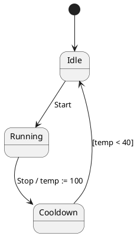

# Paper1 唯一论文大纲

本文件是 Paper1 唯一的规范论文大纲，按 [overleaf/sections/index.tex](../overleaf/sections/index.tex) 的十节顺序组织，给出可直接扩写的论文正文骨架、图表内容、证据落点与边界。数字来自[规范结果归档](../final_results/v60_current_vs_x1v2_baseline/README.md)的 v4 公平对照层；谓词资格来自[当前谓词审计](../related_work/provenance/predicate_provenance.md)；直接工作处置来自[最接近工作矩阵](../related_work/closest_work_matrix.md)；L/W/D 与对应关系的定义与学术锚点来自 issue [#189](https://github.com/HansBug/research_ideas/issues/189) 与 [#195](https://github.com/HansBug/research_ideas/issues/195)。上一版大纲保留在 [paper_outline.md.backup](./paper_outline.md.backup)，其事实仍可用，其论述顺序不再沿用。

投稿目标为 SANER 2027 Research Track：IEEE 双栏 10 页正文另加 2 页参考文献，全轨双盲，摘要截止 2026-09-21，正文截止 2026-09-25。英文为投稿语言，中文为内部伴生稿。

## 写作纪律

1. 术语首次出现写「中文（English，缩写）」，之后只用中文或缩写；英文全称只出现一次，可机检合同见 [terminology_policy.md](./terminology_policy.md)。
2. 自然语言输入一律称「自然语言描述」，不称「需求」。上游数据集作者把它叫 requirement description，但它是按模板写出的设计层描述，部分还是从模型反推而来；论文在 §5.1 交代这一点，其余地方统一口径。
3. L 与 W 在 §2 定义；D/A、对应关系与 K/N/I 是测量仪器，只在 §5 定义，§1 到 §4 不出现。
4. 建模对象边界（无时钟、无不变式、无正交区）的唯一定义落点是 §2.1；§5.1 只做推论，§1、§8、§9 不重复讲 fork/join。
5. 所有比较均为案例研究内的描述性比较，不写显著性，不写普遍优越性，不写跨语言效果。
6. 成本只以一段话报告，不设研究问题，不算倍率。
7. 页预算：§0–1 共 1.5 页，§2 共 1.5 页，§3 共 0.5 页，§4 共 2.5 页，§5 共 1.25 页，§6 共 2 页，§7–8 共 0.75 页，§9–10 共 0.25 页。

<a id="outline-0"></a>
## 题目与摘要

**题目（英文投稿，中文伴生）。** 主题目承载全文的一句话论点：状态机是可执行对象，在大语言模型发现问题之前用它提供事实、之后用它确认发现，问题发现就从表面对齐走到了行为层。候选如下，首选第一条：

1. `Beyond Surface Alignment: Evidence-Augmented LLM Discovery and Executable Confirmation of Behavioral Issues in State Machines` —— 超越表面对齐：状态机行为级问题的证据增强 LLM 发现与可执行确认。
2. `Beyond Surface Alignment: Discovering Behavioral Issues in State Machines against Natural-Language Descriptions with Executable Evidence` —— 超越表面对齐：面向自然语言描述的状态机行为级问题发现与可执行证据。
3. `From Claims to Witnesses: LLM-Based Discovery of Behavioral Issues in State Machines against Natural-Language Descriptions` —— 从主张到见证：面向自然语言描述的状态机行为级问题 LLM 发现。

**摘要。** 状态机是离散控制逻辑从自然语言（natural language，NL）描述走向实现的承重设计制品，如今越来越多地由大语言模型（large language model，LLM）生成；一台机器在被信任之前，必须先被复核是否做到了描述所说的事。最难复核的偏差是行为性的：目标状态是否可达、进入后能否离开、事件是否被消费、反馈能否使系统回到规定状态。逐元素比对能看出缺了哪个状态，看不出守卫沿任何轨迹都为假。本文研究给定一段自然语言描述和一台既有、在分析期间固定不变的状态机（state machine，STM），发现并定位机器不满足描述之处。我们把问题按陈述它所需的信息深度分为 L0/L1/L2，把报告按证据强度分为 W0/W1/W2，并指出在我们审阅的直接相关工作中，规则式一致性检查停在 L0/L1，大语言模型审稿人能触及 L2 但被审机器的行为事实不在其输入内，且两者的输出都停在 W1。方法把状态机当作可执行对象而非文本：C1 通过 PlantUML 适配器（PlantUML adapter）把源制品转换为保留来源归属（provenance）的有限控制状态机（finite control state machine，FCSTM），从中导出确定性检查事实（deterministic inspect facts），在大语言模型寻找问题之前送入其上下文；C2 把发现编译为四族 19 条类型化谓词（typed predicate）之一，在同一表示上执行并附上回放回执（replay receipt），使发现从 W1 的主张提升为 W2 的见证。在 54 个 PlantUML 输入对、145 条人工标注预期问题、3 轮共 435 个单元的案例研究中，方法与同模型朴素基线的 L2 FULL `hit@1` 为 `105/117=89.74%` 对 `50/117=42.74%`，整体为 `310/435=71.26%` 对 `227/435=52.18%`；310 个命中单元中 168 个携带 W2 回执，基线的输出按构造不携带回执；代价是报告级精确率低 `4.34 pp`，且在 L1 上方法略低于基线（`60.00%` 对 `67.62%`）。方法的 291 条无效报告中 110 条经归因确认落在方法内部的表示与证据闭合边界、另 8 条不可归因（合计约四成），我们对此给出机制分解，两项代价同源。[^fair][^wang2025][^input_selection]

<a id="outline-1"></a>
## 1. 引言

引言按六步走：利害关系 → 任务 → 两个观察给出三个结构性缺口 → 核心想法与设计直觉 → 贡献 → 结果预告。七个段落的 topic sentence 连起来自成论证。

**P1 · 利害关系。** 状态机是离散控制逻辑在描述与实现之间的承重设计制品，覆盖装备制造、轨道交通、物联网与航空航天等领域。随着从自然语言描述生成状态机成为常规做法，机器在被信任之前必须先被复核：它是否做到了描述所说的事。这把本文的任务从「生成」切到「复核」——本文不生成、不修改机器。[^wang2025][^structure_event][^gwt]

**P2 · 任务。** 给定一段自然语言描述和一台既有状态机，找出机器不满足描述之处并定位到具体元素。现有做法三类：元素级一致性规则（如 Li 与 Zheng 的业务对象规则）、让大语言模型当审稿人读两份文本（如 MCeT 与朴素提示）、形式验证（前提是已经知道要验哪条性质，而这正是待发现的东西）。[^li_zheng][^mcet][^uml_survey]

**P3 · 观察一：问题有深浅。** 用图 1 的小例子（描述与 PlantUML 原文见下方代码块，论文中作为图 1 的 (a)(b) 两栏；用 PlantUML 写是因为案例研究的源制品就是 PlantUML；它是为说明构造的最小示例，不来自 54 个输入对，真实实例见 §6.1）。描述三句：上电后处于 `Idle`；收到 `Start` 进入 `Running`；操作员按下 `Stop` 后设备应回到 `Idle`。模型写了 `Running --Stop--> Cooldown / temp := 100` 与 `Cooldown --[temp < 40]--> Idle`，而除这一次写入外没有任何动作再修改 `temp`。表面对齐检查全部通过：`Idle` 在、`Stop` 在、`Stop` 触发的迁移在、到 `Idle` 的边在。行为层的问题却真实存在：沿任何进入 `Cooldown` 的轨迹守卫恒假，按下 `Stop` 后 `Idle` 不可达。这条问题不对应描述的任何一句原话，却确实违反了描述。判定它所需的信息不在两份文本的表面上——可达性、沿可达轨迹的守卫可满足性、事件后的响应都要跨迁移推理。由此得两个结构性缺口。**缺口 ①**：规则式一致性检查比较元素的存在与顺序，从不构造或排除一条执行，所以到不了这一层。**缺口 ②**：大语言模型审稿人能谈行为，但行为事实不在它的输入里，它只能在脑中模拟；我们的同模型基线恰好在这一层最弱：39 条 L2 预期问题里只有 8 条三轮稳定命中（`hit@all` 20.51%），单轮 FULL `hit@1` 为 42.74%，而完整方法为 84.62% 与 89.74%。[^hilken][^baier_katoen]

图 1 的 (a) 描述与 (b) PlantUML 原文如下，可直接搬进论文：

```text
(a) 自然语言描述
D1. After power-on, the device is in Idle.
D2. On Start, the device enters Running.
D3. After the operator presses Stop, the device shall return to Idle.
```



(c) 表面对齐检查逐项通过：`Idle`、`Running` 在（D1、D2）；`Start`、`Stop` 触发的迁移在（D2、D3）；到 `Idle` 的边在（D3）。(d) 确定性检查事实：`temp` 的写者集合只有 `Running --> Cooldown` 的效果（写入 100），从 `Cooldown` 可达的片段内没有任何写 `temp` 的动作；`Cooldown` 唯一出边的守卫依赖 `temp`。(e) 类型化计划与回执：路由到轨迹族 R2 `state_reached_after`——从初始配置执行 `Start, Stop`，再空转 $k$ 个宏步，`Idle` 在窗口尾段未激活，结果 `false`；轨迹逐步记录 `temp = 100` 与守卫 `[temp < 40]` 的求值 `false`。拓扑族在这里帮不上忙：忽略守卫的图上 `Cooldown → Idle` 这条边存在，G1 `may_reach(Cooldown, Idle)` 为 `true`——这正是 L2 问题需要数据感知后端的原因。(c) 是 L0，(d) 是 L1 事实，(e) 把 L2 问题证到 W2；同一个例子在 §2.3 复用为 W1 与 W2 的对照。

**P4 · 观察二：报告有强弱。** 「`Cooldown` 回不到 `Idle`」是一句主张，复核者要自己重推一遍才能信。测试与验证文献区分未经判定的主张与在制品上求值过的反例：前者是一条 smell，后者是一条 error trace。形式验证确实提供可执行对象，但它要求性质已知，因此不做发现；现有的自然语言对模型检查器输出的全是前者——MCeT 的 issue、Li 与 Zheng 的 `AbnStepPair` 有定位但未执行、朴素提示的三个自由文本字段。**缺口 ③**：发现上没有附着任何可执行对象，什么都无法回放。[^femmer][^debbi][^barr]

**P5 · 核心想法与设计直觉。** 把状态机当作可执行对象，而不是一段文本，并在大语言模型的前后各用一次。之前：把源制品转换为保留来源归属的 FCSTM，从它确定性地导出结构、拓扑与运行事实，作为发现阶段的输入——C1，证据增强发现（evidence-augmented discovery）。之后：把大语言模型提出的每条发现编译为一个小词表中的类型化谓词，在同一表示上执行并附上可回放回执——C2，可执行确认（executable confirmation）。①② 合起来由 C1 回应，③ 由 C2 回应。图 1 用 P3 的小例子把这条链画成一页。

**P6 · 贡献。** 三条，每条指向一个结果小节。
- **C1 · 证据增强发现。** 提出保留来源归属的 FCSTM 工作表示与确定性检查事实，并把它们作为发现阶段的输入。在 PlantUML 案例研究中，搭载 C1 与 C2 的完整方法相对同模型基线的整体 FULL `hit@1` 为 71.26% 对 52.18%，L2 为 89.74% 对 42.74%，L2 `hit@all` 为 84.62% 对 20.51%；同一表示在 L1 上带来反向的代价（§6.1、§7.1）。本文不分离 C1 与 C2 的独立贡献（§7.4）。
- **C2 · 可执行确认。** 从领域学术普查归纳四族 19 条类型化谓词及其 FCSTM 后端语义，对适用发现执行断言并记录可回放回执。310 个 FULL 命中单元中 168 个达到 W2；基线的输出按构造不携带回执，该维度不构成对照（§6.3）。
- **C3 · 案例研究与可复算制品。** 使前两条可核验的支撑物：54 个输入对上 145 条带 D/L 分层的人工预期问题台账、两维人工裁定协议与最小复算包。是否公开待定，公开则按 §10 的最低标准。

**P7 · 结果预告。** 54 个输入对、145 条预期问题、同模型基线。整体 FULL `hit@1` 71.26% 对 52.18%；L2 提升最大，L0 次之，L1 略低于基线，§6.1 给出机制解释；报告级精确率低 4.34 pp（§6.2）；方法的 291 条无效报告中有 118 条来自方法内部的表示与证据闭合边界，我们给出成分分解，但不据此重算校正精确率。只给数字，不写「显著」。[^fair]

<a id="outline-2"></a>
## 2. 背景与相关工作

顺序固定为：对象 → L → W → 相关工作。L 依赖对象（「跨迁移的行为性质」要先有迁移语义），相关工作依赖 L（IET 用 L 定位）。

### 2.1 建模对象：离散控制逻辑的层次化扩展有限状态机

研究对象是离散控制逻辑的层次化扩展有限状态机 $M=(S,E,V,Tr,A)$：状态集 $S$ 与层次映射 $\mathrm{parent}: S \to S \cup \{\bot\}$（无子状态者为叶态 $\mathrm{leaf}(S)$）、事件集 $E$、变量集 $V$、带守卫与动作的迁移集 $Tr$、动作集 $A$。这是 UML/SysML 状态机与绝大多数控制器设计共享的核心片段，UML 2.5.1 的状态、迁移、触发、守卫、动作槽位语义与 Dwyer 等的有限状态性质模式在此片段上定义良好。实时时钟与不变式、正交区并发不在对象内：它们引入另一套验证理论（时间自动机、区域抽象），是独立的问题。这里只定义对象，不提数据集，不提任何 pair。[^uml251][^dwyer][^heimdahl][^heitmeyer]

### 2.2 问题深度 L

问题深度（problem depth，L）描述陈述一条问题所需的信息范围，与用什么算法、后端或见证形式无关。

| 档 | 定义 | 例 |
| --- | --- | --- |
| L0 · 表面对齐 | 比对描述词项与模型词项即可陈述 | 描述点名 `Emergency`，模型没有这个状态 |
| L1 · 结构导出 | 需从模型结构导出一个事实，静态可判 | 某守卫按其所在状态的声明即恒假（静态可判）；某叶态出度为 0；同源同触发两条守卫重叠；两条声明动作的书面先后与结构导出的先后不一致 |
| L2 · 行为/全局性质 | 涉及跨迁移、路径、可达性、终止、响应或全局交互的行为关系 | 进入 `ActiveState` 后永久困住；§1 例中 `Stop` 后 `Idle` 不可达——同一「守卫为假」形状一旦依赖可达赋值即升为 L2 |

学术锚点借用形状，不引用定义：Hilken 等把 UML/OCL 验证任务分为考虑单个系统状态的 structural 任务与考虑状态序列及迁移的 behavioral 任务；Baier 与 Katoen 指出不变式可由可达状态集判定，而路径片段上的安全性质不能，活性性质更是有限迹无法判定；Engels 等与 Knapp、Mossakowski 指出句法规则查不出动态一致性问题。先例分的是分析手段的能力，本文分的是陈述该问题所需的信息；自设 L 的理由是它必须对两臂中立、不预设任何分析手段，才能用来给台账分层并对只读文本的基线公平。两套分类在本语料上多数条目落点一致，但概念不同，论文必须写明。L 不是难度序，两臂表现不必随 L 单调。`structural inconsistency` 采 Hilken 口径而非 Van Der Straeten 口径。[^hilken][^baier_katoen][^engels][^knapp][^torre]

### 2.3 证据强度 W

见证强度（witness strength，W）描述一条报告被证到什么程度。

| 档 | 定义 | 例（沿用 §1 小例） |
| --- | --- | --- |
| W0 · 断言 | 散文主张，既无定位也无可执行对象 | 「可能有死锁」 |
| W1 · 定位 | 点到具体元素或路径，但没有可执行对象 | 「`Cooldown` 回不到 `Idle`」 |
| W2 · 见证 | 一个可执行对象，在被求值的那份制品上被判过真值 | 「从初始态执行 `Start, Stop` 抵达 `Cooldown`，`temp=100`，唯一出边守卫 `[temp<40]` 求值为假，从 `Cooldown` 可达的片段内没有任何动作写 `temp`；R2 `state_reached_after([Start, Stop], Idle)` 在 $k$ 步窗口内为假」 |

W1 的构件对应 Femmer 等对 requirements smell 的刻画：有具体定位与具体检测机制，但仍不是见证。W2 对应 Debbi 综述中的 counterexample / error trace：由分析它可定位错误来源。W 小于 2 的裁决对应 Tretmans 的 `inconclusive`：没有找到不合规的证据，但测试目的也没有达成。W0 与 W1 的档名是本文自设，内容有出处。[^femmer][^debbi][^tretmans]

**为什么 W2 的价值远高于 W1。** 这里接到 Barr 等的 oracle problem：自然语言描述是一份部分的、非形式的预言。W1 报告把预言的求值留给人；W2 报告自带一次在制品上完成的求值，复核者只需回放，不必重推。同时给出 W2 的上界：见证在抽象模型上成立而在具体模型上不成立时是 spurious counterexample。本文的见证在 FCSTM 而非 PlantUML 原文上求值，因此存在这一风险；§6.2 用无效报告的归因给出该风险的可归因上界，并给它起名「表示债务」。[^barr][^clarke_cegar]

### 2.4 相关工作

三类，每类一个结构性局限，最后一句定位。（写作提示：正文不写「前置理由」，直接给映射。）

**A 类：自然语言与模型的一致性检查。** Li 与 Zheng（IET Software 2025）是本文任务合同的直接先例：原始自然语言经结构化与用例规约（use-case specification，UCS）转换进入流程，Algorithm 3 以 UCS 和既有状态机为输入，输出定位的 `AbnStepPair`，并在一个 Web Store 项目的状态机制品上评测。按本文的 L 口径作分析性映射（IET 原文未使用 L）：Semantic Consistency 比较业务对象在活动图与 UCS 中的存在，为 L0；Process Consistency 要求输入对象先于输出对象出现，为 L1 的局部顺序；State Consistency 检查触发迁移的动作是否出现及相对顺序是否保持，为 L1，至多位于 L1/L2 边界。L2 的可操作判据是：陈述该问题必须构造或排除至少一条执行。三条规则只比较两份声明中元素与动作的书面存在与先后，不构造任何执行，因此不越过 L1；它们未分析可达性、死端、终止、事件响应或全局交互。MCeT（MODELS 2025）保留了「自由文本描述 + 既有图 → 定位问题」的形态，但对象是顺序图，没有持久状态、层次与迁移语义，输出是散文 issue。Wang 等自己的 requirements semantic checking 对参考模型算 F1——它需要一份参考模型，而实践中正是没有它才需要复核。Sultan 与 Apvrille（MODELS 2024 及其 SoSyM 2026 期刊版）做 SysML 多视图一致性并修正[^sultan2024]，Liu 等做需求与异构模型的可观测一致性并用 SMT 求解，二者对象都不是一台固定的状态机。**结构性局限**：规则式一侧比较的是元素的存在与顺序，从不构造或排除执行；大语言模型审稿人一侧能谈行为，但被审机器的可达性、前沿与事件消费信息不进入它的输入；两侧都没有在一台固定的被审状态机上执行过任何东西，输出停在散文或定位，所以到不了 W2。[^li_zheng][^mcet][^wang2025][^sultan][^liu]

**B 类：自然语言到模型的生成、补全与修复。** de Biase 等从 Given–When–Then 需求补全 SysML 状态机；Abdulkarim 等比较结构驱动与事件驱动的生成框架；King 与 Vyatkin 用 STPA 约束递归修改既有有限状态机并生成 IEC 61499 代码。**结构性局限**：输出是一台新机器，输入模型被改动；没有一个固定不动的被审制品，因此不产生定位在该制品上的发现。[^gwt][^structure_event][^king_vyatkin]

**C 类：自然语言到形式性质与验证。** FRET 把受限自然语言需求形式化；nl2postcond 用大语言模型生成后置条件；Estivill-Castro 与 Hexel 用语法提示为轻量级有限状态机（Lightweight Finite State Machine，LLFSM）合成多个模型检查器可接受的性质；André 等综述了 UML 状态机的形式化与自动验证。传统 UML/OCL 验证工具在 L2 上已成熟并能给出 W2 级证据（可达性、死锁自由、不变式反例），但性质由人写、工具从不接触自然语言；Hilken 等的任务目录正是为统一这类任务的术语而作。本文的差异不在能否求值，而在求什么——在只有一段描述的条件下决定该问哪个命题。[^hilken]**结构性局限**：假定要验的性质已经知道，由人写或由人选；它们给可执行证据，但不做发现，且性质合成的评测停在合成而非 verdict。LiSSA 表明追溯链接恢复是独立问题；LLM-as-a-Judge 的自评限制说明人工有效性判断不能由模型自报替代。[^fret][^nl2postcond][^estivill][^uml_survey][^lissa][^judge]

**定位句。** 本文不在 B 类竞争，也不做 C 类的性质合成；它保持制品固定，做 A 类的任务，同时把 C 类的证据形态接到发现之后——A 类没有一项工作提供后者。IET 是任务合同的直接先例，本文不主张该合同的优先权；本文的增量是该合同下 L2 问题的证据增强发现与可执行确认。

**表 2：承重工作的定位。** 行为六篇承重工作与本文；列为「输入含固定制品？」「输出是定位发现？」「检查深度（按本文 L）」「证据形态（散文 / 定位 / 执行）」「评测对象」。IET 行承认任务形态重叠；L 列只按本文口径分析其已发表规则。

| 工作 | 固定制品输入 | 定位发现输出 | 检查深度 | 证据形态 | 评测对象 |
| --- | --- | --- | --- | --- | --- |
| Li 与 Zheng（IET） | 是 | 是 | L0/L1 | 定位 | 一个 Web Store 项目的状态机 |
| MCeT | 是（顺序图） | 是 | 不适用（无状态语义） | 散文 | FBench 顺序图 |
| Sultan 等 | 多视图，非单一固定 | 不一致列表并修正 | 视图间关系 | 规则 + LLM | SysML 案例 |
| de Biase 等（GWT） | 部分状态机，被补全 | 否 | 不适用 | 生成元素 | 两个案例 |
| Estivill-Castro 与 Hexel | LLFSM | 否（合成性质） | 不适用 | 性质文本 | 22 个 SEG 示例 |
| Liu 等 | 异构模型 | 一致性判断 | 可观测关系 | SMT | 合成需求与汽车案例 |
| 本文 | 是 | 是 | L0/L1/L2 | 定位 + 执行 | 54 个 PlantUML 输入对 |

<a id="outline-3"></a>
## 3. 问题定义与范围

### 3.1 任务合同

输入对写为 $(d, m)$：$d$ 是一段自由文本的自然语言描述，$m$ 是分析开始前已经存在、在分析中保持不变且具有来源归属的状态机制品。输出是一组定位的问题报告 $f=(\mathrm{dref}, \mathrm{mref}, \mathrm{obligation}, \mathrm{location}, \mathrm{evidence})$：引用描述中的句子、引用源制品中的位置、陈述被违反的义务、给出定位，并在适用时附上可执行证据。方法不生成、不修改 $m$；$m$ 可以来自人，也可以来自上游大语言模型流程。$d$ 的义务集不可从自由文本形式导出，$m \models d$ 也不可计算；任务因此不承认可计算的满足判据——「一条问题」由 §5.2 的人工裁定操作化定义，方法的证据只承担机械确认部分。这与 §2.3 的 oracle problem 是同一件事。

### 3.2 适配器契约

方法面向能投影为 §2.1 中 $M$ 的状态机类模型。一种具体建模语言只有在声明的子集上给出到 $M$ 的可追溯投影、保留源载体到投影元素的映射、写明规则相关能力、对不能可靠映射的特征失败关闭，才可作为适配器接入。本文只实现并评测 PlantUML 适配器；其支持片段与不支持项（正交区、时钟、fork/join）在 §4.2 列出。

### 3.3 范围声明

方法产生的报告分三种证据状态：W2 的可执行见证、W1 的精确定位、W0 的未定位主张。L 是台账侧对预期问题的分类，方法不输出 L；D/A、报告有效性与对应关系由独立人工评测完成（§5）。投影、编译器、运行时或证据闭合的失败须与源制品问题分开记录。

<a id="outline-4"></a>
## 4. 方法

### 4.1 总览

**图 2：方法架构。** 四条责任泳道：源制品与描述 → 确定性程序（适配器、FCSTM、检查事实、谓词编译、后端）→ 大语言模型（契约提取、双 lens 发现、语义筛选）→ 人工评测（§5）。C1 覆盖泳道二到泳道三的前半：转换与检查事实进入发现阶段；C2 覆盖泳道三到泳道二的后半：发现被绑定为类型化谓词，回到后端执行并产出回执。图中标出每类失败的归因位置：投影边界、编译器边界、运行时失败、人工裁定。

**图 1：运行示例（五栏）。** 用 §1 的小例子走完整条链，五栏依次为：(a) 描述 D1–D3；(b) PlantUML 原文；(c) 投影后的 FCSTM 与来源映射：$S=\{Idle, Running, Cooldown\}$，$E=\{Start, Stop\}$，$V=\{temp\}$，$Tr$ 三条迁移各自标注源行号；(d) 确定性检查事实：`temp` 的写者集合为单元素、`Cooldown` 出边守卫的变量依赖、从初始配置的有界前沿；(e) 候选 → 类型化计划 → 回执：契约提取把 D3 写成义务「`Stop` 之后最终回到 `Idle`」，行为后果 lens 提出候选「`Cooldown` 后 `Idle` 不可达」并绑定源行，路由选轨迹族 R2 `state_reached_after`（拓扑族在忽略守卫的图上给不出这个结论，见 §1），计划固定刺激序列 `Start, Stop`、目标 `Idle`、窗口 $k$，原生回放给出 `false` 与逐步守卫求值，回执携带 pair/obligation/plan/model/program/receipt 的哈希链。输入片段不受支持、绑定不完整、原生加载失败、超时或回放失败时，系统保留来源定位与失败阶段，以 W1/W0 表示证据尚未闭合。

### 4.2 C1（上）：适配器、FCSTM 与来源映射

适配器把 PlantUML 源文本解析为规范化的源中间表示，再投影为 FCSTM。FCSTM 是 $M$ 的一个操作化扩展，额外固定宏步语义、生命周期动作与伪状态：层次状态、事件、变量、带守卫与效果的迁移、进入/退出/驻留动作，运行语义为宏步（`macrostep`）。投影全程保留源行号、具名载体、所有者路径、伪状态、生命周期动作与迁移来源；每个 FCSTM 元素都能回指源文本位置，每条报告与每份回执因此都能定位回作者写的那一行。支持片段：单区层次、初始/终止伪状态、事件触发、有限域守卫、变量赋值效果。失败关闭项：正交区、历史伪状态、时钟与时间事件、fork/join。不能投影的特征不会被静默丢弃，而是记为投影边界并进入 §6.2 的归因。第三类是**有损规范化**：能投影、但归一化会丢信息的记法层特征——例如把一条自由文本迁移标签解析为触发、守卫、效果三个槽位时，标签里并列的多个条件被折成一个事件 token，写错槽位的表达式被按槽位语义重解释。它不触发失败关闭（投影成功了），因此不留边界记录；§6.1 的 L1 反转正来自这一类，§7.1 讨论其工程消除路径。

**输入闭包。** 方法读取的全部输入是：描述原文；PlantUML 原文；规范化源中间表示（保留作者写的每个载体及其行号，不做语义归一）；FCSTM；确定性检查事实；来源追踪（源载体 → 中间表示元素 → FCSTM 元素的三层映射）；工作约定（声明的支持片段与失败关闭项）。所有输入由清单与哈希固定，方法不读取台账、评测裁定或历史报告。

**为什么需要一次转换。** PlantUML 状态图没有执行语义，行为性问题在它上面没有定义；要问「`Stop` 之后能否回到 `Idle`」必须先有一台能跑的机器。转换的代价也必须在这里交代而不是留到讨论节：投影会归一化标签文本（例如把一条自由文本迁移标签解析为触发、守卫、效果三个槽位），归一化后的模型可能与作者写的记法层事实不一致；§6.1 与 §6.2 量化了这一代价的两个方向。

### 4.3 C1（下）：确定性检查事实

在 FCSTM 上运行确定性检查，产出结构、拓扑与运行三类事实：结构事实（声明清单、槽位占用、叶态出度、守卫重叠）、拓扑事实（从初始配置的可达集、无退出叶态如 `W_LEAF_NO_OUTGOING_TRANSITION`、跨层路由）、运行事实（有界宏步前沿、事件消费者集合）。这些事实不产生新的义务——义务只来自描述——它们只把源文本里不稳定呈现的信息变成可引用的对象。事实随来源映射一起进入发现阶段的上下文。

以图 1 为例，检查事实会给出：`temp` 的写者集合 $\{Running \to Cooldown\}$；`Cooldown` 出边守卫的自由变量 $\{temp\}$；从初始配置出发的可达叶态 $\{Idle, Running, Cooldown\}$；无退出叶态集合为空（`Cooldown` 有一条出边，静态上不是死端——这正是 L1 事实与 L2 问题的分界：出度非零，但守卫沿轨迹恒假）。事实以结构化 JSON 进入上下文，每条带 canonical code、涉及元素的来源行号与一句英文说明；prompt 明确告知模型这些是事实而非缺陷，缺陷判断必须回到描述。

### 4.4 大语言模型阶段

五个阶段顺序执行，每阶段写清输入、输出与禁读项（不读台账、不读评测、不读历史报告，不输出 L/W/D）。

1. **契约提取。** 从描述中提取可追溯的义务契约，每条契约引用描述原句；仅在固定条件满足时做一次有界补全。
2. **双 lens 发现与定位。** 两个互补 lens 共享同一响应 schema：`contract_structure_contrast` 优先审契约完整性、结构与对照一致性（遗漏或压缩的契约、所有者/根默认入口、迁移组守卫冲突、错误的局部退出目标、未授权的边）；`behavior_consequence` 优先审行为后果（根可达性、可达的事件消费者覆盖、禁入范围、死端/前沿事实、跨包装器可达性、稳定终止、有界响应）。每条候选带 `reason` 与 `basis`，且必须完成精确的源与闭合模型绑定。
3. **执行批。** 确定性前沿、路由、类型化输入绑定、谓词编译与原生后端执行（§4.5、§4.6）。
4. **语义筛选与受限修正。** 内部阶段只做候选筛选与审计信息保留，不构成论文的 D/A 裁定。
5. **发布。** 按精确类型身份去重，输出方法发现与全部证据。

**表 3a：阶段合同。** 每阶段的输入、输出、执行者与禁读项；论文用一张紧凑表，附录 B 给完整字段。

| 阶段 | 执行者 | 输入 | 输出 | 禁读项与约束 |
| --- | --- | --- | --- | --- |
| 契约提取 | LLM | 描述原文 | 义务契约列表，每条引用描述句 | 不读模型；不补描述没有的义务，有界补全仅在固定条件下一次 |
| 双 lens 发现 | LLM × 2 | 契约、源中间表示、FCSTM、检查事实、来源追踪 | 候选列表：`where`（源行）、`reason`、`basis`、精确元素绑定 | 不输出 L/W/D；不读台账、评测、历史报告；两 lens 共享 schema，顺序采样 |
| 执行批 | 确定性程序 | 候选 + 绑定 | 前沿、路由到的谓词、类型化输入、编译程序、后端回执 | 无 LLM 参与；路由按证据充分性原则选最弱健全见证 |
| 语义筛选与受限修正 | LLM | 候选、契约、源事实、绑定、计划、回执 | 每条义务一份内部语义裁定（闭合枚举） | 不输出 D0/D1/D2、W、L、hit 或发布决定；只用于候选筛选与审计 |
| 发布 | 确定性程序 | 通过筛选的候选与证据 | 去重后的发现集，每条带 W 等级、来源定位、回执引用 | 按精确类型身份去重；不改写执行事实 |

附录 B 必须写清的五项确定性细节：契约补全的固定触发条件；两个 lens 输出的合并与冲突消解规则；「精确类型身份」去重键的定义；语义筛选与受限修正的预算与停止条件；采样参数、重试与解析失败处置。【待决策】提示词与响应 schema 是否随制品发布。

prompt 纪律写进论文：所有阶段只使用提供的上下文清单；每个结构化对象必须有非空 `reason` 与 `basis`；不得从关键词、子串、正则或文本相似度作判断；非英文文本只允许作为逐字引用出现。

### 4.5 C2（上）：四族 19 条类型化谓词

**表 3：19 条谓词。** 列为 ID、名称、命题形状、族、主要输入、后端、极性资格。谓词来源是领域文献普查：UML 2.5.1 给元素槽位与 Constraint 的二值后果，Dwyer 等给响应/缺失/全称的性质形状，Heimdahl 与 Leveson、Heitmeyer 等给守卫覆盖、互斥与事件响应的分析义务，Baier 与 Katoen 给不变式、可达与死锁自由。必须写明两句可辩护的话：(i) 每条义务的形状有一手逐字引文（附录 A）；(ii) 当前四族 ID 与表达式是对既有学术普查义务的版本化重映射。不写无法证明的否定式；每条的学术资格、方法执行语义、实例授权三类责任分开记录。[^uml251][^dwyer][^heimdahl][^heitmeyer][^baier_katoen][^predicate]

| ID | 名称 | 命题形状（精确命题以附录 A 为准） | 主要输入 | 后端 | 极性资格 |
| --- | --- | --- | --- | --- | --- |
| S1 | `element_exists` | 指定种类与名称的元素在闭合清单中存在 | 种类、名称 | 结构 | 双向 |
| S2 | `transition_exists` | 指定源到目标（可带触发）的迁移存在 | 源、目标、触发 | 结构 | 双向 |
| S3 | `trigger_set_equals` | 某状态或迁移组的触发集合等于期望集合 | 载体、期望触发集 | 结构 | 双向 |
| S4 | `state_action_attached` | 某状态的指定生命周期槽位挂有指定动作 | 状态、槽位、动作 | 结构 | 双向 |
| S5 | `transition_guard_equals` | 某迁移的守卫 AST 等于期望守卫 | 迁移、期望守卫 | 结构 | 双向 |
| S6 | `transition_effect_attached` | 某迁移的效果列表含指定效果 | 迁移、效果 | 结构 | 双向 |
| G1 | `may_reach` | 存在一条从源到目标的有限图路径（存在性可达） | 源、目标集 | 拓扑 | `false` 为不可达的健全反例 |
| G2 | `must_reach` | 从源出发的每条路径在界内抵达目标 | 源、目标集、界 | 拓扑 | 有界；`true` 只说明界内必达 |
| G3 | `route_avoids` | 从源到目标的每条路径都避开禁入节点/边集合 | 源、目标、禁入集 | 拓扑 | `false` 为一条经过禁入集合的路径 |
| G4 | `coaccessible_to` | 每个根可达节点都能沿有限路径到达标记集合（非阻塞/协可达，不同于终止） | 根集、标记集 | 拓扑 | `false` 为一个到不了标记集合的可达节点 |
| R1 | `event_consumed` | 沿给定刺激序列的宏步中该事件被消费 | 刺激序列、事件 | 轨迹 | 有限轨迹 |
| R2 | `state_reached_after` | 刺激序列之后目标状态在声明轨迹窗口尾段激活 | 刺激序列、状态、窗口 | 轨迹 | 单一调度，不推因果或全局可达 |
| R3 | `behavior_occurs` | 指定行为在轨迹内于指定所有者与生命周期槽位发生 | 刺激序列、所有者、槽位、行为 | 轨迹 | 不推具体 I/O 或业务效果 |
| R4 | `state_retained` | 目标状态在闭区间内每个记录点均激活 | 刺激序列、状态、闭区间 | 轨迹 | 有限轨迹内的保持，非无限持久 |
| V1 | `guards_disjoint` | 同源同触发迁移组的守卫在有限域上互斥 | 迁移组、有限域 | 有界验证 | 有限域 |
| V2 | `guards_complete` | 同源同触发迁移组的守卫在有限域上覆盖全域 | 迁移组、有限域 | 有界验证 | 有限域 |
| V3 | `response_within` | 每次 $p$ 发生后 $q$ 在声明步数界内发生 | $p$、$q$、界、scope | 有界验证 | 仅 `unit=steps`；毫秒界不受支持；不把无界响应转成步数界 |
| V4 | `deadlock_free` | 每个可达、稳定、非终止配置都允许模型进展（以叶状态一步探测实现） | 初始范围、稳定配置 | 有界验证 | 只覆盖探测到的叶状态片段；不同于终止 |
| V5 | `state_invariant` | 每个可达配置满足指定状态的期望占据值（有限界内） | 状态、期望占据值、初始范围、界 | 有界验证 | 有界 `false` 为无界不变式的单向反例；`true` 只说明界内通过 |

四族的解释范围：S 族是声明片段上的静态检查；G 族在忽略守卫与数据的拓扑投影上求值，该投影是迁移关系的过近似——全称方向的 `false`（如 G1 无路径）健全，存在方向的 `false`（G2、G4）依赖该路径在真实语义下可行，发表时须标注为相对拓扑抽象的见证（【待决策】是否要求先经 R 族确认可行性）；R 族是宏步与回放定义的运行片段，数据感知；V 族经 `.fbmcq` 编译，带变量，是有限域、界限与极性限定的查询。

### 4.6 C2（下）：执行、回执与 W2 条件

回执记录程序、模型、查询、绑定输入、范围、界、布尔结果、轨迹或失败阶段，并以哈希绑定回放。W2 的发表解释为：

$W2(f) \iff F(f) \land B(f) \land I(f) \land Q(f) \land E(f)$

其中 $F$ 是受支持片段，$B$ 是精确实例绑定，$I$ 是 pair/obligation/plan/model/program/receipt 的精确身份链，$Q$ 是非空且可核验的描述引文、源引用与绑定引用，$E$ 是完成的原生布尔回执。任一条件缺失时，定位明确的候选保留为 W1。`unknown`（求值完成但未取得不合规证据）对应 Tretmans 的 `inconclusive`；`failure` 与超时是未完成求值，无 verdict；两者都不算机械证实。在本次冻结运行中，所有产生终止回执的实例都满足 $F \land B \land I$，运行层 W2 因此与终止 `false` 一一对应（522 条）；条件 $Q$ 在发表层另把 105 条降为 W1（§6.3），前四个条件在 §4.4 阶段 3 之前拦下的候选数进附录 B。极性资格另限定可写的最强命题：G2 的有界 `must_reach` 只支持声明界内的必达；V4 的叶状态探测只覆盖它探测的片段；V5 的有界 `false` 是不变式的单向反例，有界 `true` 只说明界内通过。**证据充分性原则**：路由选最弱的健全见证——一个有来源依据的 `false` 或一条具体反例已足以建立缺陷证据；静态证据闭合时不为形式完整性升级到轨迹仿真或有界验证。这条原则在 §6.3 解释谓词的使用分布。[^predicate][^tretmans]

**回执字段。** 每份回执记录：pair 与 obligation 标识；谓词 ID 与极性；类型化输入（元素引用均为 FCSTM 元素 ID，可经来源映射回到源行）；编译程序哈希；被求值模型哈希；后端与版本；布尔结果或失败阶段（`unsupported_fragment` / `binding_incomplete` / `load_failure` / `timeout` / `replay_mismatch`）；轨迹或反例；回放命令。回放在同一模型哈希上重跑同一程序并比对结果，不一致即 `replay_mismatch`。

**失败归因分层。** 方法把不属于作者源的问题分为三类记录，与 §6.2 的 NADC 细分一一对应：编译器产物（谓词编译或后端在自身产物上报出的现象）、投影/追踪边界（源载体到 FCSTM 元素映射不完整或不受支持片段）、运行时/证据闭合（执行完成但身份链、引用或回放未闭合）。这些记录随报告一起发布，评测阶段据此把无效报告归因到方法边界而非作者源。

<a id="outline-5"></a>
## 5. 研究设计

### 5.1 案例研究数据

上游是 Wang 等（Internetware 2025）对大语言模型生成 SysML 行为模型的实证研究：作者按一份需求规约模板为每个案例写自然语言描述（无文档案例从模型反推），用 Claude、DeepSeek、GPT-4、GPT-4o、Kimi、Llama 各生成状态机，并经格式、语法、语义三道检查反馈。原论文把描述称为 requirement description；本文统一称自然语言描述。状态机部分为 10 份描述 × 6 个模型 = 60 个 `<描述, PlantUML>` 对；本文取其 feedback-final 输出（58 个语义检查输出与 2 个语义检查为空时的生成回退，回退对的编号见来源记录）。上游三道反馈已清掉部分浅层缺陷，剩余分布偏向深层，这对本文的 L2 结果是顺风，进 §8 外部威胁。十份描述中有一份要求 fork/join 与秒级执行时间约束，其忠实模型不在 §2.1 的 $M$ 内，对应六个输入对在任何运行之前仅凭描述文本排除。余下 **9 个描述簇、每簇 6 个制品、54 个输入对**。脚注写代价：被排除的 pair 中有表现高于均值者，其台账里有 27 条范围内的结构主张随描述一并排除。原论文的参考模型隔离不用。[^wang2025][^input_selection]

**表 4：分析单位与嵌套。**

| 描述簇 | 每簇制品 | 输入对 | 预期问题 | 轮次 | 轮次级单元 | 嵌套 |
| ---: | ---: | ---: | ---: | ---: | ---: | --- |
| 9 | 6 | 54 | 145 | 3 | 435 | 单元嵌套于输入对、制品与描述簇 |

**表 4b：九个描述簇。** 描述长度以词数计；预期问题数为该簇六个制品上台账条目之和，按 L 分列。输入对编号继承上游工作簿行号，个位对应描述簇（`0012`/`0013` 互换是上游排布所致）。

| 簇 | 描述主题 | 输入对 | 描述词数 | 预期问题（L0/L1/L2） |
| --- | --- | --- | ---: | --- |
| 1 | 人工驾驶与自主驾驶模式切换 | `0000 0010 0020 0030 0040 0050` | 71 | 20（12/6/2） |
| 2 | 列车基础制动装置 | `0001 0011 0021 0031 0041 0051` | 80 | 4（0/0/4） |
| 3 | 泵控制系统 | `0002 0013 0023 0033 0043 0053` | 92 | 19（9/3/7） |
| 4 | 设备操作模式 | `0003 0012 0022 0032 0042 0052` | 65 | 5（4/0/1） |
| 5 | 电梯（关门/运行/开门） | `0004 0014 0024 0034 0044 0054` | 226 | 26（13/7/6） |
| 6 | 微波炉 | `0005 0015 0025 0035 0045 0055` | 235 | 12（9/3/0） |
| 7 | 无人机群 | `0006 0016 0026 0036 0046 0056` | 77 | 15（5/7/3） |
| 8 | 三区域控制系统 | `0007 0017 0027 0037 0047 0057` | 46 | 13（9/1/3） |
| 9 | 自主模式（多层子机） | `0009 0019 0029 0039 0049 0059` | 434 | 31（10/8/13） |
| 排除 | 相机（fork/join 与秒级执行时间） | `0008 0018 0028 0038 0048 0058` | 282 | 不进台账 |

### 5.2 什么算一条问题：人工裁定 D/A

人工裁定（human adjudication，D/A）先判事实，再判义务。D2：源中承重事实成立，有可陈述的被违反义务，且没有站得住的称职反读法；三个子类按义务出处分——D2-lit 有成文条文可引，D2-impl 免领域知识即可判为失效（如死锁），D2-norm 描述不会写但缺了在本领域不可接受。D1：事实成立，存在一种与结构事实相容的第二种称职读法。D0：事实成立，但没有被违反义务或设计读法正当。A0：承重事实在作者源上不成立，分两个出口——`FALSE_POSITIVE`（虚构路径、误读守卫/事件/效果）与 `NOT_A_DEFECT_CLAIM`（方法内部的表示或分析状态被归给作者源）。**只有 D2/D1 是有效发现。** 学术锚点：IEEE 1044 的 defect 定义（不采用「需修复」合取项）；Krogstie 等的 validity/completeness；Barr 等的 implicit oracle；Kano 的 must-be requirement；Pollock 的 undercutting defeater 对应 D1，rebutting defeater 对应 D0；Zave 与 Jackson 的领域知识入册条件。[^ieee1044][^krogstie][^barr][^kano][^pollock][^zave_jackson][^sei_defeaters]

### 5.3 报告与预期问题的对应关系与报告有效性

两维分开裁。维度 A 是对应关系（relation）：`FULL_MATCH` 表示候选与预期问题描述同一缺陷实例、根因或被违反义务，允许措辞、抽象层级与证据形式不同，复合台账中一个独立且有诊断性的核心 facet 即可；`PARTIAL_MATCH` 表示真实但局部或间接的关系，不足以确定同一缺陷身份；`NO_MATCH` 表示不属于同一缺陷。维度 B 是报告有效性：先裁核心主张成立与否，成立且至少有一个 FULL/PARTIAL 为 `VALID_KNOWN`，成立且全部 NO 为 `VALID_NOVEL`，不成立为 `INVALID`。执行顺序：先裁有效性；`INVALID` 的全部关系直接闭合为 NO；有效者再逐条预期问题裁 FULL/PARTIAL/NO；程序据此确定性派生记账类别（bookkeeping category，K/N/I）。W 不进入匹配函数：W1 自由文本只要有具体 `where` 与可审计 `reason/basis` 就可以 FULL，这是基线可以公平参评的必要条件。学术锚点：MCeT 的 same-root-cause equivalence 与 new true issue；NIST SATE 的 directly/indirectly related finding；Pearson 等的 best-case 故障定位；Martinez 等的语义/修复等价；Porter 等的 known-fault 与 false positive；Klees 等的 distinct bug。写明这套两维枚举是本文综合先例形成的操作化，不是某篇文献逐字给出的。[^mcet][^sate][^pearson][^martinez][^porter][^klees]

**表 5：测量仪器。**

| 维度 | 取值 | 决定什么 |
| --- | --- | --- |
| D/A | `D2/D1/D0/A0` | 报告是否是有效发现（D2/D1） |
| 对应关系 | `FULL/PARTIAL/NO` | 预期问题是否被命中（仅 FULL） |
| 报告有效性与归属 | `K/N/I` | 报告级精确率分子与分母 |
| 证据强度 | `W0/W1/W2` | 命中单元的机械证据；不进入命中门槛 |

### 5.4 预期问题台账

由一名博士生在 54 个输入对上逐条人工标注，共 145 条，分布在 46 个输入对上（8 个输入对没有预期问题），每对 1–8 条；每条有来源依据（引用描述原句与源制品行号）、一句话概述、完整详述、D 档与 L 档：D2/D1 为 98/47，L0/L1/L2 为 71/35/39。台账的形成过程必须如实写出（【待决策】口径见汇报）：候选来自四个来源——原始人工台账 90 条、`pyfcstm inspect` 诊断归一化后的候选 35 条、从各臂未认领产出中提取的漏记 12 条、人工审阅 agent 产出 8 条——共 321 个裁决区，经三臂独立 D 档判读、人工逐条 meta review 与人工逐条裁决后，判为 D2/D1 的 145 条入账，D0 与 A0 不入账；L 由规则档（112 条）与人工逐条（33 条）两种方式确定；39 条 L2 分布在 24 个输入对、8 个描述簇上（微波炉簇无 L2）。候选来源中有方法侧确定性工具与各臂产出，这一点要写进 §8 的构念威胁，并说明它对两臂的方向性影响。它是参考而非 ground truth：MCeT 与 SATE 都警告 oracle 不完整时不能把未匹配报告当假阳性，§5.3 的 `VALID_NOVEL` 正是为此设置。单标注者、无一致性统计，进 §8。[^ledger_v2][^l_tier][^mcet][^sate]

### 5.5 基线

X1v2：同模型 `gpt-5.6-luna`、同 54 个输入对、同 3 轮、单 prompt、无循环、无工具，输入为描述与 PlantUML 原文，输出 schema 只有 `issue / where / reason` 三个自由文本字段。因此它按构造上界为 W1（512 条中 511 条为 W1，1 条未给定位为 W0）；后续人工核验不倒灌为基线的 W2。两臂使用同一套人工裁定口径。[^fair]

### 5.6 指标

记预期问题集合为 $E$（$|E|=145$），轮次 $r\in\{1,2,3\}$，$H_r \subseteq E$ 为第 $r$ 轮被至少一条 `VALID_KNOWN` 报告 `FULL_MATCH` 的预期问题集合。

- $\mathrm{hit@1} = \sum_r |H_r| / (3|E|)$，即 FULL 命中的轮次级单元 / 435；按 L 分层时 $E$ 换成该层条目集合。
- $\mathrm{hit@3} = |H_1 \cup H_2 \cup H_3| / |E|$，三轮中至少一次 FULL 的预期问题比例，衡量能力上界。
- $\mathrm{hit@all} = |H_1 \cap H_2 \cap H_3| / |E|$，三轮全部 FULL 的比例，衡量稳定性。
- 报告级精确率 $= (|K| + |N|) / (|K| + |N| + |I|)$，分母是全部已裁定报告；同一轮内多条报告命中同一预期问题只计一个单元，重复的有效报告不算 I。`hit@1` 是轮次级单元率，不是「第一轮命中率」，也不是 k 采样族的 k=1；`hit@3/@all` 以条目为单位。报告级精确率度量的是报告有效率（report validity rate），分子含仅 PARTIAL 匹配的 K 与台账外的 N；论文同时给按输入对平均的有效率与范围。
- 有支撑覆盖 = 被 FULL 或 PARTIAL 覆盖的单元或条目，单列，不进主指标。
- W-on-hits = FULL 命中单元的最高 W 分布。
- 谓词使用 = 有终止回执的不同谓词 ID 数；报告绑定谓词 = 至少绑定一条最终报告的不同谓词 ID 数。

### 5.7 成本口径

按 `gpt-5.6-luna` 的官方 list price（uncached input $0.20、cache read $0.02、cache creation $0.25、output $1.20，每百万 token，2026-08-18 核验），用 API 返回的 usage 分项相乘求和；output 含 reasoning token；只计方法侧推理调用，不计评测、人工与基础设施。同时报 token 数。[^cost]

### 5.8 研究问题与统计立场

- **RQ1（发现覆盖）。** 相对同模型基线，方法在 145 条预期问题上的 FULL `hit@1/@3/@all` 如何？按 L0/L1/L2 分层后，差异落在哪一层？→ C1。
- **RQ2（报告有效性）。** 方法的报告级精确率如何？无效报告由哪些成分构成，其中多少落在方法内部的表示与证据边界？→ 覆盖的代价。
- **RQ3（证据强度）。** C2 使多少 FULL 命中达到 W2？19 条谓词中哪些产生了回执、哪些绑定到了报告，为什么？→ C2。

<a id="outline-5-2"></a>
- **RQ4（条件性：仅当 `TODO-EXPERIMENT-01` 完成时进入正文）。** 保持 PlantUML 到 FCSTM 的转换、模型、提示词、输入对、轮次与 C2 不变，确定性检查事实的开/关带来多大的发现能力增益？单位为成对的预期问题轮次槽位，指标为 FULL `hit@1/@3` 与报告级精确率的成对差异。未完成时本条不出现，C1 只作为整体机制陈述，组件分离写入 §8；本案例的冻结端到端结果不估计确定性检查事实的独立作用。RQ2 的精确率分解不替代本条。

人工协议：两侧复核不对称——方法侧 1271 条报告全部经源制品优先复审，改判 0 条，该轮因此是自一致性确认而非独立重裁；基线侧 233 条 non-K 报告经双提案复核（覆盖 233/233），另 279 条 K 自上一版冻结继承、未在本轮重审；无独立双人标注与一致性统计。统计立场：435 个单元来自 145 条预期问题的三轮重复并嵌套于 54 个制品与 9 个描述簇，全部比较为案例研究内的描述性比较，不作显著性推断。

<a id="outline-6"></a>
## 6. 结果

### 6.1 RQ1：发现覆盖与 L 分层

**表 6：主结果（整体与按 L 分层）。** L0/L1 分层数由 [combined_report_index_v4.json](../final_results/v60_current_vs_x1v2_baseline/derived/fair_comparison_v4/combined_report_index_v4.json) 的 K 报告 FULL 台账集合按轮重算，整体与 L2 数与 canonical summary 逐项一致；写论文前把 L0/L1 行补进[结果处置清单](./paper_result_inventory.md)。

| 层 | n | FULL `hit@1` 方法 / 基线 | FULL `hit@3` 方法 / 基线 | FULL `hit@all` 方法 / 基线 |
| --- | ---: | --- | --- | --- |
| 整体 | 145 | `310/435=71.26%` / `227/435=52.18%` | `119/145=82.07%` / `106/145=73.10%` | `86/145=59.31%` / `46/145=31.72%` |
| L0 | 71 | `142/213=66.67%` / `106/213=49.77%` | `56/71=78.87%` / `50/71=70.42%` | `37/71=52.11%` / `21/71=29.58%` |
| L1 | 35 | `63/105=60.00%` / `71/105=67.62%` | `26/35=74.29%` / `30/35=85.71%` | `16/35=45.71%` / `17/35=48.57%` |
| L2 | 39 | `105/117=89.74%` / `50/117=42.74%` | `37/39=94.87%` / `26/39=66.67%` | `33/39=84.62%` / `8/39=20.51%` |

**图 3：按 L 分层的 FULL `hit@1` 与 `hit@all`。** 两组柱，每柱标分子分母；不作显著性推断。

**阅读。** 先读逐轮与三个口径的关系：逐轮整体 FULL 命中方法 101/107/102、基线 72/76/79；整体 `hit@3` 只差 9 pp（82.07% 对 73.10%），`hit@all` 差 28 pp（59.31% 对 31.72%）——基线偶尔能碰上的问题，方法能稳定命中，整体收益的大头是稳定性；能力上界的差异集中在 L2（`hit@3` 差 28 pp，`hit@all` 差 64 pp）。再读分层。提升集中在 L2：`hit@1` 高 47 pp，`hit@all` 高 64 pp，基线在 39 条 L2 里只有 8 条三轮稳定命中。L0 高 17 pp。**L1 反而略低于基线**（`hit@1` 低 7.6 pp，`hit@3` 少 4 条），不能藏；先给量级，再给一种与 §6.2 同源、但只能解释一半差额的机制候选：

- 量级：条目层比分是方法赢 10、基线赢 12、平 13；逐轮 L1 命中方法 21/21/21、基线 26/22/23，差 −5/−1/−2，与基线自身的轮间摆动（极差 4）同阶。本案例设计不能把 L1 的差异与采样波动分开（【待决策】是否就此把 L1 段降为噪声表述、机制只作附注）。
- 机制候选：表示层的两面。方法多命中的 10 条里，`L_basis` 多为投影后才可见的解析与作用域事实（复合态实际为空、层次整体丢失、`Entry: Emergency Stop` 被解析成状态、区块被作用域规则建成三层嵌套、同源同触发守卫重叠中的 2 条）。基线多命中的 12 条（22 个轮次槽位）里，6 条 11 个槽位的 `L_basis` 是记法/事件槽位类——「条件被压成单一事件名」3 条、「递减写进 guard 槽位」「输出动作被反转成输入事件」「子状态被声明为顶层同级」各 1 条——缺陷活在 PlantUML 标签文本里，投影把标签规范化成干净的事件 token 后它就不可见，基线读原文反而看得见；另外 6 条 11 个槽位的 `L_basis` 是静态结构类，本文不给机制解释。同一 basis 两边都有反例：守卫重叠 5 条中 `DIFF-0039-04` 只有基线命中、`VU-0059-02` 双方皆漏；「子状态声明为顶层同级」`EIS-0010-02` 方法 0/3 而形状相近的 `EIS-0033-01` 方法 3/3。35 条逐条对照见附录表 C.1。
- L0 的收益（条目层 40 赢 22 输 9 平，逐轮 +12/+14/+10）与 L2 的收益（28 赢 2 输 9 平，逐轮 +22/+18/+15）量级远超轮间摆动。与之相容的解释是 S2/S3/S5 三条结构谓词承载了 L0 的绑定（166/93/337 行），检查事实与拓扑事实承载了 L2；本设计未做成对开关，不识别任一组件的独立贡献（§7.4）。

给两三个基线漏掉的 L2 实例：`EIS-0002-02` 要排除从初始状态到三个目标状态的全部路径；`INS-0029-05` 是可重复进入终态的非终止行为；`EIS-0037-01` 是三个控制态的可达性与进入后被困。说明它们为什么在源文本层面看不出来、检查事实如何让它们可见。[^fair][^l_tier][^ledger_v2]

### 6.2 RQ2：报告有效性与无效报告的构成

方法输出 1271 条报告，基线 512 条；报告级精确率 `980/1271=77.10%` 对 `417/512=81.45%`，差 `-4.34 pp`。K/N/I 为 `749/231/291` 对 `312/105/95`；D2/D1/D0/A0 为 `721/259/120/171` 对 `342/75/85/10`。

**表 7：无效报告的构成。**

| 成分 | 方法 | 基线 | 解释 |
| --- | ---: | ---: | --- |
| D0（事实成立但不构成缺陷） | `120/1271=9.44%` | `85/512=16.60%` | 方法的 D0 占比更低但绝对条数更多；两臂报告总量不同（1271 对 512），份额不可直接读成倾向 |
| A0 / `FALSE_POSITIVE`（源级事实不成立） | `53/1271=4.17%` | `10/512=1.95%` | 源级误读 |
| A0 / 非缺陷主张（not-a-defect claim，NADC） | `118/1271=9.28%` | 不适用 | 方法内部表示与证据边界，基线无同构类别 |
| A0 合计 | `171/1271=13.45%` | `10/512=1.95%` | 方法侧含基线不具备的 NADC 类，该差不可读作源级误读能力差异 |
| I 合计 | `291/1271=22.90%` | `95/512=18.55%` | 与精确率互补 |

NADC 的 118 条再分为编译器产物 38、投影/追踪边界 24、运行时/证据闭合 48、不可归因 8；已确认的仅由 lowering 导致的语义错误为 0。按证据强度切：运行层 522 条 W2 报告中 153 条被裁为无效（29.3%），其中投影/追踪边界 24/24、不可归因 8/8 全为 W2，编译器产物 28/38、D0 44/120 为 W2——回执越强、表示债务越集中，这就是 §2.3 承诺的可归因上界。措辞必须准确：这些是方法内部的表示、归因与证据闭合边界产生的、对作者源不成立的主张——§2.3 埋下的 spurious counterexample 在这里兑现为表示债务——不是「转换引入了语义错误」。基线没有 NADC 的同构分类，这一项只报方法侧比率、不做跨臂比较；也不扣掉 NADC 重算「校正精确率」。可写的结论：在共同的 435 个单元上覆盖高 19 pp，同时承担 4.34 pp 的报告级精确率代价；这是一个覆盖与有效性之间的运行点，不是全指标优越。N 报告的 D2/D1 组成（`38/193` 对 `50/55`）与保守实质性 N 组（121 对 98）进附录。

**保守口径敏感性。** 只把 D2 计为有效时，报告有效率为 `721/1271=56.72%` 对 `342/512=66.80%`（差 −10.08 pp）；只计 D2 报告的 FULL `hit@1` 为 `290/435=66.67%` 对 `219/435=50.34%`（差 +16.3 pp），`hit@3` 为 `113/145` 对 `104/145`。主口径仍以 D2/D1 为有效（§5.2）；敏感性说明结论方向不随口径改变，幅度会变。[^fair][^attribution][^clarke_cegar][^troya]


<a id="outline-6-3"></a>
### 6.3 RQ3：证据强度与谓词使用

W 有两层，论文只用发表层。运行层（v4 人工裁定层）310 个 FULL 命中单元的最高 W 为 `0/113/197`，报告级 `0/749/522`；发表层再对 105 条回执因描述引文/来源引用/绑定引用不完整（条件 $Q$）把 W2 降为 W1，得 FULL 命中单元 `0/142/168`（54.2% 达 W2）、报告级 `0/854/417`（分母 1271）。按 L 分层，发表层达 W2 的命中单元为 L0 `76/142`、L1 `15/63`、L2 `77/105`——W2 在 L2 上最强。基线命中单元 `0/227/0`，其输出按构造不携带回执。judge 层的 `recomputed_summary.json`（分母 306）是前置层，不进正文。[^pubw]19 条谓词中 12 条有终止回执（G1、G2、G4、R1、R2、R4、S1–S5、V4），8 条绑定到最终报告（G1、G2、R2、S2、S3、S4、S5、V4），其中绑定到有效报告（K 或 N）的 6 条——R2 的 32 条绑定与 G2 的 1 条绑定全部落在无效报告；从未执行的 7 条为 G3、R3、S6、V1、V2、V3、V5，执行过但未绑定报告的 4 条为 G4、R1、R4、S1；522 条终止回执全部为 `false`，没有 `true` 极性回执；携带至少一条注册谓词绑定与回执的报告 `825/1271=64.91%`。这些是不同谓词 ID 的使用统计，不是缺陷覆盖、边际贡献或基线的等价零值。

**表 8：W 与谓词使用。** 上半为 FULL 命中单元与报告级的 W 分布；下半为「谓词 × 极性 × 绑定行数」，从 825 条绑定行直接统计，写论文前补算。

| 项目 | 方法 | 基线 |
| --- | ---: | ---: |
| FULL 命中单元 W0/W1/W2 | `0/142/168`（分母 310） | `0/227/0`（分母 227） |
| 报告级 W0/W1/W2 | `0/854/417`（分母 1271） | 不适用 |
| 有终止回执的谓词 ID | `12/19` | 不适用 |
| 绑定到报告的谓词 ID | `8/19` | 不适用 |
| 绑定到有效（K/N）报告的谓词 ID | `6/19`（R2 32/32、G2 1/1 全为 I） | 不适用 |
| 谓词 × 终止结果（v4 裁定层，825 条绑定报告） | S5 `63` false / `274` 无终止；S2 `166`/`0`；G1 `79`/`26`；S3 `93`/`0`；V4 `82`/`3`；R2 `32`/`0`；S4 `6`/`0`；G2 `1`/`0`；合计 `522` false / `303` 无终止；`true` 极性 `0` 行 | 不适用 |

**为什么 19 条只用到 8 条。** 三层解释，不引入任何台账侧的可表达性审计：

1. **证据充分性原则**（§4.6）：路由选最弱的健全见证。精确命题是 $O \Leftrightarrow P$，证伪只需一个 $P \Rightarrow O$ 的充分条件。
2. **两个 worked example**，从真实报告取：可达性义务的精确表达在轨迹层，但 G1 `may_reach` 为假已足以证伪，于是 R1/R3/R4 未绑定到任何报告（R2 有 32 条绑定，均为终止 `false`，且全部落在无效报告）；全局响应义务（某事件后全体状态跳到目标态）的精确表达是 V3 对所有状态的全称命题，但一个状态做不到已足以证伪，于是 V3 被单点反例替代。
3. **语料性质**：未使用谓词对应的义务在这批 PlantUML 里稀少——守卫多为简单条件（V1/V2 的互斥与完备少有用武之地）、描述几乎不给步数界（V3）、禁行路径义务罕见（G3）、变量后值义务未进入词表。这是观察，写论文前用可核计数支撑（九份描述中给出步数界的份数、含多条件守卫组的制品数）。S6、V5、R3 从未执行；G4、R1、R4、S1 执行过但未绑定——S1 `element_exists` 零绑定说明 L0 的命中由 S2/S3/S5 承载，而非声明清单本身。

W 描述机械确认，不决定 D/A、对应关系或 K/N/I；G2、V4、V5 的极性资格限定最强命题，不把已完成的执行降为 W1。[^fair][^predicate]

### 6.4 成本（独立于研究问题）

方法侧 54 × 3 共 162 格，总计 `$7.18`，每格约 `$0.044`，每输入对三轮约 `$0.13`；基线侧 `method_cost_eligible=false`（缺一条计费 schema 重试的 usage 回执），其记录小计 `$0.225` 是下界而非可比总额。token：方法 uncached input 18,765,114、cache read 19,400,960、cache creation 0、output 2,534,776；基线 633,844、143,744、0、79,658。基线小计是下界，因此任何据此算出的倍率只能读作上界；论文不给倍率。人工复核成本不在三个 RQ 内，W2 回执的设计目的是降低它，这只能作为 §7 的假设。[^cost]

### 6.5 RQ4（条件性）

仅当 `TODO-EXPERIMENT-01` 完成时写本节：成对开/关条件下 FULL `hit@1/@3` 与报告级精确率的差异，按 L 分层，以描述簇为重采样单位给出描述性不确定性。未完成时删除本节，§8 保留组件分离的威胁。

<a id="outline-7"></a>
## 7. 讨论

**7.1 表示层的两面（机制假设）。** §6.1 与 §6.2 可以由同一机制的两个方向解释：可执行表示暴露了文本里看不出的结构与行为事实（L2 收益与 L1 的一部分），也抹平了只在记法层存在的事实（L1 损失的约一半），并产生对源不成立的主张（NADC）。本设计没有成对开关，这是与数据相容的解释而非已识别的因果。代价分两层：NADC 中编译器产物 38 与投影/追踪边界 24 共 62/118 是这一实现的适配器边界，可由保留标签原文、投影边界失败关闭等工程手段减少；在 FCSTM 而非源文本上求值这一点是这类方法的固有上界，与 §2.3 的 spurious counterexample 同源。两层都写在方法节，不事后找台阶。

**7.2 证据充分性与谓词词表。** 8/19 的使用分布与证据充分性原则一致（522 条终止回执无一为 `true`），但不能全部写成设计结果：R2 与 G2 的绑定全部落在无效报告，是路由或语义待改项；发现问题只需要健全的充分条件，未使用的谓词大多对应「精确但过强」的形态。这也界定了 C2 的角色——它确认发现，不替代发现；没有适用谓词的发现仍以 W1 发布。

**7.3 实践含义。** 工程师可先看高 D、W2、来源清楚的发现，回执支持在描述、模型或工具版本变化后回放同一计划。本文没有用户研究、审查工时或部署结果，不声称效率、认证或安全收益。[^li_zheng][^predicate]

**7.4 对 C1 的整体陈述。** 端到端差异不能分解为转换与检查事实的独立贡献，冻结结果无法识别确定性检查事实的独立增量；若 RQ4 完成则在此引用其结果，否则写明组件分离留待成对对照。

<a id="outline-8"></a>
## 8. 有效性威胁

**构念与内部。** 报告级精确率、FULL 对应关系、W 与 K/N/I 对应不同对象；人工协议可审计但无独立双人盲标与一致性统计；两臂复核程序不对称——方法侧 1271 条报告全部经源制品优先复审且改判为零（自一致性确认），基线侧只对 233 条 non-K 报告复审、279 条 K 未重审——更重的复审可能同时提高方法侧的命中判定与其 A0 识别率，方向不确定，且未做横向对齐；145 条台账不是缺陷全集，`VALID_NOVEL` 的 231 条说明台账外仍有真实问题；C1 的端到端差异包含转换、检查事实与 C2 的耦合，未做成对分离。**统计。** 435 个单元嵌套于 54 个制品与 9 个描述簇，只作描述性比较。**语义。** W2 在 FCSTM 上求值，存在 spurious 风险，已由 NADC 量化；G2、V4、V5 的有界解释不得写成无界证明。**外部。** 单适配器（PlantUML）、单上游数据源、单模型；语料是上游三道反馈后的输出，浅层缺陷已被前置清除，结论不外推到原始生成输出；不外推到其他建模语言或其他大语言模型。**相关工作。** IET 的 L 映射是本文的分析口径，只界定问题深度，不评价其学术价值。[^fair][^predicate][^li_zheng]

<a id="outline-9"></a>
## 9. 结论

回到两个观察。报告有强弱：一半以上的命中从主张变成了见证（168/310 达 W2，L2 上 77/105；基线的输出按构造不含可执行对象）。问题有深浅：在 L2 上基线最弱而方法稳定（`hit@all` 84.62% 对 20.51%）。代价是 4.34 pp 的报告级精确率与 L1 上略低于基线的命中；无效报告的约四成（`118/291`）来自可执行表示与证据闭合边界，其余主要是事实成立但不构成缺陷的报告，我们已把前者分解到可归因的位置。IET 是任务合同的直接先例；本文的增量是该合同下 L2 问题的证据增强发现与可执行确认。[^fair][^li_zheng]

<a id="outline-10"></a>
## 10. 数据可得性

若公开（C3），按最低标准：一个匿名仓库，包含（i）54 个输入对的描述与 PlantUML 原文及来源行定位；（ii）145 条台账，每条只保留 `id, pair, D, L, summary, detail` 六个字段——一句话概述与完整自然语言详述来自原 JSON，不加多余字段；（iii）两臂逐报告的有效性、对应关系与 D/A 决定；（iv）从 (ii)(iii) 复算表 6–8 全部数字的脚本与一条命令。不含凭据、人工身份与未获许可的外部全文。若不公开，一段话写明原因与是否计划在录用后公开。SANER 鼓励制品但不强制。[^fair][^ledger_v2]

<a id="outline-appendix"></a>
## 附录

**附录 A：19 条谓词的证据与语义边界。** 按 S1–S6、G1–G4、R1–R4、V1–V5 给出 19 行完整表：精确命题、外部依据与逐字引文定位、方法执行语义、实例授权、支持片段、逐极性 W2 条件与发表资格。[^predicate]

**附录 B：输入、适配器与执行合同。** 输入闭包、PlantUML 适配器支持片段与失败关闭项、来源映射、类型化绑定与失败处置；图 B.1 从描述一句义务走到类型化计划、W1/W2 回执与回放轨迹。

**附录 C：完整结果。** 按 L、轮次、预期问题与报告单位的完整分层表；逐轮 FULL 命中（方法 101/107/102、基线 72/76/79；按 L：L0 45/50/47 对 33/36/37，L1 21/21/21 对 26/22/23，L2 35/36/34 对 13/18/19）；N 报告组成与保守实质性 N 组；NADC 四路 overlay；谓词 × 极性 × 绑定行；成本逐项与 token 数。每张表含分子、分母、来源指针与解释范围。[^fair][^cost][^attribution]

**表 C.1：L1 的 35 条逐条对照。** 命中轮数为 K 报告 FULL 匹配该条目的轮数（0–3）；「初步归因」为写作时按 `L_basis` 的分类，标注「待人工确认」者需回读报告。方法赢 10、基线赢 12、平 13。

| 条目 | 方法命中轮数 | 基线命中轮数 | L 依据（摘） | 初步归因 |
| --- | ---: | ---: | --- | --- |
| `DIFF-0039-04` | 0 | 1 | 同源同触发两条守卫重叠 —— 单状态上的静态事实 | 投影抹平（待人工确认） |
| `EIS-0000-02` | 1 | 2 | 三个条件被压成单一事件名 —— 静态可导出的事件结构事实 | 投影抹平（待人工确认） |
| `EIS-0005-02` | 1 | 0 | active(DoorShutWithItem) 蕴含 active(DoorOpenWithItem) 是单个系统状态 | 投影暴露 |
| `EIS-0010-01` | 3 | 3 | 触发条件挂错了边 —— 须导出「哪条边带哪个触发」这个静态结构事实 | — |
| `EIS-0010-02` | 0 | 3 | 层次结构：子状态被声明为顶层同级，静态可判 | 投影抹平（待人工确认） |
| `EIS-0014-02` | 3 | 2 | 动作被搬进迁移标签而被读成触发器 —— 记法槽位语义的静态导出 | 投影暴露 |
| `EIS-0014-03` | 1 | 0 | `Entry: Emergency Stop` 被解析成一个名为 Entry 的状态 —— 静态解析事实 | 投影暴露 |
| `EIS-0016-01` | 3 | 0 | PlantUML 作用域规则把三区建成三层嵌套 —— 层次结构静态导出 | 投影暴露 |
| `EIS-0016-02` | 0 | 0 | 名字碰撞使 Region2/3 的初始迁移目标越界落到 Region1.Search —— 作用域与初始目标的静态解析事 | — |
| `EIS-0016-03` | 0 | 1 | 须导出「模型实际的结束条件是什么、有无顶层终态」这一静态结构事实 | 投影抹平（待人工确认） |
| `EIS-0019-01` | 3 | 1 | 同源同触发两条守卫重叠 —— 单状态上的静态事实 | 投影暴露 |
| `EIS-0020-02` | 1 | 3 | 复合事件不可分解 + 返回仍须等它 —— 事件结构静态事实 | 投影抹平（待人工确认） |
| `EIS-0024-02` | 1 | 3 | 输出动作被反转成输入事件 —— 记法槽位方向的静态导出 | 投影抹平（待人工确认） |
| `EIS-0024-03` | 0 | 3 | 迁移指向复合态导致内部阶段重置 —— 静态结构 | 投影抹平（待人工确认） |
| `EIS-0025-01` | 3 | 3 | 守卫层面的静态导出（issue §1.3.1 把「某守卫恒假」明列为 L1） | — |
| `EIS-0026-01` | 2 | 2 | 须数模型里有几个区域并判断兄弟叶态算不算区域 —— 静态结构导出 | — |
| `EIS-0029-01` | 3 | 1 | 从未打开复合括号，层次整体丢失 —— 静态结构 | 投影暴露 |
| `EIS-0029-02` | 3 | 2 | 同源同触发两条守卫重叠 —— 单状态上的静态事实 | 投影暴露 |
| `EIS-0029-03` | 3 | 3 | 同一条件在两条边上目标不同 —— 两条边的静态比对 | — |
| `EIS-0030-03` | 0 | 3 | 三条件压成单一事件名 —— 事件结构静态事实 | 投影抹平（待人工确认） |
| `EIS-0033-01` | 3 | 3 | 三个子态被声明为兄弟 —— 层次归属静态导出 | — |
| `EIS-0033-02` | 3 | 3 | 三条初始边目标越出子作用域、默认进入点不唯一 —— 作用域与唯一性的静态事实 | — |
| `EIS-0034-01` | 3 | 3 | 从未打开 InMotion 复合状态 —— 层次结构静态导出 | — |
| `EIS-0034-02` | 3 | 3 | 同源同触发两条守卫重叠 —— 单状态上的静态事实 | — |
| `EIS-0034-04` | 3 | 3 | 迁移效果被错置为状态 entry 动作 —— 记法槽位的静态导出 | — |
| `EIS-0035-03` | 3 | 3 | 守卫层面的静态导出（issue §1.3.1 把「某守卫恒假」明列为 L1） | — |
| `EIS-0039-02` | 2 | 1 | 迁移指向复合态导致内部阶段重置 —— 静态结构 | 投影暴露 |
| `EIS-0043-01` | 2 | 3 | 顶层分解的成员构成与数量 —— 静态结构导出 | 投影抹平（待人工确认） |
| `EIS-0046-02` | 2 | 2 | 须数模型里有几个区域并判断兄弟叶态算不算区域 —— 静态结构导出 | — |
| `EIS-0047-01` | 3 | 2 | 状态名全局标识使后两个复合态实际为空、初始迁移越界 —— 静态解析事实 | 投影暴露 |
| `EIS-0050-01` | 0 | 1 | 三条件压成跨行自由文本标签、投影为单一事件 —— 事件结构静态事实 | 投影抹平（待人工确认） |
| `EIS-0056-01` | 0 | 3 | 内外层迁移同时使能 —— 静态结构 | 投影抹平（待人工确认） |
| `EIS-0056-02` | 2 | 3 | 递减被写进 guard 槽位而非 effect 槽位 —— 记法槽位语义的静态导出 | 投影抹平（待人工确认） |
| `INS-0059-03` | 3 | 2 | 守卫层面的静态导出（issue §1.3.1 把「某守卫恒假」明列为 L1） | 投影暴露 |
| `VU-0059-02` | 0 | 0 | 同源同触发两条守卫重叠 —— 单状态上的静态事实 | — |


<a id="outline-references"></a>
## 参考文献

[^fair]: v60/current versus X1v2 baseline v3 canonical summary. `final_results/v60_current_vs_x1v2_baseline/derived/fair_comparison_v4/combined_summary_v4.json` and `combined_report_index_v4.json`, 2026-09-02. Stable repository artifacts.
[^cost]: Paper1 method cost audit v1. `final_results/v60_current_vs_x1v2_baseline/derived/final_talk_cost_section7_v1/cost_summary_v1.json`, 2026-09-01. Stable repository artifact.
[^attribution]: Paper1 conversion-attribution audit v1. `final_results/v60_current_vs_x1v2_baseline/derived/conversion_attribution_v1/i_attribution_summary_v1.json`, 2026-09-01. Stable repository artifact.
[^predicate]: Paper1 predicate provenance audit. `related_work/provenance/predicate_provenance.md`, 2026-09-02. This points to the audited external primary sources, not to a local citation substitute.
[^input_selection]: Paper1 input provenance: `corpora/seed_library/llms-emp-stm-subset/assets/extracted/feedback_final_validation_summary.json` fixes the 60-row stage/fallback pool; `selected_seed_examples/README.md` and `discover_matrix/docs/protocol/nl_scope_rule.md` fix the six out-of-scope exclusions and the 54-pair grid. Accessed 2026-09-02.
[^l_tier]: Paper1 L-tier definition and classification. `discover_matrix/ledger_v2/l_tier.json`, 2026-09-02.
[^ledger_v2]: Paper1 expected-issue ledger. `discover_matrix/ledger_v2/README.md` and `discover_matrix/ledger_v2/ledger.json`, 2026-09-02.
[^wang2025]: Yuan Wang, Ning Ge, Jiangxi Liu, Zhilong Cao, Zheping Chen, and Chunming Hu. “Generating SysML Behavior Models via Large Language Models: an Empirical Study.” *Proceedings of the 16th International Conference on Internetware*, ACM, 2025, pp. 366--377. https://doi.org/10.1145/3755881.3755926.
[^li_zheng]: Haibo Li and Lixiao Zheng. “Enhancing Requirements via Structured Formalization and Process-State Consistency Validation: An LLM-Assisted Test-Driven Framework.” *IET Software*, 2025, 2025(1), Article 6714956. https://doi.org/10.1049/sfw2/6714956.
[^mcet]: Khaled Ahmed, Jialing Song, Ou Wei, Bingzhou Zheng, and Boqi Chen. “MCeT: Behavioral Model Correctness Evaluation using Large Language Models.” *MODELS*, 2025, pp. 84--95. https://doi.org/10.1109/MODELS67397.2025.00014.
[^pubw]: Paper1 publication W audit. `related_work/provenance/publication_w_audit.json`, 2026-09-02. Records the runtime-layer W (`0/113/197` on 310 FULL-hit cells; `0/749/522` report-level) and the publication-layer W after the source-authority exclusion (`0/142/168`; `0/854/417`; 105 reports downgraded W2->W1).
[^sultan2024]: Bastien Sultan and Ludovic Apvrille. “AI-Driven Consistency of SysML Diagrams.” *MODELS*, 2024, pp. 149--159. https://doi.org/10.1145/3640310.3674079. MODELS 2024 Distinguished Paper; conference predecessor of the SoSyM 2026 article.
[^sultan]: Bastien Sultan, Ludovic Apvrille, and Sophie Coudert. “On the Consistency of State Machines, Use Cases and Block Diagrams Using Dependency Graphs and Large Language Models.” *Software and Systems Modeling*, 2026, online first. https://doi.org/10.1007/s10270-026-01388-4.
[^liu]: Tianhai Liu, Shmuel Tyszberowicz, and Bernhard Beckert. “Observable Consistency Checking across Requirements and Models.” *ENASE*, 2026. https://doi.org/10.5220/0014719400004015.
[^gwt]: Maria Stella de Biase et al. “Completion of SysML State Machines from Given--When--Then Requirements.” *Software and Systems Modeling*, 2024. https://doi.org/10.1007/s10270-024-01228-3.
[^structure_event]: Samer Abdulkarim et al. “Structure- and Event-Driven Frameworks for State Machine Modeling with Large Language Models.” arXiv:2604.00275v1, 2026. https://arxiv.org/abs/2604.00275. Preprint, not peer-reviewed as of 2026-09-02.
[^king_vyatkin]: Akira King and Valeriy Vyatkin. “LLM-based Iterative Refinement of Finite-State Machines with STPA Controller Constraints and Generation of IEC 61499 Code.” *ETFA*, 2025. https://doi.org/10.1109/ETFA65518.2025.11205687.
[^fret]: Dimitra Giannakopoulou, Anastasia Mavridou, Julian Rhein, Thomas Pressburger, Johann Schumann, and Nija Shi. “Formal Requirements Elicitation with FRET.” *REFSQ 2020 Workshops*, 2020. https://ntrs.nasa.gov/api/citations/20200001989/downloads/20200001989.pdf.
[^nl2postcond]: Madeline Endres, Sarah Fakhoury, Saikat Chakraborty, and Shuvendu K. Lahiri. “Can Large Language Models Transform Natural Language Intent into Formal Method Postconditions?” *Proceedings of the ACM on Software Engineering*, FSE 2024. https://doi.org/10.1145/3660791.
[^estivill]: Vladimir Estivill-Castro and René Hexel. “Grammar-Prompted Synthesis of Verification Properties from Natural Language Requirements for Multiple Model Checkers.” *ENASE*, 2026. https://www.scitepress.org/Papers/2026/147167/147167.pdf.
[^uml_survey]: Étienne André, Shuang Liu, Yang Liu, Christine Choppy, Jun Sun, and Jin Song Dong. “Formalizing UML State Machines for Automated Verification -- A Survey.” *ACM Computing Surveys*, 55(13s), 2023. https://doi.org/10.1145/3579821.
[^lissa]: Fuchß et al. “LiSSA: Toward Generic Traceability Link Recovery Through Retrieval-Augmented Generation.” *ICSE*, 2025. https://doi.org/10.1109/ICSE55347.2025.00186.
[^judge]: Wang et al. “LLM-as-a-Judge in Software Engineering.” *ISSTA*, 2025. https://doi.org/10.1145/3728963.
[^uml251]: Object Management Group. *Unified Modeling Language (UML), Version 2.5.1*. 2017. https://www.omg.org/spec/UML/2.5.1/PDF.
[^dwyer]: Matthew B. Dwyer, George S. Avrunin, and James C. Corbett. “Patterns in Property Specifications for Finite-State Verification.” *ICSE*, 1999. https://doi.org/10.1145/302405.302672.
[^heimdahl]: Mats P. E. Heimdahl and Nancy G. Leveson. “Completeness and Consistency in Hierarchical State-Based Requirements.” *IEEE TSE*, 1996. https://doi.org/10.1109/32.508311.
[^heitmeyer]: Constance Heitmeyer, Robert Jeffords, and Bruce Labaw. “Automated Consistency Checking of Requirements Specifications.” *ACM TOSEM*, 1996. https://doi.org/10.1145/234426.234431.
[^hilken]: Frank Hilken, Philipp Niemann, Martin Gogolla, and Robert Wille. “Towards a Catalog of Structural and Behavioral Verification Tasks for UML/OCL Models.” In *Modellierung 2016*, LNI P-254, Gesellschaft für Informatik, Bonn, 2016, pp. 117--124. https://dl.gi.de/items/9249e678-d63e-46bf-acee-7606155b1ac8 (no DOI assigned).
[^baier_katoen]: Christel Baier and Joost-Pieter Katoen. *Principles of Model Checking*. MIT Press, 2008. Def. 3.20, §3.3.2, Def. 3.33, §3.2--3.3.
[^engels]: Gregor Engels, Jan Hendrik Hausmann, Reiko Heckel, and Stefan Sauer. “Testing the Consistency of Dynamic UML Diagrams.” *IDPT*, 2002.
[^knapp]: Alexander Knapp and Till Mossakowski. “Multi-view Consistency in UML: A Survey.” *LNCS* 10800, 2018. https://doi.org/10.1007/978-3-319-75396-6_3; arXiv:1610.03960.
[^torre]: Damiano Torre, Yvan Labiche, and Marcela Genero. “UML Consistency Rules: A Systematic Mapping Study.” *EASE*, 2014. https://doi.org/10.1145/2601248.2601292.
[^femmer]: Henning Femmer, Daniel Méndez Fernández, Stefan Wagner, and Sebastian Eder. “Rapid Quality Assurance with Requirements Smells.” *Journal of Systems and Software*, 123:190--213, 2017. https://doi.org/10.1016/j.jss.2016.02.047.
[^debbi]: Hichem Debbi. “Counterexamples in Model Checking -- A Survey.” *Informatica (Slovenia)*, 42(2):145--166, 2018. http://www.informatica.si/index.php/informatica/article/view/1442 (no DOI assigned by the publisher).
[^tretmans]: Jan Tretmans. “An Overview of OSI Conformance Testing.” Note, Formal Methods & Tools group, University of Twente, 25 January 2001, 14 pp. §3.3 (three verdicts), §3.5 (`inconclusive`). Copy: https://homes.cs.aau.dk/~kgl/TOV03/iso9646.pdf.
[^barr]: Earl T. Barr, Mark Harman, Phil McMinn, Muzammil Shahbaz, and Shin Yoo. “The Oracle Problem in Software Testing: A Survey.” *IEEE TSE*, 41(5):507--525, 2015. https://doi.org/10.1109/TSE.2014.2372785.
[^clarke_cegar]: Edmund Clarke, Orna Grumberg, Somesh Jha, Yuan Lu, and Helmut Veith. “Counterexample-Guided Abstraction Refinement.” *CAV*, 2000. https://doi.org/10.1007/10722167_15.
[^troya]: Javier Troya, Sergio Segura, Lola Burgueño, and Manuel Wimmer. “Model Transformation Testing and Debugging: A Survey.” *ACM Computing Surveys*, 55(4), 2022. https://doi.org/10.1145/3523056.
[^ieee1044]: IEEE Std 1044-2009. *IEEE Standard Classification for Software Anomalies*. https://doi.org/10.1109/IEEESTD.2010.5399061.
[^krogstie]: John Krogstie, Odd Ivar Lindland, and Guttorm Sindre. “Defining Quality Aspects for Conceptual Models.” *IFIP ISCO3*, Springer, 1995. https://doi.org/10.1007/978-0-387-34870-4_22.
[^kano]: Elmar Sauerwein, Franz Bailom, Kurt Matzler, and Hans H. Hinterhuber. “The Kano Model: How to Delight Your Customers.” *IX. International Working Seminar on Production Economics*, Innsbruck/Igls, 1996, Vol. 1, pp. 313--327. No DOI; copy at https://faculty.kfupm.edu.sa/CEM/bushait/CEM_515-082/kano/kano-model2.pdf. A journal version with DOI exists (Matzler et al., *Journal of Product & Brand Management* 5(2):6--18, 1996, https://doi.org/10.1108/10610429610119469) but is a different text; use only if the quoted must-be definition is located there.
[^pollock]: John L. Pollock. “Defeasible Reasoning.” *Cognitive Science*, 11(4):481--518, 1987.
[^zave_jackson]: Pamela Zave and Michael Jackson. “Four Dark Corners of Requirements Engineering.” *ACM TOSEM*, 6(1), 1997. https://doi.org/10.1145/237432.237434.
[^sei_defeaters]: John B. Goodenough, Charles B. Weinstock, and Ari Z. Klein. *Eliminative Argumentation: A Basis for Arguing Confidence in System Properties*. CMU/SEI-2015-TR-005, 2015.
[^sate]: Vadim Okun, Aurelien Delaitre, and Paul E. Black. *Report on the Static Analysis Tool Exposition (SATE) IV*. NIST SP 500-297, 2013. https://doi.org/10.6028/NIST.SP.500-297.
[^pearson]: Spencer Pearson et al. “Evaluating and Improving Fault Localization.” *ICSE*, 2017. https://doi.org/10.1109/ICSE.2017.62.
[^martinez]: Matias Martinez et al. “Automatic Repair of Real Bugs in Java: A Large-Scale Experiment on the Defects4J Dataset.” *Empirical Software Engineering*, 2017. https://doi.org/10.1007/s10664-016-9470-4.
[^porter]: Adam A. Porter, Lawrence G. Votta, and Victor R. Basili. “Comparing Detection Methods for Software Requirements Inspections: A Replicated Experiment.” *IEEE TSE*, 21(6), 1995. https://doi.org/10.1109/32.391380.
[^klees]: George Klees, Andrew Ruef, Benji Cooper, Shiyi Wei, and Michael Hicks. “Evaluating Fuzz Testing.” *CCS*, 2018. https://doi.org/10.1145/3243734.3243804.
