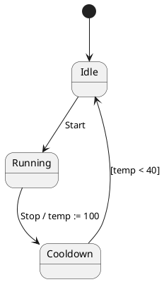

# Paper1 唯一论文大纲

本文件是 Paper1 唯一的规范论文大纲，按 [overleaf/sections/index.tex](../overleaf/sections/index.tex) 的十节顺序组织，给出可直接扩写的论文正文骨架、图表内容、证据落点与边界。数字来自 [v61 规范结果归档](../final_results/v61_source_divergence_vs_x1v2_baseline/README.md)：两臂全部报告按 §5.2–§5.3 的协议逐条裁定，复算脚本与输出见脚注[^fair]；[v60 归档](../final_results/v60_current_vs_x1v2_baseline/README.md)是前一代实现的结果，其数字不进入正文；2026-09-04 导师讨论的决策见 [talk](../../talks/2026-09-04-导师-paper1大纲收口与消融基线口径.md)，本大纲已按其 §4–§7 改写；现状分析、出路与代次间对照见 [analysis_and_options.md](../discover_matrix/docs/generations/v61/analysis_and_options.md)；谓词资格来自[当前谓词审计](../related_work/provenance/predicate_provenance.md)；直接工作处置来自[最接近工作矩阵](../related_work/closest_work_matrix.md)；L/W/D 与对应关系的定义与学术锚点来自 issue [#189](https://github.com/HansBug/research_ideas/issues/189) 与 [#195](https://github.com/HansBug/research_ideas/issues/195)。上一版大纲保留在 [paper_outline.md.backup](./paper_outline.md.backup)，其数字已作废，只保留论述结构作历史参照。

投稿目标为 SANER 2027 Research Track：IEEE 双栏 10 页正文另加 2 页参考文献，全轨双盲，摘要截止 2026-09-21，正文截止 2026-09-25。英文为投稿语言，中文为内部伴生稿。

## 写作纪律

1. 术语首次出现写「中文（English，缩写）」，之后只用中文或缩写；英文全称只出现一次，可机检合同见 [terminology_policy.md](./terminology_policy.md)。
2. 自然语言输入一律称「自然语言描述」，不称「需求」。上游数据集作者把它叫 requirement description，但它是按模板写出的设计层描述，部分还是从模型反推而来；论文在 §5.1 交代这一点，其余地方统一口径。
3. L 与 W 在 §2 定义；D、对应关系与 K/N/I 是测量仪器，只在 §5 定义。题目与摘要和 §1 可以引用命中率、精确率与 W2 份额的数值，并用一句话点明两臂报告均经人工裁定，但不解释判定规则；§2–§4 只允许以「不输出 / 由 §5 裁定」的形式提及仪器术语。对外术语按 [terminology_policy.md](./terminology_policy.md) 的 English 列：L 的英文名带 level、D 的英文名带 status，字母不变（导师 2026-09-04 第 6 点）。
4. 建模对象边界（无时钟、无不变式、无正交区）的唯一定义落点是 §2.1；§5.1 只做推论，§1、§8、§9 不重复讲 fork/join。
5. 所有比较均为案例研究内的描述性比较，不写显著性，不写普遍优越性，不写跨语言效果。
6. 成本数字不进论文：不设成本节、不给价格、不算倍率、不列 token 用量，用量只留在归档；选型理由里可以出现「成本与可获取性」这类定性表述。若审稿人问「是否全靠提示工程」，答案是 §4.4 的两臂 prompt 结构并列图，不是成本。
7. 页预算按 IEEE 双栏估算（一栏约 500 词，一页约 1000 词；表与图按占栏折算）。题目与摘要连同 §1 共 1.5 页：摘要不超过 200 词，引言七段不超过 900 词，图 1 占半栏。§2 共 1.5 页：L 表与 W 表合成一张两栏表，相关工作四段不超过 700 词，表 1 保留。§3 共 0.5 页。§4 共 3 页：图 2 架构与图 4 两臂 prompt 并列图各占一栏，表 3a 载体对比占半栏，表 3 谓词表去掉命题形状列并按 P1 裁定后的行数压到半栏；阶段合同表、九项分歧检查的逐条依据、回执字段与输入闭包清单外移到制品附录，正文只留一句话与指针。§5 共 1 页：表 4 并入表 5 题注，表 5b 外移到附录 C，人工裁定协议与指标各半栏。§6 共 2 页：表 7、表 7b、表 8、表 9 各不超过半栏，图 3 占半栏，消融结果（若 A1、A2 完成）合用半栏。§7–8 共 0.5 页，§9–10 共 0.25 页，合计 10 页；参考文献另占 2 页。§2 与 §4 是最容易超页的两节，扩写时每节先按本条的词数上限写初稿再补细节。**附录全部外移**：SANER 的 10 页含附录，附录 A、B、C 随匿名制品发布，正文只留指针（§10）。

<a id="outline-0"></a>
## 题目与摘要

**题目（英文投稿，中文伴生）。** 主题目承载全文的一句话论点：状态机是可执行对象。在大语言模型发现问题之前用它提供事实，在之后用它确认发现，问题发现就从表面对齐走到了行为层。候选如下，首选第一条：

1. `Beyond Surface Alignment: Evidence-Augmented LLM Discovery and Executable Confirmation of Behavioral Issues in State Machines` —— 超越表面对齐：状态机行为级问题的证据增强 LLM 发现与可执行确认。
2. `Beyond Surface Alignment: Discovering Behavioral Issues in State Machines against Natural-Language Descriptions with Executable Evidence` —— 超越表面对齐：面向自然语言描述的状态机行为级问题发现与可执行证据。
3. `From Claims to Witnesses: LLM-Based Discovery of Behavioral Issues in State Machines against Natural-Language Descriptions` —— 从主张到见证：面向自然语言描述的状态机行为级问题 LLM 发现。

**摘要。** 状态机是离散控制逻辑从自然语言（natural language，NL）描述走向实现的承重设计制品，如今越来越多地由大语言模型（large language model，LLM）生成；一台机器在被信任之前，必须先被复核是否做到了描述所说的事。最难复核的偏差是行为性的：目标状态是否可达、进入后能否离开、事件是否被消费、反馈能否使系统回到规定状态。逐元素比对能看出缺了哪个状态，看不出守卫沿任何轨迹都为假。本文研究给定一段自然语言描述和一台既有、在分析期间固定不变的状态机（state machine，STM），发现并定位机器不满足描述之处。我们按陈述一条问题所需的信息范围把问题分为 L0/L1/L2，把报告按证据强度分为 W0/W1/W2，并指出在我们审阅的直接相关工作中，规则式一致性检查停在 L0/L1，大语言模型审稿人的输入里没有被审机器的行为事实，且两者的输出都停在 W1；我们的同模型基线表明大语言模型能触及 L2，但不稳定（§6.1）。方法把状态机当作可执行对象而非文本。C1 把源制品经 PlantUML 适配器（PlantUML adapter）转换为保留来源归属（provenance）的有限控制状态机（finite control state machine，FCSTM），从中确定性地导出检查事实（deterministic inspect facts）与源–语义分歧检查（source–semantics divergence checks，即作者记法与投影语义不一致之处），并在大语言模型寻找问题之前送入其上下文。C2 在有适用谓词时把发现编译为四族 19 条类型化谓词（typed predicate）之一，在同一表示上执行并附上回放回执（replay receipt），使这部分发现从 W1 的主张提升为 W2 的见证；无适用谓词的发现仍以定位发布。在 54 个 PlantUML 输入对、145 条人工标注预期问题、3 轮共 435 个单元的案例研究中，两臂输出（903 与 512 条报告）由作者按同一裁定协议逐条人工裁定。方法与同模型朴素基线的 L2 `hit@1` 为 `97/117=82.91%` 对 `45/117=38.46%`，整体 `hit@1` 为 `323/435=74.25%` 对 `225/435=51.72%`，L1 的 `hit@1` 持平（`69.52%` 对 `68.57%`）。报告级精确率 `84.05%` 对 `83.40%`，在按 finding、按输入对平均与更严的有效性三种口径下方法低 1.8–3.6 pp，即精确率总体持平；报告数 903 对 512。方法的 323 个命中单元里 137 个携带可回放的 W2 回执（根报告口径 127；L2 上 60/97）；基线的输出按构造不携带回执。方法的 144 条无效报告中 15 条落在方法内部的表示边界（基线无同构类别，不作跨臂比较），其余为源级误读与事实成立但不构成缺陷的主张，本文给出成分分解。[^fair][^wang2025][^input_selection]

<a id="outline-1"></a>
## 1. 引言

引言按六步走：利害关系 → 任务 → 两个观察给出三个结构性缺口 → 核心想法与设计直觉 → 贡献 → 结果预告。六步七段，两个观察各占一段；七个段落的 topic sentence 连起来自成论证。

**P1 · 利害关系。** 状态机是离散控制逻辑从描述走向实现的关键设计制品，覆盖汽车、轨道交通与工业控制等领域。随着从自然语言描述生成状态机成为常规做法，机器在被信任之前必须先被复核：它是否做到了描述所说的事。这把本文的任务从「生成」切到「复核」——本文不生成、不修改机器。[^wang2025][^structure_event][^gwt]

**P2 · 任务。** 给定一段自然语言描述和一台既有状态机，找出机器不满足描述之处并定位到具体元素。现有做法三类：元素级一致性规则（如 Li 与 Zheng 的业务对象规则）、让大语言模型当审稿人读两份文本（如 MCeT 与朴素提示）、形式验证（前提是已经知道要验哪条性质，而这正是待发现的东西）。[^li_zheng][^mcet][^uml_survey]

**P3 · 观察一：问题有深浅。** 用图 1 的小例子（描述与 PlantUML 原文见下方代码块；图 1 共六栏，在此一次定义：(a) 描述 NL1–NL3，(b) PlantUML 原文，(c) 表面对齐检查逐项通过，(d) 投影后的 FCSTM 与来源映射，(e) 确定性检查事实，(f) 类型化计划与回执；用 PlantUML 写是因为案例研究的源制品就是 PlantUML；它是为说明构造的最小示例，不来自 54 个输入对，真实实例见 §6.1）。描述三句：上电后处于 `Idle`；收到 `Start` 进入 `Running`；操作员按下 `Stop` 后设备应回到 `Idle`。模型写了 `Running --Stop--> Cooldown / temp := 100` 与 `Cooldown --[temp < 40]--> Idle`，而除这一次写入外没有任何动作再修改 `temp`。表面对齐检查全部通过：`Idle` 存在、`Stop` 存在、`Stop` 触发的迁移存在、到 `Idle` 的边存在。行为层的问题却真实存在：沿任何进入 `Cooldown` 的轨迹守卫恒假，按下 `Stop` 后 `Idle` 不可达。这条问题不对应描述的任何一句原话，却确实违反了描述。判定它所需的信息不在两份文本的表面上：可达性、沿可达轨迹的守卫可满足性与事件后的响应都要跨迁移推理。由此得两个结构性缺口。**缺口 ①**：规则式一致性检查比较元素的存在与顺序，从不构造或排除一条执行，所以到不了这一层。**缺口 ②**：大语言模型审稿人能谈行为，但行为事实不在它的输入里，它只能在自身的推理过程中模拟；我们的同模型基线恰好在这一层最弱：39 条 L2 预期问题里只有 7 条三轮稳定命中（`hit@all` 17.95%），单轮 `hit@1` 为 38.46%；完整方法的这两个数分别为 71.79% 与 82.91%。[^hilken][^baier_katoen]

图 1 的 (a) 描述与 (b) PlantUML 原文如下，可直接搬进论文：

```text
(a) 自然语言描述
NL1. After power-on, the device is in Idle.
NL2. On Start, the device enters Running.
NL3. After the operator presses Stop, the device shall return to Idle.
```



(c) 表面对齐检查逐项通过：`Idle`、`Running` 存在（NL1、NL2）；`Start`、`Stop` 触发的迁移存在（NL2、NL3）；到 `Idle` 的边存在（NL3）。(d) 投影后的 FCSTM 与来源映射：$S=\{Idle, Running, Cooldown\}$，$E=\{Start, Stop\}$，$V=\{temp\}$，三条迁移各自标注源行号。(e) 确定性检查事实：`temp` 的写者集合只有 `Running --> Cooldown` 的效果（写入 100），从 `Cooldown` 可达的片段内没有任何写 `temp` 的动作；`Cooldown` 唯一出边的守卫依赖 `temp`。(f) 类型化计划与回执：路由到轨迹族 R2 `state_reached_after`——从初始配置执行 `Start, Stop`，再空转 $k$ 个宏步，`Idle` 在窗口尾段未激活，结果 `false`；轨迹逐步记录 `temp = 100` 与守卫 `[temp < 40]` 的求值 `false`。拓扑族在这里不适用：忽略守卫的图上 `Cooldown → Idle` 这条边存在，G1 `may_reach(Cooldown, Idle)` 为 `true`——这正是 L2 问题需要数据感知后端的原因。(c) 是 L0，(e) 是 L1 事实，(f) 把 L2 问题证到 W2；同一个例子在 §2.3 复用为 W1 与 W2 的对照。

**P4 · 观察二：报告有强弱。** 「`Cooldown` 回不到 `Idle`」是一句主张，复核者要自己重推一遍才能信。测试与验证文献区分未经判定的主张与在制品上求值过的反例：前者是一条 smell，后者是一条 error trace。形式验证确实提供可执行对象，但它要求性质已知，因此不做发现；现有的自然语言对模型检查器输出的全是前者——MCeT 的 issue、Li 与 Zheng 的 `AbnStepPair` 有定位但未执行、朴素提示的三个自由文本字段。**缺口 ③**：发现上没有附着任何可执行对象，什么都无法回放。[^femmer][^debbi][^barr]

**P5 · 核心想法与设计直觉。** 把状态机当作可执行对象，在大语言模型的前后各用一次。之前：把源制品转换为保留来源归属的 FCSTM，从它确定性地导出结构、拓扑与运行事实，作为发现阶段的输入——C1，证据增强发现（evidence-augmented discovery）。之后：在有适用谓词时把大语言模型提出的发现编译为一个小词表中的类型化谓词，在同一表示上执行并附上可回放回执，无适用谓词者仍以定位（W1）发布——C2，可执行确认（executable confirmation）。①② 合起来由 C1 回应，③ 由 C2 回应。图 1 用 P3 的小例子把这条链画成一页。

**P6 · 贡献。** 三条，前两条各指向一个结果小节，C3 指向 §10。
- **C1 · 证据增强发现。** 提出保留来源归属的 FCSTM 工作表示、确定性检查事实与九项源–语义分歧检查，并把它们作为发现阶段的输入。在 PlantUML 案例研究中，搭载 C1 与 C2 的完整方法相对同模型基线的整体 `hit@1` 为 74.25% 对 51.72%，L2 的 `hit@1` 为 82.91% 对 38.46%，L2 的 `hit@all` 为 71.79% 对 17.95%；L1 的 `hit@1` 持平（69.52% 对 68.57%）（§6.1）。命中按承载来源分解为分歧检查、谓词确认、谓词绑定未闭合与纯语义候选四类（§6.1）；C1 与 C2 各自的开关消融为条件性研究问题（§5.7）。
- **C2 · 可执行确认。** 从领域学术普查归纳四族 19 条类型化谓词及其 FCSTM 后端语义，只在作者拥有的载体上执行断言并记录可回放回执。323 个命中单元中 137 个达到 W2（L2 上 60/97）；基线的输出按构造不携带回执，该维度不构成对照（§6.3）。
- **C3 · 案例研究与可复算制品。** 使前两条可核验的支撑物：54 个输入对上 145 条按问题层级与缺陷状态分层的人工预期问题台账（分层口径见 §5）、两维人工裁定协议、两臂逐报告裁定记录与最小复算包，以及外移的附录 A–C。公开按 §10 的最低标准。

**P7 · 结果预告。** 54 个输入对、145 条预期问题、同模型基线、同一套人工裁定协议。整体 `hit@1` 74.25% 对 51.72%；L2 提升最大，L0 次之，L1 持平（§6.1）。报告级精确率 84.05% 对 83.40%，三种更严口径下方法低 1.8–3.6 pp，报告数 903 对 512（§6.2）。323 个命中单元中 137 个携带可回放回执，L2 上 60/97，基线按构造为零（§6.3）。方法的 144 条无效报告中 15 条来自方法内部的表示边界，其余为源级误读与不构成缺陷的事实主张；本文给出成分分解，但不据此重算校正精确率。只给数字，不写「显著」。[^fair]

<a id="outline-2"></a>
## 2. 背景与相关工作

顺序固定为：对象 → L → W → 相关工作。L 依赖对象（「跨迁移的行为性质」要先有迁移语义），相关工作依赖 L（IET 用 L 定位）。

### 2.1 建模对象：离散控制逻辑的层次化扩展有限状态机

研究对象是离散控制逻辑的层次化扩展有限状态机 $M=(S,E,V,Tr,A)$：状态集 $S$ 与层次映射 $\mathrm{parent}: S \to S \cup \{\bot\}$（无子状态者为叶态 $\mathrm{leaf}(S)$）、事件集 $E$、变量集 $V$、带守卫与动作的迁移集 $Tr$、动作集 $A$。这是 UML/SysML 状态机与绝大多数控制器设计共享的核心片段，UML 2.5.1 的状态、迁移、触发、守卫、动作槽位语义与 Dwyer 等的有限状态性质模式在此片段上定义良好。实时时钟与不变式、正交区并发不在对象内：它们引入另一套验证理论（时间自动机、区域抽象），是独立的问题。这里只定义对象，不提数据集，不提任何 pair。[^uml251][^dwyer][^heimdahl][^heitmeyer]

### 2.2 问题层级 L

问题层级（problem level，L）描述陈述一条问题所需的信息范围，与用什么算法、后端或见证形式无关。

| 档 | 定义 | 例 |
| --- | --- | --- |
| L0 · 表面对齐 | 比对描述词项与模型词项即可陈述 | 描述点名 `Emergency`，模型没有这个状态 |
| L1 · 结构导出 | 需从模型结构导出一个事实，静态可判 | 某守卫按其所在状态的声明即恒假（静态可判）；某叶态没有任何出边；同源同触发两条守卫重叠；两条声明动作的书面先后与结构导出的先后不一致 |
| L2 · 行为/全局性质 | 涉及跨迁移、路径、可达性、终止、响应或全局交互的行为关系 | 进入 `ActiveState` 后永久困住；§1 例中 `Stop` 后 `Idle` 不可达——同一「守卫为假」形状一旦依赖可达赋值即升为 L2 |

学术锚点借用形状，不引用定义：Hilken 等把 UML/OCL 验证任务分为考虑单个系统状态的 structural 任务与考虑状态序列及迁移的 behavioral 任务；Baier 与 Katoen 指出不变式可由可达状态集判定，而路径片段上的安全性质不能，活性性质更是有限迹无法判定；Engels 等与 Knapp、Mossakowski 指出句法规则查不出动态一致性问题。先例分的是分析手段的能力，本文分的是陈述该问题所需的信息；自设 L 的理由是它必须对两臂中立、不预设任何分析手段，才能用来给台账分层并对只读文本的基线公平。两套分类在本语料上多数条目落点一致，但概念不同，论文必须写明。L 不是难度序，两臂表现不必随 L 单调。`structural inconsistency` 采 Hilken 口径而非 Van Der Straeten 口径。[^hilken][^baier_katoen][^engels][^knapp][^torre]

### 2.3 证据强度 W

见证强度（witness strength，W）描述一条报告被证到什么程度。

| 档 | 定义 | 例（沿用 §1 小例） |
| --- | --- | --- |
| W0 · 断言 | 散文主张，既无定位也无可执行对象 | 「可能有死锁」 |
| W1 · 定位 | 点到具体元素或路径，但没有可执行对象 | 「`Cooldown` 回不到 `Idle`」 |
| W2 · 见证 | 一个可执行对象，在被求值的那份制品上被判过真值 | 「从初始态执行 `Start, Stop` 抵达 `Cooldown`，`temp=100`，唯一出边守卫 `[temp<40]` 求值为假，从 `Cooldown` 可达的片段内没有任何动作写 `temp`；R2 `state_reached_after([Start, Stop], Idle)` 在 $k$ 步窗口内为假」 |

W1 的构件对应 Femmer 等对 requirements smell 的刻画：有具体定位与具体检测机制，但仍不是见证。W2 对应 Debbi 综述中的 counterexample / error trace：由分析它可定位错误来源。W 小于 2 的裁决对应 Tretmans 的 `inconclusive`：没有找到不合规的证据，但测试目的也没有达成。W0 与 W1 的档名是本文自设，内容有出处。[^femmer][^debbi][^tretmans]

**W2 比 W1 强在哪里。** 此处接入 Barr 等的 oracle problem：自然语言描述是一份部分的、非形式的 oracle。W1 报告把 oracle 的求值留给人；W2 报告自带一次在制品上完成的求值，复核者只需回放，不必重推。Clover 把代码正确性归约为代码、文档与形式标注的一致性并用验证工具机械检查，是同一思路的先例[^clover]。同时给出 W2 的适用边界：若见证只在抽象模型上成立、在具体模型上不成立，它就是 spurious counterexample。本文的见证在 FCSTM 而非 PlantUML 原文上求值，因此存在这一风险；针对它，方法设置了两道确定性机制——谓词只在作者拥有的载体上执行，投影与作者记法不一致之处作为独立的分歧检查发布（§4.2、§4.3）——残余的一类主张是把方法内部表示状态归给作者源，其类别由 §5.2 定义、条数与占比在 §6.2 报告。[^barr][^clarke_cegar]

### 2.4 相关工作

三类（A 类分 A1、A2 两个子类），每类一个结构性局限，最后一句定位。【内部】正文不写「前置理由」，直接给映射。

**A1 类：自然语言与单一固定模型的一致性检查。** Li 与 Zheng（IET Software 2025）是本文任务合同的直接先例：原始自然语言经结构化与用例规约（use-case specification，UCS）转换进入流程，Algorithm 3 以 UCS 和既有状态机为输入，输出定位的 `AbnStepPair`，并在一个 Web Store 项目的状态机制品上评测。按本文的 L 口径作分析性映射（IET 原文未使用 L）：Semantic Consistency 比较业务对象在活动图与 UCS 中的存在，为 L0；Process Consistency 要求输入对象先于输出对象出现，为 L1 的局部顺序；State Consistency 检查触发迁移的动作是否出现及相对顺序是否保持，为 L1，至多位于 L1/L2 边界。L2 的可操作判据是：陈述该问题必须构造或排除至少一条执行。三条规则只比较两份声明中元素与动作的书面存在与先后，不构造任何执行，因此不越过 L1；它们未分析可达性、死端、终止、事件响应或全局交互。MCeT（MODELS 2025）保留了「自由文本描述 + 既有图 → 定位问题」的形态，但对象是顺序图，没有持久状态、层次与迁移语义，输出是散文 issue。Wang 等自己的 requirements semantic checking 对参考模型算 F1——它需要一份参考模型，而实践中正是没有它才需要复核。**结构性局限**：规则式一侧比较的是元素的存在与顺序，从不构造或排除执行（Torre 等系统识别出的 UML 一致性规则目录是这一形态的集中体现[^torre2018]）；大语言模型审稿人一侧能谈行为，但被审机器的可达性、前沿与事件消费信息不进入它的输入；两侧都没有在一台固定的被审状态机上执行过任何东西，输出停在散文或定位，所以到不了 W2。[^li_zheng][^mcet][^wang2025]

**A2 类：模型与模型、多视图之间的一致性。** Sultan 与 Apvrille（MODELS 2024 及其 SoSyM 2026 期刊版）做 SysML 多视图一致性并修正[^sultan2024]，Liu 等做需求与异构模型的可观测一致性并用 SMT 求解。**结构性局限**：比较对象是多个视图或多个模型之间的关系，没有一台单一固定的被审制品，也没有自由文本作为唯一参照；它们回答的是另一个问题。[^sultan][^liu]

**B 类：自然语言到模型的生成、补全与修复。** de Biase 等从 Given–When–Then 需求补全 SysML 状态机；Abdulkarim 等比较结构驱动与事件驱动的生成框架；King 与 Vyatkin 用 STPA 约束递归修改既有有限状态机并生成 IEC 61499 代码。**结构性局限**：输出是一台新机器，输入模型被改动；没有一个固定不动的被审制品，因此不产生定位在该制品上的发现。[^gwt][^structure_event][^king_vyatkin]

**C 类：自然语言到形式性质与验证。** FRET 把受限自然语言需求形式化；nl2postcond 用大语言模型生成后置条件；Estivill-Castro 与 Hexel 用语法提示为轻量级有限状态机（Lightweight Finite State Machine，LLFSM）合成多个模型检查器可接受的性质；André 等综述了 UML 状态机的形式化与自动验证。传统 UML/OCL 验证工具在 L2 上已成熟并能给出 W2 级证据（可达性、死锁自由、不变式反例），但性质由人写、工具从不接触自然语言；Hilken 等的任务目录是为统一这类任务的术语而作。本文的差异不在能否求值，而在求什么：在只有一段描述的条件下决定该问哪个命题。[^hilken] 同形任务合同在代码制品上的近作是 Zhou 等把自然语言需求与固定代码比对并定位问题的工业经验报告[^zhou2026]；状态机侧不是它的直接移植，因为散文与 PlantUML 之间没有现成的编译器与验证器可借。**结构性局限**：假定要验的性质已经知道，由人写或由人选；它们给可执行证据，但不做发现，且性质合成的评测停在合成而非 verdict。LiSSA 表明追溯链接恢复是独立问题，模型输出的有效性判断因此在本文由人工裁定给出（§5.2–§5.3）。[^fret][^nl2postcond][^estivill][^uml_survey][^lissa]

**为什么三类工作都到不了「L2 的发现 + W2 的确认」。** 三类工作的局限有同一个根源：缺一个语义确定、可执行、可检查的介质。规则式一侧比较记法层的元素与顺序；大语言模型审稿人一侧的输入里没有被审机器的可达集、前沿与事件消费，本文的同模型基线在 39 条 L2 预期问题上只有 7 条三轮稳定命中（§6.1），与这一读法一致；形式验证一侧有可执行介质，但性质由人写，介质不参与发现，André 等的综述也把 PlantUML 归为「纯句法、不能做仿真或验证」的记法[^uml_survey]，MCeT 则以「不对照文本描述求值」为由把形式验证排除在基线之外[^mcet]。陈述一条行为层问题要构造或排除一条执行（§2.2），给出可回放证据要有一个被求值过的对象（§2.3）；两件事都要求先有一台能跑、且能回指作者写的每一行的机器。这就是 §4 把源制品投影为 FCSTM 的理由，FCSTM 在其中只是工程载体，不是贡献（§4.1）；前 LLM 时代的确定性检查器为何不构成基线，见 §5.5。

**定位句。** 据我们所知，尚无工作在制品固定、参照仅为一段自由文本、且没有任何人写的形式性质这三个条件同时成立时，报告过行为层问题的发现与机械确认。Li 与 Zheng 已在同一输入输出合同上实现并评测（本文不主张该合同的优先权），但其规则不构造或排除执行；形式验证一侧能给机械证据，但性质由人给定。本文的贡献是把这两侧接起来所需的那一层——从散文义务到可执行命题的类型化路由、W 分层与极性资格——以及为此付出的可测代价。

**表 1：承重工作的定位。** 行为六篇承重工作与本文；列为「输入含固定制品？」「输出是定位发现？」「检查层级（按本文 L）」「证据形态（散文 / 定位 / 执行）」「评测对象」。IET 行承认任务形态重叠；L 列只按本文口径分析其已发表规则。

| 工作 | 固定制品输入 | 定位发现输出 | 检查层级 | 证据形态 | 评测对象 |
| --- | --- | --- | --- | --- | --- |
| Li 与 Zheng（IET） | 是 | 是 | L0/L1 | 定位 | 一个 Web Store 项目的状态机 |
| MCeT | 是（顺序图） | 是 | 不适用（无状态语义） | 散文 | FBench 顺序图 |
| Sultan 等 | 多视图，非单一固定 | 不一致列表并修正 | 视图间关系 | 规则 + LLM | SysML 案例 |
| de Biase 等（GWT） | 部分状态机，被补全 | 否 | 不适用 | 生成元素 | 两个案例 |
| Estivill-Castro 与 Hexel | LLFSM | 否（合成性质） | 不适用 | 性质文本 | 4 个系统（22 个 SEG 示例） |
| Liu 等 | 异构模型 | 一致性判断 | 可观测关系 | SMT | 合成需求与汽车案例 |
| 本文 | 是 | 是 | L0/L1/L2 | 定位 + 执行 | 54 个 PlantUML 输入对 |

<a id="outline-3"></a>
## 3. 问题定义与范围

### 3.1 任务合同

输入对写为 $(d, m)$：$d$ 是一段自由文本的自然语言描述，$m$ 是分析开始前已经存在、在分析中保持不变且具有来源归属的状态机制品。输出是一组定位的问题报告 $f=(\mathrm{dref}, \mathrm{mref}, \mathrm{obligation}, \mathrm{location}, \mathrm{evidence})$：引用描述中的句子、引用源制品中的位置、陈述被违反的义务、给出定位，并在适用时附上可执行证据。方法不生成、不修改 $m$；$m$ 可以来自人，也可以来自上游大语言模型流程。$d$ 的义务集不可从自由文本形式导出，$m \models d$ 也不可计算；任务因此不承认可计算的满足判据：「一条问题」由 §5.2 的协议操作化定义，并由作者按该协议人工裁定（执行方式见 §5.3），方法的证据只承担机械确认部分。这与 §2.3 的 oracle problem 是同一件事。

### 3.2 适配器契约

方法面向能投影为 §2.1 中 $M$ 的状态机类模型。一种具体建模语言只有在声明的子集上给出到 $M$ 的可追溯投影、保留源载体到投影元素的映射、写明规则相关能力、对不能可靠映射的特征失败关闭，才可作为适配器接入。本文只实现并评测 PlantUML 适配器；其支持片段与不支持项（正交区、时钟、fork/join）在 §4.2 列出。

### 3.3 范围声明

方法产生的报告分三种证据状态：W2 的可执行见证、W1 的精确定位、W0 的未定位主张。L 是台账侧对预期问题的分类，方法不输出 L；D、报告有效性与对应关系由 §5 的测量仪器完成，方法不读取也不输出它们。投影、编译器、运行时或证据闭合的失败须与源制品问题分开记录。

<a id="outline-4"></a>
## 4. 方法

### 4.1 总览

方法在大语言模型的前后各接一次确定性程序：之前把源制品变成可查询的事实，之后把发现变成可执行的命题。

**图 1：运行示例。** 六栏在 §1 一次定义；本节用其 (d)–(f) 栏走完整条链：契约提取把 NL3 写成义务「`Stop` 之后最终回到 `Idle`」，行为后果 lens 提出候选「`Cooldown` 后 `Idle` 不可达」并绑定源行，路由选轨迹族 R2 `state_reached_after`（拓扑族在忽略守卫的图上给不出这个结论，见 §1），计划固定刺激序列 `Start, Stop`、目标 `Idle`、窗口 $k$，原生回放给出 `false` 与逐步守卫求值，回执携带 pair/obligation/plan/model/program/receipt 的哈希链。输入片段不受支持、绑定不完整、原生加载失败、超时或回放失败时，系统保留来源定位与失败阶段，以 W1/W0 表示证据尚未闭合。

**图 2：方法架构。** 四条责任泳道：源制品与描述 → 确定性程序（适配器、FCSTM 与作者源索引（author-source index）、检查事实、分歧检查、谓词编译、后端、发布层折叠）→ 大语言模型（契约提取、双 lens 发现、语义筛选）→ 评测（§5）。C1 覆盖泳道二到泳道三的前半：转换、检查事实与分歧检查进入发现阶段；C2 覆盖泳道三到泳道二的后半：发现被绑定为类型化谓词，只在作者拥有的载体上回到后端执行并产出回执。图中标出每类失败的归因位置：投影边界、编译器载体、运行时失败、评测裁定。

**FCSTM 的定位。** FCSTM 是 pyfcstm 的状态机领域特定语言及其分析运行时[^pyfcstm]，本文用它作分析工作表示。它是工程载体，不是贡献；用到的都是经典算法：`inspect_model` 的图算法与诊断码（可达集、出度、槽位占用、守卫重叠），宏步执行的仿真运行时，以及把有界模型检查查询编译为 Z3 求解的 SMT 公式、再把满足赋值解码为可回放轨迹的有界模型检查。不用现成工具只有一条工程理由：来源映射。表 3a 对比同类载体，列为输入、执行语义、有界模型检查、到作者记法的源行映射。

**表 3a：FCSTM 与同类可执行载体。**

| 载体 | 输入 | 执行语义 | 有界模型检查 | 源行映射到作者记法 |
| --- | --- | --- | --- | --- |
| Simulink Stateflow 与 Design Verifier[^stateflow] | `.slx` 专有格式 | 仿真 | 有（dead logic 等，商业许可） | 无；无 PlantUML 输入 |
| Sismic[^sismic] | YAML 状态图 | 运行时与契约 | 无 | 无；只有导出到 PlantUML，无导入 |
| SCXML 引擎（Apache Commons、Qt）[^scxml] | SCXML | 运行时 | 无 | 无；PlantUML 的 SCXML 导出丢守卫、颠倒方向 |
| itemis CREATE | `.sct` | 仿真与编辑期校验 | 无 | 无 |
| UPPAAL、SPIN、NuSMV | 时间自动机、Promela、SMV | 模型检查 | 有 | 需人工翻译；模型类不同 |
| FCSTM（pyfcstm） | 由适配器从 PlantUML 投影 | 宏步仿真 | 有（Z3，带回放） | 有：源载体 → 中间表示 → FCSTM 三层映射 |

### 4.2 C1（上）：适配器、FCSTM 与来源映射

适配器把 PlantUML 源文本解析为规范化的源中间表示，再投影为 FCSTM。FCSTM 是 $M$ 的一个操作化扩展，额外固定宏步语义、生命周期动作与伪状态：层次状态、事件、变量、带守卫与效果的迁移、进入/退出/驻留动作，运行语义为宏步（`macrostep`）。投影全程保留源行号、具名载体、所有者路径、伪状态、生命周期动作与迁移来源；每个 FCSTM 元素都能回指源文本位置，每条报告与每份回执因此都能定位回作者写的那一行。

适配器对源特征有三种处置。支持片段：单区层次、初始/终止伪状态、事件触发、有限域守卫、变量赋值效果。失败关闭项：正交区、历史伪状态、时钟与时间事件、fork/join；不能投影的特征不会被静默丢弃，而是记为投影边界并进入 §6.2 的归因。**有损规范化**（lossy normalization）：能投影、但归一化会丢信息的记法层特征——例如把一条自由文本迁移标签解析为触发、守卫、效果三个槽位时，标签里并列的多个条件被折成一个事件 token，写错槽位的表达式被按槽位语义重解释；它不触发失败关闭（投影本身成功），因此不留边界记录。

针对有损规范化，方法在投影之上建立**作者源索引**：每个 FCSTM 载体标注它由哪条作者行生成（作者拥有），或由编译器为闭合语义补出（编译器拥有，例如复合态的默认初始迁移、跨作用域路由的令牌变量）。作者源索引支撑两道机制：**载体归属门**（carrier-attribution gate）——谓词与领域不变式只在作者拥有的载体上执行，编译器载体上的候选记为「编译器载体跳过」，不进入发现；**源–语义分歧审计**（§4.3）——投影语义与作者记法不一致之处不被静默归一，而是作为独立的确定性候选发布。

**输入闭包。** 方法只读描述原文、PlantUML 原文、规范化源中间表示、FCSTM、确定性检查事实、三层来源追踪与工作约定，全部由清单与哈希固定；不读台账、评测裁定或历史报告（清单见附录 B）。

**为什么需要一次转换。** PlantUML 状态图没有执行语义，行为性问题在它上面没有定义；要问「`Stop` 之后能否回到 `Idle`」必须先有一台能跑的机器。转换的代价也必须在这里交代而不是留到讨论节：投影会归一化标签文本（例如把一条自由文本迁移标签解析为触发、守卫、效果三个槽位），归一化后的模型可能与作者写的记法层事实不一致；作者源索引让这一不一致可见（§4.3），§6.2 报告其残余。

### 4.3 C1（下）：确定性检查事实

在 FCSTM 上运行确定性检查，产出结构、拓扑与运行三类事实：结构事实（声明清单、槽位占用、叶态出度、守卫重叠）、拓扑事实（从初始配置的可达集、无退出叶态、跨层路由）、运行事实（有界宏步前沿，即从初始配置起若干宏步内可达的配置集合；事件消费者集合）。这些事实不产生新的义务——义务只来自描述——它们只把源文本里不稳定呈现的信息变成可引用的对象。事实随来源映射一起进入发现阶段的上下文。

以图 1 为例，检查事实会给出：`temp` 的写者集合 $\{Running \to Cooldown\}$；`Cooldown` 出边守卫的自由变量 $\{temp\}$；从初始配置出发的可达叶态 $\{Idle, Running, Cooldown\}$；无退出叶态集合为空：`Cooldown` 有一条出边，静态上不是死端。这是 L1 事实与 L2 问题的分界——出度非零，但守卫沿轨迹恒假。事实以结构化 JSON 进入上下文，每条带 canonical code、涉及元素的来源行号与一句英文说明；prompt 明确告知模型这些是事实而非缺陷，缺陷判断必须回到描述。

**源–语义分歧检查。** 九项确定性检查比对作者记法与投影语义。每项以 PlantUML 文法或 UML 2.5.1 语义条款为依据（附录 A），覆盖首次提及嵌套、同名状态跨块声明、生命周期关键字被当作状态名、复合事件标签、只有守卫的标签、无标签边、同一区域多条默认进入边、无标签闭环与仅有 stereotype 的复合态。命中即产出一条带作者行号锚点与派生契约的 W1 候选，与检查事实一起进入发现阶段，也可独立发布；检查只陈述「作者写的与投影得到的不一致」，义务仍来自描述；案例研究中这类报告共 77 条，其对命中的贡献见 §6.3。另有三项确定性收紧：根可达性与终止前沿不再依赖投影赋予的状态角色，锚定失败时回退到描述词元；S5 只在作者载体声明了方括号守卫时才断言守卫等式；R2 要求冷前缀实际到达源状态，且在带路由令牌的模型上整体撤回（§4.5）。[^uml251][^plantuml]

### 4.4 大语言模型阶段

五个阶段顺序执行，每阶段写清输入、输出与禁读项（不读台账、不读评测、不读历史报告，不输出 L/W/D）。

1. **契约提取。** 从描述中提取可追溯的义务契约，每条契约引用描述原句；仅在固定条件满足时做一次有界补全。
2. **双 lens 发现与定位。** 两个互补 lens 共享同一响应 schema：`contract_structure_contrast` 优先审契约完整性、结构与对照一致性（遗漏或压缩的契约、所有者/根默认入口、迁移组守卫冲突、错误的局部退出目标、未授权的边）；`behavior_consequence` 优先审行为后果（根可达性、可达的事件消费者覆盖、禁入范围、死端/前沿事实、跨包装器可达性、稳定终止、有界响应）。每条候选带 `reason` 与 `basis`，且必须完成精确的源与闭合模型绑定。
3. **执行批。** 确定性前沿、路由、类型化输入绑定、谓词编译与原生后端执行（§4.5、§4.6）。
4. **语义筛选与受限修正。** 内部阶段只做候选筛选与审计信息保留，不构成论文的 D 裁定。
5. **发布。** 按精确类型身份去重；**因果折叠**（causal fold）把结构根因的下游行为症状并入根报告作为子主张，回执随子主张保留；**守卫模态聚合**（guard-modality aggregation）把同一模型里多条同形的 S5 发现合并为一条根报告；每条报告附作者源锚点（因果阶表与成员判据见附录 B）。输出方法的发现集与全部证据。

五个阶段的输入、输出、执行者与禁读项列在附录 B 的阶段合同表；每阶段都不读台账、不读评测、不读历史报告，也不输出 L/W/D。附录 B 同时写清七项确定性细节：契约补全的固定触发条件、两个 lens 输出的合并与冲突消解规则、精确类型身份去重键、因果折叠的因果阶表与状态闭包判据、守卫模态聚合的成员判据、语义筛选与受限修正的预算与停止条件、采样参数与重试与解析失败处置。【待决策】提示词与响应 schema 是否随制品发布。

prompt 纪律写进论文：所有阶段只使用提供的上下文清单；每个结构化对象必须有非空 `reason` 与 `basis`；不得从关键词、子串、正则或文本相似度作判断；非英文文本只允许作为逐字引用出现。

**prompt 结构对照（图 4，全文骨架随制品附录 B 发布）。** 两臂 prompt 并列成两栏。共享段为任务说明、输出 schema 的字段定义、描述原文、PlantUML 原文，两臂逐字相同；方法引入段为 FCSTM 投影、检查事实、分歧检查候选、契约列表、谓词词表与类型化绑定要求。方法引入段就是方法本身，去掉它们就没有方法，它们不是提示工程的额外投入。论文据此回答「差异是否来自提示工程」：两臂在方法无关部分等价，差异全部落在方法引入的信息与结构上，其各自作用由 RQ4、RQ5 的消融回答（§5.7）。

### 4.5 C2（上）：四族 19 条类型化谓词

谓词是为方法所需而设的填空模板：大语言模型不写断言代码，只在一个小词表里选一条谓词并填入类型化参数，再由确定性程序编译、执行并出具回执。这样设计有两个理由：让模型从「大海捞针式地写可执行性质」变成「填空」，以及把它提出的候选交给后端判真值，把不成立的候选拦在发布之前（§6.2 报告被 `pass` 回执拦下的数量）。词表不求覆盖全部领域义务，只求方法用得上。【待 P1】表中保留哪些行、如何呈现未在本语料执行的谓词，由 P1 裁定；本节按本次运行时的 19 条词表写，与 §6.3 的数字一致。

**表 3：19 条谓词。** 列为 ID、名称、主要输入、后端、极性资格；精确命题与命题形状以附录 A 为准。谓词来源是领域文献普查：UML 2.5.1 给元素槽位与 Constraint 的二值后果，Dwyer 等给响应/缺失/全称的性质形状，Heimdahl 与 Leveson、Heitmeyer 等给守卫覆盖、互斥与事件响应的分析义务，Baier 与 Katoen 给不变式、可达与死锁自由。必须写明两句可辩护的话：(i) 每条义务的形状有一手逐字引文（附录 A）；(ii) 当前四族 ID 与表达式是对既有学术普查义务的版本化重映射。不写无法证明的否定式；每条的学术资格、方法执行语义、实例授权三类责任分开记录。[^uml251][^dwyer][^heimdahl][^heitmeyer][^baier_katoen][^predicate]

| ID | 名称 | 主要输入 | 后端 | 极性资格 |
| --- | --- | --- | --- | --- |
| S1 | `element_exists` | 种类、名称 | 结构 | 双向 |
| S2 | `transition_exists` | 源、目标、触发 | 结构 | 双向 |
| S3 | `trigger_set_equals` | 载体、期望触发集 | 结构 | 双向 |
| S4 | `state_action_attached` | 状态、槽位、动作 | 结构 | 双向 |
| S5 | `transition_guard_equals` | 迁移、期望守卫 | 结构 | 双向 |
| S6 | `transition_effect_attached` | 迁移、效果 | 结构 | 双向 |
| G1 | `may_reach` | 源、目标集 | 拓扑 | `false` 为不可达的健全反例 |
| G2 | `must_reach` | 源、目标集、界 | 拓扑 | 有界；`true` 只说明界内必达 |
| G3 | `route_avoids` | 源、目标、禁入集 | 拓扑 | `false` 为一条经过禁入集合的路径 |
| G4 | `coaccessible_to` | 根集、标记集 | 拓扑 | `false` 为一个到不了标记集合的可达节点 |
| R1 | `event_consumed` | 刺激序列、事件 | 轨迹 | 有限轨迹 |
| R2 | `state_reached_after` | 刺激序列、状态、窗口 | 轨迹 | 单一调度，不推因果或全局可达 |
| R3 | `behavior_occurs` | 刺激序列、所有者、槽位、行为 | 轨迹 | 不推具体 I/O 或业务效果 |
| R4 | `state_retained` | 刺激序列、状态、闭区间 | 轨迹 | 有限轨迹内的保持，非无限持久 |
| V1 | `guards_disjoint` | 迁移组、有限域 | 有界验证 | 有限域 |
| V2 | `guards_complete` | 迁移组、有限域 | 有界验证 | 有限域 |
| V3 | `response_within` | $p$、$q$、界、scope | 有界验证 | 仅 `unit=steps`；毫秒界不受支持；不把无界响应转成步数界 |
| V4 | `deadlock_free` | 初始范围、稳定配置 | 有界验证 | 只覆盖探测到的叶状态片段；不同于终止 |
| V5 | `state_invariant` | 状态、期望占据值、初始范围、界 | 有界验证 | 有界 `false` 为无界不变式的单向反例；`true` 只说明界内通过 |

四族的解释范围：S 族是声明片段上的静态检查，按 UML 2.5.1 的复合态进入语义，涉及复合态端点的 S2 在其祖先闭包上求值；G 族在忽略守卫与数据的拓扑投影上求值，该投影是迁移关系的过近似——全称方向的 `false`（如 G1 无路径）健全，存在方向的 `false`（G2、G4）依赖该路径在真实语义下可行，论文只在 §4.6 与 §8 各用一句说明这一点，不新增见证类别，不补实验；R 族是宏步与回放定义的运行片段，数据感知；V 族编译为带变量的有界模型检查查询，是有限域、界限与极性限定的查询。R2 另有两条前置：冷前缀（cold prefix，从初始配置开始、不带任何前置刺激的执行前缀）必须实际到达刺激序列的源状态，否则回执记为撤回（withhold）；模型含跨作用域路由令牌时 R2 前沿整体撤回，因为路由令牌是编译器载体而非作者写的守卫。

### 4.6 C2（下）：执行、回执与 W2 条件

回执记录程序、模型、查询、绑定输入、范围、界、布尔结果、轨迹或失败阶段，并以哈希绑定回放。W2 的发表解释为：

$W2(f) \iff F(f) \land B(f) \land I(f) \land Q(f) \land E(f)$

其中 $F$ 是受支持片段，$B$ 是精确实例绑定，$I$ 是 pair/obligation/plan/model/program/receipt 的精确身份链，$Q$ 是非空且可核验的描述引文、源引用与绑定引用，$E$ 是完成的原生布尔回执。任一条件缺失时，定位明确的候选保留为 W1。`unknown`（求值完成但未取得不合规证据）对应 Tretmans 的 `inconclusive`；`failure` 与超时是未完成求值，无 verdict。`unknown` 与未完成求值都不算机械证实。终止回执分 `violation`（`false` 极性）与 `pass`（义务被满足或前置探测通过，不产生发现）两种，条数与达 W2 的报告数在 §6.3 报告。因果折叠的子主张保留各自回执，但根报告的 W 只取根自身的回执，论文对命中单元同时报两种口径（§5.6）。前四个条件在 §4.4 阶段 3 之前拦下的候选数进附录 B。极性资格另限定可写的最强命题：G2 的有界 `must_reach` 只支持声明界内的必达；V4 只覆盖一步探测所触及的叶状态片段，不覆盖其余可达配置；V5 的有界 `false` 是不变式的单向反例，有界 `true` 只说明界内通过；G2、G4 与 V4 在忽略守卫的拓扑投影或叶探测片段上求值，其 `false` 是相对该抽象的反例。**证据充分性原则**：路由选最弱的健全见证——一个有来源依据的 `false` 或一条具体反例已足以建立缺陷证据；静态证据已闭合时，不为了形式上的完整性而升级到轨迹仿真或有界验证。§6.3 用这条原则解释谓词的使用分布。[^predicate][^tretmans]

**回执字段。** 回执记录 pair 与 obligation 标识、谓词 ID 与极性、类型化输入、编译程序哈希、被求值模型哈希、后端与版本、布尔结果或失败阶段、轨迹或反例与回放命令；回放在同一模型哈希上重跑同一程序并比对结果，不一致即记为回放不一致（字段清单见附录 B）。

**失败归因分层。** 根源不在作者源上的问题分三类记录。编译器载体：谓词或不变式在编译器补出的载体上报出的现象，由载体归属门在执行前拦下，记为「编译器载体跳过」。投影/追踪边界：源载体到 FCSTM 元素的映射不完整，或落在不受支持片段。运行时/证据闭合：执行完成但身份链、引用或回放未闭合。这些记录随报告一起发布；评测阶段对已经发布、且把方法内部表示状态归给作者源的主张，判为非缺陷主张（§5.2 的 `NOT_A_DEFECT_CLAIM`，§6.2 报告条数）。

<a id="outline-5"></a>
## 5. 研究设计

### 5.1 案例研究数据

上游是 Wang 等（Internetware 2025）对大语言模型生成 SysML 行为模型的实证研究：作者按一份需求规约模板为每个案例写自然语言描述（无文档案例从模型反推），用 Claude、DeepSeek、GPT-4、GPT-4o、Kimi、Llama 各生成状态机，并经格式、语法、语义三道检查反馈。原论文把描述称为 requirement description；本文统一称自然语言描述。状态机部分为 10 份描述 × 6 个模型 = 60 个 `<描述, PlantUML>` 对；本文取其 feedback-final 输出（58 个语义检查输出与 2 个语义检查为空时的生成回退，回退对的编号见来源记录）。上游三道反馈已清掉部分浅层缺陷，剩余分布偏向深层，这对本文的 L2 结果是顺风，进 §8 外部威胁。十份描述中有一份要求 fork/join 与秒级执行时间约束，其忠实模型不在 §2.1 的 $M$ 内，对应六个输入对在任何运行之前仅凭描述文本排除。余下 **9 个描述簇、每簇 6 个制品、54 个输入对**。排除是 §2.1 对象定义的推论，先于任何运行，不是样本取舍。原论文的参考模型隔离不用。[^wang2025][^input_selection]

**表 5：九个描述簇与分析单位。** 9 个描述簇 × 6 个制品 = 54 个输入对，145 条预期问题 × 3 轮 = 435 个轮次级单元，单元嵌套于输入对、制品与描述簇。描述长度以词数计；预期问题数为该簇六个制品上台账条目之和，按 L 分列。输入对编号继承上游工作簿行号，个位对应描述簇（`0012`/`0013` 互换是上游排布所致）。

| 簇 | 描述主题 | 输入对 | 描述词数 | 预期问题（L0/L1/L2） |
| --- | --- | --- | ---: | --- |
| 1 | 人工驾驶与自主驾驶模式切换 | `0000 0010 0020 0030 0040 0050` | 71 | 20（12/6/2） |
| 2 | 列车基础制动装置 | `0001 0011 0021 0031 0041 0051` | 80 | 4（0/0/4） |
| 3 | 泵控制系统 | `0002 0013 0023 0033 0043 0053` | 92 | 19（9/3/7） |
| 4 | 设备操作模式 | `0003 0012 0022 0032 0042 0052` | 65 | 5（4/0/1） |
| 5 | 列车车门与运行（关门、运行、到站停车、紧急停车） | `0004 0014 0024 0034 0044 0054` | 226 | 26（13/7/6） |
| 6 | 微波炉 | `0005 0015 0025 0035 0045 0055` | 235 | 12（9/3/0） |
| 7 | 无人机群 | `0006 0016 0026 0036 0046 0056` | 77 | 15（5/7/3） |
| 8 | 三区域控制系统 | `0007 0017 0027 0037 0047 0057` | 46 | 13（9/1/3） |
| 9 | 自主模式（多层子机） | `0009 0019 0029 0039 0049 0059` | 434 | 31（10/8/13） |
| 排除 | 相机（fork/join 与秒级执行时间） | `0008 0018 0028 0038 0048 0058` | 282 | 不进台账 |

**规模、领域与代表性。** 54 个制品的规模按规范化源中间表示统计：状态 5–20（中位 8），迁移 5–70（中位 13.5），守卫 0–14（中位 1），复合态 1–7（中位 2），层次深度 1–5（中位 2），事件 0–14（中位 6），变量 0–1；按簇的区间见附录表 C.2。九个簇落在六个领域族：汽车（簇 1、8、9）、轨道交通（簇 2、5）、泵控制（簇 3）、设备操作模式（簇 4）、微波炉（簇 6）、无人机集群（簇 7），都是状态机文献的惯常领域。规模与同类工作同一量级：Abdulkarim 等的 8 个课堂系统为 6–17 个状态、16–41 条迁移[^structure_event]，PSMBench 的 14 个协议状态机平均约 8 个状态、21 条迁移[^psmbench]；远小于 Walter 等报告的工业状态机（47 个状态、256 条迁移）[^walter2019]，本文不外推到工业规模。**为什么自建参考集。** 公开语料里几乎没有可用的状态机子集：ModelSet 的 5,120 个 UML 模型中只有 127 个含状态机，即 2.5%（本文对其发布库的统计）[^modelset]；SLNET 明确不统计 Stateflow 内容[^slnet]；唯一的纯状态机公开集是 CoCoSim 的 77 个 Stateflow 模型，没有自然语言描述[^cocosim]；协议状态机 benchmark 配的是 RFC 正文与扁平状态机[^psmbench][^rfcnlp]；MCeT 的 FBench 全是顺序图[^mcet]。不存在把自由文本描述、层次化带守卫的状态机与缺陷参考集配成对的公开数据集，本文因此在 Wang 等的公开制品上自建参考集。同类研究多在 2–8 个系统上评测（Abdulkarim 等 8 个、de Biase 等 2 个、Sultan 与 Apvrille 3 个、Estivill-Castro 与 Hexel 4 个）[^structure_event][^gwt][^sultan2024][^estivill]，MCeT 用 76 对；本文的 54 对、9 个系统处于这类人工裁定研究的规模上端。制品为大语言模型生成而非人工设计、参考集由作者构建、领域偏斜（汽车 3/9）与规模上限进 §8。

### 5.2 什么算一条问题：缺陷状态 D 与人工裁定

缺陷状态（defect status，D）由人工裁定（human adjudication）给出：先判事实，再判义务。D2：源中承重事实成立，有可陈述的被违反义务，且没有站得住的称职反读法；三个子类按义务出处分——D2-lit 有成文条文可引，D2-impl 免领域知识即可判为失效（如死锁），D2-norm 描述不会写但缺了在本领域不可接受。D1：事实成立，存在一种与结构事实相容的第二种称职读法。D0：事实成立，但没有被违反义务或设计读法正当。A0：承重事实在作者源上不成立，分两个出口——`FALSE_POSITIVE`（虚构路径、误读守卫/事件/效果）与 `NOT_A_DEFECT_CLAIM`（非缺陷主张（not-a-defect claim，NADC）：方法内部的表示或分析状态被归给作者源）。**D2/D1 是发现层的有效性判据；报告层的记账类别 K/N/I 另按 §5.3 的关系优先（`relation-first`） 规则闭合，两者不等价——与台账条目建立 FULL/PARTIAL 关联的报告即便 D 档为 D0 也计入 K，理由与代价见 §5.3 与 §6.2 的敏感性。** D 的三档对应缺陷分类（IEEE 1044，不采用「需修复」合取项）与可废止推理的既有区分（undercutting defeater 对应 D1，rebutting defeater 对应 D0）；D2-norm 的领域知识按 Zave 与 Jackson 的条件入册。协议与执行都是人工的，执行方式见 §5.3。[^ieee1044][^krogstie][^barr][^kano][^pollock][^zave_jackson][^sei_defeaters]

### 5.3 报告与预期问题的对应关系与报告有效性

两维分开裁。维度 A 是对应关系（relation）：`FULL_MATCH` 表示候选与预期问题描述同一缺陷实例、根因或被违反义务，允许措辞、抽象层级与证据形式不同，复合台账中一个独立且有诊断性的核心 facet 即可；`PARTIAL_MATCH` 表示真实但局部或间接的关系，不足以确定同一缺陷身份；`NO_MATCH` 表示不属于同一缺陷。维度 B 是报告有效性：先裁核心主张成立与否，成立且至少有一个 FULL/PARTIAL 为 `VALID_KNOWN`，成立且全部 NO 为 `VALID_NOVEL`，不成立为 `INVALID`。执行顺序：先裁有效性；`INVALID` 的全部关系直接闭合为 NO；有效者再逐条预期问题裁 FULL/PARTIAL/NO；程序据此确定性派生记账类别（bookkeeping category，K/N/I）。W 不进入匹配函数：W1 自由文本只要有具体 `where` 与可审计 `reason/basis` 就可以 FULL，这是基线可以公平参评的必要条件。学术锚点：MCeT 的 same-root-cause equivalence 与 new true issue；NIST SATE 的 directly/indirectly related finding；Pearson 等的 best-case 故障定位；Martinez 等的语义/修复等价；Porter 等的 known-fault 与 false positive；Klees 等的 distinct bug。写明这套两维枚举是本文综合先例形成的操作化，不是某篇文献逐字给出的。[^mcet][^sate][^pearson][^martinez][^porter][^klees]

**裁定的执行。** 两维裁定由作者按上述协议对两臂全部报告（903 与 512 条）逐条人工完成：输入为描述原文、作者 PlantUML 原文、被判报告与台账条目，作者源为承重事实的唯一依据，FCSTM 与类型化载体只能佐证；边界情形由作者讨论至共识后定案，不报一致性系数（非盲与同组作者的威胁见 §8）。闭合规则为关系优先：核心事实在作者源上成立（非 A0）且与任一台账条目 FULL 或 PARTIAL 关联的报告闭合为 `VALID_KNOWN`，即使其 D 档为 D0（方法的 561 条 K 里 81 条、基线 293 条里 24 条为 D0）；无关联者按 D2/D1 为 `VALID_NOVEL`、D0/A0 为 `INVALID`；§6.2 给只计 D2/D1 的敏感性。写法参照同类工作的惯例，即由作者裁定并讨论至共识[^mcet]，不夸大为独立盲审。[^adjudication]

**表 6：测量仪器。**

| 维度 | 取值 | 决定什么 |
| --- | --- | --- |
| 缺陷状态 D | `D2/D1/D0/A0` | 报告是否是有效发现（D2/D1） |
| 对应关系 | `FULL/PARTIAL/NO` | 预期问题是否被命中（仅 FULL） |
| 报告有效性与归属 | `K/N/I` | 报告级精确率分子与分母 |
| 证据强度 | `W0/W1/W2` | 命中单元的机械证据；不进入命中门槛 |
| 执行 | 作者按协议人工裁定，边界情形讨论至共识 | 执行 D 与对应关系，程序据此确定性闭合 K/N/I |

### 5.4 预期问题台账

由作者在 54 个输入对上逐条人工标注并经讨论整合，共 145 条，分布在 46 个输入对上（8 个输入对没有预期问题），每对 1–8 条；每条有来源依据（引用描述原句与源制品行号）、一句话概述、完整详述、D 档与 L 档：D2/D1 为 98/47，L0/L1/L2 为 71/35/39。39 条 L2 分布在 24 个输入对、8 个描述簇上（微波炉簇无 L2）。论文口径到此为止：作者人工标注、逐条裁定 D 与 L、参考而非 ground truth；不展开标注过程的内部细节。它是参考而非 ground truth：MCeT 与 SATE 都警告 oracle 不完整时不能把未匹配报告当假阳性，§5.3 的 `VALID_NOVEL` 为此设置。台账不完整的程度要正面给出（数字见 §6.2）：两臂在台账外的有效发现为 198 与 134 条，D2/D1 为 114/84 与 79/55；台账外 D2 的跨轮、跨臂归并（同对、同义务、同根因）在 v61 上尚未重做，补齐前论文只报条数不报组数。读法：台账为两臂提供了一个固定且相同的参考分母，相对比较在其上成立；台账外两臂各有有效发现（方法 198 条、基线 134 条报告，未做跨轮跨臂归并），因此台账不是缺陷全集，它覆盖了两臂发现的多大比例在归并完成前不作估计。参考集由作者构建、无一致性统计，进 §8。[^ledger_v2][^l_tier][^mcet][^sate]

### 5.5 基线

X1v2：同模型 `gpt-5.6-luna`、同 54 个输入对、同 3 轮、单 prompt、无循环、无工具，输入为描述与 PlantUML 原文，输出 schema 只有 `issue / where / reason` 三个自由文本字段。因此它按构造上界为 W1（512 条中 511 条为 W1，1 条未给定位为 W0）；评测不倒灌为基线的 W2。两臂共享模型、输入对与轮次，但不做预算匹配：基线为单次调用，方法为多阶段调用，因此本文的差异是「方法（含其调用结构）对单 prompt 基线」的差异，不是控制了推理预算后的差异（§8）。两臂 prompt 的共享段逐字相同（§4.4 图 4）。两臂使用同一模型 `gpt-5.6-luna`（版本标识、温度与采样参数见附录 B；实验期为 2026 年 9 月）；选它而非同系列旗舰出于成本与可获取性，比较的是方法而不是模型，本文不主张结论与模型无关，也未在其他模型上重复（§8）。两臂由同一组作者按同一协议裁定（§5.3）。[^fair]

**为什么没有确定性基线。** 读模型的经典方法要求已形式化的制品且不读自然语言：SCR 的一致性检查[^heitmeyer]与 RSML 的完备性分析[^heimdahl]在表格或专用记法上做守卫互斥、覆盖与静态可达检查，UML 状态机的模型检查工具要求 XMI 或专有格式[^uml_survey]；读自然语言的 CARL[^carl]与 ARSENAL[^arsenal]不接受已有模型；两路都接受的 SPIDER[^spider]、VARED[^vared]与 FRET[^fret]把自然语言限制成模板或受控文法，自由文本会被解析器拒绝。模型侧的外部检查器（如 SDMetrics 的状态机规则、itemis 的可达性检查）能跑在导出的中间表示上，但它们不读描述，其报告回答的是模型内部一致性；接入它们要另写 XMI 导出器并证明该导出不引入翻译缺陷（PlantUML 自带导出器的失真见表 3a），本文未做。同形态的 MCeT 同样只设单 prompt 基线[^mcet]。【内部】32 项工具的核验清单见 issue [#201](https://github.com/HansBug/research_ideas/issues/201)，不进正文。

### 5.6 指标

记预期问题集合为 $E$（$|E|=145$），轮次 $r\in\{1,2,3\}$，$H_r \subseteq E$ 为第 $r$ 轮被至少一条 `VALID_KNOWN` 报告 `FULL_MATCH` 的预期问题集合。

- $\mathrm{hit@1} = \sum_r |H_r| / (3|E|)$，即 FULL 命中的轮次级单元 / 435；按 L 分层时 $E$ 换成该层条目集合。
- $\mathrm{hit@3} = |H_1 \cup H_2 \cup H_3| / |E|$，三轮中至少一次 FULL 的预期问题比例，衡量能力上界。
- $\mathrm{hit@all} = |H_1 \cap H_2 \cap H_3| / |E|$，三轮全部 FULL 的比例，衡量稳定性。
- 报告级精确率 $= (|K| + |N|) / (|K| + |N| + |I|)$，分母是全部已裁定报告；同一轮内多条报告命中同一预期问题只计一个单元，重复的有效报告不算 I。`hit@1` 是轮次级单元率，不是「第一轮命中率」，也不是 k 采样族的 k=1；`hit@3/@all` 以条目为单位。报告级精确率度量的是报告有效率（report validity rate），分子含仅 PARTIAL 匹配的 K 与台账外的 N；论文同时给按输入对平均的有效率与范围。

finding 级精确率把同一轮内 FULL 命中同一预期问题的多条 K 报告合并为一条、N 与 I 各计一条后再算有效比例，用来校正发布层折叠与聚合对报告计数的影响，与报告级精确率并列。有支撑覆盖（被 FULL 或 PARTIAL 覆盖的单元或条目）单列，不进主指标。W-on-hits 是 FULL 命中单元的最高 W 分布，报根报告口径与含子主张回执口径两种。谓词使用是有终止回执的不同谓词 ID 数，报告绑定谓词是至少绑定一条最终报告的不同谓词 ID 数。命中来源分解（hit-source decomposition）把每个 FULL 命中单元按承载它的 K 报告归为四类互斥来源：只由分歧检查报告承载、由绑定谓词且回执闭合为 W2 的报告承载、由绑定谓词但回执未闭合的报告承载、只由无谓词绑定的语义候选报告承载；四类合计等于命中单元数，它回答「命中由谁承载」，不是因果归因。

### 5.7 研究问题与统计立场

- **RQ1（发现覆盖）。** 相对同模型基线，方法在 145 条预期问题上的 FULL `hit@1/@3/@all` 如何？按 L0/L1/L2 分层后差异落在哪一层？命中由谁承载——分歧检查（C1）、谓词确认（C2）、谓词绑定但回执未闭合（C2 的边界）还是纯语义候选（大语言模型自身）？→ C1 与 C2 同时出现。
- **RQ2（报告有效性）。** 方法的报告级精确率如何？无效报告由哪些成分构成，其中多少落在方法内部的表示与证据边界（C1 的代价）？谓词的 `pass` 回执拦下了多少候选（C2 的过滤作用）？→ 覆盖的代价与谓词的另一半作用。
- **RQ3（证据强度）。** C2 使多少 FULL 命中达到 W2，按 L 分层如何？只由分歧检查承载的命中为何停在 W1？19 条谓词中哪些产生了回执、哪些绑定到了报告，为什么？→ C2 与 C1 各自的证据形态。

<a id="outline-5-2"></a>
- **RQ4（条件性：仅当 `TODO-EXPERIMENT-01` 完成时进入正文）。** 保持 PlantUML 到 FCSTM 的转换、模型、提示词的其余部分、输入对、轮次与 C2 不变，撤掉确定性检查事实及其衍生信息后，FULL `hit@1/@3` 与报告级精确率如何变化？单位为成对的预期问题轮次槽位。未完成时本条不出现，C1 只作为整体机制陈述，组件分离写入 §8；本案例的冻结端到端结果不估计确定性检查事实的独立作用。
- **RQ5（条件性：仅当 `TODO-EXPERIMENT-02` 完成时进入正文）。** 保持转换、检查事实、模型、提示词的其余部分、输入对与轮次不变，撤掉谓词词表与后端执行后，FULL `hit@1/@3` 与报告级精确率如何变化？整个谓词系统一次关闭，不做子集消融，不看 W2。未完成时本条不出现，C2 的过滤作用只以 `pass` 回执条数描述（RQ2）；冻结端到端结果不估计谓词词表与后端的独立作用。

评测协议：两臂全部报告（903 与 512 条）由作者按同一协议逐条人工裁定（§5.3）；台账由作者标注（§5.4）。统计立场：435 个单元来自 145 条预期问题的三轮重复并嵌套于 54 个制品与 9 个描述簇，全部比较为案例研究内的描述性比较，不作显著性推断。

<a id="outline-6"></a>
## 6. 结果

### 6.1 RQ1：发现覆盖与 L 分层

覆盖的提升集中在 L2，L0 次之，L1 持平；三个口径同向。

**表 7：主结果（整体与按 L 分层）。** 全部数字从归档的两臂裁定记录与台账 L 分层复算，来源见脚注[^fair]。

| 层 | n | FULL `hit@1` 方法 / 基线 | FULL `hit@3` 方法 / 基线 | FULL `hit@all` 方法 / 基线 |
| --- | ---: | --- | --- | --- |
| 整体 | 145 | `323/435=74.25%` / `225/435=51.72%` | `130/145=89.66%` / `105/145=72.41%` | `82/145=56.55%` / `47/145=32.41%` |
| L0 | 71 | `153/213=71.83%` / `108/213=50.70%` | `64/71=90.14%` / `49/71=69.01%` | `36/71=50.70%` / `22/71=30.99%` |
| L1 | 35 | `73/105=69.52%` / `72/105=68.57%` | `30/35=85.71%` / `31/35=88.57%` | `18/35=51.43%` / `18/35=51.43%` |
| L2 | 39 | `97/117=82.91%` / `45/117=38.46%` | `36/39=92.31%` / `25/39=64.10%` | `28/39=71.79%` / `7/39=17.95%` |

**图 3：按 L 分层的 FULL `hit@1` 与 `hit@all`。** 两组柱，每柱标分子分母；不作显著性推断。

**阅读。** 先读逐轮与三个口径的关系：逐轮整体 FULL 命中条目数（每轮分母 145）方法 113/98/112、基线 75/71/79；整体 `hit@3` 差 17 pp（89.66% 对 72.41%），`hit@all` 差 24 pp（56.55% 对 32.41%），即能力上界与三轮稳定性同时提高。再读分层。提升集中在 L2：`hit@1` 高 44 pp，`hit@3` 高 28 pp，`hit@all` 高 54 pp，基线在 39 条 L2 里只有 7 条三轮稳定命中。L0 的 `hit@1` 高 21 pp。**L1 持平**（`hit@1` 高 0.95 pp，`hit@3` 少 1 条，`hit@all` 相等）；对 L1 只如实报告、不给机制解释，下面第二条的解释只针对 L0 与 L2：

- L1 逐条目比较：方法赢 10 条、基线赢 9 条、16 条相同，逐轮差 +1/−1/+1，在两臂自身的轮间摆动内；35 条逐条对照放附录表 C.1。
- L0 的收益（逐轮 +19/+12/+14）与 L2 的收益（逐轮 +18/+16/+18）量级远超轮间摆动。表 7b 的来源分解与之相容：L0 的谓词确认部分主要由 S2/S3/S5 三条结构谓词承载，另有 64/153 个 L0 单元只由语义候选承载；L2 的谓词确认主要由 V4 与 G1 承载。分解回答的是「由谁承载」，组件的独立贡献由 RQ4、RQ5 的成对消融回答（§5.7、§6.4）。

**表 7b：命中来源分解（含子主张回执口径，分母 323）。** 四类互斥；一个单元可被多类报告命中时按 §5.6 的优先序归类。C1 的确定性部分独占 49 个单元，C2 把 137 个单元的主张变成见证，36 个单元绑定了谓词但回执未闭合，101 个单元只由大语言模型的语义候选承载：两边都有实质贡献，方法是两者的综合而不是一边压过另一边。

| 承载来源 | 单元 | L0 / L1 / L2 |
| --- | ---: | --- |
| 只由分歧检查报告承载（C1，按构造 W1） | 49 | 12 / 27 / 10 |
| 谓词确认达 W2（C2） | 137 | 65 / 12 / 60 |
| 谓词绑定但回执未闭合（C2 的边界） | 36 | 12 / 8 / 16 |
| 只由语义候选承载（大语言模型） | 101 | 64 / 26 / 11 |
| 合计 | 323 | 153 / 73 / 97 |

给两三个基线漏掉的 L2 实例。`EIS-0037-01`（方法 3 轮、基线 1 轮）：三条检测边都指向死端叶态，而真正含控制逻辑的三个复合态一条入边也没有——这三个控制态不可达，死端叶态则进入后无法离开。`INS-0034-01`（方法 3 轮、基线 0 轮）：`Stopping` 有两条入边却没有任何出边，到站停车这条正常结束路径没有接终点。`VU-0001-01`（方法 3 轮、基线 0 轮）：`ClampingState` 没有任何出边，制动卡钳一旦夹紧就永久停住，而描述要求装置在反馈信号后回到初始态。说明它们为什么在源文本层面看不出来（要遍历全部迁移的目标集合或出边集合），以及检查事实如何让它们可见（可达集、无退出叶态、死端探测）。[^fair][^l_tier][^ledger_v2]

**要点。** 覆盖的提升集中在需要跨迁移推理的一层：L2 的 `hit@all` 从 17.95% 升到 71.79%，而 L1 在两臂的轮间摆动内持平；命中由确定性检查、谓词确认与语义候选共同承载，没有一方独占。

### 6.2 RQ2：报告有效性与无效报告的构成

报告有效率总体持平：按报告级持平，按三种更严口径方法低 1.8–3.6 pp；覆盖提升的代价主要落在报告量上。方法输出 903 条报告（每格即一个输入对的一轮，5.6 条），基线 512 条（3.2 条）；报告级精确率 `759/903=84.05%` 对 `427/512=83.40%`，差 `+0.65 pp`；finding 级精确率 `79.3%`（697 个 finding）对 `81.1%`（449 个）。K/N/I 为 `561/198/144` 对 `293/134/85`；D2/D1/D0/A0 为 `505/173/158/67` 对 `292/111/94/15`。按输入对平均的有效率，方法为 80.6%（最低 0%：`0022` 的 6 条报告全部无效；最高 100%），基线为 84.1%（最低 33%）；此处的 84.1% 是基线的按对均值，与方法的报告级精确率 84.05% 不同口径。

**表 8：无效报告的构成。**

| 成分 | 方法 | 基线 | 解释 |
| --- | ---: | ---: | --- |
| D0 且无台账关联（事实成立但不构成缺陷） | `77/903=8.53%` | `70/512=13.67%` | 两臂无效报告的主体；另有 D0 但与台账 FULL/PARTIAL 关联而闭合为 K 的报告，方法 81 条、基线 24 条（§5.3），不在本表 |
| A0 / `FALSE_POSITIVE`（源级事实不成立） | `52/903=5.76%` | `15/512=2.93%` | 源级误读；方法侧最大家族是语义候选的迁移端点错目标与 S2 端点断言 |
| A0 / 非缺陷主张（NADC） | `15/903=1.66%` | 不适用 | 方法内部表示状态被归给作者源：V4 死端 3、S2 初始进入 3、迁移端点 3、其余零散；基线无同构类别 |
| A0 合计 | `67/903=7.42%` | `15/512=2.93%` | 方法侧含基线不具备的 NADC 类，该差不可读作源级误读能力差异 |
| I 合计 | `144/903=15.95%` | `85/512=16.60%` | 与精确率互补 |

NADC 是方法内部的表示、归因与证据闭合边界产生的主张：它在作者源上不成立，但这不等于转换引入了语义错误；§2.3 提出的 spurious counterexample 风险在此处具体化。载体归属门与分歧审计（§4.2、§4.3）是针对这一类的两道确定性拦截，本次运行的残余为 15 条（占无效报告 10.4%、全部报告 1.7%），全部是执行路径上尚无确定性规则可拦的形态；本设计未做成对开关，不估计两道机制各自的拦截量。基线没有 NADC 的同构分类，这一项只报方法侧比率、不做跨臂比较；也不扣掉 NADC 重算「校正精确率」。报告量的构成：903 条里 32 条是守卫模态聚合根（覆盖 186 条成员发现）、108 条根报告携带 154 条因果折叠子主张；若不折叠不聚合，报告数约为 1200 条。N 报告（台账外的有效发现）方法 198 条、基线 134 条，其 D2/D1 组成为 `114/84` 对 `79/55`；跨轮、跨臂归并待补（§5.4）。N 报告既不计入主命中指标，也不计入 I。

**谓词的过滤作用。** 573 条 `pass` 回执对应被判为已满足的义务与前置探测（S3 152、S2 150、S1 120、R2 78、R1 33、G4 15、S4 12、V4 7、R4 5、G1 1），它们把大语言模型提出的候选拦在发布之前；这些候选若没有谓词与后端就会以 W1 发布，其中有多少会被判无效由 RQ5 的消融回答（§5.7）。

**保守口径敏感性。** 关系优先闭合规则把 D0 但与台账关联的报告计为 K（§5.3）。只把 D2/D1 计为有效时，报告有效率为 `678/903=75.08%` 对 `403/512=78.71%`（差 −3.63 pp）；只计 D2/D1 报告的 FULL `hit@1` 为 `294/435=67.59%` 对 `212/435=48.74%`（差 +18.9 pp），`hit@3` 为 `126/145` 对 `103/145`，`hit@all` 为 `65/145` 对 `41/145`。主口径仍以 §5.3 的闭合规则为准；敏感性说明结论方向不随口径改变，精确率的相对位置会从持平变为低 3.6 pp。[^fair][^attribution][^clarke_cegar][^troya]

**要点。** 在共同的 435 个单元上覆盖高 22.5 pp，报告级精确率持平，报告数约为基线的 1.8 倍（903/512）；这是覆盖与报告量之间的一个取舍点，不是全指标优越。

<a id="outline-6-3"></a>
### 6.3 RQ3：证据强度与谓词使用

四成命中携带可回放回执，L2 上份额最高；余下的 W1 分三处：分歧检查按构造不注册回执（记账选择）、证据闭合未完成（来源归属链未闭合或该极性无健全后端）、词表无适用谓词。W 按 §4.6 的五个条件由程序在发布时判定。323 个 FULL 命中单元里，根报告口径 127 个达 W2（39.3%），含子主张回执口径 137 个（42.4%）；按 L 分层，含子主张口径达 W2 的命中单元为 L0 `65/153`、L1 `12/73`、L2 `60/97`——W2 份额在 L2 上最高。报告级 W0/W1/W2 为 `0/636/267`（分母 903）。基线命中单元 `0/225/0`，其输出按构造不携带回执。186 个 W1 命中单元的完整分解：49 个只由分歧检查报告承载（按构造无回执；含子主张口径下另有 1 个这类单元经子主张回执升为 W2）；36 个单元的命中报告绑定了谓词但回执未闭合为 W2，按单元与报告的配对计 50 条，其中 35 条已完成求值并判定为 `violation`，但 W2 所需的来源归属链（§4.6 的条件 $I$、$Q$）未闭合，15 条所需极性没有健全后端；另有 101 个单元的命中报告没有适用谓词（语义候选，L0/L1/L2 为 64/26/11）。第一项是发布层的记账选择，可通过为分歧检查注册回执消除；第二项是证据闭合的能力缺口，不是口径问题；第三项是词表覆盖的实际边界；因果折叠另使 10 个单元只在含子主张口径下达 W2。[^pubw]

19 条谓词中 12 条有终止回执（G1、G2、G4、R1、R2、R4、S1–S5、V4），共 1114 条，其中 541 条 `violation`、573 条 `pass`。9 条产出过 `violation`，8 条绑定到最终报告（G1、G2、S1、S2、S3、S4、S5、V4，453 条报告），其中 7 条绑定到有效报告（K 或 N）；S1 的 2 条绑定均为无效报告且均为 W1，因此 S1 不出现在 W2 报告的谓词分布中。从未执行的 7 条为 G3、R3、S6、V1、V2、V3、V5；执行过但未绑定报告的 4 条为 G4、R1、R2、R4，其中 R2 的 3 条 `violation` 回执因带路由令牌的模型而全部撤回（§4.5）。`pass` 回执对应被满足的义务与前置探测（S1 120、S3 152、S2 150、R2 78、R1 33 等），不产生发现。这些是不同谓词 ID 的使用统计，不能读作缺陷覆盖或边际贡献，也不能把基线在该维度上读作可比的零值。

**表 9：W 与谓词使用。**

| 项目 | 方法 | 基线 |
| --- | ---: | ---: |
| FULL 命中单元 W0/W1/W2（根报告口径） | `0/196/127`（分母 323） | `0/225/0`（分母 225） |
| FULL 命中单元 W0/W1/W2（含子主张回执） | `0/186/137`（分母 323） | 不适用 |
| 报告级 W0/W1/W2 | `0/636/267`（分母 903） | `1/511/0`（分母 512） |
| 有终止回执的谓词 ID | `12/19`（1114 条：541 `violation`、573 `pass`） | 不适用 |
| 绑定到报告的谓词 ID | `8/19`（453 条报告） | 不适用 |
| 绑定到有效（K/N）报告的谓词 ID | `7/19`（S1 2/2 为 I） | 不适用 |
| W2 报告 × 谓词 | S2 `102`、S3 `66`、V4 `59`、S5 `22`、G1 `12`、G2 `3`、S4 `3`（合计 267） | 不适用 |
| 分歧检查报告数 | `77`（K/N/I `59/4/14`），按构造 W1 | 不适用 |
| 仅由分歧检查报告承载的命中单元 | `50`（L0 12 / L1 28 / L2 10；根报告口径，含子主张口径为 49） | 不适用 |

**为什么 19 条谓词只有 8 条绑定到最终报告。** 三层解释，不引入任何台账侧的可表达性审计：

1. **证据充分性原则**（§4.6）：路由选最弱的健全见证。精确命题是 $O \Leftrightarrow P$；要证伪 $O$，只需一个由 $O$ 蕴含的必要条件 $P'$（$O \Rightarrow P'$）取假。
2. **两个 worked example**，从真实报告取：可达性义务的精确表达在轨迹层，但 G1 `may_reach` 为假已足以证伪，于是 R1/R3/R4 未绑定到任何报告，R2 被前置与撤回规则拦在发布之前；全局响应义务（某事件发生后所有状态都应迁移到目标状态）的精确表达是 V3 对所有状态的全称命题，但只要有一个状态不满足即可证伪，于是 V3 被单点反例替代。
3. **语料性质**：未使用谓词对应的义务在这批 PlantUML 里稀少——守卫多为简单条件（V1/V2 的互斥与完备检查很少适用）、描述几乎不给步数界（V3）、禁行路径义务罕见（G3）、变量后值义务未进入词表。这是观察；【内部】扩写前补两个可核计数：九份描述中给出步数界的份数、含多条件守卫组的制品数。S1 `element_exists` 只绑定到两条无效报告；L0 的命中主要由 S2/S3/S5 与分歧检查承载（§6.1 的阅读与表 C.1），不由声明清单本身承载。

W2 表示报告所附的可执行主张已在工作表示上求值、结果为布尔且可回放；它不是「缺陷已被机械证实」——缺陷是否成立由 D 的人工裁定决定，W 不参与命中，也不决定对应关系或 K/N/I。证明责任与谓词断言解耦：谓词只对自己的命题负责，各族求值所在的抽象见 §4.5。G2、V4、V5 的极性资格限定最强命题，不把已完成的执行降为 W1。[^fair][^predicate]

**要点。** 四成命中从主张变成了可回放的见证，L2 上份额最高；停在 W1 的命中里，分歧检查那一类是记账选择，绑定未闭合那一类是证据闭合的能力缺口，无适用谓词那一类是词表的实际边界。

<a id="outline-6-4"></a>
### 6.4 RQ4、RQ5（条件性）

仅当对应实验完成时写本节。RQ4（`TODO-EXPERIMENT-01`，关闭检查事实）与 RQ5（`TODO-EXPERIMENT-02`，整个谓词系统一次关闭，不做子集）各给一张成对差异表：FULL `hit@1/@3`、报告级精确率与报告数，按 L 分层，以描述簇为重采样单位给出描述性不确定性；两张表与表 7b 一起读。未完成的条目删除，§8 保留组件分离的威胁。

<a id="outline-7"></a>
## 7. 讨论

**7.1 表示层的代价与对策（机制假设）。** §6.1 的 L2 收益与 §6.2 的 NADC 可以由同一机制的两个方向解释：可执行表示暴露了文本里看不出的结构与行为事实，也可能产生对作者源不成立的主张。方法用作者源索引把第二个方向变成可控的设计问题：谓词只在作者拥有的载体上执行，投影与作者记法的分歧作为独立检查发布而不是被静默归一，残余的非缺陷主张见 §6.2 的构成表。两个方向都没有成对开关，这是与数据相容的解释而非已识别的因果。在 FCSTM 而非源文本上求值是这类方法的固有限制，与 §2.3 的 spurious counterexample 同源；两层都写在方法节，不留到讨论节事后解释。

**7.2 证据充分性、谓词词表与发布层的取舍。** 绑定到报告的 8/19 与证据充分性原则一致：未使用的谓词大多对应「精确但过强」的形态；R2 的零有效绑定是前置规则的结果（在带路由令牌的模型上撤回）；S1 只产生两条绑定且均无效，样本过小，不支撑语料层解释。在本语料的 54 个输入对上，L2 的命中实际由检查事实、拓扑族与 V4 承载，R 族未绑定任何最终报告；这是语料性质（图 1 那类必须靠轨迹族的形态罕见），不是词表的可弃部分。分歧检查与因果折叠是本方法的两个发布层选择，各有可测的代价：前者把 50 个命中单元留在 W1，后者把带回执的症状并入 W1 根报告；两者都是可逆的记账选择，不改变发现本身，论文在此写明并把「为分歧检查注册回执」与「收窄折叠范围」列为后续工作。C2 确认发现而不替代发现：没有适用谓词的发现仍以 W1 发布。

**7.3 实践含义。** 工程师可先看 D2 档、达到 W2 且来源清楚的发现，回执支持在描述、模型或工具版本变化后回放同一计划；分歧检查报告直接指向作者写法与工具语义不一致的行，是记法层修复的入口。本文没有用户研究、审查工时或部署结果，不声称效率、认证或安全收益。[^li_zheng][^predicate]

**7.4 LLM 与工具的综合。** 端到端差异不能分解为转换、检查事实、分歧检查与谓词的独立贡献；表 7b 只说明没有一方独占。若 RQ4、RQ5 完成则在此引用其结果，否则写明组件分离留待成对对照。

<a id="outline-8"></a>
## 8. 有效性威胁

**构念与内部。** 报告级精确率、FULL 对应关系、W 与 K/N/I 对应不同对象。两臂全部报告由作者按同一协议人工裁定，裁定者知晓臂别、未做盲法；参考集与裁定由同一组作者完成，两者口径不完全独立；不报一致性系数，只报作者按协议裁定、边界情形讨论至共识的流程。两臂报告数为 903 对 512，同一逐报告错误率会在方法侧产生更多绝对误判。关系优先闭合把 D0 且有台账关联的报告计为 K，§6.2 给出只计 D2/D1 的敏感性。145 条台账由作者标注、无一致性统计，不是缺陷全集；台账外仍有真实问题（198 条 `VALID_NOVEL` 报告，未做跨轮与跨臂归并，因此该数不反映相异问题数）。`0045` 第 1 轮为契约提取阶段耗尽轮次上限失败后的重采样格，原失败回执随归档保留。发表层对回执引文完整性（条件 $Q$）的逐条审计未在本次运行上重做，报告级 W2 以程序判定为准。端到端差异包含转换、检查事实、分歧检查与 C2 的耦合，组件分离由 RQ4、RQ5 的成对消融回答，未完成时只作整体陈述。基线为单 prompt 单次采样，方法侧多阶段、多次调用，本设计不控制推理预算；两臂 prompt 的共享段逐字相同（§4.4），差异全部来自方法引入的信息与结构。**统计。** 435 个单元嵌套于 54 个制品与 9 个描述簇，只作描述性比较。**语义。** W2 在 FCSTM 上求值，存在 spurious counterexample 的风险，残余以 NADC 计数；拓扑族与叶探测在忽略守卫的投影上求值，存在方向的 `false` 是相对该抽象的反例；G2、V4、V5 的有界解释不得写成无界证明；分歧检查陈述的是作者记法与工具语义的不一致，其义务仍需描述支撑。**外部。** 单适配器（PlantUML）、单上游数据源、单模型：`gpt-5.6-luna` 是同系列的非旗舰模型，选择出于成本与可获取性；两臂同模型，比较的是方法而不是模型，结论不主张与模型无关，也未在其他模型上重复。制品为大语言模型生成而非人工设计，缺陷分布可能与人工模型不同；语料是上游三道反馈后的输出，浅层缺陷已被前置清除，结论不外推到原始生成输出。九个簇落在六个领域族且汽车占 3/9，制品规模 5–20 个状态、低于工业级；不外推到其他建模语言、其他领域分布或工业规模模型。**相关工作。** 对 Li 与 Zheng 工作的 L 映射由本文作出，只界定该规则所处的问题层级，不评价其学术价值。[^fair][^adjudication][^predicate][^li_zheng]

<a id="outline-9"></a>
## 9. 结论

回到两个观察。报告有强弱：四成命中从主张变成了见证（137/323 达 W2），其余命中带作者行号锚点；基线的输出按构造不含可执行对象。问题有深浅：在 L2 上基线最弱而方法稳定（`hit@all` 71.79% 对 17.95%），整体覆盖 74.25% 对 51.72%，报告级精确率持平，报告数约为基线的 1.8 倍，L1 持平。Li 与 Zheng 是任务合同的直接先例；本文的增量是该合同下 L2 问题的证据增强发现与可执行确认。下一步是为分歧检查注册回执、收窄因果折叠范围，并用成对消融分离检查事实与谓词各自的作用。[^fair][^li_zheng]

<a id="outline-10"></a>
## 10. 数据可得性

匿名制品随投稿提供（C3），按最低标准：一个匿名仓库，包含（i）54 个输入对的描述与 PlantUML 原文及来源行定位；（ii）145 条台账，每条只保留 `id, pair, D, L, summary, detail` 六个字段——一句话概述与完整自然语言详述来自原 JSON，不加多余字段；（iii）两臂逐报告的人工裁定记录（有效性、D、对应关系、闭合类别）与方法侧的回执；（iv）裁定协议与台账标注规范的文本；（v）从 (ii)(iii) 复算表 7–9 全部数字的脚本与一条命令；（vi）外移的附录 A–C。不含凭据、裁定者身份与未获许可的外部全文；投稿前对制品全文做一次匿名化扫描（仓库名、issue 编号、工具仓库路径）。方法源码在录用后公开，许可另行决定。SANER 鼓励制品但不强制。[^fair][^ledger_v2][^adjudication]

<a id="outline-appendix"></a>
## 附录（外移到匿名制品，不占正文页数）

以下三份随匿名制品发布，正文只在 §10 留指针；附录 B 另收两臂 prompt 骨架的全文对照（§4.4 图 4）。

**附录 A：19 条谓词的证据与语义边界。** 按 S1–S6、G1–G4、R1–R4、V1–V5 给出 19 行完整表：精确命题、外部依据与逐字引文定位、方法执行语义、实例授权、支持片段、逐极性 W2 条件与发表资格；另列九项分歧检查的依据（PlantUML 文法条款与 UML 2.5.1 语义条款）。[^predicate][^plantuml][^uml251]

**附录 B：输入、适配器与执行合同。** 输入闭包、PlantUML 适配器支持片段与失败关闭项、来源映射与作者源索引、类型化绑定与失败处置、因果折叠的因果阶表与守卫模态聚合的成员判据；图 B.1 从描述一句义务走到类型化计划、W1/W2 回执与回放轨迹。

**附录 C：完整结果。** 按 L、轮次、预期问题与报告单位的完整分层表；逐轮 FULL 命中（方法 113/98/112、基线 75/71/79；按 L：L0 54/47/52 对 35/35/38，L1 26/21/26 对 25/22/25，L2 33/30/34 对 15/14/16）；有支撑覆盖（轮次级单元：方法 `355/435` 对基线 `257/435`；条目级：方法 `135/145` 对基线 `117/145`）；N 报告组成；无效报告的 D0/`FALSE_POSITIVE`/NADC 构成与最大家族；谓词 × 极性 × 绑定的逐行表；裁定记录中两名裁定者的初判分歧比例只作内部审计，不进制品。每张表含分子、分母、来源指针与解释范围。[^fair][^attribution]

**表 C.2：按簇的制品规模（区间）。** 全局统计见 §5.1。

| 簇 | 状态 | 迁移 | 守卫 | 复合态 | 深度 |
| --- | --- | --- | --- | --- | --- |
| 1 | 5–7 | 8–17 | 0–3 | 1–2 | 1–2 |
| 2 | 5–6 | 7–8 | 0 | 1 | 1 |
| 3 | 5–12 | 5–15 | 0 | 2–5 | 2–3 |
| 4 | 6–13 | 11–37 | 1–11 | 2–5 | 2–3 |
| 5 | 8–11 | 13–18 | 0–3 | 1–3 | 1–2 |
| 6 | 7–11 | 16–33 | 0–14 | 1–5 | 1–4 |
| 7 | 6–13 | 6–33 | 0–11 | 2–7 | 2–5 |
| 8 | 9–18 | 8–27 | 0–4 | 2–5 | 2–3 |
| 9 | 16–20 | 37–70 | 4–11 | 4–5 | 2–3 |

**表 C.1：L1 的 35 条逐条对照。** 命中轮数为 K 报告 FULL 匹配该条目的轮数（0–3）；「方法侧命中报告族」列出命中该条目的方法报告所绑定的谓词 ID，`DIV` 为分歧检查报告，`SEM` 为无谓词绑定的语义候选报告。方法赢 10、基线赢 9、平 16。表由归档的复算脚本生成[^fair]。

| 条目 | 方法命中轮数 | 基线命中轮数 | L 依据（摘） | 方法侧命中报告族 |
| --- | ---: | ---: | --- | --- |
| `DIFF-0039-04` | 3 | 1 | 同源同触发两条守卫重叠 —— 单状态上的静态事实 | DIV、S5 |
| `EIS-0000-02` | 3 | 2 | 三个条件被压成单一事件名 —— 静态可导出的事件结构事实 | DIV |
| `EIS-0005-02` | 0 | 1 | active(DoorShutWithItem) 蕴含 active(DoorOpenWithItem) 是单个系统状态 | — |
| `EIS-0010-01` | 2 | 3 | 触发条件挂错了边 —— 须导出「哪条边带哪个触发」这个静态结构事实 | SEM |
| `EIS-0010-02` | 3 | 3 | 层次结构：子状态被声明为顶层同级，静态可判 | DIV |
| `EIS-0014-02` | 3 | 2 | 动作被搬进迁移标签而被读成触发器 —— 记法槽位语义的静态导出 | S3、S4、SEM |
| `EIS-0014-03` | 1 | 0 | `Entry: Emergency Stop` 被解析成一个名为 Entry 的状态 —— 静态解析事实 | SEM |
| `EIS-0016-01` | 0 | 0 | PlantUML 作用域规则把三区建成三层嵌套 —— 层次结构静态导出 | — |
| `EIS-0016-02` | 2 | 0 | 名字碰撞使 Region2/3 的初始迁移目标越界落到 Region1.Search —— 作用域与初始目标的静态解析事 | DIV |
| `EIS-0016-03` | 1 | 1 | 须导出「模型实际的结束条件是什么、有无顶层终态」这一静态结构事实 | SEM |
| `EIS-0019-01` | 3 | 1 | 同源同触发两条守卫重叠 —— 单状态上的静态事实 | S5、SEM |
| `EIS-0020-02` | 3 | 3 | 复合事件不可分解 + 返回仍须等它 —— 事件结构静态事实 | DIV、S2 |
| `EIS-0024-02` | 3 | 3 | 输出动作被反转成输入事件 —— 记法槽位方向的静态导出 | DIV、SEM |
| `EIS-0024-03` | 2 | 3 | 迁移指向复合态导致内部阶段重置 —— 静态结构 | DIV |
| `EIS-0025-01` | 3 | 3 | 守卫恒假属 L1：按其所在状态的声明即可静态判定 | S5 |
| `EIS-0026-01` | 0 | 1 | 须数模型里有几个区域并判断兄弟叶态算不算区域 —— 静态结构导出 | — |
| `EIS-0029-01` | 2 | 1 | 从未打开复合括号，层次整体丢失 —— 静态结构 | DIV、SEM |
| `EIS-0029-02` | 2 | 2 | 同源同触发两条守卫重叠 —— 单状态上的静态事实 | S5、SEM |
| `EIS-0029-03` | 3 | 3 | 同一条件在两条边上目标不同 —— 两条边的静态比对 | DIV、SEM |
| `EIS-0030-03` | 3 | 3 | 三条件压成单一事件名 —— 事件结构静态事实 | DIV |
| `EIS-0033-01` | 1 | 3 | 三个子态被声明为兄弟 —— 层次归属静态导出 | SEM |
| `EIS-0033-02` | 3 | 3 | 三条初始边目标越出子作用域、默认进入点不唯一 —— 作用域与唯一性的静态事实 | DIV、SEM |
| `EIS-0034-01` | 3 | 3 | 从未打开 InMotion 复合状态 —— 层次结构静态导出 | SEM |
| `EIS-0034-02` | 3 | 3 | 同源同触发两条守卫重叠 —— 单状态上的静态事实 | S2、SEM |
| `EIS-0034-04` | 2 | 3 | 迁移效果被错置为状态 entry 动作 —— 记法槽位的静态导出 | SEM |
| `EIS-0035-03` | 3 | 3 | 守卫恒假属 L1：按其所在状态的声明即可静态判定 | S5 |
| `EIS-0039-02` | 0 | 2 | 迁移指向复合态导致内部阶段重置 —— 静态结构 | — |
| `EIS-0043-01` | 3 | 3 | 顶层分解的成员构成与数量 —— 静态结构导出 | SEM |
| `EIS-0046-02` | 2 | 3 | 须数模型里有几个区域并判断兄弟叶态算不算区域 —— 静态结构导出 | SEM |
| `EIS-0047-01` | 1 | 1 | 状态名全局标识使后两个复合态实际为空、初始迁移越界 —— 静态解析事实 | DIV |
| `EIS-0050-01` | 3 | 1 | 三条件压成跨行自由文本标签、投影为单一事件 —— 事件结构静态事实 | DIV、SEM |
| `EIS-0056-01` | 0 | 3 | 内外层迁移同时使能 —— 静态结构 | — |
| `EIS-0056-02` | 3 | 3 | 递减被写进 guard 槽位而非 effect 槽位 —— 记法槽位语义的静态导出 | SEM |
| `INS-0059-03` | 3 | 2 | 守卫恒假属 L1：按其所在状态的声明即可静态判定 | S5 |
| `VU-0059-02` | 1 | 0 | 同源同触发两条守卫重叠 —— 单状态上的静态事实 | DIV |

<a id="outline-references"></a>
## 参考文献

[^fair]: v61 versus X1v2 baseline canonical archive (both arms adjudicated under the same protocol). `final_results/v61_source_divergence_vs_x1v2_baseline/README.md`, per-report adjudication cells under `raw/` (see the README for the exact layout), derived tables under `derived/` (`evaluate_full_output.txt`, `evaluate_rq3_output.txt`, `appendix_c1_l1_table.md`, `v61_all_reports.tsv`, `ledger_hits_v61_v60_baseline.tsv`), recomputed by `discover_matrix/docs/generations/v61/evaluate_full.py` and `evaluate_rq3.py`, 2026-09-04. Stable repository artifacts.
[^attribution]: v61 invalid-report composition (D0 / FALSE_POSITIVE / NOT_A_DEFECT_CLAIM by predicate and property). `final_results/v61_source_divergence_vs_x1v2_baseline/derived/evaluate_rq3_output.txt` and `derived/per_predicate_and_ledger_report.txt`, 2026-09-04. The v60 four-way NADC overlay (`final_results/v60_current_vs_x1v2_baseline/derived/conversion_attribution_v1/`) is retained as historical evidence only.
[^predicate]: Paper1 predicate provenance audit. `related_work/provenance/predicate_provenance.md`, 2026-09-02. This points to the audited external primary sources, not to a local citation substitute.
[^input_selection]: Paper1 input provenance: `corpora/seed_library/llms-emp-stm-subset/assets/extracted/feedback_final_validation_summary.json` fixes the 60-row stage/fallback pool; `selected_seed_examples/README.md` and `discover_matrix/docs/protocol/nl_scope_rule.md` fix the six out-of-scope exclusions and the 54-pair grid. Accessed 2026-09-02.
[^l_tier]: Paper1 L-tier definition and classification. `discover_matrix/ledger_v2/l_tier.json`, 2026-09-02.
[^ledger_v2]: Paper1 expected-issue ledger. `discover_matrix/ledger_v2/README.md` and `discover_matrix/ledger_v2/ledger.json`, 2026-09-02.
[^wang2025]: Yuan Wang, Ning Ge, Jiangxi Liu, Zhilong Cao, Zheping Chen, and Chunming Hu. “Generating SysML Behavior Models via Large Language Models: an Empirical Study.” *Proceedings of the 16th International Conference on Internetware*, ACM, 2025, pp. 366--377. https://doi.org/10.1145/3755881.3755926.
[^li_zheng]: Haibo Li and Lixiao Zheng. “Enhancing Requirements via Structured Formalization and Process-State Consistency Validation: An LLM-Assisted Test-Driven Framework.” *IET Software*, 2025, 2025(1), Article 6714956. https://doi.org/10.1049/sfw2/6714956.
[^mcet]: Khaled Ahmed, Jialing Song, Ou Wei, Bingzhou Zheng, and Boqi Chen. “MCeT: Behavioral Model Correctness Evaluation using Large Language Models.” *MODELS*, 2025, pp. 84--95. https://doi.org/10.1109/MODELS67397.2025.00014.
[^pubw]: v61 W-on-hits and predicate usage. `final_results/v61_source_divergence_vs_x1v2_baseline/derived/evaluate_rq3_output.txt`, 2026-09-04: FULL-hit units `0/196/127` (root-report reading) and `0/186/137` (including folded sub-claim receipts) on 323 units; report-level `0/636/267` on 903 reports; 12/19 predicate IDs with terminal receipts, 8/19 bound to reports, 7/19 bound to valid reports. The v60 publication W audit (`related_work/provenance/publication_w_audit.json`) is retained as historical evidence only.
[^adjudication]: Paper1 human adjudication protocol and per-report adjudication records. Protocol texts under `discover_matrix/docs/protocol/` (defect taxonomy, hit criterion, manual review specification); per-report cells archived with the v61 results (`final_results/v61_source_divergence_vs_x1v2_baseline/raw/`). Adjudicator identities are not part of the artifact.
[^carl]: Vincenzo Gervasi and Didar Zowghi. “Reasoning about Inconsistencies in Natural Language Requirements.” *ACM TOSEM*, 14(3):277--330, 2005. https://doi.org/10.1145/1072997.1072999.
[^arsenal]: Shalini Ghosh, Daniel Elenius, Wenchao Li, Patrick Lincoln, Natarajan Shankar, and Wilfried Steiner. “ARSENAL: Automatic Requirements Specification Extraction from Natural Language.” *NFM 2016*, LNCS 9690. https://doi.org/10.1007/978-3-319-40648-0_4.
[^spider]: Sascha Konrad and Betty H. C. Cheng. “Facilitating the Construction of Specification Pattern-Based Properties.” *RE 2005*. https://doi.org/10.1109/RE.2005.29. The SPIDER toolchain (structured-English property templates over UML models, Hydra/Promela, SPIN) is described in the MoDELS 2005 satellite volume, LNCS 3844, https://doi.org/10.1007/11663430_6.
[^vared]: Julia Badger, David Throop, and Charles Claunch. “VARED: Verification and Analysis of Requirements and Early Designs.” *RE 2014*. https://doi.org/10.1109/RE.2014.6912279.
[^pyfcstm]: pyfcstm: finite control state machine DSL, inspection, simulation and bounded model checking runtime. https://github.com/HansBug/pyfcstm. Version pinned by the repository submodule commit recorded in the run manifests. Cite anonymously in the submission (double-anonymous review).
[^stateflow]: MathWorks. *Stateflow Edit-Time Checks* and *Simulink Design Verifier: Detect Dead Logic*. https://www.mathworks.com/help/stateflow/ug/stateflow-edit-time-checks.html; https://www.mathworks.com/help/sldv/ug/detect-dead-logic.html. Accessed 2026-09-04.
[^sismic]: Alexandre Decan. “Sismic — A Python library for statechart execution and testing.” *SoftwareX*, 12:100590, 2020. https://doi.org/10.1016/j.softx.2020.100590.
[^scxml]: W3C. *State Chart XML (SCXML): State Machine Notation for Control Abstraction*. W3C Recommendation, 1 September 2015. https://www.w3.org/TR/scxml/.
[^psmbench]: Z. Shen, X. Luo, I. Karim, and E. Bertino. “PSMBench: A Benchmark and Dataset for Evaluating LLMs Extraction of Protocol State Machines from RFC Specifications.” *NeurIPS 2025 Datasets and Benchmarks Track*. https://openreview.net/forum?id=5HGBErIHuV. 14 protocols, 108 states, 297 transitions (Table 1).
[^walter2019]: B. Walter, J. Martin, J. Schmidt, H. Dettki, and S. Rudolph. “Executable State Machines Derived from Structured Textual Requirements.” *MODELSWARD 2019*. https://doi.org/10.5220/0007236601930200. Industrial AOLC case: 47 states, 256 transitions.
[^modelset]: José Antonio Hernández López, Javier Luis Cánovas Izquierdo, and Jesús Sánchez Cuadrado. “ModelSet: a dataset for machine learning in model-driven engineering.” *Software and Systems Modeling*, 21:967--986, 2022. https://doi.org/10.1007/s10270-021-00929-3. The state-machine count (127 of 5,120 UML models; 152 state-machine diagrams versus 32,584 class diagrams) is our own query over the released `analysis.db` (v0.9.4), not a number reported in the paper.
[^slnet]: Sohil Lal Shrestha, Shafiul Azam Chowdhury, and Christoph Csallner. “SLNET: A Redistributable Corpus of 3rd-party Simulink Models.” *MSR 2022*. https://doi.org/10.1145/3524842.3528001. Verbatim: “Stateflow is out of scope and our metrics do not count the Stateflow-contents of a Simulink block.”
[^cocosim]: Hamza Bourbouh, Pierre-Loïc Garoche, Christophe Garion, Arie Gurfinkel, Temesghen Kahsai, and Xavier Thirioux. “Automated Analysis of Stateflow Models.” *LPAR-21*, EPiC Series in Computing 46:144--161, 2017. 77 Stateflow models, no natural-language descriptions.
[^rfcnlp]: Maria Leonor Pacheco, Max von Hippel, Ben Weintraub, Dan Goldwasser, and Cristina Nita-Rotaru. “Automated Attack Synthesis by Extracting Finite State Machines from Protocol Specification Documents.” *IEEE S&P 2022*, pp. 51--68. https://doi.org/10.1109/SP46214.2022.9833673.
[^plantuml]: PlantUML Language Reference Guide, State Diagram chapter (composite state scoping, transition label syntax `trigger [guard] / effect`, `[*]` initial and final pseudostates). https://plantuml.com/state-diagram. Accessed 2026-09-04.
[^sultan2024]: Bastien Sultan and Ludovic Apvrille. “AI-Driven Consistency of SysML Diagrams.” *MODELS*, 2024, pp. 149--159. https://doi.org/10.1145/3640310.3674079. MODELS 2024 Distinguished Paper; conference predecessor of the SoSyM 2026 article.
[^sultan]: Bastien Sultan, Ludovic Apvrille, and Sophie Coudert. “On the Consistency of State Machines, Use Cases and Block Diagrams Using Dependency Graphs and Large Language Models.” *Software and Systems Modeling*, 2026, online first. https://doi.org/10.1007/s10270-026-01388-4.
[^liu]: Tianhai Liu, Shmuel Tyszberowicz, and Bernhard Beckert. “Observable Consistency Checking across Requirements and Models.” *ENASE*, 2026. https://doi.org/10.5220/0014719400004015.
[^gwt]: Maria Stella de Biase et al. “Completion of SysML State Machines from Given--When--Then Requirements.” *Software and Systems Modeling*, 2024. https://doi.org/10.1007/s10270-024-01228-3.
[^structure_event]: Samer Abdulkarim et al. “Structure- and Event-Driven Frameworks for State Machine Modeling with Large Language Models.” arXiv:2604.00275v1, 2026. https://arxiv.org/abs/2604.00275. Preprint, not peer-reviewed as of 2026-09-02. Table I: eight classroom systems with 6--17 states and 16--41 transitions (Printer 6/17, Chess Clock 9/16, W-UMPLE 17/41).
[^king_vyatkin]: Akira King and Valeriy Vyatkin. “LLM-based Iterative Refinement of Finite-State Machines with STPA Controller Constraints and Generation of IEC 61499 Code.” *ETFA*, 2025. https://doi.org/10.1109/ETFA65518.2025.11205687.
[^fret]: Dimitra Giannakopoulou, Anastasia Mavridou, Julian Rhein, Thomas Pressburger, Johann Schumann, and Nija Shi. “Formal Requirements Elicitation with FRET.” *REFSQ 2020 Workshops*, 2020. https://ntrs.nasa.gov/api/citations/20200001989/downloads/20200001989.pdf.
[^nl2postcond]: Madeline Endres, Sarah Fakhoury, Saikat Chakraborty, and Shuvendu K. Lahiri. “Can Large Language Models Transform Natural Language Intent into Formal Method Postconditions?” *Proceedings of the ACM on Software Engineering*, FSE 2024. https://doi.org/10.1145/3660791.
[^estivill]: Vladimir Estivill-Castro and René Hexel. “Grammar-Prompted Synthesis of Verification Properties from Natural Language Requirements for Multiple Model Checkers.” *ENASE*, 2026. https://www.scitepress.org/Papers/2026/147167/147167.pdf.
[^uml_survey]: Étienne André, Shuang Liu, Yang Liu, Christine Choppy, Jun Sun, and Jin Song Dong. “Formalizing UML State Machines for Automated Verification -- A Survey.” *ACM Computing Surveys*, 55(13s), 2023. https://doi.org/10.1145/3579821.
[^lissa]: Fuchß et al. “LiSSA: Toward Generic Traceability Link Recovery Through Retrieval-Augmented Generation.” *ICSE*, 2025. https://doi.org/10.1109/ICSE55347.2025.00186.
[^uml251]: Object Management Group. *Unified Modeling Language (UML), Version 2.5.1*. 2017. https://www.omg.org/spec/UML/2.5.1/PDF.
[^dwyer]: Matthew B. Dwyer, George S. Avrunin, and James C. Corbett. “Patterns in Property Specifications for Finite-State Verification.” *ICSE*, 1999. https://doi.org/10.1145/302405.302672.
[^heimdahl]: Mats P. E. Heimdahl and Nancy G. Leveson. “Completeness and Consistency in Hierarchical State-Based Requirements.” *IEEE TSE*, 1996. https://doi.org/10.1109/32.508311.
[^heitmeyer]: Constance Heitmeyer, Robert Jeffords, and Bruce Labaw. “Automated Consistency Checking of Requirements Specifications.” *ACM TOSEM*, 1996. https://doi.org/10.1145/234426.234431.
[^hilken]: Frank Hilken, Philipp Niemann, Martin Gogolla, and Robert Wille. “Towards a Catalog of Structural and Behavioral Verification Tasks for UML/OCL Models.” In *Modellierung 2016*, LNI P-254, Gesellschaft für Informatik, Bonn, 2016, pp. 117--124. https://dl.gi.de/items/9249e678-d63e-46bf-acee-7606155b1ac8 (no DOI assigned).
[^baier_katoen]: Christel Baier and Joost-Pieter Katoen. *Principles of Model Checking*. MIT Press, 2008. Def. 3.20, §3.3.2, Def. 3.33, §3.2--3.3.
[^engels]: Gregor Engels, Jan Hendrik Hausmann, Reiko Heckel, and Stefan Sauer. “Testing the Consistency of Dynamic UML Diagrams.” *IDPT*, 2002.
[^knapp]: Alexander Knapp and Till Mossakowski. “Multi-view Consistency in UML: A Survey.” *LNCS* 10800, 2018. https://doi.org/10.1007/978-3-319-75396-6_3; arXiv:1610.03960.
[^torre]: Damiano Torre, Yvan Labiche, and Marcela Genero. “UML Consistency Rules: A Systematic Mapping Study.” *EASE*, 2014. https://doi.org/10.1145/2601248.2601292.
[^torre2018]: Damiano Torre, Yvan Labiche, Marcela Genero, and Maged Elaasar. “A Systematic Identification of Consistency Rules for UML Diagrams.” *Journal of Systems and Software*, 144:121--142, 2018. https://doi.org/10.1016/j.jss.2018.06.029. Rule counts differ between the publisher highlights and indexing services; verify before quoting a number.
[^zhou2026]: Zhou, Towey, and Chen. “LLM-Based Static Verification of Code Against Natural-Language Requirements: An Industrial Experience Report.” arXiv:2605.17926, 2026. https://arxiv.org/abs/2605.17926. Preprint, not peer-reviewed; cited from title and abstract only as of 2026-09-02.
[^clover]: Chuyue Sun, Ying Sheng, Oded Padon, and Clark Barrett. “Clover: Closed-Loop Verifiable Code Generation.” *SAIV*, 2024. https://doi.org/10.1007/978-3-031-65112-0_7; arXiv:2310.17807.
[^femmer]: Henning Femmer, Daniel Méndez Fernández, Stefan Wagner, and Sebastian Eder. “Rapid Quality Assurance with Requirements Smells.” *Journal of Systems and Software*, 123:190--213, 2017. https://doi.org/10.1016/j.jss.2016.02.047.
[^debbi]: Hichem Debbi. “Counterexamples in Model Checking -- A Survey.” *Informatica (Slovenia)*, 42(2):145--166, 2018. http://www.informatica.si/index.php/informatica/article/view/1442 (no DOI assigned by the publisher).
[^tretmans]: Jan Tretmans. “An Overview of OSI Conformance Testing.” Note, Formal Methods & Tools group, University of Twente, 25 January 2001, 14 pp. §3.3 (three verdicts), §3.5 (`inconclusive`). Copy: https://homes.cs.aau.dk/~kgl/TOV03/iso9646.pdf.
[^barr]: Earl T. Barr, Mark Harman, Phil McMinn, Muzammil Shahbaz, and Shin Yoo. “The Oracle Problem in Software Testing: A Survey.” *IEEE TSE*, 41(5):507--525, 2015. https://doi.org/10.1109/TSE.2014.2372785.
[^clarke_cegar]: Edmund Clarke, Orna Grumberg, Somesh Jha, Yuan Lu, and Helmut Veith. “Counterexample-Guided Abstraction Refinement.” *CAV*, 2000. https://doi.org/10.1007/10722167_15.
[^troya]: Javier Troya, Sergio Segura, Lola Burgueño, and Manuel Wimmer. “Model Transformation Testing and Debugging: A Survey.” *ACM Computing Surveys*, 55(4), 2022. https://doi.org/10.1145/3523056.
[^ieee1044]: IEEE Std 1044-2009. *IEEE Standard Classification for Software Anomalies*. https://doi.org/10.1109/IEEESTD.2010.5399061.
[^krogstie]: John Krogstie, Odd Ivar Lindland, and Guttorm Sindre. “Defining Quality Aspects for Conceptual Models.” *IFIP ISCO3*, Springer, 1995. https://doi.org/10.1007/978-0-387-34870-4_22.
[^kano]: Elmar Sauerwein, Franz Bailom, Kurt Matzler, and Hans H. Hinterhuber. “The Kano Model: How to Delight Your Customers.” *IX. International Working Seminar on Production Economics*, Innsbruck/Igls, 1996, Vol. 1, pp. 313--327. No DOI; copy at https://faculty.kfupm.edu.sa/CEM/bushait/CEM_515-082/kano/kano-model2.pdf. A journal version with DOI exists (Matzler et al., *Journal of Product & Brand Management* 5(2):6--18, 1996, https://doi.org/10.1108/10610429610119469) but is a different text; use only if the quoted must-be definition is located there.
[^pollock]: John L. Pollock. “Defeasible Reasoning.” *Cognitive Science*, 11(4):481--518, 1987.
[^zave_jackson]: Pamela Zave and Michael Jackson. “Four Dark Corners of Requirements Engineering.” *ACM TOSEM*, 6(1), 1997. https://doi.org/10.1145/237432.237434.
[^sei_defeaters]: John B. Goodenough, Charles B. Weinstock, and Ari Z. Klein. *Eliminative Argumentation: A Basis for Arguing Confidence in System Properties*. CMU/SEI-2015-TR-005, 2015.
[^sate]: Vadim Okun, Aurelien Delaitre, and Paul E. Black. *Report on the Static Analysis Tool Exposition (SATE) IV*. NIST SP 500-297, 2013. https://doi.org/10.6028/NIST.SP.500-297.
[^pearson]: Spencer Pearson et al. “Evaluating and Improving Fault Localization.” *ICSE*, 2017. https://doi.org/10.1109/ICSE.2017.62.
[^martinez]: Matias Martinez et al. “Automatic Repair of Real Bugs in Java: A Large-Scale Experiment on the Defects4J Dataset.” *Empirical Software Engineering*, 2017. https://doi.org/10.1007/s10664-016-9470-4.
[^porter]: Adam A. Porter, Lawrence G. Votta, and Victor R. Basili. “Comparing Detection Methods for Software Requirements Inspections: A Replicated Experiment.” *IEEE TSE*, 21(6), 1995. https://doi.org/10.1109/32.391380.
[^klees]: George Klees, Andrew Ruef, Benji Cooper, Shiyi Wei, and Michael Hicks. “Evaluating Fuzz Testing.” *CCS*, 2018. https://doi.org/10.1145/3243734.3243804.
