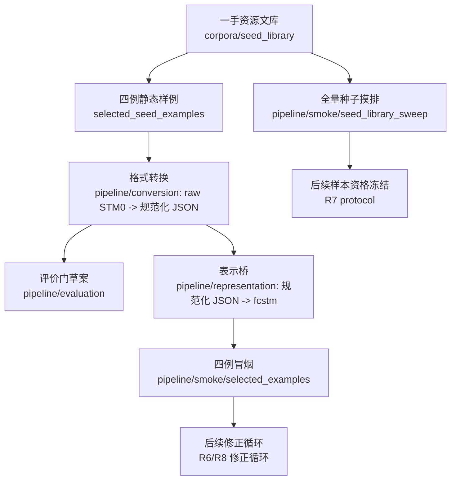

# 第一篇论文：反馈驱动状态机修正工作区

## 1. 一句话任务

本工作区承载第一篇论文的新主线：给定自然语言需求 `NL` 与初始状态机 `STM_0`，研究能否通过无人化、结构化反馈驱动的诊断、场景、修正、回归与接受 / 拒绝循环，得到相对更好的候选状态机 `STM_k`。

```text
输入：<NL, STM_0>
输出：<STM_k, 诊断台账, 场景台账, 修正台账, 接受/拒绝/回滚证据>
```

`NL -> STM_0` 只是种子来源、基线来源或相关工作背景；本文主贡献不再是一轮式 `NL -> STM` 生成。

## 2. 当前状态

当前已经完成到 **修正前准备度审计**：一手种子登记、四例静态样例、格式转换、`.fcstm` 表示桥、评价门草案和 R5 全量摸排均已就位；尚未执行真实修正循环、尚未生成 `STM_k`，也尚未形成 Better STM 主实验结果。

核心数字见 [STATUS.md](./STATUS.md)。当前最重要的机器事实源是：

- 一手种子主表：[corpora/seed_library/REGISTRY.md](./corpora/seed_library/REGISTRY.md)
- 阶段链路入口：[pipeline/README.md](./pipeline/README.md)
- 四例冒烟结果：[pipeline/smoke/selected_examples/smoke_report.json](./pipeline/smoke/selected_examples/smoke_report.json)
- 全量 seed sweep 结果：[pipeline/smoke/seed_library_sweep/sweep_report.json](./pipeline/smoke/seed_library_sweep/sweep_report.json)
- R5 后主实验 seed 方向分析：[pipeline/smoke/seed_library_sweep/llms_emp_main_seed_analysis.md](./pipeline/smoke/seed_library_sweep/llms_emp_main_seed_analysis.md)
- R5.5 `llms-emp` 主 seed 池深度画像：[pipeline/smoke/seed_library_sweep/llms_emp_deep_profile.md](./pipeline/smoke/seed_library_sweep/llms_emp_deep_profile.md)，其中 §1.1 是 10 个唯一 NL cluster 的完整结论表，§1.2 是 10 NL × 6 LLM 输出状态矩阵，§1.3 是行为特征矩阵。
- R5.5 向 R5.6 的边界交接：[pipeline/smoke/seed_library_sweep/llms_emp_r56_handoff.md](./pipeline/smoke/seed_library_sweep/llms_emp_r56_handoff.md)
- R5 交接：[pipeline/smoke/handoff/](./pipeline/smoke/handoff/)

## 3. 数据流



本图只是当前研究数据流，不是 PR 施工计划。GitHub PR / issue body 和 comment 仍是流程状态、review 状态和 merge 进度的事实源。

## 4. 目录地图

| 路径 | 职责 | 当前事实源 / 入口 | 不能声称 |
|---|---|---|---|
| [STATUS.md](./STATUS.md) | 当前研究总账 | 本文件汇总关键数字和下一步 | 不替代 JSON / registry 事实源 |
| [GUIDE.md](./GUIDE.md) | 全局纪律 | 边界、事实源优先级、禁止主张 | 不记录 PR 动态流程 |
| [pipeline/](./pipeline/) | R3–R5 真实阶段链路：conversion / evaluation / representation / smoke | [pipeline/README.md](./pipeline/README.md) | 不执行真实 repair loop，不产生 `STM_k` |
| [story/](./story/) | 论文定位、任务边界、术语和主张门 | [story/README.md](./story/README.md)、[story/claim_evidence_map.md](./story/claim_evidence_map.md) | 不写成最终正文 |
| [experiment_design/](./experiment_design/) | 研究问题、评价顺序、Better STM 定义 | [experiment_design/README.md](./experiment_design/README.md)、[experiment_design/better_stm_definition.md](./experiment_design/better_stm_definition.md) | 不替代正式主实验协议 |
| [corpora/](./corpora/) | 种子、修正近邻、纯 NL 数据源 | [corpora/README.md](./corpora/README.md) | 三类资产不能混表 |
| [selected_seed_examples/](./selected_seed_examples/) | 四个冒烟用静态 `<NL, STM_0>` 样例 | [selected_seed_examples/README.md](./selected_seed_examples/README.md) | 不是最终实验集合 |
| [evidence/](./evidence/) | R0/R1 历史审计材料 | [evidence/README.md](./evidence/README.md) | 不是当前横向事实源 |
| [archive/](./archive/) | 旧 ledger、旧检索和迁移快照 | [archive/r1_5_to_r1_7_seed_corpus_snapshot/](./archive/r1_5_to_r1_7_seed_corpus_snapshot/) | 不是当前事实真源 |

`conversion/`、`evaluation/`、`representation/`、`smoke/` 不再位于工作区根目录；它们已整体迁入 [pipeline/](./pipeline/)，根目录不保留 redirect 壳。

## 5. 推荐阅读路径

1. 想快速知道现在做到哪一步：读 [STATUS.md](./STATUS.md)。
2. 想理解阶段链路：读 [pipeline/README.md](./pipeline/README.md)。
3. 想理解论文问题和禁止主张：读 [story/README.md](./story/README.md) 与 [story/claim_evidence_map.md](./story/claim_evidence_map.md)。
4. 想看一手种子：读 [corpora/seed_library/REGISTRY.md](./corpora/seed_library/REGISTRY.md)。
5. 想看转换和表示链路：读 [pipeline/conversion/README.md](./pipeline/conversion/README.md) 与 [pipeline/representation/README.md](./pipeline/representation/README.md)。
6. 想看全量摸排：读 [pipeline/smoke/README.md](./pipeline/smoke/README.md)、[pipeline/smoke/seed_library_sweep/sweep_summary.md](./pipeline/smoke/seed_library_sweep/sweep_summary.md)、[pipeline/smoke/seed_library_sweep/llms_emp_main_seed_analysis.md](./pipeline/smoke/seed_library_sweep/llms_emp_main_seed_analysis.md) 与 [pipeline/smoke/seed_library_sweep/llms_emp_deep_profile.md](./pipeline/smoke/seed_library_sweep/llms_emp_deep_profile.md)；若只想远程快速看 10 个例子的指标，直接跳到 `llms_emp_deep_profile.md` 的 §1.1–§1.3。

## 6. 更新日志

| 时间 | 更新内容 |
|---|---|
| 2026-06-29 00:35:00 | R5.5 新增 [pipeline/smoke/seed_library_sweep/llms_emp_deep_profile.md](./pipeline/smoke/seed_library_sweep/llms_emp_deep_profile.md) 与 [pipeline/smoke/seed_library_sweep/llms_emp_r56_handoff.md](./pipeline/smoke/seed_library_sweep/llms_emp_r56_handoff.md)，把 `llms-emp-stm-subset` 收敛为 10 个 NL cluster × 6 个 LLM 输出的主 seed 池画像，并明确 T0/T0.5 主线 + Digital Camera supplementary stress。 |
| 2026-06-28 23:45:00 | 基于 R5 全量摸排新增 [pipeline/smoke/seed_library_sweep/llms_emp_main_seed_analysis.md](./pipeline/smoke/seed_library_sweep/llms_emp_main_seed_analysis.md)，明确 `llms-emp-stm-subset` 作为后续主实验优先 seed 池。 |
| 2026-06-28 22:20:00 | 将 `conversion/`、`evaluation/`、`representation/`、`smoke/` 整体迁入 [pipeline/](./pipeline/)，使 pipeline 成为真实阶段路径而非文档概念。 |
| 2026-06-28 20:10:00 | 简化顶层阅读结构：新增 [STATUS.md](./STATUS.md)，将数据流、目录地图和当前边界收敛到本 README；旧流程式阅读路径不再作为主入口。 |
| 2026-06-28 14:20:00 | 新增 R5 修正前准备度审计入口，落地选定四例冒烟、seed library sweep、archive / index / manifest、handoff 三件套与 CLI contract；R5 不执行修正循环、不调用 LLM、不计主实验结果。 |
| 2026-06-28 00:26:00 | [selected_seed_examples/](./selected_seed_examples/) 补齐四例 R4.5 `model.fcstm` 派生快照与 `fcstm_meta.json`，并明确该目录是 smoke 迷你文库，不是 seed registry 或最终实验集合。 |
| 2026-06-27 01:20:00 | PR-R4.5 新增表示桥工作区，落地规范化 STM JSON 到 `.fcstm` / pyfcstm inspect report 的 exporter、schema、loss ledger 与 pytest contract。 |
| 2026-06-26 12:35:00 | PR-R4 新增评价门工作区，落地 diagnostic / scenario / Better STM checklist / eligibility / human rubric schema、四例 dry-run 固化样例与 pytest contract。 |
| 2026-06-25 23:55:00 | PR-R3.1 新增 PlantUML 转换前规范化 / 恢复入口、source-level semantic preservation gate 与高基数制品归档。 |
| 2026-06-24 17:45:00 | PR-R3 新增开发 / 审计级转换器 v0，落地四例冒烟转换裁决、schema、toolchain survey、canonical report 与 loss ledger。 |
| 2026-06-12 23:42:20 | 初始化当前工作区，冻结 `<NL, STM_0> -> STM_k / Better STM` 主线、路径结构与后续阶段接口。 |
