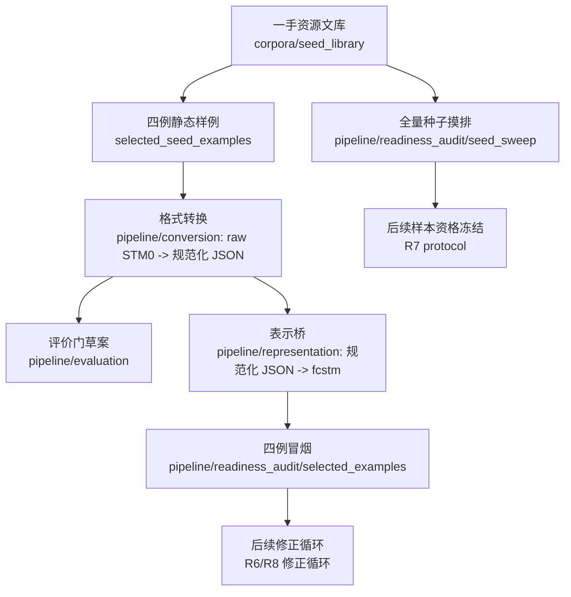

# 第一篇论文：反馈驱动状态机修正工作区

## 1. 一句话任务

本工作区承载第一篇论文的新主线：给定自然语言需求 `NL` 与初始状态机 `STM_0`，研究能否通过无人化、结构化反馈驱动的诊断、场景、修正、回归与接受 / 拒绝循环，得到相对更好的候选状态机 `STM_k`。

```text
输入：<NL, STM_0>
输出：<STM_k, 诊断台账, 场景台账, 修正台账, 接受/拒绝/回滚证据>
```

`NL -> STM_0` 只是种子来源、基线来源或相关工作背景；本文主贡献不再是一轮式 `NL -> STM` 生成。

## 2. 当前状态

当前已经完成到 **修正前准备度审计**：一手种子登记、四例静态样例、格式转换、`.fcstm` 表示桥、评价门草案和 R5 全量摸排均已就位；尚未执行真实修正循环、尚未生成 `STM_k`，也尚未形成 Better STM 主实验结果。

R5.7.1 已进一步冻结 **评价逻辑链与主张边界**：claim 类型、分母纪律、A 层准入、归因边界、客观指标位置、失败报告纪律和后续 R5.7.2--R5.7.5 接口见 [experiment_design/evaluation_logic.md](./experiment_design/evaluation_logic.md)。这仍属于修正实验前协议冻结，不代表真实 repair loop 已运行。

顶层轻量总账见 [SUMMARY.md](./SUMMARY.md)，核心数字见 [STATUS.md](./STATUS.md)。当前最重要的机器事实源是：

- 一手种子主表：[corpora/seed_library/REGISTRY.md](./corpora/seed_library/REGISTRY.md)
- 阶段链路入口：[pipeline/README.md](./pipeline/README.md)
- 四例冒烟结果：[pipeline/readiness_audit/selected_examples/smoke_report.json](./pipeline/readiness_audit/selected_examples/smoke_report.json)
- 全量 seed sweep 结果：[pipeline/readiness_audit/seed_sweep/sweep_report.json](./pipeline/readiness_audit/seed_sweep/sweep_report.json)
- Reports 文库入口：[reports/README.md](./reports/README.md)
- R5 后主实验 seed 方向分析：[reports/2026-06-28-19-42-58-r5-llms-emp-directional-analysis.md](./reports/2026-06-28-19-42-58-r5-llms-emp-directional-analysis.md)
- R5.5 `llms-emp` 主 seed 池深度画像：[reports/2026-06-29-00-03-56-llms-emp-main-seed-profile.md](./reports/2026-06-29-00-03-56-llms-emp-main-seed-profile.md)，其中 §1.1 是 10 个唯一 NL cluster 的完整结论表，§1.2 是 10 NL × 6 LLM 输出状态矩阵，§1.3 是行为特征矩阵。
- R5.5 向 R5.6 的边界交接：[reports/2026-06-28-22-54-39-model-scope-handoff.md](./reports/2026-06-28-22-54-39-model-scope-handoff.md)
- R5.7.1 评价逻辑链：[experiment_design/evaluation_logic.md](./experiment_design/evaluation_logic.md)；人类 handoff：[reports/2026-07-02-17-02-42-r5-7-1-evaluation-logic.md](./reports/2026-07-02-17-02-42-r5-7-1-evaluation-logic.md)
- R5 交接：[pipeline/readiness_audit/handoff/](./pipeline/readiness_audit/handoff/)

## 3. 数据流



本图只是当前研究数据流，不是 PR 施工计划。GitHub PR / issue body 和 comment 仍是流程状态、review 状态和 merge 进度的事实源。

## 4. 目录地图

| 路径 | 职责 | 当前事实源 / 入口 | 不能声称 |
|---|---|---|---|
| [SUMMARY.md](./SUMMARY.md) | 顶层轻量总账入口 | 统一 `README -> SUMMARY -> GUIDE` 导航；事实回到 STATUS / reports / pipeline | 不复制完整数字、不形成第二事实源 |
| [STATUS.md](./STATUS.md) | 当前研究状态总账 | 本文件汇总关键数字和下一步 | 不替代 JSON / registry 事实源 |
| [GUIDE.md](./GUIDE.md) | 全局纪律 | 边界、事实源优先级、禁止主张 | 不记录 PR 动态流程 |
| [pipeline/](./pipeline/) | R3–R5 真实阶段链路：conversion / evaluation / representation / readiness_audit | [pipeline/README.md](./pipeline/README.md) | 不执行真实 repair loop，不产生 `STM_k` |
| [reports/](./reports/) | R5/R5.5 human-facing report 文库 | [reports/README.md](./reports/README.md)、[reports/SUMMARY.md](./reports/SUMMARY.md)、[reports/GUIDE.md](./reports/GUIDE.md) | 不替代 pipeline JSON/JSONL/ZIP 机器事实源 |
| [story/](./story/) | 论文定位、任务边界、模型范围、术语和主张门 | [story/README.md](./story/README.md)、[story/paper_story.md](./story/paper_story.md)、[story/task_boundary.md](./story/task_boundary.md)、[story/model_scope.md](./story/model_scope.md)、[story/terminology_policy.md](./story/terminology_policy.md)、[story/claim_evidence_map.md](./story/claim_evidence_map.md) | 不写成最终正文，不替代 R7 eligibility |
| [experiment_design/](./experiment_design/) | 评价逻辑链、研究问题、评价顺序、Better STM 定义 | [experiment_design/README.md](./experiment_design/README.md)、[experiment_design/SUMMARY.md](./experiment_design/SUMMARY.md)、[experiment_design/GUIDE.md](./experiment_design/GUIDE.md)、[experiment_design/evaluation_logic.md](./experiment_design/evaluation_logic.md)、[experiment_design/quality_model/better_stm_definition.md](./experiment_design/quality_model/better_stm_definition.md) | 不替代正式主实验协议，不报告真实 repair 效果 |
| [corpora/](./corpora/) | 种子、修正近邻、纯 NL 数据源 | [corpora/README.md](./corpora/README.md) | 三类资产不能混表 |
| [selected_seed_examples/](./selected_seed_examples/) | 四个冒烟用静态 `<NL, STM_0>` 样例 | [selected_seed_examples/README.md](./selected_seed_examples/README.md) | 不是最终实验集合 |
| [evidence/](./evidence/) | R0/R1 历史审计材料 | [evidence/README.md](./evidence/README.md)、[evidence/SUMMARY.md](./evidence/SUMMARY.md)、[evidence/GUIDE.md](./evidence/GUIDE.md)；子入口：[ledgers](./evidence/ledgers/README.md)、[audits](./evidence/audits/README.md)、[matrices](./evidence/matrices/README.md)、[traces](./evidence/traces/README.md) | 不是当前横向事实源 |
| [archive/](./archive/) | cold / deprecated 历史快照 | [archive/README.md](./archive/README.md)、[archive/r1_5_to_r1_7_seed_corpus_snapshot/README.md](./archive/r1_5_to_r1_7_seed_corpus_snapshot/README.md) | 不是当前事实真源；只作 provenance / negative evidence 背景 |

`conversion/`、`evaluation/`、`representation/`、`smoke/` 不再位于工作区根目录；它们已整体迁入 [pipeline/](./pipeline/)，根目录不保留 redirect 壳。

## 5. 推荐阅读路径

1. 想按统一入口导航：先读 [SUMMARY.md](./SUMMARY.md)；想快速知道现在做到哪一步：读 [STATUS.md](./STATUS.md)。
2. 想理解阶段链路：读 [pipeline/README.md](./pipeline/README.md)。
3. 想理解论文问题、模型范围和禁止主张：读 [story/README.md](./story/README.md)，再按需读 [story/paper_story.md](./story/paper_story.md)、[story/task_boundary.md](./story/task_boundary.md)、[story/model_scope.md](./story/model_scope.md)、[story/terminology_policy.md](./story/terminology_policy.md) 与 [story/claim_evidence_map.md](./story/claim_evidence_map.md)。
4. 想看一手种子：读 [corpora/seed_library/REGISTRY.md](./corpora/seed_library/REGISTRY.md)。
5. 想看转换和表示链路：读 [pipeline/conversion/README.md](./pipeline/conversion/README.md) 与 [pipeline/representation/README.md](./pipeline/representation/README.md)。
6. 想看全量摸排与 R5.5 画像：读 [reports/README.md](./reports/README.md)；readiness 入口是 [reports/2026-06-28-04-03-18-seed-readiness-report.md](./reports/2026-06-28-04-03-18-seed-readiness-report.md)，主 seed profile 入口是 [reports/2026-06-29-00-03-56-llms-emp-main-seed-profile.md](./reports/2026-06-29-00-03-56-llms-emp-main-seed-profile.md)。
7. 想理解 R5.7.1 评价逻辑链、claim boundary、分母纪律和失败报告：读 [experiment_design/evaluation_logic.md](./experiment_design/evaluation_logic.md)。

## 6. 更新日志

| 时间 | 更新内容 |
|---|---|
| 2026-07-02 17:02:42 | R5.7.1 新增 [experiment_design/evaluation_logic.md](./experiment_design/evaluation_logic.md) 与 [reports/2026-07-02-17-02-42-r5-7-1-evaluation-logic.md](./reports/2026-07-02-17-02-42-r5-7-1-evaluation-logic.md)，冻结评价逻辑链与 claim boundary；不代表真实 repair loop 已运行。 |
| 2026-06-30 14:46:44 | R5.6 新增并补强 [story/model_scope.md](./story/model_scope.md) 与 [experiment_design/scope/r5_6_to_r5_7_handoff_constraints.md](./experiment_design/scope/r5_6_to_r5_7_handoff_constraints.md)，冻结 paper story 的模型范围、claim boundary、状态机抽象定义和 R5.7 交接约束；不代表真实 repair loop 已运行。 |
| 2026-06-29 15:43:00 | 新增 [SUMMARY.md](./SUMMARY.md) 作为顶层轻量总账入口，明确 [STATUS.md](./STATUS.md) 仍是当前状态与关键数字事实源。 |
| 2026-06-29 03:25:00 | R5.5.1 加固 evidence 子路径 README、archive cold/deprecated 可追溯归档和 story 专题入口。 |
| 2026-06-29 01:48:34 | 新增 [reports/](./reports/) 文库并迁移 R5/R5.5 human-facing reports；旧 pipeline Markdown 仅保留 redirect notice，避免第二事实源。 |
| 2026-06-29 00:35:00 | R5.5 新增 [reports/2026-06-29-00-03-56-llms-emp-main-seed-profile.md](./reports/2026-06-29-00-03-56-llms-emp-main-seed-profile.md) 与 [reports/2026-06-28-22-54-39-model-scope-handoff.md](./reports/2026-06-28-22-54-39-model-scope-handoff.md)，把 `llms-emp-stm-subset` 收敛为 10 个 NL cluster × 6 个 LLM 输出的主 seed 池画像，并明确 T0 主线 + T0.5 timer-like caveat + Digital Camera supplementary stress。 |
| 2026-06-28 23:45:00 | 基于 R5 全量摸排新增 [reports/2026-06-28-19-42-58-r5-llms-emp-directional-analysis.md](./reports/2026-06-28-19-42-58-r5-llms-emp-directional-analysis.md)，明确 `llms-emp-stm-subset` 作为后续主实验优先 seed 池。 |
| 2026-06-28 22:20:00 | 将 `conversion/`、`evaluation/`、`representation/`、`smoke/` 整体迁入 [pipeline/](./pipeline/)，使 pipeline 成为真实阶段路径而非文档概念。 |
| 2026-06-28 20:10:00 | 简化顶层阅读结构：新增 [STATUS.md](./STATUS.md)，将数据流、目录地图和当前边界收敛到本 README；旧流程式阅读路径不再作为主入口。 |
| 2026-06-28 14:20:00 | 新增 R5 修正前准备度审计入口，落地选定四例冒烟、seed library sweep、archive / index / manifest、handoff 三件套与 CLI contract；R5 不执行修正循环、不调用 LLM、不计主实验结果。 |
| 2026-06-28 00:26:00 | [selected_seed_examples/](./selected_seed_examples/) 补齐四例 R4.5 `model.fcstm` 派生快照与 `fcstm_meta.json`，并明确该目录是 smoke 迷你文库，不是 seed registry 或最终实验集合。 |
| 2026-06-27 01:20:00 | PR-R4.5 新增表示桥工作区，落地规范化 STM JSON 到 `.fcstm` / pyfcstm inspect report 的 exporter、schema、loss ledger 与 pytest contract。 |
| 2026-06-26 12:35:00 | PR-R4 新增评价门工作区，落地 diagnostic / scenario / Better STM checklist / eligibility / human rubric schema、四例 dry-run 固化样例与 pytest contract。 |
| 2026-06-25 23:55:00 | PR-R3.1 新增 PlantUML 转换前规范化 / 恢复入口、source-level semantic preservation gate 与高基数制品归档。 |
| 2026-06-24 17:45:00 | PR-R3 新增开发 / 审计级转换器 v0，落地四例冒烟转换裁决、schema、toolchain survey、canonical report 与 loss ledger。 |
| 2026-06-12 23:42:20 | 初始化当前工作区，冻结 `<NL, STM_0> -> STM_k / Better STM` 主线、路径结构与后续阶段接口。 |
