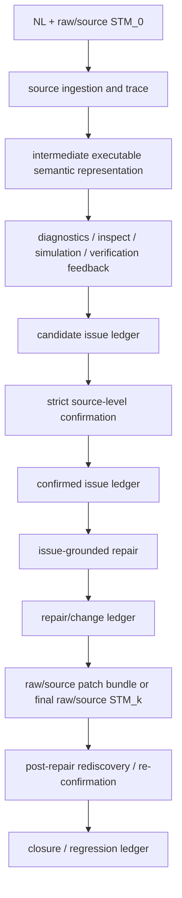

# 第一篇论文：source-level 行为问题发现与闭合工作区

## 1. 一句话任务

本工作区承载 paper1 当前主线：给定自然语言需求 `NL` 与已有 raw/source 状态机 `STM_0`，研究如何借助中间语义执行表示和工具 / agent 反馈，发现 source-level behavioral issues，确认问题、围绕 confirmed issues 修复，并回到 raw/source 层审计 issue 是否闭合以及是否引入 regression。

```text
输入：<NL, raw/source STM_0>
中间：<intermediate executable semantic representation, diagnostics, simulation/probe, verification/check feedback>
输出：<candidate issue ledger, confirmed issue ledger, repair/change ledger, raw/source patch bundle or final raw/source STM_k, closure/regression ledger>
```

`NL -> STM` 一轮式生成不是本文主贡献；`fcstm` / `pyfcstm` 只是中间语义执行表示与可执行反馈介质，不是 paper1 的建模语言贡献。conversion / normalization / lowering 只属于输入准备和表示桥，不能计为 method gain。issue / repair / closure / regression ledger 是评价和可复现证据链，不是 headline contribution。

## 2. Contribution 口径

paper1 的贡献必须回到 2026-07-07 导师讨论确认的主线：**loop + simulation / formal-verification feedback**。

当前可写成贡献的内容：

1. 面向已有 `NL + raw/source STM_0` 的 feedback-driven LLM refinement loop：发现、确认、修复并闭合 source-level behavioral issues。
2. 将 diagnostics / inspect、simulation / probe、formal verification / check feedback 接入 agent loop 的 executable-feedback integration。
3. 修复结果回到 raw/source 层表达，并围绕 issue discovery / closure / regression 与 direct raw/source LLM baseline 设计后续实验。

当前只能写成方法或评价纪律、不能写成主贡献的内容：

- attribution boundary；
- issue / repair / closure / regression ledgers；
- closure / regression audit；
- run record / evidence bookkeeping；
- pilot 后冻结 metrics / baseline / judge prompt 的规则。

## 3. 当前状态

截至 2026-07-07，paper1 已完成战略转向后的资产清账：导师讨论记录已落库，资产地图已把现有材料标为 `active / update / archive / historical`。当前 active 主线已经从旧的 **Better STM / which STM is better** 框架切换为 **source-level behavioral issue discovery and closure**。

当前已经具备的长期资产：

- 战略来源：[../talks/2026-07-07-导师-paper1发现修正与BetterSTM归档.md](../talks/2026-07-07-导师-paper1发现修正与BetterSTM归档.md)
- 资产清账：[evidence/ledgers/paper1_strategy_asset_map.md](./evidence/ledgers/paper1_strategy_asset_map.md)
- 扫描审计：[evidence/audits/2026-07-07-post-strategy-asset-scan.md](./evidence/audits/2026-07-07-post-strategy-asset-scan.md)
- 种子与来源入口：[corpora/](./corpora/)
- 转换与表示基础设施入口：[pipeline/](./pipeline/)
- 历史 reports 入口：[reports/](./reports/)
- 当前 story 入口：[story/](./story/)
- source-level issue lifecycle 合同：[experiment_design/issue_lifecycle/](./experiment_design/issue_lifecycle/)
- issue ledger machine schema / fixtures / tests：[pipeline/evaluation/](./pipeline/evaluation/)
- source trace 合同入口：[experiment_design/source_trace/](./experiment_design/source_trace/)
- source trace machine schema / fixtures / tests：[pipeline/evaluation/](./pipeline/evaluation/)

当前尚未完成的事实：

1. 已定义最小 source issue ledger v0：见 [experiment_design/issue_lifecycle/](./experiment_design/issue_lifecycle/) 与 [pipeline/evaluation/schemas/source_issue_ledger.schema.json](./pipeline/evaluation/schemas/source_issue_ledger.schema.json)；但尚未接入真实 discovery / repair loop。
2. 已定义 raw/source 到中间表示的最小 source trace v0；但尚未接入真实 loop、repair/change ledger 或 raw/source patch export。
3. 尚未冻结 paper1 loop 的 stage IO / run record 合同。
4. 尚未实现 discovery / confirmation、issue-grounded repair、raw/source export、closure/regression audit。
5. 尚未运行 pilot；因此尚未冻结 final evaluation rubric、baseline contract 或正式实验协议。
6. 尚未执行真实 repair loop；archived constructed `STM_k` dry-run 不能作为 method effectiveness evidence。

## 4. 方法数据流



这张图描述长期方法链路，不是当前 PR 施工状态。动态施工状态仍以 GitHub PR / issue body 和 comment 为准。

## 5. 目录地图

| 路径 | 当前职责 | 必须避免的误读 |
|---|---|---|
| [SUMMARY.md](./SUMMARY.md) | 顶层轻量总账和阅读入口。 | 不复制完整机器事实，不替代 [STATUS.md](./STATUS.md)。 |
| [STATUS.md](./STATUS.md) | 当前研究状态、已完成 / 未完成事实和下一步依赖。 | 不把准备度、旧 dry-run 或 planned work 写成方法效果。 |
| [GUIDE.md](./GUIDE.md) | 后续 agent 工作纪律：事实源、术语、scope、验收。 | 不记录 PR 动态流程，不复活 Better STM active headline。 |
| [story/](./story/) | paper story、任务边界、模型范围、术语和 claim-evidence。 | 不写成最终论文正文，不提前冻结 metrics / baseline。 |
| [evidence/](./evidence/) | 战略清账、审计、ledger、trace 等证据入口。 | 不把 historical / archive 资产当 active claim evidence。 |
| [pipeline/](./pipeline/) | conversion / evaluation / representation / readiness 等基础设施。 | 不把 conversion / lowering 算成 repair gain。 |
| [corpora/](./corpora/) | seed、NL 数据和 baseline candidate 来源。 | 不在 story reset 阶段冻结正式样本分母或 baseline 合同。 |
| [experiment_design/](./experiment_design/) | source-level issue lifecycle 的实验设计 scaffold。 | 旧 R5.7 / Better STM-facing 文件已迁入 [archive/r5_7_better_stm_snapshot/](./archive/r5_7_better_stm_snapshot/)，不得作为 active protocol。 |
| [reports/](./reports/) | 历史 handoff / report 文库。 | R5.7 reports 不证明真实 repair-loop effectiveness。 |
| [archive/](./archive/) | 历史快照入口。 | archive 不是 active method source。 |

## 6. 推荐阅读路径

1. 想快速理解 paper1 当前做什么：读本文件，然后读 [SUMMARY.md](./SUMMARY.md)、[STATUS.md](./STATUS.md)、[GUIDE.md](./GUIDE.md)。
2. 想理解战略转向来源：读 [../talks/2026-07-07-导师-paper1发现修正与BetterSTM归档.md](../talks/2026-07-07-导师-paper1发现修正与BetterSTM归档.md) 和 [evidence/ledgers/paper1_strategy_asset_map.md](./evidence/ledgers/paper1_strategy_asset_map.md)。
3. 想写或审 paper story：读 [story/README.md](./story/README.md)，再读 [story/paper_story.md](./story/paper_story.md)、[story/task_boundary.md](./story/task_boundary.md)、[story/model_scope.md](./story/model_scope.md)、[story/terminology_policy.md](./story/terminology_policy.md)、[story/claim_evidence_map.md](./story/claim_evidence_map.md) 与 [story/paper_outline.md](./story/paper_outline.md)。
4. 想接后续实现：先读 [experiment_design/issue_lifecycle/](./experiment_design/issue_lifecycle/)、[experiment_design/source_trace/](./experiment_design/source_trace/) 与 [pipeline/evaluation/README.md](./pipeline/evaluation/README.md)，再根据伞 PR 进入后续 `PR-loop-io` / `PR-discover-confirm`。
5. 想引用旧 R5.7 资产：必须从 [archive/r5_7_better_stm_snapshot/](./archive/r5_7_better_stm_snapshot/) 进入，并写成 historical / superseded / calibration-only；不得把 Better STM / constructed `STM_k` adjudication 写成 active method result。

## 7. 更新日志

| 时间 | 更新内容 |
|---|---|
| 2026-07-08 14:03:59 | `PR-source-trace` 定义 source trace v0，新增 source_trace 文档入口、machine schema / fixtures / tests，并明确 negative trace 不得进入 source-level closure 主证据。 |
| 2026-07-08 10:15:00 | `PR-issue-ledger` 定义 source issue ledger v0，新增 issue lifecycle 入口、machine schema / fixture / tests 指针，并保留“未接入真实 loop”的限制。 |
| 2026-07-07 23:40:00 | `PR-better-archive` 后同步根入口：experiment_design 改为 active scaffold，R5.7 资产改指 cold archive。 |
| 2026-07-07 22:10:00 | 按导师原话修正 contribution 口径：主贡献是 feedback-driven loop + simulation / formal-verification feedback integration；ledger / audit / evidence bookkeeping 降级为方法和评价纪律。 |
| 2026-07-07 21:20:00 | 重置 paper1 active story 入口：从 Better STM / which STM is better 框架切换到 source-level behavioral issue discovery and closure；明确 `fcstm` 只是中间语义执行介质，R5.7 Better STM-facing 资产已迁入 cold archive。 |
| 2026-07-07 20:44:08 | `PR-asset-map` 完成资产清账，明确 root/story 需更新、R5.7 Better STM-facing 资产需归档、conversion / representation / runtime 只能作 infrastructure。 |
| 2026-07-07 17:55:50 | 导师战略讨论落库，确认 paper1 contribution 是 feedback-driven issue discovery / repair / closure loop，而非状态机表达语言本身。 |
