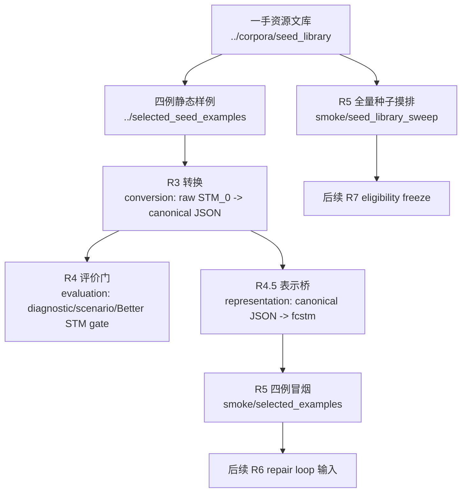

# pipeline 阶段链路入口

本目录是第一篇论文 `paper_stm_repair` 的真实阶段链路路径。R3–R5 已经不再散落在工作区根目录下，而是统一进入 `pipeline/`，方便后续从输入准备、格式转换、评价门、内部表示到修正前摸排形成一条可审计流水线。

## 1. 当前边界

当前 pipeline 只完成 **修正前准备度审计**：它把一手 `<NL, STM_0>` 种子和四例 smoke 输入推进到可检查的中间表示、评价门草案与全量摸排报告；它不执行真实 repair / fix loop，不生成 `STM_k`，不调用真实 LLM，也不读取 `.env`。

所有 conversion、normalization、representation lowering 带来的可解析性改善，都必须作为 pipeline 准备度收益单独归因，不能计入后续修正循环收益或 Better STM 结果。

## 2. 阶段地图

| 阶段 | 路径 | 输入 | 输出 | 当前作用 |
|---|---|---|---|---|
| R3 转换 | [conversion/](./conversion/) | `selected_seed_examples/*/stm0.*` 与 seed registry 中的一手原始 STM | 规范化 STM JSON、conversion report、loss ledger、PlantUML recovery audit | 把 PlantUML / Umple 等作者生成 STM_0 转成可供后续消费的 canonical JSON；不证明模型已修好。 |
| R4 评价门 | [evaluation/](./evaluation/) | R3 canonical JSON、四例 `<NL, STM_0>` | diagnostic / scenario / eligibility / Better STM checklist schema 与四例 dry-run | 冻结后续 repair loop 的评价字段和禁止主张，尚不评估真实 `STM_k`。 |
| R4.5 表示桥 | [representation/](./representation/) | R3 canonical JSON | `.fcstm`、name mapping、lowering inventory、parse/inspect report | 将 canonical JSON 降到 pyfcstm 可机检表示；loss 必须入账。 |
| R5 冒烟与摸排 | [smoke/](./smoke/) | 四例静态样例、seed library registry、R3/R4/R4.5 制品 | 四例 smoke report、seed sweep report、handoff JSON、R5.5 `llms-emp` 深度画像 | 复验当前数据池中哪些样本可进入后续 R6/R7/R8，并把主 seed 池按 10 NL cluster × 6 LLM 输出画像；仍不执行修正循环。 |

## 3. 数据流



本图是研究制品链路，不是 GitHub PR 进度表。PR 施工状态、review 状态和 merge 状态仍以 GitHub PR body/comment 为准。

## 4. 事实源优先级

| 问题 | 事实源 |
|---|---|
| 原始 STM 到 canonical JSON 的状态 | [conversion/reports/selected_seed_examples_conversion_report.json](./conversion/reports/selected_seed_examples_conversion_report.json)、[conversion/reports/plantuml_recovery_report.json](./conversion/reports/plantuml_recovery_report.json) |
| 评价门与 dry-run | [evaluation/EVALUATION_GATE.md](./evaluation/EVALUATION_GATE.md)、[evaluation/reports/dry_run_summary.md](./evaluation/reports/dry_run_summary.md) |
| canonical 到 `.fcstm` | [representation/reports/fcstm_export_report.json](./representation/reports/fcstm_export_report.json) |
| 四例 smoke | [smoke/selected_examples/smoke_report.json](./smoke/selected_examples/smoke_report.json) |
| seed library 全量摸排 | [smoke/seed_library_sweep/sweep_report.json](./smoke/seed_library_sweep/sweep_report.json)、[smoke/seed_library_sweep/records_index.json](./smoke/seed_library_sweep/records_index.json) |
| `llms-emp` 主 seed 池深度画像 | [smoke/seed_library_sweep/llms_emp_case_matrix.jsonl](./smoke/seed_library_sweep/llms_emp_case_matrix.jsonl)、[smoke/seed_library_sweep/llms_emp_cluster_profiles.jsonl](./smoke/seed_library_sweep/llms_emp_cluster_profiles.jsonl)、[smoke/seed_library_sweep/llms_emp_deep_profile.md](./smoke/seed_library_sweep/llms_emp_deep_profile.md)、[smoke/seed_library_sweep/llms_emp_r56_handoff.md](./smoke/seed_library_sweep/llms_emp_r56_handoff.md) |
| 后续阶段交接 | [smoke/handoff/](./smoke/handoff/) |

Markdown summary 只做人类阅读入口；统计、资格判断和路径证据应能回到 JSON / ledger / registry 复算。

## 5. 与根目录其他文库的关系

- [../corpora/](../corpora/)：一手 seed、修正基线近邻、纯 NL 数据源；pipeline 只能消费其已登记事实，不在此处维护来源总账。
- [../selected_seed_examples/](../selected_seed_examples/)：四例 smoke 用静态输入和 `.fcstm` 便利快照；不是最终实验集合。
- [../experiment_design/](../experiment_design/)：Better STM 定义、研究问题和正式协议入口；pipeline 当前只实现准备度和字段链路。
- [../story/](../story/)：论文叙事、任务边界和 claim/evidence map；不能把 pipeline 准备度写成修正效果。

## 6. 复验命令

```bash
PYTHONPATH=project_1_llm_state_machine_modeling/paper_stm_repair/pipeline/smoke/src:project_1_llm_state_machine_modeling/paper_stm_repair/pipeline/representation/src:project_1_llm_state_machine_modeling/paper_stm_repair/pipeline/conversion/src \
python -m pytest project_1_llm_state_machine_modeling/paper_stm_repair/pipeline/smoke/tests

PYTHONPATH=project_1_llm_state_machine_modeling/paper_stm_repair/pipeline/smoke/src \
python -m paper_stm_repair_smoke.cli run-llms-emp-profile

PYTHONPATH=project_1_llm_state_machine_modeling/paper_stm_repair/pipeline/smoke/src \
python -m paper_stm_repair_smoke.cli validate

PYTHONPATH=project_1_llm_state_machine_modeling/paper_stm_repair/pipeline/smoke/src:project_1_llm_state_machine_modeling/paper_stm_repair/pipeline/representation/src:project_1_llm_state_machine_modeling/paper_stm_repair/pipeline/conversion/src \
python -m pytest \
  project_1_llm_state_machine_modeling/paper_stm_repair/pipeline/conversion/tests \
  project_1_llm_state_machine_modeling/paper_stm_repair/pipeline/evaluation/tests \
  project_1_llm_state_machine_modeling/paper_stm_repair/pipeline/representation/tests
```
