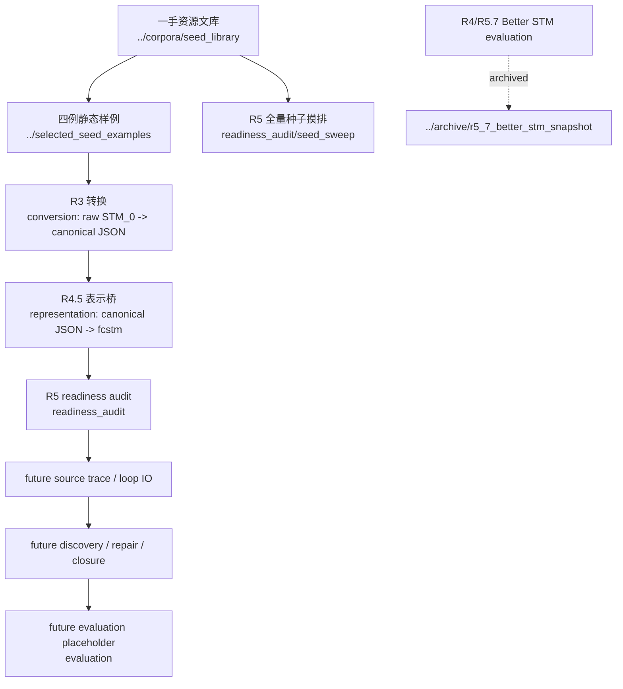

# pipeline 阶段链路入口

本目录是第一篇论文 `paper_stm_repair` 的阶段链路路径，用于保存 conversion、intermediate representation、readiness audit 以及后续 loop I/O / source trace / evaluation placeholder 等机器制品。当前 active pipeline 不执行真实 repair / fix loop，不生成真实 `STM_k`，不调用真实 LLM，也不读取 `.env`。

所有 conversion、normalization、representation lowering 带来的可解析性改善，都必须作为 pipeline 准备度收益单独归因，不能计入后续修正循环收益或 source-level issue closure。

R4/R5.7 的 Better STM evaluation gate 已整体迁入 cold archive：[../archive/r5_7_better_stm_snapshot/pipeline/evaluation/](../archive/r5_7_better_stm_snapshot/pipeline/evaluation/)。当前 [evaluation/](./evaluation/) 只保留 placeholder，等待后续 source-level closure / regression rubric 重建。

## 1. 阶段地图

| 阶段 | 路径 | 输入 | 输出 | 当前作用 |
|---|---|---|---|---|
| R3 转换 | [conversion/](./conversion/) | `selected_seed_examples/*/stm0.*` 与 seed registry 中的一手原始 STM | 规范化 STM JSON、conversion report、loss ledger、PlantUML recovery audit | 把 PlantUML / Umple 等作者生成 `STM_0` 转成可供后续消费的 canonical JSON；不证明模型已修好。 |
| R4 historical evaluation | [../archive/r5_7_better_stm_snapshot/pipeline/evaluation/](../archive/r5_7_better_stm_snapshot/pipeline/evaluation/) | R3 canonical JSON、四例 `<NL, STM_0>` | archived diagnostic / scenario / eligibility / Better STM checklist schema 与 dry-run | cold archive；不作为 active evaluation gate。 |
| R4.5 表示桥 | [representation/](./representation/) | R3 canonical JSON | `.fcstm`、name mapping、lowering inventory、parse/inspect report | 将 canonical JSON 降到 pyfcstm 可机检表示；loss 必须入账，`fcstm` 只是 intermediate executable semantic medium。 |
| R5 冒烟与摸排 | [readiness_audit/](./readiness_audit/) | 四例静态样例、seed library registry、R3/R4/R4.5 制品 | 四例冒烟 report、seed sweep report、handoff JSON、R5.5 `llms-emp` 深度画像 | 复验当前数据池中哪些样本可进入后续 pilot；仍不执行修正循环。 |
| future evaluation | [evaluation/](./evaluation/) | confirmed issues、repair/change ledger、fresh canonical source artifact、semantic change/correspondence ledger、closure / regression evidence | future source-level closure / regression schema | placeholder；不得继承 archived Better STM gate。 |

## 2. 数据流



本图是研究制品链路，不是 GitHub PR 进度表。PR 施工状态、review 状态和 merge 状态仍以 GitHub PR body/comment 为准。

## 3. 当前事实源优先级

| 问题 | 事实源 |
|---|---|
| 原始 STM 到 canonical JSON 的状态 | [conversion/reports/selected_seed_examples_conversion_report.json](./conversion/reports/selected_seed_examples_conversion_report.json)、[conversion/reports/plantuml_recovery_report.json](./conversion/reports/plantuml_recovery_report.json) |
| canonical 到 `.fcstm` | [representation/reports/fcstm_export_report.json](./representation/reports/fcstm_export_report.json) |
| 四例 smoke / readiness | [readiness_audit/selected_examples/smoke_report.json](./readiness_audit/selected_examples/smoke_report.json) |
| seed library 全量摸排 | [readiness_audit/seed_sweep/sweep_report.json](./readiness_audit/seed_sweep/sweep_report.json)、[readiness_audit/seed_sweep/records_index.json](./readiness_audit/seed_sweep/records_index.json) |
| `llms-emp` 主 seed 池深度画像 | 机器事实源：[readiness_audit/llms_emp_profile/llms_emp_case_matrix.jsonl](./readiness_audit/llms_emp_profile/llms_emp_case_matrix.jsonl)、[readiness_audit/llms_emp_profile/llms_emp_cluster_profiles.jsonl](./readiness_audit/llms_emp_profile/llms_emp_cluster_profiles.jsonl)；人类阅读入口：[../reports/2026-06-29-00-03-56-llms-emp-main-seed-profile.md](../reports/2026-06-29-00-03-56-llms-emp-main-seed-profile.md)。 |
| archived Better STM evaluation | [../archive/r5_7_better_stm_snapshot/pipeline/evaluation/](../archive/r5_7_better_stm_snapshot/pipeline/evaluation/) |
| future active evaluation | [evaluation/README.md](./evaluation/README.md) placeholder；正式 schema 待后续 PR。 |

Markdown summary 只做人类阅读入口；统计、资格判断和路径证据应能回到 JSON / ledger / registry 复算。

## 4. 与根目录其他文库的关系

- [../corpora/](../corpora/)：一手 seed、修正基线近邻、纯 NL 数据源；pipeline 只能消费其已登记事实。
- [../selected_seed_examples/](../selected_seed_examples/)：四例冒烟用静态输入和 `.fcstm` 便利快照；不是最终实验集合。
- [../experiment_design/](../experiment_design/)：future source-level issue lifecycle 的实验设计入口；不再承载 active Better STM framework。
- [../story/](../story/)：论文叙事、任务边界和 claim/evidence map；不能把 pipeline 准备度写成修正效果。
- [../archive/](../archive/)：superseded historical snapshots；不是 active truth。

## 5. 复验命令

```bash
PYTHONPATH=project_1_llm_state_machine_modeling/paper_stm_repair/pipeline/readiness_audit/src:project_1_llm_state_machine_modeling/paper_stm_repair/pipeline/representation/src:project_1_llm_state_machine_modeling/paper_stm_repair/pipeline/conversion/src python -m pytest   project_1_llm_state_machine_modeling/paper_stm_repair/pipeline/conversion/tests   project_1_llm_state_machine_modeling/paper_stm_repair/pipeline/representation/tests   project_1_llm_state_machine_modeling/paper_stm_repair/pipeline/readiness_audit/tests
```

## 6. 更新日志

| 时间 | 更新内容 |
|---|---|
| 2026-07-07 23:40:00 | `PR-better-archive` 后将 R4/R5.7 evaluation gate 改为 archive pointer，并保留 active evaluation placeholder。 |
