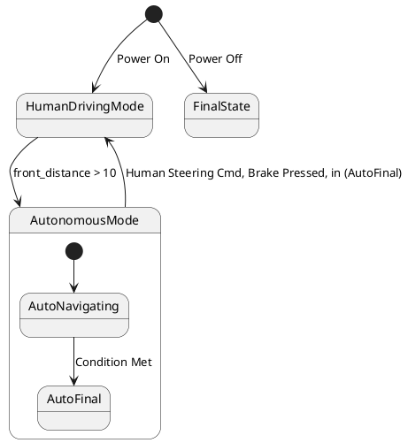

# Pair `0000`：NL + PlantUML STM0 + FCSTM STM0

[返回 60 组索引](../../PAIR_INDEX.md) | [下一组 `0001`](../0001/README.md)

- LLM：`GPT-4o`
- 模型/场景：high-level driving module
- 作者输出阶段：`Result with Semantic Checking`
- 作者输出单元格：`AE2`；Excel row：`2`
- Phase-I fallback：`false`
- 相对 Phase-I 是否变化：`true`
- Phase-I PlantUML SHA-256：`8fd2f71b338836488e2e29fe19c4e58c4992d4186367f43efc121fae6c36db7f`
- NL SHA-256：`f1c3dc88371b8256352e7ab6ee7eb42424de6e11dfde70d185f224dd1d05a7a8`
- PlantUML SHA-256：`4fe07b05bdcfaac1c961d1176fb099d8240818160caa6edfb57928c6be2efc8a`
- FCSTM SHA-256：`87acd20f3d0a1e1cf5a69fc11b198644d126fa8b56d80ad355fd6949c12cc0e2`
- 结构裁决：`structure_preserved`
- source states / transitions：`5` / `6`
- mapped / blocked / silent drop：`6` / `0` / `0`
- final / lifecycle / body coverage：`0/0` / `0/0` / `0/0`
- concurrent region / separator coverage：`0/0` / `0/0`
- source normalization coverage：`0/0`
- official raw / validation：`state_diagram` / `state_diagram`
- official identity states / transitions：`5` / `6`
- official identity remaps：state `0` / transition endpoint `0`
- AST audit：`passed`
- FCSTM execution eligible：`false`
- Discover eligible：`false`
- 主 session 对读：完整对读：两个带事件的 root initial edge 分别转成 wait state，HumanDrivingMode 空 composite 以 UnspecifiedInitial 留债，AutonomousMode 内部 initial/AutoFinal 与全部 6 条边均保留；未把多 initial 冒充确定执行语义。
- 三个原始文件：[NL](./nl.txt) | [PlantUML](./plantuml.puml) | [FCSTM](./fcstm.fcstm)
- 审计入口：[canonical](../../canonical/llms_emp_feedback_final_0000.json) | [冻结 FCSTM](../../fcstm/llms_emp_feedback_final_0000.fcstm) | [case report](../../case_reports/llms_emp_feedback_final_0000.json) | [人工总账](../../MANUAL_REVIEW.md)

## 作者阶段 lineage

| stage | output cell | present | output SHA-256 | feedback | resolved |
|---|---|---|---|---|---|
| `phase_i_generation` | `I2` | `true` | `8fd2f71b338836488e2e29fe19c4e58c4992d4186367f43efc121fae6c36db7f` | - | - |
| `phase_ii_format` | `U2` | `false` | `-` | - | - |
| `phase_ii_grammar` | `Z2` | `true` | `4fe07b05bdcfaac1c961d1176fb099d8240818160caa6edfb57928c6be2efc8a` | transition does not connect two state | 1.0 |
| `phase_ii_semantic` | `AE2` | `true` | `4fe07b05bdcfaac1c961d1176fb099d8240818160caa6edfb57928c6be2efc8a` | None | 1.0 |

## Official identity ledger

- status：`aligned`
- canonical / official states：`5` / `5`
- aligned transition endpoints：`6`

本组 state identity 无需重映射。

本组 transition endpoint 无需重映射。

## Source normalization ledger

本组没有 source-input normalization。

## Concurrent region ledger

本组没有 PlantUML orthogonal/concurrent region separator。

## Operational debt

| reason code | count |
|---|---:|
| `R45.DEBT.missing_explicit_initial` | 1 |
| `R45.DEBT.multiple_initial_fanout` | 1 |
| `R45.DEBT.opaque_transition_label_semantics` | 5 |

## NL

```text
1 The human driving mode is represented by a simple state. 2 The autonomous mode has sub-states and is represented by a sub machine state. 3. when power on, the system turn into human driving mode 4when front_distance > 10, auto transport to autonomous state 4. transit to human driving mode when receive human steering cmd, brake pressed, in (auto final) 5 when power off, it will transit to final state
```

## 作者 Phase-II 最终 PlantUML STM0



## 转换后 FCSTM STM0

```fcstm
state llms_emp_feedback_final_0000 named "llms_emp_feedback_final_0000" {
    event Power_On named "Power On";
    event Condition_Met named "Condition Met";
    event front_distance_10 named "front_distance > 10";
    event Human_Steering_Cmd_Brake_Pressed_in_AutoFinal named "Human Steering Cmd, Brake Pressed, in (AutoFinal)";
    event Power_Off named "Power Off";
    state InitialWaittr_0001 named "Awaiting initial event: Power On";
    state InitialWaittr_0006 named "Awaiting initial event: Power Off";
    state HumanDrivingMode named "HumanDrivingMode" {
        state UnspecifiedInitial named "Unspecified initial";
        [*] -> UnspecifiedInitial;
    }
    state AutonomousMode named "AutonomousMode" {
        state AutoNavigating named "AutoNavigating";
        state AutoFinal named "AutoFinal";
        [*] -> AutoNavigating;
        AutoNavigating -> AutoFinal : /Condition_Met;
    }
    state FinalState named "FinalState";
    [*] -> InitialWaittr_0001;
    InitialWaittr_0001 -> HumanDrivingMode : /Power_On;
    !HumanDrivingMode -> AutonomousMode : /front_distance_10;
    !AutonomousMode -> HumanDrivingMode : /Human_Steering_Cmd_Brake_Pressed_in_AutoFinal;
    [*] -> InitialWaittr_0006;
    InitialWaittr_0006 -> FinalState : /Power_Off;
}
```

[返回 60 组索引](../../PAIR_INDEX.md) | [下一组 `0001`](../0001/README.md)
