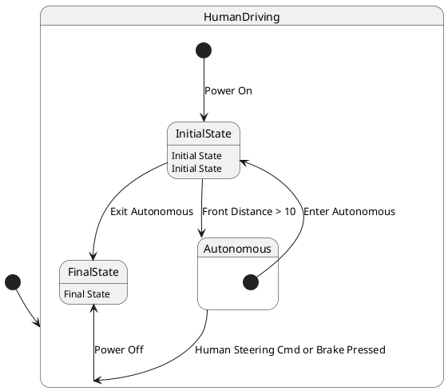

# Pair `0000`：NL + PlantUML STM0 + FCSTM STM0

[返回 60 组索引](../../PAIR_INDEX.md) | [下一组 `0001`](../0001/README.md)

- LLM：`GPT-4o`
- 模型/场景：high-level driving module
- NL SHA-256：`f1c3dc88371b8256352e7ab6ee7eb42424de6e11dfde70d185f224dd1d05a7a8`
- PlantUML SHA-256：`8fd2f71b338836488e2e29fe19c4e58c4992d4186367f43efc121fae6c36db7f`
- FCSTM SHA-256：`8cba7067504a8f3f46773e9d9c39bb1a704a801526b30af53b40f9ac9d823890`
- 结构裁决：`structure_preserved`
- FCSTM execution eligible：`false`
- Discover eligible：`false`
- 主 session 对读：root `HumanDriving/Autonomous` 与两个 scoped `InitialState` 分离；7 条 macro、event initial wait、跨层 exit/continuation 和 body 均齐。
- 三个原始文件：[NL](./nl.txt) | [PlantUML](./plantuml.puml) | [FCSTM](./fcstm.fcstm)
- 审计入口：[canonical](../../canonical/llms_emp_stm_results_0000.json) | [冻结 FCSTM](../../fcstm/llms_emp_stm_results_0000.fcstm) | [case report](../../case_reports/llms_emp_stm_results_0000.json) | [人工总账](../../MANUAL_REVIEW.md)

## NL

```text
1 The human driving mode is represented by a simple state. 2 The autonomous mode has sub-states and is represented by a sub machine state. 3. when power on, the system turn into human driving mode 4when front_distance > 10, auto transport to autonomous state 4. transit to human driving mode when receive human steering cmd, brake pressed, in (auto final) 5 when power off, it will transit to final state
```

## 原装 PlantUML STM0



## 转换后 FCSTM STM0

```fcstm
state llms_emp_stm_results_0000 named "llms_emp_stm_results_0000" {
    event Power_On named "Power On";
    event Front_Distance_10 named "Front Distance > 10";
    event Human_Steering_Cmd_or_Brake_Pressed named "Human Steering Cmd or Brake Pressed";
    event Power_Off named "Power Off";
    event Enter_Autonomous named "Enter Autonomous";
    event Exit_Autonomous named "Exit Autonomous";
    state HumanDriving named "HumanDriving" {
        state InitialState named "InitialState\n[PlantUML body] Initial State";
        state FinalState named "FinalState\n[PlantUML body] Final State";
        state InitialWaittr_0002 named "Awaiting initial event: Power On";
        [*] -> InitialWaittr_0002;
        InitialWaittr_0002 -> InitialState : /Power_On;
        InitialState -> [*] : /Front_Distance_10;
        ! * -> FinalState : /Power_Off;
    }
    state Autonomous named "Autonomous" {
        state InitialState named "InitialState\n[PlantUML body] Initial State";
        state FinalState named "FinalState";
        state InitialWaittr_0006 named "Awaiting initial event: Enter Autonomous";
        [*] -> InitialWaittr_0006;
        InitialWaittr_0006 -> InitialState : /Enter_Autonomous;
        InitialState -> FinalState : /Exit_Autonomous;
    }
    [*] -> HumanDriving;
    HumanDriving -> Autonomous : /Front_Distance_10;
    !Autonomous -> HumanDriving : /Human_Steering_Cmd_or_Brake_Pressed;
}
```

[返回 60 组索引](../../PAIR_INDEX.md) | [下一组 `0001`](../0001/README.md)
