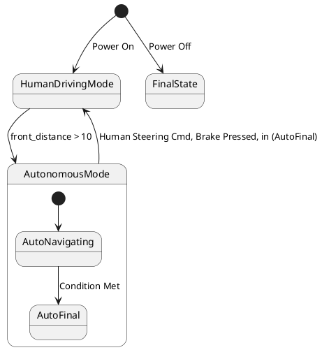

# Pair `0000`：NL + PlantUML STM0 + FCSTM STM0

[返回 60 组索引](../../PAIR_INDEX.md) | [下一组 `0001`](../0001/README.md)

- LLM：`GPT-4o`
- 模型/场景：high-level driving module
- 作者输出阶段：`Result with Semantic Checking`
- 作者输出单元格：`AE2`；Excel row：`2`
- Phase-I fallback：`false`
- 相对 Phase-I 是否变化：`true`
- Phase-I PlantUML SHA-256：`8fd2f71b338836488e2e29fe19c4e58c4992d4186367f43efc121fae6c36db7f`
- NL SHA-256：`f1c3dc88371b8256352e7ab6ee7eb42424de6e11dfde70d185f224dd1d05a7a8`
- PlantUML SHA-256：`4fe07b05bdcfaac1c961d1176fb099d8240818160caa6edfb57928c6be2efc8a`
- FCSTM SHA-256：`87acd20f3d0a1e1cf5a69fc11b198644d126fa8b56d80ad355fd6949c12cc0e2`
- review subject SHA-256：`8c40455bfdb2cfa75954abd5289213b9e9d6903aebb5bdeab83ec1290da16f2b`
- working contract SHA-256：`648ec40151ca59ae285943c4545f664a889e7c7fb74b36ea9b39c59b74c6acda`
- 结构裁决：`structure_preserved`
- source states / transitions：`5` / `6`
- mapped / blocked / silent drop：`6` / `0` / `0`
- final / lifecycle / body coverage：`0/0` / `0/0` / `0/0`
- concurrent region / separator coverage：`0/0` / `0/0`
- source normalization coverage：`0/0`
- official raw / validation：`state_diagram` / `state_diagram`
- official identity states / transitions：`5` / `6`
- official identity remaps：state `0` / transition endpoint `0`
- AST audit：`passed`
- legacy whole-model FCSTM execution / Discover：`false` / `false`
- working bundle usage gate：`discover_input_with_capability_mask`
- ownership source / compiler / agent：`11` / `18` / `0`
- source macro / positive identity trace / conversion boundary trace：`6` / `11` / `0`
- capability source-static / simulation / transition-trace：`eligible_with_exclusions` / `ineligible` / `ineligible`
- compiler-only diagnostic policy：`rejected_conversion_artifact`；main-result conversion artifact limit：`0`
- 主 session 对读：`pass`；ownership/macro/capability 均为 `pass`；Case 0000 passes conversion-attribution review. This does not assert NL/PlantUML correctness or runtime equivalence; authored defects remain eligible for later source-grounded Discover. The two root initial edges, including the Power Off edge, are authored PlantUML facts; both InitialWait helpers remain compiler-owned and non-repairable. Fresh v6 main-session review re-read NL, PlantUML, FCSTM, working contract, and source trace after the portable Java identity change; source/FCSTM/trace bytes are unchanged and verification remains fail-closed.
- source anchors：`source-ref:llms_emp_feedback_final_0000.puml:line:4\|state HumanDrivingMode {, source-ref:llms_emp_feedback_final_0000.puml:line:2\|[*] --> HumanDrivingMode : Power On`；FCSTM anchors：`element-ref:source:state:HumanDrivingMode@line:9\|state HumanDrivingMode named "HumanDrivingMode" {, element-ref:compiler:state:llms_emp_feedback_final_0000.InitialWaittr_0001@line:7\|state InitialWaittr_0001 named "Awaiting initial event: Power On";`
- 三个原始文件：[NL](./nl.txt) | [PlantUML](./plantuml.puml) | [FCSTM](./fcstm.fcstm)
- 审计入口：[canonical](../../canonical/llms_emp_feedback_final_0000.json) | [冻结 FCSTM](../../fcstm/llms_emp_feedback_final_0000.fcstm) | [case report](../../case_reports/llms_emp_feedback_final_0000.json) | [working contract](../../working_contracts/llms_emp_feedback_final_0000.json) | [source trace](../../source_traces/llms_emp_feedback_final_0000.json) | [人工总账](../../MANUAL_REVIEW.md)

## 主 session 三方语义对应

| projection | assessment | NL anchor | PlantUML anchor | FCSTM anchor | source roots | compiler members | rationale |
|---|---|---|---|---|---|---|---|
| `direct` | `preserved` | 1 The human driving mode is represented by a simple state. | source-ref:llms_emp_feedback_final_0000.puml:line:4\|state HumanDrivingMode { | element-ref:source:state:HumanDrivingMode@line:9\|state HumanDrivingMode named "HumanDrivingMode" { | source:state:HumanDrivingMode | - | Case 0000 binds source:state:HumanDrivingMode to the exact authored occurrence 'state HumanDrivingMode {'; it is present as a direct FCSTM state projection with the same source identity and parent relation. |
| `macro` | `preserved_with_exclusions` | power on | source-ref:llms_emp_feedback_final_0000.puml:line:2\|[*] --> HumanDrivingMode : Power On | element-ref:compiler:state:llms_emp_feedback_final_0000.InitialWaittr_0001@line:7\|state InitialWaittr_0001 named "Awaiting initial event: Power On"; | source:transition:tr_0001 | compiler:state:llms_emp_feedback_final_0000.InitialWaittr_0001 | Case 0000 binds source:transition:tr_0001 to the exact authored occurrence '[*] --> HumanDrivingMode : Power On'; it is present as a source-owned transition root whose cited FCSTM line belongs to a protected compiler macro; the raw label remains opaque. |

## Risk occurrence 第二遍复核

| obligation | risk tag | assessment | PlantUML evidence | FCSTM evidence | ownership evidence | rationale |
|---|---|---|---|---|---|---|
| `review:multi_segment_macro:0001:tr_0001` | `multi_segment_macro` | `compiler_artifact_excluded` | source-ref:llms_emp_feedback_final_0000.puml:line:2\|[*] --> HumanDrivingMode : Power On | element-ref:compiler:state:llms_emp_feedback_final_0000.InitialWaittr_0001@line:7\|state InitialWaittr_0001 named "Awaiting initial event: Power On";, element-ref:compiler:transition_segment:tr_0001:segment:1@line:20\|[*] -> InitialWaittr_0001;, element-ref:compiler:transition_segment:tr_0001:segment:2@line:21\|InitialWaittr_0001 -> HumanDrivingMode : /Power_On; | compiler:state:llms_emp_feedback_final_0000.InitialWaittr_0001, compiler:transition_segment:tr_0001:segment:1, compiler:transition_segment:tr_0001:segment:2, source:transition:tr_0001 | Case 0000 risk multi_segment_macro occurrence review:multi_segment_macro:0001:tr_0001: The single authored transition remains one source-owned semantic root; all bound FCSTM segments are protected compiler artifacts and cannot become repair targets. |
| `review:multi_segment_macro:0002:tr_0006` | `multi_segment_macro` | `compiler_artifact_excluded` | source-ref:llms_emp_feedback_final_0000.puml:line:14\|[*] --> FinalState : Power Off | element-ref:compiler:state:llms_emp_feedback_final_0000.InitialWaittr_0006@line:8\|state InitialWaittr_0006 named "Awaiting initial event: Power Off";, element-ref:compiler:transition_segment:tr_0006:segment:1@line:24\|[*] -> InitialWaittr_0006;, element-ref:compiler:transition_segment:tr_0006:segment:2@line:25\|InitialWaittr_0006 -> FinalState : /Power_Off; | compiler:state:llms_emp_feedback_final_0000.InitialWaittr_0006, compiler:transition_segment:tr_0006:segment:1, compiler:transition_segment:tr_0006:segment:2, source:transition:tr_0006 | Case 0000 risk multi_segment_macro occurrence review:multi_segment_macro:0002:tr_0006: The single authored transition remains one source-owned semantic root; all bound FCSTM segments are protected compiler artifacts and cannot become repair targets. |
| `review:synthetic_state:0003:001-InitialWaittr_0001` | `synthetic_state` | `compiler_artifact_excluded` | source-ref:llms_emp_feedback_final_0000.puml:line:2\|[*] --> HumanDrivingMode : Power On | element-ref:compiler:state:llms_emp_feedback_final_0000.InitialWaittr_0001@line:7\|state InitialWaittr_0001 named "Awaiting initial event: Power On"; | compiler:state:llms_emp_feedback_final_0000.InitialWaittr_0001, source:transition:tr_0001 | Case 0000 risk synthetic_state occurrence review:synthetic_state:0003:001-InitialWaittr_0001: The helper state is a protected compiler-owned projection for a source structural fact; diagnostics on the helper itself are conversion artifacts. |
| `review:synthetic_state:0004:002-InitialWaittr_0006` | `synthetic_state` | `compiler_artifact_excluded` | source-ref:llms_emp_feedback_final_0000.puml:line:14\|[*] --> FinalState : Power Off | element-ref:compiler:state:llms_emp_feedback_final_0000.InitialWaittr_0006@line:8\|state InitialWaittr_0006 named "Awaiting initial event: Power Off"; | compiler:state:llms_emp_feedback_final_0000.InitialWaittr_0006, source:transition:tr_0006 | Case 0000 risk synthetic_state occurrence review:synthetic_state:0004:002-InitialWaittr_0006: The helper state is a protected compiler-owned projection for a source structural fact; diagnostics on the helper itself are conversion artifacts. |
| `review:synthetic_state:0005:003-UnspecifiedInitial` | `synthetic_state` | `compiler_artifact_excluded` | source-ref:llms_emp_feedback_final_0000.puml:line:4\|state HumanDrivingMode { | element-ref:compiler:state:llms_emp_feedback_final_0000.HumanDrivingMode.UnspecifiedInitial@line:10\|state UnspecifiedInitial named "Unspecified initial";, element-ref:source:state:HumanDrivingMode@line:9\|state HumanDrivingMode named "HumanDrivingMode" { | compiler:state:llms_emp_feedback_final_0000.HumanDrivingMode.UnspecifiedInitial, source:state:HumanDrivingMode | Case 0000 risk synthetic_state occurrence review:synthetic_state:0005:003-UnspecifiedInitial: The helper state is a protected compiler-owned projection for a source structural fact; diagnostics on the helper itself are conversion artifacts. |
| `review:explicit_concurrency:0006:001-multiple_initial_fanout` | `explicit_concurrency` | `capability_excluded` | source-ref:llms_emp_feedback_final_0000.puml:line:14\|[*] --> FinalState : Power Off, source-ref:llms_emp_feedback_final_0000.puml:line:2\|[*] --> HumanDrivingMode : Power On | element-ref:compiler:state:llms_emp_feedback_final_0000.InitialWaittr_0001@line:7\|state InitialWaittr_0001 named "Awaiting initial event: Power On";, element-ref:compiler:state:llms_emp_feedback_final_0000.InitialWaittr_0006@line:8\|state InitialWaittr_0006 named "Awaiting initial event: Power Off"; | source:transition:tr_0001, source:transition:tr_0006 | Case 0000 risk explicit_concurrency occurrence review:explicit_concurrency:0006:001-multiple_initial_fanout: The authored concurrency occurrence remains visible, but the FCSTM projection does not claim fork/join product semantics and is excluded from runtime evidence. |

## 作者阶段 lineage

| stage | output cell | present | output SHA-256 | feedback | resolved |
|---|---|---|---|---|---|
| `phase_i_generation` | `I2` | `true` | `8fd2f71b338836488e2e29fe19c4e58c4992d4186367f43efc121fae6c36db7f` | - | - |
| `phase_ii_format` | `U2` | `false` | `-` | - | - |
| `phase_ii_grammar` | `Z2` | `true` | `4fe07b05bdcfaac1c961d1176fb099d8240818160caa6edfb57928c6be2efc8a` | transition does not connect two state | 1.0 |
| `phase_ii_semantic` | `AE2` | `true` | `4fe07b05bdcfaac1c961d1176fb099d8240818160caa6edfb57928c6be2efc8a` | None | 1.0 |

## Official identity ledger

- status：`aligned`
- canonical / official states：`5` / `5`
- aligned transition endpoints：`6`

本组 state identity 无需重映射。

本组 transition endpoint 无需重映射。

## Source normalization ledger

本组没有 source-input normalization。

## Concurrent region ledger

本组没有 PlantUML orthogonal/concurrent region separator。

## Operational debt

| reason code | count |
|---|---:|
| `R45.DEBT.missing_explicit_initial` | 1 |
| `R45.DEBT.multiple_initial_fanout` | 1 |
| `R45.DEBT.opaque_transition_label_semantics` | 5 |

## NL

```text
1 The human driving mode is represented by a simple state. 2 The autonomous mode has sub-states and is represented by a sub machine state. 3. when power on, the system turn into human driving mode 4when front_distance > 10, auto transport to autonomous state 4. transit to human driving mode when receive human steering cmd, brake pressed, in (auto final) 5 when power off, it will transit to final state
```

## 作者 Phase-II 最终 PlantUML STM0



## 转换后 FCSTM STM0

```fcstm
state llms_emp_feedback_final_0000 named "llms_emp_feedback_final_0000" {
    event Power_On named "Power On";
    event Condition_Met named "Condition Met";
    event front_distance_10 named "front_distance > 10";
    event Human_Steering_Cmd_Brake_Pressed_in_AutoFinal named "Human Steering Cmd, Brake Pressed, in (AutoFinal)";
    event Power_Off named "Power Off";
    state InitialWaittr_0001 named "Awaiting initial event: Power On";
    state InitialWaittr_0006 named "Awaiting initial event: Power Off";
    state HumanDrivingMode named "HumanDrivingMode" {
        state UnspecifiedInitial named "Unspecified initial";
        [*] -> UnspecifiedInitial;
    }
    state AutonomousMode named "AutonomousMode" {
        state AutoNavigating named "AutoNavigating";
        state AutoFinal named "AutoFinal";
        [*] -> AutoNavigating;
        AutoNavigating -> AutoFinal : /Condition_Met;
    }
    state FinalState named "FinalState";
    [*] -> InitialWaittr_0001;
    InitialWaittr_0001 -> HumanDrivingMode : /Power_On;
    !HumanDrivingMode -> AutonomousMode : /front_distance_10;
    !AutonomousMode -> HumanDrivingMode : /Human_Steering_Cmd_Brake_Pressed_in_AutoFinal;
    [*] -> InitialWaittr_0006;
    InitialWaittr_0006 -> FinalState : /Power_Off;
}
```

[返回 60 组索引](../../PAIR_INDEX.md) | [下一组 `0001`](../0001/README.md)
