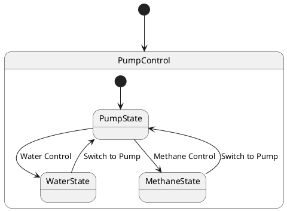

# Pair `0002`：NL + PlantUML STM0 + FCSTM STM0

[上一组 `0001`](../0001/README.md) | [返回 60 组索引](../../PAIR_INDEX.md) | [下一组 `0003`](../0003/README.md)

- LLM：`GPT-4o`
- 模型/场景：Pump Control state machine
- NL SHA-256：`a391765dba935d89e6d2467c97b218c0136d106ea9c00bac91e6525e28ac04f1`
- PlantUML SHA-256：`945aa398670dec96e72eb75bf7ca969371d1c7eabbd1bd9ce7c153565e35a934`
- FCSTM SHA-256：`02f822d8be21303e57f0d0f1d2f6ed53ff4a1cf441ada4a5a313d748cd21347d`
- 结构裁决：`structure_preserved`
- FCSTM execution eligible：`false`
- Discover eligible：`false`
- 主 session 对读：`PumpControl` hierarchy、两级 initial 与四条事件迁移逐项一致。
- 三个原始文件：[NL](./nl.txt) | [PlantUML](./plantuml.puml) | [FCSTM](./fcstm.fcstm)
- 审计入口：[canonical](../../canonical/llms_emp_stm_results_0002.json) | [冻结 FCSTM](../../fcstm/llms_emp_stm_results_0002.fcstm) | [case report](../../case_reports/llms_emp_stm_results_0002.json) | [人工总账](../../MANUAL_REVIEW.md)

## NL

```text
1. The system begins in the PumpControl state, from which it can transition to different substates based on specific conditions.
2. Within the PumpControl state, there are three main substates: PumpState, WaterState, and MethaneState.
3. The system first transitions to the PumpState substate, where the pump is activated or controlled.
4. The system can also transition to the WaterState substate, indicating that the pump is controlling or monitoring the water flow.
5. Similarly, the system can transition to the MethaneState substate, indicating that the pump is controlling or monitoring the methane flow.
```

## 原装 PlantUML STM0



## 转换后 FCSTM STM0

```fcstm
state llms_emp_stm_results_0002 named "llms_emp_stm_results_0002" {
    event Water_Control named "Water Control";
    event Methane_Control named "Methane Control";
    event Switch_to_Pump named "Switch to Pump";
    state PumpControl named "PumpControl" {
        state PumpState named "PumpState";
        state WaterState named "WaterState";
        state MethaneState named "MethaneState";
        [*] -> PumpState;
        PumpState -> WaterState : /Water_Control;
        PumpState -> MethaneState : /Methane_Control;
        WaterState -> PumpState : /Switch_to_Pump;
        MethaneState -> PumpState : /Switch_to_Pump;
    }
    [*] -> PumpControl;
}
```

[上一组 `0001`](../0001/README.md) | [返回 60 组索引](../../PAIR_INDEX.md) | [下一组 `0003`](../0003/README.md)
