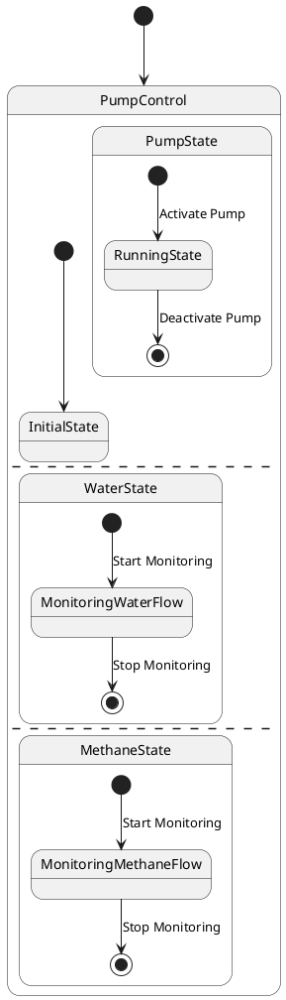

# Pair `0002`：NL + PlantUML STM0 + FCSTM STM0

[上一组 `0001`](../0001/README.md) | [返回 60 组索引](../../PAIR_INDEX.md) | [下一组 `0003`](../0003/README.md)

- LLM：`GPT-4o`
- 模型/场景：Pump Control state machine
- 作者输出阶段：`Result with Semantic Checking`
- 作者输出单元格：`AE4`；Excel row：`4`
- Phase-I fallback：`false`
- 相对 Phase-I 是否变化：`true`
- Phase-I PlantUML SHA-256：`945aa398670dec96e72eb75bf7ca969371d1c7eabbd1bd9ce7c153565e35a934`
- NL SHA-256：`a391765dba935d89e6d2467c97b218c0136d106ea9c00bac91e6525e28ac04f1`
- PlantUML SHA-256：`3a8e81a4a5a1e54e3994af300fcbd1913073547b8069288bbe57e61d989c3d43`
- FCSTM SHA-256：`99acbb59aea2f1d1a77893225fa165541d2a3aba901fd03cba09a76243d5b213`
- 结构裁决：`structure_preserved`
- source states / transitions：`8` / `8`
- mapped / blocked / silent drop：`8` / `0` / `0`
- final / lifecycle / body coverage：`3/3` / `0/0` / `0/0`
- concurrent region / separator coverage：`3/3` / `2/2`
- source normalization coverage：`0/0`
- official raw / validation：`state_diagram` / `state_diagram`
- official identity states / transitions：`8` / `8`
- official identity remaps：state `0` / transition endpoint `0`
- AST audit：`passed`
- FCSTM execution eligible：`false`
- Discover eligible：`false`
- 主 session 对读：完整对读：Pump/Water/Methane 三个 composite、各自带事件 initial/final 均投影；两个 `--` 被保留为 3-region ledger，FCSTM 未伪造正交执行，仅以 display/trace 明示并发语义债。
- 三个原始文件：[NL](./nl.txt) | [PlantUML](./plantuml.puml) | [FCSTM](./fcstm.fcstm)
- 审计入口：[canonical](../../canonical/llms_emp_feedback_final_0002.json) | [冻结 FCSTM](../../fcstm/llms_emp_feedback_final_0002.fcstm) | [case report](../../case_reports/llms_emp_feedback_final_0002.json) | [人工总账](../../MANUAL_REVIEW.md)

## 作者阶段 lineage

| stage | output cell | present | output SHA-256 | feedback | resolved |
|---|---|---|---|---|---|
| `phase_i_generation` | `I4` | `true` | `945aa398670dec96e72eb75bf7ca969371d1c7eabbd1bd9ce7c153565e35a934` | - | - |
| `phase_ii_format` | `U4` | `false` | `-` | - | - |
| `phase_ii_grammar` | `Z4` | `false` | `-` | - | - |
| `phase_ii_semantic` | `AE4` | `true` | `3a8e81a4a5a1e54e3994af300fcbd1913073547b8069288bbe57e61d989c3d43` | 1. should use region to seperate three states | 1.0 |

## Official identity ledger

- status：`aligned`
- canonical / official states：`8` / `8`
- aligned transition endpoints：`8`

本组 state identity 无需重映射。

本组 transition endpoint 无需重映射。

## Source normalization ledger

本组没有 source-input normalization。

## Concurrent region ledger

| owner | region | direct states | direct transitions | separator before | separator after |
|---|---:|---|---|---|---|
| `PumpControl` | 0 | PumpControl.PumpState, PumpControl.InitialState | tr_0002 | - | llms_emp_feedback_final_0002.puml:line:12 |
| `PumpControl` | 1 | PumpControl.WaterState | - | llms_emp_feedback_final_0002.puml:line:12 | llms_emp_feedback_final_0002.puml:line:19 |
| `PumpControl` | 2 | PumpControl.MethaneState | - | llms_emp_feedback_final_0002.puml:line:19 | - |

## Operational debt

| reason code | count |
|---|---:|
| `R45.DEBT.concurrent_region_semantics` | 1 |
| `R45.DEBT.opaque_transition_label_semantics` | 6 |

## NL

```text
1. The system begins in the PumpControl state, from which it can transition to different substates based on specific conditions.
2. Within the PumpControl state, there are three main substates: PumpState, WaterState, and MethaneState.
3. The system first transitions to the PumpState substate, where the pump is activated or controlled.
4. The system can also transition to the WaterState substate, indicating that the pump is controlling or monitoring the water flow.
5. Similarly, the system can transition to the MethaneState substate, indicating that the pump is controlling or monitoring the methane flow.
```

## 作者 Phase-II 最终 PlantUML STM0



## 转换后 FCSTM STM0

```fcstm
state llms_emp_feedback_final_0002 named "llms_emp_feedback_final_0002" {
    event Activate_Pump named "Activate Pump";
    event Deactivate_Pump named "Deactivate Pump";
    event Start_Monitoring named "Start Monitoring";
    event Stop_Monitoring named "Stop Monitoring";
    state PumpControl named "PumpControl\n[PlantUML concurrent region 0] states=PumpControl.PumpState, PumpControl.InitialState; transitions=tr_0002\n[PlantUML concurrent region 1] states=PumpControl.WaterState; transitions=-\n[PlantUML concurrent region 2] states=PumpControl.MethaneState; transitions=-\n[PlantUML concurrent separator] region 0 -> 1 at llms_emp_feedback_final_0002.puml:line:12\n[PlantUML concurrent separator] region 1 -> 2 at llms_emp_feedback_final_0002.puml:line:19" {
        state PumpState named "PumpState" {
            state RunningState named "RunningState";
            state InitialWaittr_0003 named "Awaiting initial event: Activate Pump";
            state FinalWaittr_0004 named "Completed final boundary: PumpControl.PumpState.RunningState";
            [*] -> InitialWaittr_0003;
            InitialWaittr_0003 -> RunningState : /Activate_Pump;
            RunningState -> FinalWaittr_0004 : /Deactivate_Pump;
        }
        state WaterState named "WaterState" {
            state MonitoringWaterFlow named "MonitoringWaterFlow";
            state InitialWaittr_0005 named "Awaiting initial event: Start Monitoring";
            state FinalWaittr_0006 named "Completed final boundary: PumpControl.WaterState.MonitoringWaterFlow";
            [*] -> InitialWaittr_0005;
            InitialWaittr_0005 -> MonitoringWaterFlow : /Start_Monitoring;
            MonitoringWaterFlow -> FinalWaittr_0006 : /Stop_Monitoring;
        }
        state MethaneState named "MethaneState" {
            state MonitoringMethaneFlow named "MonitoringMethaneFlow";
            state InitialWaittr_0007 named "Awaiting initial event: Start Monitoring";
            state FinalWaittr_0008 named "Completed final boundary: PumpControl.MethaneState.MonitoringMethaneFlow";
            [*] -> InitialWaittr_0007;
            InitialWaittr_0007 -> MonitoringMethaneFlow : /Start_Monitoring;
            MonitoringMethaneFlow -> FinalWaittr_0008 : /Stop_Monitoring;
        }
        state InitialState named "InitialState";
        [*] -> InitialState;
    }
    [*] -> PumpControl;
}
```

[上一组 `0001`](../0001/README.md) | [返回 60 组索引](../../PAIR_INDEX.md) | [下一组 `0003`](../0003/README.md)
