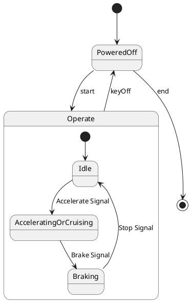

# Pair `0003`：NL + PlantUML STM0 + FCSTM STM0

[上一组 `0002`](../0002/README.md) | [返回 60 组索引](../../PAIR_INDEX.md) | [下一组 `0004`](../0004/README.md)

- LLM：`GPT-4o`
- 模型/场景：Hybrid Sport Utility Vehicle, HSUV
- 作者输出阶段：`Result with Semantic Checking`
- 作者输出单元格：`AE5`；Excel row：`5`
- Phase-I fallback：`false`
- 相对 Phase-I 是否变化：`true`
- Phase-I PlantUML SHA-256：`01208d7d90b5c5e8c240e5c4aa9cab0e6ace084afeb752b3dfdb04d17d396150`
- NL SHA-256：`9fe426ba761d5a52c3b670f35410502a5289bdd9489c4a9bfa983e34d565040c`
- PlantUML SHA-256：`c82a800174e833df461aa14837651ad835a7ae146f84a9939cacac05e643e821`
- FCSTM SHA-256：`0c94f4db6f3b72b94808da7419808ef1210aade8f1b89c45d37324eaacfdb8fd`
- review subject SHA-256：`8219b2d0672651990952a7478bd8f04ed6336178722b920fff814d06d694fa2f`
- working contract SHA-256：`5adccfd2624f9b5a2b56c35553718045128a9b63f60a9ccfd50935b8c8e928f5`
- 结构裁决：`structure_preserved`
- source states / transitions：`5` / `8`
- mapped / blocked / silent drop：`8` / `0` / `0`
- final / lifecycle / body coverage：`1/1` / `0/0` / `0/0`
- concurrent region / separator coverage：`0/0` / `0/0`
- source normalization coverage：`0/0`
- official raw / validation：`state_diagram` / `state_diagram`
- official identity states / transitions：`5` / `8`
- official identity remaps：state `0` / transition endpoint `0`
- AST audit：`passed`
- legacy whole-model FCSTM execution / Discover：`false` / `false`
- working bundle usage gate：`discover_input_with_capability_mask`
- ownership source / compiler / agent：`13` / `15` / `0`
- source macro / positive identity trace / conversion boundary trace：`8` / `13` / `0`
- capability source-static / simulation / transition-trace：`eligible_with_exclusions` / `ineligible` / `ineligible`
- compiler-only diagnostic policy：`rejected_conversion_artifact`；main-result conversion artifact limit：`0`
- 主 session 对读：`pass`；ownership/macro/capability 均为 `pass`；Case 0003 passes conversion-attribution review. This does not assert NL/PlantUML correctness or runtime equivalence; authored defects remain eligible for later source-grounded Discover. No conversion-specific blocker was found in the exact reviewed occurrences. Fresh v6 main-session review re-read NL, PlantUML, FCSTM, working contract, and source trace after the portable Java identity change; source/FCSTM/trace bytes are unchanged and verification remains fail-closed.
- source anchors：`source-ref:llms_emp_feedback_final_0003.puml:line:4\|state Operate {, source-ref:llms_emp_feedback_final_0003.puml:line:11\|PoweredOff --> Operate : start`；FCSTM anchors：`element-ref:source:state:Operate@line:8\|state Operate named "Operate" {, element-ref:compiler:transition_segment:tr_0006:segment:1@line:19\|PoweredOff -> Operate : /start;`
- 三个原始文件：[NL](./nl.txt) | [PlantUML](./plantuml.puml) | [FCSTM](./fcstm.fcstm)
- 审计入口：[canonical](../../canonical/llms_emp_feedback_final_0003.json) | [冻结 FCSTM](../../fcstm/llms_emp_feedback_final_0003.fcstm) | [case report](../../case_reports/llms_emp_feedback_final_0003.json) | [working contract](../../working_contracts/llms_emp_feedback_final_0003.json) | [source trace](../../source_traces/llms_emp_feedback_final_0003.json) | [人工总账](../../MANUAL_REVIEW.md)

## 主 session 三方语义对应

| projection | assessment | NL anchor | PlantUML anchor | FCSTM anchor | source roots | compiler members | rationale |
|---|---|---|---|---|---|---|---|
| `direct` | `preserved` | Operate | source-ref:llms_emp_feedback_final_0003.puml:line:4\|state Operate { | element-ref:source:state:Operate@line:8\|state Operate named "Operate" { | source:state:Operate | - | Case 0003 binds source:state:Operate to the exact authored occurrence 'state Operate {'; it is present as a direct FCSTM state projection with the same source identity and parent relation. |
| `macro` | `preserved_with_exclusions` | Operate | source-ref:llms_emp_feedback_final_0003.puml:line:11\|PoweredOff --> Operate : start | element-ref:compiler:transition_segment:tr_0006:segment:1@line:19\|PoweredOff -> Operate : /start; | source:transition:tr_0006 | compiler:transition_segment:tr_0006:segment:1 | Case 0003 binds source:transition:tr_0006 to the exact authored occurrence 'PoweredOff --> Operate : start'; it is present as a source-owned transition root whose cited FCSTM line belongs to a protected compiler macro; the raw label remains opaque. |

## Risk occurrence 第二遍复核

| obligation | risk tag | assessment | PlantUML evidence | FCSTM evidence | ownership evidence | rationale |
|---|---|---|---|---|---|---|
| `review:final_boundary:0001:tr_0008` | `final_boundary` | `source_fact_preserved` | source-ref:llms_emp_feedback_final_0003.puml:line:13\|PoweredOff --> [*] : end | element-ref:compiler:transition_segment:tr_0008:segment:1@line:21\|PoweredOff -> [*] : /end; | compiler:transition_segment:tr_0008:segment:1, source:transition:tr_0008 | Case 0003 risk final_boundary occurrence review:final_boundary:0001:tr_0008: The authored PlantUML final boundary is preserved by the bound FCSTM termination macro rather than being converted into an ordinary user state. |

## 作者阶段 lineage

| stage | output cell | present | output SHA-256 | feedback | resolved |
|---|---|---|---|---|---|
| `phase_i_generation` | `I5` | `true` | `01208d7d90b5c5e8c240e5c4aa9cab0e6ace084afeb752b3dfdb04d17d396150` | - | - |
| `phase_ii_format` | `U5` | `false` | `-` | - | - |
| `phase_ii_grammar` | `Z5` | `false` | `-` | - | - |
| `phase_ii_semantic` | `AE5` | `true` | `c82a800174e833df461aa14837651ad835a7ae146f84a9939cacac05e643e821` | 1. missing final state | 1.0 |

## Official identity ledger

- status：`aligned`
- canonical / official states：`5` / `5`
- aligned transition endpoints：`8`

本组 state identity 无需重映射。

本组 transition endpoint 无需重映射。

## Source normalization ledger

本组没有 source-input normalization。

## Concurrent region ledger

本组没有 PlantUML orthogonal/concurrent region separator。

## Operational debt

| reason code | count |
|---|---:|
| `R45.DEBT.opaque_transition_label_semantics` | 6 |

## NL

```text
1. Once the device is powered on, the system enters the `Operate` state, and based on user actions, it transitions between `Idle`, `Accelerating or Cruising`, and `Braking` states.
2. The system can be turned on with the `start` signal and turned off with the `keyOff` signal.
3. Within the `Operate` state, the system transitions between different substates depending on actions like accelerating, braking, or stopping.
```

## 作者 Phase-II 最终 PlantUML STM0



## 转换后 FCSTM STM0

```fcstm
state llms_emp_feedback_final_0003 named "llms_emp_feedback_final_0003" {
    event Accelerate_Signal named "Accelerate Signal";
    event Brake_Signal named "Brake Signal";
    event Stop_Signal named "Stop Signal";
    event start named "start";
    event keyOff named "keyOff";
    event end named "end";
    state Operate named "Operate" {
        state Idle named "Idle";
        state AcceleratingOrCruising named "AcceleratingOrCruising";
        state Braking named "Braking";
        [*] -> Idle;
        Idle -> AcceleratingOrCruising : /Accelerate_Signal;
        AcceleratingOrCruising -> Braking : /Brake_Signal;
        Braking -> Idle : /Stop_Signal;
    }
    state PoweredOff named "PoweredOff";
    [*] -> PoweredOff;
    PoweredOff -> Operate : /start;
    !Operate -> PoweredOff : /keyOff;
    PoweredOff -> [*] : /end;
}
```

[上一组 `0002`](../0002/README.md) | [返回 60 组索引](../../PAIR_INDEX.md) | [下一组 `0004`](../0004/README.md)
