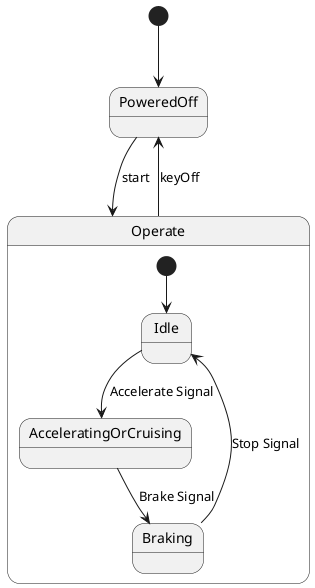

# Pair `0003`：NL + PlantUML STM0 + FCSTM STM0

[上一组 `0002`](../0002/README.md) | [返回 60 组索引](../../PAIR_INDEX.md) | [下一组 `0004`](../0004/README.md)

- LLM：`GPT-4o`
- 模型/场景：Hybrid Sport Utility Vehicle, HSUV
- NL SHA-256：`9fe426ba761d5a52c3b670f35410502a5289bdd9489c4a9bfa983e34d565040c`
- PlantUML SHA-256：`01208d7d90b5c5e8c240e5c4aa9cab0e6ace084afeb752b3dfdb04d17d396150`
- FCSTM SHA-256：`a075771dfb2bcc3c4f679da2db427c609c37825601bf3b236ba1754e313e6292`
- 结构裁决：`structure_preserved`
- FCSTM execution eligible：`false`
- Discover eligible：`false`
- 主 session 对读：`Operate` composite、三条内部边及 root start/keyOff 保留；composite exit 使用 forced macro。
- 三个原始文件：[NL](./nl.txt) | [PlantUML](./plantuml.puml) | [FCSTM](./fcstm.fcstm)
- 审计入口：[canonical](../../canonical/llms_emp_stm_results_0003.json) | [冻结 FCSTM](../../fcstm/llms_emp_stm_results_0003.fcstm) | [case report](../../case_reports/llms_emp_stm_results_0003.json) | [人工总账](../../MANUAL_REVIEW.md)

## NL

```text
1. Once the device is powered on, the system enters the `Operate` state, and based on user actions, it transitions between `Idle`, `Accelerating or Cruising`, and `Braking` states.
2. The system can be turned on with the `start` signal and turned off with the `keyOff` signal.
3. Within the `Operate` state, the system transitions between different substates depending on actions like accelerating, braking, or stopping.
```

## 原装 PlantUML STM0



## 转换后 FCSTM STM0

```fcstm
state llms_emp_stm_results_0003 named "llms_emp_stm_results_0003" {
    event Accelerate_Signal named "Accelerate Signal";
    event Brake_Signal named "Brake Signal";
    event Stop_Signal named "Stop Signal";
    event start named "start";
    event keyOff named "keyOff";
    state Operate named "Operate" {
        state Idle named "Idle";
        state AcceleratingOrCruising named "AcceleratingOrCruising";
        state Braking named "Braking";
        [*] -> Idle;
        Idle -> AcceleratingOrCruising : /Accelerate_Signal;
        AcceleratingOrCruising -> Braking : /Brake_Signal;
        Braking -> Idle : /Stop_Signal;
    }
    state PoweredOff named "PoweredOff";
    [*] -> PoweredOff;
    PoweredOff -> Operate : /start;
    !Operate -> PoweredOff : /keyOff;
}
```

[上一组 `0002`](../0002/README.md) | [返回 60 组索引](../../PAIR_INDEX.md) | [下一组 `0004`](../0004/README.md)
