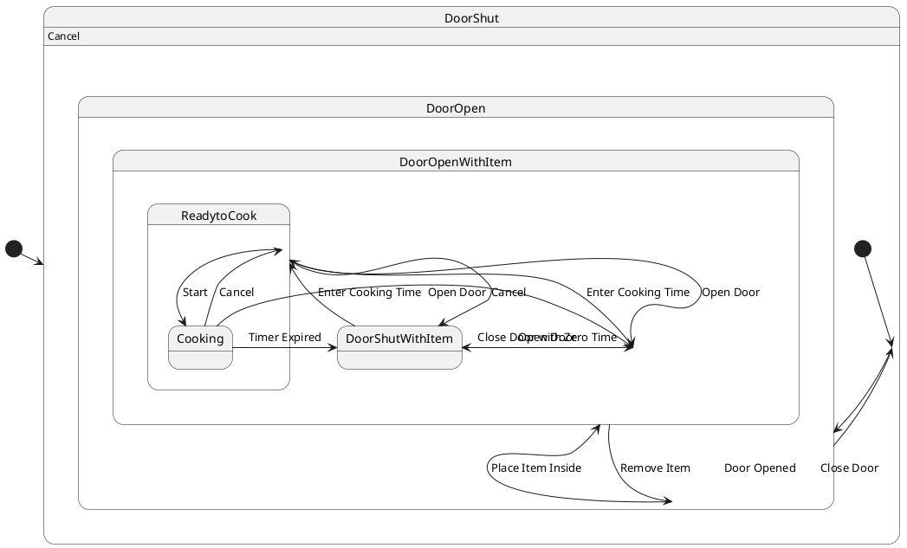

# Pair `0005`：NL + PlantUML STM0 + FCSTM STM0

[上一组 `0004`](../0004/README.md) | [返回 60 组索引](../../PAIR_INDEX.md) | [下一组 `0006`](../0006/README.md)

- LLM：`GPT-4o`
- 模型/场景：Microwave Oven Control with entry and <br> exit actions
- NL SHA-256：`934e19bd4ae2a793c334fdcf486092d3aa20858f09ae892753ef87698feb061f`
- PlantUML SHA-256：`0727625138b0bac74c9332b4af3c8e653f0721cb84e44628332b3bebd3308f77`
- FCSTM SHA-256：`f7e2f0d3bca87d88834af3360639a683e3a65df6f0157163510c9c7e3c572b4e`
- 结构裁决：`structure_preserved`
- FCSTM execution eligible：`false`
- Discover eligible：`false`
- 主 session 对读：16 条 source macro 齐；三条 `Open Door` deep-entry occurrence 均保留，且均在 `UnspecifiedInitial` fallback 之前。
- 三个原始文件：[NL](./nl.txt) | [PlantUML](./plantuml.puml) | [FCSTM](./fcstm.fcstm)
- 审计入口：[canonical](../../canonical/llms_emp_stm_results_0005.json) | [冻结 FCSTM](../../fcstm/llms_emp_stm_results_0005.fcstm) | [case report](../../case_reports/llms_emp_stm_results_0005.json) | [人工总账](../../MANUAL_REVIEW.md)

## NL

```text
1. The microwave starts in the DoorShut state. From this state, the system can either remain in DoorShut if a Cancel action is performed or transition to the DoorOpen state when the door is opened.
2. When the Door Opened action occurs in the DoorShut state, the system transitions to the DoorOpen state. The door can be closed to return to the DoorShut state.
3. In the DoorOpen state, placing an item inside the microwave transitions the system to DoorOpenWithItem. If the item is removed, the system returns to DoorOpen.
4. From DoorOpenWithItem, the system can transition to DoorShutWithItem if the door is closed with zero time set or to ReadytoCook if cooking time is entered.
5. In the DoorShutWithItem state, opening the door transitions the system back to DoorOpenWithItem, while entering cooking time takes the system to ReadytoCook, where the cooking time is displayed and updated.
6. In the ReadytoCook state, if the Cancel action is performed, the system returns to DoorShutWithItem, canceling or updating the cooking time. If the door is opened, the system transitions to DoorOpenWithItem.
7. When the Start action is performed in ReadytoCook, the system transitions to the Cooking state, where the timer starts.
8. In the Cooking state, opening the door stops the timer and the system transitions to DoorOpenWithItem, while if the timer expires, the system moves to DoorShutWithItem. A Cancel action transitions the system back to ReadytoCook.
```

## 原装 PlantUML STM0



## 转换后 FCSTM STM0

```fcstm
state llms_emp_stm_results_0005 named "llms_emp_stm_results_0005" {
    event Door_Opened named "Door Opened";
    event Place_Item_Inside named "Place Item Inside";
    event Close_Door named "Close Door";
    event Remove_Item named "Remove Item";
    event Close_Door_with_Zero_Time named "Close Door with Zero Time";
    event Enter_Cooking_Time named "Enter Cooking Time";
    event Open_Door named "Open Door";
    event Cancel named "Cancel";
    event Start named "Start";
    event Timer_Expired named "Timer Expired";
    state DoorShut named "DoorShut\n[PlantUML body] Cancel" {
        state InvalidInitialtr_0002 named "PlantUML initial target outside child scope: DoorShut";
        [*] -> InvalidInitialtr_0002;
    }
    state DoorOpen named "DoorOpen" {
        state UnspecifiedInitial named "Unspecified initial";
        state DoorOpenWithItem named "DoorOpenWithItem";
        [*] -> DoorOpenWithItem : /Open_Door;
        [*] -> DoorOpenWithItem : /Open_Door;
        [*] -> DoorOpenWithItem : /Open_Door;
        ! * -> DoorOpenWithItem : /Place_Item_Inside;
        DoorOpenWithItem -> [*] : /Remove_Item;
        DoorOpenWithItem -> [*] : /Close_Door_with_Zero_Time;
        DoorOpenWithItem -> [*] : /Enter_Cooking_Time;
        [*] -> UnspecifiedInitial;
    }
    state DoorShutWithItem named "DoorShutWithItem";
    state ReadytoCook named "ReadytoCook";
    state Cooking named "Cooking";
    [*] -> DoorShut;
    !DoorShut -> DoorOpen : /Door_Opened;
    !DoorOpen -> DoorShut : /Close_Door;
    DoorOpen -> DoorOpen : /Remove_Item;
    DoorOpen -> DoorShutWithItem : /Close_Door_with_Zero_Time;
    DoorOpen -> ReadytoCook : /Enter_Cooking_Time;
    DoorShutWithItem -> DoorOpen : /Open_Door;
    DoorShutWithItem -> ReadytoCook : /Enter_Cooking_Time;
    ReadytoCook -> DoorShutWithItem : /Cancel;
    ReadytoCook -> DoorOpen : /Open_Door;
    ReadytoCook -> Cooking : /Start;
    Cooking -> DoorOpen : /Open_Door;
    Cooking -> DoorShutWithItem : /Timer_Expired;
    Cooking -> ReadytoCook : /Cancel;
}
```

[上一组 `0004`](../0004/README.md) | [返回 60 组索引](../../PAIR_INDEX.md) | [下一组 `0006`](../0006/README.md)
