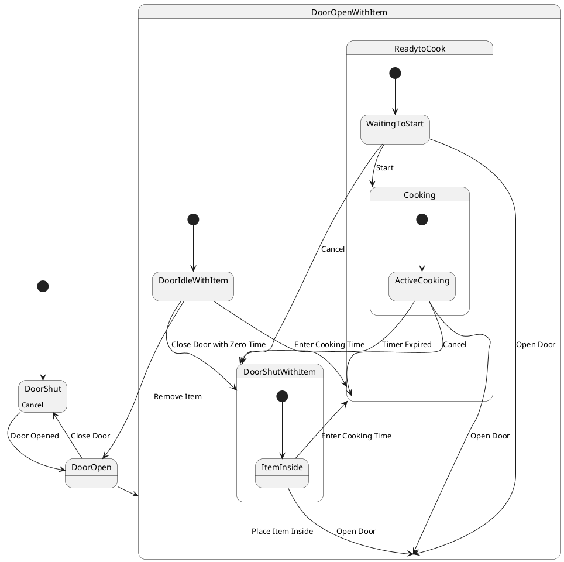

# Pair `0005`：NL + PlantUML STM0 + FCSTM STM0

[上一组 `0004`](../0004/README.md) | [返回 60 组索引](../../PAIR_INDEX.md) | [下一组 `0006`](../0006/README.md)

- LLM：`GPT-4o`
- 模型/场景：Microwave Oven Control with entry and <br> exit actions
- 作者输出阶段：`Result with Semantic Checking`
- 作者输出单元格：`AE7`；Excel row：`7`
- Phase-I fallback：`false`
- 相对 Phase-I 是否变化：`true`
- Phase-I PlantUML SHA-256：`0727625138b0bac74c9332b4af3c8e653f0721cb84e44628332b3bebd3308f77`
- NL SHA-256：`934e19bd4ae2a793c334fdcf486092d3aa20858f09ae892753ef87698feb061f`
- PlantUML SHA-256：`6dfdab20dd467253efdd23ee3b8973eaeb9296ef2502fd01d3287f84e10a2511`
- FCSTM SHA-256：`1fdefe68e0fce642781c6db42dd7948a9c7c1b702b9f22cbd4e3577e76ed6dfd`
- 结构裁决：`structure_preserved`
- source states / transitions：`10` / `19`
- mapped / blocked / silent drop：`19` / `0` / `0`
- final / lifecycle / body coverage：`0/0` / `0/0` / `1/1`
- concurrent region / separator coverage：`0/0` / `0/0`
- source normalization coverage：`0/0`
- official raw / validation：`state_diagram` / `state_diagram`
- official identity states / transitions：`10` / `19`
- official identity remaps：state `6` / transition endpoint `13`
- AST audit：`passed`
- FCSTM execution eligible：`false`
- Discover eligible：`false`
- 主 session 对读：完整对读：19 条微波炉迁移及 DoorShut body 全在；按官方 first-created identity，DoorShutWithItem、ReadytoCook、Cooking 被重映射成 DoorOpenWithItem 下的嵌套链，所有跨层退出与返回均由分段 trace 保存。
- 三个原始文件：[NL](./nl.txt) | [PlantUML](./plantuml.puml) | [FCSTM](./fcstm.fcstm)
- 审计入口：[canonical](../../canonical/llms_emp_feedback_final_0005.json) | [冻结 FCSTM](../../fcstm/llms_emp_feedback_final_0005.fcstm) | [case report](../../case_reports/llms_emp_feedback_final_0005.json) | [人工总账](../../MANUAL_REVIEW.md)

## 作者阶段 lineage

| stage | output cell | present | output SHA-256 | feedback | resolved |
|---|---|---|---|---|---|
| `phase_i_generation` | `I7` | `true` | `0727625138b0bac74c9332b4af3c8e653f0721cb84e44628332b3bebd3308f77` | - | - |
| `phase_ii_format` | `U7` | `false` | `-` | - | - |
| `phase_ii_grammar` | `Z7` | `true` | `5e029144ff6ac8853d1be33d3a3c3509f03f891fd59a538fce4191ee7b142151` | transition must connect two state<br> | YES |
| `phase_ii_semantic` | `AE7` | `true` | `6dfdab20dd467253efdd23ee3b8973eaeb9296ef2502fd01d3287f84e10a2511` | 1. Incorrect composite state usage.<br>2. interaction error | 1.0 |

## Official identity ledger

- status：`aligned`
- canonical / official states：`10` / `10`
- aligned transition endpoints：`19`

| source-parser identity | pinned PlantUML identity | raw ref | reason |
|---|---|---|---|
| `DoorShutWithItem` | `DoorOpenWithItem.DoorShutWithItem` | `llms_emp_feedback_final_0005.puml:line:18` | `official_link_endpoint_identity` |
| `ReadytoCook` | `DoorOpenWithItem.ReadytoCook` | `llms_emp_feedback_final_0005.puml:line:25` | `official_link_endpoint_identity` |
| `Cooking` | `DoorOpenWithItem.ReadytoCook.Cooking` | `llms_emp_feedback_final_0005.puml:line:33` | `official_link_endpoint_identity` |
| `DoorShutWithItem.ItemInside` | `DoorOpenWithItem.DoorShutWithItem.ItemInside` | `llms_emp_feedback_final_0005.puml:line:19` | `official_link_endpoint_identity` |
| `ReadytoCook.WaitingToStart` | `DoorOpenWithItem.ReadytoCook.WaitingToStart` | `llms_emp_feedback_final_0005.puml:line:26` | `official_link_endpoint_identity` |
| `Cooking.ActiveCooking` | `DoorOpenWithItem.ReadytoCook.Cooking.ActiveCooking` | `llms_emp_feedback_final_0005.puml:line:34` | `official_link_endpoint_identity` |

| transition | source before -> after | target before -> after | raw ref |
|---|---|---|---|
| `tr_0007` | `DoorOpenWithItem.DoorIdleWithItem` -> `DoorOpenWithItem.DoorIdleWithItem` | `DoorShutWithItem` -> `DoorOpenWithItem.DoorShutWithItem` | `llms_emp_feedback_final_0005.puml:line:14` |
| `tr_0008` | `DoorOpenWithItem.DoorIdleWithItem` -> `DoorOpenWithItem.DoorIdleWithItem` | `ReadytoCook` -> `DoorOpenWithItem.ReadytoCook` | `llms_emp_feedback_final_0005.puml:line:15` |
| `tr_0009` | `@initial:DoorShutWithItem` -> `@initial:DoorOpenWithItem.DoorShutWithItem` | `DoorShutWithItem.ItemInside` -> `DoorOpenWithItem.DoorShutWithItem.ItemInside` | `llms_emp_feedback_final_0005.puml:line:19` |
| `tr_0010` | `DoorShutWithItem.ItemInside` -> `DoorOpenWithItem.DoorShutWithItem.ItemInside` | `DoorOpenWithItem` -> `DoorOpenWithItem` | `llms_emp_feedback_final_0005.puml:line:21` |
| `tr_0011` | `DoorShutWithItem.ItemInside` -> `DoorOpenWithItem.DoorShutWithItem.ItemInside` | `ReadytoCook` -> `DoorOpenWithItem.ReadytoCook` | `llms_emp_feedback_final_0005.puml:line:22` |
| `tr_0012` | `@initial:ReadytoCook` -> `@initial:DoorOpenWithItem.ReadytoCook` | `ReadytoCook.WaitingToStart` -> `DoorOpenWithItem.ReadytoCook.WaitingToStart` | `llms_emp_feedback_final_0005.puml:line:26` |
| `tr_0013` | `ReadytoCook.WaitingToStart` -> `DoorOpenWithItem.ReadytoCook.WaitingToStart` | `DoorShutWithItem` -> `DoorOpenWithItem.DoorShutWithItem` | `llms_emp_feedback_final_0005.puml:line:28` |
| `tr_0014` | `ReadytoCook.WaitingToStart` -> `DoorOpenWithItem.ReadytoCook.WaitingToStart` | `DoorOpenWithItem` -> `DoorOpenWithItem` | `llms_emp_feedback_final_0005.puml:line:29` |
| `tr_0015` | `ReadytoCook.WaitingToStart` -> `DoorOpenWithItem.ReadytoCook.WaitingToStart` | `Cooking` -> `DoorOpenWithItem.ReadytoCook.Cooking` | `llms_emp_feedback_final_0005.puml:line:30` |
| `tr_0016` | `@initial:Cooking` -> `@initial:DoorOpenWithItem.ReadytoCook.Cooking` | `Cooking.ActiveCooking` -> `DoorOpenWithItem.ReadytoCook.Cooking.ActiveCooking` | `llms_emp_feedback_final_0005.puml:line:34` |
| `tr_0017` | `Cooking.ActiveCooking` -> `DoorOpenWithItem.ReadytoCook.Cooking.ActiveCooking` | `DoorOpenWithItem` -> `DoorOpenWithItem` | `llms_emp_feedback_final_0005.puml:line:36` |
| `tr_0018` | `Cooking.ActiveCooking` -> `DoorOpenWithItem.ReadytoCook.Cooking.ActiveCooking` | `DoorShutWithItem` -> `DoorOpenWithItem.DoorShutWithItem` | `llms_emp_feedback_final_0005.puml:line:37` |
| `tr_0019` | `Cooking.ActiveCooking` -> `DoorOpenWithItem.ReadytoCook.Cooking.ActiveCooking` | `ReadytoCook` -> `DoorOpenWithItem.ReadytoCook` | `llms_emp_feedback_final_0005.puml:line:38` |

## Source normalization ledger

本组没有 source-input normalization。

## Concurrent region ledger

本组没有 PlantUML orthogonal/concurrent region separator。

## Operational debt

| reason code | count |
|---|---:|
| `R45.DEBT.opaque_state_body_semantics` | 1 |
| `R45.DEBT.opaque_transition_label_semantics` | 14 |

## NL

```text
1. The microwave starts in the DoorShut state. From this state, the system can either remain in DoorShut if a Cancel action is performed or transition to the DoorOpen state when the door is opened.
2. When the Door Opened action occurs in the DoorShut state, the system transitions to the DoorOpen state. The door can be closed to return to the DoorShut state.
3. In the DoorOpen state, placing an item inside the microwave transitions the system to DoorOpenWithItem. If the item is removed, the system returns to DoorOpen.
4. From DoorOpenWithItem, the system can transition to DoorShutWithItem if the door is closed with zero time set or to ReadytoCook if cooking time is entered.
5. In the DoorShutWithItem state, opening the door transitions the system back to DoorOpenWithItem, while entering cooking time takes the system to ReadytoCook, where the cooking time is displayed and updated.
6. In the ReadytoCook state, if the Cancel action is performed, the system returns to DoorShutWithItem, canceling or updating the cooking time. If the door is opened, the system transitions to DoorOpenWithItem.
7. When the Start action is performed in ReadytoCook, the system transitions to the Cooking state, where the timer starts.
8. In the Cooking state, opening the door stops the timer and the system transitions to DoorOpenWithItem, while if the timer expires, the system moves to DoorShutWithItem. A Cancel action transitions the system back to ReadytoCook.
```

## 作者 Phase-II 最终 PlantUML STM0



## 转换后 FCSTM STM0

```fcstm
state llms_emp_feedback_final_0005 named "llms_emp_feedback_final_0005" {
    event Door_Opened named "Door Opened";
    event Close_Door named "Close Door";
    event Place_Item_Inside named "Place Item Inside";
    event Remove_Item named "Remove Item";
    event Close_Door_with_Zero_Time named "Close Door with Zero Time";
    event Enter_Cooking_Time named "Enter Cooking Time";
    event Open_Door named "Open Door";
    event Cancel named "Cancel";
    event Start named "Start";
    event Timer_Expired named "Timer Expired";
    state DoorOpenWithItem named "DoorOpenWithItem" {
        state DoorShutWithItem named "DoorShutWithItem" {
            state ItemInside named "ItemInside";
            [*] -> ItemInside;
            ItemInside -> [*] : /Open_Door;
            ItemInside -> [*] : /Enter_Cooking_Time;
        }
        state ReadytoCook named "ReadytoCook" {
            state Cooking named "Cooking" {
                state ActiveCooking named "ActiveCooking";
                [*] -> ActiveCooking;
                ActiveCooking -> [*] : /Open_Door;
                ActiveCooking -> [*] : /Timer_Expired;
                ActiveCooking -> [*] : /Cancel;
            }
            state WaitingToStart named "WaitingToStart";
            [*] -> WaitingToStart;
            WaitingToStart -> [*] : /Cancel;
            WaitingToStart -> [*] : /Open_Door;
            WaitingToStart -> Cooking : /Start;
            !Cooking -> [*] : /Open_Door;
            !Cooking -> [*] : /Timer_Expired;
            !Cooking -> [*] : /Cancel;
        }
        state DoorIdleWithItem named "DoorIdleWithItem";
        [*] -> DoorIdleWithItem;
        DoorIdleWithItem -> [*] : /Remove_Item;
        DoorIdleWithItem -> DoorShutWithItem : /Close_Door_with_Zero_Time;
        DoorIdleWithItem -> ReadytoCook : /Enter_Cooking_Time;
        !DoorShutWithItem -> [*] : /Open_Door;
        DoorShutWithItem -> ReadytoCook : /Enter_Cooking_Time;
        ReadytoCook -> DoorShutWithItem : /Cancel;
        !ReadytoCook -> [*] : /Open_Door;
        !ReadytoCook -> [*] : /Open_Door;
        ReadytoCook -> DoorShutWithItem : /Timer_Expired;
        ReadytoCook -> ReadytoCook : /Cancel;
    }
    state DoorShut named "DoorShut\n[PlantUML body] Cancel";
    state DoorOpen named "DoorOpen";
    [*] -> DoorShut;
    DoorShut -> DoorOpen : /Door_Opened;
    DoorOpen -> DoorShut : /Close_Door;
    DoorOpen -> DoorOpenWithItem : /Place_Item_Inside;
    DoorOpenWithItem -> DoorOpen : /Remove_Item;
    DoorOpenWithItem -> DoorOpenWithItem : /Open_Door;
    DoorOpenWithItem -> DoorOpenWithItem : /Open_Door;
    DoorOpenWithItem -> DoorOpenWithItem : /Open_Door;
}
```

[上一组 `0004`](../0004/README.md) | [返回 60 组索引](../../PAIR_INDEX.md) | [下一组 `0006`](../0006/README.md)
