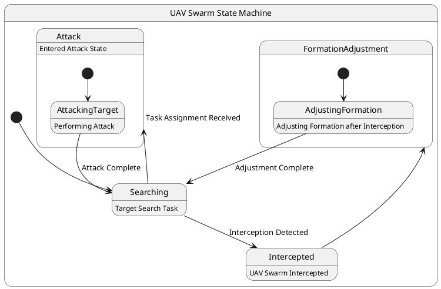

# Pair `0006`：NL + PlantUML STM0 + FCSTM STM0

[上一组 `0005`](../0005/README.md) | [返回 60 组索引](../../PAIR_INDEX.md) | [下一组 `0007`](../0007/README.md)

- LLM：`GPT-4o`
- 模型/场景：UAV swarm state machine diagram
- 作者输出阶段：`Result with Semantic Checking`
- 作者输出单元格：`AE8`；Excel row：`8`
- Phase-I fallback：`false`
- 相对 Phase-I 是否变化：`true`
- Phase-I PlantUML SHA-256：`3dfdda2a0f6144429bd81717778a05f021bd455cad0efa0f29192f6a041b0952`
- NL SHA-256：`a01c022f5380700b6c13800497291640b4d64abbadce1d8984be0c14880ebeb3`
- PlantUML SHA-256：`ccec84b8ca1817cde5454b29b82b32dd353123b547fea8240e3d438be88fd667`
- FCSTM SHA-256：`7ce7663fdd2285eb4ade0658c22afa6940efe248d49d0f584682af5ea639ad1f`
- 结构裁决：`structure_preserved`
- source states / transitions：`7` / `8`
- mapped / blocked / silent drop：`8` / `0` / `0`
- final / lifecycle / body coverage：`0/0` / `0/0` / `5/5`
- concurrent region / separator coverage：`0/0` / `0/0`
- source normalization coverage：`0/0`
- official raw / validation：`state_diagram` / `state_diagram`
- official identity states / transitions：`7` / `8`
- official identity remaps：state `0` / transition endpoint `0`
- AST audit：`passed`
- FCSTM execution eligible：`false`
- Discover eligible：`false`
- 主 session 对读：完整对读：UAV 搜索、拦截、编队调整和攻击的 7 状态、8 条边与 5 个 body 全保留；根层没有 source initial，FCSTM 明示 UnspecifiedInitial，不自行选择 UAVSwarmStateMachine。
- 三个原始文件：[NL](./nl.txt) | [PlantUML](./plantuml.puml) | [FCSTM](./fcstm.fcstm)
- 审计入口：[canonical](../../canonical/llms_emp_feedback_final_0006.json) | [冻结 FCSTM](../../fcstm/llms_emp_feedback_final_0006.fcstm) | [case report](../../case_reports/llms_emp_feedback_final_0006.json) | [人工总账](../../MANUAL_REVIEW.md)

## 作者阶段 lineage

| stage | output cell | present | output SHA-256 | feedback | resolved |
|---|---|---|---|---|---|
| `phase_i_generation` | `I8` | `true` | `3dfdda2a0f6144429bd81717778a05f021bd455cad0efa0f29192f6a041b0952` | - | - |
| `phase_ii_format` | `U8` | `false` | `-` | - | - |
| `phase_ii_grammar` | `Z8` | `false` | `-` | - | - |
| `phase_ii_semantic` | `AE8` | `true` | `ccec84b8ca1817cde5454b29b82b32dd353123b547fea8240e3d438be88fd667` | 1.missing regions<br>2. interaction error | - |

## Official identity ledger

- status：`aligned`
- canonical / official states：`7` / `7`
- aligned transition endpoints：`8`

本组 state identity 无需重映射。

本组 transition endpoint 无需重映射。

## Source normalization ledger

本组没有 source-input normalization。

## Concurrent region ledger

本组没有 PlantUML orthogonal/concurrent region separator。

## Operational debt

| reason code | count |
|---|---:|
| `R45.DEBT.missing_explicit_initial` | 1 |
| `R45.DEBT.opaque_state_body_semantics` | 5 |
| `R45.DEBT.opaque_transition_label_semantics` | 4 |

## NL

```text
1 This state machine model describes the state transitions of a UAV swarm.
2 Before the mission is completed, the UAV swarm continuously performs target search tasks, during which it operates within three different state areas.
3 When the UAV swarm is intercepted, it transitions to the formation adjustment state.
4 During flight, if task assignment information is received, it enters the attack state. After completing the attack, the number of UAVs in the swarm decreases accordingly.
```

## 作者 Phase-II 最终 PlantUML STM0



## 转换后 FCSTM STM0

```fcstm
state llms_emp_feedback_final_0006 named "llms_emp_feedback_final_0006" {
    event Interception_Detected named "Interception Detected";
    event Task_Assignment_Received named "Task Assignment Received";
    event Adjustment_Complete named "Adjustment Complete";
    event Attack_Complete named "Attack Complete";
    state UnspecifiedInitial named "Unspecified initial";
    state UAVSwarmStateMachine named "UAV Swarm State Machine" {
        state FormationAdjustment named "FormationAdjustment" {
            state AdjustingFormation named "AdjustingFormation\n[PlantUML body] Adjusting Formation after Interception";
            [*] -> AdjustingFormation;
            AdjustingFormation -> [*] : /Adjustment_Complete;
        }
        state Attack named "Attack\n[PlantUML body] Entered Attack State" {
            state AttackingTarget named "AttackingTarget\n[PlantUML body] Performing Attack";
            [*] -> AttackingTarget;
            AttackingTarget -> [*] : /Attack_Complete;
        }
        state Searching named "Searching\n[PlantUML body] Target Search Task";
        state Intercepted named "Intercepted\n[PlantUML body] UAV Swarm Intercepted";
        [*] -> Searching;
        Searching -> Intercepted : /Interception_Detected;
        Searching -> Attack : /Task_Assignment_Received;
        FormationAdjustment -> Searching : /Adjustment_Complete;
        Attack -> Searching : /Attack_Complete;
        Intercepted -> FormationAdjustment;
    }
    [*] -> UnspecifiedInitial;
}
```

[上一组 `0005`](../0005/README.md) | [返回 60 组索引](../../PAIR_INDEX.md) | [下一组 `0007`](../0007/README.md)
