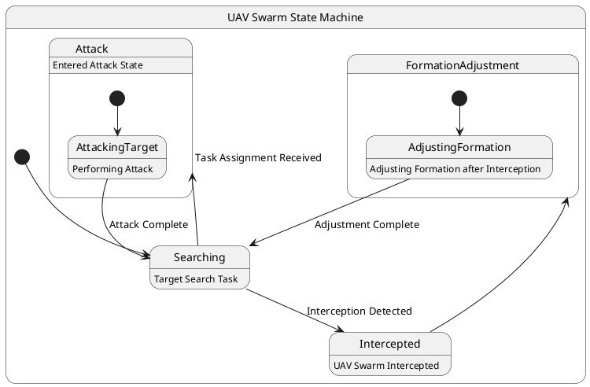

# Pair `0006`：NL + PlantUML STM0 + FCSTM STM0

[上一组 `0005`](../0005/README.md) | [返回 60 组索引](../../PAIR_INDEX.md) | [下一组 `0007`](../0007/README.md)

- LLM：`GPT-4o`
- 模型/场景：UAV swarm state machine diagram
- 作者输出阶段：`Result with Semantic Checking`
- 作者输出单元格：`AE8`；Excel row：`8`
- Phase-I fallback：`false`
- 相对 Phase-I 是否变化：`true`
- Phase-I PlantUML SHA-256：`3dfdda2a0f6144429bd81717778a05f021bd455cad0efa0f29192f6a041b0952`
- NL SHA-256：`a01c022f5380700b6c13800497291640b4d64abbadce1d8984be0c14880ebeb3`
- PlantUML SHA-256：`ccec84b8ca1817cde5454b29b82b32dd353123b547fea8240e3d438be88fd667`
- FCSTM SHA-256：`7ce7663fdd2285eb4ade0658c22afa6940efe248d49d0f584682af5ea639ad1f`
- review subject SHA-256：`2e892c20bcf1471422078729b10410350a36e4bc3861ec1f52fbcc84a33daae8`
- working contract SHA-256：`6a2510df99c74db3580d41a3ac680bdc7eeffa86e8f44cb598e0806d6f848aa9`
- 结构裁决：`structure_preserved`
- source states / transitions：`7` / `8`
- mapped / blocked / silent drop：`8` / `0` / `0`
- final / lifecycle / body coverage：`0/0` / `0/0` / `5/5`
- concurrent region / separator coverage：`0/0` / `0/0`
- source normalization coverage：`0/0`
- official raw / validation：`state_diagram` / `state_diagram`
- official identity states / transitions：`7` / `8`
- official identity remaps：state `0` / transition endpoint `0`
- AST audit：`passed`
- legacy whole-model FCSTM execution / Discover：`false` / `false`
- working bundle usage gate：`discover_input_with_capability_mask`
- ownership source / compiler / agent：`20` / `17` / `0`
- source macro / positive identity trace / conversion boundary trace：`13` / `20` / `0`
- capability source-static / simulation / transition-trace：`eligible_with_exclusions` / `ineligible` / `ineligible`
- compiler-only diagnostic policy：`rejected_conversion_artifact`；main-result conversion artifact limit：`0`
- 主 session 对读：`pass`；ownership/macro/capability 均为 `pass`；Case 0006 passes conversion-attribution review. This does not assert NL/PlantUML correctness or runtime equivalence; authored defects remain eligible for later source-grounded Discover. No conversion-specific blocker was found in the exact reviewed occurrences.
- source anchors：`source-ref:llms_emp_feedback_final_0006.puml:line:2\|state "UAV Swarm State Machine" as UAVSwarmStateMachine {, source-ref:llms_emp_feedback_final_0006.puml:line:7\|Searching --> Intercepted : Interception Detected`；FCSTM anchors：`element-ref:source:state:UAVSwarmStateMachine@line:7\|state UAVSwarmStateMachine named "UAV Swarm State Machine" {, element-ref:compiler:transition_segment:tr_0002:segment:1@line:21\|Searching -> Intercepted : /Interception_Detected;`
- 三个原始文件：[NL](./nl.txt) | [PlantUML](./plantuml.puml) | [FCSTM](./fcstm.fcstm)
- 审计入口：[canonical](../../canonical/llms_emp_feedback_final_0006.json) | [冻结 FCSTM](../../fcstm/llms_emp_feedback_final_0006.fcstm) | [case report](../../case_reports/llms_emp_feedback_final_0006.json) | [working contract](../../working_contracts/llms_emp_feedback_final_0006.json) | [source trace](../../source_traces/llms_emp_feedback_final_0006.json) | [人工总账](../../MANUAL_REVIEW.md)

## 主 session 三方语义对应

| projection | assessment | NL anchor | PlantUML anchor | FCSTM anchor | source roots | compiler members | rationale |
|---|---|---|---|---|---|---|---|
| `direct` | `preserved` | 1 This state machine model describes the state transitions of a UAV swarm. | source-ref:llms_emp_feedback_final_0006.puml:line:2\|state "UAV Swarm State Machine" as UAVSwarmStateMachine { | element-ref:source:state:UAVSwarmStateMachine@line:7\|state UAVSwarmStateMachine named "UAV Swarm State Machine" { | source:state:UAVSwarmStateMachine | - | Case 0006 binds source:state:UAVSwarmStateMachine to the exact authored occurrence 'state "UAV Swarm State Machine" as UAVSwarmStateMachine {'; it is present as a direct FCSTM state projection with the same source identity and parent relation. |
| `macro` | `preserved_with_exclusions` | intercepted | source-ref:llms_emp_feedback_final_0006.puml:line:7\|Searching --> Intercepted : Interception Detected | element-ref:compiler:transition_segment:tr_0002:segment:1@line:21\|Searching -> Intercepted : /Interception_Detected; | source:transition:tr_0002 | compiler:transition_segment:tr_0002:segment:1 | Case 0006 binds source:transition:tr_0002 to the exact authored occurrence 'Searching --> Intercepted : Interception Detected'; it is present as a source-owned transition root whose cited FCSTM line belongs to a protected compiler macro; the raw label remains opaque. |

## Risk occurrence 第二遍复核

| obligation | risk tag | assessment | PlantUML evidence | FCSTM evidence | ownership evidence | rationale |
|---|---|---|---|---|---|---|
| `review:multi_segment_macro:0001:tr_0005` | `multi_segment_macro` | `compiler_artifact_excluded` | source-ref:llms_emp_feedback_final_0006.puml:line:13\|AdjustingFormation --> Searching : Adjustment Complete | element-ref:compiler:transition_segment:tr_0005:segment:1@line:11\|AdjustingFormation -> [*] : /Adjustment_Complete;, element-ref:compiler:transition_segment:tr_0005:segment:2@line:23\|FormationAdjustment -> Searching : /Adjustment_Complete; | compiler:transition_segment:tr_0005:segment:1, compiler:transition_segment:tr_0005:segment:2, source:transition:tr_0005 | Case 0006 risk multi_segment_macro occurrence review:multi_segment_macro:0001:tr_0005: The single authored transition remains one source-owned semantic root; all bound FCSTM segments are protected compiler artifacts and cannot become repair targets. |
| `review:multi_segment_macro:0002:tr_0007` | `multi_segment_macro` | `compiler_artifact_excluded` | source-ref:llms_emp_feedback_final_0006.puml:line:19\|AttackingTarget --> Searching : Attack Complete | element-ref:compiler:transition_segment:tr_0007:segment:1@line:16\|AttackingTarget -> [*] : /Attack_Complete;, element-ref:compiler:transition_segment:tr_0007:segment:2@line:24\|Attack -> Searching : /Attack_Complete; | compiler:transition_segment:tr_0007:segment:1, compiler:transition_segment:tr_0007:segment:2, source:transition:tr_0007 | Case 0006 risk multi_segment_macro occurrence review:multi_segment_macro:0002:tr_0007: The single authored transition remains one source-owned semantic root; all bound FCSTM segments are protected compiler artifacts and cannot become repair targets. |
| `review:synthetic_state:0003:001-UnspecifiedInitial` | `synthetic_state` | `compiler_artifact_excluded` | source-ref:llms_emp_feedback_final_0006.puml:line:2\|state "UAV Swarm State Machine" as UAVSwarmStateMachine { | element-ref:compiler:state:llms_emp_feedback_final_0006.UnspecifiedInitial@line:6\|state UnspecifiedInitial named "Unspecified initial";, element-ref:source:state:UAVSwarmStateMachine@line:7\|state UAVSwarmStateMachine named "UAV Swarm State Machine" { | compiler:state:llms_emp_feedback_final_0006.UnspecifiedInitial, source:state:UAVSwarmStateMachine | Case 0006 risk synthetic_state occurrence review:synthetic_state:0003:001-UnspecifiedInitial: The helper state is a protected compiler-owned projection for a source structural fact; diagnostics on the helper itself are conversion artifacts. |

## 作者阶段 lineage

| stage | output cell | present | output SHA-256 | feedback | resolved |
|---|---|---|---|---|---|
| `phase_i_generation` | `I8` | `true` | `3dfdda2a0f6144429bd81717778a05f021bd455cad0efa0f29192f6a041b0952` | - | - |
| `phase_ii_format` | `U8` | `false` | `-` | - | - |
| `phase_ii_grammar` | `Z8` | `false` | `-` | - | - |
| `phase_ii_semantic` | `AE8` | `true` | `ccec84b8ca1817cde5454b29b82b32dd353123b547fea8240e3d438be88fd667` | 1.missing regions<br>2. interaction error | - |

## Official identity ledger

- status：`aligned`
- canonical / official states：`7` / `7`
- aligned transition endpoints：`8`

本组 state identity 无需重映射。

本组 transition endpoint 无需重映射。

## Source normalization ledger

本组没有 source-input normalization。

## Concurrent region ledger

本组没有 PlantUML orthogonal/concurrent region separator。

## Operational debt

| reason code | count |
|---|---:|
| `R45.DEBT.missing_explicit_initial` | 1 |
| `R45.DEBT.opaque_state_body_semantics` | 5 |
| `R45.DEBT.opaque_transition_label_semantics` | 4 |

## NL

```text
1 This state machine model describes the state transitions of a UAV swarm.
2 Before the mission is completed, the UAV swarm continuously performs target search tasks, during which it operates within three different state areas.
3 When the UAV swarm is intercepted, it transitions to the formation adjustment state.
4 During flight, if task assignment information is received, it enters the attack state. After completing the attack, the number of UAVs in the swarm decreases accordingly.
```

## 作者 Phase-II 最终 PlantUML STM0



## 转换后 FCSTM STM0

```fcstm
state llms_emp_feedback_final_0006 named "llms_emp_feedback_final_0006" {
    event Interception_Detected named "Interception Detected";
    event Task_Assignment_Received named "Task Assignment Received";
    event Adjustment_Complete named "Adjustment Complete";
    event Attack_Complete named "Attack Complete";
    state UnspecifiedInitial named "Unspecified initial";
    state UAVSwarmStateMachine named "UAV Swarm State Machine" {
        state FormationAdjustment named "FormationAdjustment" {
            state AdjustingFormation named "AdjustingFormation\n[PlantUML body] Adjusting Formation after Interception";
            [*] -> AdjustingFormation;
            AdjustingFormation -> [*] : /Adjustment_Complete;
        }
        state Attack named "Attack\n[PlantUML body] Entered Attack State" {
            state AttackingTarget named "AttackingTarget\n[PlantUML body] Performing Attack";
            [*] -> AttackingTarget;
            AttackingTarget -> [*] : /Attack_Complete;
        }
        state Searching named "Searching\n[PlantUML body] Target Search Task";
        state Intercepted named "Intercepted\n[PlantUML body] UAV Swarm Intercepted";
        [*] -> Searching;
        Searching -> Intercepted : /Interception_Detected;
        Searching -> Attack : /Task_Assignment_Received;
        FormationAdjustment -> Searching : /Adjustment_Complete;
        Attack -> Searching : /Attack_Complete;
        Intercepted -> FormationAdjustment;
    }
    [*] -> UnspecifiedInitial;
}
```

[上一组 `0005`](../0005/README.md) | [返回 60 组索引](../../PAIR_INDEX.md) | [下一组 `0007`](../0007/README.md)
