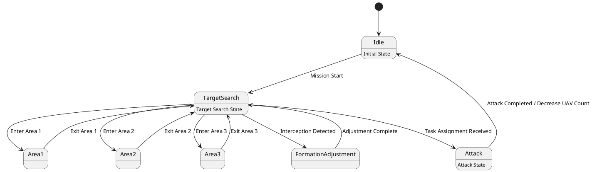

# Pair `0006`：NL + PlantUML STM0 + FCSTM STM0

[上一组 `0005`](../0005/README.md) | [返回 60 组索引](../../PAIR_INDEX.md) | [下一组 `0007`](../0007/README.md)

- LLM：`GPT-4o`
- 模型/场景：UAV swarm state machine diagram
- NL SHA-256：`a01c022f5380700b6c13800497291640b4d64abbadce1d8984be0c14880ebeb3`
- PlantUML SHA-256：`3dfdda2a0f6144429bd81717778a05f021bd455cad0efa0f29192f6a041b0952`
- FCSTM SHA-256：`4a1c8fc256e8ee9944712ba58387d41762b8e9b77436b09b9896506c39292d61`
- 结构裁决：`structure_preserved`
- FCSTM execution eligible：`false`
- Discover eligible：`false`
- 主 session 对读：UAV flat graph 的 7 state、initial、11 条普通迁移和三个 body 齐。
- 三个原始文件：[NL](./nl.txt) | [PlantUML](./plantuml.puml) | [FCSTM](./fcstm.fcstm)
- 审计入口：[canonical](../../canonical/llms_emp_stm_results_0006.json) | [冻结 FCSTM](../../fcstm/llms_emp_stm_results_0006.fcstm) | [case report](../../case_reports/llms_emp_stm_results_0006.json) | [人工总账](../../MANUAL_REVIEW.md)

## NL

```text
1 This state machine model describes the state transitions of a UAV swarm.
2 Before the mission is completed, the UAV swarm continuously performs target search tasks, during which it operates within three different state areas.
3 When the UAV swarm is intercepted, it transitions to the formation adjustment state.
4 During flight, if task assignment information is received, it enters the attack state. After completing the attack, the number of UAVs in the swarm decreases accordingly.
```

## 原装 PlantUML STM0



## 转换后 FCSTM STM0

```fcstm
state llms_emp_stm_results_0006 named "llms_emp_stm_results_0006" {
    event Mission_Start named "Mission Start";
    event Enter_Area_1 named "Enter Area 1";
    event Enter_Area_2 named "Enter Area 2";
    event Enter_Area_3 named "Enter Area 3";
    event Exit_Area_1 named "Exit Area 1";
    event Exit_Area_2 named "Exit Area 2";
    event Exit_Area_3 named "Exit Area 3";
    event Interception_Detected named "Interception Detected";
    event Task_Assignment_Received named "Task Assignment Received";
    event Attack_Completed_Decrease_UAV_Count named "Attack Completed / Decrease UAV Count";
    event Adjustment_Complete named "Adjustment Complete";
    state Idle named "Idle\n[PlantUML body] Initial State";
    state TargetSearch named "TargetSearch\n[PlantUML body] Target Search State";
    state Attack named "Attack\n[PlantUML body] Attack State";
    state Area1 named "Area1";
    state Area2 named "Area2";
    state Area3 named "Area3";
    state FormationAdjustment named "FormationAdjustment";
    [*] -> Idle;
    Idle -> TargetSearch : /Mission_Start;
    TargetSearch -> Area1 : /Enter_Area_1;
    TargetSearch -> Area2 : /Enter_Area_2;
    TargetSearch -> Area3 : /Enter_Area_3;
    Area1 -> TargetSearch : /Exit_Area_1;
    Area2 -> TargetSearch : /Exit_Area_2;
    Area3 -> TargetSearch : /Exit_Area_3;
    TargetSearch -> FormationAdjustment : /Interception_Detected;
    TargetSearch -> Attack : /Task_Assignment_Received;
    Attack -> Idle : /Attack_Completed_Decrease_UAV_Count;
    FormationAdjustment -> TargetSearch : /Adjustment_Complete;
}
```

[上一组 `0005`](../0005/README.md) | [返回 60 组索引](../../PAIR_INDEX.md) | [下一组 `0007`](../0007/README.md)
