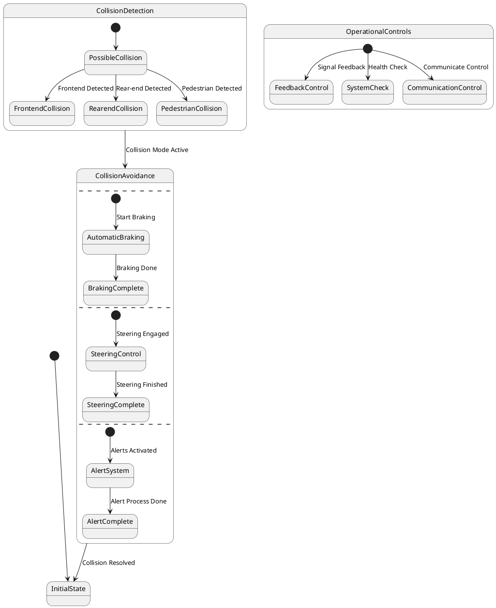

# Pair `0007`：NL + PlantUML STM0 + FCSTM STM0

[上一组 `0006`](../0006/README.md) | [返回 60 组索引](../../PAIR_INDEX.md) | [下一组 `0008`](../0008/README.md)

- LLM：`GPT-4o`
- 模型/场景：Collision avoidance sub-machine state diagram
- 作者输出阶段：`Result with Semantic Checking`
- 作者输出单元格：`AE9`；Excel row：`9`
- Phase-I fallback：`false`
- 相对 Phase-I 是否变化：`true`
- Phase-I PlantUML SHA-256：`2e95dc642f73f0d546f8fc356d6ac3a03283887a693a8c56797c1199da64d2b2`
- NL SHA-256：`49854d044ad99f16a710021500f5e972da93b27635a41144d9b91d32444c0f63`
- PlantUML SHA-256：`b703cade3844700c2705caa20001f515b16438ca308f973c7e4caf2f263478f4`
- FCSTM SHA-256：`6f0614a94965b4aa2b00efa13598575809eb6fca5396ae4d38624eeb9b4fbf1d`
- review subject SHA-256：`d2283e40bc3ff4f691399bf1c785376f544d9376b2125f61c3792d93692fe25a`
- working contract SHA-256：`8edb66844fb74fa309a4386c08f3761f6a801ff2794b577b1a81b9f6c3f7bcc6`
- 结构裁决：`structure_preserved`
- source states / transitions：`17` / `16`
- mapped / blocked / silent drop：`16` / `0` / `0`
- final / lifecycle / body coverage：`0/0` / `0/0` / `0/0`
- concurrent region / separator coverage：`4/4` / `3/3`
- source normalization coverage：`0/0`
- official raw / validation：`state_diagram` / `state_diagram`
- official identity states / transitions：`17` / `16`
- official identity remaps：state `0` / transition endpoint `0`
- AST audit：`passed`
- legacy whole-model FCSTM execution / Discover：`false` / `false`
- working bundle usage gate：`discover_input_with_capability_mask`
- ownership source / compiler / agent：`37` / `43` / `0`
- source macro / positive identity trace / conversion boundary trace：`20` / `37` / `0`
- capability source-static / simulation / transition-trace：`eligible_with_exclusions` / `ineligible` / `ineligible`
- compiler-only diagnostic policy：`rejected_conversion_artifact`；main-result conversion artifact limit：`0`
- 主 session 对读：`pass`；ownership/macro/capability 均为 `pass`；Case 0007 passes conversion-attribution review. This does not assert NL/PlantUML correctness or runtime equivalence; authored defects remain eligible for later source-grounded Discover. No conversion-specific blocker was found in the exact reviewed occurrences.
- source anchors：`source-ref:llms_emp_feedback_final_0007.puml:line:4\|state CollisionDetection {, source-ref:llms_emp_feedback_final_0007.puml:line:6\|PossibleCollision --> FrontendCollision : Frontend Detected`；FCSTM anchors：`element-ref:source:state:CollisionDetection@line:16\|state CollisionDetection named "CollisionDetection" {, element-ref:compiler:transition_segment:tr_0003:segment:1@line:22\|PossibleCollision -> FrontendCollision : /Frontend_Detected;`
- 三个原始文件：[NL](./nl.txt) | [PlantUML](./plantuml.puml) | [FCSTM](./fcstm.fcstm)
- 审计入口：[canonical](../../canonical/llms_emp_feedback_final_0007.json) | [冻结 FCSTM](../../fcstm/llms_emp_feedback_final_0007.fcstm) | [case report](../../case_reports/llms_emp_feedback_final_0007.json) | [working contract](../../working_contracts/llms_emp_feedback_final_0007.json) | [source trace](../../source_traces/llms_emp_feedback_final_0007.json) | [人工总账](../../MANUAL_REVIEW.md)

## 主 session 三方语义对应

| projection | assessment | NL anchor | PlantUML anchor | FCSTM anchor | source roots | compiler members | rationale |
|---|---|---|---|---|---|---|---|
| `direct` | `preserved` | There are three region in this diagram | source-ref:llms_emp_feedback_final_0007.puml:line:4\|state CollisionDetection { | element-ref:source:state:CollisionDetection@line:16\|state CollisionDetection named "CollisionDetection" { | source:state:CollisionDetection | - | Case 0007 binds source:state:CollisionDetection to the exact authored occurrence 'state CollisionDetection {'; it is present as a direct FCSTM state projection with the same source identity and parent relation. |
| `macro` | `preserved_with_exclusions` | This sub-machine becomes active when a possible frontend collision, rear-end collision or collision with pedestrian is | source-ref:llms_emp_feedback_final_0007.puml:line:6\|PossibleCollision --> FrontendCollision : Frontend Detected | element-ref:compiler:transition_segment:tr_0003:segment:1@line:22\|PossibleCollision -> FrontendCollision : /Frontend_Detected; | source:transition:tr_0003 | compiler:transition_segment:tr_0003:segment:1 | Case 0007 binds source:transition:tr_0003 to the exact authored occurrence 'PossibleCollision --> FrontendCollision : Frontend Detected'; it is present as a source-owned transition root whose cited FCSTM line belongs to a protected compiler macro; the raw label remains opaque. |

## Risk occurrence 第二遍复核

| obligation | risk tag | assessment | PlantUML evidence | FCSTM evidence | ownership evidence | rationale |
|---|---|---|---|---|---|---|
| `review:multi_segment_macro:0001:tr_0006` | `multi_segment_macro` | `compiler_artifact_excluded` | source-ref:llms_emp_feedback_final_0007.puml:line:13\|[*] --> AutomaticBraking : Start Braking | element-ref:compiler:state:llms_emp_feedback_final_0007.CollisionAvoidance.InitialWaittr_0006@line:33\|state InitialWaittr_0006 named "Awaiting initial event: Start Braking";, element-ref:compiler:transition_segment:tr_0006:segment:1@line:36\|[*] -> InitialWaittr_0006;, element-ref:compiler:transition_segment:tr_0006:segment:2@line:37\|InitialWaittr_0006 -> AutomaticBraking : /Start_Braking; | compiler:state:llms_emp_feedback_final_0007.CollisionAvoidance.InitialWaittr_0006, compiler:transition_segment:tr_0006:segment:1, compiler:transition_segment:tr_0006:segment:2, source:transition:tr_0006 | Case 0007 risk multi_segment_macro occurrence review:multi_segment_macro:0001:tr_0006: The single authored transition remains one source-owned semantic root; all bound FCSTM segments are protected compiler artifacts and cannot become repair targets. |
| `review:multi_segment_macro:0002:tr_0008` | `multi_segment_macro` | `compiler_artifact_excluded` | source-ref:llms_emp_feedback_final_0007.puml:line:17\|[*] --> SteeringControl : Steering Engaged | element-ref:compiler:state:llms_emp_feedback_final_0007.CollisionAvoidance.InitialWaittr_0008@line:34\|state InitialWaittr_0008 named "Awaiting initial event: Steering Engaged";, element-ref:compiler:transition_segment:tr_0008:segment:1@line:39\|[*] -> InitialWaittr_0008;, element-ref:compiler:transition_segment:tr_0008:segment:2@line:40\|InitialWaittr_0008 -> SteeringControl : /Steering_Engaged; | compiler:state:llms_emp_feedback_final_0007.CollisionAvoidance.InitialWaittr_0008, compiler:transition_segment:tr_0008:segment:1, compiler:transition_segment:tr_0008:segment:2, source:transition:tr_0008 | Case 0007 risk multi_segment_macro occurrence review:multi_segment_macro:0002:tr_0008: The single authored transition remains one source-owned semantic root; all bound FCSTM segments are protected compiler artifacts and cannot become repair targets. |
| `review:multi_segment_macro:0003:tr_0010` | `multi_segment_macro` | `compiler_artifact_excluded` | source-ref:llms_emp_feedback_final_0007.puml:line:21\|[*] --> AlertSystem : Alerts Activated | element-ref:compiler:state:llms_emp_feedback_final_0007.CollisionAvoidance.InitialWaittr_0010@line:35\|state InitialWaittr_0010 named "Awaiting initial event: Alerts Activated";, element-ref:compiler:transition_segment:tr_0010:segment:1@line:42\|[*] -> InitialWaittr_0010;, element-ref:compiler:transition_segment:tr_0010:segment:2@line:43\|InitialWaittr_0010 -> AlertSystem : /Alerts_Activated; | compiler:state:llms_emp_feedback_final_0007.CollisionAvoidance.InitialWaittr_0010, compiler:transition_segment:tr_0010:segment:1, compiler:transition_segment:tr_0010:segment:2, source:transition:tr_0010 | Case 0007 risk multi_segment_macro occurrence review:multi_segment_macro:0003:tr_0010: The single authored transition remains one source-owned semantic root; all bound FCSTM segments are protected compiler artifacts and cannot become repair targets. |
| `review:multi_segment_macro:0004:tr_0012` | `multi_segment_macro` | `compiler_artifact_excluded` | source-ref:llms_emp_feedback_final_0007.puml:line:26\|[*] --> FeedbackControl : Signal Feedback | element-ref:compiler:state:llms_emp_feedback_final_0007.OperationalControls.InitialWaittr_0012@line:50\|state InitialWaittr_0012 named "Awaiting initial event: Signal Feedback";, element-ref:compiler:transition_segment:tr_0012:segment:1@line:53\|[*] -> InitialWaittr_0012;, element-ref:compiler:transition_segment:tr_0012:segment:2@line:54\|InitialWaittr_0012 -> FeedbackControl : /Signal_Feedback; | compiler:state:llms_emp_feedback_final_0007.OperationalControls.InitialWaittr_0012, compiler:transition_segment:tr_0012:segment:1, compiler:transition_segment:tr_0012:segment:2, source:transition:tr_0012 | Case 0007 risk multi_segment_macro occurrence review:multi_segment_macro:0004:tr_0012: The single authored transition remains one source-owned semantic root; all bound FCSTM segments are protected compiler artifacts and cannot become repair targets. |
| `review:multi_segment_macro:0005:tr_0013` | `multi_segment_macro` | `compiler_artifact_excluded` | source-ref:llms_emp_feedback_final_0007.puml:line:27\|[*] --> SystemCheck : Health Check | element-ref:compiler:state:llms_emp_feedback_final_0007.OperationalControls.InitialWaittr_0013@line:51\|state InitialWaittr_0013 named "Awaiting initial event: Health Check";, element-ref:compiler:transition_segment:tr_0013:segment:1@line:55\|[*] -> InitialWaittr_0013;, element-ref:compiler:transition_segment:tr_0013:segment:2@line:56\|InitialWaittr_0013 -> SystemCheck : /Health_Check; | compiler:state:llms_emp_feedback_final_0007.OperationalControls.InitialWaittr_0013, compiler:transition_segment:tr_0013:segment:1, compiler:transition_segment:tr_0013:segment:2, source:transition:tr_0013 | Case 0007 risk multi_segment_macro occurrence review:multi_segment_macro:0005:tr_0013: The single authored transition remains one source-owned semantic root; all bound FCSTM segments are protected compiler artifacts and cannot become repair targets. |
| `review:multi_segment_macro:0006:tr_0014` | `multi_segment_macro` | `compiler_artifact_excluded` | source-ref:llms_emp_feedback_final_0007.puml:line:28\|[*] --> CommunicationControl : Communicate Control | element-ref:compiler:state:llms_emp_feedback_final_0007.OperationalControls.InitialWaittr_0014@line:52\|state InitialWaittr_0014 named "Awaiting initial event: Communicate Control";, element-ref:compiler:transition_segment:tr_0014:segment:1@line:57\|[*] -> InitialWaittr_0014;, element-ref:compiler:transition_segment:tr_0014:segment:2@line:58\|InitialWaittr_0014 -> CommunicationControl : /Communicate_Control; | compiler:state:llms_emp_feedback_final_0007.OperationalControls.InitialWaittr_0014, compiler:transition_segment:tr_0014:segment:1, compiler:transition_segment:tr_0014:segment:2, source:transition:tr_0014 | Case 0007 risk multi_segment_macro occurrence review:multi_segment_macro:0006:tr_0014: The single authored transition remains one source-owned semantic root; all bound FCSTM segments are protected compiler artifacts and cannot become repair targets. |
| `review:synthetic_state:0007:001-InitialWaittr_0006` | `synthetic_state` | `compiler_artifact_excluded` | source-ref:llms_emp_feedback_final_0007.puml:line:13\|[*] --> AutomaticBraking : Start Braking | element-ref:compiler:state:llms_emp_feedback_final_0007.CollisionAvoidance.InitialWaittr_0006@line:33\|state InitialWaittr_0006 named "Awaiting initial event: Start Braking"; | compiler:state:llms_emp_feedback_final_0007.CollisionAvoidance.InitialWaittr_0006, source:transition:tr_0006 | Case 0007 risk synthetic_state occurrence review:synthetic_state:0007:001-InitialWaittr_0006: The helper state is a protected compiler-owned projection for a source structural fact; diagnostics on the helper itself are conversion artifacts. |
| `review:synthetic_state:0008:002-InitialWaittr_0008` | `synthetic_state` | `compiler_artifact_excluded` | source-ref:llms_emp_feedback_final_0007.puml:line:17\|[*] --> SteeringControl : Steering Engaged | element-ref:compiler:state:llms_emp_feedback_final_0007.CollisionAvoidance.InitialWaittr_0008@line:34\|state InitialWaittr_0008 named "Awaiting initial event: Steering Engaged"; | compiler:state:llms_emp_feedback_final_0007.CollisionAvoidance.InitialWaittr_0008, source:transition:tr_0008 | Case 0007 risk synthetic_state occurrence review:synthetic_state:0008:002-InitialWaittr_0008: The helper state is a protected compiler-owned projection for a source structural fact; diagnostics on the helper itself are conversion artifacts. |
| `review:synthetic_state:0009:003-InitialWaittr_0010` | `synthetic_state` | `compiler_artifact_excluded` | source-ref:llms_emp_feedback_final_0007.puml:line:21\|[*] --> AlertSystem : Alerts Activated | element-ref:compiler:state:llms_emp_feedback_final_0007.CollisionAvoidance.InitialWaittr_0010@line:35\|state InitialWaittr_0010 named "Awaiting initial event: Alerts Activated"; | compiler:state:llms_emp_feedback_final_0007.CollisionAvoidance.InitialWaittr_0010, source:transition:tr_0010 | Case 0007 risk synthetic_state occurrence review:synthetic_state:0009:003-InitialWaittr_0010: The helper state is a protected compiler-owned projection for a source structural fact; diagnostics on the helper itself are conversion artifacts. |
| `review:synthetic_state:0010:004-InitialWaittr_0012` | `synthetic_state` | `compiler_artifact_excluded` | source-ref:llms_emp_feedback_final_0007.puml:line:26\|[*] --> FeedbackControl : Signal Feedback | element-ref:compiler:state:llms_emp_feedback_final_0007.OperationalControls.InitialWaittr_0012@line:50\|state InitialWaittr_0012 named "Awaiting initial event: Signal Feedback"; | compiler:state:llms_emp_feedback_final_0007.OperationalControls.InitialWaittr_0012, source:transition:tr_0012 | Case 0007 risk synthetic_state occurrence review:synthetic_state:0010:004-InitialWaittr_0012: The helper state is a protected compiler-owned projection for a source structural fact; diagnostics on the helper itself are conversion artifacts. |
| `review:synthetic_state:0011:005-InitialWaittr_0013` | `synthetic_state` | `compiler_artifact_excluded` | source-ref:llms_emp_feedback_final_0007.puml:line:27\|[*] --> SystemCheck : Health Check | element-ref:compiler:state:llms_emp_feedback_final_0007.OperationalControls.InitialWaittr_0013@line:51\|state InitialWaittr_0013 named "Awaiting initial event: Health Check"; | compiler:state:llms_emp_feedback_final_0007.OperationalControls.InitialWaittr_0013, source:transition:tr_0013 | Case 0007 risk synthetic_state occurrence review:synthetic_state:0011:005-InitialWaittr_0013: The helper state is a protected compiler-owned projection for a source structural fact; diagnostics on the helper itself are conversion artifacts. |
| `review:synthetic_state:0012:006-InitialWaittr_0014` | `synthetic_state` | `compiler_artifact_excluded` | source-ref:llms_emp_feedback_final_0007.puml:line:28\|[*] --> CommunicationControl : Communicate Control | element-ref:compiler:state:llms_emp_feedback_final_0007.OperationalControls.InitialWaittr_0014@line:52\|state InitialWaittr_0014 named "Awaiting initial event: Communicate Control"; | compiler:state:llms_emp_feedback_final_0007.OperationalControls.InitialWaittr_0014, source:transition:tr_0014 | Case 0007 risk synthetic_state occurrence review:synthetic_state:0012:006-InitialWaittr_0014: The helper state is a protected compiler-owned projection for a source structural fact; diagnostics on the helper itself are conversion artifacts. |
| `review:concurrent_region:0013:CollisionAvoidance:region:0` | `concurrent_region` | `capability_excluded` | source-ref:llms_emp_feedback_final_0007.puml:line:12\|-- | element-ref:source:region:CollisionAvoidance:region:0@line:26\|state CollisionAvoidance named "CollisionAvoidance\n[PlantUML concurrent region 0] states=-; transitions=-\n[PlantUML concurrent region 1] states=CollisionAvoidance.AutomaticBraking, CollisionAvoidance.BrakingComplete; transitions=tr_0006, tr_0007\n[PlantUML concurrent region 2] states=CollisionAvoidance.SteeringControl, CollisionAvoidance.SteeringComplete; transitions=tr_0008, tr_0009\n[PlantUML concurrent region 3] states=CollisionAvoidance.AlertSystem, CollisionAvoidance.AlertComplete; transitions=tr_0010, tr_0011\n[PlantUML concurrent separator] region 0 -> 1 at llms_emp_feedback_final_0007.puml:line:12\n[PlantUML concurrent separator] region 1 -> 2 at llms_emp_feedback_final_0007.puml:line:16\n[PlantUML concurrent separator] region 2 -> 3 at llms_emp_feedback_final_0007.puml:line:20" { | source:region:CollisionAvoidance:region:0 | Case 0007 risk concurrent_region occurrence review:concurrent_region:0013:CollisionAvoidance:region:0: The authored region occurrence and its FCSTM metadata projection are present, while executable orthogonal-region semantics remain capability-excluded. |
| `review:concurrent_region:0014:CollisionAvoidance:region:1` | `concurrent_region` | `capability_excluded` | source-ref:llms_emp_feedback_final_0007.puml:line:12\|--, source-ref:llms_emp_feedback_final_0007.puml:line:16\|-- | element-ref:source:region:CollisionAvoidance:region:1@line:26\|state CollisionAvoidance named "CollisionAvoidance\n[PlantUML concurrent region 0] states=-; transitions=-\n[PlantUML concurrent region 1] states=CollisionAvoidance.AutomaticBraking, CollisionAvoidance.BrakingComplete; transitions=tr_0006, tr_0007\n[PlantUML concurrent region 2] states=CollisionAvoidance.SteeringControl, CollisionAvoidance.SteeringComplete; transitions=tr_0008, tr_0009\n[PlantUML concurrent region 3] states=CollisionAvoidance.AlertSystem, CollisionAvoidance.AlertComplete; transitions=tr_0010, tr_0011\n[PlantUML concurrent separator] region 0 -> 1 at llms_emp_feedback_final_0007.puml:line:12\n[PlantUML concurrent separator] region 1 -> 2 at llms_emp_feedback_final_0007.puml:line:16\n[PlantUML concurrent separator] region 2 -> 3 at llms_emp_feedback_final_0007.puml:line:20" { | source:region:CollisionAvoidance:region:1 | Case 0007 risk concurrent_region occurrence review:concurrent_region:0014:CollisionAvoidance:region:1: The authored region occurrence and its FCSTM metadata projection are present, while executable orthogonal-region semantics remain capability-excluded. |
| `review:concurrent_region:0015:CollisionAvoidance:region:2` | `concurrent_region` | `capability_excluded` | source-ref:llms_emp_feedback_final_0007.puml:line:16\|--, source-ref:llms_emp_feedback_final_0007.puml:line:20\|-- | element-ref:source:region:CollisionAvoidance:region:2@line:26\|state CollisionAvoidance named "CollisionAvoidance\n[PlantUML concurrent region 0] states=-; transitions=-\n[PlantUML concurrent region 1] states=CollisionAvoidance.AutomaticBraking, CollisionAvoidance.BrakingComplete; transitions=tr_0006, tr_0007\n[PlantUML concurrent region 2] states=CollisionAvoidance.SteeringControl, CollisionAvoidance.SteeringComplete; transitions=tr_0008, tr_0009\n[PlantUML concurrent region 3] states=CollisionAvoidance.AlertSystem, CollisionAvoidance.AlertComplete; transitions=tr_0010, tr_0011\n[PlantUML concurrent separator] region 0 -> 1 at llms_emp_feedback_final_0007.puml:line:12\n[PlantUML concurrent separator] region 1 -> 2 at llms_emp_feedback_final_0007.puml:line:16\n[PlantUML concurrent separator] region 2 -> 3 at llms_emp_feedback_final_0007.puml:line:20" { | source:region:CollisionAvoidance:region:2 | Case 0007 risk concurrent_region occurrence review:concurrent_region:0015:CollisionAvoidance:region:2: The authored region occurrence and its FCSTM metadata projection are present, while executable orthogonal-region semantics remain capability-excluded. |
| `review:concurrent_region:0016:CollisionAvoidance:region:3` | `concurrent_region` | `capability_excluded` | source-ref:llms_emp_feedback_final_0007.puml:line:20\|-- | element-ref:source:region:CollisionAvoidance:region:3@line:26\|state CollisionAvoidance named "CollisionAvoidance\n[PlantUML concurrent region 0] states=-; transitions=-\n[PlantUML concurrent region 1] states=CollisionAvoidance.AutomaticBraking, CollisionAvoidance.BrakingComplete; transitions=tr_0006, tr_0007\n[PlantUML concurrent region 2] states=CollisionAvoidance.SteeringControl, CollisionAvoidance.SteeringComplete; transitions=tr_0008, tr_0009\n[PlantUML concurrent region 3] states=CollisionAvoidance.AlertSystem, CollisionAvoidance.AlertComplete; transitions=tr_0010, tr_0011\n[PlantUML concurrent separator] region 0 -> 1 at llms_emp_feedback_final_0007.puml:line:12\n[PlantUML concurrent separator] region 1 -> 2 at llms_emp_feedback_final_0007.puml:line:16\n[PlantUML concurrent separator] region 2 -> 3 at llms_emp_feedback_final_0007.puml:line:20" { | source:region:CollisionAvoidance:region:3 | Case 0007 risk concurrent_region occurrence review:concurrent_region:0016:CollisionAvoidance:region:3: The authored region occurrence and its FCSTM metadata projection are present, while executable orthogonal-region semantics remain capability-excluded. |
| `review:explicit_concurrency:0017:001-multiple_initial_fanout` | `explicit_concurrency` | `capability_excluded` | source-ref:llms_emp_feedback_final_0007.puml:line:13\|[*] --> AutomaticBraking : Start Braking, source-ref:llms_emp_feedback_final_0007.puml:line:17\|[*] --> SteeringControl : Steering Engaged, source-ref:llms_emp_feedback_final_0007.puml:line:21\|[*] --> AlertSystem : Alerts Activated | element-ref:compiler:state:llms_emp_feedback_final_0007.CollisionAvoidance.InitialWaittr_0006@line:33\|state InitialWaittr_0006 named "Awaiting initial event: Start Braking";, element-ref:compiler:state:llms_emp_feedback_final_0007.CollisionAvoidance.InitialWaittr_0008@line:34\|state InitialWaittr_0008 named "Awaiting initial event: Steering Engaged";, element-ref:compiler:state:llms_emp_feedback_final_0007.CollisionAvoidance.InitialWaittr_0010@line:35\|state InitialWaittr_0010 named "Awaiting initial event: Alerts Activated"; | source:transition:tr_0006, source:transition:tr_0008, source:transition:tr_0010 | Case 0007 risk explicit_concurrency occurrence review:explicit_concurrency:0017:001-multiple_initial_fanout: The authored concurrency occurrence remains visible, but the FCSTM projection does not claim fork/join product semantics and is excluded from runtime evidence. |
| `review:explicit_concurrency:0018:002-multiple_initial_fanout` | `explicit_concurrency` | `capability_excluded` | source-ref:llms_emp_feedback_final_0007.puml:line:26\|[*] --> FeedbackControl : Signal Feedback, source-ref:llms_emp_feedback_final_0007.puml:line:27\|[*] --> SystemCheck : Health Check, source-ref:llms_emp_feedback_final_0007.puml:line:28\|[*] --> CommunicationControl : Communicate Control | element-ref:compiler:state:llms_emp_feedback_final_0007.OperationalControls.InitialWaittr_0012@line:50\|state InitialWaittr_0012 named "Awaiting initial event: Signal Feedback";, element-ref:compiler:state:llms_emp_feedback_final_0007.OperationalControls.InitialWaittr_0013@line:51\|state InitialWaittr_0013 named "Awaiting initial event: Health Check";, element-ref:compiler:state:llms_emp_feedback_final_0007.OperationalControls.InitialWaittr_0014@line:52\|state InitialWaittr_0014 named "Awaiting initial event: Communicate Control"; | source:transition:tr_0012, source:transition:tr_0013, source:transition:tr_0014 | Case 0007 risk explicit_concurrency occurrence review:explicit_concurrency:0018:002-multiple_initial_fanout: The authored concurrency occurrence remains visible, but the FCSTM projection does not claim fork/join product semantics and is excluded from runtime evidence. |

## 作者阶段 lineage

| stage | output cell | present | output SHA-256 | feedback | resolved |
|---|---|---|---|---|---|
| `phase_i_generation` | `I9` | `true` | `2e95dc642f73f0d546f8fc356d6ac3a03283887a693a8c56797c1199da64d2b2` | - | - |
| `phase_ii_format` | `U9` | `false` | `-` | - | - |
| `phase_ii_grammar` | `Z9` | `false` | `-` | - | - |
| `phase_ii_semantic` | `AE9` | `true` | `b703cade3844700c2705caa20001f515b16438ca308f973c7e4caf2f263478f4` | 1. use region instead of state in composite state | 1.0 |

## Official identity ledger

- status：`aligned`
- canonical / official states：`17` / `17`
- aligned transition endpoints：`16`

本组 state identity 无需重映射。

本组 transition endpoint 无需重映射。

## Source normalization ledger

本组没有 source-input normalization。

## Concurrent region ledger

| owner | region | direct states | direct transitions | separator before | separator after |
|---|---:|---|---|---|---|
| `CollisionAvoidance` | 0 | - | - | - | llms_emp_feedback_final_0007.puml:line:12 |
| `CollisionAvoidance` | 1 | CollisionAvoidance.AutomaticBraking, CollisionAvoidance.BrakingComplete | tr_0006, tr_0007 | llms_emp_feedback_final_0007.puml:line:12 | llms_emp_feedback_final_0007.puml:line:16 |
| `CollisionAvoidance` | 2 | CollisionAvoidance.SteeringControl, CollisionAvoidance.SteeringComplete | tr_0008, tr_0009 | llms_emp_feedback_final_0007.puml:line:16 | llms_emp_feedback_final_0007.puml:line:20 |
| `CollisionAvoidance` | 3 | CollisionAvoidance.AlertSystem, CollisionAvoidance.AlertComplete | tr_0010, tr_0011 | llms_emp_feedback_final_0007.puml:line:20 | - |

## Operational debt

| reason code | count |
|---|---:|
| `R45.DEBT.concurrent_region_semantics` | 1 |
| `R45.DEBT.multiple_initial_fanout` | 2 |
| `R45.DEBT.opaque_transition_label_semantics` | 14 |

## NL

```text
1. There are three region in this diagram
2. This sub-machine becomes active when a possible frontend collision, rear-end collision or collision with pedestrian is detected.
3. The orthogonal regions of the active mode of collision avoidance allow for concurrent activation different of collision avoidance controls.
```

## 作者 Phase-II 最终 PlantUML STM0



## 转换后 FCSTM STM0

```fcstm
state llms_emp_feedback_final_0007 named "llms_emp_feedback_final_0007" {
    event Frontend_Detected named "Frontend Detected";
    event Rear_end_Detected named "Rear-end Detected";
    event Pedestrian_Detected named "Pedestrian Detected";
    event Start_Braking named "Start Braking";
    event Braking_Done named "Braking Done";
    event Steering_Engaged named "Steering Engaged";
    event Steering_Finished named "Steering Finished";
    event Alerts_Activated named "Alerts Activated";
    event Alert_Process_Done named "Alert Process Done";
    event Signal_Feedback named "Signal Feedback";
    event Health_Check named "Health Check";
    event Communicate_Control named "Communicate Control";
    event Collision_Mode_Active named "Collision Mode Active";
    event Collision_Resolved named "Collision Resolved";
    state CollisionDetection named "CollisionDetection" {
        state PossibleCollision named "PossibleCollision";
        state FrontendCollision named "FrontendCollision";
        state RearendCollision named "RearendCollision";
        state PedestrianCollision named "PedestrianCollision";
        [*] -> PossibleCollision;
        PossibleCollision -> FrontendCollision : /Frontend_Detected;
        PossibleCollision -> RearendCollision : /Rear_end_Detected;
        PossibleCollision -> PedestrianCollision : /Pedestrian_Detected;
    }
    state CollisionAvoidance named "CollisionAvoidance\n[PlantUML concurrent region 0] states=-; transitions=-\n[PlantUML concurrent region 1] states=CollisionAvoidance.AutomaticBraking, CollisionAvoidance.BrakingComplete; transitions=tr_0006, tr_0007\n[PlantUML concurrent region 2] states=CollisionAvoidance.SteeringControl, CollisionAvoidance.SteeringComplete; transitions=tr_0008, tr_0009\n[PlantUML concurrent region 3] states=CollisionAvoidance.AlertSystem, CollisionAvoidance.AlertComplete; transitions=tr_0010, tr_0011\n[PlantUML concurrent separator] region 0 -> 1 at llms_emp_feedback_final_0007.puml:line:12\n[PlantUML concurrent separator] region 1 -> 2 at llms_emp_feedback_final_0007.puml:line:16\n[PlantUML concurrent separator] region 2 -> 3 at llms_emp_feedback_final_0007.puml:line:20" {
        state AutomaticBraking named "AutomaticBraking";
        state BrakingComplete named "BrakingComplete";
        state SteeringControl named "SteeringControl";
        state SteeringComplete named "SteeringComplete";
        state AlertSystem named "AlertSystem";
        state AlertComplete named "AlertComplete";
        state InitialWaittr_0006 named "Awaiting initial event: Start Braking";
        state InitialWaittr_0008 named "Awaiting initial event: Steering Engaged";
        state InitialWaittr_0010 named "Awaiting initial event: Alerts Activated";
        [*] -> InitialWaittr_0006;
        InitialWaittr_0006 -> AutomaticBraking : /Start_Braking;
        AutomaticBraking -> BrakingComplete : /Braking_Done;
        [*] -> InitialWaittr_0008;
        InitialWaittr_0008 -> SteeringControl : /Steering_Engaged;
        SteeringControl -> SteeringComplete : /Steering_Finished;
        [*] -> InitialWaittr_0010;
        InitialWaittr_0010 -> AlertSystem : /Alerts_Activated;
        AlertSystem -> AlertComplete : /Alert_Process_Done;
    }
    state OperationalControls named "OperationalControls" {
        state FeedbackControl named "FeedbackControl";
        state SystemCheck named "SystemCheck";
        state CommunicationControl named "CommunicationControl";
        state InitialWaittr_0012 named "Awaiting initial event: Signal Feedback";
        state InitialWaittr_0013 named "Awaiting initial event: Health Check";
        state InitialWaittr_0014 named "Awaiting initial event: Communicate Control";
        [*] -> InitialWaittr_0012;
        InitialWaittr_0012 -> FeedbackControl : /Signal_Feedback;
        [*] -> InitialWaittr_0013;
        InitialWaittr_0013 -> SystemCheck : /Health_Check;
        [*] -> InitialWaittr_0014;
        InitialWaittr_0014 -> CommunicationControl : /Communicate_Control;
    }
    state InitialState named "InitialState";
    [*] -> InitialState;
    !CollisionDetection -> CollisionAvoidance : /Collision_Mode_Active;
    !CollisionAvoidance -> InitialState : /Collision_Resolved;
}
```

[上一组 `0006`](../0006/README.md) | [返回 60 组索引](../../PAIR_INDEX.md) | [下一组 `0008`](../0008/README.md)
