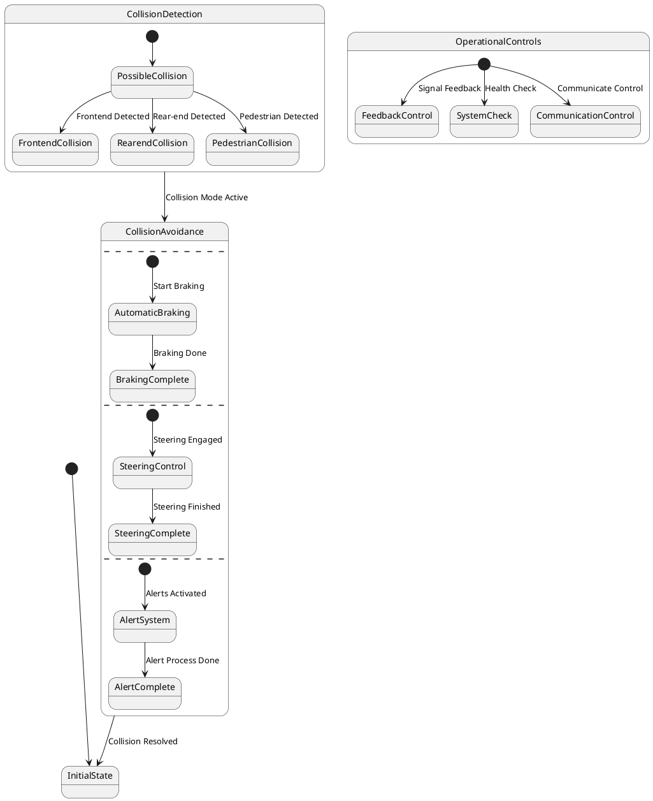

# Pair `0007`：NL + PlantUML STM0 + FCSTM STM0

[上一组 `0006`](../0006/README.md) | [返回 60 组索引](../../PAIR_INDEX.md) | [下一组 `0008`](../0008/README.md)

- LLM：`GPT-4o`
- 模型/场景：Collision avoidance sub-machine state diagram
- 作者输出阶段：`Result with Semantic Checking`
- 作者输出单元格：`AE9`；Excel row：`9`
- Phase-I fallback：`false`
- 相对 Phase-I 是否变化：`true`
- Phase-I PlantUML SHA-256：`2e95dc642f73f0d546f8fc356d6ac3a03283887a693a8c56797c1199da64d2b2`
- NL SHA-256：`49854d044ad99f16a710021500f5e972da93b27635a41144d9b91d32444c0f63`
- PlantUML SHA-256：`b703cade3844700c2705caa20001f515b16438ca308f973c7e4caf2f263478f4`
- FCSTM SHA-256：`6f0614a94965b4aa2b00efa13598575809eb6fca5396ae4d38624eeb9b4fbf1d`
- 结构裁决：`structure_preserved`
- source states / transitions：`17` / `16`
- mapped / blocked / silent drop：`16` / `0` / `0`
- final / lifecycle / body coverage：`0/0` / `0/0` / `0/0`
- concurrent region / separator coverage：`4/4` / `3/3`
- source normalization coverage：`0/0`
- official raw / validation：`state_diagram` / `state_diagram`
- official identity states / transitions：`17` / `16`
- official identity remaps：state `0` / transition endpoint `0`
- AST audit：`passed`
- FCSTM execution eligible：`false`
- Discover eligible：`false`
- 主 session 对读：完整对读：碰撞检测、三路规避控制及 OperationalControls 共 16 条边保留；3 个 `--` 形成含空 region 0 的 4-region ledger，三个带事件 initial 与 OperationalControls 多 initial 均保真并留并发/多初态债。
- 三个原始文件：[NL](./nl.txt) | [PlantUML](./plantuml.puml) | [FCSTM](./fcstm.fcstm)
- 审计入口：[canonical](../../canonical/llms_emp_feedback_final_0007.json) | [冻结 FCSTM](../../fcstm/llms_emp_feedback_final_0007.fcstm) | [case report](../../case_reports/llms_emp_feedback_final_0007.json) | [人工总账](../../MANUAL_REVIEW.md)

## 作者阶段 lineage

| stage | output cell | present | output SHA-256 | feedback | resolved |
|---|---|---|---|---|---|
| `phase_i_generation` | `I9` | `true` | `2e95dc642f73f0d546f8fc356d6ac3a03283887a693a8c56797c1199da64d2b2` | - | - |
| `phase_ii_format` | `U9` | `false` | `-` | - | - |
| `phase_ii_grammar` | `Z9` | `false` | `-` | - | - |
| `phase_ii_semantic` | `AE9` | `true` | `b703cade3844700c2705caa20001f515b16438ca308f973c7e4caf2f263478f4` | 1. use region instead of state in composite state | 1.0 |

## Official identity ledger

- status：`aligned`
- canonical / official states：`17` / `17`
- aligned transition endpoints：`16`

本组 state identity 无需重映射。

本组 transition endpoint 无需重映射。

## Source normalization ledger

本组没有 source-input normalization。

## Concurrent region ledger

| owner | region | direct states | direct transitions | separator before | separator after |
|---|---:|---|---|---|---|
| `CollisionAvoidance` | 0 | - | - | - | llms_emp_feedback_final_0007.puml:line:12 |
| `CollisionAvoidance` | 1 | CollisionAvoidance.AutomaticBraking, CollisionAvoidance.BrakingComplete | tr_0006, tr_0007 | llms_emp_feedback_final_0007.puml:line:12 | llms_emp_feedback_final_0007.puml:line:16 |
| `CollisionAvoidance` | 2 | CollisionAvoidance.SteeringControl, CollisionAvoidance.SteeringComplete | tr_0008, tr_0009 | llms_emp_feedback_final_0007.puml:line:16 | llms_emp_feedback_final_0007.puml:line:20 |
| `CollisionAvoidance` | 3 | CollisionAvoidance.AlertSystem, CollisionAvoidance.AlertComplete | tr_0010, tr_0011 | llms_emp_feedback_final_0007.puml:line:20 | - |

## Operational debt

| reason code | count |
|---|---:|
| `R45.DEBT.concurrent_region_semantics` | 1 |
| `R45.DEBT.multiple_initial_fanout` | 2 |
| `R45.DEBT.opaque_transition_label_semantics` | 14 |

## NL

```text
1. There are three region in this diagram
2. This sub-machine becomes active when a possible frontend collision, rear-end collision or collision with pedestrian is detected.
3. The orthogonal regions of the active mode of collision avoidance allow for concurrent activation different of collision avoidance controls.
```

## 作者 Phase-II 最终 PlantUML STM0



## 转换后 FCSTM STM0

```fcstm
state llms_emp_feedback_final_0007 named "llms_emp_feedback_final_0007" {
    event Frontend_Detected named "Frontend Detected";
    event Rear_end_Detected named "Rear-end Detected";
    event Pedestrian_Detected named "Pedestrian Detected";
    event Start_Braking named "Start Braking";
    event Braking_Done named "Braking Done";
    event Steering_Engaged named "Steering Engaged";
    event Steering_Finished named "Steering Finished";
    event Alerts_Activated named "Alerts Activated";
    event Alert_Process_Done named "Alert Process Done";
    event Signal_Feedback named "Signal Feedback";
    event Health_Check named "Health Check";
    event Communicate_Control named "Communicate Control";
    event Collision_Mode_Active named "Collision Mode Active";
    event Collision_Resolved named "Collision Resolved";
    state CollisionDetection named "CollisionDetection" {
        state PossibleCollision named "PossibleCollision";
        state FrontendCollision named "FrontendCollision";
        state RearendCollision named "RearendCollision";
        state PedestrianCollision named "PedestrianCollision";
        [*] -> PossibleCollision;
        PossibleCollision -> FrontendCollision : /Frontend_Detected;
        PossibleCollision -> RearendCollision : /Rear_end_Detected;
        PossibleCollision -> PedestrianCollision : /Pedestrian_Detected;
    }
    state CollisionAvoidance named "CollisionAvoidance\n[PlantUML concurrent region 0] states=-; transitions=-\n[PlantUML concurrent region 1] states=CollisionAvoidance.AutomaticBraking, CollisionAvoidance.BrakingComplete; transitions=tr_0006, tr_0007\n[PlantUML concurrent region 2] states=CollisionAvoidance.SteeringControl, CollisionAvoidance.SteeringComplete; transitions=tr_0008, tr_0009\n[PlantUML concurrent region 3] states=CollisionAvoidance.AlertSystem, CollisionAvoidance.AlertComplete; transitions=tr_0010, tr_0011\n[PlantUML concurrent separator] region 0 -> 1 at llms_emp_feedback_final_0007.puml:line:12\n[PlantUML concurrent separator] region 1 -> 2 at llms_emp_feedback_final_0007.puml:line:16\n[PlantUML concurrent separator] region 2 -> 3 at llms_emp_feedback_final_0007.puml:line:20" {
        state AutomaticBraking named "AutomaticBraking";
        state BrakingComplete named "BrakingComplete";
        state SteeringControl named "SteeringControl";
        state SteeringComplete named "SteeringComplete";
        state AlertSystem named "AlertSystem";
        state AlertComplete named "AlertComplete";
        state InitialWaittr_0006 named "Awaiting initial event: Start Braking";
        state InitialWaittr_0008 named "Awaiting initial event: Steering Engaged";
        state InitialWaittr_0010 named "Awaiting initial event: Alerts Activated";
        [*] -> InitialWaittr_0006;
        InitialWaittr_0006 -> AutomaticBraking : /Start_Braking;
        AutomaticBraking -> BrakingComplete : /Braking_Done;
        [*] -> InitialWaittr_0008;
        InitialWaittr_0008 -> SteeringControl : /Steering_Engaged;
        SteeringControl -> SteeringComplete : /Steering_Finished;
        [*] -> InitialWaittr_0010;
        InitialWaittr_0010 -> AlertSystem : /Alerts_Activated;
        AlertSystem -> AlertComplete : /Alert_Process_Done;
    }
    state OperationalControls named "OperationalControls" {
        state FeedbackControl named "FeedbackControl";
        state SystemCheck named "SystemCheck";
        state CommunicationControl named "CommunicationControl";
        state InitialWaittr_0012 named "Awaiting initial event: Signal Feedback";
        state InitialWaittr_0013 named "Awaiting initial event: Health Check";
        state InitialWaittr_0014 named "Awaiting initial event: Communicate Control";
        [*] -> InitialWaittr_0012;
        InitialWaittr_0012 -> FeedbackControl : /Signal_Feedback;
        [*] -> InitialWaittr_0013;
        InitialWaittr_0013 -> SystemCheck : /Health_Check;
        [*] -> InitialWaittr_0014;
        InitialWaittr_0014 -> CommunicationControl : /Communicate_Control;
    }
    state InitialState named "InitialState";
    [*] -> InitialState;
    !CollisionDetection -> CollisionAvoidance : /Collision_Mode_Active;
    !CollisionAvoidance -> InitialState : /Collision_Resolved;
}
```

[上一组 `0006`](../0006/README.md) | [返回 60 组索引](../../PAIR_INDEX.md) | [下一组 `0008`](../0008/README.md)
