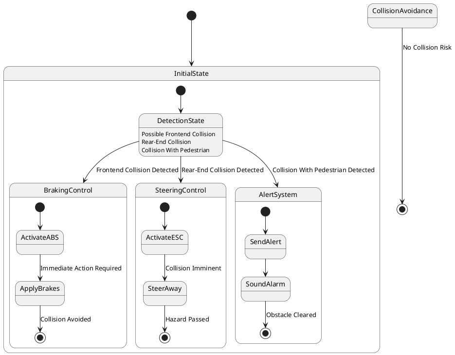

# Pair `0007`：NL + PlantUML STM0 + FCSTM STM0

[上一组 `0006`](../0006/README.md) | [返回 60 组索引](../../PAIR_INDEX.md) | [下一组 `0008`](../0008/README.md)

- LLM：`GPT-4o`
- 模型/场景：Collision avoidance sub-machine state diagram
- NL SHA-256：`49854d044ad99f16a710021500f5e972da93b27635a41144d9b91d32444c0f63`
- PlantUML SHA-256：`2e95dc642f73f0d546f8fc356d6ac3a03283887a693a8c56797c1199da64d2b2`
- FCSTM SHA-256：`a462447491a8058b11419b545e7e2d3f9576850f40c28978a15eceee326f51d4`
- 结构裁决：`structure_preserved`
- FCSTM execution eligible：`false`
- Discover eligible：`false`
- 主 session 对读：三个 collision event 分别绑定 Brake/Steer/Alert deep entry；三个 nested final hold 与 root final 均齐。
- 三个原始文件：[NL](./nl.txt) | [PlantUML](./plantuml.puml) | [FCSTM](./fcstm.fcstm)
- 审计入口：[canonical](../../canonical/llms_emp_stm_results_0007.json) | [冻结 FCSTM](../../fcstm/llms_emp_stm_results_0007.fcstm) | [case report](../../case_reports/llms_emp_stm_results_0007.json) | [人工总账](../../MANUAL_REVIEW.md)

## NL

```text
1. There are three region in this diagram
2. This sub-machine becomes active when a possible frontend collision, rear-end collision or collision with pedestrian is detected.
3. The orthogonal regions of the active mode of collision avoidance allow for concurrent activation different of collision avoidance controls.
```

## 原装 PlantUML STM0



## 转换后 FCSTM STM0

```fcstm
state llms_emp_stm_results_0007 named "llms_emp_stm_results_0007" {
    event Frontend_Collision_Detected named "Frontend Collision Detected";
    event Rear_End_Collision_Detected named "Rear-End Collision Detected";
    event Collision_With_Pedestrian_Detected named "Collision With Pedestrian Detected";
    event Immediate_Action_Required named "Immediate Action Required";
    event Collision_Avoided named "Collision Avoided";
    event Collision_Imminent named "Collision Imminent";
    event Hazard_Passed named "Hazard Passed";
    event Obstacle_Cleared named "Obstacle Cleared";
    event No_Collision_Risk named "No Collision Risk";
    state InitialState named "InitialState" {
        state DetectionState named "DetectionState\n[PlantUML body] Possible Frontend Collision\n[PlantUML body] Rear-End Collision\n[PlantUML body] Collision With Pedestrian";
        [*] -> DetectionState;
        DetectionState -> [*] : /Frontend_Collision_Detected;
        DetectionState -> [*] : /Rear_End_Collision_Detected;
        DetectionState -> [*] : /Collision_With_Pedestrian_Detected;
    }
    state CollisionAvoidance named "CollisionAvoidance" {
        state UnspecifiedInitial named "Unspecified initial";
        state BrakingControl named "BrakingControl" {
            state ActivateABS named "ActivateABS";
            state ApplyBrakes named "ApplyBrakes";
            state FinalWaittr_0008 named "Completed final boundary: CollisionAvoidance.BrakingControl.ApplyBrakes";
            [*] -> ActivateABS;
            ActivateABS -> ApplyBrakes : /Immediate_Action_Required;
            ApplyBrakes -> FinalWaittr_0008 : /Collision_Avoided;
        }
        state SteeringControl named "SteeringControl" {
            state ActivateESC named "ActivateESC";
            state SteerAway named "SteerAway";
            state FinalWaittr_0011 named "Completed final boundary: CollisionAvoidance.SteeringControl.SteerAway";
            [*] -> ActivateESC;
            ActivateESC -> SteerAway : /Collision_Imminent;
            SteerAway -> FinalWaittr_0011 : /Hazard_Passed;
        }
        state AlertSystem named "AlertSystem" {
            state SendAlert named "SendAlert";
            state SoundAlarm named "SoundAlarm";
            state FinalWaittr_0014 named "Completed final boundary: CollisionAvoidance.AlertSystem.SoundAlarm";
            [*] -> SendAlert;
            SendAlert -> SoundAlarm;
            SoundAlarm -> FinalWaittr_0014 : /Obstacle_Cleared;
        }
        [*] -> BrakingControl : /Frontend_Collision_Detected;
        [*] -> SteeringControl : /Rear_End_Collision_Detected;
        [*] -> AlertSystem : /Collision_With_Pedestrian_Detected;
        [*] -> UnspecifiedInitial;
    }
    [*] -> InitialState;
    InitialState -> CollisionAvoidance : /Frontend_Collision_Detected;
    InitialState -> CollisionAvoidance : /Rear_End_Collision_Detected;
    InitialState -> CollisionAvoidance : /Collision_With_Pedestrian_Detected;
    !CollisionAvoidance -> [*] : /No_Collision_Risk;
}
```

[上一组 `0006`](../0006/README.md) | [返回 60 组索引](../../PAIR_INDEX.md) | [下一组 `0008`](../0008/README.md)
