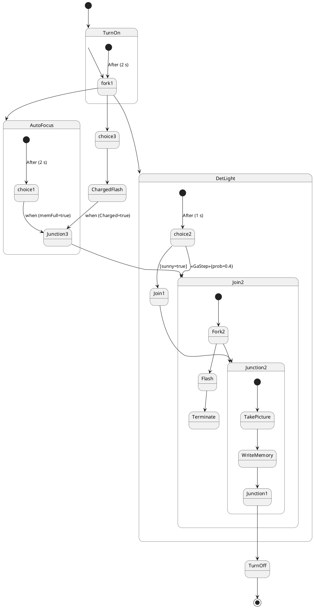

# Pair `0008`：NL + PlantUML STM0 + FCSTM STM0

[上一组 `0007`](../0007/README.md) | [返回 60 组索引](../../PAIR_INDEX.md) | [下一组 `0009`](../0009/README.md)

- LLM：`GPT-4o`
- 模型/场景： Digital camera state machine diagrams
- 作者输出阶段：`Result with Semantic Checking`
- 作者输出单元格：`AE10`；Excel row：`10`
- Phase-I fallback：`false`
- 相对 Phase-I 是否变化：`true`
- Phase-I PlantUML SHA-256：`0d7b489764211f6857eb71ab15af67f692a637c2a2a548b5e5ce7d88f255cbd2`
- NL SHA-256：`6af3966c8b0e12004a22622cded88b07df6fef9d558534442e3309694543c76d`
- PlantUML SHA-256：`01fce990814405ed944d0e2bda2c16813832aaf0bf3b46d4493fa3f316165dca`
- FCSTM SHA-256：`441442b513777c4033ea47df40f4f61dbfe76872428c921e2bc0520da960e55a`
- 结构裁决：`structure_preserved`
- source states / transitions：`19` / `24`
- mapped / blocked / silent drop：`24` / `0` / `0`
- final / lifecycle / body coverage：`1/1` / `0/0` / `0/0`
- concurrent region / separator coverage：`0/0` / `0/0`
- source normalization coverage：`0/0`
- official raw / validation：`state_diagram` / `state_diagram`
- official identity states / transitions：`19` / `24`
- official identity remaps：state `8` / transition endpoint `11`
- AST audit：`passed`
- FCSTM execution eligible：`false`
- Discover eligible：`false`
- 主 session 对读：完整对读：数字相机 19 个官方实体、24 条边全映射；Join2/Junction2 后置声明按官方首引用嵌入 DetLight 链并记录 8 个 state remap，跨层 fork/Junction/TurnOff 通过 exit-entry 分段而非复制同名状态。
- 三个原始文件：[NL](./nl.txt) | [PlantUML](./plantuml.puml) | [FCSTM](./fcstm.fcstm)
- 审计入口：[canonical](../../canonical/llms_emp_feedback_final_0008.json) | [冻结 FCSTM](../../fcstm/llms_emp_feedback_final_0008.fcstm) | [case report](../../case_reports/llms_emp_feedback_final_0008.json) | [人工总账](../../MANUAL_REVIEW.md)

## 作者阶段 lineage

| stage | output cell | present | output SHA-256 | feedback | resolved |
|---|---|---|---|---|---|
| `phase_i_generation` | `I10` | `true` | `0d7b489764211f6857eb71ab15af67f692a637c2a2a548b5e5ce7d88f255cbd2` | - | - |
| `phase_ii_format` | `U10` | `false` | `-` | - | - |
| `phase_ii_grammar` | `Z10` | `false` | `-` | - | - |
| `phase_ii_semantic` | `AE10` | `true` | `01fce990814405ed944d0e2bda2c16813832aaf0bf3b46d4493fa3f316165dca` | 1. Missing final state<br>2. Missing Junction Pseudostate and Fork Pseudostate<br>3. interactions error | - |

## Official identity ledger

- status：`aligned`
- canonical / official states：`19` / `19`
- aligned transition endpoints：`24`

| source-parser identity | pinned PlantUML identity | raw ref | reason |
|---|---|---|---|
| `Join2` | `DetLight.Join2` | `llms_emp_feedback_final_0008.puml:line:29` | `official_link_endpoint_identity` |
| `Junction2` | `DetLight.Join2.Junction2` | `llms_emp_feedback_final_0008.puml:line:38` | `official_link_endpoint_identity` |
| `Join2.Fork2` | `DetLight.Join2.Fork2` | `llms_emp_feedback_final_0008.puml:line:30` | `official_link_endpoint_identity` |
| `Join2.Flash` | `DetLight.Join2.Flash` | `llms_emp_feedback_final_0008.puml:line:32` | `official_link_endpoint_identity` |
| `Join2.Terminate` | `DetLight.Join2.Terminate` | `llms_emp_feedback_final_0008.puml:line:33` | `official_link_endpoint_identity` |
| `Junction2.TakePicture` | `DetLight.Join2.Junction2.TakePicture` | `llms_emp_feedback_final_0008.puml:line:39` | `official_link_endpoint_identity` |
| `Junction2.WriteMemory` | `DetLight.Join2.Junction2.WriteMemory` | `llms_emp_feedback_final_0008.puml:line:40` | `official_link_endpoint_identity` |
| `Junction2.Junction1` | `DetLight.Join2.Junction2.Junction1` | `llms_emp_feedback_final_0008.puml:line:41` | `official_link_endpoint_identity` |

| transition | source before -> after | target before -> after | raw ref |
|---|---|---|---|
| `tr_0009` | `DetLight.choice2` -> `DetLight.choice2` | `Join2` -> `DetLight.Join2` | `llms_emp_feedback_final_0008.puml:line:19` |
| `tr_0014` | `AutoFocus.Junction3` -> `AutoFocus.Junction3` | `Join2` -> `DetLight.Join2` | `llms_emp_feedback_final_0008.puml:line:27` |
| `tr_0015` | `@initial:Join2` -> `@initial:DetLight.Join2` | `Join2.Fork2` -> `DetLight.Join2.Fork2` | `llms_emp_feedback_final_0008.puml:line:30` |
| `tr_0016` | `Join2.Fork2` -> `DetLight.Join2.Fork2` | `Junction2` -> `DetLight.Join2.Junction2` | `llms_emp_feedback_final_0008.puml:line:31` |
| `tr_0017` | `Join2.Fork2` -> `DetLight.Join2.Fork2` | `Join2.Flash` -> `DetLight.Join2.Flash` | `llms_emp_feedback_final_0008.puml:line:32` |
| `tr_0018` | `Join2.Flash` -> `DetLight.Join2.Flash` | `Join2.Terminate` -> `DetLight.Join2.Terminate` | `llms_emp_feedback_final_0008.puml:line:33` |
| `tr_0019` | `DetLight.Join1` -> `DetLight.Join1` | `Junction2` -> `DetLight.Join2.Junction2` | `llms_emp_feedback_final_0008.puml:line:36` |
| `tr_0020` | `@initial:Junction2` -> `@initial:DetLight.Join2.Junction2` | `Junction2.TakePicture` -> `DetLight.Join2.Junction2.TakePicture` | `llms_emp_feedback_final_0008.puml:line:39` |
| `tr_0021` | `Junction2.TakePicture` -> `DetLight.Join2.Junction2.TakePicture` | `Junction2.WriteMemory` -> `DetLight.Join2.Junction2.WriteMemory` | `llms_emp_feedback_final_0008.puml:line:40` |
| `tr_0022` | `Junction2.WriteMemory` -> `DetLight.Join2.Junction2.WriteMemory` | `Junction2.Junction1` -> `DetLight.Join2.Junction2.Junction1` | `llms_emp_feedback_final_0008.puml:line:41` |
| `tr_0023` | `Junction2.Junction1` -> `DetLight.Join2.Junction2.Junction1` | `TurnOff` -> `TurnOff` | `llms_emp_feedback_final_0008.puml:line:44` |

## Source normalization ledger

本组没有 source-input normalization。

## Concurrent region ledger

本组没有 PlantUML orthogonal/concurrent region separator。

## Operational debt

| reason code | count |
|---|---:|
| `R45.DEBT.ambiguous_unlabeled_fanout` | 2 |
| `R45.DEBT.opaque_transition_label_semantics` | 7 |

## NL

```text
1. The system begins in the TurnOn state, which has two possible execution times, with a maximum of 2 seconds and a minimum of 2 seconds, before transitioning to the fork1 state.
2. The TurnOn state transitions into a fork1 state, which contains parallel paths leading to AutoFocus and DetLight.
3. The AutoFocus state has execution times of 2 seconds maximum and 1 second minimum before proceeding to the choice1 state, which is triggered when the condition memFull=true is true.
4. The DetLight state has execution times of 1 second maximum and 0 seconds minimum, transitioning to the choice2 state when the condition <>{prob=0.4} is met.
5. If the fork1 state transitions to choice3, it proceeds to the ChargedFlash state, which has execution times of 4 seconds maximum and 2 seconds minimum.
6. The ChargedFlash state can lead to Junction3, where the system starts and proceeds to the Join2 state. The transition occurs when Charged=true.
7. The choice3 state also transitions to Junction3, and once the system reaches Junction3, it joins the Join2 state.
8. The choice2 state transitions to Join2, and if the condition sunny=true is met, it further joins the Join1 state, which leads to Junction2.
9. In the Junction2 state, the system proceeds to TakePicture, followed by WriteMemory, with execution times of 3 seconds maximum and 2 seconds minimum.
10. After WriteMemory completes, the system enters Junction1 before proceeding to TurnOff, which ends the process and transitions back to the initial state, represented by [*].
11. In the Fork2 state, which is part of the Join2 substate, the system can either proceed to Junction2 or Flash. If the Flash state is activated, it transitions to Terminate, ending the sequence.
```

## 作者 Phase-II 最终 PlantUML STM0



## 转换后 FCSTM STM0

```fcstm
state llms_emp_feedback_final_0008 named "llms_emp_feedback_final_0008" {
    event After_2_s named "After (2 s)";
    event when_memFull_true named "when (memFull=true)";
    event After_1_s named "After (1 s)";
    event _GaStep_prob_0_4 named "<<GaStep>>{prob=0.4}";
    event _sunny_true named "[sunny=true]";
    event when_Charged_true named "when (Charged=true)";
    state TurnOn named "TurnOn" {
        state fork1 named "fork1";
        state InitialWaittr_0002 named "Awaiting initial event: After (2 s)";
        [*] -> InitialWaittr_0002;
        InitialWaittr_0002 -> fork1 : /After_2_s;
        ! * -> fork1;
        fork1 -> [*];
        fork1 -> [*];
        fork1 -> [*];
    }
    state AutoFocus named "AutoFocus" {
        state choice1 named "choice1";
        state Junction3 named "Junction3";
        state InitialWaittr_0006 named "Awaiting initial event: After (2 s)";
        [*] -> Junction3 : /when_Charged_true;
        [*] -> InitialWaittr_0006;
        InitialWaittr_0006 -> choice1 : /After_2_s;
        choice1 -> Junction3 : /when_memFull_true;
        Junction3 -> [*];
    }
    state DetLight named "DetLight" {
        state Join2 named "Join2" {
            state Junction2 named "Junction2" {
                state TakePicture named "TakePicture";
                state WriteMemory named "WriteMemory";
                state Junction1 named "Junction1";
                [*] -> TakePicture;
                TakePicture -> WriteMemory;
                WriteMemory -> Junction1;
                Junction1 -> [*];
            }
            state Fork2 named "Fork2";
            state Flash named "Flash";
            state Terminate named "Terminate";
            [*] -> Junction2;
            [*] -> Fork2;
            Fork2 -> Junction2;
            Fork2 -> Flash;
            Flash -> Terminate;
            !Junction2 -> [*];
        }
        state choice2 named "choice2";
        state Join1 named "Join1";
        state InitialWaittr_0008 named "Awaiting initial event: After (1 s)";
        [*] -> Join2;
        [*] -> InitialWaittr_0008;
        InitialWaittr_0008 -> choice2 : /After_1_s;
        choice2 -> Join2 : /_GaStep_prob_0_4;
        choice2 -> Join1 : /_sunny_true;
        Join1 -> Join2;
        !Join2 -> [*];
    }
    state choice3 named "choice3";
    state ChargedFlash named "ChargedFlash";
    state TurnOff named "TurnOff";
    [*] -> TurnOn;
    TurnOn -> AutoFocus;
    TurnOn -> DetLight;
    TurnOn -> choice3;
    choice3 -> ChargedFlash;
    ChargedFlash -> AutoFocus : /when_Charged_true;
    AutoFocus -> DetLight;
    DetLight -> TurnOff;
    TurnOff -> [*];
}
```

[上一组 `0007`](../0007/README.md) | [返回 60 组索引](../../PAIR_INDEX.md) | [下一组 `0009`](../0009/README.md)
