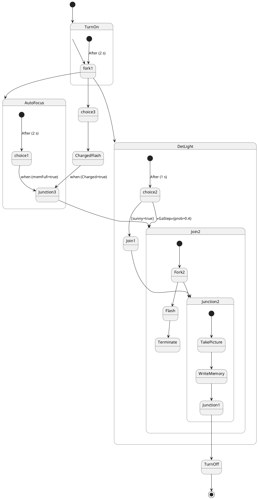

# Pair `0008`：NL + PlantUML STM0 + FCSTM STM0

[上一组 `0007`](../0007/README.md) | [返回 60 组索引](../../PAIR_INDEX.md) | [下一组 `0009`](../0009/README.md)

- LLM：`GPT-4o`
- 模型/场景： Digital camera state machine diagrams
- 作者输出阶段：`Result with Semantic Checking`
- 作者输出单元格：`AE10`；Excel row：`10`
- Phase-I fallback：`false`
- 相对 Phase-I 是否变化：`true`
- Phase-I PlantUML SHA-256：`0d7b489764211f6857eb71ab15af67f692a637c2a2a548b5e5ce7d88f255cbd2`
- NL SHA-256：`6af3966c8b0e12004a22622cded88b07df6fef9d558534442e3309694543c76d`
- PlantUML SHA-256：`01fce990814405ed944d0e2bda2c16813832aaf0bf3b46d4493fa3f316165dca`
- FCSTM SHA-256：`441442b513777c4033ea47df40f4f61dbfe76872428c921e2bc0520da960e55a`
- review subject SHA-256：`be8362a96529e8ab5b1755dc76eeb9bcf13bedbe1c229f39d7410087b2f795da`
- working contract SHA-256：`24cfd149eed906f0005f762bd1b8c9ea29089028ded93b74bb4a9b7f6c2c0f8c`
- 结构裁决：`structure_preserved`
- source states / transitions：`19` / `24`
- mapped / blocked / silent drop：`24` / `0` / `0`
- final / lifecycle / body coverage：`1/1` / `0/0` / `0/0`
- concurrent region / separator coverage：`0/0` / `0/0`
- source normalization coverage：`0/0`
- official raw / validation：`state_diagram` / `state_diagram`
- official identity states / transitions：`19` / `24`
- official identity remaps：state `8` / transition endpoint `11`
- AST audit：`passed`
- legacy whole-model FCSTM execution / Discover：`false` / `false`
- working bundle usage gate：`discover_input_with_capability_mask`
- ownership source / compiler / agent：`43` / `47` / `0`
- source macro / positive identity trace / conversion boundary trace：`24` / `43` / `0`
- capability source-static / simulation / transition-trace：`eligible_with_exclusions` / `ineligible` / `ineligible`
- compiler-only diagnostic policy：`rejected_conversion_artifact`；main-result conversion artifact limit：`0`
- 主 session 对读：`pass`；ownership/macro/capability 均为 `pass`；Case 0008 passes conversion-attribution review. This does not assert NL/PlantUML correctness or runtime equivalence; authored defects remain eligible for later source-grounded Discover. No conversion-specific blocker was found in the exact reviewed occurrences.
- source anchors：`source-ref:llms_emp_feedback_final_0008.puml:line:4\|state TurnOn {, source-ref:llms_emp_feedback_final_0008.puml:line:14\|choice1 --> Junction3: when (memFull=true)`；FCSTM anchors：`element-ref:source:state:TurnOn@line:8\|state TurnOn named "TurnOn" {, element-ref:compiler:transition_segment:tr_0007:segment:1@line:25\|choice1 -> Junction3 : /when_memFull_true;`
- 三个原始文件：[NL](./nl.txt) | [PlantUML](./plantuml.puml) | [FCSTM](./fcstm.fcstm)
- 审计入口：[canonical](../../canonical/llms_emp_feedback_final_0008.json) | [冻结 FCSTM](../../fcstm/llms_emp_feedback_final_0008.fcstm) | [case report](../../case_reports/llms_emp_feedback_final_0008.json) | [working contract](../../working_contracts/llms_emp_feedback_final_0008.json) | [source trace](../../source_traces/llms_emp_feedback_final_0008.json) | [人工总账](../../MANUAL_REVIEW.md)

## 主 session 三方语义对应

| projection | assessment | NL anchor | PlantUML anchor | FCSTM anchor | source roots | compiler members | rationale |
|---|---|---|---|---|---|---|---|
| `direct` | `preserved` | TurnOn | source-ref:llms_emp_feedback_final_0008.puml:line:4\|state TurnOn { | element-ref:source:state:TurnOn@line:8\|state TurnOn named "TurnOn" { | source:state:TurnOn | - | Case 0008 binds source:state:TurnOn to the exact authored occurrence 'state TurnOn {'; it is present as a direct FCSTM state projection with the same source identity and parent relation. |
| `macro` | `preserved_with_exclusions` | Junction3 | source-ref:llms_emp_feedback_final_0008.puml:line:14\|choice1 --> Junction3: when (memFull=true) | element-ref:compiler:transition_segment:tr_0007:segment:1@line:25\|choice1 -> Junction3 : /when_memFull_true; | source:transition:tr_0007 | compiler:transition_segment:tr_0007:segment:1 | Case 0008 binds source:transition:tr_0007 to the exact authored occurrence 'choice1 --> Junction3: when (memFull=true)'; it is present as a source-owned transition root whose cited FCSTM line belongs to a protected compiler macro; the raw label remains opaque. |

## Risk occurrence 第二遍复核

| obligation | risk tag | assessment | PlantUML evidence | FCSTM evidence | ownership evidence | rationale |
|---|---|---|---|---|---|---|
| `review:official_identity_remap:0001:state-001` | `official_identity_remap` | `source_fact_preserved` | source-ref:llms_emp_feedback_final_0008.puml:line:29\|state Join2 { | element-ref:source:state:DetLight.Join2@line:29\|state Join2 named "Join2" { | source:state:DetLight.Join2 | Case 0008 risk official_identity_remap occurrence review:official_identity_remap:0001:state-001: The occurrence follows the pinned PlantUML qualified Entity/Link identity result, including the recorded remap, instead of substituting a lexical guess. |
| `review:official_identity_remap:0002:state-002` | `official_identity_remap` | `source_fact_preserved` | source-ref:llms_emp_feedback_final_0008.puml:line:38\|state Junction2 { | element-ref:source:state:DetLight.Join2.Junction2@line:30\|state Junction2 named "Junction2" { | source:state:DetLight.Join2.Junction2 | Case 0008 risk official_identity_remap occurrence review:official_identity_remap:0002:state-002: The occurrence follows the pinned PlantUML qualified Entity/Link identity result, including the recorded remap, instead of substituting a lexical guess. |
| `review:official_identity_remap:0003:state-003` | `official_identity_remap` | `source_fact_preserved` | source-ref:llms_emp_feedback_final_0008.puml:line:30\|[*] --> Fork2 | element-ref:source:state:DetLight.Join2.Fork2@line:39\|state Fork2 named "Fork2"; | source:state:DetLight.Join2.Fork2 | Case 0008 risk official_identity_remap occurrence review:official_identity_remap:0003:state-003: The occurrence follows the pinned PlantUML qualified Entity/Link identity result, including the recorded remap, instead of substituting a lexical guess. |
| `review:official_identity_remap:0004:state-004` | `official_identity_remap` | `source_fact_preserved` | source-ref:llms_emp_feedback_final_0008.puml:line:32\|Fork2 --> Flash | element-ref:source:state:DetLight.Join2.Flash@line:40\|state Flash named "Flash"; | source:state:DetLight.Join2.Flash | Case 0008 risk official_identity_remap occurrence review:official_identity_remap:0004:state-004: The occurrence follows the pinned PlantUML qualified Entity/Link identity result, including the recorded remap, instead of substituting a lexical guess. |
| `review:official_identity_remap:0005:state-005` | `official_identity_remap` | `source_fact_preserved` | source-ref:llms_emp_feedback_final_0008.puml:line:33\|Flash --> Terminate | element-ref:source:state:DetLight.Join2.Terminate@line:41\|state Terminate named "Terminate"; | source:state:DetLight.Join2.Terminate | Case 0008 risk official_identity_remap occurrence review:official_identity_remap:0005:state-005: The occurrence follows the pinned PlantUML qualified Entity/Link identity result, including the recorded remap, instead of substituting a lexical guess. |
| `review:official_identity_remap:0006:state-006` | `official_identity_remap` | `source_fact_preserved` | source-ref:llms_emp_feedback_final_0008.puml:line:39\|[*] --> TakePicture | element-ref:source:state:DetLight.Join2.Junction2.TakePicture@line:31\|state TakePicture named "TakePicture"; | source:state:DetLight.Join2.Junction2.TakePicture | Case 0008 risk official_identity_remap occurrence review:official_identity_remap:0006:state-006: The occurrence follows the pinned PlantUML qualified Entity/Link identity result, including the recorded remap, instead of substituting a lexical guess. |
| `review:official_identity_remap:0007:state-007` | `official_identity_remap` | `source_fact_preserved` | source-ref:llms_emp_feedback_final_0008.puml:line:40\|TakePicture --> WriteMemory | element-ref:source:state:DetLight.Join2.Junction2.WriteMemory@line:32\|state WriteMemory named "WriteMemory"; | source:state:DetLight.Join2.Junction2.WriteMemory | Case 0008 risk official_identity_remap occurrence review:official_identity_remap:0007:state-007: The occurrence follows the pinned PlantUML qualified Entity/Link identity result, including the recorded remap, instead of substituting a lexical guess. |
| `review:official_identity_remap:0008:state-008` | `official_identity_remap` | `source_fact_preserved` | source-ref:llms_emp_feedback_final_0008.puml:line:41\|WriteMemory --> Junction1 | element-ref:source:state:DetLight.Join2.Junction2.Junction1@line:33\|state Junction1 named "Junction1"; | source:state:DetLight.Join2.Junction2.Junction1 | Case 0008 risk official_identity_remap occurrence review:official_identity_remap:0008:state-008: The occurrence follows the pinned PlantUML qualified Entity/Link identity result, including the recorded remap, instead of substituting a lexical guess. |
| `review:official_identity_remap:0009:transition-001-tr_0009` | `official_identity_remap` | `source_fact_preserved` | source-ref:llms_emp_feedback_final_0008.puml:line:19\|choice2 --> Join2: <<GaStep>>{prob=0.4} | element-ref:compiler:transition_segment:tr_0009:segment:1@line:55\|choice2 -> Join2 : /_GaStep_prob_0_4; | source:transition:tr_0009 | Case 0008 risk official_identity_remap occurrence review:official_identity_remap:0009:transition-001-tr_0009: The occurrence follows the pinned PlantUML qualified Entity/Link identity result, including the recorded remap, instead of substituting a lexical guess. |
| `review:official_identity_remap:0010:transition-002-tr_0014` | `official_identity_remap` | `source_fact_preserved` | source-ref:llms_emp_feedback_final_0008.puml:line:27\|Junction3 --> Join2 | element-ref:compiler:transition_segment:tr_0014:segment:1@line:26\|Junction3 -> [*]; | source:transition:tr_0014 | Case 0008 risk official_identity_remap occurrence review:official_identity_remap:0010:transition-002-tr_0014: The occurrence follows the pinned PlantUML qualified Entity/Link identity result, including the recorded remap, instead of substituting a lexical guess. |
| `review:official_identity_remap:0011:transition-003-tr_0015` | `official_identity_remap` | `source_fact_preserved` | source-ref:llms_emp_feedback_final_0008.puml:line:30\|[*] --> Fork2 | element-ref:compiler:transition_segment:tr_0015:segment:1@line:43\|[*] -> Fork2; | source:transition:tr_0015 | Case 0008 risk official_identity_remap occurrence review:official_identity_remap:0011:transition-003-tr_0015: The occurrence follows the pinned PlantUML qualified Entity/Link identity result, including the recorded remap, instead of substituting a lexical guess. |
| `review:official_identity_remap:0012:transition-004-tr_0016` | `official_identity_remap` | `source_fact_preserved` | source-ref:llms_emp_feedback_final_0008.puml:line:31\|Fork2 --> Junction2 | element-ref:compiler:transition_segment:tr_0016:segment:1@line:44\|Fork2 -> Junction2; | source:transition:tr_0016 | Case 0008 risk official_identity_remap occurrence review:official_identity_remap:0012:transition-004-tr_0016: The occurrence follows the pinned PlantUML qualified Entity/Link identity result, including the recorded remap, instead of substituting a lexical guess. |
| `review:official_identity_remap:0013:transition-005-tr_0017` | `official_identity_remap` | `source_fact_preserved` | source-ref:llms_emp_feedback_final_0008.puml:line:32\|Fork2 --> Flash | element-ref:compiler:transition_segment:tr_0017:segment:1@line:45\|Fork2 -> Flash; | source:transition:tr_0017 | Case 0008 risk official_identity_remap occurrence review:official_identity_remap:0013:transition-005-tr_0017: The occurrence follows the pinned PlantUML qualified Entity/Link identity result, including the recorded remap, instead of substituting a lexical guess. |
| `review:official_identity_remap:0014:transition-006-tr_0018` | `official_identity_remap` | `source_fact_preserved` | source-ref:llms_emp_feedback_final_0008.puml:line:33\|Flash --> Terminate | element-ref:compiler:transition_segment:tr_0018:segment:1@line:46\|Flash -> Terminate; | source:transition:tr_0018 | Case 0008 risk official_identity_remap occurrence review:official_identity_remap:0014:transition-006-tr_0018: The occurrence follows the pinned PlantUML qualified Entity/Link identity result, including the recorded remap, instead of substituting a lexical guess. |
| `review:official_identity_remap:0015:transition-007-tr_0019` | `official_identity_remap` | `source_fact_preserved` | source-ref:llms_emp_feedback_final_0008.puml:line:36\|Join1 --> Junction2 | element-ref:compiler:transition_segment:tr_0019:segment:1@line:57\|Join1 -> Join2; | source:transition:tr_0019 | Case 0008 risk official_identity_remap occurrence review:official_identity_remap:0015:transition-007-tr_0019: The occurrence follows the pinned PlantUML qualified Entity/Link identity result, including the recorded remap, instead of substituting a lexical guess. |
| `review:official_identity_remap:0016:transition-008-tr_0020` | `official_identity_remap` | `source_fact_preserved` | source-ref:llms_emp_feedback_final_0008.puml:line:39\|[*] --> TakePicture | element-ref:compiler:transition_segment:tr_0020:segment:1@line:34\|[*] -> TakePicture; | source:transition:tr_0020 | Case 0008 risk official_identity_remap occurrence review:official_identity_remap:0016:transition-008-tr_0020: The occurrence follows the pinned PlantUML qualified Entity/Link identity result, including the recorded remap, instead of substituting a lexical guess. |
| `review:official_identity_remap:0017:transition-009-tr_0021` | `official_identity_remap` | `source_fact_preserved` | source-ref:llms_emp_feedback_final_0008.puml:line:40\|TakePicture --> WriteMemory | element-ref:compiler:transition_segment:tr_0021:segment:1@line:35\|TakePicture -> WriteMemory; | source:transition:tr_0021 | Case 0008 risk official_identity_remap occurrence review:official_identity_remap:0017:transition-009-tr_0021: The occurrence follows the pinned PlantUML qualified Entity/Link identity result, including the recorded remap, instead of substituting a lexical guess. |
| `review:official_identity_remap:0018:transition-010-tr_0022` | `official_identity_remap` | `source_fact_preserved` | source-ref:llms_emp_feedback_final_0008.puml:line:41\|WriteMemory --> Junction1 | element-ref:compiler:transition_segment:tr_0022:segment:1@line:36\|WriteMemory -> Junction1; | source:transition:tr_0022 | Case 0008 risk official_identity_remap occurrence review:official_identity_remap:0018:transition-010-tr_0022: The occurrence follows the pinned PlantUML qualified Entity/Link identity result, including the recorded remap, instead of substituting a lexical guess. |
| `review:official_identity_remap:0019:transition-011-tr_0023` | `official_identity_remap` | `source_fact_preserved` | source-ref:llms_emp_feedback_final_0008.puml:line:44\|Junction1 --> TurnOff | element-ref:compiler:transition_segment:tr_0023:segment:1@line:37\|Junction1 -> [*]; | source:transition:tr_0023 | Case 0008 risk official_identity_remap occurrence review:official_identity_remap:0019:transition-011-tr_0023: The occurrence follows the pinned PlantUML qualified Entity/Link identity result, including the recorded remap, instead of substituting a lexical guess. |
| `review:multi_segment_macro:0020:tr_0002` | `multi_segment_macro` | `compiler_artifact_excluded` | source-ref:llms_emp_feedback_final_0008.puml:line:5\|[*] --> fork1: After (2 s) | element-ref:compiler:state:llms_emp_feedback_final_0008.TurnOn.InitialWaittr_0002@line:10\|state InitialWaittr_0002 named "Awaiting initial event: After (2 s)";, element-ref:compiler:transition_segment:tr_0002:segment:1@line:11\|[*] -> InitialWaittr_0002;, element-ref:compiler:transition_segment:tr_0002:segment:2@line:12\|InitialWaittr_0002 -> fork1 : /After_2_s; | compiler:state:llms_emp_feedback_final_0008.TurnOn.InitialWaittr_0002, compiler:transition_segment:tr_0002:segment:1, compiler:transition_segment:tr_0002:segment:2, source:transition:tr_0002 | Case 0008 risk multi_segment_macro occurrence review:multi_segment_macro:0020:tr_0002: The single authored transition remains one source-owned semantic root; all bound FCSTM segments are protected compiler artifacts and cannot become repair targets. |
| `review:multi_segment_macro:0021:tr_0004` | `multi_segment_macro` | `compiler_artifact_excluded` | source-ref:llms_emp_feedback_final_0008.puml:line:9\|fork1 -down-> AutoFocus | element-ref:compiler:transition_segment:tr_0004:segment:1@line:14\|fork1 -> [*];, element-ref:compiler:transition_segment:tr_0004:segment:2@line:64\|TurnOn -> AutoFocus; | compiler:transition_segment:tr_0004:segment:1, compiler:transition_segment:tr_0004:segment:2, source:transition:tr_0004 | Case 0008 risk multi_segment_macro occurrence review:multi_segment_macro:0021:tr_0004: The single authored transition remains one source-owned semantic root; all bound FCSTM segments are protected compiler artifacts and cannot become repair targets. |
| `review:multi_segment_macro:0022:tr_0005` | `multi_segment_macro` | `compiler_artifact_excluded` | source-ref:llms_emp_feedback_final_0008.puml:line:10\|fork1 -right-> DetLight | element-ref:compiler:transition_segment:tr_0005:segment:1@line:15\|fork1 -> [*];, element-ref:compiler:transition_segment:tr_0005:segment:2@line:65\|TurnOn -> DetLight; | compiler:transition_segment:tr_0005:segment:1, compiler:transition_segment:tr_0005:segment:2, source:transition:tr_0005 | Case 0008 risk multi_segment_macro occurrence review:multi_segment_macro:0022:tr_0005: The single authored transition remains one source-owned semantic root; all bound FCSTM segments are protected compiler artifacts and cannot become repair targets. |
| `review:multi_segment_macro:0023:tr_0006` | `multi_segment_macro` | `compiler_artifact_excluded` | source-ref:llms_emp_feedback_final_0008.puml:line:13\|[*] --> choice1: After (2 s) | element-ref:compiler:state:llms_emp_feedback_final_0008.AutoFocus.InitialWaittr_0006@line:21\|state InitialWaittr_0006 named "Awaiting initial event: After (2 s)";, element-ref:compiler:transition_segment:tr_0006:segment:1@line:23\|[*] -> InitialWaittr_0006;, element-ref:compiler:transition_segment:tr_0006:segment:2@line:24\|InitialWaittr_0006 -> choice1 : /After_2_s; | compiler:state:llms_emp_feedback_final_0008.AutoFocus.InitialWaittr_0006, compiler:transition_segment:tr_0006:segment:1, compiler:transition_segment:tr_0006:segment:2, source:transition:tr_0006 | Case 0008 risk multi_segment_macro occurrence review:multi_segment_macro:0023:tr_0006: The single authored transition remains one source-owned semantic root; all bound FCSTM segments are protected compiler artifacts and cannot become repair targets. |
| `review:multi_segment_macro:0024:tr_0008` | `multi_segment_macro` | `compiler_artifact_excluded` | source-ref:llms_emp_feedback_final_0008.puml:line:18\|[*] --> choice2: After (1 s) | element-ref:compiler:state:llms_emp_feedback_final_0008.DetLight.InitialWaittr_0008@line:51\|state InitialWaittr_0008 named "Awaiting initial event: After (1 s)";, element-ref:compiler:transition_segment:tr_0008:segment:1@line:53\|[*] -> InitialWaittr_0008;, element-ref:compiler:transition_segment:tr_0008:segment:2@line:54\|InitialWaittr_0008 -> choice2 : /After_1_s; | compiler:state:llms_emp_feedback_final_0008.DetLight.InitialWaittr_0008, compiler:transition_segment:tr_0008:segment:1, compiler:transition_segment:tr_0008:segment:2, source:transition:tr_0008 | Case 0008 risk multi_segment_macro occurrence review:multi_segment_macro:0024:tr_0008: The single authored transition remains one source-owned semantic root; all bound FCSTM segments are protected compiler artifacts and cannot become repair targets. |
| `review:multi_segment_macro:0025:tr_0011` | `multi_segment_macro` | `compiler_artifact_excluded` | source-ref:llms_emp_feedback_final_0008.puml:line:23\|fork1 -down-> choice3 | element-ref:compiler:transition_segment:tr_0011:segment:1@line:16\|fork1 -> [*];, element-ref:compiler:transition_segment:tr_0011:segment:2@line:66\|TurnOn -> choice3; | compiler:transition_segment:tr_0011:segment:1, compiler:transition_segment:tr_0011:segment:2, source:transition:tr_0011 | Case 0008 risk multi_segment_macro occurrence review:multi_segment_macro:0025:tr_0011: The single authored transition remains one source-owned semantic root; all bound FCSTM segments are protected compiler artifacts and cannot become repair targets. |
| `review:multi_segment_macro:0026:tr_0013` | `multi_segment_macro` | `compiler_artifact_excluded` | source-ref:llms_emp_feedback_final_0008.puml:line:25\|ChargedFlash --> Junction3: when (Charged=true) | element-ref:compiler:transition_segment:tr_0013:segment:1@line:68\|ChargedFlash -> AutoFocus : /when_Charged_true;, element-ref:compiler:transition_segment:tr_0013:segment:2@line:22\|[*] -> Junction3 : /when_Charged_true; | compiler:transition_segment:tr_0013:segment:1, compiler:transition_segment:tr_0013:segment:2, source:transition:tr_0013 | Case 0008 risk multi_segment_macro occurrence review:multi_segment_macro:0026:tr_0013: The single authored transition remains one source-owned semantic root; all bound FCSTM segments are protected compiler artifacts and cannot become repair targets. |
| `review:multi_segment_macro:0027:tr_0014` | `multi_segment_macro` | `compiler_artifact_excluded` | source-ref:llms_emp_feedback_final_0008.puml:line:27\|Junction3 --> Join2 | element-ref:compiler:transition_segment:tr_0014:segment:1@line:26\|Junction3 -> [*];, element-ref:compiler:transition_segment:tr_0014:segment:2@line:69\|AutoFocus -> DetLight;, element-ref:compiler:transition_segment:tr_0014:segment:3@line:52\|[*] -> Join2; | compiler:transition_segment:tr_0014:segment:1, compiler:transition_segment:tr_0014:segment:2, compiler:transition_segment:tr_0014:segment:3, source:transition:tr_0014 | Case 0008 risk multi_segment_macro occurrence review:multi_segment_macro:0027:tr_0014: The single authored transition remains one source-owned semantic root; all bound FCSTM segments are protected compiler artifacts and cannot become repair targets. |
| `review:multi_segment_macro:0028:tr_0019` | `multi_segment_macro` | `compiler_artifact_excluded` | source-ref:llms_emp_feedback_final_0008.puml:line:36\|Join1 --> Junction2 | element-ref:compiler:transition_segment:tr_0019:segment:1@line:57\|Join1 -> Join2;, element-ref:compiler:transition_segment:tr_0019:segment:2@line:42\|[*] -> Junction2; | compiler:transition_segment:tr_0019:segment:1, compiler:transition_segment:tr_0019:segment:2, source:transition:tr_0019 | Case 0008 risk multi_segment_macro occurrence review:multi_segment_macro:0028:tr_0019: The single authored transition remains one source-owned semantic root; all bound FCSTM segments are protected compiler artifacts and cannot become repair targets. |
| `review:multi_segment_macro:0029:tr_0023` | `multi_segment_macro` | `compiler_artifact_excluded` | source-ref:llms_emp_feedback_final_0008.puml:line:44\|Junction1 --> TurnOff | element-ref:compiler:transition_segment:tr_0023:segment:1@line:37\|Junction1 -> [*];, element-ref:compiler:transition_segment:tr_0023:segment:2@line:47\|!Junction2 -> [*];, element-ref:compiler:transition_segment:tr_0023:segment:3@line:58\|!Join2 -> [*];, element-ref:compiler:transition_segment:tr_0023:segment:4@line:70\|DetLight -> TurnOff; | compiler:transition_segment:tr_0023:segment:1, compiler:transition_segment:tr_0023:segment:2, compiler:transition_segment:tr_0023:segment:3, compiler:transition_segment:tr_0023:segment:4, source:transition:tr_0023 | Case 0008 risk multi_segment_macro occurrence review:multi_segment_macro:0029:tr_0023: The single authored transition remains one source-owned semantic root; all bound FCSTM segments are protected compiler artifacts and cannot become repair targets. |
| `review:final_boundary:0030:tr_0024` | `final_boundary` | `source_fact_preserved` | source-ref:llms_emp_feedback_final_0008.puml:line:45\|TurnOff --> [*] | element-ref:compiler:transition_segment:tr_0024:segment:1@line:71\|TurnOff -> [*]; | compiler:transition_segment:tr_0024:segment:1, source:transition:tr_0024 | Case 0008 risk final_boundary occurrence review:final_boundary:0030:tr_0024: The authored PlantUML final boundary is preserved by the bound FCSTM termination macro rather than being converted into an ordinary user state. |
| `review:synthetic_state:0031:001-InitialWaittr_0002` | `synthetic_state` | `compiler_artifact_excluded` | source-ref:llms_emp_feedback_final_0008.puml:line:5\|[*] --> fork1: After (2 s) | element-ref:compiler:state:llms_emp_feedback_final_0008.TurnOn.InitialWaittr_0002@line:10\|state InitialWaittr_0002 named "Awaiting initial event: After (2 s)"; | compiler:state:llms_emp_feedback_final_0008.TurnOn.InitialWaittr_0002, source:transition:tr_0002 | Case 0008 risk synthetic_state occurrence review:synthetic_state:0031:001-InitialWaittr_0002: The helper state is a protected compiler-owned projection for a source structural fact; diagnostics on the helper itself are conversion artifacts. |
| `review:synthetic_state:0032:002-InitialWaittr_0006` | `synthetic_state` | `compiler_artifact_excluded` | source-ref:llms_emp_feedback_final_0008.puml:line:13\|[*] --> choice1: After (2 s) | element-ref:compiler:state:llms_emp_feedback_final_0008.AutoFocus.InitialWaittr_0006@line:21\|state InitialWaittr_0006 named "Awaiting initial event: After (2 s)"; | compiler:state:llms_emp_feedback_final_0008.AutoFocus.InitialWaittr_0006, source:transition:tr_0006 | Case 0008 risk synthetic_state occurrence review:synthetic_state:0032:002-InitialWaittr_0006: The helper state is a protected compiler-owned projection for a source structural fact; diagnostics on the helper itself are conversion artifacts. |
| `review:synthetic_state:0033:003-InitialWaittr_0008` | `synthetic_state` | `compiler_artifact_excluded` | source-ref:llms_emp_feedback_final_0008.puml:line:18\|[*] --> choice2: After (1 s) | element-ref:compiler:state:llms_emp_feedback_final_0008.DetLight.InitialWaittr_0008@line:51\|state InitialWaittr_0008 named "Awaiting initial event: After (1 s)"; | compiler:state:llms_emp_feedback_final_0008.DetLight.InitialWaittr_0008, source:transition:tr_0008 | Case 0008 risk synthetic_state occurrence review:synthetic_state:0033:003-InitialWaittr_0008: The helper state is a protected compiler-owned projection for a source structural fact; diagnostics on the helper itself are conversion artifacts. |
| `review:explicit_concurrency:0034:001-ambiguous_unlabeled_fanout` | `explicit_concurrency` | `capability_excluded` | source-ref:llms_emp_feedback_final_0008.puml:line:10\|fork1 -right-> DetLight, source-ref:llms_emp_feedback_final_0008.puml:line:23\|fork1 -down-> choice3, source-ref:llms_emp_feedback_final_0008.puml:line:5\|[*] --> fork1: After (2 s), source-ref:llms_emp_feedback_final_0008.puml:line:9\|fork1 -down-> AutoFocus | element-ref:compiler:transition_segment:tr_0004:segment:1@line:14\|fork1 -> [*];, element-ref:compiler:transition_segment:tr_0005:segment:1@line:15\|fork1 -> [*];, element-ref:compiler:transition_segment:tr_0011:segment:1@line:16\|fork1 -> [*];, element-ref:source:state:TurnOn.fork1@line:9\|state fork1 named "fork1"; | source:state:TurnOn.fork1, source:transition:tr_0004, source:transition:tr_0005, source:transition:tr_0011 | Case 0008 risk explicit_concurrency occurrence review:explicit_concurrency:0034:001-ambiguous_unlabeled_fanout: The authored concurrency occurrence remains visible, but the FCSTM projection does not claim fork/join product semantics and is excluded from runtime evidence. |
| `review:explicit_concurrency:0035:002-ambiguous_unlabeled_fanout` | `explicit_concurrency` | `capability_excluded` | source-ref:llms_emp_feedback_final_0008.puml:line:30\|[*] --> Fork2, source-ref:llms_emp_feedback_final_0008.puml:line:31\|Fork2 --> Junction2, source-ref:llms_emp_feedback_final_0008.puml:line:32\|Fork2 --> Flash | element-ref:compiler:transition_segment:tr_0016:segment:1@line:44\|Fork2 -> Junction2;, element-ref:compiler:transition_segment:tr_0017:segment:1@line:45\|Fork2 -> Flash;, element-ref:source:state:DetLight.Join2.Fork2@line:39\|state Fork2 named "Fork2"; | source:state:DetLight.Join2.Fork2, source:transition:tr_0016, source:transition:tr_0017 | Case 0008 risk explicit_concurrency occurrence review:explicit_concurrency:0035:002-ambiguous_unlabeled_fanout: The authored concurrency occurrence remains visible, but the FCSTM projection does not claim fork/join product semantics and is excluded from runtime evidence. |

## 作者阶段 lineage

| stage | output cell | present | output SHA-256 | feedback | resolved |
|---|---|---|---|---|---|
| `phase_i_generation` | `I10` | `true` | `0d7b489764211f6857eb71ab15af67f692a637c2a2a548b5e5ce7d88f255cbd2` | - | - |
| `phase_ii_format` | `U10` | `false` | `-` | - | - |
| `phase_ii_grammar` | `Z10` | `false` | `-` | - | - |
| `phase_ii_semantic` | `AE10` | `true` | `01fce990814405ed944d0e2bda2c16813832aaf0bf3b46d4493fa3f316165dca` | 1. Missing final state<br>2. Missing Junction Pseudostate and Fork Pseudostate<br>3. interactions error | - |

## Official identity ledger

- status：`aligned`
- canonical / official states：`19` / `19`
- aligned transition endpoints：`24`

| source-parser identity | pinned PlantUML identity | raw ref | reason |
|---|---|---|---|
| `Join2` | `DetLight.Join2` | `llms_emp_feedback_final_0008.puml:line:29` | `official_link_endpoint_identity` |
| `Junction2` | `DetLight.Join2.Junction2` | `llms_emp_feedback_final_0008.puml:line:38` | `official_link_endpoint_identity` |
| `Join2.Fork2` | `DetLight.Join2.Fork2` | `llms_emp_feedback_final_0008.puml:line:30` | `official_link_endpoint_identity` |
| `Join2.Flash` | `DetLight.Join2.Flash` | `llms_emp_feedback_final_0008.puml:line:32` | `official_link_endpoint_identity` |
| `Join2.Terminate` | `DetLight.Join2.Terminate` | `llms_emp_feedback_final_0008.puml:line:33` | `official_link_endpoint_identity` |
| `Junction2.TakePicture` | `DetLight.Join2.Junction2.TakePicture` | `llms_emp_feedback_final_0008.puml:line:39` | `official_link_endpoint_identity` |
| `Junction2.WriteMemory` | `DetLight.Join2.Junction2.WriteMemory` | `llms_emp_feedback_final_0008.puml:line:40` | `official_link_endpoint_identity` |
| `Junction2.Junction1` | `DetLight.Join2.Junction2.Junction1` | `llms_emp_feedback_final_0008.puml:line:41` | `official_link_endpoint_identity` |

| transition | source before -> after | target before -> after | raw ref |
|---|---|---|---|
| `tr_0009` | `DetLight.choice2` -> `DetLight.choice2` | `Join2` -> `DetLight.Join2` | `llms_emp_feedback_final_0008.puml:line:19` |
| `tr_0014` | `AutoFocus.Junction3` -> `AutoFocus.Junction3` | `Join2` -> `DetLight.Join2` | `llms_emp_feedback_final_0008.puml:line:27` |
| `tr_0015` | `@initial:Join2` -> `@initial:DetLight.Join2` | `Join2.Fork2` -> `DetLight.Join2.Fork2` | `llms_emp_feedback_final_0008.puml:line:30` |
| `tr_0016` | `Join2.Fork2` -> `DetLight.Join2.Fork2` | `Junction2` -> `DetLight.Join2.Junction2` | `llms_emp_feedback_final_0008.puml:line:31` |
| `tr_0017` | `Join2.Fork2` -> `DetLight.Join2.Fork2` | `Join2.Flash` -> `DetLight.Join2.Flash` | `llms_emp_feedback_final_0008.puml:line:32` |
| `tr_0018` | `Join2.Flash` -> `DetLight.Join2.Flash` | `Join2.Terminate` -> `DetLight.Join2.Terminate` | `llms_emp_feedback_final_0008.puml:line:33` |
| `tr_0019` | `DetLight.Join1` -> `DetLight.Join1` | `Junction2` -> `DetLight.Join2.Junction2` | `llms_emp_feedback_final_0008.puml:line:36` |
| `tr_0020` | `@initial:Junction2` -> `@initial:DetLight.Join2.Junction2` | `Junction2.TakePicture` -> `DetLight.Join2.Junction2.TakePicture` | `llms_emp_feedback_final_0008.puml:line:39` |
| `tr_0021` | `Junction2.TakePicture` -> `DetLight.Join2.Junction2.TakePicture` | `Junction2.WriteMemory` -> `DetLight.Join2.Junction2.WriteMemory` | `llms_emp_feedback_final_0008.puml:line:40` |
| `tr_0022` | `Junction2.WriteMemory` -> `DetLight.Join2.Junction2.WriteMemory` | `Junction2.Junction1` -> `DetLight.Join2.Junction2.Junction1` | `llms_emp_feedback_final_0008.puml:line:41` |
| `tr_0023` | `Junction2.Junction1` -> `DetLight.Join2.Junction2.Junction1` | `TurnOff` -> `TurnOff` | `llms_emp_feedback_final_0008.puml:line:44` |

## Source normalization ledger

本组没有 source-input normalization。

## Concurrent region ledger

本组没有 PlantUML orthogonal/concurrent region separator。

## Operational debt

| reason code | count |
|---|---:|
| `R45.DEBT.ambiguous_unlabeled_fanout` | 2 |
| `R45.DEBT.opaque_transition_label_semantics` | 7 |

## NL

```text
1. The system begins in the TurnOn state, which has two possible execution times, with a maximum of 2 seconds and a minimum of 2 seconds, before transitioning to the fork1 state.
2. The TurnOn state transitions into a fork1 state, which contains parallel paths leading to AutoFocus and DetLight.
3. The AutoFocus state has execution times of 2 seconds maximum and 1 second minimum before proceeding to the choice1 state, which is triggered when the condition memFull=true is true.
4. The DetLight state has execution times of 1 second maximum and 0 seconds minimum, transitioning to the choice2 state when the condition <>{prob=0.4} is met.
5. If the fork1 state transitions to choice3, it proceeds to the ChargedFlash state, which has execution times of 4 seconds maximum and 2 seconds minimum.
6. The ChargedFlash state can lead to Junction3, where the system starts and proceeds to the Join2 state. The transition occurs when Charged=true.
7. The choice3 state also transitions to Junction3, and once the system reaches Junction3, it joins the Join2 state.
8. The choice2 state transitions to Join2, and if the condition sunny=true is met, it further joins the Join1 state, which leads to Junction2.
9. In the Junction2 state, the system proceeds to TakePicture, followed by WriteMemory, with execution times of 3 seconds maximum and 2 seconds minimum.
10. After WriteMemory completes, the system enters Junction1 before proceeding to TurnOff, which ends the process and transitions back to the initial state, represented by [*].
11. In the Fork2 state, which is part of the Join2 substate, the system can either proceed to Junction2 or Flash. If the Flash state is activated, it transitions to Terminate, ending the sequence.
```

## 作者 Phase-II 最终 PlantUML STM0



## 转换后 FCSTM STM0

```fcstm
state llms_emp_feedback_final_0008 named "llms_emp_feedback_final_0008" {
    event After_2_s named "After (2 s)";
    event when_memFull_true named "when (memFull=true)";
    event After_1_s named "After (1 s)";
    event _GaStep_prob_0_4 named "<<GaStep>>{prob=0.4}";
    event _sunny_true named "[sunny=true]";
    event when_Charged_true named "when (Charged=true)";
    state TurnOn named "TurnOn" {
        state fork1 named "fork1";
        state InitialWaittr_0002 named "Awaiting initial event: After (2 s)";
        [*] -> InitialWaittr_0002;
        InitialWaittr_0002 -> fork1 : /After_2_s;
        ! * -> fork1;
        fork1 -> [*];
        fork1 -> [*];
        fork1 -> [*];
    }
    state AutoFocus named "AutoFocus" {
        state choice1 named "choice1";
        state Junction3 named "Junction3";
        state InitialWaittr_0006 named "Awaiting initial event: After (2 s)";
        [*] -> Junction3 : /when_Charged_true;
        [*] -> InitialWaittr_0006;
        InitialWaittr_0006 -> choice1 : /After_2_s;
        choice1 -> Junction3 : /when_memFull_true;
        Junction3 -> [*];
    }
    state DetLight named "DetLight" {
        state Join2 named "Join2" {
            state Junction2 named "Junction2" {
                state TakePicture named "TakePicture";
                state WriteMemory named "WriteMemory";
                state Junction1 named "Junction1";
                [*] -> TakePicture;
                TakePicture -> WriteMemory;
                WriteMemory -> Junction1;
                Junction1 -> [*];
            }
            state Fork2 named "Fork2";
            state Flash named "Flash";
            state Terminate named "Terminate";
            [*] -> Junction2;
            [*] -> Fork2;
            Fork2 -> Junction2;
            Fork2 -> Flash;
            Flash -> Terminate;
            !Junction2 -> [*];
        }
        state choice2 named "choice2";
        state Join1 named "Join1";
        state InitialWaittr_0008 named "Awaiting initial event: After (1 s)";
        [*] -> Join2;
        [*] -> InitialWaittr_0008;
        InitialWaittr_0008 -> choice2 : /After_1_s;
        choice2 -> Join2 : /_GaStep_prob_0_4;
        choice2 -> Join1 : /_sunny_true;
        Join1 -> Join2;
        !Join2 -> [*];
    }
    state choice3 named "choice3";
    state ChargedFlash named "ChargedFlash";
    state TurnOff named "TurnOff";
    [*] -> TurnOn;
    TurnOn -> AutoFocus;
    TurnOn -> DetLight;
    TurnOn -> choice3;
    choice3 -> ChargedFlash;
    ChargedFlash -> AutoFocus : /when_Charged_true;
    AutoFocus -> DetLight;
    DetLight -> TurnOff;
    TurnOff -> [*];
}
```

[上一组 `0007`](../0007/README.md) | [返回 60 组索引](../../PAIR_INDEX.md) | [下一组 `0009`](../0009/README.md)
