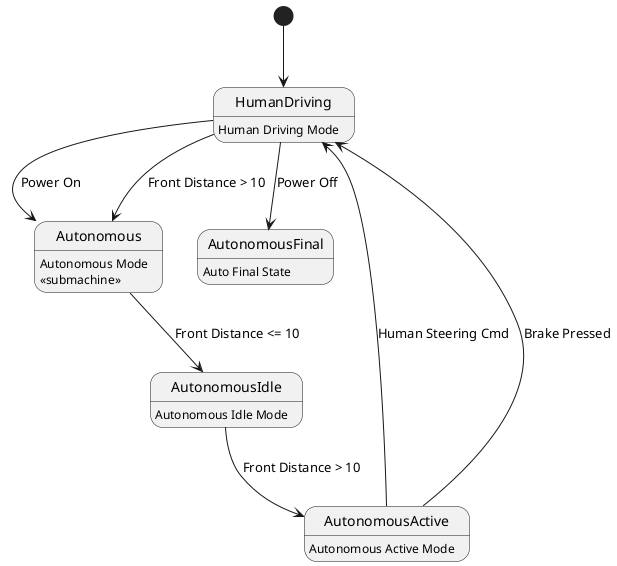

# Pair `0010`：NL + PlantUML STM0 + FCSTM STM0

[上一组 `0009`](../0009/README.md) | [返回 60 组索引](../../PAIR_INDEX.md) | [下一组 `0011`](../0011/README.md)

- LLM：`GPT-4`
- 模型/场景：high-level driving module
- NL SHA-256：`f1c3dc88371b8256352e7ab6ee7eb42424de6e11dfde70d185f224dd1d05a7a8`
- PlantUML SHA-256：`73021d0499bdbbc34299e07733dda58162aefdf297e57bd6aae76da940aaed53`
- FCSTM SHA-256：`b638507f16a5b1ff4557a3fbf76f38c0bd24a9c3ea221e050f813a924c8577bb`
- 结构裁决：`structure_preserved`
- FCSTM execution eligible：`false`
- Discover eligible：`false`
- 主 session 对读：5 state、8 条 edge 与 body/`<<submachine>>` opaque metadata 齐。
- 三个原始文件：[NL](./nl.txt) | [PlantUML](./plantuml.puml) | [FCSTM](./fcstm.fcstm)
- 审计入口：[canonical](../../canonical/llms_emp_stm_results_0010.json) | [冻结 FCSTM](../../fcstm/llms_emp_stm_results_0010.fcstm) | [case report](../../case_reports/llms_emp_stm_results_0010.json) | [人工总账](../../MANUAL_REVIEW.md)

## NL

```text
1 The human driving mode is represented by a simple state. 2 The autonomous mode has sub-states and is represented by a sub machine state. 3. when power on, the system turn into human driving mode 4when front_distance > 10, auto transport to autonomous state 4. transit to human driving mode when receive human steering cmd, brake pressed, in (auto final) 5 when power off, it will transit to final state
```

## 原装 PlantUML STM0



## 转换后 FCSTM STM0

```fcstm
state llms_emp_stm_results_0010 named "llms_emp_stm_results_0010" {
    event Power_On named "Power On";
    event Front_Distance_10 named "Front Distance <= 10";
    event Front_Distance_10_2 named "Front Distance > 10";
    event Human_Steering_Cmd named "Human Steering Cmd";
    event Brake_Pressed named "Brake Pressed";
    event Power_Off named "Power Off";
    state HumanDriving named "HumanDriving\n[PlantUML body] Human Driving Mode";
    state Autonomous named "Autonomous\n[PlantUML body] Autonomous Mode\n[PlantUML body] <<submachine>>";
    state AutonomousIdle named "AutonomousIdle\n[PlantUML body] Autonomous Idle Mode";
    state AutonomousActive named "AutonomousActive\n[PlantUML body] Autonomous Active Mode";
    state AutonomousFinal named "AutonomousFinal\n[PlantUML body] Auto Final State";
    [*] -> HumanDriving;
    HumanDriving -> Autonomous : /Power_On;
    Autonomous -> AutonomousIdle : /Front_Distance_10;
    AutonomousIdle -> AutonomousActive : /Front_Distance_10_2;
    AutonomousActive -> HumanDriving : /Human_Steering_Cmd;
    AutonomousActive -> HumanDriving : /Brake_Pressed;
    HumanDriving -> Autonomous : /Front_Distance_10_2;
    HumanDriving -> AutonomousFinal : /Power_Off;
}
```

[上一组 `0009`](../0009/README.md) | [返回 60 组索引](../../PAIR_INDEX.md) | [下一组 `0011`](../0011/README.md)
