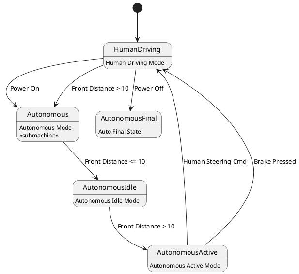

# Pair `0010`：NL + PlantUML STM0 + FCSTM STM0

[上一组 `0009`](../0009/README.md) | [返回 60 组索引](../../PAIR_INDEX.md) | [下一组 `0011`](../0011/README.md)

- LLM：`GPT-4`
- 模型/场景：high-level driving module
- 作者输出阶段：`Result with Semantic Checking`
- 作者输出单元格：`AE12`；Excel row：`12`
- Phase-I fallback：`false`
- 相对 Phase-I 是否变化：`false`
- Phase-I PlantUML SHA-256：`73021d0499bdbbc34299e07733dda58162aefdf297e57bd6aae76da940aaed53`
- NL SHA-256：`f1c3dc88371b8256352e7ab6ee7eb42424de6e11dfde70d185f224dd1d05a7a8`
- PlantUML SHA-256：`73021d0499bdbbc34299e07733dda58162aefdf297e57bd6aae76da940aaed53`
- FCSTM SHA-256：`d3d10565f4aaadcc99f7b97f2d78ff6443ce29be439b229ed041fc9d2b1d9f38`
- review subject SHA-256：`69cf1a3da87360d753fc325325c6d103f5e4cde1cfb90a2d55b18163e7c447ad`
- working contract SHA-256：`fc34f0feef2332c26824d9cdea0018c0f938c1b56a28640c7666582ea9f0aab5`
- 结构裁决：`structure_preserved`
- source states / transitions：`5` / `8`
- mapped / blocked / silent drop：`8` / `0` / `0`
- final / lifecycle / body coverage：`0/0` / `0/0` / `6/6`
- concurrent region / separator coverage：`0/0` / `0/0`
- source normalization coverage：`0/0`
- official raw / validation：`state_diagram` / `state_diagram`
- official identity states / transitions：`5` / `8`
- official identity remaps：state `0` / transition endpoint `0`
- AST audit：`passed`
- legacy whole-model FCSTM execution / Discover：`false` / `false`
- working bundle usage gate：`discover_input_with_capability_mask`
- ownership source / compiler / agent：`19` / `15` / `0`
- source macro / positive identity trace / conversion boundary trace：`14` / `19` / `0`
- capability source-static / simulation / transition-trace：`eligible_with_exclusions` / `ineligible` / `ineligible`
- compiler-only diagnostic policy：`rejected_conversion_artifact`；main-result conversion artifact limit：`0`
- 主 session 对读：`pass`；ownership/macro/capability 均为 `pass`；Case 0010 passes conversion-attribution review. This does not assert NL/PlantUML correctness or runtime equivalence; authored defects remain eligible for later source-grounded Discover. No conversion-specific blocker was found in the exact reviewed occurrences. Fresh v6 main-session review re-read NL, PlantUML, FCSTM, working contract, and source trace after the portable Java identity change; source/FCSTM/trace bytes are unchanged and verification remains fail-closed.
- source anchors：`source-ref:llms_emp_feedback_final_0010.puml:line:2\|[*] --> HumanDriving, source-ref:llms_emp_feedback_final_0010.puml:line:5\|HumanDriving --> Autonomous : Power On`；FCSTM anchors：`element-ref:source:state:HumanDriving@line:8\|state HumanDriving named "HumanDriving\n[PlantUML body] Human Driving Mode";, element-ref:compiler:transition_segment:tr_0002:segment:1@line:14\|HumanDriving -> Autonomous : /Power_On;`
- 三个原始文件：[NL](./nl.txt) | [PlantUML](./plantuml.puml) | [FCSTM](./fcstm.fcstm)
- 审计入口：[canonical](../../canonical/llms_emp_feedback_final_0010.json) | [冻结 FCSTM](../../fcstm/llms_emp_feedback_final_0010.fcstm) | [case report](../../case_reports/llms_emp_feedback_final_0010.json) | [working contract](../../working_contracts/llms_emp_feedback_final_0010.json) | [source trace](../../source_traces/llms_emp_feedback_final_0010.json) | [人工总账](../../MANUAL_REVIEW.md)

## 主 session 三方语义对应

| projection | assessment | NL anchor | PlantUML anchor | FCSTM anchor | source roots | compiler members | rationale |
|---|---|---|---|---|---|---|---|
| `direct` | `preserved` | 1 The human driving mode is represented by a simple state. | source-ref:llms_emp_feedback_final_0010.puml:line:2\|[*] --> HumanDriving | element-ref:source:state:HumanDriving@line:8\|state HumanDriving named "HumanDriving\n[PlantUML body] Human Driving Mode"; | source:state:HumanDriving | - | Case 0010 binds source:state:HumanDriving to the exact authored occurrence '[*] --> HumanDriving'; it is present as a direct FCSTM state projection with the same source identity and parent relation. |
| `macro` | `preserved_with_exclusions` | autonomous | source-ref:llms_emp_feedback_final_0010.puml:line:5\|HumanDriving --> Autonomous : Power On | element-ref:compiler:transition_segment:tr_0002:segment:1@line:14\|HumanDriving -> Autonomous : /Power_On; | source:transition:tr_0002 | compiler:transition_segment:tr_0002:segment:1 | Case 0010 binds source:transition:tr_0002 to the exact authored occurrence 'HumanDriving --> Autonomous : Power On'; it is present as a source-owned transition root whose cited FCSTM line belongs to a protected compiler macro; the raw label remains opaque. |

## Risk occurrence 第二遍复核

本组不要求 risk-tag 第二遍复核。

## 作者阶段 lineage

| stage | output cell | present | output SHA-256 | feedback | resolved |
|---|---|---|---|---|---|
| `phase_i_generation` | `I12` | `true` | `73021d0499bdbbc34299e07733dda58162aefdf297e57bd6aae76da940aaed53` | - | - |
| `phase_ii_format` | `U12` | `false` | `-` | - | - |
| `phase_ii_grammar` | `Z12` | `false` | `-` | - | - |
| `phase_ii_semantic` | `AE12` | `true` | `73021d0499bdbbc34299e07733dda58162aefdf297e57bd6aae76da940aaed53` | None | - |

## Official identity ledger

- status：`aligned`
- canonical / official states：`5` / `5`
- aligned transition endpoints：`8`

本组 state identity 无需重映射。

本组 transition endpoint 无需重映射。

## Source normalization ledger

本组没有 source-input normalization。

## Concurrent region ledger

本组没有 PlantUML orthogonal/concurrent region separator。

## Operational debt

| reason code | count |
|---|---:|
| `R45.DEBT.opaque_state_body_semantics` | 6 |
| `R45.DEBT.opaque_transition_label_semantics` | 7 |

## NL

```text
1 The human driving mode is represented by a simple state. 2 The autonomous mode has sub-states and is represented by a sub machine state. 3. when power on, the system turn into human driving mode 4when front_distance > 10, auto transport to autonomous state 4. transit to human driving mode when receive human steering cmd, brake pressed, in (auto final) 5 when power off, it will transit to final state
```

## 作者 Phase-II 最终 PlantUML STM0



## 转换后 FCSTM STM0

```fcstm
state llms_emp_feedback_final_0010 named "llms_emp_feedback_final_0010" {
    event Power_On named "Power On";
    event Front_Distance_10 named "Front Distance <= 10";
    event Front_Distance_10_2 named "Front Distance > 10";
    event Human_Steering_Cmd named "Human Steering Cmd";
    event Brake_Pressed named "Brake Pressed";
    event Power_Off named "Power Off";
    state HumanDriving named "HumanDriving\n[PlantUML body] Human Driving Mode";
    state Autonomous named "Autonomous\n[PlantUML body] Autonomous Mode\n[PlantUML body] <<submachine>>";
    state AutonomousIdle named "AutonomousIdle\n[PlantUML body] Autonomous Idle Mode";
    state AutonomousActive named "AutonomousActive\n[PlantUML body] Autonomous Active Mode";
    state AutonomousFinal named "AutonomousFinal\n[PlantUML body] Auto Final State";
    [*] -> HumanDriving;
    HumanDriving -> Autonomous : /Power_On;
    Autonomous -> AutonomousIdle : /Front_Distance_10;
    AutonomousIdle -> AutonomousActive : /Front_Distance_10_2;
    AutonomousActive -> HumanDriving : /Human_Steering_Cmd;
    AutonomousActive -> HumanDriving : /Brake_Pressed;
    HumanDriving -> Autonomous : /Front_Distance_10_2;
    HumanDriving -> AutonomousFinal : /Power_Off;
}
```

[上一组 `0009`](../0009/README.md) | [返回 60 组索引](../../PAIR_INDEX.md) | [下一组 `0011`](../0011/README.md)
