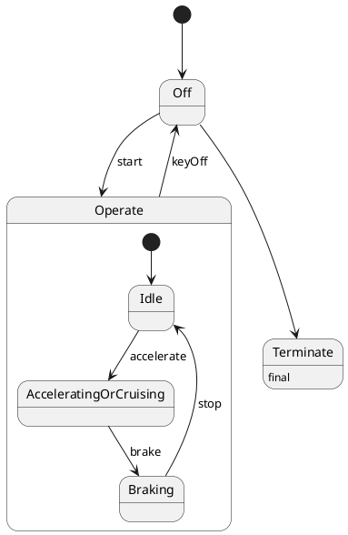

# Pair `0012`：NL + PlantUML STM0 + FCSTM STM0

[上一组 `0011`](../0011/README.md) | [返回 60 组索引](../../PAIR_INDEX.md) | [下一组 `0013`](../0013/README.md)

- LLM：`GPT-4`
- 模型/场景：Hybrid Sport Utility Vehicle, HSUV
- 作者输出阶段：`Result with Semantic Checking`
- 作者输出单元格：`AE14`；Excel row：`14`
- Phase-I fallback：`false`
- 相对 Phase-I 是否变化：`true`
- Phase-I PlantUML SHA-256：`0314bb466726c4ba81177282e717511244fc77bf24682ba951f4103fd32b169a`
- NL SHA-256：`9fe426ba761d5a52c3b670f35410502a5289bdd9489c4a9bfa983e34d565040c`
- PlantUML SHA-256：`780040c1be8a0ce29cc3e2373d8634e4b5819020097c04e0ac33ab4fcea5b9e8`
- FCSTM SHA-256：`ba25b8f96a8b4b99a75caa97a0ba8707e6032dfc3d67521510c8a929059f79ab`
- review subject SHA-256：`d379b17978948c310268650942c78e89ade83e87d7b909154ae5d3710dc1931e`
- working contract SHA-256：`4d7a6995a578e71f4abc36da37264524efac0fc569b09ac36c690d4a96666dd9`
- 结构裁决：`structure_preserved`
- source states / transitions：`6` / `8`
- mapped / blocked / silent drop：`8` / `0` / `0`
- final / lifecycle / body coverage：`0/0` / `0/0` / `1/1`
- concurrent region / separator coverage：`0/0` / `0/0`
- source normalization coverage：`0/0`
- official raw / validation：`state_diagram` / `state_diagram`
- official identity states / transitions：`6` / `8`
- official identity remaps：state `0` / transition endpoint `0`
- AST audit：`passed`
- legacy whole-model FCSTM execution / Discover：`false` / `false`
- working bundle usage gate：`discover_input_with_capability_mask`
- ownership source / compiler / agent：`15` / `14` / `0`
- source macro / positive identity trace / conversion boundary trace：`9` / `15` / `0`
- capability source-static / simulation / transition-trace：`eligible_with_exclusions` / `ineligible` / `ineligible`
- compiler-only diagnostic policy：`rejected_conversion_artifact`；main-result conversion artifact limit：`0`
- 主 session 对读：`pass`；ownership/macro/capability 均为 `pass`；Case 0012 passes conversion-attribution review. This does not assert NL/PlantUML correctness or runtime equivalence; authored defects remain eligible for later source-grounded Discover. No conversion-specific blocker was found in the exact reviewed occurrences. Fresh v6 main-session review re-read NL, PlantUML, FCSTM, working contract, and source trace after the portable Java identity change; source/FCSTM/trace bytes are unchanged and verification remains fail-closed.
- source anchors：`source-ref:llms_emp_feedback_final_0012.puml:line:4\|state Operate {, source-ref:llms_emp_feedback_final_0012.puml:line:8\|Braking --> Idle : stop`；FCSTM anchors：`element-ref:source:state:Operate@line:7\|state Operate named "Operate" {, element-ref:compiler:transition_segment:tr_0006:segment:1@line:14\|Braking -> Idle : /stop;`
- 三个原始文件：[NL](./nl.txt) | [PlantUML](./plantuml.puml) | [FCSTM](./fcstm.fcstm)
- 审计入口：[canonical](../../canonical/llms_emp_feedback_final_0012.json) | [冻结 FCSTM](../../fcstm/llms_emp_feedback_final_0012.fcstm) | [case report](../../case_reports/llms_emp_feedback_final_0012.json) | [working contract](../../working_contracts/llms_emp_feedback_final_0012.json) | [source trace](../../source_traces/llms_emp_feedback_final_0012.json) | [人工总账](../../MANUAL_REVIEW.md)

## 主 session 三方语义对应

| projection | assessment | NL anchor | PlantUML anchor | FCSTM anchor | source roots | compiler members | rationale |
|---|---|---|---|---|---|---|---|
| `direct` | `preserved` | Operate | source-ref:llms_emp_feedback_final_0012.puml:line:4\|state Operate { | element-ref:source:state:Operate@line:7\|state Operate named "Operate" { | source:state:Operate | - | Case 0012 binds source:state:Operate to the exact authored occurrence 'state Operate {'; it is present as a direct FCSTM state projection with the same source identity and parent relation. |
| `macro` | `preserved_with_exclusions` | Braking | source-ref:llms_emp_feedback_final_0012.puml:line:8\|Braking --> Idle : stop | element-ref:compiler:transition_segment:tr_0006:segment:1@line:14\|Braking -> Idle : /stop; | source:transition:tr_0006 | compiler:transition_segment:tr_0006:segment:1 | Case 0012 binds source:transition:tr_0006 to the exact authored occurrence 'Braking --> Idle : stop'; it is present as a source-owned transition root whose cited FCSTM line belongs to a protected compiler macro; the raw label remains opaque. |

## Risk occurrence 第二遍复核

本组不要求 risk-tag 第二遍复核。

## 作者阶段 lineage

| stage | output cell | present | output SHA-256 | feedback | resolved |
|---|---|---|---|---|---|
| `phase_i_generation` | `I14` | `true` | `0314bb466726c4ba81177282e717511244fc77bf24682ba951f4103fd32b169a` | - | - |
| `phase_ii_format` | `U14` | `false` | `-` | - | - |
| `phase_ii_grammar` | `Z14` | `false` | `-` | - | - |
| `phase_ii_semantic` | `AE14` | `true` | `780040c1be8a0ce29cc3e2373d8634e4b5819020097c04e0ac33ab4fcea5b9e8` | 1. missing final state | 1.0 |

## Official identity ledger

- status：`aligned`
- canonical / official states：`6` / `6`
- aligned transition endpoints：`8`

本组 state identity 无需重映射。

本组 transition endpoint 无需重映射。

## Source normalization ledger

本组没有 source-input normalization。

## Concurrent region ledger

本组没有 PlantUML orthogonal/concurrent region separator。

## Operational debt

| reason code | count |
|---|---:|
| `R45.DEBT.opaque_state_body_semantics` | 1 |
| `R45.DEBT.opaque_transition_label_semantics` | 5 |

## NL

```text
1. Once the device is powered on, the system enters the `Operate` state, and based on user actions, it transitions between `Idle`, `Accelerating or Cruising`, and `Braking` states.
2. The system can be turned on with the `start` signal and turned off with the `keyOff` signal.
3. Within the `Operate` state, the system transitions between different substates depending on actions like accelerating, braking, or stopping.
```

## 作者 Phase-II 最终 PlantUML STM0



## 转换后 FCSTM STM0

```fcstm
state llms_emp_feedback_final_0012 named "llms_emp_feedback_final_0012" {
    event start named "start";
    event accelerate named "accelerate";
    event brake named "brake";
    event stop named "stop";
    event keyOff named "keyOff";
    state Operate named "Operate" {
        state Idle named "Idle";
        state AcceleratingOrCruising named "AcceleratingOrCruising";
        state Braking named "Braking";
        [*] -> Idle;
        Idle -> AcceleratingOrCruising : /accelerate;
        AcceleratingOrCruising -> Braking : /brake;
        Braking -> Idle : /stop;
    }
    state Off named "Off";
    state Terminate named "Terminate\n[PlantUML body] final";
    [*] -> Off;
    Off -> Operate : /start;
    !Operate -> Off : /keyOff;
    Off -> Terminate;
}
```

[上一组 `0011`](../0011/README.md) | [返回 60 组索引](../../PAIR_INDEX.md) | [下一组 `0013`](../0013/README.md)
