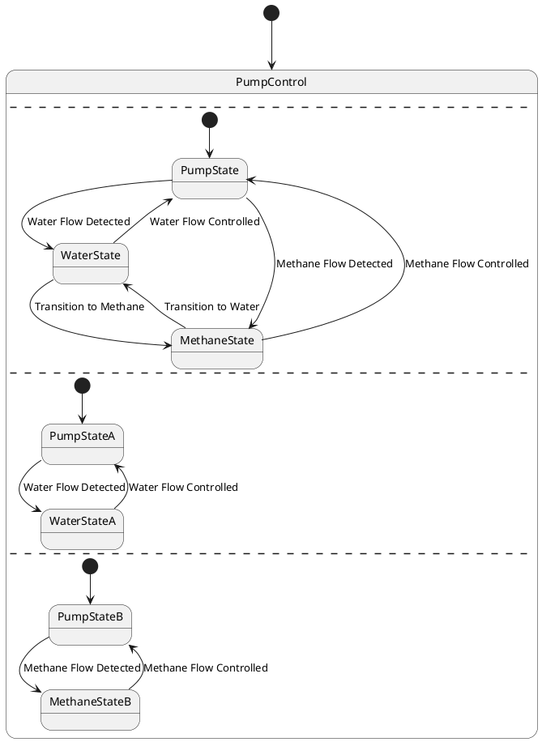

# Pair `0013`：NL + PlantUML STM0 + FCSTM STM0

[上一组 `0012`](../0012/README.md) | [返回 60 组索引](../../PAIR_INDEX.md) | [下一组 `0014`](../0014/README.md)

- LLM：`GPT-4`
- 模型/场景：Pump Control state machine
- 作者输出阶段：`Result with Semantic Checking`
- 作者输出单元格：`AE15`；Excel row：`15`
- Phase-I fallback：`false`
- 相对 Phase-I 是否变化：`true`
- Phase-I PlantUML SHA-256：`d46d378e8239a870c0e5dec9f91181ba49cd1678544697446b2503b2fd5acb07`
- NL SHA-256：`a391765dba935d89e6d2467c97b218c0136d106ea9c00bac91e6525e28ac04f1`
- PlantUML SHA-256：`4cdfc6b394c6b326b42313921f0333bcee75481947d3dc70318c2f3689242fc4`
- FCSTM SHA-256：`87f2149a1afbd4f27209f3850c06dd47e46bf2a20a74b4ddb06548c48d7d4bd4`
- 结构裁决：`structure_preserved`
- source states / transitions：`8` / `14`
- mapped / blocked / silent drop：`14` / `0` / `0`
- final / lifecycle / body coverage：`0/0` / `0/0` / `0/0`
- concurrent region / separator coverage：`4/4` / `3/3`
- source normalization coverage：`0/0`
- official raw / validation：`state_diagram` / `state_diagram`
- official identity states / transitions：`8` / `14`
- official identity remaps：state `0` / transition endpoint `0`
- AST audit：`passed`
- FCSTM execution eligible：`false`
- Discover eligible：`false`
- 主 session 对读：完整对读：PumpControl 的三个 `--` 形成空 region 0 加三组有效 region，8 状态、14 条边逐条保留；FCSTM 只串行承载并把正交语义和同 scope 多 initial 明确列债。
- 三个原始文件：[NL](./nl.txt) | [PlantUML](./plantuml.puml) | [FCSTM](./fcstm.fcstm)
- 审计入口：[canonical](../../canonical/llms_emp_feedback_final_0013.json) | [冻结 FCSTM](../../fcstm/llms_emp_feedback_final_0013.fcstm) | [case report](../../case_reports/llms_emp_feedback_final_0013.json) | [人工总账](../../MANUAL_REVIEW.md)

## 作者阶段 lineage

| stage | output cell | present | output SHA-256 | feedback | resolved |
|---|---|---|---|---|---|
| `phase_i_generation` | `I15` | `true` | `d46d378e8239a870c0e5dec9f91181ba49cd1678544697446b2503b2fd5acb07` | - | - |
| `phase_ii_format` | `U15` | `false` | `-` | - | - |
| `phase_ii_grammar` | `Z15` | `false` | `-` | - | - |
| `phase_ii_semantic` | `AE15` | `true` | `4cdfc6b394c6b326b42313921f0333bcee75481947d3dc70318c2f3689242fc4` | 1. use region | 1.0 |

## Official identity ledger

- status：`aligned`
- canonical / official states：`8` / `8`
- aligned transition endpoints：`14`

本组 state identity 无需重映射。

本组 transition endpoint 无需重映射。

## Source normalization ledger

本组没有 source-input normalization。

## Concurrent region ledger

| owner | region | direct states | direct transitions | separator before | separator after |
|---|---:|---|---|---|---|
| `PumpControl` | 0 | - | - | - | llms_emp_feedback_final_0013.puml:line:5 |
| `PumpControl` | 1 | PumpControl.PumpState, PumpControl.WaterState, PumpControl.MethaneState | tr_0002, tr_0003, tr_0004, tr_0005, tr_0006, tr_0007, tr_0008 | llms_emp_feedback_final_0013.puml:line:5 | llms_emp_feedback_final_0013.puml:line:21 |
| `PumpControl` | 2 | PumpControl.PumpStateA, PumpControl.WaterStateA | tr_0009, tr_0010, tr_0011 | llms_emp_feedback_final_0013.puml:line:21 | llms_emp_feedback_final_0013.puml:line:30 |
| `PumpControl` | 3 | PumpControl.PumpStateB, PumpControl.MethaneStateB | tr_0012, tr_0013, tr_0014 | llms_emp_feedback_final_0013.puml:line:30 | - |

## Operational debt

| reason code | count |
|---|---:|
| `R45.DEBT.concurrent_region_semantics` | 1 |
| `R45.DEBT.multiple_initial_fanout` | 1 |
| `R45.DEBT.opaque_transition_label_semantics` | 10 |

## NL

```text
1. The system begins in the PumpControl state, from which it can transition to different substates based on specific conditions.
2. Within the PumpControl state, there are three main substates: PumpState, WaterState, and MethaneState.
3. The system first transitions to the PumpState substate, where the pump is activated or controlled.
4. The system can also transition to the WaterState substate, indicating that the pump is controlling or monitoring the water flow.
5. Similarly, the system can transition to the MethaneState substate, indicating that the pump is controlling or monitoring the methane flow.
```

## 作者 Phase-II 最终 PlantUML STM0



## 转换后 FCSTM STM0

```fcstm
state llms_emp_feedback_final_0013 named "llms_emp_feedback_final_0013" {
    event Water_Flow_Detected named "Water Flow Detected";
    event Methane_Flow_Detected named "Methane Flow Detected";
    event Water_Flow_Controlled named "Water Flow Controlled";
    event Transition_to_Methane named "Transition to Methane";
    event Methane_Flow_Controlled named "Methane Flow Controlled";
    event Transition_to_Water named "Transition to Water";
    state PumpControl named "PumpControl\n[PlantUML concurrent region 0] states=-; transitions=-\n[PlantUML concurrent region 1] states=PumpControl.PumpState, PumpControl.WaterState, PumpControl.MethaneState; transitions=tr_0002, tr_0003, tr_0004, tr_0005, tr_0006, tr_0007, tr_0008\n[PlantUML concurrent region 2] states=PumpControl.PumpStateA, PumpControl.WaterStateA; transitions=tr_0009, tr_0010, tr_0011\n[PlantUML concurrent region 3] states=PumpControl.PumpStateB, PumpControl.MethaneStateB; transitions=tr_0012, tr_0013, tr_0014\n[PlantUML concurrent separator] region 0 -> 1 at llms_emp_feedback_final_0013.puml:line:5\n[PlantUML concurrent separator] region 1 -> 2 at llms_emp_feedback_final_0013.puml:line:21\n[PlantUML concurrent separator] region 2 -> 3 at llms_emp_feedback_final_0013.puml:line:30" {
        state PumpState named "PumpState";
        state WaterState named "WaterState";
        state MethaneState named "MethaneState";
        state PumpStateA named "PumpStateA";
        state WaterStateA named "WaterStateA";
        state PumpStateB named "PumpStateB";
        state MethaneStateB named "MethaneStateB";
        [*] -> PumpState;
        PumpState -> WaterState : /Water_Flow_Detected;
        PumpState -> MethaneState : /Methane_Flow_Detected;
        WaterState -> PumpState : /Water_Flow_Controlled;
        WaterState -> MethaneState : /Transition_to_Methane;
        MethaneState -> PumpState : /Methane_Flow_Controlled;
        MethaneState -> WaterState : /Transition_to_Water;
        [*] -> PumpStateA;
        PumpStateA -> WaterStateA : /Water_Flow_Detected;
        WaterStateA -> PumpStateA : /Water_Flow_Controlled;
        [*] -> PumpStateB;
        PumpStateB -> MethaneStateB : /Methane_Flow_Detected;
        MethaneStateB -> PumpStateB : /Methane_Flow_Controlled;
    }
    [*] -> PumpControl;
}
```

[上一组 `0012`](../0012/README.md) | [返回 60 组索引](../../PAIR_INDEX.md) | [下一组 `0014`](../0014/README.md)
