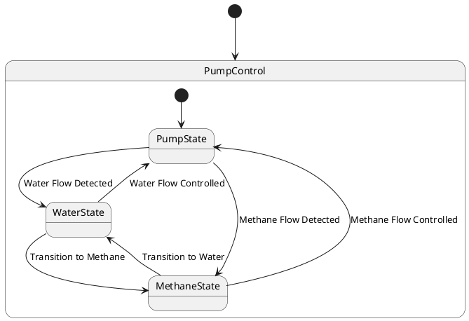

# Pair `0013`：NL + PlantUML STM0 + FCSTM STM0

[上一组 `0012`](../0012/README.md) | [返回 60 组索引](../../PAIR_INDEX.md) | [下一组 `0014`](../0014/README.md)

- LLM：`GPT-4`
- 模型/场景：Pump Control state machine
- NL SHA-256：`a391765dba935d89e6d2467c97b218c0136d106ea9c00bac91e6525e28ac04f1`
- PlantUML SHA-256：`d46d378e8239a870c0e5dec9f91181ba49cd1678544697446b2503b2fd5acb07`
- FCSTM SHA-256：`d90985d4a257ea33c06078fe99f3de930fb18d3d2c472c37b4c108aaa6a978bd`
- 结构裁决：`structure_preserved`
- FCSTM execution eligible：`false`
- Discover eligible：`false`
- 主 session 对读：PumpControl 三子状态、两级 initial 与六条双向控制边齐。
- 三个原始文件：[NL](./nl.txt) | [PlantUML](./plantuml.puml) | [FCSTM](./fcstm.fcstm)
- 审计入口：[canonical](../../canonical/llms_emp_stm_results_0013.json) | [冻结 FCSTM](../../fcstm/llms_emp_stm_results_0013.fcstm) | [case report](../../case_reports/llms_emp_stm_results_0013.json) | [人工总账](../../MANUAL_REVIEW.md)

## NL

```text
1. The system begins in the PumpControl state, from which it can transition to different substates based on specific conditions.
2. Within the PumpControl state, there are three main substates: PumpState, WaterState, and MethaneState.
3. The system first transitions to the PumpState substate, where the pump is activated or controlled.
4. The system can also transition to the WaterState substate, indicating that the pump is controlling or monitoring the water flow.
5. Similarly, the system can transition to the MethaneState substate, indicating that the pump is controlling or monitoring the methane flow.
```

## 原装 PlantUML STM0



## 转换后 FCSTM STM0

```fcstm
state llms_emp_stm_results_0013 named "llms_emp_stm_results_0013" {
    event Water_Flow_Detected named "Water Flow Detected";
    event Methane_Flow_Detected named "Methane Flow Detected";
    event Water_Flow_Controlled named "Water Flow Controlled";
    event Transition_to_Methane named "Transition to Methane";
    event Methane_Flow_Controlled named "Methane Flow Controlled";
    event Transition_to_Water named "Transition to Water";
    state PumpControl named "PumpControl" {
        state PumpState named "PumpState";
        state WaterState named "WaterState";
        state MethaneState named "MethaneState";
        [*] -> PumpState;
        PumpState -> WaterState : /Water_Flow_Detected;
        PumpState -> MethaneState : /Methane_Flow_Detected;
        WaterState -> PumpState : /Water_Flow_Controlled;
        WaterState -> MethaneState : /Transition_to_Methane;
        MethaneState -> PumpState : /Methane_Flow_Controlled;
        MethaneState -> WaterState : /Transition_to_Water;
    }
    [*] -> PumpControl;
}
```

[上一组 `0012`](../0012/README.md) | [返回 60 组索引](../../PAIR_INDEX.md) | [下一组 `0014`](../0014/README.md)
