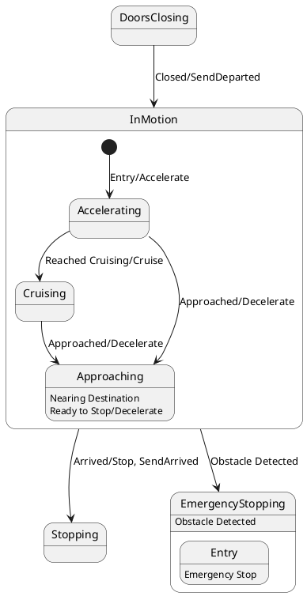

# Pair `0014`：NL + PlantUML STM0 + FCSTM STM0

[上一组 `0013`](../0013/README.md) | [返回 60 组索引](../../PAIR_INDEX.md) | [下一组 `0015`](../0015/README.md)

- LLM：`GPT-4`
- 模型/场景：state machine for Train Control
- 作者输出阶段：`Result with Semantic Checking`
- 作者输出单元格：`AE16`；Excel row：`16`
- Phase-I fallback：`false`
- 相对 Phase-I 是否变化：`true`
- Phase-I PlantUML SHA-256：`711124b29144fbb337739a5e7d8d97d8b7cdacd5828e71a036f0bbbae40364fc`
- NL SHA-256：`3110cbcf15bfb507f0326965970888eada5541b791b5fa661698dfc74e82c2ce`
- PlantUML SHA-256：`36f37fba4bcf46ac2f33879309c90543d30aef033d1e692c83272858bbf45876`
- FCSTM SHA-256：`11c39b60937cace57632d6cb9ac9d6aef1c439b7fbee8ce0c1b9e11af832115d`
- 结构裁决：`structure_preserved`
- source states / transitions：`8` / `7`
- mapped / blocked / silent drop：`7` / `0` / `0`
- final / lifecycle / body coverage：`0/0` / `0/0` / `4/4`
- concurrent region / separator coverage：`0/0` / `0/0`
- source normalization coverage：`0/0`
- official raw / validation：`state_diagram` / `state_diagram`
- official identity states / transitions：`8` / `7`
- official identity remaps：state `0` / transition endpoint `0`
- AST audit：`passed`
- FCSTM execution eligible：`false`
- Discover eligible：`false`
- 主 session 对读：完整对读：InMotion 带事件 initial、三运动子态和两个跨层出口均保存；根层无 source initial 留 UnspecifiedInitial，`Entry: Emergency Stop` 按官方解析为 Entry state/body而非伪造 lifecycle。
- 三个原始文件：[NL](./nl.txt) | [PlantUML](./plantuml.puml) | [FCSTM](./fcstm.fcstm)
- 审计入口：[canonical](../../canonical/llms_emp_feedback_final_0014.json) | [冻结 FCSTM](../../fcstm/llms_emp_feedback_final_0014.fcstm) | [case report](../../case_reports/llms_emp_feedback_final_0014.json) | [人工总账](../../MANUAL_REVIEW.md)

## 作者阶段 lineage

| stage | output cell | present | output SHA-256 | feedback | resolved |
|---|---|---|---|---|---|
| `phase_i_generation` | `I16` | `true` | `711124b29144fbb337739a5e7d8d97d8b7cdacd5828e71a036f0bbbae40364fc` | - | - |
| `phase_ii_format` | `U16` | `false` | `-` | - | - |
| `phase_ii_grammar` | `Z16` | `true` | `36f37fba4bcf46ac2f33879309c90543d30aef033d1e692c83272858bbf45876` | cannot connect internal state to the composite state itself. | YES |
| `phase_ii_semantic` | `AE16` | `true` | `36f37fba4bcf46ac2f33879309c90543d30aef033d1e692c83272858bbf45876` | None | - |

## Official identity ledger

- status：`aligned`
- canonical / official states：`8` / `8`
- aligned transition endpoints：`7`

本组 state identity 无需重映射。

本组 transition endpoint 无需重映射。

## Source normalization ledger

本组没有 source-input normalization。

## Concurrent region ledger

本组没有 PlantUML orthogonal/concurrent region separator。

## Operational debt

| reason code | count |
|---|---:|
| `R45.DEBT.missing_explicit_initial` | 3 |
| `R45.DEBT.opaque_state_body_semantics` | 4 |
| `R45.DEBT.opaque_transition_label_semantics` | 7 |

## NL

```text
1. The system starts in the DoorsClosing state and transitions to InMotion when the doors are closed, triggered by the "Closed/SendDeparted" signal.
2. In the InMotion state, the system can either transition to the Stopping state when it arrives, indicated by the "Arrived/Stop, Send Arrived" signal, or to the EmergencyStopping state if an obstacle is detected.
3. When an obstacle is detected, the system enters the EmergencyStopping state, which includes the actions "Emergency Stop" and sends the "Obstacle Detected" signal.
4. Within the InMotion state, the system operates in three substates: Accelerating, Cruising, and Approaching, which represent different phases of the train's motion.
5. The system begins in the Accelerating substate, moving to the Cruising substate once cruising speed is reached, as indicated by the "Reached Cruising/Cruise" signal.
6. If the system is in the Accelerating substate and approaches its destination, it transitions to the Approaching substate upon receiving the "Approached/Decelerate" signal.
7. The system in the Cruising substate transitions to the Approaching substate when it approaches the destination, triggered by the "Approached/Decelerate" signal.
8. The system enters the Accelerating substate when motion begins, marked by the "Entry/Accelerate" action.
9. In the Approaching substate, the system sends the "Send" signal and continues to approach the destination.
10. The system remains in the Approaching substate while nearing the destination, until it is ready to stop or decelerate.
```

## 作者 Phase-II 最终 PlantUML STM0



## 转换后 FCSTM STM0

```fcstm
state llms_emp_feedback_final_0014 named "llms_emp_feedback_final_0014" {
    event Closed_SendDeparted named "Closed/SendDeparted";
    event Entry_Accelerate named "Entry/Accelerate";
    event Reached_Cruising_Cruise named "Reached Cruising/Cruise";
    event Approached_Decelerate named "Approached/Decelerate";
    event Arrived_Stop_SendArrived named "Arrived/Stop, SendArrived";
    event Obstacle_Detected named "Obstacle Detected";
    state UnspecifiedInitial named "Unspecified initial";
    state DoorsClosing named "DoorsClosing";
    state InMotion named "InMotion" {
        state Accelerating named "Accelerating";
        state Cruising named "Cruising";
        state Approaching named "Approaching\n[PlantUML body] Nearing Destination\n[PlantUML body] Ready to Stop/Decelerate" {
            state UnspecifiedInitial named "Unspecified initial";
            [*] -> UnspecifiedInitial;
        }
        state InitialWaittr_0002 named "Awaiting initial event: Entry/Accelerate";
        [*] -> InitialWaittr_0002;
        InitialWaittr_0002 -> Accelerating : /Entry_Accelerate;
        Accelerating -> Cruising : /Reached_Cruising_Cruise;
        Accelerating -> Approaching : /Approached_Decelerate;
        Cruising -> Approaching : /Approached_Decelerate;
    }
    state Stopping named "Stopping";
    state EmergencyStopping named "EmergencyStopping\n[PlantUML body] Obstacle Detected" {
        state UnspecifiedInitial named "Unspecified initial";
        state Entry named "Entry\n[PlantUML body] Emergency Stop";
        [*] -> UnspecifiedInitial;
    }
    DoorsClosing -> InMotion : /Closed_SendDeparted;
    !InMotion -> Stopping : /Arrived_Stop_SendArrived;
    !InMotion -> EmergencyStopping : /Obstacle_Detected;
    [*] -> UnspecifiedInitial;
}
```

[上一组 `0013`](../0013/README.md) | [返回 60 组索引](../../PAIR_INDEX.md) | [下一组 `0015`](../0015/README.md)
