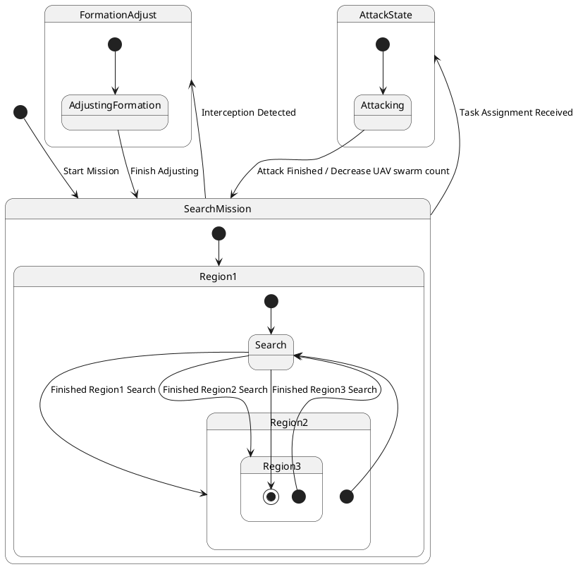

# Pair `0016`：NL + PlantUML STM0 + FCSTM STM0

[上一组 `0015`](../0015/README.md) | [返回 60 组索引](../../PAIR_INDEX.md) | [下一组 `0017`](../0017/README.md)

- LLM：`GPT-4`
- 模型/场景：UAV swarm state machine diagram
- 作者输出阶段：`Result with Semantic Checking`
- 作者输出单元格：`AE18`；Excel row：`18`
- Phase-I fallback：`false`
- 相对 Phase-I 是否变化：`true`
- Phase-I PlantUML SHA-256：`2720cab7a2e9d2d06ff784d4e5821c4905c21408d19b0db0496b679394d06d50`
- NL SHA-256：`a01c022f5380700b6c13800497291640b4d64abbadce1d8984be0c14880ebeb3`
- PlantUML SHA-256：`a7bb3b61e3f044807c5a94d619979c859c49b36e852f429c58a4aae0d979b422`
- FCSTM SHA-256：`29a755f894244cb9928eaba8fddbd1a4a92a1763fb1be4aab296e4180c187959`
- 结构裁决：`structure_preserved`
- source states / transitions：`9` / `14`
- mapped / blocked / silent drop：`14` / `0` / `0`
- final / lifecycle / body coverage：`1/1` / `0/0` / `0/0`
- concurrent region / separator coverage：`0/0` / `0/0`
- source normalization coverage：`0/0`
- official raw / validation：`state_diagram` / `state_diagram`
- official identity states / transitions：`9` / `14`
- official identity remaps：state `4` / transition endpoint `5`
- AST audit：`passed`
- FCSTM execution eligible：`false`
- Discover eligible：`false`
- 主 session 对读：完整对读：官方 first-use 将 Region2/Region3 逐层嵌入 Region1，并把三个 Search 统一为首实体；14 条边均保存，两个越界 initial 和一个越界 final 明确用 Invalid surrogate，未修饰成有效层次模型。
- 三个原始文件：[NL](./nl.txt) | [PlantUML](./plantuml.puml) | [FCSTM](./fcstm.fcstm)
- 审计入口：[canonical](../../canonical/llms_emp_feedback_final_0016.json) | [冻结 FCSTM](../../fcstm/llms_emp_feedback_final_0016.fcstm) | [case report](../../case_reports/llms_emp_feedback_final_0016.json) | [人工总账](../../MANUAL_REVIEW.md)

## 作者阶段 lineage

| stage | output cell | present | output SHA-256 | feedback | resolved |
|---|---|---|---|---|---|
| `phase_i_generation` | `I18` | `true` | `2720cab7a2e9d2d06ff784d4e5821c4905c21408d19b0db0496b679394d06d50` | - | - |
| `phase_ii_format` | `U18` | `false` | `-` | - | - |
| `phase_ii_grammar` | `Z18` | `false` | `-` | - | - |
| `phase_ii_semantic` | `AE18` | `true` | `a7bb3b61e3f044807c5a94d619979c859c49b36e852f429c58a4aae0d979b422` | missing regions | - |

## Official identity ledger

- status：`aligned`
- canonical / official states：`9` / `9`
- aligned transition endpoints：`14`

| source-parser identity | pinned PlantUML identity | raw ref | reason |
|---|---|---|---|
| `SearchMission.Region2` | `SearchMission.Region1.Region2` | `llms_emp_feedback_final_0016.puml:line:12` | `official_link_endpoint_identity` |
| `SearchMission.Region3` | `SearchMission.Region1.Region2.Region3` | `llms_emp_feedback_final_0016.puml:line:17` | `official_link_endpoint_identity` |
| `SearchMission.Region2.Search` | `SearchMission.Region1.Search` | `llms_emp_feedback_final_0016.puml:line:13` | `official_link_endpoint_identity` |
| `SearchMission.Region3.Search` | `SearchMission.Region1.Search` | `llms_emp_feedback_final_0016.puml:line:18` | `official_link_endpoint_identity` |

| transition | source before -> after | target before -> after | raw ref |
|---|---|---|---|
| `tr_0004` | `SearchMission.Region1.Search` -> `SearchMission.Region1.Search` | `SearchMission.Region2` -> `SearchMission.Region1.Region2` | `llms_emp_feedback_final_0016.puml:line:9` |
| `tr_0005` | `@initial:SearchMission.Region2` -> `@initial:SearchMission.Region1.Region2` | `SearchMission.Region2.Search` -> `SearchMission.Region1.Search` | `llms_emp_feedback_final_0016.puml:line:13` |
| `tr_0006` | `SearchMission.Region2.Search` -> `SearchMission.Region1.Search` | `SearchMission.Region3` -> `SearchMission.Region1.Region2.Region3` | `llms_emp_feedback_final_0016.puml:line:14` |
| `tr_0007` | `@initial:SearchMission.Region3` -> `@initial:SearchMission.Region1.Region2.Region3` | `SearchMission.Region3.Search` -> `SearchMission.Region1.Search` | `llms_emp_feedback_final_0016.puml:line:18` |
| `tr_0008` | `SearchMission.Region3.Search` -> `SearchMission.Region1.Search` | `@final:SearchMission.Region3` -> `@final:SearchMission.Region1.Region2.Region3` | `llms_emp_feedback_final_0016.puml:line:19` |

## Source normalization ledger

本组没有 source-input normalization。

## Concurrent region ledger

本组没有 PlantUML orthogonal/concurrent region separator。

## Operational debt

| reason code | count |
|---|---:|
| `R45.DEBT.invalid_source_final_scope` | 1 |
| `R45.DEBT.invalid_source_initial_target` | 2 |
| `R45.DEBT.opaque_transition_label_semantics` | 8 |

## NL

```text
1 This state machine model describes the state transitions of a UAV swarm.
2 Before the mission is completed, the UAV swarm continuously performs target search tasks, during which it operates within three different state areas.
3 When the UAV swarm is intercepted, it transitions to the formation adjustment state.
4 During flight, if task assignment information is received, it enters the attack state. After completing the attack, the number of UAVs in the swarm decreases accordingly.
```

## 作者 Phase-II 最终 PlantUML STM0



## 转换后 FCSTM STM0

```fcstm
state llms_emp_feedback_final_0016 named "llms_emp_feedback_final_0016" {
    event Start_Mission named "Start Mission";
    event Finished_Region1_Search named "Finished Region1 Search";
    event Finished_Region2_Search named "Finished Region2 Search";
    event Finished_Region3_Search named "Finished Region3 Search";
    event Interception_Detected named "Interception Detected";
    event Finish_Adjusting named "Finish Adjusting";
    event Task_Assignment_Received named "Task Assignment Received";
    event Attack_Finished_Decrease_UAV_swarm_count named "Attack Finished / Decrease UAV swarm count";
    state InitialWaittr_0001 named "Awaiting initial event: Start Mission";
    state SearchMission named "SearchMission" {
        state Region1 named "Region1" {
            state Region2 named "Region2" {
                state Region3 named "Region3" {
                    state InvalidInitialtr_0007 named "PlantUML initial target outside child scope: SearchMission.Region1.Search";
                    [*] -> InvalidInitialtr_0007;
                }
                state InvalidInitialtr_0005 named "PlantUML initial target outside child scope: SearchMission.Region1.Search";
                [*] -> Region3 : /Finished_Region2_Search;
                [*] -> InvalidInitialtr_0005;
            }
            state Search named "Search";
            state InvalidFinaltr_0008 named "PlantUML final boundary outside source ancestry: @final:SearchMission.Region1.Region2.Region3";
            [*] -> Search;
            Search -> Region2 : /Finished_Region1_Search;
            Search -> Region2 : /Finished_Region2_Search;
            Search -> InvalidFinaltr_0008 : /Finished_Region3_Search;
        }
        [*] -> Region1;
    }
    state FormationAdjust named "FormationAdjust" {
        state AdjustingFormation named "AdjustingFormation";
        [*] -> AdjustingFormation;
        AdjustingFormation -> [*] : /Finish_Adjusting;
    }
    state AttackState named "AttackState" {
        state Attacking named "Attacking";
        [*] -> Attacking;
        Attacking -> [*] : /Attack_Finished_Decrease_UAV_swarm_count;
    }
    [*] -> InitialWaittr_0001;
    InitialWaittr_0001 -> SearchMission : /Start_Mission;
    !SearchMission -> FormationAdjust : /Interception_Detected;
    FormationAdjust -> SearchMission : /Finish_Adjusting;
    !SearchMission -> AttackState : /Task_Assignment_Received;
    AttackState -> SearchMission : /Attack_Finished_Decrease_UAV_swarm_count;
}
```

[上一组 `0015`](../0015/README.md) | [返回 60 组索引](../../PAIR_INDEX.md) | [下一组 `0017`](../0017/README.md)
