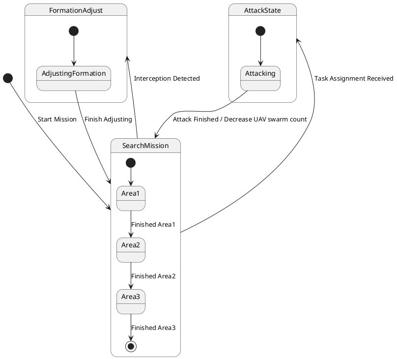

# Pair `0016`：NL + PlantUML STM0 + FCSTM STM0

[上一组 `0015`](../0015/README.md) | [返回 60 组索引](../../PAIR_INDEX.md) | [下一组 `0017`](../0017/README.md)

- LLM：`GPT-4`
- 模型/场景：UAV swarm state machine diagram
- NL SHA-256：`a01c022f5380700b6c13800497291640b4d64abbadce1d8984be0c14880ebeb3`
- PlantUML SHA-256：`2720cab7a2e9d2d06ff784d4e5821c4905c21408d19b0db0496b679394d06d50`
- FCSTM SHA-256：`f6174e4f88a1ababd642442fe5c1f793fd309fb0cc28680a510bbbd6e1227d43`
- 结构裁决：`structure_preserved`
- FCSTM execution eligible：`false`
- Discover eligible：`false`
- 主 session 对读：event-gated root initial、Search nested final、Formation/Attack 往返 macro 齐。
- 三个原始文件：[NL](./nl.txt) | [PlantUML](./plantuml.puml) | [FCSTM](./fcstm.fcstm)
- 审计入口：[canonical](../../canonical/llms_emp_stm_results_0016.json) | [冻结 FCSTM](../../fcstm/llms_emp_stm_results_0016.fcstm) | [case report](../../case_reports/llms_emp_stm_results_0016.json) | [人工总账](../../MANUAL_REVIEW.md)

## NL

```text
1 This state machine model describes the state transitions of a UAV swarm.
2 Before the mission is completed, the UAV swarm continuously performs target search tasks, during which it operates within three different state areas.
3 When the UAV swarm is intercepted, it transitions to the formation adjustment state.
4 During flight, if task assignment information is received, it enters the attack state. After completing the attack, the number of UAVs in the swarm decreases accordingly.
```

## 原装 PlantUML STM0



## 转换后 FCSTM STM0

```fcstm
state llms_emp_stm_results_0016 named "llms_emp_stm_results_0016" {
    event Start_Mission named "Start Mission";
    event Finished_Area1 named "Finished Area1";
    event Finished_Area2 named "Finished Area2";
    event Finished_Area3 named "Finished Area3";
    event Interception_Detected named "Interception Detected";
    event Finish_Adjusting named "Finish Adjusting";
    event Task_Assignment_Received named "Task Assignment Received";
    event Attack_Finished_Decrease_UAV_swarm_count named "Attack Finished / Decrease UAV swarm count";
    state InitialWaittr_0001 named "Awaiting initial event: Start Mission";
    state SearchMission named "SearchMission" {
        state Area1 named "Area1";
        state Area2 named "Area2";
        state Area3 named "Area3";
        state FinalWaittr_0005 named "Completed final boundary: SearchMission.Area3";
        [*] -> Area1;
        Area1 -> Area2 : /Finished_Area1;
        Area2 -> Area3 : /Finished_Area2;
        Area3 -> FinalWaittr_0005 : /Finished_Area3;
    }
    state FormationAdjust named "FormationAdjust" {
        state AdjustingFormation named "AdjustingFormation";
        [*] -> AdjustingFormation;
        AdjustingFormation -> [*] : /Finish_Adjusting;
    }
    state AttackState named "AttackState" {
        state Attacking named "Attacking";
        [*] -> Attacking;
        Attacking -> [*] : /Attack_Finished_Decrease_UAV_swarm_count;
    }
    [*] -> InitialWaittr_0001;
    InitialWaittr_0001 -> SearchMission : /Start_Mission;
    !SearchMission -> FormationAdjust : /Interception_Detected;
    FormationAdjust -> SearchMission : /Finish_Adjusting;
    !SearchMission -> AttackState : /Task_Assignment_Received;
    AttackState -> SearchMission : /Attack_Finished_Decrease_UAV_swarm_count;
}
```

[上一组 `0015`](../0015/README.md) | [返回 60 组索引](../../PAIR_INDEX.md) | [下一组 `0017`](../0017/README.md)
