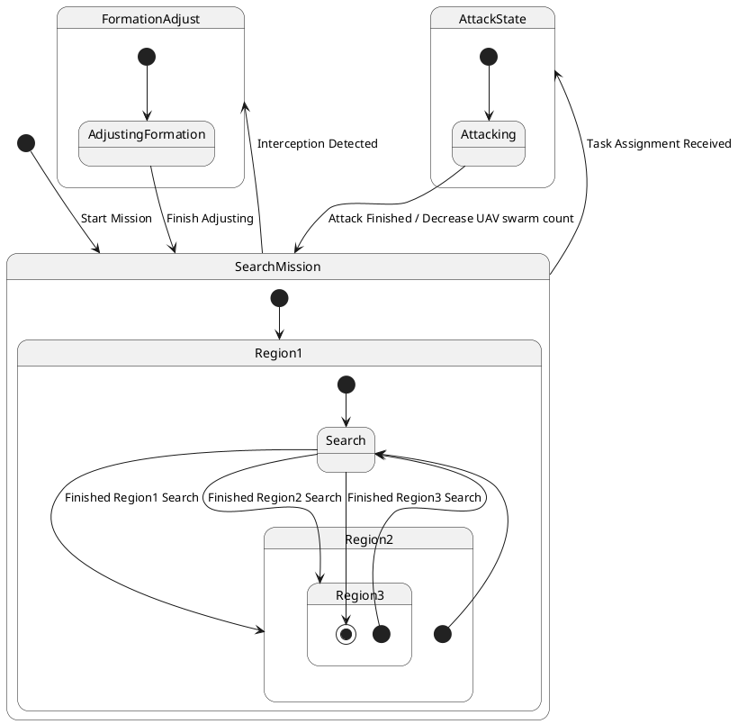

# Pair `0016`：NL + PlantUML STM0 + FCSTM STM0

[上一组 `0015`](../0015/README.md) | [返回 60 组索引](../../PAIR_INDEX.md) | [下一组 `0017`](../0017/README.md)

- LLM：`GPT-4`
- 模型/场景：UAV swarm state machine diagram
- 作者输出阶段：`Result with Semantic Checking`
- 作者输出单元格：`AE18`；Excel row：`18`
- Phase-I fallback：`false`
- 相对 Phase-I 是否变化：`true`
- Phase-I PlantUML SHA-256：`2720cab7a2e9d2d06ff784d4e5821c4905c21408d19b0db0496b679394d06d50`
- NL SHA-256：`a01c022f5380700b6c13800497291640b4d64abbadce1d8984be0c14880ebeb3`
- PlantUML SHA-256：`a7bb3b61e3f044807c5a94d619979c859c49b36e852f429c58a4aae0d979b422`
- FCSTM SHA-256：`29a755f894244cb9928eaba8fddbd1a4a92a1763fb1be4aab296e4180c187959`
- review subject SHA-256：`70d87f995697ea07cdde28095edf6ebb8380975ab2fe5e3d5dcddca1c5a5a86e`
- working contract SHA-256：`daf2c89993be636dc8516ad4cbea0948f81a5cc7b392b89c98d34de2c53a4dff`
- 结构裁决：`structure_preserved`
- source states / transitions：`9` / `14`
- mapped / blocked / silent drop：`14` / `0` / `0`
- final / lifecycle / body coverage：`1/1` / `0/0` / `0/0`
- concurrent region / separator coverage：`0/0` / `0/0`
- source normalization coverage：`0/0`
- official raw / validation：`state_diagram` / `state_diagram`
- official identity states / transitions：`9` / `14`
- official identity remaps：state `4` / transition endpoint `5`
- AST audit：`passed`
- legacy whole-model FCSTM execution / Discover：`false` / `false`
- working bundle usage gate：`discover_input_with_capability_mask`
- ownership source / compiler / agent：`23` / `31` / `0`
- source macro / positive identity trace / conversion boundary trace：`14` / `23` / `0`
- capability source-static / simulation / transition-trace：`eligible_with_exclusions` / `ineligible` / `ineligible`
- compiler-only diagnostic policy：`rejected_conversion_artifact`；main-result conversion artifact limit：`0`
- 主 session 对读：`pass`；ownership/macro/capability 均为 `pass`；Case 0016 passes conversion-attribution review. This does not assert NL/PlantUML correctness or runtime equivalence; authored defects remain eligible for later source-grounded Discover. Repeated unqualified Search identities and the invalid nested final remain visible as authored/official-identity outcomes rather than being silently repaired. Fresh v6 main-session review re-read NL, PlantUML, FCSTM, working contract, and source trace after the portable Java identity change; source/FCSTM/trace bytes are unchanged and verification remains fail-closed.
- source anchors：`source-ref:llms_emp_feedback_final_0016.puml:line:4\|state SearchMission {, source-ref:llms_emp_feedback_final_0016.puml:line:9\|Search --> Region2 : Finished Region1 Search`；FCSTM anchors：`element-ref:source:state:SearchMission@line:11\|state SearchMission named "SearchMission" {, element-ref:compiler:transition_segment:tr_0004:segment:1@line:25\|Search -> Region2 : /Finished_Region1_Search;`
- 三个原始文件：[NL](./nl.txt) | [PlantUML](./plantuml.puml) | [FCSTM](./fcstm.fcstm)
- 审计入口：[canonical](../../canonical/llms_emp_feedback_final_0016.json) | [冻结 FCSTM](../../fcstm/llms_emp_feedback_final_0016.fcstm) | [case report](../../case_reports/llms_emp_feedback_final_0016.json) | [working contract](../../working_contracts/llms_emp_feedback_final_0016.json) | [source trace](../../source_traces/llms_emp_feedback_final_0016.json) | [人工总账](../../MANUAL_REVIEW.md)

## 主 session 三方语义对应

| projection | assessment | NL anchor | PlantUML anchor | FCSTM anchor | source roots | compiler members | rationale |
|---|---|---|---|---|---|---|---|
| `direct` | `preserved` | 1 This state machine model describes the state transitions of a UAV swarm. | source-ref:llms_emp_feedback_final_0016.puml:line:4\|state SearchMission { | element-ref:source:state:SearchMission@line:11\|state SearchMission named "SearchMission" { | source:state:SearchMission | - | Case 0016 binds source:state:SearchMission to the exact authored occurrence 'state SearchMission {'; it is present as a direct FCSTM state projection with the same source identity and parent relation. |
| `macro` | `preserved_with_exclusions` | search | source-ref:llms_emp_feedback_final_0016.puml:line:9\|Search --> Region2 : Finished Region1 Search | element-ref:compiler:transition_segment:tr_0004:segment:1@line:25\|Search -> Region2 : /Finished_Region1_Search; | source:transition:tr_0004 | compiler:transition_segment:tr_0004:segment:1 | Case 0016 binds source:transition:tr_0004 to the exact authored occurrence 'Search --> Region2 : Finished Region1 Search'; it is present as a source-owned transition root whose cited FCSTM line belongs to a protected compiler macro; the raw label remains opaque. |

## Risk occurrence 第二遍复核

| obligation | risk tag | assessment | PlantUML evidence | FCSTM evidence | ownership evidence | rationale |
|---|---|---|---|---|---|---|
| `review:official_identity_remap:0001:state-001` | `official_identity_remap` | `source_fact_preserved` | source-ref:llms_emp_feedback_final_0016.puml:line:12\|state Region2 { | element-ref:source:state:SearchMission.Region1.Region2@line:13\|state Region2 named "Region2" { | source:state:SearchMission.Region1.Region2 | Case 0016 risk official_identity_remap occurrence review:official_identity_remap:0001:state-001: The occurrence follows the pinned PlantUML qualified Entity/Link identity result, including the recorded remap, instead of substituting a lexical guess. |
| `review:official_identity_remap:0002:state-002` | `official_identity_remap` | `source_fact_preserved` | source-ref:llms_emp_feedback_final_0016.puml:line:17\|state Region3 { | element-ref:source:state:SearchMission.Region1.Region2.Region3@line:14\|state Region3 named "Region3" { | source:state:SearchMission.Region1.Region2.Region3 | Case 0016 risk official_identity_remap occurrence review:official_identity_remap:0002:state-002: The occurrence follows the pinned PlantUML qualified Entity/Link identity result, including the recorded remap, instead of substituting a lexical guess. |
| `review:official_identity_remap:0003:state-003` | `official_identity_remap` | `source_fact_preserved` | source-ref:llms_emp_feedback_final_0016.puml:line:13\|[*] --> Search, source-ref:llms_emp_feedback_final_0016.puml:line:18\|[*] --> Search | element-ref:source:state:SearchMission.Region1.Search@line:22\|state Search named "Search"; | source:state:SearchMission.Region1.Search | Case 0016 risk official_identity_remap occurrence review:official_identity_remap:0003:state-003: The occurrence follows the pinned PlantUML qualified Entity/Link identity result, including the recorded remap, instead of substituting a lexical guess. |
| `review:official_identity_remap:0004:state-004` | `official_identity_remap` | `source_fact_preserved` | source-ref:llms_emp_feedback_final_0016.puml:line:18\|[*] --> Search | element-ref:source:state:SearchMission.Region1.Search@line:22\|state Search named "Search"; | source:state:SearchMission.Region1.Search | Case 0016 risk official_identity_remap occurrence review:official_identity_remap:0004:state-004: The occurrence follows the pinned PlantUML qualified Entity/Link identity result, including the recorded remap, instead of substituting a lexical guess. |
| `review:official_identity_remap:0005:transition-001-tr_0004` | `official_identity_remap` | `source_fact_preserved` | source-ref:llms_emp_feedback_final_0016.puml:line:9\|Search --> Region2 : Finished Region1 Search | element-ref:compiler:transition_segment:tr_0004:segment:1@line:25\|Search -> Region2 : /Finished_Region1_Search; | source:transition:tr_0004 | Case 0016 risk official_identity_remap occurrence review:official_identity_remap:0005:transition-001-tr_0004: The occurrence follows the pinned PlantUML qualified Entity/Link identity result, including the recorded remap, instead of substituting a lexical guess. |
| `review:official_identity_remap:0006:transition-002-tr_0005` | `official_identity_remap` | `source_fact_preserved` | source-ref:llms_emp_feedback_final_0016.puml:line:13\|[*] --> Search | element-ref:compiler:state:llms_emp_feedback_final_0016.SearchMission.Region1.Region2.InvalidInitialtr_0005@line:18\|state InvalidInitialtr_0005 named "PlantUML initial target outside child scope: SearchMission.Region1.Search"; | source:transition:tr_0005 | Case 0016 risk official_identity_remap occurrence review:official_identity_remap:0006:transition-002-tr_0005: The occurrence follows the pinned PlantUML qualified Entity/Link identity result, including the recorded remap, instead of substituting a lexical guess. |
| `review:official_identity_remap:0007:transition-003-tr_0006` | `official_identity_remap` | `source_fact_preserved` | source-ref:llms_emp_feedback_final_0016.puml:line:14\|Search --> Region3 : Finished Region2 Search | element-ref:compiler:transition_segment:tr_0006:segment:1@line:26\|Search -> Region2 : /Finished_Region2_Search; | source:transition:tr_0006 | Case 0016 risk official_identity_remap occurrence review:official_identity_remap:0007:transition-003-tr_0006: The occurrence follows the pinned PlantUML qualified Entity/Link identity result, including the recorded remap, instead of substituting a lexical guess. |
| `review:official_identity_remap:0008:transition-004-tr_0007` | `official_identity_remap` | `source_fact_preserved` | source-ref:llms_emp_feedback_final_0016.puml:line:18\|[*] --> Search | element-ref:compiler:state:llms_emp_feedback_final_0016.SearchMission.Region1.Region2.Region3.InvalidInitialtr_0007@line:15\|state InvalidInitialtr_0007 named "PlantUML initial target outside child scope: SearchMission.Region1.Search"; | source:transition:tr_0007 | Case 0016 risk official_identity_remap occurrence review:official_identity_remap:0008:transition-004-tr_0007: The occurrence follows the pinned PlantUML qualified Entity/Link identity result, including the recorded remap, instead of substituting a lexical guess. |
| `review:official_identity_remap:0009:transition-005-tr_0008` | `official_identity_remap` | `source_fact_preserved` | source-ref:llms_emp_feedback_final_0016.puml:line:19\|Search --> [*] : Finished Region3 Search | element-ref:compiler:state:llms_emp_feedback_final_0016.SearchMission.Region1.InvalidFinaltr_0008@line:23\|state InvalidFinaltr_0008 named "PlantUML final boundary outside source ancestry: @final:SearchMission.Region1.Region2.Region3"; | source:transition:tr_0008 | Case 0016 risk official_identity_remap occurrence review:official_identity_remap:0009:transition-005-tr_0008: The occurrence follows the pinned PlantUML qualified Entity/Link identity result, including the recorded remap, instead of substituting a lexical guess. |
| `review:multi_segment_macro:0010:tr_0001` | `multi_segment_macro` | `compiler_artifact_excluded` | source-ref:llms_emp_feedback_final_0016.puml:line:2\|[*] --> SearchMission : Start Mission | element-ref:compiler:state:llms_emp_feedback_final_0016.InitialWaittr_0001@line:10\|state InitialWaittr_0001 named "Awaiting initial event: Start Mission";, element-ref:compiler:transition_segment:tr_0001:segment:1@line:41\|[*] -> InitialWaittr_0001;, element-ref:compiler:transition_segment:tr_0001:segment:2@line:42\|InitialWaittr_0001 -> SearchMission : /Start_Mission; | compiler:state:llms_emp_feedback_final_0016.InitialWaittr_0001, compiler:transition_segment:tr_0001:segment:1, compiler:transition_segment:tr_0001:segment:2, source:transition:tr_0001 | Case 0016 risk multi_segment_macro occurrence review:multi_segment_macro:0010:tr_0001: The single authored transition remains one source-owned semantic root; all bound FCSTM segments are protected compiler artifacts and cannot become repair targets. |
| `review:multi_segment_macro:0011:tr_0006` | `multi_segment_macro` | `compiler_artifact_excluded` | source-ref:llms_emp_feedback_final_0016.puml:line:14\|Search --> Region3 : Finished Region2 Search | element-ref:compiler:transition_segment:tr_0006:segment:1@line:26\|Search -> Region2 : /Finished_Region2_Search;, element-ref:compiler:transition_segment:tr_0006:segment:2@line:19\|[*] -> Region3 : /Finished_Region2_Search; | compiler:transition_segment:tr_0006:segment:1, compiler:transition_segment:tr_0006:segment:2, source:transition:tr_0006 | Case 0016 risk multi_segment_macro occurrence review:multi_segment_macro:0011:tr_0006: The single authored transition remains one source-owned semantic root; all bound FCSTM segments are protected compiler artifacts and cannot become repair targets. |
| `review:final_boundary:0012:tr_0008` | `final_boundary` | `source_fact_preserved` | source-ref:llms_emp_feedback_final_0016.puml:line:19\|Search --> [*] : Finished Region3 Search | element-ref:compiler:state:llms_emp_feedback_final_0016.SearchMission.Region1.InvalidFinaltr_0008@line:23\|state InvalidFinaltr_0008 named "PlantUML final boundary outside source ancestry: @final:SearchMission.Region1.Region2.Region3";, element-ref:compiler:transition_segment:tr_0008:segment:1@line:27\|Search -> InvalidFinaltr_0008 : /Finished_Region3_Search; | compiler:state:llms_emp_feedback_final_0016.SearchMission.Region1.InvalidFinaltr_0008, compiler:transition_segment:tr_0008:segment:1, source:transition:tr_0008 | Case 0016 risk final_boundary occurrence review:final_boundary:0012:tr_0008: The authored PlantUML final boundary is preserved by the bound FCSTM termination macro rather than being converted into an ordinary user state. |
| `review:multi_segment_macro:0013:tr_0011` | `multi_segment_macro` | `compiler_artifact_excluded` | source-ref:llms_emp_feedback_final_0016.puml:line:27\|AdjustingFormation --> SearchMission : Finish Adjusting | element-ref:compiler:transition_segment:tr_0011:segment:1@line:34\|AdjustingFormation -> [*] : /Finish_Adjusting;, element-ref:compiler:transition_segment:tr_0011:segment:2@line:44\|FormationAdjust -> SearchMission : /Finish_Adjusting; | compiler:transition_segment:tr_0011:segment:1, compiler:transition_segment:tr_0011:segment:2, source:transition:tr_0011 | Case 0016 risk multi_segment_macro occurrence review:multi_segment_macro:0013:tr_0011: The single authored transition remains one source-owned semantic root; all bound FCSTM segments are protected compiler artifacts and cannot become repair targets. |
| `review:multi_segment_macro:0014:tr_0014` | `multi_segment_macro` | `compiler_artifact_excluded` | source-ref:llms_emp_feedback_final_0016.puml:line:34\|Attacking --> SearchMission : Attack Finished / Decrease UAV swarm count | element-ref:compiler:transition_segment:tr_0014:segment:1@line:39\|Attacking -> [*] : /Attack_Finished_Decrease_UAV_swarm_count;, element-ref:compiler:transition_segment:tr_0014:segment:2@line:46\|AttackState -> SearchMission : /Attack_Finished_Decrease_UAV_swarm_count; | compiler:transition_segment:tr_0014:segment:1, compiler:transition_segment:tr_0014:segment:2, source:transition:tr_0014 | Case 0016 risk multi_segment_macro occurrence review:multi_segment_macro:0014:tr_0014: The single authored transition remains one source-owned semantic root; all bound FCSTM segments are protected compiler artifacts and cannot become repair targets. |
| `review:synthetic_state:0015:001-InitialWaittr_0001` | `synthetic_state` | `compiler_artifact_excluded` | source-ref:llms_emp_feedback_final_0016.puml:line:2\|[*] --> SearchMission : Start Mission | element-ref:compiler:state:llms_emp_feedback_final_0016.InitialWaittr_0001@line:10\|state InitialWaittr_0001 named "Awaiting initial event: Start Mission"; | compiler:state:llms_emp_feedback_final_0016.InitialWaittr_0001, source:transition:tr_0001 | Case 0016 risk synthetic_state occurrence review:synthetic_state:0015:001-InitialWaittr_0001: The helper state is a protected compiler-owned projection for a source structural fact; diagnostics on the helper itself are conversion artifacts. |
| `review:synthetic_state:0016:002-InvalidInitialtr_0005` | `synthetic_state` | `compiler_artifact_excluded` | source-ref:llms_emp_feedback_final_0016.puml:line:13\|[*] --> Search | element-ref:compiler:state:llms_emp_feedback_final_0016.SearchMission.Region1.Region2.InvalidInitialtr_0005@line:18\|state InvalidInitialtr_0005 named "PlantUML initial target outside child scope: SearchMission.Region1.Search"; | compiler:state:llms_emp_feedback_final_0016.SearchMission.Region1.Region2.InvalidInitialtr_0005, source:transition:tr_0005 | Case 0016 risk synthetic_state occurrence review:synthetic_state:0016:002-InvalidInitialtr_0005: The helper state is a protected compiler-owned projection for a source structural fact; diagnostics on the helper itself are conversion artifacts. |
| `review:synthetic_state:0017:003-InvalidInitialtr_0007` | `synthetic_state` | `compiler_artifact_excluded` | source-ref:llms_emp_feedback_final_0016.puml:line:18\|[*] --> Search | element-ref:compiler:state:llms_emp_feedback_final_0016.SearchMission.Region1.Region2.Region3.InvalidInitialtr_0007@line:15\|state InvalidInitialtr_0007 named "PlantUML initial target outside child scope: SearchMission.Region1.Search"; | compiler:state:llms_emp_feedback_final_0016.SearchMission.Region1.Region2.Region3.InvalidInitialtr_0007, source:transition:tr_0007 | Case 0016 risk synthetic_state occurrence review:synthetic_state:0017:003-InvalidInitialtr_0007: The helper state is a protected compiler-owned projection for a source structural fact; diagnostics on the helper itself are conversion artifacts. |
| `review:synthetic_state:0018:004-InvalidFinaltr_0008` | `synthetic_state` | `compiler_artifact_excluded` | source-ref:llms_emp_feedback_final_0016.puml:line:19\|Search --> [*] : Finished Region3 Search | element-ref:compiler:state:llms_emp_feedback_final_0016.SearchMission.Region1.InvalidFinaltr_0008@line:23\|state InvalidFinaltr_0008 named "PlantUML final boundary outside source ancestry: @final:SearchMission.Region1.Region2.Region3"; | compiler:state:llms_emp_feedback_final_0016.SearchMission.Region1.InvalidFinaltr_0008, source:transition:tr_0008 | Case 0016 risk synthetic_state occurrence review:synthetic_state:0018:004-InvalidFinaltr_0008: The helper state is a protected compiler-owned projection for a source structural fact; diagnostics on the helper itself are conversion artifacts. |

## 作者阶段 lineage

| stage | output cell | present | output SHA-256 | feedback | resolved |
|---|---|---|---|---|---|
| `phase_i_generation` | `I18` | `true` | `2720cab7a2e9d2d06ff784d4e5821c4905c21408d19b0db0496b679394d06d50` | - | - |
| `phase_ii_format` | `U18` | `false` | `-` | - | - |
| `phase_ii_grammar` | `Z18` | `false` | `-` | - | - |
| `phase_ii_semantic` | `AE18` | `true` | `a7bb3b61e3f044807c5a94d619979c859c49b36e852f429c58a4aae0d979b422` | missing regions | - |

## Official identity ledger

- status：`aligned`
- canonical / official states：`9` / `9`
- aligned transition endpoints：`14`

| source-parser identity | pinned PlantUML identity | raw ref | reason |
|---|---|---|---|
| `SearchMission.Region2` | `SearchMission.Region1.Region2` | `llms_emp_feedback_final_0016.puml:line:12` | `official_link_endpoint_identity` |
| `SearchMission.Region3` | `SearchMission.Region1.Region2.Region3` | `llms_emp_feedback_final_0016.puml:line:17` | `official_link_endpoint_identity` |
| `SearchMission.Region2.Search` | `SearchMission.Region1.Search` | `llms_emp_feedback_final_0016.puml:line:13` | `official_link_endpoint_identity` |
| `SearchMission.Region3.Search` | `SearchMission.Region1.Search` | `llms_emp_feedback_final_0016.puml:line:18` | `official_link_endpoint_identity` |

| transition | source before -> after | target before -> after | raw ref |
|---|---|---|---|
| `tr_0004` | `SearchMission.Region1.Search` -> `SearchMission.Region1.Search` | `SearchMission.Region2` -> `SearchMission.Region1.Region2` | `llms_emp_feedback_final_0016.puml:line:9` |
| `tr_0005` | `@initial:SearchMission.Region2` -> `@initial:SearchMission.Region1.Region2` | `SearchMission.Region2.Search` -> `SearchMission.Region1.Search` | `llms_emp_feedback_final_0016.puml:line:13` |
| `tr_0006` | `SearchMission.Region2.Search` -> `SearchMission.Region1.Search` | `SearchMission.Region3` -> `SearchMission.Region1.Region2.Region3` | `llms_emp_feedback_final_0016.puml:line:14` |
| `tr_0007` | `@initial:SearchMission.Region3` -> `@initial:SearchMission.Region1.Region2.Region3` | `SearchMission.Region3.Search` -> `SearchMission.Region1.Search` | `llms_emp_feedback_final_0016.puml:line:18` |
| `tr_0008` | `SearchMission.Region3.Search` -> `SearchMission.Region1.Search` | `@final:SearchMission.Region3` -> `@final:SearchMission.Region1.Region2.Region3` | `llms_emp_feedback_final_0016.puml:line:19` |

## Source normalization ledger

本组没有 source-input normalization。

## Concurrent region ledger

本组没有 PlantUML orthogonal/concurrent region separator。

## Operational debt

| reason code | count |
|---|---:|
| `R45.DEBT.invalid_source_final_scope` | 1 |
| `R45.DEBT.invalid_source_initial_target` | 2 |
| `R45.DEBT.opaque_transition_label_semantics` | 8 |

## NL

```text
1 This state machine model describes the state transitions of a UAV swarm.
2 Before the mission is completed, the UAV swarm continuously performs target search tasks, during which it operates within three different state areas.
3 When the UAV swarm is intercepted, it transitions to the formation adjustment state.
4 During flight, if task assignment information is received, it enters the attack state. After completing the attack, the number of UAVs in the swarm decreases accordingly.
```

## 作者 Phase-II 最终 PlantUML STM0



## 转换后 FCSTM STM0

```fcstm
state llms_emp_feedback_final_0016 named "llms_emp_feedback_final_0016" {
    event Start_Mission named "Start Mission";
    event Finished_Region1_Search named "Finished Region1 Search";
    event Finished_Region2_Search named "Finished Region2 Search";
    event Finished_Region3_Search named "Finished Region3 Search";
    event Interception_Detected named "Interception Detected";
    event Finish_Adjusting named "Finish Adjusting";
    event Task_Assignment_Received named "Task Assignment Received";
    event Attack_Finished_Decrease_UAV_swarm_count named "Attack Finished / Decrease UAV swarm count";
    state InitialWaittr_0001 named "Awaiting initial event: Start Mission";
    state SearchMission named "SearchMission" {
        state Region1 named "Region1" {
            state Region2 named "Region2" {
                state Region3 named "Region3" {
                    state InvalidInitialtr_0007 named "PlantUML initial target outside child scope: SearchMission.Region1.Search";
                    [*] -> InvalidInitialtr_0007;
                }
                state InvalidInitialtr_0005 named "PlantUML initial target outside child scope: SearchMission.Region1.Search";
                [*] -> Region3 : /Finished_Region2_Search;
                [*] -> InvalidInitialtr_0005;
            }
            state Search named "Search";
            state InvalidFinaltr_0008 named "PlantUML final boundary outside source ancestry: @final:SearchMission.Region1.Region2.Region3";
            [*] -> Search;
            Search -> Region2 : /Finished_Region1_Search;
            Search -> Region2 : /Finished_Region2_Search;
            Search -> InvalidFinaltr_0008 : /Finished_Region3_Search;
        }
        [*] -> Region1;
    }
    state FormationAdjust named "FormationAdjust" {
        state AdjustingFormation named "AdjustingFormation";
        [*] -> AdjustingFormation;
        AdjustingFormation -> [*] : /Finish_Adjusting;
    }
    state AttackState named "AttackState" {
        state Attacking named "Attacking";
        [*] -> Attacking;
        Attacking -> [*] : /Attack_Finished_Decrease_UAV_swarm_count;
    }
    [*] -> InitialWaittr_0001;
    InitialWaittr_0001 -> SearchMission : /Start_Mission;
    !SearchMission -> FormationAdjust : /Interception_Detected;
    FormationAdjust -> SearchMission : /Finish_Adjusting;
    !SearchMission -> AttackState : /Task_Assignment_Received;
    AttackState -> SearchMission : /Attack_Finished_Decrease_UAV_swarm_count;
}
```

[上一组 `0015`](../0015/README.md) | [返回 60 组索引](../../PAIR_INDEX.md) | [下一组 `0017`](../0017/README.md)
