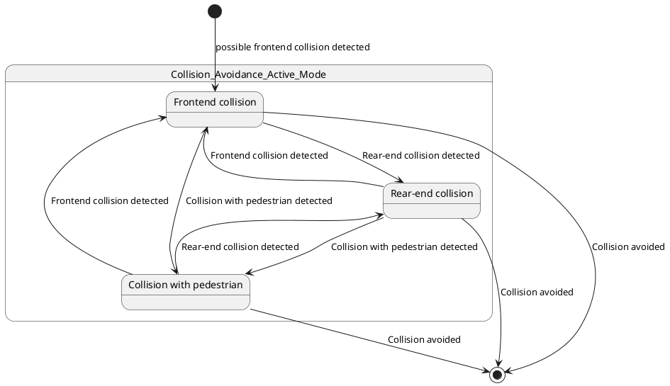

# Pair `0017`：NL + PlantUML STM0 + FCSTM STM0

[上一组 `0016`](../0016/README.md) | [返回 60 组索引](../../PAIR_INDEX.md) | [下一组 `0018`](../0018/README.md)

- LLM：`GPT-4`
- 模型/场景：Collision avoidance sub-machine state diagram
- NL SHA-256：`49854d044ad99f16a710021500f5e972da93b27635a41144d9b91d32444c0f63`
- PlantUML SHA-256：`f8a5658fe506ac755121a5dc3ca3e03564833a8abf51cdd1fb54dd41274b4d79`
- FCSTM SHA-256：`3ffda42026e3a95fb8b7caf1099aef898a4e3c87b5c62fda3abe14ec25b308e9`
- 结构裁决：`structure_preserved`
- FCSTM execution eligible：`false`
- Discover eligible：`false`
- 主 session 对读：CA/F/R/P alias 与 10 条 source edge 齐；三条 child final occurrence 未去重；CA 缺 initial fail-closed。
- 三个原始文件：[NL](./nl.txt) | [PlantUML](./plantuml.puml) | [FCSTM](./fcstm.fcstm)
- 审计入口：[canonical](../../canonical/llms_emp_stm_results_0017.json) | [冻结 FCSTM](../../fcstm/llms_emp_stm_results_0017.fcstm) | [case report](../../case_reports/llms_emp_stm_results_0017.json) | [人工总账](../../MANUAL_REVIEW.md)

## NL

```text
1. There are three region in this diagram
2. This sub-machine becomes active when a possible frontend collision, rear-end collision or collision with pedestrian is detected.
3. The orthogonal regions of the active mode of collision avoidance allow for concurrent activation different of collision avoidance controls.
```

## 原装 PlantUML STM0



## 转换后 FCSTM STM0

```fcstm
state llms_emp_stm_results_0017 named "llms_emp_stm_results_0017" {
    event possible_frontend_collision_detected named "possible frontend collision detected";
    event Collision_avoided named "Collision avoided";
    event Rear_end_collision_detected named "Rear-end collision detected";
    event Collision_with_pedestrian_detected named "Collision with pedestrian detected";
    event Frontend_collision_detected named "Frontend collision detected";
    state InitialWaittr_0001 named "Awaiting initial event: possible frontend collision detected";
    state CA named "Collision_Avoidance_Active_Mode" {
        state UnspecifiedInitial named "Unspecified initial";
        state F named "Frontend collision";
        state R named "Rear-end collision";
        state P named "Collision with pedestrian";
        [*] -> F : /possible_frontend_collision_detected;
        F -> [*] : /Collision_avoided;
        F -> R : /Rear_end_collision_detected;
        R -> [*] : /Collision_avoided;
        F -> P : /Collision_with_pedestrian_detected;
        P -> [*] : /Collision_avoided;
        R -> P : /Collision_with_pedestrian_detected;
        R -> F : /Frontend_collision_detected;
        P -> F : /Frontend_collision_detected;
        P -> R : /Rear_end_collision_detected;
        [*] -> UnspecifiedInitial;
    }
    [*] -> InitialWaittr_0001;
    InitialWaittr_0001 -> CA : /possible_frontend_collision_detected;
    !CA -> [*] : /Collision_avoided;
    !CA -> [*] : /Collision_avoided;
    !CA -> [*] : /Collision_avoided;
}
```

[上一组 `0016`](../0016/README.md) | [返回 60 组索引](../../PAIR_INDEX.md) | [下一组 `0018`](../0018/README.md)
