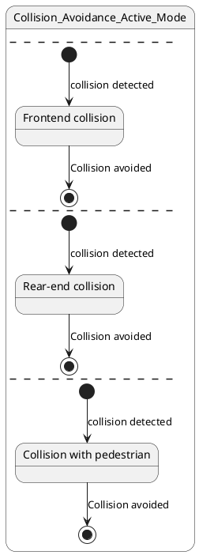

# Pair `0017`：NL + PlantUML STM0 + FCSTM STM0

[上一组 `0016`](../0016/README.md) | [返回 60 组索引](../../PAIR_INDEX.md) | [下一组 `0018`](../0018/README.md)

- LLM：`GPT-4`
- 模型/场景：Collision avoidance sub-machine state diagram
- 作者输出阶段：`Result with Semantic Checking`
- 作者输出单元格：`AE19`；Excel row：`19`
- Phase-I fallback：`false`
- 相对 Phase-I 是否变化：`true`
- Phase-I PlantUML SHA-256：`f8a5658fe506ac755121a5dc3ca3e03564833a8abf51cdd1fb54dd41274b4d79`
- NL SHA-256：`49854d044ad99f16a710021500f5e972da93b27635a41144d9b91d32444c0f63`
- PlantUML SHA-256：`45ffb4fb63359ba7da949bdcbcf8dbd9bcfb802ec7612c989ad06381f2544151`
- FCSTM SHA-256：`71e620ffbc2bced122a1e7ddabc28e30acdf655ed138bab86dfea3fa93d127b3`
- 结构裁决：`structure_preserved`
- source states / transitions：`4` / `6`
- mapped / blocked / silent drop：`6` / `0` / `0`
- final / lifecycle / body coverage：`3/3` / `0/0` / `0/0`
- concurrent region / separator coverage：`4/4` / `3/3`
- source normalization coverage：`0/0`
- official raw / validation：`state_diagram` / `state_diagram`
- official identity states / transitions：`4` / `6`
- official identity remaps：state `0` / transition endpoint `0`
- AST audit：`passed`
- FCSTM execution eligible：`false`
- Discover eligible：`false`
- 主 session 对读：完整对读：F/R/P 三个 alias、各自带事件 initial/final 共 6 边全部保留；三个 `--` 形成空 region 0 加三并发 region，根层缺 initial 与正交执行均保持显式债。
- 三个原始文件：[NL](./nl.txt) | [PlantUML](./plantuml.puml) | [FCSTM](./fcstm.fcstm)
- 审计入口：[canonical](../../canonical/llms_emp_feedback_final_0017.json) | [冻结 FCSTM](../../fcstm/llms_emp_feedback_final_0017.fcstm) | [case report](../../case_reports/llms_emp_feedback_final_0017.json) | [人工总账](../../MANUAL_REVIEW.md)

## 作者阶段 lineage

| stage | output cell | present | output SHA-256 | feedback | resolved |
|---|---|---|---|---|---|
| `phase_i_generation` | `I19` | `true` | `f8a5658fe506ac755121a5dc3ca3e03564833a8abf51cdd1fb54dd41274b4d79` | - | - |
| `phase_ii_format` | `U19` | `false` | `-` | - | - |
| `phase_ii_grammar` | `Z19` | `false` | `-` | - | - |
| `phase_ii_semantic` | `AE19` | `true` | `45ffb4fb63359ba7da949bdcbcf8dbd9bcfb802ec7612c989ad06381f2544151` | 1. use region instead of state in composite state | 1.0 |

## Official identity ledger

- status：`aligned`
- canonical / official states：`4` / `4`
- aligned transition endpoints：`6`

本组 state identity 无需重映射。

本组 transition endpoint 无需重映射。

## Source normalization ledger

本组没有 source-input normalization。

## Concurrent region ledger

| owner | region | direct states | direct transitions | separator before | separator after |
|---|---:|---|---|---|---|
| `Collision_Avoidance_Active_Mode` | 0 | - | - | - | llms_emp_feedback_final_0017.puml:line:3 |
| `Collision_Avoidance_Active_Mode` | 1 | Collision_Avoidance_Active_Mode.F | tr_0001, tr_0002 | llms_emp_feedback_final_0017.puml:line:3 | llms_emp_feedback_final_0017.puml:line:8 |
| `Collision_Avoidance_Active_Mode` | 2 | Collision_Avoidance_Active_Mode.R | tr_0003, tr_0004 | llms_emp_feedback_final_0017.puml:line:8 | llms_emp_feedback_final_0017.puml:line:13 |
| `Collision_Avoidance_Active_Mode` | 3 | Collision_Avoidance_Active_Mode.P | tr_0005, tr_0006 | llms_emp_feedback_final_0017.puml:line:13 | - |

## Operational debt

| reason code | count |
|---|---:|
| `R45.DEBT.concurrent_region_semantics` | 1 |
| `R45.DEBT.missing_explicit_initial` | 1 |
| `R45.DEBT.multiple_initial_fanout` | 1 |
| `R45.DEBT.opaque_transition_label_semantics` | 6 |

## NL

```text
1. There are three region in this diagram
2. This sub-machine becomes active when a possible frontend collision, rear-end collision or collision with pedestrian is detected.
3. The orthogonal regions of the active mode of collision avoidance allow for concurrent activation different of collision avoidance controls.
```

## 作者 Phase-II 最终 PlantUML STM0



## 转换后 FCSTM STM0

```fcstm
state llms_emp_feedback_final_0017 named "llms_emp_feedback_final_0017" {
    event collision_detected named "collision detected";
    event Collision_avoided named "Collision avoided";
    state UnspecifiedInitial named "Unspecified initial";
    state Collision_Avoidance_Active_Mode named "Collision_Avoidance_Active_Mode\n[PlantUML concurrent region 0] states=-; transitions=-\n[PlantUML concurrent region 1] states=Collision_Avoidance_Active_Mode.F; transitions=tr_0001, tr_0002\n[PlantUML concurrent region 2] states=Collision_Avoidance_Active_Mode.R; transitions=tr_0003, tr_0004\n[PlantUML concurrent region 3] states=Collision_Avoidance_Active_Mode.P; transitions=tr_0005, tr_0006\n[PlantUML concurrent separator] region 0 -> 1 at llms_emp_feedback_final_0017.puml:line:3\n[PlantUML concurrent separator] region 1 -> 2 at llms_emp_feedback_final_0017.puml:line:8\n[PlantUML concurrent separator] region 2 -> 3 at llms_emp_feedback_final_0017.puml:line:13" {
        state F named "Frontend collision";
        state R named "Rear-end collision";
        state P named "Collision with pedestrian";
        state InitialWaittr_0001 named "Awaiting initial event: collision detected";
        state FinalWaittr_0002 named "Completed final boundary: Collision_Avoidance_Active_Mode.F";
        state InitialWaittr_0003 named "Awaiting initial event: collision detected";
        state FinalWaittr_0004 named "Completed final boundary: Collision_Avoidance_Active_Mode.R";
        state InitialWaittr_0005 named "Awaiting initial event: collision detected";
        state FinalWaittr_0006 named "Completed final boundary: Collision_Avoidance_Active_Mode.P";
        [*] -> InitialWaittr_0001;
        InitialWaittr_0001 -> F : /collision_detected;
        F -> FinalWaittr_0002 : /Collision_avoided;
        [*] -> InitialWaittr_0003;
        InitialWaittr_0003 -> R : /collision_detected;
        R -> FinalWaittr_0004 : /Collision_avoided;
        [*] -> InitialWaittr_0005;
        InitialWaittr_0005 -> P : /collision_detected;
        P -> FinalWaittr_0006 : /Collision_avoided;
    }
    [*] -> UnspecifiedInitial;
}
```

[上一组 `0016`](../0016/README.md) | [返回 60 组索引](../../PAIR_INDEX.md) | [下一组 `0018`](../0018/README.md)
