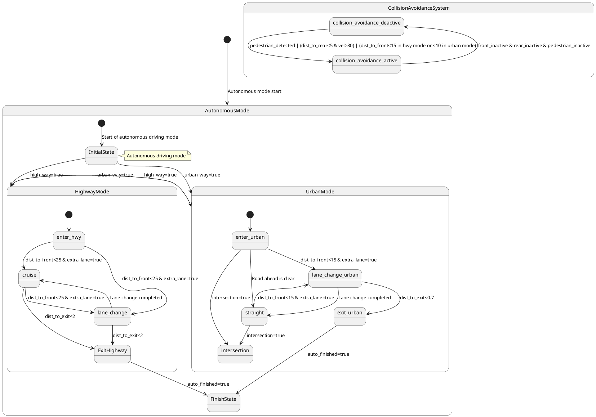

# Pair `0019`：NL + PlantUML STM0 + FCSTM STM0

[上一组 `0018`](../0018/README.md) | [返回 60 组索引](../../PAIR_INDEX.md) | [下一组 `0020`](../0020/README.md)

- LLM：`GPT-4`
- 模型/场景：autonomous mode
- NL SHA-256：`b7425c44960b36c3534f118279e347786d4074191efea7bf9a7c5ba032c9e82c`
- PlantUML SHA-256：`b4c24224cccc1a34efedeafd961ef2b4867aeb0701ce8f8a0ea78691a75c936d`
- FCSTM SHA-256：`5ed44b464818f00aa1438cbb68b78ccd54f541bee11b048e3394b6f799014fc1`
- 结构裁决：`structure_preserved`
- FCSTM execution eligible：`false`
- Discover eligible：`false`
- 主 session 对读：note 不混入行为；Autonomous hierarchy 与 25 条行为边齐；CollisionAvoidance 缺 initial fail-closed。
- 三个原始文件：[NL](./nl.txt) | [PlantUML](./plantuml.puml) | [FCSTM](./fcstm.fcstm)
- 审计入口：[canonical](../../canonical/llms_emp_stm_results_0019.json) | [冻结 FCSTM](../../fcstm/llms_emp_stm_results_0019.fcstm) | [case report](../../case_reports/llms_emp_stm_results_0019.json) | [人工总账](../../MANUAL_REVIEW.md)

## NL

```text
1. The system begins in the AutonomousMode state, which transitions into the InitialState substate, marking the starting point of the autonomous driving mode.
2. From the InitialState, the system can transition to either HighwayMode or UrbanMode based on conditions: `high_way=true` for HighwayMode or `urban_way=true` for UrbanMode.
3. In the HighwayMode state, the system begins in the enter_hwy substate, and can transition to cruise or lane_change based on the distance to the front vehicle (`dist_to_front<25`) and the availability of an extra lane (`extra_lane=true`).
4. If the system is in lane_change, it can return to cruise once the lane change is completed or exit the highway if the distance to the exit is less than 2 kilometers (`dist_to_exit<2`).
5. In the cruise substate, if the distance to the front vehicle becomes less than 25 meters (`dist_to_front<25`) and there is an extra lane available, the system transitions to lane_change. The system can also exit the highway if the distance to the exit is less than 2 kilometers (`dist_to_exit<2`).
6. The HighwayMode ends when the system transitions to FinishState, triggered by the `auto_finished=true` condition.
7. In UrbanMode, the system begins in the enter_urban substate. From here, it can transition to lane_change_urban if the distance to the front vehicle is less than 15 meters (`dist_to_front<15`) and an extra lane is available, or straight if the road ahead is clear, or intersection if it detects an intersection (`intersection=true`).
8. In the lane_change_urban substate, the system transitions to straight if the lane change is complete or to exit_urban if the distance to the urban exit is less than 0.7 kilometers (`dist_to_exit<0.7`).
9. In the straight substate, if the system detects an intersection, it transitions to the intersection substate. If the distance to the front vehicle becomes less than 15 meters (`dist_to_front<15`) and an extra lane is available, it transitions to lane_change_urban.
10. The system exits the UrbanMode state by transitioning to FinishState once `auto_finished=true` is satisfied.
11. The system supports dynamic transitions between HighwayMode and UrbanMode based on the conditions `urban_way=true` and `high_way=true`, respectively, facilitating seamless mode shifts during the drive.
12. The collision avoidance system is initially in the collision_avoidance_deactive state. It transitions to collision_avoidance_active when certain conditions are met, such as detecting pedestrians (`pedestrian_detected`), the rear distance being less than 5 meters with a velocity over 30 km/h (`dist_to_rear<5 & vel>30`), or the front distance being less than 15 meters in highway mode or 10 meters in urban mode.
13. Once in the collision_avoidance_active state, the collision avoidance system returns to the collision_avoidance_deactive state when there is no active danger, as indicated by the conditions `front_inactive`, `rear_inactive`, and `pedestrian_inactive`.
```

## 原装 PlantUML STM0



## 转换后 FCSTM STM0

```fcstm
state llms_emp_stm_results_0019 named "llms_emp_stm_results_0019" {
    event Autonomous_mode_start named "Autonomous mode start";
    event Start_of_autonomous_driving_mode named "Start of autonomous driving mode";
    event high_way_true named "high_way=true";
    event urban_way_true named "urban_way=true";
    event dist_to_front_25_extra_lane_true named "dist_to_front<25 & extra_lane=true";
    event dist_to_exit_2 named "dist_to_exit<2";
    event Lane_change_completed named "Lane change completed";
    event auto_finished_true named "auto_finished=true";
    event dist_to_front_15_extra_lane_true named "dist_to_front<15 & extra_lane=true";
    event Road_ahead_is_clear named "Road ahead is clear";
    event intersection_true named "intersection=true";
    event dist_to_exit_0_7 named "dist_to_exit<0.7";
    event pedestrian_detected_dist_to_rear_5_vel_30_dist_to_front_15_in_hwy_mode_or_10_in_urban_mode named "pedestrian_detected | (dist_to_rear<5 & vel>30) | (dist_to_front<15 in hwy mode or <10 in urban mode)";
    event front_inactive_rear_inactive_pedestrian_inactive named "front_inactive & rear_inactive & pedestrian_inactive";
    state InitialWaittr_0001 named "Awaiting initial event: Autonomous mode start";
    state AutonomousMode named "AutonomousMode" {
        state HighwayMode named "HighwayMode" {
            state enter_hwy named "enter_hwy";
            state cruise named "cruise";
            state lane_change named "lane_change";
            state ExitHighway named "ExitHighway";
            [*] -> enter_hwy;
            enter_hwy -> cruise : /dist_to_front_25_extra_lane_true;
            enter_hwy -> lane_change : /dist_to_front_25_extra_lane_true;
            cruise -> lane_change : /dist_to_front_25_extra_lane_true;
            cruise -> ExitHighway : /dist_to_exit_2;
            lane_change -> cruise : /Lane_change_completed;
            lane_change -> ExitHighway : /dist_to_exit_2;
            ExitHighway -> [*] : /auto_finished_true;
        }
        state UrbanMode named "UrbanMode" {
            state enter_urban named "enter_urban";
            state lane_change_urban named "lane_change_urban";
            state straight named "straight";
            state intersection named "intersection";
            state exit_urban named "exit_urban";
            [*] -> enter_urban;
            enter_urban -> lane_change_urban : /dist_to_front_15_extra_lane_true;
            enter_urban -> straight : /Road_ahead_is_clear;
            enter_urban -> intersection : /intersection_true;
            lane_change_urban -> straight : /Lane_change_completed;
            lane_change_urban -> exit_urban : /dist_to_exit_0_7;
            straight -> intersection : /intersection_true;
            straight -> lane_change_urban : /dist_to_front_15_extra_lane_true;
            exit_urban -> [*] : /auto_finished_true;
        }
        state InitialState named "InitialState";
        state FinishState named "FinishState";
        state InitialWaittr_0002 named "Awaiting initial event: Start of autonomous driving mode";
        [*] -> InitialWaittr_0002;
        InitialWaittr_0002 -> InitialState : /Start_of_autonomous_driving_mode;
        InitialState -> HighwayMode : /high_way_true;
        InitialState -> UrbanMode : /urban_way_true;
        HighwayMode -> FinishState : /auto_finished_true;
        UrbanMode -> FinishState : /auto_finished_true;
        !HighwayMode -> UrbanMode : /urban_way_true;
        !UrbanMode -> HighwayMode : /high_way_true;
    }
    state CollisionAvoidanceSystem named "CollisionAvoidanceSystem" {
        state UnspecifiedInitial named "Unspecified initial";
        state collision_avoidance_deactive named "collision_avoidance_deactive";
        state collision_avoidance_active named "collision_avoidance_active";
        collision_avoidance_deactive -> collision_avoidance_active : /pedestrian_detected_dist_to_rear_5_vel_30_dist_to_front_15_in_hwy_mode_or_10_in_urban_mode;
        collision_avoidance_active -> collision_avoidance_deactive : /front_inactive_rear_inactive_pedestrian_inactive;
        [*] -> UnspecifiedInitial;
    }
    [*] -> InitialWaittr_0001;
    InitialWaittr_0001 -> AutonomousMode : /Autonomous_mode_start;
}
```

[上一组 `0018`](../0018/README.md) | [返回 60 组索引](../../PAIR_INDEX.md) | [下一组 `0020`](../0020/README.md)
