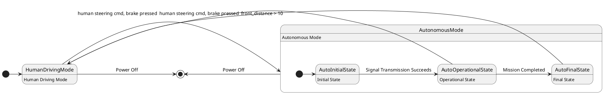

# Pair `0020`：NL + PlantUML STM0 + FCSTM STM0

[上一组 `0019`](../0019/README.md) | [返回 60 组索引](../../PAIR_INDEX.md) | [下一组 `0021`](../0021/README.md)

- LLM：`Llama`
- 模型/场景：high-level driving module
- 作者输出阶段：`Result with Semantic Checking`
- 作者输出单元格：`AE22`；Excel row：`22`
- Phase-I fallback：`false`
- 相对 Phase-I 是否变化：`true`
- Phase-I PlantUML SHA-256：`478b8db78f5465f4ced13d2ed7f455bc12bbb5c77b5d1d0b475cdc97d905b8c6`
- NL SHA-256：`f1c3dc88371b8256352e7ab6ee7eb42424de6e11dfde70d185f224dd1d05a7a8`
- PlantUML SHA-256：`155e5f625d96c14b5e5fc83bd3f7468d057d72b6551193b18610bbe89957196f`
- FCSTM SHA-256：`b33e8569c080212199f2c50787e0383ad0ffb7517516d244de8a170a0a8a1122`
- review subject SHA-256：`a9ae7d5c857e382e949180d49b420ae83ca9cda95d78aab7394c6008554acd2b`
- working contract SHA-256：`fc88b100ae5e22121779c26cbee554c4d097aae1e3e2c2118caef8b5367bfd23`
- 结构裁决：`structure_preserved`
- source states / transitions：`5` / `9`
- mapped / blocked / silent drop：`9` / `0` / `0`
- final / lifecycle / body coverage：`2/2` / `0/0` / `5/5`
- concurrent region / separator coverage：`0/0` / `0/0`
- source normalization coverage：`0/0`
- official raw / validation：`state_diagram` / `state_diagram`
- official identity states / transitions：`5` / `9`
- official identity remaps：state `0` / transition endpoint `0`
- AST audit：`passed`
- legacy whole-model FCSTM execution / Discover：`false` / `false`
- working bundle usage gate：`discover_input_with_capability_mask`
- ownership source / compiler / agent：`19` / `17` / `0`
- source macro / positive identity trace / conversion boundary trace：`14` / `19` / `0`
- capability source-static / simulation / transition-trace：`eligible_with_exclusions` / `ineligible` / `ineligible`
- compiler-only diagnostic policy：`rejected_conversion_artifact`；main-result conversion artifact limit：`0`
- 主 session 对读：`pass`；ownership/macro/capability 均为 `pass`；Case 0020 passes conversion-attribution review. This does not assert NL/PlantUML correctness or runtime equivalence; authored defects remain eligible for later source-grounded Discover. No conversion-specific blocker was found in the exact reviewed occurrences.
- source anchors：`source-ref:llms_emp_feedback_final_0020.puml:line:6\|state AutonomousMode {, source-ref:llms_emp_feedback_final_0020.puml:line:4\|HumanDrivingMode -> AutonomousMode: front_distance > 10`；FCSTM anchors：`element-ref:source:state:AutonomousMode@line:7\|state AutonomousMode named "AutonomousMode\n[PlantUML body] Autonomous Mode" {, element-ref:compiler:transition_segment:tr_0002:segment:1@line:19\|HumanDrivingMode -> AutonomousMode : /front_distance_10;`
- 三个原始文件：[NL](./nl.txt) | [PlantUML](./plantuml.puml) | [FCSTM](./fcstm.fcstm)
- 审计入口：[canonical](../../canonical/llms_emp_feedback_final_0020.json) | [冻结 FCSTM](../../fcstm/llms_emp_feedback_final_0020.fcstm) | [case report](../../case_reports/llms_emp_feedback_final_0020.json) | [working contract](../../working_contracts/llms_emp_feedback_final_0020.json) | [source trace](../../source_traces/llms_emp_feedback_final_0020.json) | [人工总账](../../MANUAL_REVIEW.md)

## 主 session 三方语义对应

| projection | assessment | NL anchor | PlantUML anchor | FCSTM anchor | source roots | compiler members | rationale |
|---|---|---|---|---|---|---|---|
| `direct` | `preserved` | 1 The human driving mode is represented by a simple state. | source-ref:llms_emp_feedback_final_0020.puml:line:6\|state AutonomousMode { | element-ref:source:state:AutonomousMode@line:7\|state AutonomousMode named "AutonomousMode\n[PlantUML body] Autonomous Mode" { | source:state:AutonomousMode | - | Case 0020 binds source:state:AutonomousMode to the exact authored occurrence 'state AutonomousMode {'; it is present as a direct FCSTM state projection with the same source identity and parent relation. |
| `macro` | `preserved_with_exclusions` | front_distance > 10 | source-ref:llms_emp_feedback_final_0020.puml:line:4\|HumanDrivingMode -> AutonomousMode: front_distance > 10 | element-ref:compiler:transition_segment:tr_0002:segment:1@line:19\|HumanDrivingMode -> AutonomousMode : /front_distance_10; | source:transition:tr_0002 | compiler:transition_segment:tr_0002:segment:1 | Case 0020 binds source:transition:tr_0002 to the exact authored occurrence 'HumanDrivingMode -> AutonomousMode: front_distance > 10'; it is present as a source-owned transition root whose cited FCSTM line belongs to a protected compiler macro; the raw label remains opaque. |

## Risk occurrence 第二遍复核

| obligation | risk tag | assessment | PlantUML evidence | FCSTM evidence | ownership evidence | rationale |
|---|---|---|---|---|---|---|
| `review:multi_segment_macro:0001:tr_0006` | `multi_segment_macro` | `compiler_artifact_excluded` | source-ref:llms_emp_feedback_final_0020.puml:line:13\|AutoOperationalState -> HumanDrivingMode: human steering cmd, brake pressed | element-ref:compiler:transition_segment:tr_0006:segment:1@line:14\|AutoOperationalState -> [*] : /human_steering_cmd_brake_pressed;, element-ref:compiler:transition_segment:tr_0006:segment:2@line:20\|AutonomousMode -> HumanDrivingMode : /human_steering_cmd_brake_pressed; | compiler:transition_segment:tr_0006:segment:1, compiler:transition_segment:tr_0006:segment:2, source:transition:tr_0006 | Case 0020 risk multi_segment_macro occurrence review:multi_segment_macro:0001:tr_0006: The single authored transition remains one source-owned semantic root; all bound FCSTM segments are protected compiler artifacts and cannot become repair targets. |
| `review:multi_segment_macro:0002:tr_0007` | `multi_segment_macro` | `compiler_artifact_excluded` | source-ref:llms_emp_feedback_final_0020.puml:line:14\|AutoFinalState -> HumanDrivingMode: human steering cmd, brake pressed | element-ref:compiler:transition_segment:tr_0007:segment:1@line:15\|AutoFinalState -> [*] : /human_steering_cmd_brake_pressed;, element-ref:compiler:transition_segment:tr_0007:segment:2@line:21\|AutonomousMode -> HumanDrivingMode : /human_steering_cmd_brake_pressed; | compiler:transition_segment:tr_0007:segment:1, compiler:transition_segment:tr_0007:segment:2, source:transition:tr_0007 | Case 0020 risk multi_segment_macro occurrence review:multi_segment_macro:0002:tr_0007: The single authored transition remains one source-owned semantic root; all bound FCSTM segments are protected compiler artifacts and cannot become repair targets. |
| `review:final_boundary:0003:tr_0008` | `final_boundary` | `source_fact_preserved` | source-ref:llms_emp_feedback_final_0020.puml:line:16\|HumanDrivingMode -> [*]: Power Off | element-ref:compiler:transition_segment:tr_0008:segment:1@line:22\|HumanDrivingMode -> [*] : /Power_Off; | compiler:transition_segment:tr_0008:segment:1, source:transition:tr_0008 | Case 0020 risk final_boundary occurrence review:final_boundary:0003:tr_0008: The authored PlantUML final boundary is preserved by the bound FCSTM termination macro rather than being converted into an ordinary user state. |
| `review:final_boundary:0004:tr_0009` | `final_boundary` | `source_fact_preserved` | source-ref:llms_emp_feedback_final_0020.puml:line:17\|AutonomousMode -> [*]: Power Off | element-ref:compiler:transition_segment:tr_0009:segment:1@line:23\|!AutonomousMode -> [*] : /Power_Off; | compiler:transition_segment:tr_0009:segment:1, source:transition:tr_0009 | Case 0020 risk final_boundary occurrence review:final_boundary:0004:tr_0009: The authored PlantUML final boundary is preserved by the bound FCSTM termination macro rather than being converted into an ordinary user state. |

## 作者阶段 lineage

| stage | output cell | present | output SHA-256 | feedback | resolved |
|---|---|---|---|---|---|
| `phase_i_generation` | `I22` | `true` | `478b8db78f5465f4ced13d2ed7f455bc12bbb5c77b5d1d0b475cdc97d905b8c6` | - | - |
| `phase_ii_format` | `U22` | `true` | `155e5f625d96c14b5e5fc83bd3f7468d057d72b6551193b18610bbe89957196f` | syntax error: stm DrivingMode<br> | YES |
| `phase_ii_grammar` | `Z22` | `false` | `-` | - | - |
| `phase_ii_semantic` | `AE22` | `true` | `155e5f625d96c14b5e5fc83bd3f7468d057d72b6551193b18610bbe89957196f` | None | - |

## Official identity ledger

- status：`aligned`
- canonical / official states：`5` / `5`
- aligned transition endpoints：`9`

本组 state identity 无需重映射。

本组 transition endpoint 无需重映射。

## Source normalization ledger

本组没有 source-input normalization。

## Concurrent region ledger

本组没有 PlantUML orthogonal/concurrent region separator。

## Operational debt

| reason code | count |
|---|---:|
| `R45.DEBT.opaque_state_body_semantics` | 5 |
| `R45.DEBT.opaque_transition_label_semantics` | 7 |

## NL

```text
1 The human driving mode is represented by a simple state. 2 The autonomous mode has sub-states and is represented by a sub machine state. 3. when power on, the system turn into human driving mode 4when front_distance > 10, auto transport to autonomous state 4. transit to human driving mode when receive human steering cmd, brake pressed, in (auto final) 5 when power off, it will transit to final state
```

## 作者 Phase-II 最终 PlantUML STM0



## 转换后 FCSTM STM0

```fcstm
state llms_emp_feedback_final_0020 named "llms_emp_feedback_final_0020" {
    event front_distance_10 named "front_distance > 10";
    event Signal_Transmission_Succeeds named "Signal Transmission Succeeds";
    event Mission_Completed named "Mission Completed";
    event human_steering_cmd_brake_pressed named "human steering cmd, brake pressed";
    event Power_Off named "Power Off";
    state AutonomousMode named "AutonomousMode\n[PlantUML body] Autonomous Mode" {
        state AutoInitialState named "AutoInitialState\n[PlantUML body] Initial State";
        state AutoOperationalState named "AutoOperationalState\n[PlantUML body] Operational State";
        state AutoFinalState named "AutoFinalState\n[PlantUML body] Final State";
        [*] -> AutoInitialState;
        AutoInitialState -> AutoOperationalState : /Signal_Transmission_Succeeds;
        AutoOperationalState -> AutoFinalState : /Mission_Completed;
        AutoOperationalState -> [*] : /human_steering_cmd_brake_pressed;
        AutoFinalState -> [*] : /human_steering_cmd_brake_pressed;
    }
    state HumanDrivingMode named "HumanDrivingMode\n[PlantUML body] Human Driving Mode";
    [*] -> HumanDrivingMode;
    HumanDrivingMode -> AutonomousMode : /front_distance_10;
    AutonomousMode -> HumanDrivingMode : /human_steering_cmd_brake_pressed;
    AutonomousMode -> HumanDrivingMode : /human_steering_cmd_brake_pressed;
    HumanDrivingMode -> [*] : /Power_Off;
    !AutonomousMode -> [*] : /Power_Off;
}
```

[上一组 `0019`](../0019/README.md) | [返回 60 组索引](../../PAIR_INDEX.md) | [下一组 `0021`](../0021/README.md)
