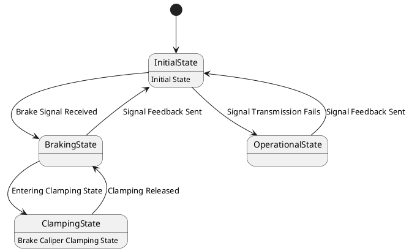

# Pair `0021`：NL + PlantUML STM0 + FCSTM STM0

[上一组 `0020`](../0020/README.md) | [返回 60 组索引](../../PAIR_INDEX.md) | [下一组 `0022`](../0022/README.md)

- LLM：`Llama`
- 模型/场景：State machine diagram of the base brake subsystem
- 作者输出阶段：`Result with Semantic Checking`
- 作者输出单元格：`AE23`；Excel row：`23`
- Phase-I fallback：`false`
- 相对 Phase-I 是否变化：`true`
- Phase-I PlantUML SHA-256：`56fdae7230f32f95dfea0227a445220448a6718f34d6de8999192a2f763783fa`
- NL SHA-256：`abb20a2187c100d7c75a3038df101c91b369df70a07dfafd6eafc72da859fc99`
- PlantUML SHA-256：`92e74f3ea7f9a71f4e8e7bcb9ddcd39d96afdccbfc1d2e2d3edacbed6eeda802`
- FCSTM SHA-256：`e88b7acd55d456350741d519399ebaaa55e3ed4ccccd3c0d6189428dd4c0e58b`
- review subject SHA-256：`5f2138c5064fce6cc4cbae8a6b2ff843f6cf4e51d24e9bf2400c9437fd402d20`
- working contract SHA-256：`3ac8d818baebae6ea19998d59f1482e58588ae8618f3abeff145dba96421d2b7`
- 结构裁决：`structure_preserved`
- source states / transitions：`4` / `7`
- mapped / blocked / silent drop：`7` / `0` / `0`
- final / lifecycle / body coverage：`0/0` / `0/0` / `2/2`
- concurrent region / separator coverage：`0/0` / `0/0`
- source normalization coverage：`0/0`
- official raw / validation：`state_diagram` / `state_diagram`
- official identity states / transitions：`4` / `7`
- official identity remaps：state `0` / transition endpoint `0`
- AST audit：`passed`
- legacy whole-model FCSTM execution / Discover：`false` / `false`
- working bundle usage gate：`discover_input_with_capability_mask`
- ownership source / compiler / agent：`13` / `13` / `0`
- source macro / positive identity trace / conversion boundary trace：`9` / `13` / `0`
- capability source-static / simulation / transition-trace：`eligible_with_exclusions` / `ineligible` / `ineligible`
- compiler-only diagnostic policy：`rejected_conversion_artifact`；main-result conversion artifact limit：`0`
- 主 session 对读：`pass`；ownership/macro/capability 均为 `pass`；Case 0021 passes conversion-attribution review. This does not assert NL/PlantUML correctness or runtime equivalence; authored defects remain eligible for later source-grounded Discover. No conversion-specific blocker was found in the exact reviewed occurrences.
- source anchors：`source-ref:llms_emp_feedback_final_0021.puml:line:2\|[*] --> InitialState, source-ref:llms_emp_feedback_final_0021.puml:line:6\|InitialState --> OperationalState : Signal Transmission Fails`；FCSTM anchors：`element-ref:source:state:InitialState@line:7\|state InitialState named "InitialState\n[PlantUML body] Initial State";, element-ref:compiler:transition_segment:tr_0003:segment:1@line:13\|InitialState -> OperationalState : /Signal_Transmission_Fails;`
- 三个原始文件：[NL](./nl.txt) | [PlantUML](./plantuml.puml) | [FCSTM](./fcstm.fcstm)
- 审计入口：[canonical](../../canonical/llms_emp_feedback_final_0021.json) | [冻结 FCSTM](../../fcstm/llms_emp_feedback_final_0021.fcstm) | [case report](../../case_reports/llms_emp_feedback_final_0021.json) | [working contract](../../working_contracts/llms_emp_feedback_final_0021.json) | [source trace](../../source_traces/llms_emp_feedback_final_0021.json) | [人工总账](../../MANUAL_REVIEW.md)

## 主 session 三方语义对应

| projection | assessment | NL anchor | PlantUML anchor | FCSTM anchor | source roots | compiler members | rationale |
|---|---|---|---|---|---|---|---|
| `direct` | `preserved` | 1 This state machine model represents the train's basic braking device, which serves as the final execution unit for | source-ref:llms_emp_feedback_final_0021.puml:line:2\|[*] --> InitialState | element-ref:source:state:InitialState@line:7\|state InitialState named "InitialState\n[PlantUML body] Initial State"; | source:state:InitialState | - | Case 0021 binds source:state:InitialState to the exact authored occurrence '[*] --> InitialState'; it is present as a direct FCSTM state projection with the same source identity and parent relation. |
| `macro` | `preserved_with_exclusions` | signal transmission fails | source-ref:llms_emp_feedback_final_0021.puml:line:6\|InitialState --> OperationalState : Signal Transmission Fails | element-ref:compiler:transition_segment:tr_0003:segment:1@line:13\|InitialState -> OperationalState : /Signal_Transmission_Fails; | source:transition:tr_0003 | compiler:transition_segment:tr_0003:segment:1 | Case 0021 binds source:transition:tr_0003 to the exact authored occurrence 'InitialState --> OperationalState : Signal Transmission Fails'; it is present as a source-owned transition root whose cited FCSTM line belongs to a protected compiler macro; the raw label remains opaque. |

## Risk occurrence 第二遍复核

本组不要求 risk-tag 第二遍复核。

## 作者阶段 lineage

| stage | output cell | present | output SHA-256 | feedback | resolved |
|---|---|---|---|---|---|
| `phase_i_generation` | `I23` | `true` | `56fdae7230f32f95dfea0227a445220448a6718f34d6de8999192a2f763783fa` | - | - |
| `phase_ii_format` | `U23` | `true` | `a7e34985cb157f1e8adb75ef62a344763e7b318c754924ae54fc13c8e117ee84` | syntax error: stm Train Braking System | YES |
| `phase_ii_grammar` | `Z23` | `false` | `-` | - | - |
| `phase_ii_semantic` | `AE23` | `true` | `92e74f3ea7f9a71f4e8e7bcb9ddcd39d96afdccbfc1d2e2d3edacbed6eeda802` | 1. missing state and transition | - |

## Official identity ledger

- status：`aligned`
- canonical / official states：`4` / `4`
- aligned transition endpoints：`7`

本组 state identity 无需重映射。

本组 transition endpoint 无需重映射。

## Source normalization ledger

本组没有 source-input normalization。

## Concurrent region ledger

本组没有 PlantUML orthogonal/concurrent region separator。

## Operational debt

| reason code | count |
|---|---:|
| `R45.DEBT.opaque_state_body_semantics` | 2 |
| `R45.DEBT.opaque_transition_label_semantics` | 6 |

## NL

```text
1 This state machine model represents the train's basic braking device, which serves as the final execution unit for train braking operations.
2 When the basic braking device receives a brake signal, it transitions from the initial state to the braking state. If the signal transmission fails, it proceeds to the operational state. Once the signal feedback is sent, it returns to the initial state.
3 After entering the braking state, the system transitions to the brake caliper clamping state.
```

## 作者 Phase-II 最终 PlantUML STM0



## 转换后 FCSTM STM0

```fcstm
state llms_emp_feedback_final_0021 named "llms_emp_feedback_final_0021" {
    event Brake_Signal_Received named "Brake Signal Received";
    event Signal_Transmission_Fails named "Signal Transmission Fails";
    event Entering_Clamping_State named "Entering Clamping State";
    event Signal_Feedback_Sent named "Signal Feedback Sent";
    event Clamping_Released named "Clamping Released";
    state InitialState named "InitialState\n[PlantUML body] Initial State";
    state BrakingState named "BrakingState";
    state OperationalState named "OperationalState";
    state ClampingState named "ClampingState\n[PlantUML body] Brake Caliper Clamping State";
    [*] -> InitialState;
    InitialState -> BrakingState : /Brake_Signal_Received;
    InitialState -> OperationalState : /Signal_Transmission_Fails;
    BrakingState -> ClampingState : /Entering_Clamping_State;
    OperationalState -> InitialState : /Signal_Feedback_Sent;
    BrakingState -> InitialState : /Signal_Feedback_Sent;
    ClampingState -> BrakingState : /Clamping_Released;
}
```

[上一组 `0020`](../0020/README.md) | [返回 60 组索引](../../PAIR_INDEX.md) | [下一组 `0022`](../0022/README.md)
