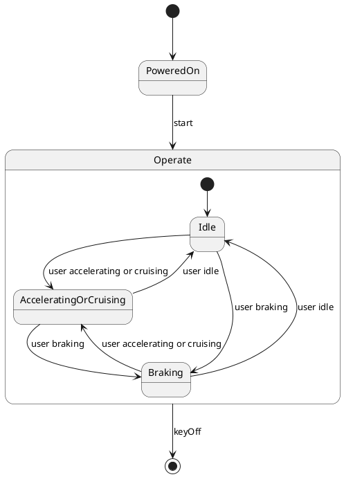

# Pair `0022`：NL + PlantUML STM0 + FCSTM STM0

[上一组 `0021`](../0021/README.md) | [返回 60 组索引](../../PAIR_INDEX.md) | [下一组 `0023`](../0023/README.md)

- LLM：`Llama`
- 模型/场景：Hybrid Sport Utility Vehicle, HSUV
- 作者输出阶段：`Result with Semantic Checking`
- 作者输出单元格：`AE24`；Excel row：`24`
- Phase-I fallback：`false`
- 相对 Phase-I 是否变化：`true`
- Phase-I PlantUML SHA-256：`8ea7e01c4cf73f562b0c55fed76f8f318797aa06f9ee043170e79385f326f7c5`
- NL SHA-256：`9fe426ba761d5a52c3b670f35410502a5289bdd9489c4a9bfa983e34d565040c`
- PlantUML SHA-256：`245204b8393136d7b1e0394710457dd5505e7f00d03d3bceb467b7e6c7c343b0`
- FCSTM SHA-256：`a93e9c0821fb0c0630905aa71c685297ec60bc50245a7c0c9cffd195d77e761d`
- 结构裁决：`structure_preserved`
- source states / transitions：`5` / `10`
- mapped / blocked / silent drop：`10` / `0` / `0`
- final / lifecycle / body coverage：`1/1` / `0/0` / `0/0`
- concurrent region / separator coverage：`0/0` / `0/0`
- source normalization coverage：`0/0`
- official raw / validation：`state_diagram` / `state_diagram`
- official identity states / transitions：`5` / `10`
- official identity remaps：state `0` / transition endpoint `0`
- AST audit：`passed`
- FCSTM execution eligible：`false`
- Discover eligible：`false`
- 主 session 对读：完整对读：PoweredOn 到 Operate、Operate 内三态全互转及 keyOff root final 共 10 条边逐一保留，跨 composite 终止使用 forced final，不产生假 Terminate 节点。
- 三个原始文件：[NL](./nl.txt) | [PlantUML](./plantuml.puml) | [FCSTM](./fcstm.fcstm)
- 审计入口：[canonical](../../canonical/llms_emp_feedback_final_0022.json) | [冻结 FCSTM](../../fcstm/llms_emp_feedback_final_0022.fcstm) | [case report](../../case_reports/llms_emp_feedback_final_0022.json) | [人工总账](../../MANUAL_REVIEW.md)

## 作者阶段 lineage

| stage | output cell | present | output SHA-256 | feedback | resolved |
|---|---|---|---|---|---|
| `phase_i_generation` | `I24` | `true` | `8ea7e01c4cf73f562b0c55fed76f8f318797aa06f9ee043170e79385f326f7c5` | - | - |
| `phase_ii_format` | `U24` | `true` | `e49387473ec71fe91e9d06a3ef180ded992b251ff805422a997d216a973a3800` | syntax error: stm DeviceController | YES |
| `phase_ii_grammar` | `Z24` | `false` | `-` | - | - |
| `phase_ii_semantic` | `AE24` | `true` | `245204b8393136d7b1e0394710457dd5505e7f00d03d3bceb467b7e6c7c343b0` | missing composite state | 1.0 |

## Official identity ledger

- status：`aligned`
- canonical / official states：`5` / `5`
- aligned transition endpoints：`10`

本组 state identity 无需重映射。

本组 transition endpoint 无需重映射。

## Source normalization ledger

本组没有 source-input normalization。

## Concurrent region ledger

本组没有 PlantUML orthogonal/concurrent region separator。

## Operational debt

| reason code | count |
|---|---:|
| `R45.DEBT.opaque_transition_label_semantics` | 8 |

## NL

```text
1. Once the device is powered on, the system enters the `Operate` state, and based on user actions, it transitions between `Idle`, `Accelerating or Cruising`, and `Braking` states.
2. The system can be turned on with the `start` signal and turned off with the `keyOff` signal.
3. Within the `Operate` state, the system transitions between different substates depending on actions like accelerating, braking, or stopping.
```

## 作者 Phase-II 最终 PlantUML STM0



## 转换后 FCSTM STM0

```fcstm
state llms_emp_feedback_final_0022 named "llms_emp_feedback_final_0022" {
    event start named "start";
    event user_accelerating_or_cruising named "user accelerating or cruising";
    event user_braking named "user braking";
    event user_idle named "user idle";
    event keyOff named "keyOff";
    state Operate named "Operate" {
        state Idle named "Idle";
        state AcceleratingOrCruising named "AcceleratingOrCruising";
        state Braking named "Braking";
        [*] -> Idle;
        Idle -> AcceleratingOrCruising : /user_accelerating_or_cruising;
        Idle -> Braking : /user_braking;
        AcceleratingOrCruising -> Idle : /user_idle;
        AcceleratingOrCruising -> Braking : /user_braking;
        Braking -> Idle : /user_idle;
        Braking -> AcceleratingOrCruising : /user_accelerating_or_cruising;
    }
    state PoweredOn named "PoweredOn";
    [*] -> PoweredOn;
    PoweredOn -> Operate : /start;
    !Operate -> [*] : /keyOff;
}
```

[上一组 `0021`](../0021/README.md) | [返回 60 组索引](../../PAIR_INDEX.md) | [下一组 `0023`](../0023/README.md)
