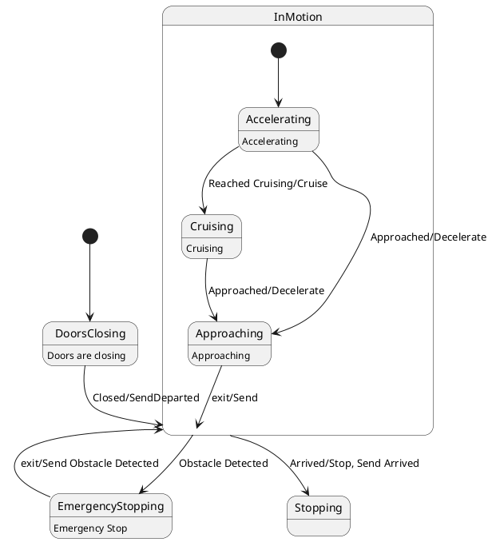

# Pair `0024`：NL + PlantUML STM0 + FCSTM STM0

[上一组 `0023`](../0023/README.md) | [返回 60 组索引](../../PAIR_INDEX.md) | [下一组 `0025`](../0025/README.md)

- LLM：`Llama`
- 模型/场景：state machine for Train Control
- 作者输出阶段：`Result with Semantic Checking`
- 作者输出单元格：`AE26`；Excel row：`26`
- Phase-I fallback：`false`
- 相对 Phase-I 是否变化：`true`
- Phase-I PlantUML SHA-256：`0a9b42eaa34ae47557ece09f79e387a69a29da2e13d4f833a4edaaf9a42d2598`
- NL SHA-256：`3110cbcf15bfb507f0326965970888eada5541b791b5fa661698dfc74e82c2ce`
- PlantUML SHA-256：`5900a03e9a58e6079bacd2857c82133e549809bb532a33c62ecbbe3077cb5745`
- FCSTM SHA-256：`2ac55a187d25d8d141b62d0a8bd639a248aeb7d5b681313417d9c074dbb4ab17`
- 结构裁决：`structure_preserved`
- source states / transitions：`7` / `10`
- mapped / blocked / silent drop：`10` / `0` / `0`
- final / lifecycle / body coverage：`0/0` / `0/0` / `5/5`
- concurrent region / separator coverage：`0/0` / `0/0`
- source normalization coverage：`0/0`
- official raw / validation：`state_diagram` / `state_diagram`
- official identity states / transitions：`7` / `10`
- official identity remaps：state `0` / transition endpoint `0`
- AST audit：`passed`
- FCSTM execution eligible：`false`
- Discover eligible：`false`
- 主 session 对读：完整对读：DoorsClosing、InMotion 三子态、Stopping/EmergencyStopping 的 10 条边和五个 body 均在；Approaching 到 owner InMotion 被编码为子层退出加父层自迁移，事件原文未丢。
- 三个原始文件：[NL](./nl.txt) | [PlantUML](./plantuml.puml) | [FCSTM](./fcstm.fcstm)
- 审计入口：[canonical](../../canonical/llms_emp_feedback_final_0024.json) | [冻结 FCSTM](../../fcstm/llms_emp_feedback_final_0024.fcstm) | [case report](../../case_reports/llms_emp_feedback_final_0024.json) | [人工总账](../../MANUAL_REVIEW.md)

## 作者阶段 lineage

| stage | output cell | present | output SHA-256 | feedback | resolved |
|---|---|---|---|---|---|
| `phase_i_generation` | `I26` | `true` | `0a9b42eaa34ae47557ece09f79e387a69a29da2e13d4f833a4edaaf9a42d2598` | - | - |
| `phase_ii_format` | `U26` | `true` | `c23a45feac8a5c988a860287f8c6a9282a9c6c01116aecff1b2ca8caba300b4e` | syntax error: stm TrainSystem | YES |
| `phase_ii_grammar` | `Z26` | `false` | `-` | - | - |
| `phase_ii_semantic` | `AE26` | `true` | `5900a03e9a58e6079bacd2857c82133e549809bb532a33c62ecbbe3077cb5745` | None | - |

## Official identity ledger

- status：`aligned`
- canonical / official states：`7` / `7`
- aligned transition endpoints：`10`

本组 state identity 无需重映射。

本组 transition endpoint 无需重映射。

## Source normalization ledger

本组没有 source-input normalization。

## Concurrent region ledger

本组没有 PlantUML orthogonal/concurrent region separator。

## Operational debt

| reason code | count |
|---|---:|
| `R45.DEBT.opaque_state_body_semantics` | 5 |
| `R45.DEBT.opaque_transition_label_semantics` | 8 |

## NL

```text
1. The system starts in the DoorsClosing state and transitions to InMotion when the doors are closed, triggered by the "Closed/SendDeparted" signal.
2. In the InMotion state, the system can either transition to the Stopping state when it arrives, indicated by the "Arrived/Stop, Send Arrived" signal, or to the EmergencyStopping state if an obstacle is detected.
3. When an obstacle is detected, the system enters the EmergencyStopping state, which includes the actions "Emergency Stop" and sends the "Obstacle Detected" signal.
4. Within the InMotion state, the system operates in three substates: Accelerating, Cruising, and Approaching, which represent different phases of the train's motion.
5. The system begins in the Accelerating substate, moving to the Cruising substate once cruising speed is reached, as indicated by the "Reached Cruising/Cruise" signal.
6. If the system is in the Accelerating substate and approaches its destination, it transitions to the Approaching substate upon receiving the "Approached/Decelerate" signal.
7. The system in the Cruising substate transitions to the Approaching substate when it approaches the destination, triggered by the "Approached/Decelerate" signal.
8. The system enters the Accelerating substate when motion begins, marked by the "Entry/Accelerate" action.
9. In the Approaching substate, the system sends the "Send" signal and continues to approach the destination.
10. The system remains in the Approaching substate while nearing the destination, until it is ready to stop or decelerate.
```

## 作者 Phase-II 最终 PlantUML STM0



## 转换后 FCSTM STM0

```fcstm
state llms_emp_feedback_final_0024 named "llms_emp_feedback_final_0024" {
    event Closed_SendDeparted named "Closed/SendDeparted";
    event Reached_Cruising_Cruise named "Reached Cruising/Cruise";
    event Approached_Decelerate named "Approached/Decelerate";
    event exit_Send named "exit/Send";
    event Arrived_Stop_Send_Arrived named "Arrived/Stop, Send Arrived";
    event Obstacle_Detected named "Obstacle Detected";
    event exit_Send_Obstacle_Detected named "exit/Send Obstacle Detected";
    state InMotion named "InMotion" {
        state Accelerating named "Accelerating\n[PlantUML body] Accelerating";
        state Cruising named "Cruising\n[PlantUML body] Cruising";
        state Approaching named "Approaching\n[PlantUML body] Approaching";
        [*] -> Accelerating;
        Accelerating -> Cruising : /Reached_Cruising_Cruise;
        Accelerating -> Approaching : /Approached_Decelerate;
        Cruising -> Approaching : /Approached_Decelerate;
        Approaching -> [*] : /exit_Send;
    }
    state DoorsClosing named "DoorsClosing\n[PlantUML body] Doors are closing";
    state Stopping named "Stopping";
    state EmergencyStopping named "EmergencyStopping\n[PlantUML body] Emergency Stop";
    [*] -> DoorsClosing;
    DoorsClosing -> InMotion : /Closed_SendDeparted;
    InMotion -> InMotion : /exit_Send;
    !InMotion -> Stopping : /Arrived_Stop_Send_Arrived;
    !InMotion -> EmergencyStopping : /Obstacle_Detected;
    EmergencyStopping -> InMotion : /exit_Send_Obstacle_Detected;
}
```

[上一组 `0023`](../0023/README.md) | [返回 60 组索引](../../PAIR_INDEX.md) | [下一组 `0025`](../0025/README.md)
