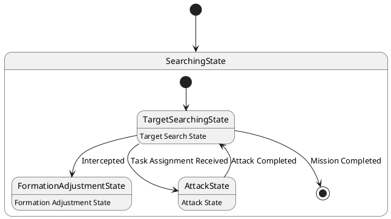

# Pair `0026`：NL + PlantUML STM0 + FCSTM STM0

[上一组 `0025`](../0025/README.md) | [返回 60 组索引](../../PAIR_INDEX.md) | [下一组 `0027`](../0027/README.md)

- LLM：`Llama`
- 模型/场景：UAV swarm state machine diagram
- 作者输出阶段：`Result with Semantic Checking`
- 作者输出单元格：`AE28`；Excel row：`28`
- Phase-I fallback：`false`
- 相对 Phase-I 是否变化：`true`
- Phase-I PlantUML SHA-256：`894d0cfae3a1dc6b26026f6c4eb1e342402deab997113ffc849c636aa68a4aba`
- NL SHA-256：`a01c022f5380700b6c13800497291640b4d64abbadce1d8984be0c14880ebeb3`
- PlantUML SHA-256：`4e8aa62819044c4101795fc1a2ab172f3564f0d0c1b8819ed6e76857b9dde324`
- FCSTM SHA-256：`c3c0d2954ce3d44d4d70abeaa37b3ad580879e1f35e84814692b0032d8ce249f`
- review subject SHA-256：`8de6eefdc01ec526a86f215acc08d44da9fab078f30ca4353bd6975e1199c9d1`
- working contract SHA-256：`b372b9c77c599cf6df9b3cb5bd63a470c0aaf61d6878b13a192ed6bc2b93c503`
- 结构裁决：`structure_preserved`
- source states / transitions：`4` / `6`
- mapped / blocked / silent drop：`6` / `0` / `0`
- final / lifecycle / body coverage：`1/1` / `0/0` / `3/3`
- concurrent region / separator coverage：`0/0` / `0/0`
- source normalization coverage：`0/0`
- official raw / validation：`state_diagram` / `state_diagram`
- official identity states / transitions：`4` / `6`
- official identity remaps：state `0` / transition endpoint `0`
- AST audit：`passed`
- legacy whole-model FCSTM execution / Discover：`false` / `false`
- working bundle usage gate：`discover_input_with_capability_mask`
- ownership source / compiler / agent：`13` / `12` / `0`
- source macro / positive identity trace / conversion boundary trace：`9` / `13` / `0`
- capability source-static / simulation / transition-trace：`eligible_with_exclusions` / `ineligible` / `ineligible`
- compiler-only diagnostic policy：`rejected_conversion_artifact`；main-result conversion artifact limit：`0`
- 主 session 对读：`pass`；ownership/macro/capability 均为 `pass`；Case 0026 passes conversion-attribution review. This does not assert NL/PlantUML correctness or runtime equivalence; authored defects remain eligible for later source-grounded Discover. No conversion-specific blocker was found in the exact reviewed occurrences.
- source anchors：`source-ref:llms_emp_feedback_final_0026.puml:line:3\|state SearchingState {, source-ref:llms_emp_feedback_final_0026.puml:line:7\|TargetSearchingState --> FormationAdjustmentState : Intercepted`；FCSTM anchors：`element-ref:source:state:SearchingState@line:6\|state SearchingState named "SearchingState" {, element-ref:compiler:transition_segment:tr_0003:segment:1@line:12\|TargetSearchingState -> FormationAdjustmentState : /Intercepted;`
- 三个原始文件：[NL](./nl.txt) | [PlantUML](./plantuml.puml) | [FCSTM](./fcstm.fcstm)
- 审计入口：[canonical](../../canonical/llms_emp_feedback_final_0026.json) | [冻结 FCSTM](../../fcstm/llms_emp_feedback_final_0026.fcstm) | [case report](../../case_reports/llms_emp_feedback_final_0026.json) | [working contract](../../working_contracts/llms_emp_feedback_final_0026.json) | [source trace](../../source_traces/llms_emp_feedback_final_0026.json) | [人工总账](../../MANUAL_REVIEW.md)

## 主 session 三方语义对应

| projection | assessment | NL anchor | PlantUML anchor | FCSTM anchor | source roots | compiler members | rationale |
|---|---|---|---|---|---|---|---|
| `direct` | `preserved` | 1 This state machine model describes the state transitions of a UAV swarm. | source-ref:llms_emp_feedback_final_0026.puml:line:3\|state SearchingState { | element-ref:source:state:SearchingState@line:6\|state SearchingState named "SearchingState" { | source:state:SearchingState | - | Case 0026 binds source:state:SearchingState to the exact authored occurrence 'state SearchingState {'; it is present as a direct FCSTM state projection with the same source identity and parent relation. |
| `macro` | `preserved_with_exclusions` | intercepted | source-ref:llms_emp_feedback_final_0026.puml:line:7\|TargetSearchingState --> FormationAdjustmentState : Intercepted | element-ref:compiler:transition_segment:tr_0003:segment:1@line:12\|TargetSearchingState -> FormationAdjustmentState : /Intercepted; | source:transition:tr_0003 | compiler:transition_segment:tr_0003:segment:1 | Case 0026 binds source:transition:tr_0003 to the exact authored occurrence 'TargetSearchingState --> FormationAdjustmentState : Intercepted'; it is present as a source-owned transition root whose cited FCSTM line belongs to a protected compiler macro; the raw label remains opaque. |

## Risk occurrence 第二遍复核

| obligation | risk tag | assessment | PlantUML evidence | FCSTM evidence | ownership evidence | rationale |
|---|---|---|---|---|---|---|
| `review:final_boundary:0001:tr_0006` | `final_boundary` | `source_fact_preserved` | source-ref:llms_emp_feedback_final_0026.puml:line:14\|TargetSearchingState --> [*] : Mission Completed | element-ref:compiler:state:llms_emp_feedback_final_0026.SearchingState.FinalWaittr_0006@line:10\|state FinalWaittr_0006 named "Completed final boundary: SearchingState.TargetSearchingState";, element-ref:compiler:transition_segment:tr_0006:segment:1@line:15\|TargetSearchingState -> FinalWaittr_0006 : /Mission_Completed; | compiler:state:llms_emp_feedback_final_0026.SearchingState.FinalWaittr_0006, compiler:transition_segment:tr_0006:segment:1, source:transition:tr_0006 | Case 0026 risk final_boundary occurrence review:final_boundary:0001:tr_0006: The authored PlantUML final boundary is preserved by the bound FCSTM termination macro rather than being converted into an ordinary user state. |
| `review:synthetic_state:0002:001-FinalWaittr_0006` | `synthetic_state` | `compiler_artifact_excluded` | source-ref:llms_emp_feedback_final_0026.puml:line:14\|TargetSearchingState --> [*] : Mission Completed | element-ref:compiler:state:llms_emp_feedback_final_0026.SearchingState.FinalWaittr_0006@line:10\|state FinalWaittr_0006 named "Completed final boundary: SearchingState.TargetSearchingState"; | compiler:state:llms_emp_feedback_final_0026.SearchingState.FinalWaittr_0006, source:transition:tr_0006 | Case 0026 risk synthetic_state occurrence review:synthetic_state:0002:001-FinalWaittr_0006: The helper state is a protected compiler-owned projection for a source structural fact; diagnostics on the helper itself are conversion artifacts. |

## 作者阶段 lineage

| stage | output cell | present | output SHA-256 | feedback | resolved |
|---|---|---|---|---|---|
| `phase_i_generation` | `I28` | `true` | `894d0cfae3a1dc6b26026f6c4eb1e342402deab997113ffc849c636aa68a4aba` | - | - |
| `phase_ii_format` | `U28` | `true` | `6e6df70fe881a9acdd6063bf897c3856cfb03c137d3ade2d9ffd4442372f8756` | syntax error： stm UAV Swarm State Machine | YES |
| `phase_ii_grammar` | `Z28` | `false` | `-` | - | - |
| `phase_ii_semantic` | `AE28` | `true` | `4e8aa62819044c4101795fc1a2ab172f3564f0d0c1b8819ed6e76857b9dde324` | 1. missing regions | - |

## Official identity ledger

- status：`aligned`
- canonical / official states：`4` / `4`
- aligned transition endpoints：`6`

本组 state identity 无需重映射。

本组 transition endpoint 无需重映射。

## Source normalization ledger

本组没有 source-input normalization。

## Concurrent region ledger

本组没有 PlantUML orthogonal/concurrent region separator。

## Operational debt

| reason code | count |
|---|---:|
| `R45.DEBT.opaque_state_body_semantics` | 3 |
| `R45.DEBT.opaque_transition_label_semantics` | 4 |

## NL

```text
1 This state machine model describes the state transitions of a UAV swarm.
2 Before the mission is completed, the UAV swarm continuously performs target search tasks, during which it operates within three different state areas.
3 When the UAV swarm is intercepted, it transitions to the formation adjustment state.
4 During flight, if task assignment information is received, it enters the attack state. After completing the attack, the number of UAVs in the swarm decreases accordingly.
```

## 作者 Phase-II 最终 PlantUML STM0



## 转换后 FCSTM STM0

```fcstm
state llms_emp_feedback_final_0026 named "llms_emp_feedback_final_0026" {
    event Intercepted named "Intercepted";
    event Task_Assignment_Received named "Task Assignment Received";
    event Attack_Completed named "Attack Completed";
    event Mission_Completed named "Mission Completed";
    state SearchingState named "SearchingState" {
        state TargetSearchingState named "TargetSearchingState\n[PlantUML body] Target Search State";
        state FormationAdjustmentState named "FormationAdjustmentState\n[PlantUML body] Formation Adjustment State";
        state AttackState named "AttackState\n[PlantUML body] Attack State";
        state FinalWaittr_0006 named "Completed final boundary: SearchingState.TargetSearchingState";
        [*] -> TargetSearchingState;
        TargetSearchingState -> FormationAdjustmentState : /Intercepted;
        TargetSearchingState -> AttackState : /Task_Assignment_Received;
        AttackState -> TargetSearchingState : /Attack_Completed;
        TargetSearchingState -> FinalWaittr_0006 : /Mission_Completed;
    }
    [*] -> SearchingState;
}
```

[上一组 `0025`](../0025/README.md) | [返回 60 组索引](../../PAIR_INDEX.md) | [下一组 `0027`](../0027/README.md)
