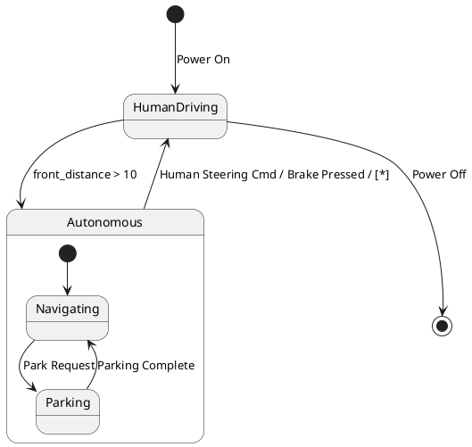

# Pair `0030`：NL + PlantUML STM0 + FCSTM STM0

[上一组 `0029`](../0029/README.md) | [返回 60 组索引](../../PAIR_INDEX.md) | [下一组 `0031`](../0031/README.md)

- LLM：`Kimi`
- 模型/场景：high-level driving module
- 作者输出阶段：`Result with Semantic Checking`
- 作者输出单元格：`AE32`；Excel row：`32`
- Phase-I fallback：`false`
- 相对 Phase-I 是否变化：`true`
- Phase-I PlantUML SHA-256：`e1c89866e4ea2332ca45c2755508cf1c0742595876037ba3c3d0ae7f10feb9c9`
- NL SHA-256：`f1c3dc88371b8256352e7ab6ee7eb42424de6e11dfde70d185f224dd1d05a7a8`
- PlantUML SHA-256：`3a57437b4affea98105ee794349865f92f42e01865786658aeeaf6529c76237a`
- FCSTM SHA-256：`b8c4c02d4b8e6d1ecc53e5d9bd442aba3a0dbc24eeeccf34a9362d66f1b7ea8a`
- 结构裁决：`structure_preserved`
- source states / transitions：`4` / `7`
- mapped / blocked / silent drop：`7` / `0` / `0`
- final / lifecycle / body coverage：`1/1` / `0/0` / `0/0`
- concurrent region / separator coverage：`0/0` / `0/0`
- source normalization coverage：`0/0`
- official raw / validation：`state_diagram` / `state_diagram`
- official identity states / transitions：`4` / `7`
- official identity remaps：state `0` / transition endpoint `0`
- AST audit：`passed`
- FCSTM execution eligible：`false`
- Discover eligible：`false`
- 主 session 对读：完整对读：HumanDriving 空 composite、Autonomous 两子态和 7 条边全保留；Power On initial 用 wait，HumanDriving 缺 child initial 用 UnspecifiedInitial，Power Off 仍为 root final。
- 三个原始文件：[NL](./nl.txt) | [PlantUML](./plantuml.puml) | [FCSTM](./fcstm.fcstm)
- 审计入口：[canonical](../../canonical/llms_emp_feedback_final_0030.json) | [冻结 FCSTM](../../fcstm/llms_emp_feedback_final_0030.fcstm) | [case report](../../case_reports/llms_emp_feedback_final_0030.json) | [人工总账](../../MANUAL_REVIEW.md)

## 作者阶段 lineage

| stage | output cell | present | output SHA-256 | feedback | resolved |
|---|---|---|---|---|---|
| `phase_i_generation` | `I32` | `true` | `e1c89866e4ea2332ca45c2755508cf1c0742595876037ba3c3d0ae7f10feb9c9` | - | - |
| `phase_ii_format` | `U32` | `false` | `-` | - | - |
| `phase_ii_grammar` | `Z32` | `false` | `-` | - | - |
| `phase_ii_semantic` | `AE32` | `true` | `3a57437b4affea98105ee794349865f92f42e01865786658aeeaf6529c76237a` | 1. missing final state | 1.0 |

## Official identity ledger

- status：`aligned`
- canonical / official states：`4` / `4`
- aligned transition endpoints：`7`

本组 state identity 无需重映射。

本组 transition endpoint 无需重映射。

## Source normalization ledger

本组没有 source-input normalization。

## Concurrent region ledger

本组没有 PlantUML orthogonal/concurrent region separator。

## Operational debt

| reason code | count |
|---|---:|
| `R45.DEBT.missing_explicit_initial` | 1 |
| `R45.DEBT.opaque_transition_label_semantics` | 6 |

## NL

```text
1 The human driving mode is represented by a simple state. 2 The autonomous mode has sub-states and is represented by a sub machine state. 3. when power on, the system turn into human driving mode 4when front_distance > 10, auto transport to autonomous state 4. transit to human driving mode when receive human steering cmd, brake pressed, in (auto final) 5 when power off, it will transit to final state
```

## 作者 Phase-II 最终 PlantUML STM0



## 转换后 FCSTM STM0

```fcstm
state llms_emp_feedback_final_0030 named "llms_emp_feedback_final_0030" {
    event Power_On named "Power On";
    event Park_Request named "Park Request";
    event Parking_Complete named "Parking Complete";
    event front_distance_10 named "front_distance > 10";
    event Human_Steering_Cmd_Brake_Pressed named "Human Steering Cmd / Brake Pressed / [*]";
    event Power_Off named "Power Off";
    state InitialWaittr_0001 named "Awaiting initial event: Power On";
    state HumanDriving named "HumanDriving" {
        state UnspecifiedInitial named "Unspecified initial";
        [*] -> UnspecifiedInitial;
    }
    state Autonomous named "Autonomous" {
        state Navigating named "Navigating";
        state Parking named "Parking";
        [*] -> Navigating;
        Navigating -> Parking : /Park_Request;
        Parking -> Navigating : /Parking_Complete;
    }
    [*] -> InitialWaittr_0001;
    InitialWaittr_0001 -> HumanDriving : /Power_On;
    !HumanDriving -> Autonomous : /front_distance_10;
    !Autonomous -> HumanDriving : /Human_Steering_Cmd_Brake_Pressed;
    !HumanDriving -> [*] : /Power_Off;
}
```

[上一组 `0029`](../0029/README.md) | [返回 60 组索引](../../PAIR_INDEX.md) | [下一组 `0031`](../0031/README.md)
