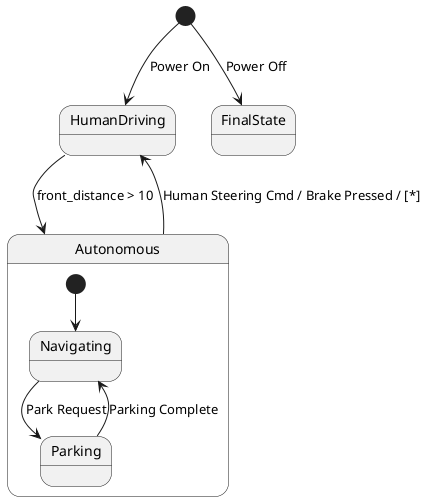

# Pair `0030`：NL + PlantUML STM0 + FCSTM STM0

[上一组 `0029`](../0029/README.md) | [返回 60 组索引](../../PAIR_INDEX.md) | [下一组 `0031`](../0031/README.md)

- LLM：`Kimi`
- 模型/场景：high-level driving module
- NL SHA-256：`f1c3dc88371b8256352e7ab6ee7eb42424de6e11dfde70d185f224dd1d05a7a8`
- PlantUML SHA-256：`e1c89866e4ea2332ca45c2755508cf1c0742595876037ba3c3d0ae7f10feb9c9`
- FCSTM SHA-256：`b876c868b3325b1c315c34b2d1aade862785fbe76ded3a0225c190a9d132f7a8`
- 结构裁决：`structure_preserved`
- FCSTM execution eligible：`false`
- Discover eligible：`false`
- 主 session 对读：两条 root initial event wait 保持顺序；`/ [*]` 只作 opaque label。
- 三个原始文件：[NL](./nl.txt) | [PlantUML](./plantuml.puml) | [FCSTM](./fcstm.fcstm)
- 审计入口：[canonical](../../canonical/llms_emp_stm_results_0030.json) | [冻结 FCSTM](../../fcstm/llms_emp_stm_results_0030.fcstm) | [case report](../../case_reports/llms_emp_stm_results_0030.json) | [人工总账](../../MANUAL_REVIEW.md)

## NL

```text
1 The human driving mode is represented by a simple state. 2 The autonomous mode has sub-states and is represented by a sub machine state. 3. when power on, the system turn into human driving mode 4when front_distance > 10, auto transport to autonomous state 4. transit to human driving mode when receive human steering cmd, brake pressed, in (auto final) 5 when power off, it will transit to final state
```

## 原装 PlantUML STM0



## 转换后 FCSTM STM0

```fcstm
state llms_emp_stm_results_0030 named "llms_emp_stm_results_0030" {
    event Power_On named "Power On";
    event Park_Request named "Park Request";
    event Parking_Complete named "Parking Complete";
    event front_distance_10 named "front_distance > 10";
    event Human_Steering_Cmd_Brake_Pressed named "Human Steering Cmd / Brake Pressed / [*]";
    event Power_Off named "Power Off";
    state InitialWaittr_0001 named "Awaiting initial event: Power On";
    state InitialWaittr_0007 named "Awaiting initial event: Power Off";
    state HumanDriving named "HumanDriving";
    state Autonomous named "Autonomous" {
        state Navigating named "Navigating";
        state Parking named "Parking";
        [*] -> Navigating;
        Navigating -> Parking : /Park_Request;
        Parking -> Navigating : /Parking_Complete;
    }
    state FinalState named "FinalState";
    [*] -> InitialWaittr_0001;
    InitialWaittr_0001 -> HumanDriving : /Power_On;
    HumanDriving -> Autonomous : /front_distance_10;
    !Autonomous -> HumanDriving : /Human_Steering_Cmd_Brake_Pressed;
    [*] -> InitialWaittr_0007;
    InitialWaittr_0007 -> FinalState : /Power_Off;
}
```

[上一组 `0029`](../0029/README.md) | [返回 60 组索引](../../PAIR_INDEX.md) | [下一组 `0031`](../0031/README.md)
